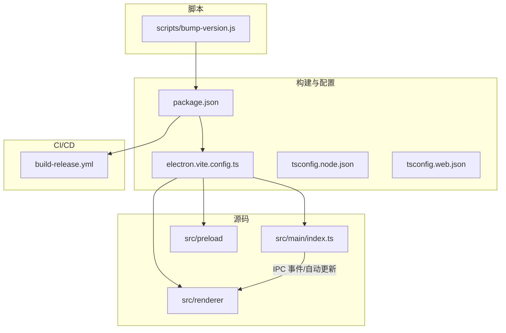
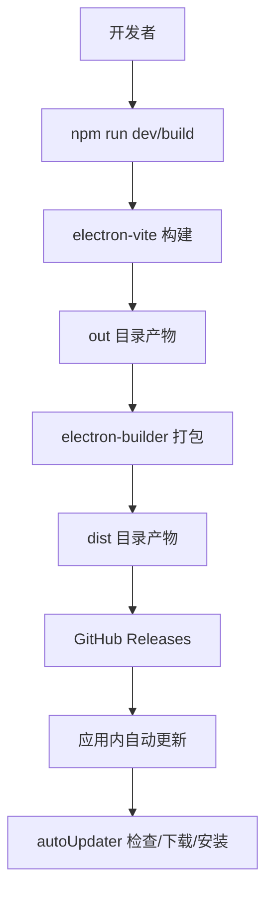
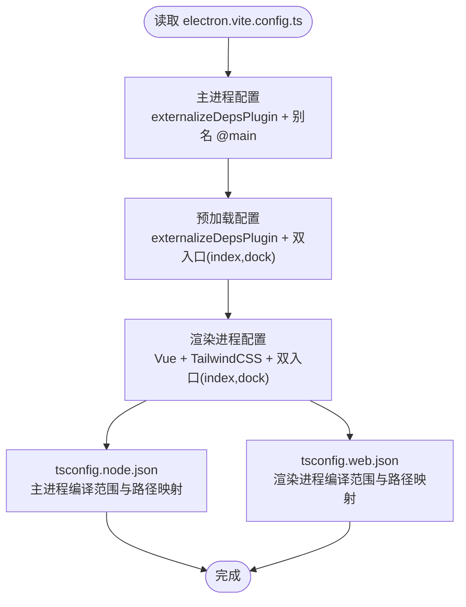
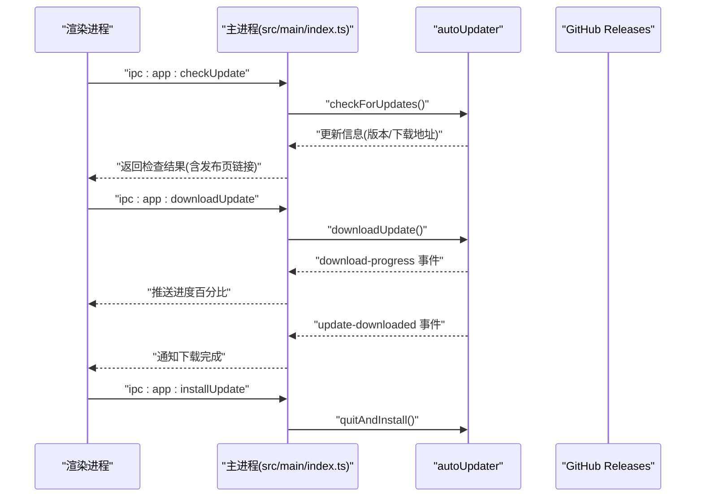
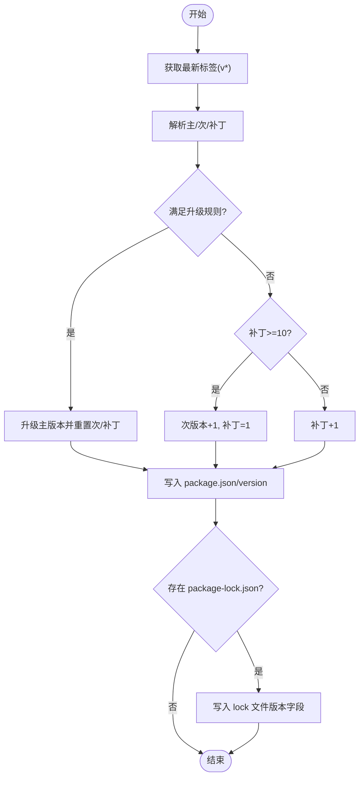
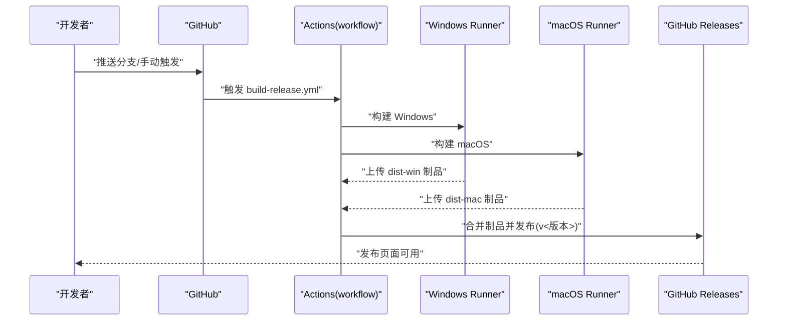
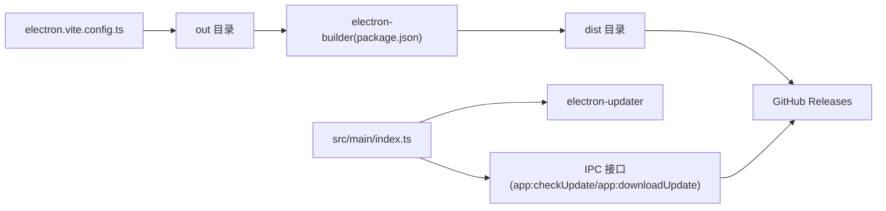

# 构建与部署

<cite>
**本文引用的文件**
- [electron.vite.config.ts](file://electron.vite.config.ts)
- [package.json](file://package.json)
- [.github/workflows/build-release.yml](file://.github/workflows/build-release.yml)
- [scripts/bump-version.js](file://scripts/bump-version.js)
- [src/main/index.ts](file://src/main/index.ts)
- [tsconfig.json](file://tsconfig.json)
- [tsconfig.node.json](file://tsconfig.node.json)
- [tsconfig.web.json](file://tsconfig.web.json)
- [README.md](file://README.md)
- [.gitignore](file://.gitignore)
</cite>

## 目录
1. [引言](#引言)
2. [项目结构](#项目结构)
3. [核心组件](#核心组件)
4. [架构总览](#架构总览)
5. [详细组件分析](#详细组件分析)
6. [依赖关系分析](#依赖关系分析)
7. [性能考虑](#性能考虑)
8. [故障排查指南](#故障排查指南)
9. [结论](#结论)
10. [附录](#附录)

## 引言
本文件面向开发者工具箱项目的构建与部署，围绕以下目标展开：
- Electron-Vite 构建配置的设置与优化：多平台构建、资源打包策略、代码分割与别名映射。
- 自动更新机制：GitHub Releases 集成、版本检查逻辑、更新下载与安装处理。
- 版本管理脚本：版本升级工具与发布流程自动化。
- CI/CD 工作流：GitHub Actions 配置与部署最佳实践。
- 构建优化技巧、性能监控与发布后维护策略。

## 项目结构
项目采用 Electron + Vue 3 + TypeScript 技术栈，使用 electron-vite 作为开发与构建工具，electron-builder 负责打包与分发。关键目录与文件如下：
- 构建与配置
  - electron.vite.config.ts：主进程、预加载与渲染进程的构建入口与别名配置。
  - package.json：脚本、构建配置（electron-builder）、依赖与发布信息。
  - tsconfig.node.json / tsconfig.web.json：主进程与渲染进程的 TypeScript 编译配置。
- 源码组织
  - src/main：主进程与 IPC 服务。
  - src/preload：安全桥接 API。
  - src/renderer：Vue 渲染进程。
- 自动更新与脚本
  - src/main/index.ts：自动更新逻辑与 IPC 接口。
  - scripts/bump-version.js：版本号升级脚本。
- CI/CD
  - .github/workflows/build-release.yml：跨平台构建与发布到 GitHub Releases 的工作流。
- 其他
  - README.md：功能概览、常用命令与发布说明。
  - .gitignore：忽略构建产物与缓存。

**图示来源**
- [electron.vite.config.ts:1-49](file://electron.vite.config.ts#L1-L49)
- [package.json:1-120](file://package.json#L1-L120)
- [tsconfig.node.json:1-19](file://tsconfig.node.json#L1-L19)
- [tsconfig.web.json:1-18](file://tsconfig.web.json#L1-L18)
- [.github/workflows/build-release.yml:1-91](file://.github/workflows/build-release.yml#L1-L91)
- [scripts/bump-version.js:1-72](file://scripts/bump-version.js#L1-L72)
- [src/main/index.ts:1-444](file://src/main/index.ts#L1-L444)

**章节来源**
- [README.md:140-163](file://README.md#L140-L163)
- [electron.vite.config.ts:1-49](file://electron.vite.config.ts#L1-L49)
- [package.json:74-118](file://package.json#L74-L118)
- [tsconfig.json:1-8](file://tsconfig.json#L1-L8)
- [tsconfig.node.json:1-19](file://tsconfig.node.json#L1-L19)
- [tsconfig.web.json:1-18](file://tsconfig.web.json#L1-L18)

## 核心组件
- Electron-Vite 构建配置
  - 主进程与预加载进程通过 externalizeDepsPlugin 外置依赖，减少打包体积。
  - 预加载与渲染进程分别声明多入口（index 与 dock），便于独立构建与按需加载。
  - 别名映射简化导入路径，提升开发体验。
- electron-builder 打包与发布
  - appId、productName、输出目录与文件列表配置明确。
  - extraResources 将 resources 目录打入安装包。
  - Windows 使用 NSIS 安装包；GitHub 发布信息配置于 publish 字段。
- 自动更新（electron-updater）
  - 主进程配置 autoUpdater：非自动下载、应用退出时自动安装、允许预发布版本。
  - 通过 IPC 暴露检查更新、下载更新、安装更新接口，并在渲染层展示进度与通知。
- 版本管理脚本
  - 读取最新 Git 标签，按规则升级版本（主/次/补丁），并同步更新 package.json 与 package-lock.json。
- CI/CD 工作流
  - Windows 与 macOS 并行构建，产物上传为制品；随后合并制品并发布到 GitHub Releases，标记为预发布。

**章节来源**
- [electron.vite.config.ts:6-48](file://electron.vite.config.ts#L6-L48)
- [package.json:28-73](file://package.json#L28-L73)
- [package.json:74-118](file://package.json#L74-L118)
- [src/main/index.ts:4-39](file://src/main/index.ts#L4-L39)
- [src/main/index.ts:218-294](file://src/main/index.ts#L218-L294)
- [scripts/bump-version.js:51-72](file://scripts/bump-version.js#L51-L72)
- [.github/workflows/build-release.yml:13-91](file://.github/workflows/build-release.yml#L13-L91)

## 架构总览
下图展示了从开发到发布的整体流程，以及自动更新在运行时的交互：

**图示来源**
- [package.json:21-26](file://package.json#L21-L26)
- [package.json:74-118](file://package.json#L74-L118)
- [.github/workflows/build-release.yml:44-91](file://.github/workflows/build-release.yml#L44-L91)
- [src/main/index.ts:34-55](file://src/main/index.ts#L34-L55)

## 详细组件分析

### Electron-Vite 构建配置分析
- 主进程（main）
  - 使用 externalizeDepsPlugin 外置依赖，降低打包体积。
  - 路径别名 @main 指向 src/main，便于模块导入。
- 预加载进程（preload）
  - 外置依赖，双入口 index 与 dock，分别对应主窗口与 Dock 窗口的预加载脚本。
  - 通过 Rollup input 明确入口文件，利于按需加载与代码分割。
- 渲染进程（renderer）
  - 使用 Vue 与 TailwindCSS 插件。
  - 双入口 index 与 dock，分别对应主界面与 Dock 页面。
  - 路径别名 @renderer 与 @ 指向 src/renderer/src，统一导入路径。
- 类型配置
  - tsconfig.node.json 与 tsconfig.web.json 分别覆盖主进程与渲染进程的编译范围与路径映射。

**图示来源**
- [electron.vite.config.ts:6-48](file://electron.vite.config.ts#L6-L48)
- [tsconfig.node.json:1-19](file://tsconfig.node.json#L1-L19)
- [tsconfig.web.json:1-18](file://tsconfig.web.json#L1-L18)

**章节来源**
- [electron.vite.config.ts:6-48](file://electron.vite.config.ts#L6-L48)
- [tsconfig.node.json:1-19](file://tsconfig.node.json#L1-L19)
- [tsconfig.web.json:1-18](file://tsconfig.web.json#L1-L18)

### 自动更新机制分析
- 配置与初始化
  - 主进程启用 autoUpdater，设置非自动下载、退出时自动安装、允许预发布版本。
  - 在打包状态下配置 GitHub 仓库信息，避免开发环境误触发。
- 版本检查逻辑
  - IPC 暴露 app:checkUpdate，开发模式直接返回当前版本无更新。
  - 生产模式通过 autoUpdater.checkForUpdates 获取最新版本信息，构造发布页面链接。
- 下载与安装
  - IPC 暴露 app:downloadUpdate 与 app:installUpdate，下载完成后通过 quitAndInstall 安装。
  - 下载进度通过 download-progress 事件推送到渲染层，更新 UI。
- 错误处理
  - 统一捕获错误，区分网络超时/连接拒绝/域名不可达等场景，提示用户配置代理。
- 代理与网络
  - IPC 提供 app:setProxy，设置渲染会话代理并同步设置环境变量以影响 autoUpdater。

**图示来源**
- [src/main/index.ts:218-294](file://src/main/index.ts#L218-L294)

**章节来源**
- [src/main/index.ts:34-55](file://src/main/index.ts#L34-L55)
- [src/main/index.ts:129-157](file://src/main/index.ts#L129-L157)
- [src/main/index.ts:218-294](file://src/main/index.ts#L218-L294)

### 版本管理脚本分析
- 功能概述
  - 读取最新 Git 标签（以 v 开头并按语义化版本排序），解析主/次/补丁三段。
  - 按规则升级版本：当补丁≥10 且次版本≥9 时升主版本并重置次/补丁；否则在补丁基础上递增；当补丁≥10 时升次版本并将补丁置为 1。
  - 更新 package.json 与 package-lock.json 的 version 字段，确保与 Git 标签一致。
- 使用方式
  - 通过 npm 脚本调用 node scripts/bump-version.js，生成新版本标签后提交并推送。

**图示来源**
- [scripts/bump-version.js:51-72](file://scripts/bump-version.js#L51-L72)

**章节来源**
- [scripts/bump-version.js:1-72](file://scripts/bump-version.js#L1-L72)

### CI/CD 工作流分析
- 触发条件
  - 推送至 main 分支或手动触发 workflow_dispatch。
- 权限
  - 赋予 contents: write 权限以便发布。
- 构建矩阵
  - Windows 与 macOS 并行构建，矩阵变量包含 os 与 build。
- 步骤
  - 检出代码、设置 Node.js、安装依赖、执行 npm run build:win 或 build:mac。
  - 上传 dist-* 产物为制品。
  - 在 Ubuntu 上合并制品，读取 package.json 中的版本，发布到 GitHub Releases，标记为预发布。
- 注意事项
  - macOS 构建默认跳过签名（CSC_IDENTITY_AUTO_DISCOVERY=false），如需签名请在 CI 中配置证书。

**图示来源**
- [.github/workflows/build-release.yml:13-91](file://.github/workflows/build-release.yml#L13-L91)

**章节来源**
- [.github/workflows/build-release.yml:1-91](file://.github/workflows/build-release.yml#L1-L91)

## 依赖关系分析
- 构建链路
  - electron.vite.config.ts 决定主/预加载/渲染进程的入口与插件。
  - package.json 的 scripts 与 build 字段驱动 electron-builder 打包与发布。
  - CI 工作流调用 npm run build:* 生成 dist 产物并上传。
- 运行时依赖
  - electron-updater 与 GitHub Releases 集成，主进程通过 IPC 对外暴露更新能力。
  - auto-launch 用于开机自启动，session.setProxy 与环境变量 HTTPS_PROXY/HTTP_PROXY 用于代理设置。

**图示来源**
- [electron.vite.config.ts:6-48](file://electron.vite.config.ts#L6-L48)
- [package.json:74-118](file://package.json#L74-L118)
- [src/main/index.ts:218-294](file://src/main/index.ts#L218-L294)

**章节来源**
- [package.json:21-26](file://package.json#L21-L26)
- [package.json:74-118](file://package.json#L74-L118)
- [src/main/index.ts:307-327](file://src/main/index.ts#L307-L327)

## 性能考虑
- 代码分割与按需加载
  - 预加载与渲染进程均配置多入口，有利于按需加载与缓存优化。
- 外置依赖
  - externalizeDepsPlugin 减少打包体积，缩短构建时间与启动时间。
- 资源打包策略
  - 使用 extraResources 将 resources 目录打入安装包，保证图标与静态资源可用。
- 构建产物与缓存
  - .gitignore 忽略 node_modules、out、dist、.cache、日志，避免污染仓库与加速 CI。
- 运行时网络优化
  - 通过代理设置与错误分类，提升更新失败时的用户体验与可诊断性。

**章节来源**
- [.gitignore:1-6](file://.gitignore#L1-L6)
- [electron.vite.config.ts:8,16,38](file://electron.vite.config.ts#L8,L16,L38)
- [package.json:84-92](file://package.json#L84-L92)

## 故障排查指南
- 自动更新失败
  - 症状：检查更新或下载更新报错，提示网络超时/连接被拒/域名不可达。
  - 处理：在应用设置中配置代理（如 http://127.0.0.1:7890），主进程会同步设置 session 代理与环境变量。
  - 参考：IPC app:setProxy 与错误事件处理。
- 打包产物缺失
  - 症状：dist 目录为空或缺少安装包。
  - 处理：确认 CI 矩阵包含对应平台；检查 npm run build:* 是否成功；核对 electron-builder 配置与 publish 信息。
- 版本不一致
  - 症状：GitHub Releases 标签与应用内版本不一致。
  - 处理：使用 bump-version.js 生成新版本并提交标签；CI 读取 package.json 版本进行发布。
- 开机自启动无效
  - 症状：设置开机自启动后未生效。
  - 处理：确认 auto-launch 配置与权限；在主进程 IPC app:getAutoLaunch 与 app:setAutoLaunch 返回值中定位问题。

**章节来源**
- [src/main/index.ts:140-157](file://src/main/index.ts#L140-L157)
- [src/main/index.ts:307-327](file://src/main/index.ts#L307-L327)
- [scripts/bump-version.js:51-72](file://scripts/bump-version.js#L51-L72)
- [.github/workflows/build-release.yml:64-85](file://.github/workflows/build-release.yml#L64-L85)

## 结论
本项目通过 electron-vite 与 electron-builder 实现了高效的多平台构建与发布，并结合 GitHub Actions 完成自动化流水线。主进程内置 electron-updater，配合 IPC 为应用提供了完善的自动更新能力。版本管理脚本与 CI 流程共同保障了发布质量与一致性。建议在后续迭代中持续关注构建体积、更新稳定性与跨平台兼容性。

## 附录
- 常用命令
  - 开发：npm run dev
  - 构建：npm run build
  - 平台构建：npm run build:win / build:mac / build:linux
  - 版本升级：npm run bump:patch
- 发布说明
  - electron-builder 输出目录为 dist，发布信息指向 GitHub 仓库。
  - 应用内自动更新通过 GitHub Releases 检测与下载。

**章节来源**
- [README.md:86-114](file://README.md#L86-L114)
- [package.json:21-26](file://package.json#L21-L26)
- [package.json:111-118](file://package.json#L111-L118)
- [README.md:155-163](file://README.md#L155-L163)