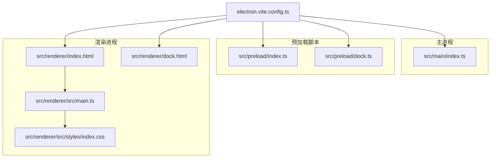
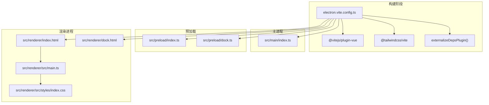
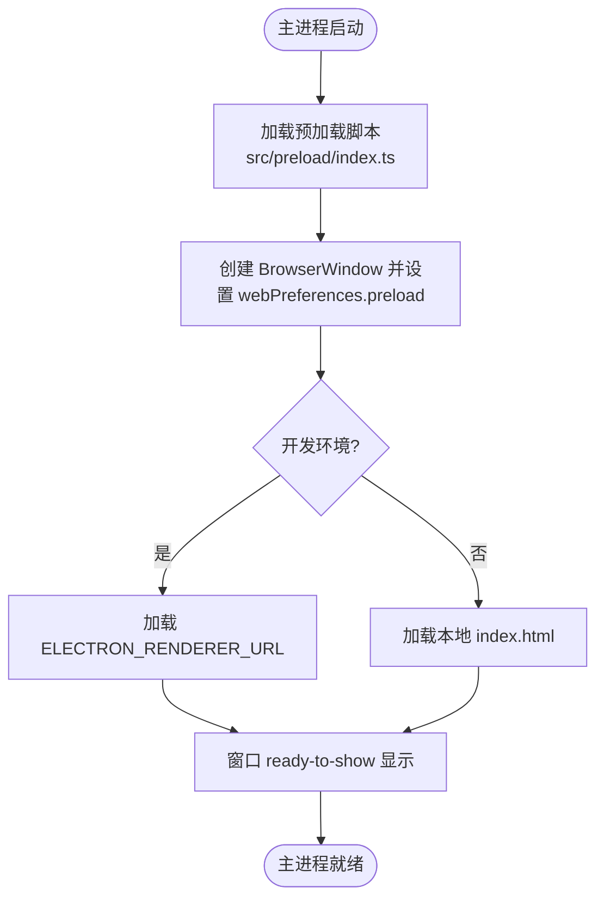
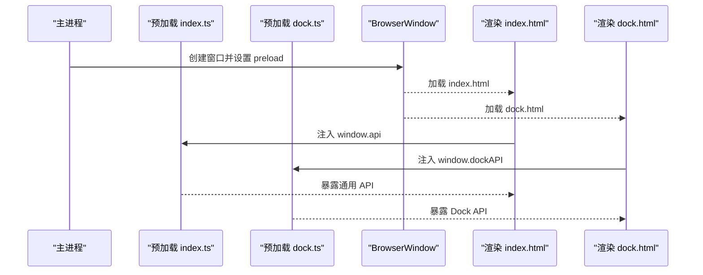
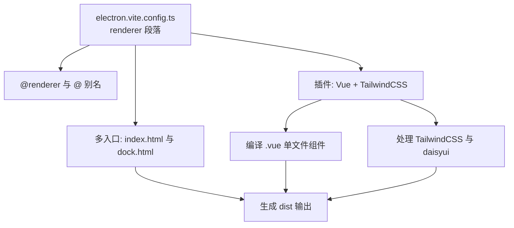
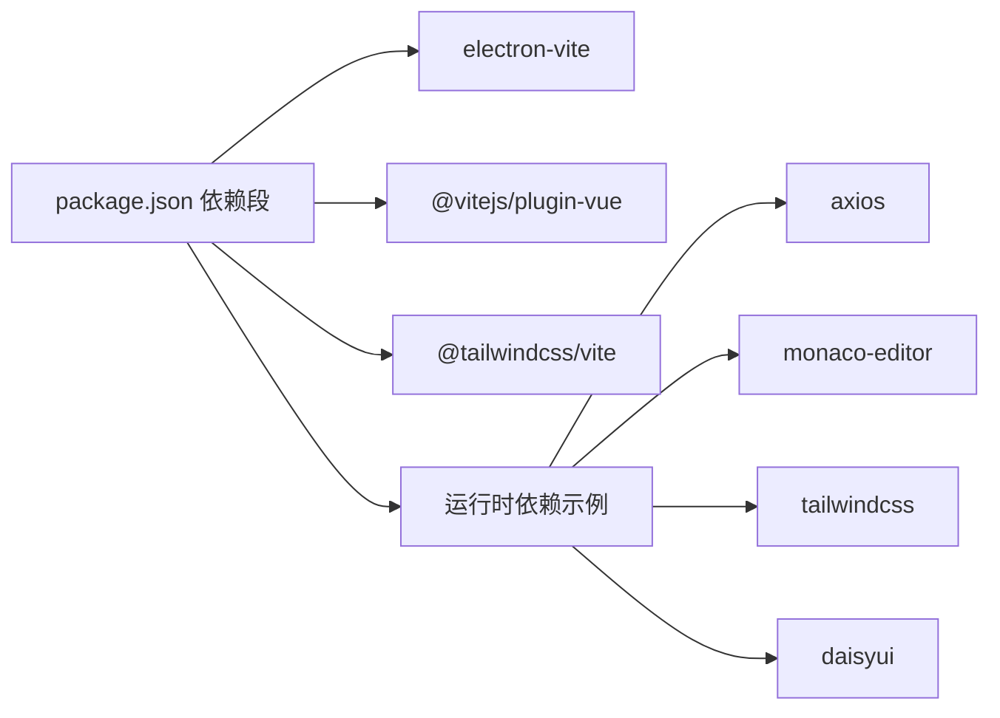

# 构建配置

<cite>
**本文引用的文件**
- [electron.vite.config.ts](file://electron.vite.config.ts)
- [package.json](file://package.json)
- [tsconfig.json](file://tsconfig.json)
- [tsconfig.node.json](file://tsconfig.node.json)
- [tsconfig.web.json](file://tsconfig.web.json)
- [src/main/index.ts](file://src/main/index.ts)
- [src/preload/index.ts](file://src/preload/index.ts)
- [src/preload/dock.ts](file://src/preload/dock.ts)
- [src/renderer/src/main.ts](file://src/renderer/src/main.ts)
- [src/renderer/index.html](file://src/renderer/index.html)
- [src/renderer/dock.html](file://src/renderer/dock.html)
- [src/renderer/src/styles/index.css](file://src/renderer/src/styles/index.css)
- [src/renderer/src/App.vue](file://src/renderer/src/App.vue)
- [eslint.config.mjs](file://eslint.config.mjs)
</cite>

## 目录
1. [简介](#简介)
2. [项目结构](#项目结构)
3. [核心组件](#核心组件)
4. [架构总览](#架构总览)
5. [详细组件分析](#详细组件分析)
6. [依赖关系分析](#依赖关系分析)
7. [性能考量](#性能考量)
8. [故障排查指南](#故障排查指南)
9. [结论](#结论)
10. [附录](#附录)

## 简介
本文件面向开发者工具箱项目的构建与配置，围绕 Electron-Vite 的多进程（主进程、预加载脚本、渲染进程）与多入口（index.html 与 dock.html）构建体系，系统性梳理以下主题：
- 主进程、预加载脚本与渲染进程的独立构建配置
- 路径别名（@main、@preload、@renderer）的作用与配置方法
- Rollup 多入口点（index 与 dock）支持
- 插件配置（Vue 插件与 TailwindCSS 插件）的集成方式
- 构建优化技巧（代码分割、资源打包策略、依赖外部化）
- 开发与生产环境的差异与最佳实践

## 项目结构
该项目采用 Electron-Vite 的多进程与多入口模式组织前端资源：
- 主进程：位于 src/main，负责应用生命周期、窗口与系统交互
- 预加载脚本：位于 src/preload，提供安全的渲染进程 API 暴露
- 渲染进程：位于 src/renderer，包含主界面 index.html 与 Dock 界面 dock.html
- 类型检查：通过 tsconfig.node.json 与 tsconfig.web.json 分别约束主进程与渲染进程的 TS 路径别名

图表来源
- [electron.vite.config.ts:1-49](file://electron.vite.config.ts#L1-L49)
- [src/main/index.ts:1-444](file://src/main/index.ts#L1-L444)
- [src/preload/index.ts:1-229](file://src/preload/index.ts#L1-L229)
- [src/preload/dock.ts:1-19](file://src/preload/dock.ts#L1-L19)
- [src/renderer/index.html:1-17](file://src/renderer/index.html#L1-L17)
- [src/renderer/dock.html:1-464](file://src/renderer/dock.html#L1-L464)
- [src/renderer/src/main.ts:1-6](file://src/renderer/src/main.ts#L1-L6)
- [src/renderer/src/styles/index.css:1-171](file://src/renderer/src/styles/index.css#L1-L171)

章节来源
- [electron.vite.config.ts:1-49](file://electron.vite.config.ts#L1-L49)
- [tsconfig.json:1-8](file://tsconfig.json#L1-L8)
- [tsconfig.node.json:1-19](file://tsconfig.node.json#L1-L19)
- [tsconfig.web.json:1-18](file://tsconfig.web.json#L1-L18)

## 核心组件
- Electron-Vite 主配置：统一声明主进程、预加载与渲染进程的构建参数、插件与路径别名，并为预加载与渲染进程分别配置多入口点
- 主进程入口：src/main/index.ts，负责窗口创建、IPC 通信、托盘与自动更新等
- 预加载脚本：src/preload/index.ts 提供通用 API；src/preload/dock.ts 提供 Dock 窗口专用 API
- 渲染进程：src/renderer/index.html 与 src/renderer/dock.html 对应两个入口页面，分别由 src/renderer/src/main.ts 启动 Vue 应用

章节来源
- [electron.vite.config.ts:6-48](file://electron.vite.config.ts#L6-L48)
- [src/main/index.ts:110-174](file://src/main/index.ts#L110-L174)
- [src/preload/index.ts:1-229](file://src/preload/index.ts#L1-L229)
- [src/preload/dock.ts:1-19](file://src/preload/dock.ts#L1-L19)
- [src/renderer/index.html:1-17](file://src/renderer/index.html#L1-L17)
- [src/renderer/dock.html:1-464](file://src/renderer/dock.html#L1-L464)
- [src/renderer/src/main.ts:1-6](file://src/renderer/src/main.ts#L1-L6)

## 架构总览
下图展示 Electron-Vite 在本项目中的整体构建与运行时交互：

图表来源
- [electron.vite.config.ts:1-49](file://electron.vite.config.ts#L1-L49)
- [src/renderer/src/main.ts:1-6](file://src/renderer/src/main.ts#L1-L6)
- [src/renderer/src/styles/index.css:1-171](file://src/renderer/src/styles/index.css#L1-L171)

## 详细组件分析

### 主进程构建配置（@main 别名与依赖外部化）
- 路径别名：在主进程与预加载的 tsconfig 中均配置了 @main/* 与 @preload/*，确保在 TS 层面可直接使用别名导入
- 依赖外部化：主进程使用 externalizeDepsPlugin() 将依赖交由原生打包流程处理，减少 Vite 处理负担
- 运行时加载：主进程通过 preload 路径加载预加载脚本，渲染进程入口由主进程根据开发/生产环境动态决定

图表来源
- [src/main/index.ts:110-174](file://src/main/index.ts#L110-L174)

章节来源
- [electron.vite.config.ts:7-14](file://electron.vite.config.ts#L7-L14)
- [tsconfig.node.json:13-16](file://tsconfig.node.json#L13-L16)
- [src/main/index.ts:122-173](file://src/main/index.ts#L122-L173)

### 预加载脚本构建配置（@preload 别名与多入口）
- 路径别名：@preload/* 在 tsconfig.node.json 中配置，便于主进程与预加载层使用
- 多入口点：预加载脚本配置了 index 与 dock 两个入口，分别对应主界面与 Dock 窗口
- API 暴露：index.ts 暴露通用 API，dock.ts 暴露 Dock 专用 API，二者通过 contextBridge 安全暴露至渲染进程

图表来源
- [electron.vite.config.ts:15-30](file://electron.vite.config.ts#L15-L30)
- [src/preload/index.ts:215-229](file://src/preload/index.ts#L215-L229)
- [src/preload/dock.ts:8-19](file://src/preload/dock.ts#L8-L19)
- [src/main/index.ts:122-123](file://src/main/index.ts#L122-L123)

章节来源
- [electron.vite.config.ts:15-30](file://electron.vite.config.ts#L15-L30)
- [tsconfig.node.json:13-16](file://tsconfig.node.json#L13-L16)
- [src/preload/index.ts:1-229](file://src/preload/index.ts#L1-L229)
- [src/preload/dock.ts:1-19](file://src/preload/dock.ts#L1-L19)

### 渲染进程构建配置（@renderer 与 @ 别名、多入口、插件）
- 路径别名：@renderer/* 与 @/* 在 tsconfig.web.json 中配置，便于在 Vue 组件与样式中使用
- 多入口点：渲染进程配置 index 与 dock 两个 HTML 入口，分别对应主界面与 Dock 界面
- 插件集成：启用 @vitejs/plugin-vue 与 @tailwindcss/vite，实现 Vue SFC 编译与 TailwindCSS 样式处理
- 样式体系：index.css 引入 tailwindcss 与 daisyui，结合自定义变量与渐变边框等视觉设计

图表来源
- [electron.vite.config.ts:31-48](file://electron.vite.config.ts#L31-L48)
- [tsconfig.web.json:12-15](file://tsconfig.web.json#L12-L15)
- [src/renderer/src/styles/index.css:1-3](file://src/renderer/src/styles/index.css#L1-L3)
- [src/renderer/src/main.ts:1-6](file://src/renderer/src/main.ts#L1-L6)

章节来源
- [electron.vite.config.ts:31-48](file://electron.vite.config.ts#L31-L48)
- [tsconfig.web.json:12-15](file://tsconfig.web.json#L12-L15)
- [src/renderer/src/styles/index.css:1-171](file://src/renderer/src/styles/index.css#L1-L171)
- [src/renderer/src/main.ts:1-6](file://src/renderer/src/main.ts#L1-L6)

### 路径别名与类型检查配置
- 主进程与预加载：tsconfig.node.json 使用 @main/* 与 @preload/*，确保 TS 能解析相对路径别名
- 渲染进程：tsconfig.web.json 使用 @renderer/* 与 @/*，统一指向 src/renderer/src
- 别名作用：提升导入可读性，降低相对路径维护成本，便于跨模块复用

章节来源
- [tsconfig.node.json:13-16](file://tsconfig.node.json#L13-L16)
- [tsconfig.web.json:12-15](file://tsconfig.web.json#L12-L15)

### Rollup 多入口点支持（index 与 dock）
- 预加载多入口：rollupOptions.input 指定 index.ts 与 dock.ts，分别输出对应的预加载包
- 渲染多入口：rollupOptions.input 指定 index.html 与 dock.html，分别输出对应的页面与资源
- 产出策略：多入口意味着独立的 JS/CSS 输出，便于按需加载与缓存优化

章节来源
- [electron.vite.config.ts:22-46](file://electron.vite.config.ts#L22-L46)

### 插件配置（Vue 与 TailwindCSS）
- Vue 插件：启用 @vitejs/plugin-vue，支持 .vue 单文件组件的热更新与编译
- TailwindCSS 插件：启用 @tailwindcss/vite，结合 src/renderer/src/styles/index.css 中的 @import 与 @plugin 指令，完成原子化样式生成与 daisyui 组件库注入

章节来源
- [electron.vite.config.ts:3,38:3-38](file://electron.vite.config.ts#L3-L38)
- [src/renderer/src/styles/index.css:1-3](file://src/renderer/src/styles/index.css#L1-L3)

### 代码分割与资源打包策略
- 多入口天然带来代码分割：index 与 dock 各自独立打包，减少首屏无关资源
- Vue 异步组件：App.vue 使用 defineAsyncComponent 按需加载各工具视图，进一步降低初始包体
- 样式拆分：公共样式与组件样式分离，配合 TailwindCSS 的按需扫描与 daisyui 的组件化，提升可维护性

章节来源
- [src/renderer/src/App.vue:20-31](file://src/renderer/src/App.vue#L20-L31)
- [src/renderer/src/styles/index.css:1-171](file://src/renderer/src/styles/index.css#L1-L171)

### 依赖外部化处理
- externalizeDepsPlugin：用于主进程与预加载脚本，将第三方依赖交由原生打包流程处理，减少 Vite 的依赖扫描与打包压力
- 适用场景：Node 环境依赖（如 axios、dayjs、monaco-editor 等）无需在 Vite 中重新打包

章节来源
- [electron.vite.config.ts:8,16:8-16](file://electron.vite.config.ts#L8-L16)

### 开发与生产环境差异
- 开发环境：electron-vite dev 启动，主进程通过 ELECTRON_RENDERER_URL 加载渲染进程，支持热更新与快速调试
- 生产环境：electron-vite build 生成静态资源，主进程加载本地 index.html，预加载与渲染产物按多入口输出

章节来源
- [src/main/index.ts:169-173](file://src/main/index.ts#L169-L173)
- [package.json:19-21](file://package.json#L19-L21)

## 依赖关系分析
- 构建期依赖：electron-vite、@vitejs/plugin-vue、@tailwindcss/vite、esbuild 等
- 运行时依赖：axios、monaco-editor、echarts、tailwindcss、daisyui 等
- 类型与校验：@types/*、eslint、vue-tsc、@electron-toolkit/tsconfig

图表来源
- [package.json:28-73](file://package.json#L28-L73)

章节来源
- [package.json:28-73](file://package.json#L28-L73)

## 性能考量
- 代码分割：多入口与异步组件相结合，实现按需加载，缩短首屏时间
- 依赖外部化：主进程与预加载脚本使用 externalizeDepsPlugin，减少 Vite 打包体积与时间
- 样式优化：TailwindCSS 与 daisyui 组合，配合自定义变量与渐变边框，兼顾灵活性与体积控制
- 资源外链：主进程在生产环境加载本地文件，避免不必要的网络请求

章节来源
- [electron.vite.config.ts:8,16,38](file://electron.vite.config.ts#L8-L16,L38)
- [src/renderer/src/App.vue:20-31](file://src/renderer/src/App.vue#L20-L31)
- [src/renderer/src/styles/index.css:1-171](file://src/renderer/src/styles/index.css#L1-L171)
- [src/main/index.ts:169-173](file://src/main/index.ts#L169-L173)

## 故障排查指南
- 别名无法解析：确认 tsconfig.node.json 与 tsconfig.web.json 中的 paths 与 baseUrl 配置正确
- 预加载 API 未生效：检查主进程 webPreferences.preload 路径与预加载入口是否匹配
- 渲染页面空白：核对多入口 HTML 与 rollupOptions.input 的键名一致，确保入口文件存在
- 样式未生效：确认 index.css 中 @import 与 @plugin 指令正确，TailwindCSS 插件已在 electron.vite.config.ts 启用
- ESLint/Vue 校验：eslint.config.mjs 已配置 TypeScript 与 Vue 解析器，若报错请检查规则与忽略项

章节来源
- [tsconfig.node.json:8-16](file://tsconfig.node.json#L8-L16)
- [tsconfig.web.json:9-15](file://tsconfig.web.json#L9-L15)
- [electron.vite.config.ts:31-48](file://electron.vite.config.ts#L31-L48)
- [src/renderer/src/styles/index.css:1-3](file://src/renderer/src/styles/index.css#L1-L3)
- [eslint.config.mjs:1-29](file://eslint.config.mjs#L1-L29)

## 结论
本项目基于 Electron-Vite 实现了清晰的多进程与多入口构建体系。通过路径别名、插件集成与依赖外部化，既保证了开发体验，又兼顾了生产环境的性能与稳定性。建议在后续迭代中持续关注：
- 保持别名与路径映射的一致性
- 评估新增功能对多入口产物的影响，必要时进行代码分割优化
- 结合 CI/CD 对构建产物进行体积与质量监控

## 附录
- 构建命令参考
  - 开发：npm run dev
  - 预览：npm run start
  - 构建：npm run build
  - 类型检查：npm run typecheck

章节来源
- [package.json:12-27](file://package.json#L12-L27)