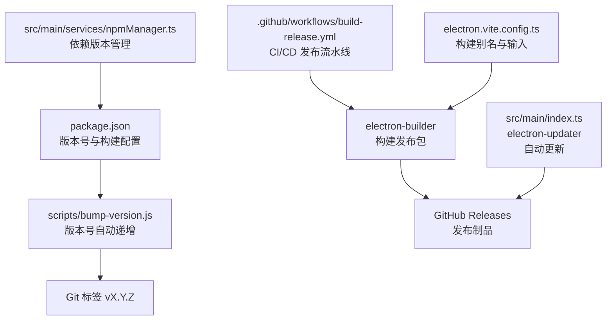
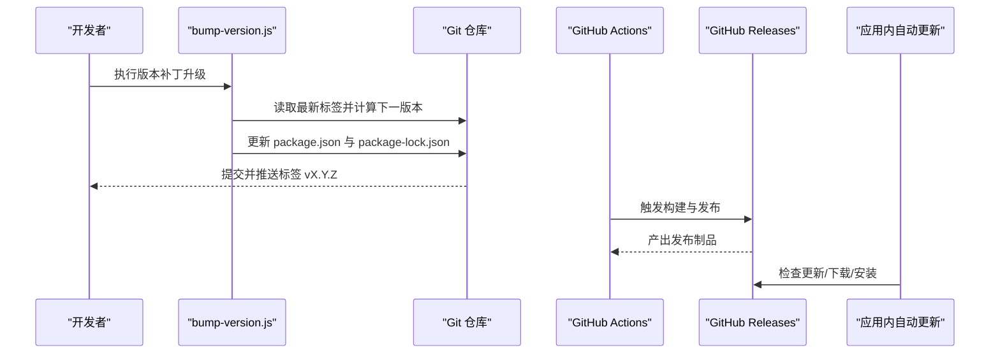
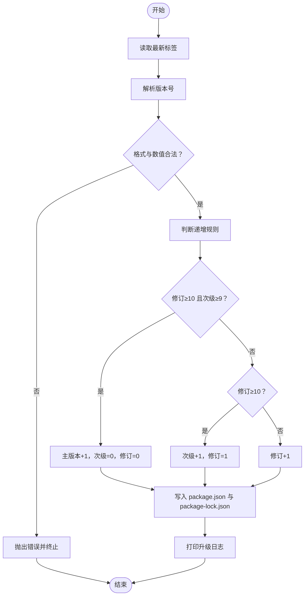
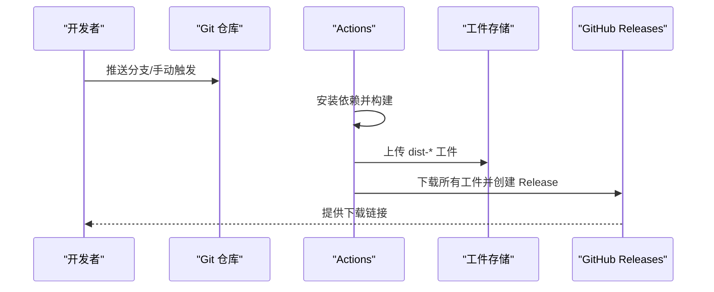
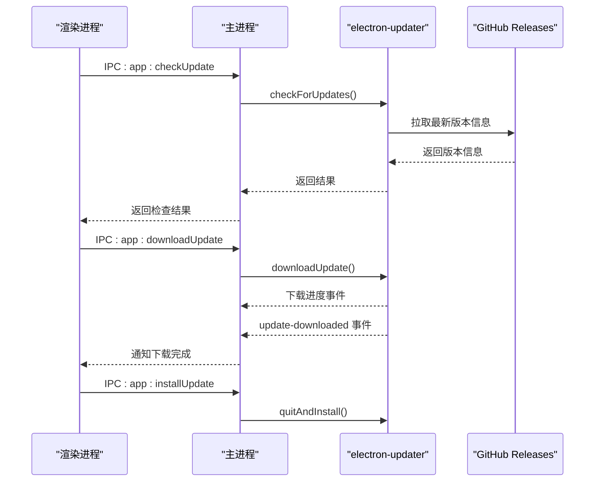
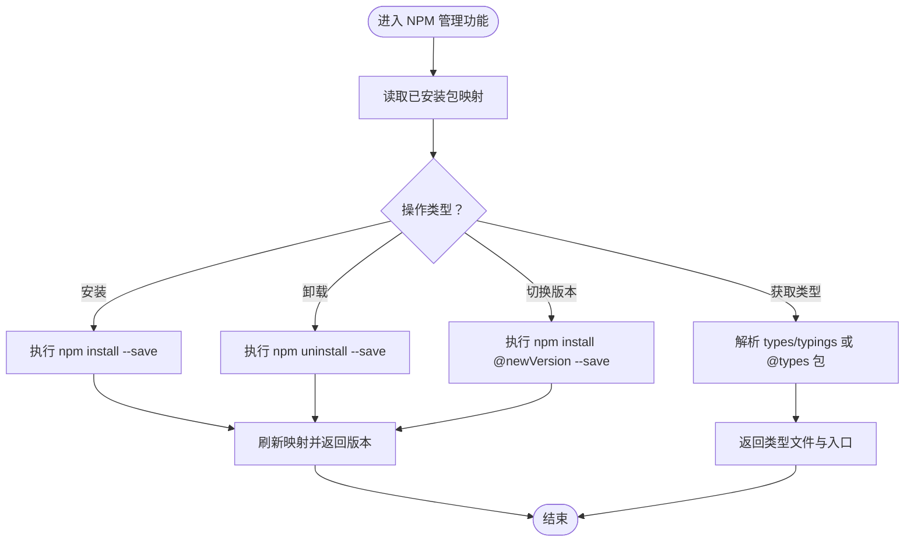
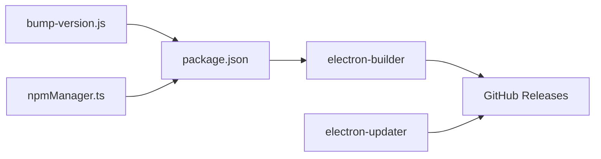

# 版本管理

<cite>
**本文档引用的文件**
- [package.json](file://package.json)
- [scripts/bump-version.js](file://scripts/bump-version.js)
- [.github/workflows/build-release.yml](file://.github/workflows/build-release.yml)
- [README.md](file://README.md)
- [src/main/index.ts](file://src/main/index.ts)
- [src/main/services/npmManager.ts](file://src/main/services/npmManager.ts)
- [electron.vite.config.ts](file://electron.vite.config.ts)
</cite>

## 目录
1. [简介](#简介)
2. [项目结构](#项目结构)
3. [核心组件](#核心组件)
4. [架构总览](#架构总览)
5. [详细组件分析](#详细组件分析)
6. [依赖关系分析](#依赖关系分析)
7. [性能考量](#性能考量)
8. [故障排查指南](#故障排查指南)
9. [结论](#结论)
10. [附录](#附录)

## 简介
本文件面向开发者工具箱项目的版本管理与发布体系，系统性阐述以下主题：
- 版本升级脚本的工作原理与语义化版本控制实现
- 发布流程的自动化处理（版本标签创建、变更日志生成、发布包构建）
- 版本兼容性检查机制（依赖版本管理与破坏性变更处理策略）
- 版本回滚与降级操作指南
- 版本管理最佳实践与常见问题解决方案

## 项目结构
项目采用 Electron + Vue 3 + TypeScript 技术栈，版本管理相关的关键位置如下：
- 版本升级脚本：scripts/bump-version.js
- 发布工作流：.github/workflows/build-release.yml
- 应用内自动更新：src/main/index.ts 中的 electron-updater 集成
- 依赖版本管理：src/main/services/npmManager.ts（NPM 包管理与类型解析）
- 构建配置：electron.vite.config.ts
- 项目元数据：package.json（版本号、构建与发布配置）

**图表来源**
- [package.json:1-120](file://package.json#L1-L120)
- [scripts/bump-version.js:1-72](file://scripts/bump-version.js#L1-L72)
- [.github/workflows/build-release.yml:1-91](file://.github/workflows/build-release.yml#L1-L91)
- [src/main/index.ts:1-444](file://src/main/index.ts#L1-L444)
- [src/main/services/npmManager.ts:1-635](file://src/main/services/npmManager.ts#L1-L635)
- [electron.vite.config.ts:1-49](file://electron.vite.config.ts#L1-L49)

**章节来源**
- [package.json:1-120](file://package.json#L1-L120)
- [scripts/bump-version.js:1-72](file://scripts/bump-version.js#L1-L72)
- [.github/workflows/build-release.yml:1-91](file://.github/workflows/build-release.yml#L1-L91)
- [README.md:1-163](file://README.md#L1-L163)
- [src/main/index.ts:1-444](file://src/main/index.ts#L1-L444)
- [src/main/services/npmManager.ts:1-635](file://src/main/services/npmManager.ts#L1-L635)
- [electron.vite.config.ts:1-49](file://electron.vite.config.ts#L1-L49)

## 核心组件
- 版本升级脚本：基于 Git 标签解析与自定义递增规则，更新 package.json 与 package-lock.json 的版本字段。
- 发布工作流：在 CI 中构建 Windows/macOS 平台产物，汇总产物并创建 GitHub Release，使用预发布标记。
- 应用内自动更新：通过 electron-updater 配置 GitHub 发布源，支持检查更新、下载更新与静默安装。
- 依赖版本管理：NPM 包管理器负责包安装、卸载、版本切换与类型定义解析，保障运行期依赖一致性。
- 构建配置：electron-vite 配置主进程、预加载与渲染进程的输入与别名，确保打包产物正确。

**章节来源**
- [scripts/bump-version.js:1-72](file://scripts/bump-version.js#L1-L72)
- [.github/workflows/build-release.yml:1-91](file://.github/workflows/build-release.yml#L1-L91)
- [src/main/index.ts:1-444](file://src/main/index.ts#L1-L444)
- [src/main/services/npmManager.ts:1-635](file://src/main/services/npmManager.ts#L1-L635)
- [electron.vite.config.ts:1-49](file://electron.vite.config.ts#L1-L49)

## 架构总览
版本管理与发布的整体架构由“本地版本号递增”“CI 构建与发布”“应用内自动更新”三部分组成，形成闭环。

**图表来源**
- [scripts/bump-version.js:1-72](file://scripts/bump-version.js#L1-L72)
- [.github/workflows/build-release.yml:1-91](file://.github/workflows/build-release.yml#L1-L91)
- [src/main/index.ts:1-444](file://src/main/index.ts#L1-L444)

## 详细组件分析

### 组件一：版本升级脚本（语义化版本控制与自动递增）
- 输入：Git 仓库中的最新标签（格式 vX.Y.Z），若无则默认 v0.0.0。
- 解析：校验标签格式与数值合法性，提取主/次/修订号。
- 递增规则：
  - 当修订号 ≥ 10 且次级号 ≥ 9 时，主版本 +1，次级与修订号清零。
  - 当修订号 ≥ 10 时，次级 +1，修订号置为 1。
  - 否则，修订号 +1。
- 输出：更新 package.json 与 package-lock.json 的 version 字段，并打印升级日志。

**图表来源**
- [scripts/bump-version.js:5-72](file://scripts/bump-version.js#L5-L72)

**章节来源**
- [scripts/bump-version.js:1-72](file://scripts/bump-version.js#L1-L72)

### 组件二：发布流程自动化（标签、制品与发布）
- 触发条件：推送到 main 分支或手动触发。
- 权限：对仓库内容具有写权限。
- 构建矩阵：Windows 与 macOS 平台分别构建。
- 产物上传：构建产物上传为工件；发布阶段合并工件并创建 GitHub Release。
- 标签与名称：使用 package.json 中的版本号作为标签与发布名称。
- 发布内容：包含各平台安装包与更新清单文件。

**图表来源**
- [.github/workflows/build-release.yml:1-91](file://.github/workflows/build-release.yml#L1-L91)

**章节来源**
- [.github/workflows/build-release.yml:1-91](file://.github/workflows/build-release.yml#L1-L91)
- [package.json:74-118](file://package.json#L74-L118)

### 组件三：应用内自动更新（electron-updater）
- 配置：启用非自动下载、应用退出时自动安装、允许预发布版本。
- 源：指向 GitHub Releases，Owner 与 Repo 固定。
- 流程：检查更新 -> 下载更新 -> 下载完成回调 -> 静默安装。
- 错误处理：区分网络错误与一般错误，提示用户配置代理或重试。
- UI 交互：渲染侧通过 IPC 触发检查/下载/安装，展示下载进度与状态。

**图表来源**
- [src/main/index.ts:218-299](file://src/main/index.ts#L218-L299)

**章节来源**
- [src/main/index.ts:1-444](file://src/main/index.ts#L1-L444)

### 组件四：版本兼容性检查与依赖管理
- NPM 包管理：提供搜索、安装、卸载、列出、切换版本、获取类型定义等功能。
- 类型解析：优先读取包自身 types/typings 字段，否则尝试常见路径与 @types 包自动安装。
- 默认依赖：首次初始化或升级时补齐常用依赖，保证运行期可用性。
- 版本切换：通过 npm install @version 替换旧版本，刷新内存映射并返回实际安装版本。
- 依赖一致性：通过 package.json 与 package-lock.json 保持锁定版本，减少环境差异。

**图表来源**
- [src/main/services/npmManager.ts:82-426](file://src/main/services/npmManager.ts#L82-L426)

**章节来源**
- [src/main/services/npmManager.ts:1-635](file://src/main/services/npmManager.ts#L1-L635)

### 组件五：构建与打包配置
- electron-vite：为主进程、预加载与渲染进程分别配置输入与别名，确保模块解析一致。
- electron-builder：在 package.json 的 build 字段中定义输出目录、额外资源、平台目标与发布源。
- 产物命名：NSIS 安装包命名包含版本号，便于识别与分发。

**章节来源**
- [electron.vite.config.ts:1-49](file://electron.vite.config.ts#L1-L49)
- [package.json:74-118](file://package.json#L74-L118)

## 依赖关系分析
- 版本升级脚本依赖 Git 标签与 Node 文件系统，直接修改 package.json 与 package-lock.json。
- 发布工作流依赖 GitHub Actions 与 electron-builder，最终产物上传至 GitHub Releases。
- 应用内自动更新依赖 electron-updater 与 GitHub Releases，通过固定 Owner/Repo 溯源。
- NPM 管理器依赖 npm 命令行与网络注册表，负责运行期依赖维护。

**图表来源**
- [scripts/bump-version.js:55-72](file://scripts/bump-version.js#L55-L72)
- [package.json:74-118](file://package.json#L74-L118)
- [src/main/index.ts:43-55](file://src/main/index.ts#L43-L55)
- [src/main/services/npmManager.ts:154-194](file://src/main/services/npmManager.ts#L154-L194)

**章节来源**
- [scripts/bump-version.js:1-72](file://scripts/bump-version.js#L1-L72)
- [.github/workflows/build-release.yml:1-91](file://.github/workflows/build-release.yml#L1-L91)
- [src/main/index.ts:1-444](file://src/main/index.ts#L1-L444)
- [src/main/services/npmManager.ts:1-635](file://src/main/services/npmManager.ts#L1-L635)
- [package.json:74-118](file://package.json#L74-L118)

## 性能考量
- 版本升级脚本：仅执行一次文件读写与子进程调用，性能开销极低。
- 发布工作流：构建矩阵并行度高，建议在 CI 中启用缓存以缩短依赖安装时间。
- 应用内更新：下载进度事件频率可控，避免频繁 UI 刷新；预发布允许灰度发布。
- NPM 管理：类型文件收集采用递归遍历，建议限制深度或缓存结果以提升响应速度。

## 故障排查指南
- 版本升级失败
  - 现象：脚本报错或未生成新标签。
  - 排查：确认 Git 标签格式是否符合 vX.Y.Z；检查 package.json 与 package-lock.json 写权限。
  - 参考：[scripts/bump-version.js:5-29](file://scripts/bump-version.js#L5-L29)
- 发布工作流失败
  - 现象：构建失败或无法创建 Release。
  - 排查：检查 CI 日志中的依赖安装与构建步骤；确认 GitHub Token 权限；核对 package.json 中的发布配置。
  - 参考：[.github/workflows/build-release.yml:1-91](file://.github/workflows/build-release.yml#L1-L91)，[package.json:74-118](file://package.json#L74-L118)
- 应用内更新检查失败
  - 现象：提示网络连接失败或检查更新异常。
  - 排查：在设置中配置代理；确认 GitHub Releases 中存在对应版本；查看主进程日志。
  - 参考：[src/main/index.ts:218-269](file://src/main/index.ts#L218-L269)
- NPM 包安装/切换失败
  - 现象：安装超时或类型定义缺失。
  - 排查：检查网络与镜像源；确认 @types 包是否可安装；必要时手动安装缺失依赖。
  - 参考：[src/main/services/npmManager.ts:154-194](file://src/main/services/npmManager.ts#L154-L194)，[src/main/services/npmManager.ts:364-426](file://src/main/services/npmManager.ts#L364-L426)

**章节来源**
- [scripts/bump-version.js:1-72](file://scripts/bump-version.js#L1-L72)
- [.github/workflows/build-release.yml:1-91](file://.github/workflows/build-release.yml#L1-L91)
- [src/main/index.ts:1-444](file://src/main/index.ts#L1-L444)
- [src/main/services/npmManager.ts:1-635](file://src/main/services/npmManager.ts#L1-L635)

## 结论
本项目通过“本地脚本 + CI 发布 + 应用内更新”的组合，实现了从版本号递增到发布与回滚的完整闭环。结合 NPM 管理器的依赖版本控制与类型解析，能够有效降低运行期兼容性风险。建议在团队协作中统一遵循版本递增规则与发布流程，确保发布质量与可追溯性。

## 附录

### 版本回滚与降级操作指南
- 本地回滚
  - 步骤：撤销版本升级提交，删除对应标签；重新打回退标签；在 CI 中触发发布。
  - 注意：确保 CI 工作流与发布配置仍指向正确的版本号。
  - 参考：[scripts/bump-version.js:51-72](file://scripts/bump-version.js#L51-L72)，[.github/workflows/build-release.yml:81-91](file://.github/workflows/build-release.yml#L81-L91)
- 应用内降级
  - 步骤：在设置中配置代理（如需）；检查更新后选择旧版本；下载完成后安装。
  - 注意：确保 GitHub Releases 中存在旧版本发布制品。
  - 参考：[src/main/index.ts:218-299](file://src/main/index.ts#L218-L299)

### 版本管理最佳实践
- 使用语义化版本控制：遵循主/次/修订号规范，配合自定义递增规则。
- 强制 CI 发布：所有发布必须通过工作流构建与签名，避免手工制品。
- 明确预发布策略：允许预发布以灰度验证，正式发布前进行回归测试。
- 依赖锁定：使用 package-lock.json 锁定版本，减少环境差异。
- 变更日志：建议在发布前生成变更日志，便于用户与审计追踪。
- 回滚预案：保留旧版本发布制品与标签，确保可快速回滚。