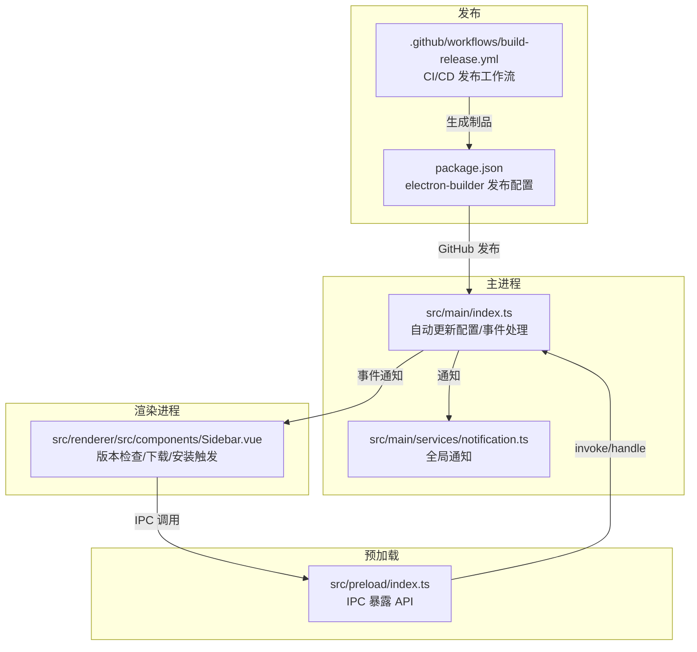
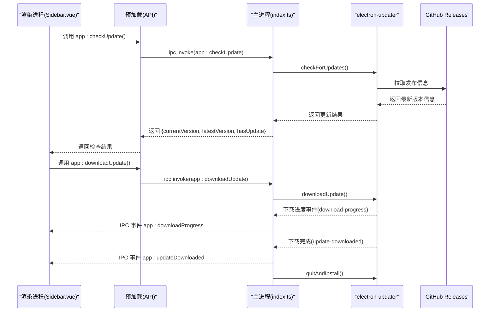
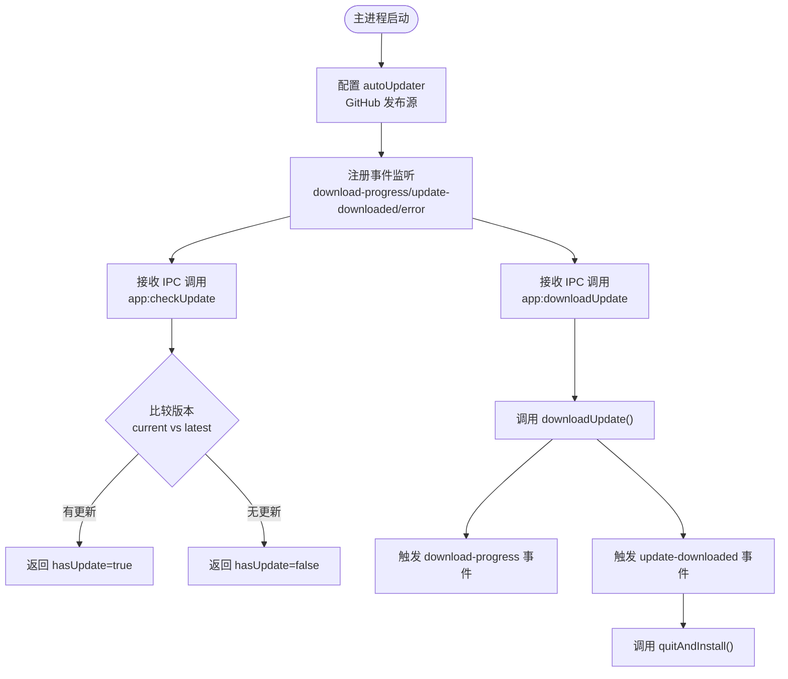
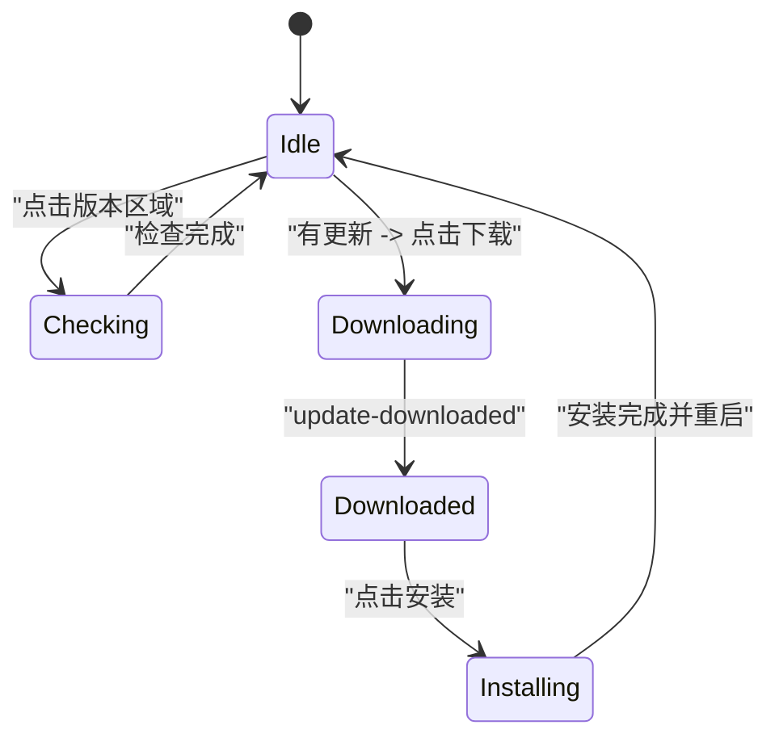
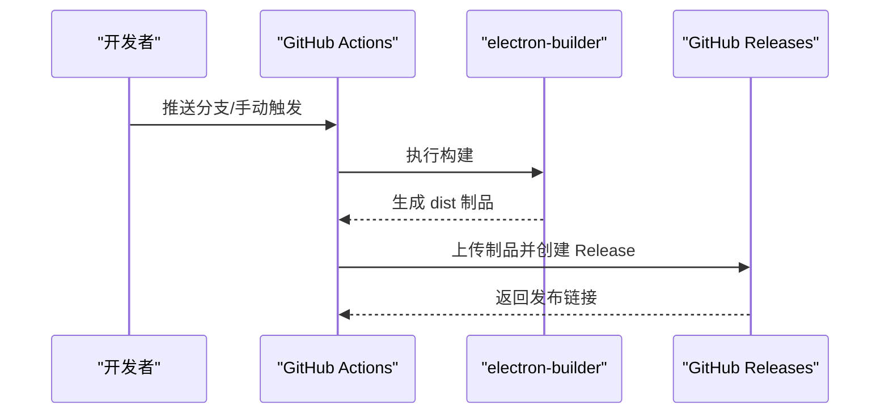
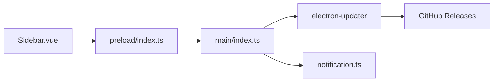

# 自动更新机制

<cite>
**本文引用的文件列表**
- [package.json](file://package.json)
- [src/main/index.ts](file://src/main/index.ts)
- [src/preload/index.ts](file://src/preload/index.ts)
- [src/renderer/src/components/Sidebar.vue](file://src/renderer/src/components/Sidebar.vue)
- [.github/workflows/build-release.yml](file://.github/workflows/build-release.yml)
- [src/main/services/notification.ts](file://src/main/services/notification.ts)
- [README.md](file://README.md)
</cite>

## 目录
1. [简介](#简介)
2. [项目结构](#项目结构)
3. [核心组件](#核心组件)
4. [架构总览](#架构总览)
5. [详细组件分析](#详细组件分析)
6. [依赖关系分析](#依赖关系分析)
7. [性能考量](#性能考量)
8. [故障排查指南](#故障排查指南)
9. [结论](#结论)
10. [附录](#附录)

## 简介
本文件系统性阐述开发者工具箱的自动更新机制，覆盖以下方面：
- GitHub Releases 集成与发布流程
- 版本检查逻辑与更新提示策略
- 更新包下载与安装流程（含断点续传与完整性校验）
- 更新配置最佳实践（更新频率、用户通知）
- 常见问题排查与解决方案

该实现基于 Electron 的 electron-updater，采用 GitHub 作为发布源，主进程负责更新检查、下载与安装，渲染进程负责用户交互与进度反馈。

## 项目结构
围绕自动更新的关键文件与职责如下：
- 主进程入口与更新逻辑：src/main/index.ts
- 预加载桥接 API：src/preload/index.ts
- 渲染侧 UI 与交互：src/renderer/src/components/Sidebar.vue
- 发布配置与工作流：.github/workflows/build-release.yml
- 通知模块：src/main/services/notification.ts
- 应用构建与发布配置：package.json

**图示来源**
- [src/main/index.ts:33-55](file://src/main/index.ts#L33-L55)
- [src/preload/index.ts:23-48](file://src/preload/index.ts#L23-L48)
- [src/renderer/src/components/Sidebar.vue:36-79](file://src/renderer/src/components/Sidebar.vue#L36-L79)
- [.github/workflows/build-release.yml:78-91](file://.github/workflows/build-release.yml#L78-L91)
- [package.json:111-118](file://package.json#L111-L118)

**章节来源**
- [src/main/index.ts:1-444](file://src/main/index.ts#L1-L444)
- [src/preload/index.ts:1-229](file://src/preload/index.ts#L1-L229)
- [src/renderer/src/components/Sidebar.vue:1-385](file://src/renderer/src/components/Sidebar.vue#L1-L385)
- [.github/workflows/build-release.yml:1-91](file://.github/workflows/build-release.yml#L1-L91)
- [package.json:1-120](file://package.json#L1-L120)

## 核心组件
- 自动更新配置与事件处理：主进程通过 electron-updater 配置 GitHub 发布源，注册下载进度、下载完成、错误等事件，并在下载完成后触发安装。
- 预加载桥接 API：将主进程的 IPC 处理暴露给渲染进程，包括版本查询、检查更新、下载更新、安装更新等。
- 渲染侧 UI：在侧边栏展示当前版本、检查更新、下载进度与安装状态，并根据状态引导用户操作。
- 发布工作流：CI 将构建产物上传至 GitHub Releases，供 electron-updater 检测与下载。
- 通知模块：统一向渲染进程推送通知，提升用户体验。

**章节来源**
- [src/main/index.ts:33-55](file://src/main/index.ts#L33-L55)
- [src/preload/index.ts:23-48](file://src/preload/index.ts#L23-L48)
- [src/renderer/src/components/Sidebar.vue:17-79](file://src/renderer/src/components/Sidebar.vue#L17-L79)
- [.github/workflows/build-release.yml:78-91](file://.github/workflows/build-release.yml#L78-L91)
- [src/main/services/notification.ts:15-28](file://src/main/services/notification.ts#L15-L28)

## 架构总览
自动更新的整体流程如下：
- 应用启动后，主进程配置 electron-updater 的 GitHub 发布源。
- 渲染进程调用检查更新接口，主进程通过 electron-updater 检测最新版本并与当前版本比较。
- 若有更新，渲染进程可触发下载；下载进度通过 IPC 事件实时反馈。
- 下载完成后，主进程自动触发安装流程并在安装后重启应用。

**图示来源**
- [src/renderer/src/components/Sidebar.vue:36-79](file://src/renderer/src/components/Sidebar.vue#L36-L79)
- [src/preload/index.ts:26-47](file://src/preload/index.ts#L26-L47)
- [src/main/index.ts:218-299](file://src/main/index.ts#L218-L299)

## 详细组件分析

### 主进程自动更新配置与事件处理
- 配置项
  - 禁止自动下载：autoDownload = false
  - 应用退出时自动安装：autoInstallOnAppQuit = true
  - 允许预发行版本：allowPrerelease = true
  - GitHub 发布源：setFeedURL(provider='github', owner, repo)
- 事件处理
  - download-progress：将百分比通过 IPC 发送给渲染进程
  - update-downloaded：发送下载完成事件并调用 quitAndInstall
  - error：根据错误类型区分网络问题并提示用户设置代理

**图示来源**
- [src/main/index.ts:33-55](file://src/main/index.ts#L33-L55)
- [src/main/index.ts:129-157](file://src/main/index.ts#L129-L157)
- [src/main/index.ts:218-299](file://src/main/index.ts#L218-L299)

**章节来源**
- [src/main/index.ts:33-55](file://src/main/index.ts#L33-L55)
- [src/main/index.ts:129-157](file://src/main/index.ts#L129-L157)
- [src/main/index.ts:218-299](file://src/main/index.ts#L218-L299)

### 预加载桥接 API
- 暴露给渲染进程的 API 包括：
  - app.getVersion、app:checkUpdate、app:downloadUpdate、app:installUpdate
  - 事件监听：onDownloadProgress、onUpdateDownloaded
- 渲染进程通过这些 API 与主进程通信，实现版本检查、下载与安装。

**章节来源**
- [src/preload/index.ts:23-48](file://src/preload/index.ts#L23-L48)

### 渲染进程 UI 与交互
- 初始化时获取当前版本并订阅下载进度与下载完成事件
- 提供三种状态：
  - 检查中：显示“检查中…”
  - 下载中：显示下载进度百分比与旋转动画
  - 已下载：显示“安装”按钮，点击后触发安装
  - 有更新：显示最新版本号，点击后触发下载
  - 无更新：显示当前版本号
- 点击事件根据状态分流：检查更新、下载更新、安装更新

**图示来源**
- [src/renderer/src/components/Sidebar.vue:25-79](file://src/renderer/src/components/Sidebar.vue#L25-L79)

**章节来源**
- [src/renderer/src/components/Sidebar.vue:17-79](file://src/renderer/src/components/Sidebar.vue#L17-L79)

### GitHub Releases 集成与发布流程
- 发布配置
  - electron-builder publish.provider = github
  - owner/repo 指向项目仓库
- CI 工作流
  - 构建 Windows/macOS 制品
  - 将 dist 目录产物上传至 GitHub Releases
  - 使用 package.json 中的版本号作为 tag 名称

**图示来源**
- [.github/workflows/build-release.yml:44-91](file://.github/workflows/build-release.yml#L44-L91)
- [package.json:111-118](file://package.json#L111-L118)

**章节来源**
- [.github/workflows/build-release.yml:44-91](file://.github/workflows/build-release.yml#L44-L91)
- [package.json:111-118](file://package.json#L111-L118)

### 版本检查逻辑与更新提示策略
- 版本比较
  - 当前版本来自 app.getVersion()
  - 最新版本来自 autoUpdater.checkForUpdates() 返回的 updateInfo.version
  - 比较逻辑：latestVersion !== currentVersion
- 更新提示
  - 仅在非开发环境（app.isPackaged）下进行实际检查
  - 错误处理：针对网络超时/拒绝/不可达等错误，提示用户配置代理
  - UI 提示：根据状态显示“检查中”、“下载中”、“安装”、“有新版本”等文案

**章节来源**
- [src/main/index.ts:218-269](file://src/main/index.ts#L218-L269)
- [src/renderer/src/components/Sidebar.vue:36-50](file://src/renderer/src/components/Sidebar.vue#L36-L50)

### 更新包下载与安装流程
- 下载
  - 渲染进程触发 app:downloadUpdate
  - 主进程调用 autoUpdater.downloadUpdate
  - 下载进度通过 download-progress 事件推送
- 安装
  - 下载完成后触发 update-downloaded
  - 主进程调用 quitAndInstall(true, true)，应用退出并安装更新
- 断点续传与完整性校验
  - electron-updater 内部基于 electron-builder 的发布机制与签名校验，具备断点续传与完整性校验能力
  - 本项目未显式配置断点续传开关，但使用 electron-updater 默认行为即可获得相应能力

**章节来源**
- [src/main/index.ts:129-138](file://src/main/index.ts#L129-L138)
- [src/main/index.ts:271-299](file://src/main/index.ts#L271-L299)

### 更新配置最佳实践
- 更新频率控制
  - 建议在应用启动时进行一次检查，避免频繁轮询
  - 可在 UI 中增加“手动检查更新”按钮，减少后台网络请求
- 用户通知机制
  - 使用全局通知模块统一推送成功/失败信息
  - 对网络类错误明确提示“请在设置中配置代理后重试”
- 代理配置
  - 支持通过 IPC 设置代理，并同步设置环境变量 HTTPS_PROXY/HTTP_PROXY
  - 便于在受限网络环境下完成更新检查与下载

**章节来源**
- [src/main/index.ts:306-327](file://src/main/index.ts#L306-L327)
- [src/main/services/notification.ts:15-28](file://src/main/services/notification.ts#L15-L28)

## 依赖关系分析
- 主进程依赖 electron-updater 进行版本检查与下载
- 预加载层通过 ipcRenderer.invoke/handle 与主进程通信
- 渲染进程通过 window.api.app 调用预加载暴露的 API
- 发布流程由 GitHub Actions 与 electron-builder 配合完成

**图示来源**
- [src/renderer/src/components/Sidebar.vue:25-79](file://src/renderer/src/components/Sidebar.vue#L25-L79)
- [src/preload/index.ts:23-48](file://src/preload/index.ts#L23-L48)
- [src/main/index.ts:33-55](file://src/main/index.ts#L33-L55)
- [src/main/services/notification.ts:15-28](file://src/main/services/notification.ts#L15-L28)

**章节来源**
- [src/main/index.ts:1-444](file://src/main/index.ts#L1-L444)
- [src/preload/index.ts:1-229](file://src/preload/index.ts#L1-L229)
- [src/renderer/src/components/Sidebar.vue:1-385](file://src/renderer/src/components/Sidebar.vue#L1-L385)

## 性能考量
- 版本检查与下载均在网络 IO 上，建议：
  - 控制检查频率，避免频繁请求
  - 在下载过程中仅推送必要进度信息，减少 IPC 事件频率
  - 对于大型更新包，考虑在 UI 中提供暂停/取消入口（若后续扩展）

## 故障排查指南
- 网络连接失败
  - 现象：检查更新/下载失败，提示“网络连接失败，请在设置中配置代理后重试”
  - 处理：在应用设置中配置代理地址（如 http://127.0.0.1:7890），并确认网络可达
- GitHub 访问受限
  - 现象：无法拉取发布信息或下载制品
  - 处理：确保代理可用，或更换网络环境；检查 owner/repo 配置是否正确
- 安装失败
  - 现象：下载完成后无法安装或安装后无法重启
  - 处理：确认 quitAndInstall 调用成功；检查系统权限与杀毒软件拦截
- 开发环境差异
  - 现象：开发模式下不会进行实际更新检查
  - 处理：打包后（app.isPackaged）才会启用真实检查逻辑

**章节来源**
- [src/main/index.ts:140-157](file://src/main/index.ts#L140-L157)
- [src/main/index.ts:252-268](file://src/main/index.ts#L252-L268)
- [README.md:118-121](file://README.md#L118-L121)

## 结论
本项目基于 electron-updater 与 GitHub Releases 实现了完整的自动更新闭环：从版本检查、下载到安装，主/渲染进程协同并通过统一通知机制提升用户体验。通过合理的配置与最佳实践，可在保证稳定性的同时优化网络与性能表现。

## 附录
- 相关配置参考
  - electron-builder 发布配置：[package.json:111-118](file://package.json#L111-L118)
  - CI 发布工作流：[build-release.yml:78-91](file://.github/workflows/build-release.yml#L78-L91)
  - README 中关于自动更新的说明：[README.md:70](file://README.md#L70)