# Electron多进程架构

<cite>
**本文档引用的文件**
- [src/main/index.ts](file://src/main/index.ts)
- [src/preload/index.ts](file://src/preload/index.ts)
- [src/preload/dock.ts](file://src/preload/dock.ts)
- [src/main/services/codeRunner.ts](file://src/main/services/codeRunner.ts)
- [src/main/services/dockService.ts](file://src/main/services/dockService.ts)
- [src/main/services/notification.ts](file://src/main/services/notification.ts)
- [src/main/services/httpClient.ts](file://src/main/services/httpClient.ts)
- [src/renderer/src/main.ts](file://src/renderer/src/main.ts)
- [src/renderer/src/App.vue](file://src/renderer/src/App.vue)
- [src/renderer/src/components/CloseDialog.vue](file://src/renderer/src/components/CloseDialog.vue)
- [src/renderer/src/views/home/Home.vue](file://src/renderer/src/views/home/Home.vue)
- [src/renderer/index.html](file://src/renderer/index.html)
- [electron.vite.config.ts](file://electron.vite.config.ts)
- [package.json](file://package.json)
</cite>

## 目录
1. [简介](#简介)
2. [项目结构](#项目结构)
3. [核心组件](#核心组件)
4. [架构总览](#架构总览)
5. [详细组件分析](#详细组件分析)
6. [依赖关系分析](#依赖关系分析)
7. [性能考虑](#性能考虑)
8. [故障排除指南](#故障排除指南)
9. [结论](#结论)

## 简介
本项目是一个基于Electron的开发者工具箱应用，采用严格的多进程架构设计。主进程负责系统级操作（窗口管理、系统托盘、自动更新、文件系统访问、网络请求等），渲染进程负责UI展示和用户交互。通过预加载脚本建立安全的IPC桥接，确保渲染进程只能通过受控API访问系统功能。

## 项目结构
项目采用按职责分离的文件组织方式：
- 主进程：src/main/ - 应用入口、服务注册、系统集成
- 预加载脚本：src/preload/ - 安全桥接层
- 渲染进程：src/renderer/ - Vue应用界面
- 服务模块：src/main/services/ - 功能服务封装

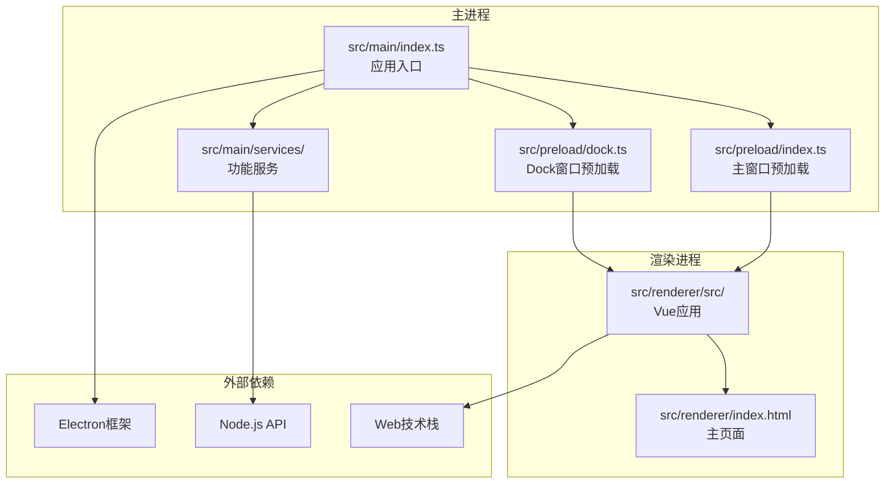

**图表来源**
- [src/main/index.ts:1-444](file://src/main/index.ts#L1-L444)
- [src/preload/index.ts:1-229](file://src/preload/index.ts#L1-L229)
- [src/preload/dock.ts:1-19](file://src/preload/dock.ts#L1-L19)

**章节来源**
- [src/main/index.ts:1-444](file://src/main/index.ts#L1-L444)
- [electron.vite.config.ts:1-49](file://electron.vite.config.ts#L1-L49)

## 核心组件
应用的核心组件包括：

### 主进程组件
- **应用入口**：负责应用生命周期管理、窗口创建、IPC服务注册
- **系统服务**：窗口管理、托盘、自动更新、代理设置、开机自启动
- **功能服务**：代码运行器、HTTP客户端、域名查询、OSS管理、SQL专家

### 预加载脚本组件
- **安全桥接**：通过contextBridge暴露受控API给渲染进程
- **Dock专用桥**：为Dock窗口提供独立的API接口

### 渲染进程组件
- **Vue应用**：采用Composition API的现代化前端架构
- **工具视图**：包含代码运行、HTTP客户端、域名查询、OSS管理、SQL专家等功能模块

**章节来源**
- [src/main/index.ts:1-444](file://src/main/index.ts#L1-L444)
- [src/preload/index.ts:1-229](file://src/preload/index.ts#L1-L229)
- [src/renderer/src/App.vue:1-102](file://src/renderer/src/App.vue#L1-L102)

## 架构总览
应用采用经典的Electron多进程架构，通过严格的职责分离实现安全性和可维护性。

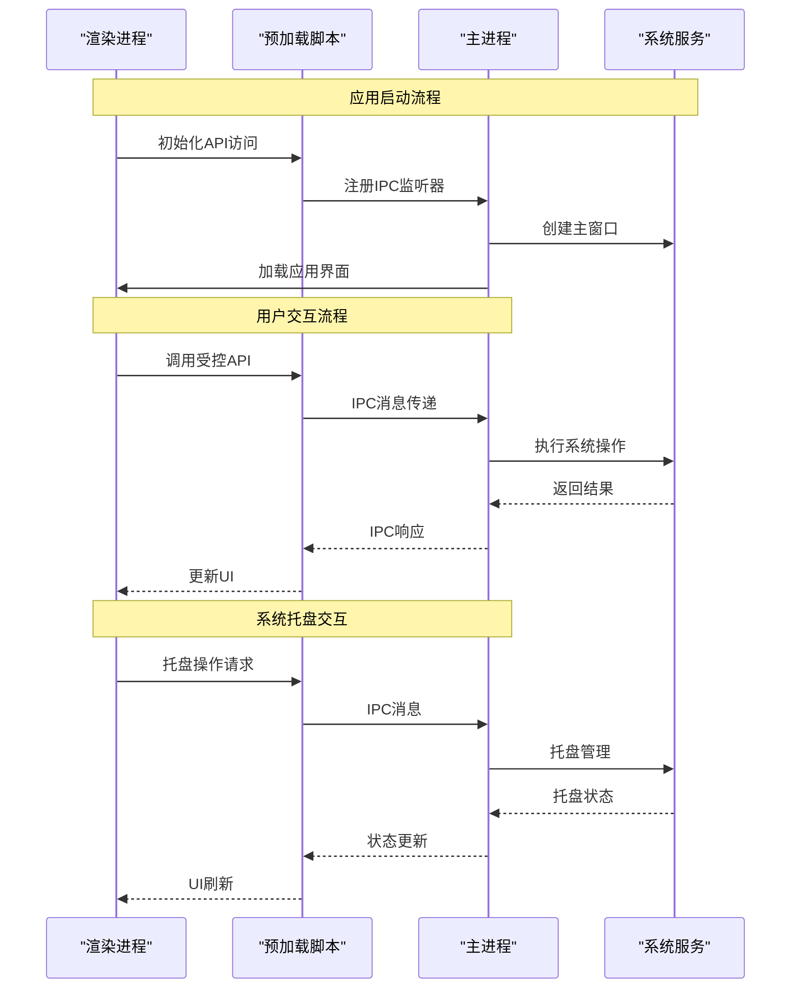

**图表来源**
- [src/main/index.ts:110-174](file://src/main/index.ts#L110-L174)
- [src/preload/index.ts:11-60](file://src/preload/index.ts#L11-L60)

## 详细组件分析

### 主进程架构分析
主进程作为应用的核心控制器，承担以下关键职责：

#### 窗口管理系统
主进程负责创建和管理所有窗口，包括主窗口和Dock窗口。窗口配置采用无边框设计，支持透明背景和始终置顶特性。

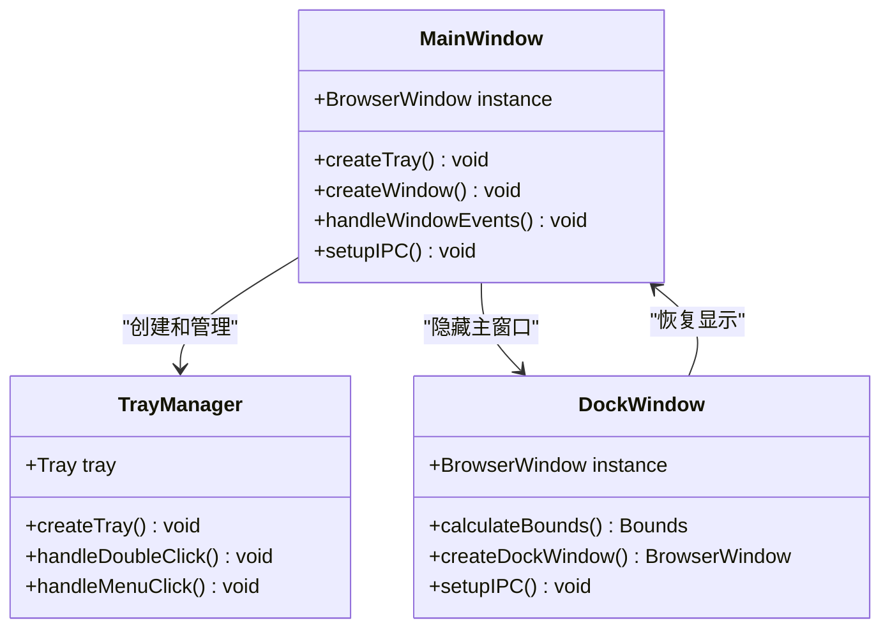

**图表来源**
- [src/main/index.ts:110-174](file://src/main/index.ts#L110-L174)
- [src/main/services/dockService.ts:65-108](file://src/main/services/dockService.ts#L65-L108)

#### IPC通信机制
主进程通过ipcMain处理来自渲染进程的所有请求，并提供多种通信模式：

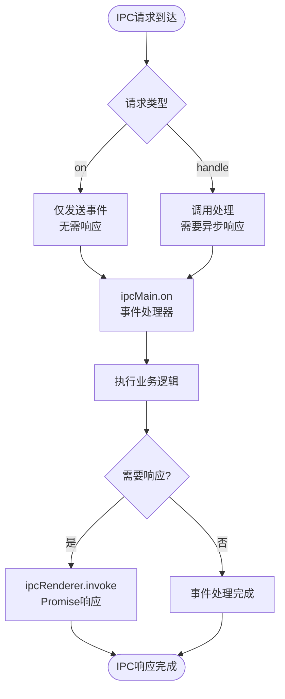

**图表来源**
- [src/main/index.ts:175-395](file://src/main/index.ts#L175-L395)
- [src/preload/index.ts:13-48](file://src/preload/index.ts#L13-L48)

#### 自动更新系统
应用集成了electron-updater实现自动更新功能，支持GitHub发布源和增量更新。

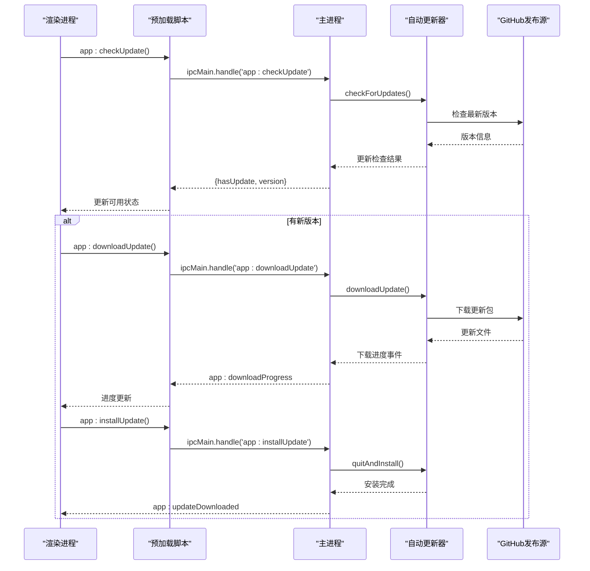

**图表来源**
- [src/main/index.ts:218-299](file://src/main/index.ts#L218-L299)

**章节来源**
- [src/main/index.ts:1-444](file://src/main/index.ts#L1-L444)

### 预加载脚本安全桥接
预加载脚本通过contextBridge实现安全的API暴露，确保渲染进程只能访问受控的功能接口。

#### API分类架构
预加载脚本将API按照功能域进行分组：

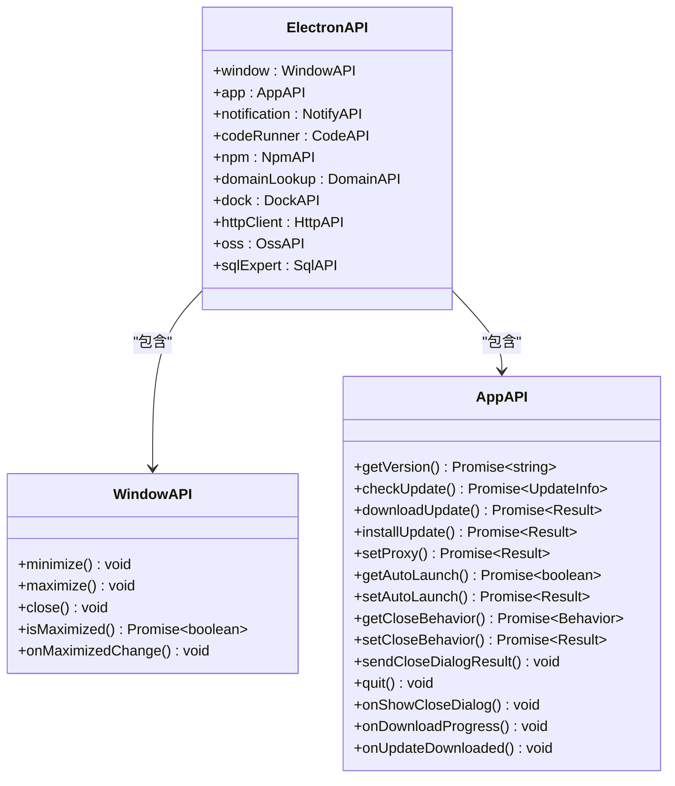

**图表来源**
- [src/preload/index.ts:11-60](file://src/preload/index.ts#L11-L60)

#### Dock专用预加载
Dock窗口使用独立的预加载脚本，提供简化的API接口：

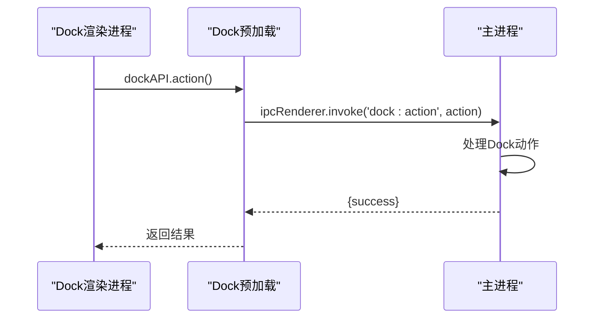

**图表来源**
- [src/preload/dock.ts:4-6](file://src/preload/dock.ts#L4-L6)

**章节来源**
- [src/preload/index.ts:1-229](file://src/preload/index.ts#L1-L229)
- [src/preload/dock.ts:1-19](file://src/preload/dock.ts#L1-L19)

### 渲染进程架构
渲染进程基于Vue 3构建，采用Composition API实现现代化开发体验。

#### 应用架构
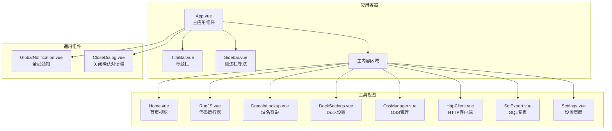

**图表来源**
- [src/renderer/src/App.vue:20-35](file://src/renderer/src/App.vue#L20-L35)

#### 事件处理流程
渲染进程通过window.api访问主进程提供的受控API：

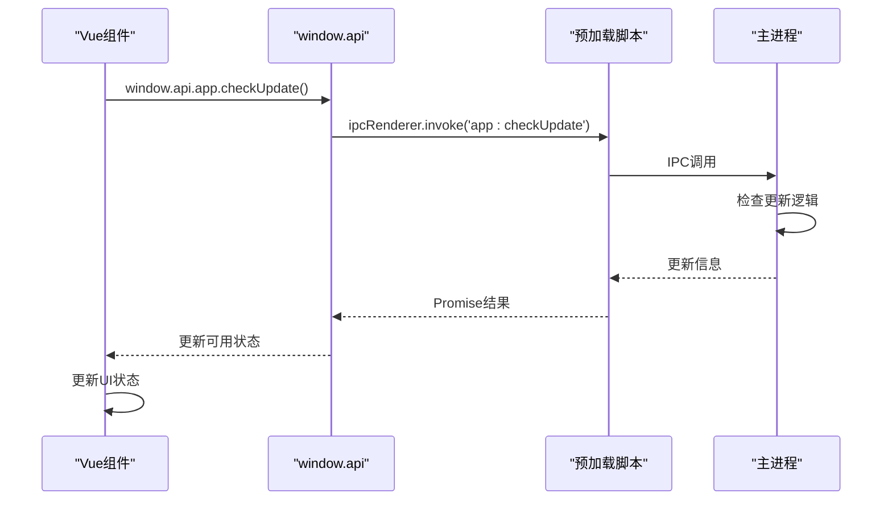

**图表来源**
- [src/renderer/src/App.vue:49-52](file://src/renderer/src/App.vue#L49-L52)

**章节来源**
- [src/renderer/src/App.vue:1-102](file://src/renderer/src/App.vue#L1-L102)
- [src/renderer/src/main.ts:1-6](file://src/renderer/src/main.ts#L1-L6)

### 服务模块分析

#### 代码运行器服务
代码运行器实现了安全的代码执行环境，支持JavaScript和TypeScript：

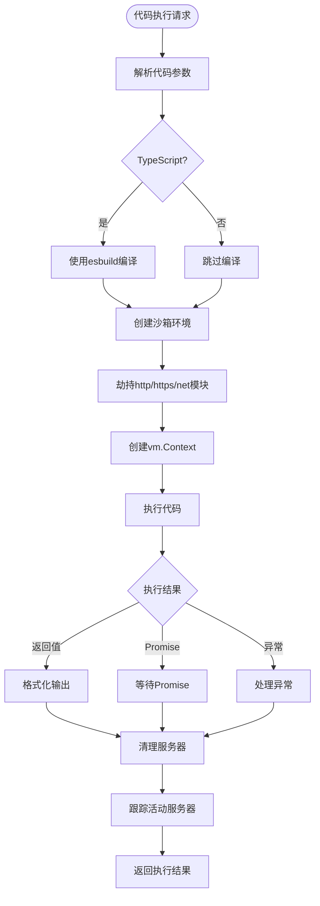

**图表来源**
- [src/main/services/codeRunner.ts:98-246](file://src/main/services/codeRunner.ts#L98-L246)

#### HTTP客户端服务
HTTP客户端服务绕过CORS限制，在主进程中执行网络请求：

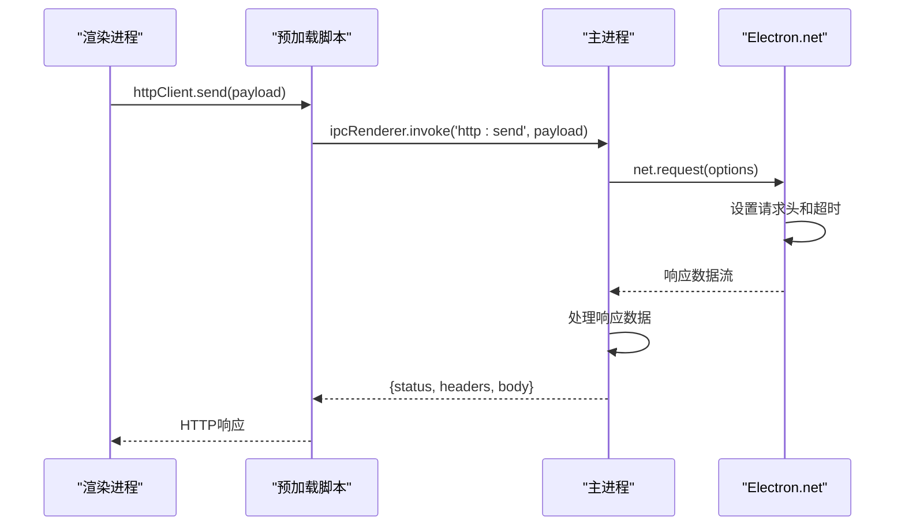

**图表来源**
- [src/main/services/httpClient.ts:15-112](file://src/main/services/httpClient.ts#L15-L112)

**章节来源**
- [src/main/services/codeRunner.ts:1-461](file://src/main/services/codeRunner.ts#L1-L461)
- [src/main/services/httpClient.ts:1-113](file://src/main/services/httpClient.ts#L1-L113)

## 依赖关系分析

### 构建配置分析
项目使用electron-vite进行构建，支持多入口配置：

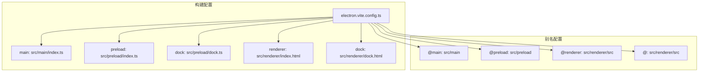

**图表来源**
- [electron.vite.config.ts:6-48](file://electron.vite.config.ts#L6-L48)

### 依赖关系图
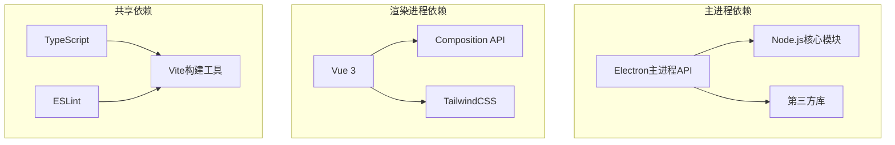

**图表来源**
- [package.json:28-73](file://package.json#L28-L73)

**章节来源**
- [electron.vite.config.ts:1-49](file://electron.vite.config.ts#L1-L49)
- [package.json:1-120](file://package.json#L1-L120)

## 性能考虑
应用在多个层面考虑了性能优化：

### 内存管理
- 代码运行器使用vm模块创建沙箱环境，避免全局污染
- HTTP客户端使用流式处理，减少内存占用
- Dock窗口采用透明背景和alwaysOnTop优化

### 网络性能
- HTTP客户端支持超时控制和错误处理
- 自动更新使用增量更新策略
- 代理设置支持动态切换

### UI性能
- Vue应用使用KeepAlive缓存组件状态
- 异步组件懒加载减少首屏加载时间
- TailwindCSS提供高效的样式编译

## 故障排除指南

### 常见问题诊断
1. **IPC通信失败**
   - 检查预加载脚本是否正确暴露API
   - 验证ipcMain.handle监听器是否注册
   - 确认contextIsolation配置正确

2. **窗口显示问题**
   - 检查frame: false配置
   - 验证alwaysOnTop设置
   - 确认透明窗口的GPU设置

3. **自动更新失败**
   - 检查GitHub发布配置
   - 验证网络代理设置
   - 确认权限和防火墙规则

### 日志和调试
应用提供了完善的日志记录机制：
- 主进程错误日志输出到控制台
- 渲染进程错误通过全局通知显示
- 代码运行器提供详细的执行日志

**章节来源**
- [src/main/services/notification.ts:15-28](file://src/main/services/notification.ts#L15-L28)
- [src/main/services/codeRunner.ts:110-116](file://src/main/services/codeRunner.ts#L110-L116)

## 结论
本项目展示了Electron应用的最佳实践，通过严格的多进程架构实现了安全性、可维护性和性能的平衡。主进程专注于系统级操作，渲染进程专注于用户体验，预加载脚本提供安全的API桥接。这种设计模式为复杂的桌面应用开发提供了清晰的指导原则。