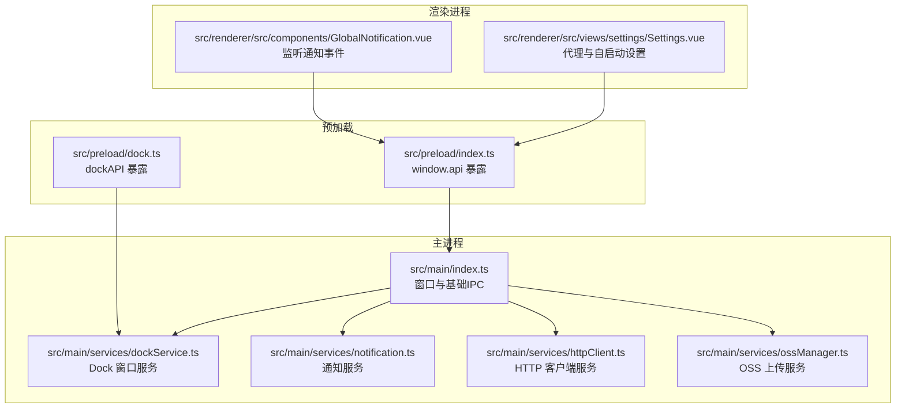
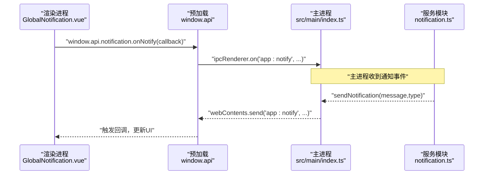
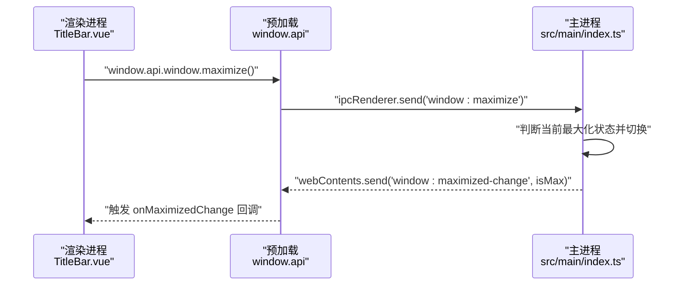
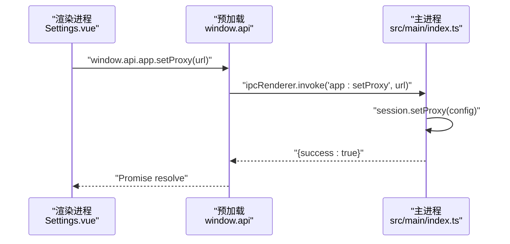
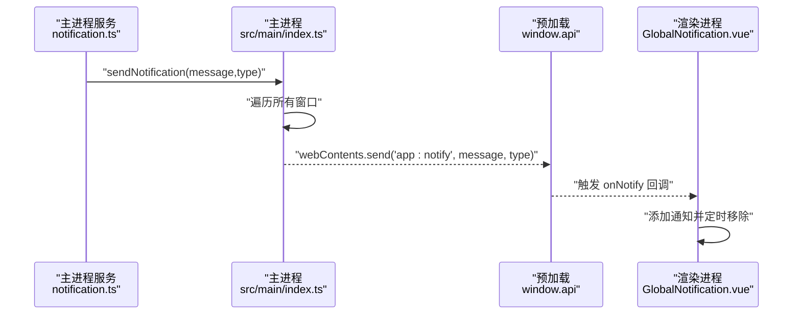
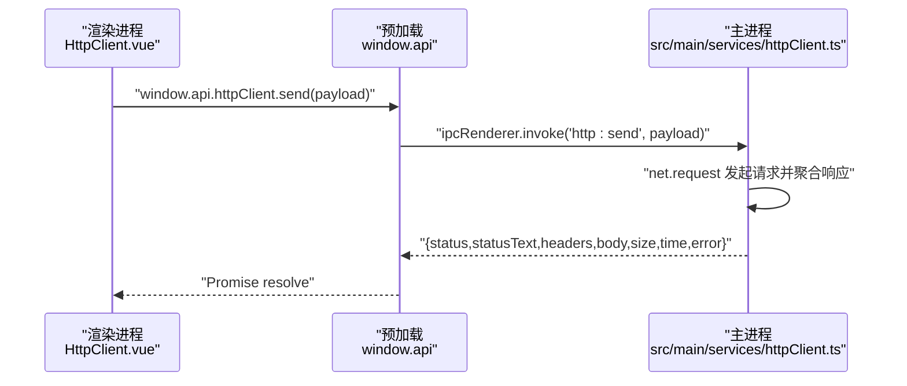
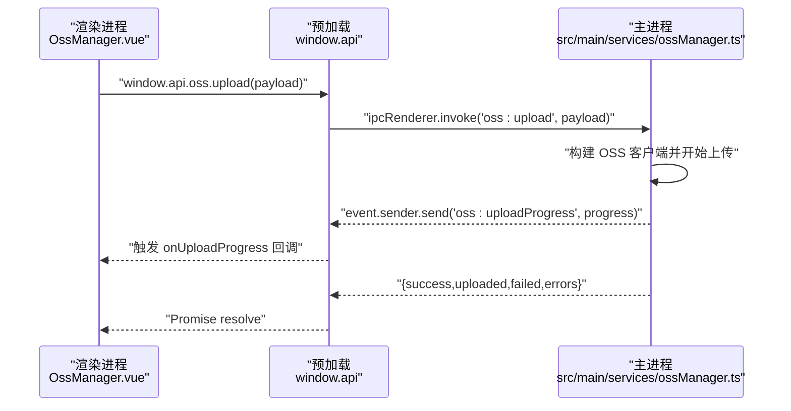
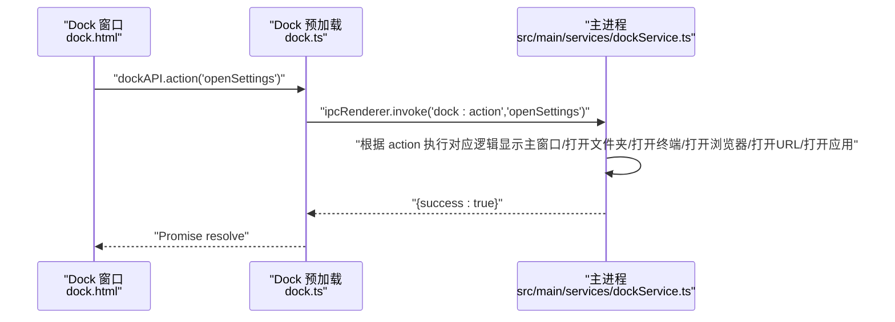
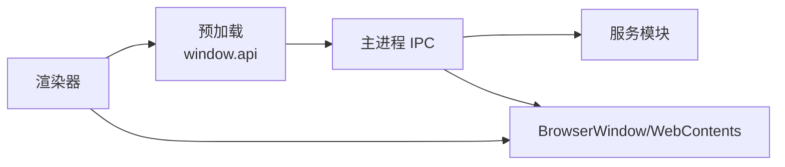

# IPC通信机制

<cite>
**本文引用的文件列表**
- [src/main/index.ts](file://src/main/index.ts)
- [src/preload/index.ts](file://src/preload/index.ts)
- [src/preload/dock.ts](file://src/preload/dock.ts)
- [src/main/services/dockService.ts](file://src/main/services/dockService.ts)
- [src/main/services/notification.ts](file://src/main/services/notification.ts)
- [src/main/services/httpClient.ts](file://src/main/services/httpClient.ts)
- [src/main/services/ossManager.ts](file://src/main/services/ossManager.ts)
- [src/renderer/src/components/GlobalNotification.vue](file://src/renderer/src/components/GlobalNotification.vue)
- [src/renderer/src/views/settings/Settings.vue](file://src/renderer/src/views/settings/Settings.vue)
</cite>

## 目录
1. [简介](#简介)
2. [项目结构](#项目结构)
3. [核心组件](#核心组件)
4. [架构总览](#架构总览)
5. [详细组件分析](#详细组件分析)
6. [依赖关系分析](#依赖关系分析)
7. [性能考量](#性能考量)
8. [故障排查指南](#故障排查指南)
9. [结论](#结论)

## 简介
本文档系统性梳理开发者工具箱的跨进程通信（IPC）机制，重点覆盖：
- 主进程与渲染进程的消息传递协议
- ipcMain.handle 与 ipcRenderer.invoke 的异步调用模式
- ipcMain.on 与 ipcRenderer.send 的事件监听机制
- 预加载脚本如何安全地暴露 API 给渲染进程（window.api 设计模式）
- 具体功能实现：窗口控制、自动更新、代理设置、开机自启动、通知、HTTP 客户端、OSS 上传等
- 通信协议示例、错误处理机制与性能优化建议

## 项目结构
围绕 IPC 的关键文件分布如下：
- 主进程入口与窗口生命周期：src/main/index.ts
- 预加载桥接层（contextBridge 暴露 API）：src/preload/index.ts
- Dock 窗口专用预加载：src/preload/dock.ts
- 服务模块（窗口、通知、HTTP、OSS、Dock 等）：src/main/services/*
- 渲染器侧使用示例（通知、设置页）：src/renderer/src/*

图表来源
- [src/main/index.ts:110-395](file://src/main/index.ts#L110-L395)
- [src/preload/index.ts:11-229](file://src/preload/index.ts#L11-L229)
- [src/preload/dock.ts:1-19](file://src/preload/dock.ts#L1-L19)
- [src/main/services/dockService.ts:111-229](file://src/main/services/dockService.ts#L111-L229)
- [src/main/services/notification.ts:15-28](file://src/main/services/notification.ts#L15-L28)
- [src/main/services/httpClient.ts:15-112](file://src/main/services/httpClient.ts#L15-L112)
- [src/main/services/ossManager.ts:296-439](file://src/main/services/ossManager.ts#L296-L439)
- [src/renderer/src/components/GlobalNotification.vue:54-62](file://src/renderer/src/components/GlobalNotification.vue#L54-L62)
- [src/renderer/src/views/settings/Settings.vue:9-57](file://src/renderer/src/views/settings/Settings.vue#L9-L57)

章节来源
- [src/main/index.ts:110-395](file://src/main/index.ts#L110-L395)
- [src/preload/index.ts:11-229](file://src/preload/index.ts#L11-L229)
- [src/preload/dock.ts:1-19](file://src/preload/dock.ts#L1-L19)
- [src/main/services/dockService.ts:111-229](file://src/main/services/dockService.ts#L111-L229)
- [src/main/services/notification.ts:15-28](file://src/main/services/notification.ts#L15-L28)
- [src/main/services/httpClient.ts:15-112](file://src/main/services/httpClient.ts#L15-L112)
- [src/main/services/ossManager.ts:296-439](file://src/main/services/ossManager.ts#L296-L439)
- [src/renderer/src/components/GlobalNotification.vue:54-62](file://src/renderer/src/components/GlobalNotification.vue#L54-L62)
- [src/renderer/src/views/settings/Settings.vue:9-57](file://src/renderer/src/views/settings/Settings.vue#L9-L57)

## 核心组件
- 预加载桥接层（window.api 设计模式）
  - 通过 contextBridge.exposeInMainWorld 安全暴露 API，避免直接注入全局对象
  - 提供窗口控制、应用信息、通知、代码运行、NPM 管理、域名查询、macOS Dock、HTTP 客户端、阿里云 OSS、SQL 专家等模块的统一入口
- 主进程 IPC 注册
  - 使用 ipcMain.handle 注册异步处理器（invoke）
  - 使用 ipcMain.on 注册事件监听（send）
  - 与服务模块解耦，集中处理业务逻辑
- 服务模块
  - Dock 窗口服务、通知服务、HTTP 客户端、OSS 上传等，均通过 ipcMain.handle/on 暴露能力
- 渲染器使用
  - 通过 window.api.* 方法调用主进程能力
  - 通过 window.api.notification.onNotify 订阅通知事件

章节来源
- [src/preload/index.ts:11-229](file://src/preload/index.ts#L11-L229)
- [src/main/index.ts:175-395](file://src/main/index.ts#L175-L395)
- [src/main/services/dockService.ts:111-229](file://src/main/services/dockService.ts#L111-L229)
- [src/main/services/notification.ts:15-28](file://src/main/services/notification.ts#L15-L28)
- [src/main/services/httpClient.ts:15-112](file://src/main/services/httpClient.ts#L15-L112)
- [src/main/services/ossManager.ts:296-439](file://src/main/services/ossManager.ts#L296-L439)
- [src/renderer/src/components/GlobalNotification.vue:54-62](file://src/renderer/src/components/GlobalNotification.vue#L54-L62)
- [src/renderer/src/views/settings/Settings.vue:9-57](file://src/renderer/src/views/settings/Settings.vue#L9-L57)

## 架构总览
下图展示 IPC 通信在主进程与渲染进程之间的交互路径，以及预加载层的安全桥接作用。

图表来源
- [src/renderer/src/components/GlobalNotification.vue:54-62](file://src/renderer/src/components/GlobalNotification.vue#L54-L62)
- [src/preload/index.ts:50-60](file://src/preload/index.ts#L50-L60)
- [src/main/services/notification.ts:15-28](file://src/main/services/notification.ts#L15-L28)
- [src/main/index.ts:134-138](file://src/main/index.ts#L134-L138)

## 详细组件分析

### 预加载桥接层（window.api 设计模式）
- 安全暴露
  - 使用 contextBridge.exposeInMainWorld 将 window.api 和 window.electron 暴露给渲染进程
  - 通过 process.contextIsolated 分支处理隔离与非隔离两种场景
- API 分类
  - 窗口控制：最小化、最大化、关闭、最大化状态监听
  - 应用信息：版本查询、更新检查/下载/安装、文件打开、代理设置、自启动、关闭行为、退出
  - 通知：订阅全局通知事件、移除监听
  - 代码运行：运行/停止/清理/端口终止
  - NPM 管理：搜索/安装/卸载/列出/版本切换/目录管理/类型缓存
  - 域名查询：解析/端口扫描
  - macOS Dock：打开/关闭/状态/动作
  - HTTP 客户端：发送请求
  - 阿里云 OSS：选择文件/文件夹、上传、取消、进度监听
  - SQL 专家：数据库测试/提问/取消/执行/配置/模式/记忆/余额等，含流式事件监听
- 调用模式
  - 异步调用：ipcRenderer.invoke(...) -> ipcMain.handle(...)
  - 事件监听：ipcRenderer.on(...) -> ipcMain.on(...) 或 webContents.send(...)

章节来源
- [src/preload/index.ts:11-229](file://src/preload/index.ts#L11-L229)

### 窗口控制与关闭行为
- 主进程注册
  - 窗口最小化/最大化/关闭事件监听
  - 窗口关闭拦截，根据关闭行为策略（询问/最小化到托盘/直接退出）
  - 最大化状态变更事件广播
- 预加载暴露
  - 窗口控制方法与最大化状态查询
  - 最大化状态变化事件监听
- 渲染器使用
  - 标题栏按钮绑定 window.api.window.* 方法
  - 订阅最大化状态变化以更新 UI

图表来源
- [src/main/index.ts:175-191](file://src/main/index.ts#L175-L191)
- [src/main/index.ts:386-391](file://src/main/index.ts#L386-L391)
- [src/preload/index.ts:13-21](file://src/preload/index.ts#L13-L21)

章节来源
- [src/main/index.ts:175-191](file://src/main/index.ts#L175-L191)
- [src/main/index.ts:386-391](file://src/main/index.ts#L386-L391)
- [src/preload/index.ts:13-21](file://src/preload/index.ts#L13-L21)

### 自动更新与代理设置
- 自动更新
  - 主进程配置 autoUpdater，监听下载进度、下载完成、错误事件
  - 暴露检查更新、下载更新、安装更新的 handle
  - 错误分类与通知提示（网络超时/连接拒绝/DNS 失败）
- 代理设置
  - 主进程通过 session.setProxy 设置代理，并同步设置环境变量
  - 渲染器通过 window.api.app.setProxy 设置代理并持久化到本地存储

图表来源
- [src/main/index.ts:306-327](file://src/main/index.ts#L306-L327)
- [src/renderer/src/views/settings/Settings.vue:23-39](file://src/renderer/src/views/settings/Settings.vue#L23-L39)
- [src/preload/index.ts:30-30](file://src/preload/index.ts#L30-L30)

章节来源
- [src/main/index.ts:129-157](file://src/main/index.ts#L129-L157)
- [src/main/index.ts:218-294](file://src/main/index.ts#L218-L294)
- [src/main/index.ts:306-327](file://src/main/index.ts#L306-L327)
- [src/renderer/src/views/settings/Settings.vue:9-57](file://src/renderer/src/views/settings/Settings.vue#L9-L57)
- [src/preload/index.ts:26-35](file://src/preload/index.ts#L26-L35)

### 通知系统
- 主进程通知服务
  - 通过 BrowserWindow.getAllWindows() 获取主窗口，使用 webContents.send 广播通知事件
- 预加载桥接
  - window.api.notification.onNotify 订阅 app:notify 事件
  - window.api.notification.removeListener 移除监听
- 渲染器使用
  - GlobalNotification.vue 订阅通知并在 UI 中展示

图表来源
- [src/main/services/notification.ts:15-28](file://src/main/services/notification.ts#L15-L28)
- [src/main/index.ts:134-138](file://src/main/index.ts#L134-L138)
- [src/preload/index.ts:50-60](file://src/preload/index.ts#L50-L60)
- [src/renderer/src/components/GlobalNotification.vue:54-62](file://src/renderer/src/components/GlobalNotification.vue#L54-L62)

章节来源
- [src/main/services/notification.ts:15-28](file://src/main/services/notification.ts#L15-L28)
- [src/preload/index.ts:50-60](file://src/preload/index.ts#L50-L60)
- [src/renderer/src/components/GlobalNotification.vue:54-62](file://src/renderer/src/components/GlobalNotification.vue#L54-L62)

### HTTP 客户端服务
- 主进程实现
  - 使用 electron.net.request 发起请求，支持超时、错误处理、响应数据聚合
  - 返回标准化响应结构（状态码、状态文本、头部、正文、字节大小、耗时、错误信息）
- 预加载暴露
  - window.api.httpClient.send(payload) -> ipcMain.handle('http:send', ...)
- 渲染器使用
  - 在 HTTP 客户端视图中调用该方法发起请求

图表来源
- [src/main/services/httpClient.ts:15-112](file://src/main/services/httpClient.ts#L15-L112)
- [src/preload/index.ts:107-115](file://src/preload/index.ts#L107-L115)

章节来源
- [src/main/services/httpClient.ts:15-112](file://src/main/services/httpClient.ts#L15-L112)
- [src/preload/index.ts:107-115](file://src/preload/index.ts#L107-L115)

### OSS 上传服务
- 主进程实现
  - 支持选择文件/文件夹、多文件分片上传、断点续传、并发控制、进度上报
  - 通过 event.sender.send('oss:uploadProgress', progress) 实时推送进度
  - 支持取消任务、错误提取与通知
- 预加载暴露
  - window.api.oss.* 方法族：选择文件/文件夹、上传、取消、进度监听
- 渲染器使用
  - 在 OSS 管理视图中调用相关方法并订阅进度事件

图表来源
- [src/main/services/ossManager.ts:296-439](file://src/main/services/ossManager.ts#L296-L439)
- [src/preload/index.ts:117-154](file://src/preload/index.ts#L117-L154)

章节来源
- [src/main/services/ossManager.ts:296-439](file://src/main/services/ossManager.ts#L296-L439)
- [src/preload/index.ts:117-154](file://src/preload/index.ts#L117-L154)

### Dock 窗口服务
- 主进程实现
  - 创建透明、置顶、跨工作区的 Dock 窗口，支持位置与尺寸计算
  - 暴露 dock:open/dock:close/dock:isOpen/dock:action 等 handle
- 预加载桥接
  - Dock 窗口专用预加载暴露 dockAPI.action(action)
- 渲染器使用
  - Dock 窗口通过 dockAPI.action(action) 与主进程交互

图表来源
- [src/preload/dock.ts:1-19](file://src/preload/dock.ts#L1-L19)
- [src/main/services/dockService.ts:111-229](file://src/main/services/dockService.ts#L111-L229)

章节来源
- [src/preload/dock.ts:1-19](file://src/preload/dock.ts#L1-L19)
- [src/main/services/dockService.ts:111-229](file://src/main/services/dockService.ts#L111-L229)

## 依赖关系分析
- 预加载层对主进程的依赖
  - window.api.* 方法最终都映射到 ipcRenderer.invoke/ipcRenderer.send
  - 主进程通过 ipcMain.handle/ipcMain.on 接收并处理
- 主进程对服务模块的依赖
  - 通过 setupXXX() 函数注册各类 IPC 处理器
  - 与 BrowserWindow/webContents 交互以发送事件
- 渲染器对预加载层的依赖
  - 通过 window.api.* 调用主进程能力
  - 通过 window.api.notification.* 订阅通知事件

图表来源
- [src/preload/index.ts:11-229](file://src/preload/index.ts#L11-L229)
- [src/main/index.ts:175-395](file://src/main/index.ts#L175-L395)
- [src/main/services/dockService.ts:111-229](file://src/main/services/dockService.ts#L111-L229)
- [src/main/services/notification.ts:15-28](file://src/main/services/notification.ts#L15-L28)
- [src/main/services/httpClient.ts:15-112](file://src/main/services/httpClient.ts#L15-L112)
- [src/main/services/ossManager.ts:296-439](file://src/main/services/ossManager.ts#L296-L439)

章节来源
- [src/preload/index.ts:11-229](file://src/preload/index.ts#L11-L229)
- [src/main/index.ts:175-395](file://src/main/index.ts#L175-L395)
- [src/main/services/dockService.ts:111-229](file://src/main/services/dockService.ts#L111-L229)
- [src/main/services/notification.ts:15-28](file://src/main/services/notification.ts#L15-L28)
- [src/main/services/httpClient.ts:15-112](file://src/main/services/httpClient.ts#L15-L112)
- [src/main/services/ossManager.ts:296-439](file://src/main/services/ossManager.ts#L296-L439)

## 性能考量
- 异步调用优先
  - 对于耗时操作（检查更新、下载更新、HTTP 请求、OSS 上传），使用 ipcRenderer.invoke + ipcMain.handle，避免阻塞 UI
- 事件驱动的实时反馈
  - 对于长耗时任务（下载进度、上传进度），使用 webContents.send 或 event.sender.send 实时推送，降低轮询成本
- 资源清理
  - 代码运行服务在启动新任务前清理旧服务器，避免端口冲突
  - OSS 上传支持取消与断点续传，减少失败重试成本
- 网络代理与超时
  - HTTP 客户端支持超时控制，避免长时间阻塞
  - 自动更新与代理设置联动，提升网络稳定性

[本节为通用性能建议，无需特定文件来源]

## 故障排查指南
- 更新失败
  - 现象：检查更新/下载更新报错，提示网络连接失败
  - 排查：确认代理设置是否正确；查看主进程 autoUpdater.error 事件日志；检查网络可达性
  - 参考
    - [src/main/index.ts:140-157](file://src/main/index.ts#L140-L157)
    - [src/main/index.ts:252-268](file://src/main/index.ts#L252-L268)
    - [src/main/index.ts:271-294](file://src/main/index.ts#L271-L294)
- 代理设置无效
  - 现象：设置代理后仍无法访问外部资源
  - 排查：确认 session.setProxy 成功；检查环境变量 HTTPS_PROXY/HTTP_PROXY 是否同步设置；验证代理地址格式
  - 参考
    - [src/main/index.ts:306-327](file://src/main/index.ts#L306-L327)
- OSS 上传失败
  - 现象：上传中断或部分失败
  - 排查：查看进度事件中的错误信息；确认 OSS 配置；检查文件权限与磁盘空间；尝试取消后重新上传
  - 参考
    - [src/main/services/ossManager.ts:334-439](file://src/main/services/ossManager.ts#L334-L439)
- 通知不显示
  - 现象：主进程发出通知但渲染器未显示
  - 排查：确认 window.api.notification.onNotify 已订阅；检查预加载层 contextBridge.exposeInMainWorld 是否成功；确认主进程 webContents.send 是否到达
  - 参考
    - [src/preload/index.ts:50-60](file://src/preload/index.ts#L50-L60)
    - [src/main/services/notification.ts:15-28](file://src/main/services/notification.ts#L15-L28)
    - [src/renderer/src/components/GlobalNotification.vue:54-62](file://src/renderer/src/components/GlobalNotification.vue#L54-L62)

章节来源
- [src/main/index.ts:140-157](file://src/main/index.ts#L140-L157)
- [src/main/index.ts:252-268](file://src/main/index.ts#L252-L268)
- [src/main/index.ts:271-294](file://src/main/index.ts#L271-L294)
- [src/main/index.ts:306-327](file://src/main/index.ts#L306-L327)
- [src/main/services/ossManager.ts:334-439](file://src/main/services/ossManager.ts#L334-L439)
- [src/preload/index.ts:50-60](file://src/preload/index.ts#L50-L60)
- [src/main/services/notification.ts:15-28](file://src/main/services/notification.ts#L15-L28)
- [src/renderer/src/components/GlobalNotification.vue:54-62](file://src/renderer/src/components/GlobalNotification.vue#L54-L62)

## 结论
本项目通过预加载桥接层（window.api）与主进程 IPC 的清晰分工，实现了安全、可维护、高性能的跨进程通信：
- 预加载层负责 API 暴露与事件订阅，渲染器通过统一入口调用主进程能力
- 主进程集中注册 ipcMain.handle/on，配合服务模块实现功能解耦
- 针对长耗时任务采用异步调用与事件推送，确保 UI 流畅
- 提供完善的错误处理与通知机制，便于问题定位与用户反馈