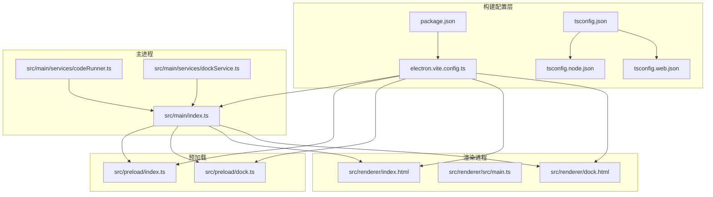
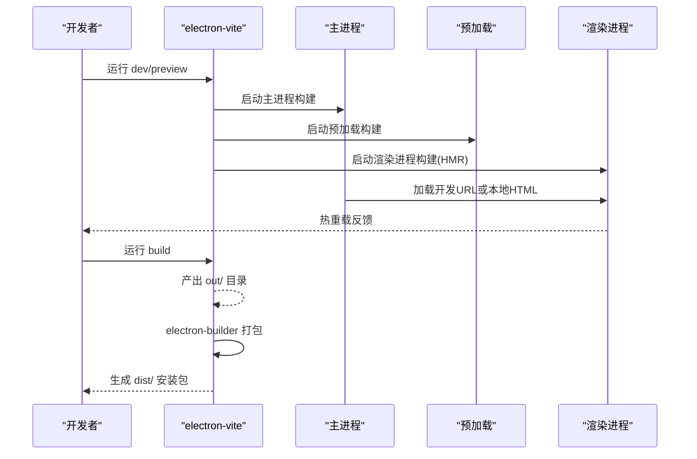
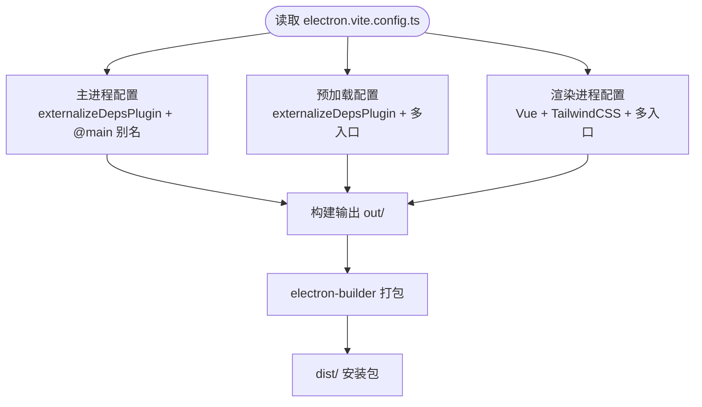
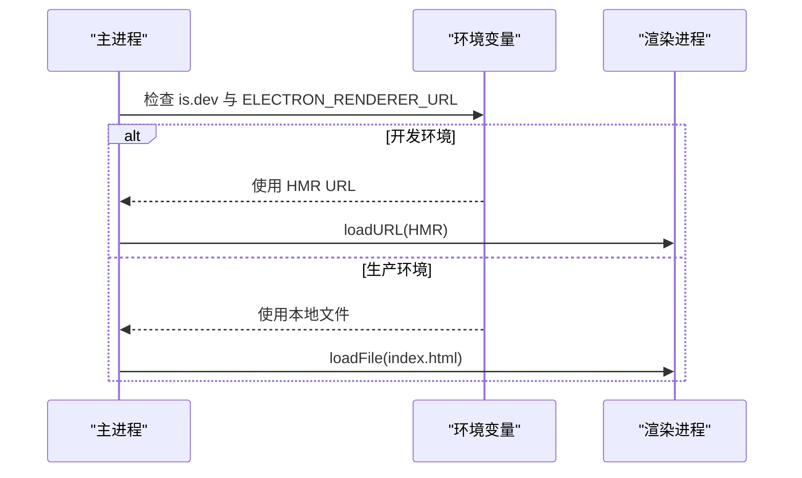
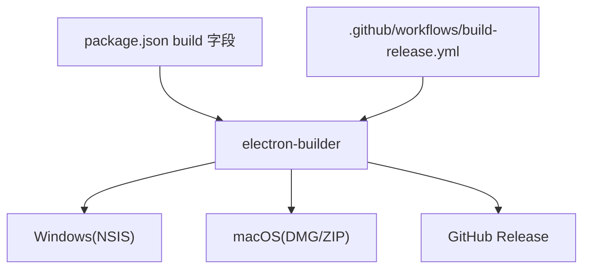
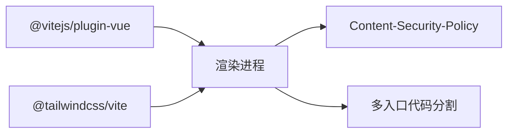
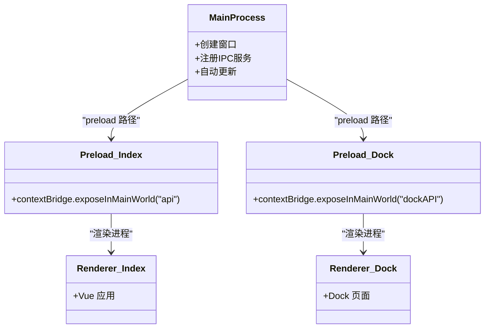
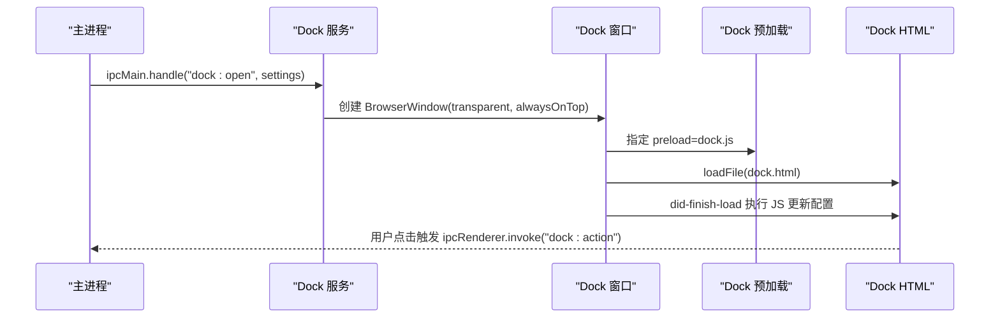
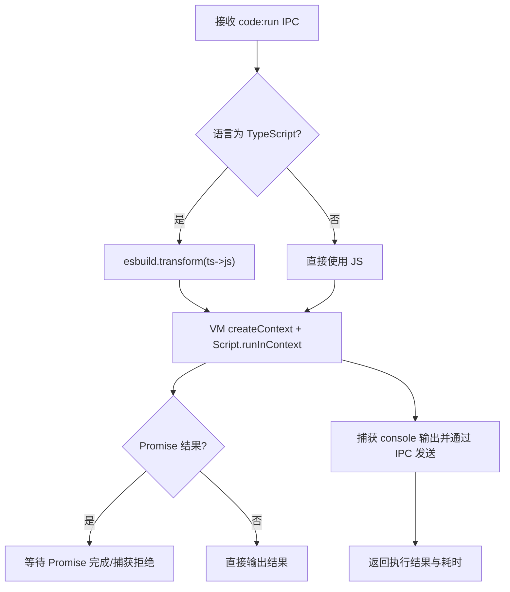
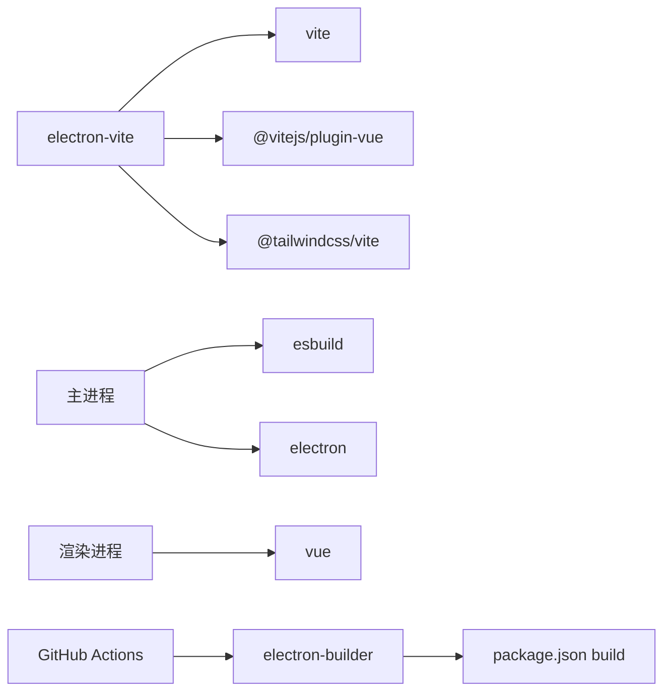

# 构建系统架构

<cite>
**本文档引用的文件**
- [electron.vite.config.ts](file://electron.vite.config.ts)
- [package.json](file://package.json)
- [tsconfig.json](file://tsconfig.json)
- [tsconfig.node.json](file://tsconfig.node.json)
- [tsconfig.web.json](file://tsconfig.web.json)
- [src/main/index.ts](file://src/main/index.ts)
- [src/preload/index.ts](file://src/preload/index.ts)
- [src/preload/dock.ts](file://src/preload/dock.ts)
- [src/renderer/src/main.ts](file://src/renderer/src/main.ts)
- [src/renderer/index.html](file://src/renderer/index.html)
- [src/renderer/dock.html](file://src/renderer/dock.html)
- [src/main/services/codeRunner.ts](file://src/main/services/codeRunner.ts)
- [src/main/services/dockService.ts](file://src/main/services/dockService.ts)
- [.github/workflows/build-release.yml](file://.github/workflows/build-release.yml)
- [README.md](file://README.md)
</cite>

## 目录
1. [引言](#引言)
2. [项目结构](#项目结构)
3. [核心组件](#核心组件)
4. [架构总览](#架构总览)
5. [详细组件分析](#详细组件分析)
6. [依赖关系分析](#依赖关系分析)
7. [性能考虑](#性能考虑)
8. [故障排除指南](#故障排除指南)
9. [结论](#结论)
10. [附录](#附录)

## 引言
本文件面向开发者工具箱项目的构建系统，系统性阐述基于 Electron-Vite 的现代桌面应用构建架构。重点包括：
- 开发与生产环境的差异化构建策略
- 多平台打包配置与资源优化
- Vite 集成与热重载、代码分割、静态资源处理
- Electron 应用的主进程/渲染进程/预加载脚本分别打包与 asar 配置
- 构建性能优化、调试配置与部署策略

## 项目结构
项目采用“主进程 + 预加载 + 渲染进程”三层架构，并通过 electron-vite 为三者提供统一的构建入口与别名映射。TypeScript 通过复合项目配置分别约束 Node 侧与 Web 侧。

**图示来源**
- [electron.vite.config.ts:1-49](file://electron.vite.config.ts#L1-L49)
- [package.json:1-120](file://package.json#L1-L120)
- [tsconfig.json:1-8](file://tsconfig.json#L1-L8)
- [tsconfig.node.json:1-19](file://tsconfig.node.json#L1-L19)
- [tsconfig.web.json:1-18](file://tsconfig.web.json#L1-L18)
- [src/main/index.ts:1-444](file://src/main/index.ts#L1-L444)
- [src/preload/index.ts:1-229](file://src/preload/index.ts#L1-L229)
- [src/preload/dock.ts:1-19](file://src/preload/dock.ts#L1-L19)
- [src/renderer/index.html:1-17](file://src/renderer/index.html#L1-L17)
- [src/renderer/src/main.ts:1-6](file://src/renderer/src/main.ts#L1-L6)
- [src/renderer/dock.html:1-464](file://src/renderer/dock.html#L1-L464)

**章节来源**
- [electron.vite.config.ts:1-49](file://electron.vite.config.ts#L1-L49)
- [package.json:1-120](file://package.json#L1-L120)
- [tsconfig.json:1-8](file://tsconfig.json#L1-L8)
- [tsconfig.node.json:1-19](file://tsconfig.node.json#L1-L19)
- [tsconfig.web.json:1-18](file://tsconfig.web.json#L1-L18)

## 核心组件
- 构建配置中心：electron-vite 提供三入口配置（main、preload、renderer），并启用外部依赖外置插件，提升开发与构建效率。
- 类型系统：复合 tsconfig 将 Node 与 Web 侧分别隔离，确保主进程与渲染进程的类型安全。
- 应用入口：主进程负责窗口生命周期、IPC 服务注册与自动更新；预加载脚本通过 contextBridge 暴露受限 API；渲染进程承载 Vue 应用与 Dock 页面。

**章节来源**
- [electron.vite.config.ts:6-48](file://electron.vite.config.ts#L6-L48)
- [tsconfig.node.json:1-19](file://tsconfig.node.json#L1-L19)
- [tsconfig.web.json:1-18](file://tsconfig.web.json#L1-L18)
- [src/main/index.ts:110-395](file://src/main/index.ts#L110-L395)
- [src/preload/index.ts:11-229](file://src/preload/index.ts#L11-L229)

## 架构总览
下图展示 Electron-Vite 在本项目中的整体工作流：开发模式下由 electron-vite dev/preview 提供 HMR；生产模式下 electron-vite build 输出产物，再由 electron-builder 打包为多平台安装包。

**图示来源**
- [electron.vite.config.ts:19-26](file://electron.vite.config.ts#L19-L26)
- [src/main/index.ts:168-173](file://src/main/index.ts#L168-L173)
- [package.json:20-26](file://package.json#L20-L26)

**章节来源**
- [README.md:86-114](file://README.md#L86-L114)
- [package.json:12-26](file://package.json#L12-L26)

## 详细组件分析

### 1) Electron-Vite 构建配置设计
- 主进程（main）：启用 externalizeDepsPlugin 外置依赖，减少打包体积；路径别名 @main 指向 src/main。
- 预加载（preload）：启用 externalizeDepsPlugin；多入口配置 index 与 dock，分别对应主窗口与 Dock 窗口。
- 渲染进程（renderer）：启用 @vitejs/plugin-vue 与 TailwindCSS 插件；多入口 index 与 dock，分别对应主界面与 Dock 页面。
- 构建产物：electron-vite build 输出至 out/ 目录，交由 electron-builder 打包。

**图示来源**
- [electron.vite.config.ts:6-48](file://electron.vite.config.ts#L6-L48)

**章节来源**
- [electron.vite.config.ts:6-48](file://electron.vite.config.ts#L6-L48)

### 2) 开发与生产环境差异
- 开发环境：主进程通过 ELECTRON_RENDERER_URL 加载渲染进程；预加载与渲染进程共享 HMR。
- 生产环境：主进程加载本地 HTML 文件；预加载与渲染进程产物固化。

**图示来源**
- [src/main/index.ts:168-173](file://src/main/index.ts#L168-L173)

**章节来源**
- [src/main/index.ts:168-173](file://src/main/index.ts#L168-L173)

### 3) 多平台打包与资源优化
- electron-builder 配置：
  - appId/productName 指定应用标识与名称
  - files/include extraResources 指定打包文件与资源复制
  - 平台目标：Windows（NSIS）、macOS（DMG/ZIP）、Linux（可扩展）
  - 自动更新发布到 GitHub Releases
- GitHub Actions 工作流：
  - Windows/macOS 双矩阵构建
  - 跳过 macOS 代码签名（CI 无证书）
  - 上传 dist 产物并发布到 GitHub Release

**图示来源**
- [package.json:74-118](file://package.json#L74-L118)
- [.github/workflows/build-release.yml:12-91](file://.github/workflows/build-release.yml#L12-L91)

**章节来源**
- [package.json:74-118](file://package.json#L74-L118)
- [.github/workflows/build-release.yml:12-91](file://.github/workflows/build-release.yml#L12-L91)

### 4) Vite 集成与资源处理
- Vue 插件：在渲染进程启用，支持 .vue 单文件组件与模板编译。
- TailwindCSS 插件：在渲染进程启用，支持原子化样式与按需生成。
- 静态资源：通过 Vite 默认处理（图片、字体等），配合 CSP 策略保证安全加载。
- 代码分割：多入口（index/dock）天然形成代码分割，按需加载。

**图示来源**
- [electron.vite.config.ts:38](file://electron.vite.config.ts#L38)
- [src/renderer/index.html:7-9](file://src/renderer/index.html#L7-L9)

**章节来源**
- [electron.vite.config.ts:38](file://electron.vite.config.ts#L38)
- [src/renderer/index.html:7-9](file://src/renderer/index.html#L7-L9)

### 5) Electron 应用的特殊构建需求
- 主进程与渲染进程分离：主进程负责系统交互与 IPC；渲染进程负责 UI。
- 预加载脚本：
  - index.ts：暴露完整 API 给渲染进程
  - dock.ts：仅暴露 Dock 专用 API
- asar 打包：electron-builder 默认将 out/ 打包为 asar，resources/ 作为额外资源复制。

**图示来源**
- [src/main/index.ts:122](file://src/main/index.ts#L122)
- [src/preload/index.ts:215-229](file://src/preload/index.ts#L215-L229)
- [src/preload/dock.ts:8-19](file://src/preload/dock.ts#L8-L19)
- [src/renderer/index.html:14](file://src/renderer/index.html#L14)

**章节来源**
- [src/main/index.ts:122](file://src/main/index.ts#L122)
- [src/preload/index.ts:215-229](file://src/preload/index.ts#L215-L229)
- [src/preload/dock.ts:8-19](file://src/preload/dock.ts#L8-L19)
- [src/renderer/index.html:14](file://src/renderer/index.html#L14)

### 6) Dock 窗口的独立构建与通信
- Dock 窗口独立 HTML 与预加载脚本，通过 IPC 与主进程通信，实现系统应用快速启动与设置页切换。
- Dock 窗口尺寸与位置根据屏幕与图标数量动态计算，支持透明、置顶与跨工作区显示。

**图示来源**
- [src/main/services/dockService.ts:64-108](file://src/main/services/dockService.ts#L64-L108)
- [src/main/services/dockService.ts:115-228](file://src/main/services/dockService.ts#L115-L228)
- [src/preload/dock.ts:4-6](file://src/preload/dock.ts#L4-L6)
- [src/renderer/dock.html:1-464](file://src/renderer/dock.html#L1-L464)

**章节来源**
- [src/main/services/dockService.ts:64-108](file://src/main/services/dockService.ts#L64-L108)
- [src/main/services/dockService.ts:115-228](file://src/main/services/dockService.ts#L115-L228)
- [src/preload/dock.ts:4-6](file://src/preload/dock.ts#L4-L6)
- [src/renderer/dock.html:1-464](file://src/renderer/dock.html#L1-L464)

### 7) 代码运行器的构建与运行时注意
- 代码运行器在主进程中通过 esbuild 将 TypeScript 转换为 JavaScript，并在 VM 沙箱中执行，实时捕获输出并通过 IPC 回传。
- 为避免端口占用，提供服务器追踪与清理机制，支持按端口终止 Electron 相关进程。

**图示来源**
- [src/main/services/codeRunner.ts:98-246](file://src/main/services/codeRunner.ts#L98-L246)

**章节来源**
- [src/main/services/codeRunner.ts:98-246](file://src/main/services/codeRunner.ts#L98-L246)

## 依赖关系分析
- 构建工具链：electron-vite、vite、@vitejs/plugin-vue、@tailwindcss/vite、esbuild。
- 运行时框架：Electron、Vue 3、TypeScript。
- 打包与分发：electron-builder、GitHub Actions。
- 类型系统：复合 tsconfig，分别约束 Node 与 Web 侧。

**图示来源**
- [electron.vite.config.ts:2-4](file://electron.vite.config.ts#L2-L4)
- [package.json:52-72](file://package.json#L52-L72)
- [package.json:74-118](file://package.json#L74-L118)
- [.github/workflows/build-release.yml:44-45](file://.github/workflows/build-release.yml#L44-L45)

**章节来源**
- [package.json:52-72](file://package.json#L52-L72)
- [package.json:74-118](file://package.json#L74-L118)
- [.github/workflows/build-release.yml:44-45](file://.github/workflows/build-release.yml#L44-L45)

## 性能考虑
- 外部依赖外置：主进程与预加载启用 externalizeDepsPlugin，降低打包体积与构建时间。
- 多入口拆分：index/dock 多入口天然实现按需加载与缓存优化。
- 开发 HMR：渲染进程启用 Vite HMR，显著提升迭代速度。
- 资源安全：CSP 限制脚本与资源来源，结合 Tailwind/Tiny CSS 优化样式体积。
- 运行时清理：代码运行器对活动服务器进行追踪与清理，避免端口占用与资源泄漏。

**章节来源**
- [electron.vite.config.ts:8](file://electron.vite.config.ts#L8)
- [electron.vite.config.ts:16](file://electron.vite.config.ts#L16)
- [src/renderer/index.html:7-9](file://src/renderer/index.html#L7-L9)
- [src/main/services/codeRunner.ts:21-96](file://src/main/services/codeRunner.ts#L21-L96)

## 故障排除指南
- 开发环境无法热重载
  - 确认 dev/preview 命令与 HMR 环境变量设置
  - 检查渲染进程入口与 CSP 配置
- 打包后资源缺失
  - 检查 electron-builder files 与 extraResources 配置
  - 确认 resources 目录与图标路径
- 自动更新失败
  - 检查 GitHub Releases 权限与网络代理设置
  - 主进程确保在打包状态下配置 feed URL
- Dock 窗口异常
  - 检查预加载脚本暴露 API 与渲染进程执行时机
  - 确认透明窗口与 alwaysOnTop 设置

**章节来源**
- [src/main/index.ts:34-55](file://src/main/index.ts#L34-L55)
- [package.json:74-118](file://package.json#L74-L118)
- [src/preload/dock.ts:8-19](file://src/preload/dock.ts#L8-L19)
- [src/renderer/dock.html:1-464](file://src/renderer/dock.html#L1-L464)

## 结论
本项目通过 Electron-Vite 实现了现代化的桌面应用构建体系：清晰的主/预加载/渲染进程边界、完善的多平台打包与资源优化、以及可维护的类型系统与 CI/CD 流水线。借助多入口与外置依赖策略，兼顾开发体验与产物性能；通过 Dock 独立窗口与沙箱执行机制，满足复杂功能场景下的安全与可用性要求。

## 附录
- 常用命令参考
  - 开发：npm run dev / npm run start
  - 构建：npm run build
  - 平台构建：npm run build:win / build:mac / build:linux
  - 类型检查：npm run typecheck
  - Lint/格式化：npm run lint / npm run format

**章节来源**
- [README.md:86-114](file://README.md#L86-L114)
- [package.json:12-26](file://package.json#L12-L26)