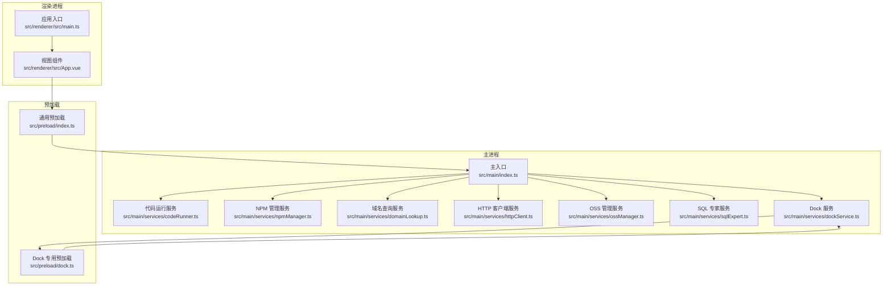
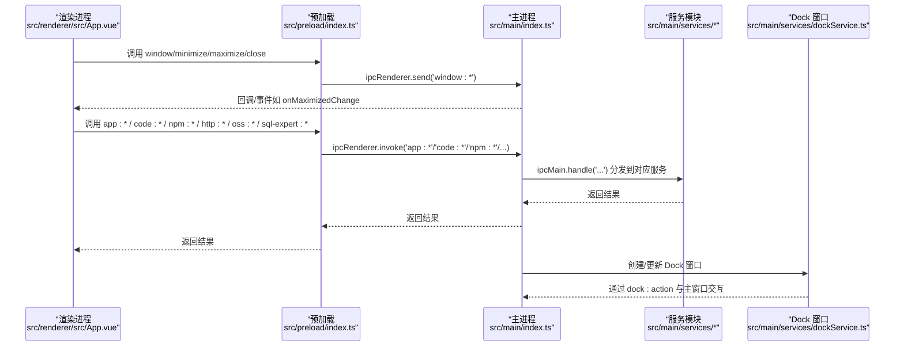
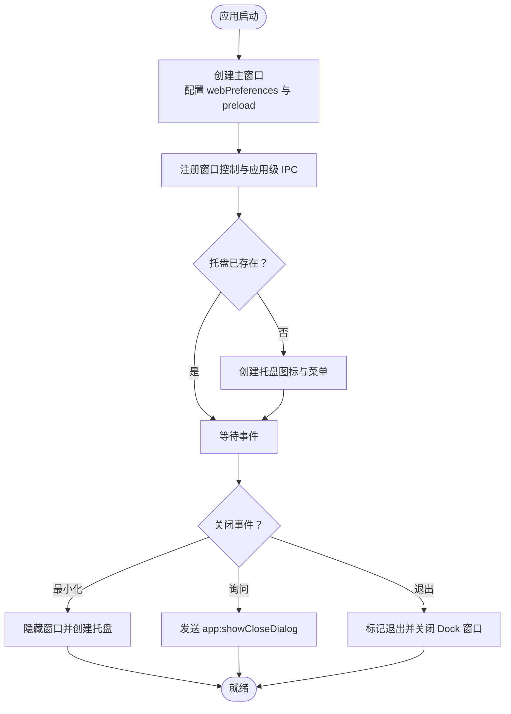
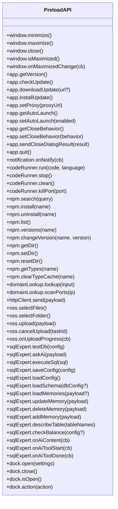
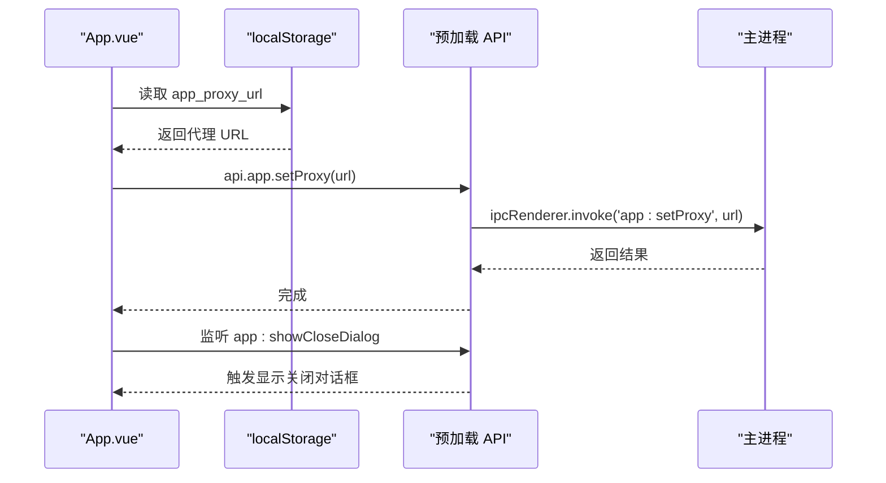
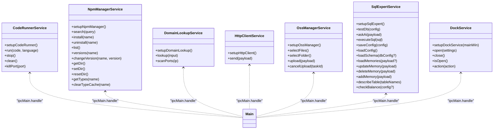
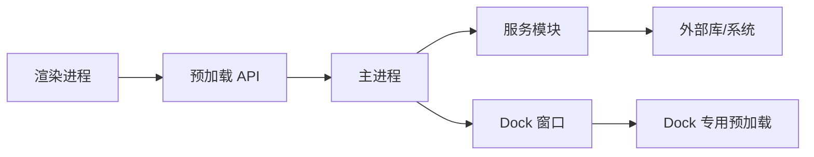

# 架构设计

<cite>
**本文档引用的文件**
- [src/main/index.ts](file://src/main/index.ts)
- [src/preload/index.ts](file://src/preload/index.ts)
- [src/preload/dock.ts](file://src/preload/dock.ts)
- [src/main/services/codeRunner.ts](file://src/main/services/codeRunner.ts)
- [src/main/services/npmManager.ts](file://src/main/services/npmManager.ts)
- [src/main/services/domainLookup.ts](file://src/main/services/domainLookup.ts)
- [src/main/services/httpClient.ts](file://src/main/services/httpClient.ts)
- [src/main/services/ossManager.ts](file://src/main/services/ossManager.ts)
- [src/main/services/sqlExpert.ts](file://src/main/services/sqlExpert.ts)
- [src/main/services/dockService.ts](file://src/main/services/dockService.ts)
- [src/renderer/src/main.ts](file://src/renderer/src/main.ts)
- [src/renderer/src/App.vue](file://src/renderer/src/App.vue)
- [electron.vite.config.ts](file://electron.vite.config.ts)
- [package.json](file://package.json)
- [README.md](file://README.md)
</cite>

## 目录
1. [引言](#引言)
2. [项目结构](#项目结构)
3. [核心组件](#核心组件)
4. [架构总览](#架构总览)
5. [详细组件分析](#详细组件分析)
6. [依赖分析](#依赖分析)
7. [性能考虑](#性能考虑)
8. [故障排查指南](#故障排查指南)
9. [结论](#结论)
10. [附录](#附录)

## 引言
本项目采用 Electron + Vue 3 + TypeScript 技术栈，围绕“开发者工具箱”的目标，构建了一个多进程架构的桌面应用。主进程负责系统级能力与高风险操作（如网络请求、文件系统、外部工具调用、数据库连接、AI 服务对接等），渲染进程承载 UI 与交互逻辑，预加载脚本通过安全桥接暴露受控 API，实现前后端分离与职责清晰的分层设计。项目通过 Vite/electron-vite 构建系统实现快速开发与热更新，并以模块化方式组织服务，便于扩展与维护。

## 项目结构
项目采用“主进程/预加载/渲染进程”三层结构，配合多模块服务拆分，形成清晰的职责边界与数据流：

- 主进程（src/main）：应用生命周期、窗口管理、系统托盘、自动更新、IPC 服务注册与处理、Dock 窗口管理等。
- 预加载（src/preload）：通过 contextBridge 暴露受限 API，隔离渲染进程与 Node/Electron 能力，保障安全。
- 渲染进程（src/renderer）：Vue 应用，组件化视图与交互，按需加载工具页面。
- 服务模块（src/main/services）：各功能域服务（代码运行、NPM 管理、域名查询、HTTP 客户端、OSS、SQL 专家、Dock 等），均通过 ipcMain/ipcRenderer 进行通信。
- 构建配置（electron.vite.config.ts）：多入口多构建目标，支持主进程、预加载、渲染进程分别构建与热更新。

**图表来源**
- [src/main/index.ts:1-444](file://src/main/index.ts#L1-L444)
- [src/preload/index.ts:1-229](file://src/preload/index.ts#L1-L229)
- [src/preload/dock.ts:1-19](file://src/preload/dock.ts#L1-L19)
- [src/main/services/dockService.ts:1-243](file://src/main/services/dockService.ts#L1-L243)
- [src/renderer/src/main.ts:1-6](file://src/renderer/src/main.ts#L1-L6)
- [src/renderer/src/App.vue:1-102](file://src/renderer/src/App.vue#L1-L102)

**章节来源**
- [README.md:140-153](file://README.md#L140-L153)
- [electron.vite.config.ts:1-49](file://electron.vite.config.ts#L1-L49)

## 核心组件
- 主进程入口与窗口管理：负责创建主窗口、托盘、系统级行为（最小化/退出）、自动更新、代理设置、开机自启动、窗口控制 IPC 等。
- 预加载安全桥：通过 contextBridge 暴露受限 API，渲染进程仅能通过白名单方法与主进程通信，避免直接访问 Node/Electron 能力。
- 渲染进程应用：Vue 应用入口与路由式视图组件，按需加载工具页面，统一通知与关闭对话框处理。
- 服务模块：各功能域服务均以 ipcMain.handle/handleSync 形式对外提供能力，渲染进程通过 ipcRenderer.invoke/send 调用。

**章节来源**
- [src/main/index.ts:110-395](file://src/main/index.ts#L110-L395)
- [src/preload/index.ts:11-229](file://src/preload/index.ts#L11-L229)
- [src/renderer/src/App.vue:1-102](file://src/renderer/src/App.vue#L1-L102)

## 架构总览
下图展示了 Electron 多进程架构与 IPC 通信的关键节点，以及 Dock 独立窗口与主窗口的协作关系。

**图表来源**
- [src/renderer/src/App.vue:37-52](file://src/renderer/src/App.vue#L37-L52)
- [src/preload/index.ts:13-47](file://src/preload/index.ts#L13-L47)
- [src/main/index.ts:175-395](file://src/main/index.ts#L175-L395)
- [src/main/services/dockService.ts:64-108](file://src/main/services/dockService.ts#L64-L108)

## 详细组件分析

### 主进程与窗口管理
- 职责：创建主窗口、设置 webPreferences（隔离上下文、禁用 Node 集成、启用预加载）、注册窗口控制与应用级 IPC、托盘与最小化行为、自动更新、代理与开机自启动。
- 关键点：窗口关闭拦截与行为策略（询问/最小化/退出），托盘菜单与双击显示主窗口，下载进度与更新完成事件通过 IPC 推送渲染进程。
- Dock 协同：通过 dockService 管理独立透明窗口，隐藏主窗口并转发 Dock 动作到主窗口或系统。

**图表来源**
- [src/main/index.ts:110-213](file://src/main/index.ts#L110-L213)

**章节来源**
- [src/main/index.ts:110-395](file://src/main/index.ts#L110-L395)

### 预加载安全桥与 API 暴露
- 职责：通过 contextBridge.exposeInMainWorld 暴露受限 API，渲染进程仅能通过白名单方法与主进程通信，避免直接访问 Node/Electron 能力。
- 结构：按功能域分组（窗口控制、应用信息、通知、代码运行、NPM、域名查询、HTTP 客户端、OSS、SQL 专家、Dock），每组提供 invoke/send 与事件监听。
- Dock 专用：Dock 窗口使用独立预加载脚本，仅暴露 dock:action。

**图表来源**
- [src/preload/index.ts:11-213](file://src/preload/index.ts#L11-L213)
- [src/preload/dock.ts:3-18](file://src/preload/dock.ts#L3-L18)

**章节来源**
- [src/preload/index.ts:11-229](file://src/preload/index.ts#L11-L229)
- [src/preload/dock.ts:1-19](file://src/preload/dock.ts#L1-L19)

### 渲染进程与视图组件
- 职责：Vue 应用入口与路由式视图组件，按需加载工具页面，统一通知与关闭对话框处理，本地存储代理配置并在挂载时应用。
- 关键点：工具列表与动态组件加载，KeepAlive 缓存，全局通知与关闭对话框弹窗。

**图表来源**
- [src/renderer/src/App.vue:37-52](file://src/renderer/src/App.vue#L37-L52)
- [src/preload/index.ts:39-47](file://src/preload/index.ts#L39-L47)

**章节来源**
- [src/renderer/src/App.vue:1-102](file://src/renderer/src/App.vue#L1-L102)
- [src/renderer/src/main.ts:1-6](file://src/renderer/src/main.ts#L1-L6)

### 服务模块与 IPC 通信
- 代码运行服务：在主进程内使用 vm + esbuild 提供沙箱执行与 TypeScript 编译，劫持 http/https/net 模块追踪服务器，支持停止与端口进程终止。
- NPM 管理服务：封装 npm 命令执行、包安装目录管理、类型定义读取与自动安装 @types 包。
- 域名查询服务：DNS 解析、IP 地理位置、ISP、反向 DNS、技术栈识别、端口扫描（优先 nmap，回退 Socket）。
- HTTP 客户端服务：基于 Electron net 模块发起请求，自动使用应用代理设置，支持超时与错误处理。
- OSS 管理服务：基于 ali-oss SDK 实现多文件/文件夹上传、断点续传、并发分片、进度事件与取消。
- SQL 专家服务：数据库连接池、SQL 只读校验、AI 工具调用（query_database/describe_table_schema/render_chart/save_memory/export_data）、Schema 动态生成、记忆管理、CSV 导出与图表渲染。
- Dock 服务：独立透明窗口，始终置顶，支持底部/左侧/右侧停靠，应用项配置与动作转发。

**图表来源**
- [src/main/services/codeRunner.ts:98-318](file://src/main/services/codeRunner.ts#L98-L318)
- [src/main/services/npmManager.ts:207-552](file://src/main/services/npmManager.ts#L207-L552)
- [src/main/services/domainLookup.ts:679-689](file://src/main/services/domainLookup.ts#L679-L689)
- [src/main/services/httpClient.ts:15-112](file://src/main/services/httpClient.ts#L15-L112)
- [src/main/services/ossManager.ts:296-439](file://src/main/services/ossManager.ts#L296-L439)
- [src/main/services/sqlExpert.ts:1-800](file://src/main/services/sqlExpert.ts#L1-L800)
- [src/main/services/dockService.ts:111-229](file://src/main/services/dockService.ts#L111-L229)

**章节来源**
- [src/main/services/codeRunner.ts:98-318](file://src/main/services/codeRunner.ts#L98-L318)
- [src/main/services/npmManager.ts:207-552](file://src/main/services/npmManager.ts#L207-L552)
- [src/main/services/domainLookup.ts:679-689](file://src/main/services/domainLookup.ts#L679-L689)
- [src/main/services/httpClient.ts:15-112](file://src/main/services/httpClient.ts#L15-L112)
- [src/main/services/ossManager.ts:296-439](file://src/main/services/ossManager.ts#L296-L439)
- [src/main/services/sqlExpert.ts:1-800](file://src/main/services/sqlExpert.ts#L1-L800)
- [src/main/services/dockService.ts:111-229](file://src/main/services/dockService.ts#L111-L229)

### 构建系统与开发体验
- electron-vite：多入口配置，主进程、预加载、渲染进程分别构建，支持热更新与别名映射。
- 插件：@vitejs/plugin-vue、@tailwindcss/vite、externalizeDepsPlugin。
- 脚本：dev/start/build 等命令，结合 electron-builder 进行打包与发布。

**章节来源**
- [electron.vite.config.ts:1-49](file://electron.vite.config.ts#L1-L49)
- [package.json:12-27](file://package.json#L12-L27)

## 依赖分析
- 外部依赖：@electron-toolkit/*、electron-updater、ali-oss、auto-launch、axios、mysql2、openai、monaco-editor、echarts、tailwindcss 等。
- 模块耦合：渲染进程仅通过预加载 API 与主进程通信；服务模块通过 ipcMain.handle 注册，彼此低耦合；Dock 独立窗口通过专用预加载与主进程交互。
- 循环依赖：未见明显循环依赖；服务模块通过 IPC 解耦，避免直接互相引用。

**图表来源**
- [src/preload/index.ts:1-229](file://src/preload/index.ts#L1-L229)
- [src/main/index.ts:1-444](file://src/main/index.ts#L1-L444)
- [src/main/services/dockService.ts:1-243](file://src/main/services/dockService.ts#L1-L243)
- [src/preload/dock.ts:1-19](file://src/preload/dock.ts#L1-L19)

**章节来源**
- [package.json:28-73](file://package.json#L28-L73)

## 性能考虑
- 代码运行沙箱：使用 vm.createContext 与自定义 console 捕获输出，限制超时与 Promise 处理，避免阻塞主线程。
- NPM 管理：使用子进程执行 npm 命令并设置超时，安装目录可配置，减少磁盘 IO 与网络波动影响。
- 域名查询：优先使用 nmap 扫描，未安装时回退 Socket 扫描，限制并发与批量处理，避免阻塞 UI。
- HTTP 客户端：基于 Electron net 模块，自动使用代理与超时控制，避免 CORS 限制与前端阻塞。
- OSS 上传：分片并发上传、断点续传、进度节流与取消机制，降低大文件传输风险。
- SQL 专家：连接池限制并发、SQL 只读校验、工具调用流式返回、图表渲染与 CSV 导出异步处理。
- Dock 窗口：透明窗口与 alwaysOnTop 设置，跨工作区可见，避免遮挡主窗口。

[本节为通用性能指导，无需特定文件引用]

## 故障排查指南
- 自动更新失败：检查网络与代理设置，错误信息通过通知提示；下载进度与完成事件由主进程推送。
- 代理设置无效：确认渲染进程已调用 api.app.setProxy 并持久化到 localStorage；主进程 session 与环境变量同步。
- 代码运行异常：检查沙箱输出与错误信息，必要时清理活跃服务器与端口占用；使用 stop/clean/killPort 控制运行时资源。
- NPM 安装失败：检查安装目录写权限与网络；查看子进程输出与超时处理。
- 域名查询无结果：确认 DNS 解析与 ip-api.com 可达；端口扫描依赖 nmap，未安装时回退 Socket 方案。
- OSS 上传中断：使用 cancelUpload 取消任务并清理断点；检查凭证与 ACL 配置。
- SQL 专家报错：核对数据库连接配置与只读 SQL 规则；检查 AI 工具调用与 Schema 生成。

**章节来源**
- [src/main/index.ts:129-157](file://src/main/index.ts#L129-L157)
- [src/renderer/src/App.vue:39-47](file://src/renderer/src/App.vue#L39-L47)
- [src/main/services/codeRunner.ts:237-318](file://src/main/services/codeRunner.ts#L237-L318)
- [src/main/services/npmManager.ts:154-194](file://src/main/services/npmManager.ts#L154-L194)
- [src/main/services/domainLookup.ts:590-602](file://src/main/services/domainLookup.ts#L590-L602)
- [src/main/services/ossManager.ts:296-439](file://src/main/services/ossManager.ts#L296-L439)
- [src/main/services/sqlExpert.ts:365-400](file://src/main/services/sqlExpert.ts#L365-L400)

## 结论
本项目通过 Electron 多进程架构实现了职责清晰、安全可控的桌面应用。主进程集中处理高风险与系统级能力，渲染进程专注 UI 与交互，预加载脚本提供安全桥接。服务模块以 IPC 为纽带，模块间低耦合、可扩展性强。结合 Vite/electron-vite 构建体系与 TailwindCSS/Vue 生态，兼顾开发效率与用户体验。未来可在以下方面持续优化：进一步细化服务边界、引入插件化机制、增强错误恢复与可观测性、完善单元测试与集成测试覆盖。

[本节为总结性内容，无需特定文件引用]

## 附录
- 项目结构与模块分布参考 README 的“项目结构”与“功能模块”说明。
- 常用命令与构建发布流程参考 package.json 与 README 的“快速开始/常用命令/发布”。

**章节来源**
- [README.md:140-163](file://README.md#L140-L163)
- [package.json:12-27](file://package.json#L12-L27)