# 模块化设计

<cite>
**本文档引用的文件**
- [src/main/index.ts](file://src/main/index.ts)
- [src/main/services/codeRunner.ts](file://src/main/services/codeRunner.ts)
- [src/main/services/httpClient.ts](file://src/main/services/httpClient.ts)
- [src/main/services/sqlExpert.ts](file://src/main/services/sqlExpert.ts)
- [src/main/services/npmManager.ts](file://src/main/services/npmManager.ts)
- [src/main/services/domainLookup.ts](file://src/main/services/domainLookup.ts)
- [src/main/services/dockService.ts](file://src/main/services/dockService.ts)
- [src/main/services/ossManager.ts](file://src/main/services/ossManager.ts)
- [src/main/services/notification.ts](file://src/main/services/notification.ts)
- [src/preload/index.ts](file://src/preload/index.ts)
- [src/preload/dock.ts](file://src/preload/dock.ts)
- [package.json](file://package.json)
- [README.md](file://README.md)
</cite>

## 目录
1. [引言](#引言)
2. [项目结构](#项目结构)
3. [核心组件](#核心组件)
4. [架构概览](#架构概览)
5. [详细组件分析](#详细组件分析)
6. [依赖分析](#依赖分析)
7. [性能考虑](#性能考虑)
8. [故障排除指南](#故障排除指南)
9. [结论](#结论)

## 引言

开发者工具箱是一个基于 Electron + Vue 3 + TypeScript 的桌面开发工具集合。该项目采用模块化设计理念，将多种高频开发工具功能集成在一个客户端应用中，通过服务注册模式实现松耦合的模块架构。本文档深入分析项目的模块化设计，包括服务注册模式、模块间解耦设计、依赖注入机制，以及核心服务模块的组织方式。

## 项目结构

项目采用分层和功能模块化的混合架构设计：

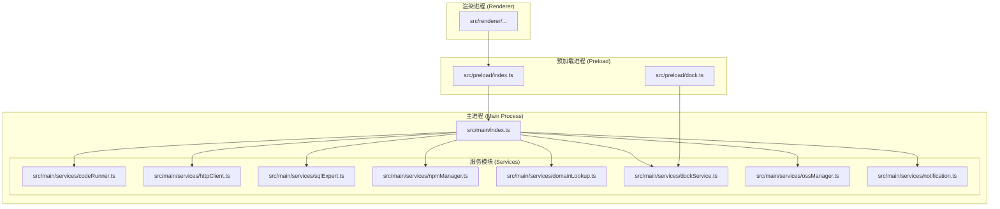
```mermaid
graph TB
subgraph "主进程 (Main Process)"
A[src/main/index.ts]
subgraph "服务模块 (Services)"
B[src/main/services/codeRunner.ts]
C[src/main/services/httpClient.ts]
D[src/main/services/sqlExpert.ts]
E[src/main/services/npmManager.ts]
F[src/main/services/domainLookup.ts]
G[src/main/services/dockService.ts]
H[src/main/services/ossManager.ts]
I[src/main/services/notification.ts]
end
end
subgraph "预加载进程 (Preload)"
J[src/preload/index.ts]
K[src/preload/dock.ts]
end
subgraph "渲染进程 (Renderer)"
L[src/renderer/...]
end
A --> B
A --> C
A --> D
A --> E
A --> F
A --> G
A --> H
A --> I
J --> A
K --> G
L --> J
```

**图表来源**
- [src/main/index.ts:1-444](file://src/main/index.ts#L1-L444)
- [src/preload/index.ts:1-229](file://src/preload/index.ts#L1-L229)

项目结构特点：
- **主进程服务化**：所有核心功能以服务模块形式组织
- **预加载桥接**：通过安全的 API 暴露机制连接主进程服务
- **模块独立性**：每个服务模块可独立开发、测试和维护
- **IPC 通信**：通过 Electron IPC 实现进程间通信

**章节来源**
- [src/main/index.ts:1-444](file://src/main/index.ts#L1-L444)
- [README.md:140-153](file://README.md#L140-L153)

## 核心组件

### 服务注册模式

项目采用统一的服务注册模式，所有服务模块都遵循相同的初始化接口：

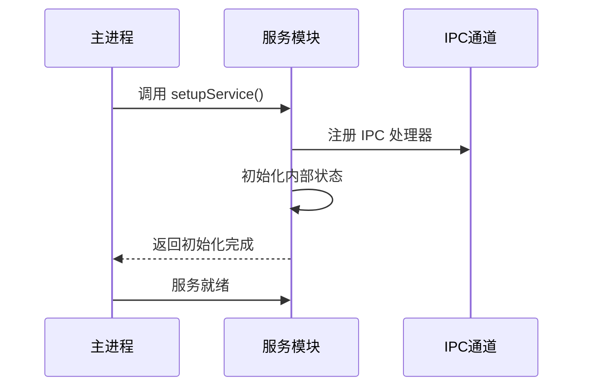
```mermaid
sequenceDiagram
participant Main as 主进程
participant Service as 服务模块
participant IPC as IPC通道
Main->>Service : 调用 setupService()
Service->>IPC : 注册 IPC 处理器
Service->>Service : 初始化内部状态
Service-->>Main : 返回初始化完成
Main->>Service : 服务就绪
```

**图表来源**
- [src/main/index.ts:422-428](file://src/main/index.ts#L422-L428)

### 模块间解耦设计

各服务模块通过以下机制实现解耦：

1. **统一接口约定**：所有服务模块都导出 `setupService()` 函数
2. **IPC 通信隔离**：服务间通过 IPC 间接通信
3. **依赖注入**：通过参数传递依赖而非全局状态
4. **错误边界**：每个服务模块独立处理自身错误

### 依赖注入机制

项目实现了简单的依赖注入模式：

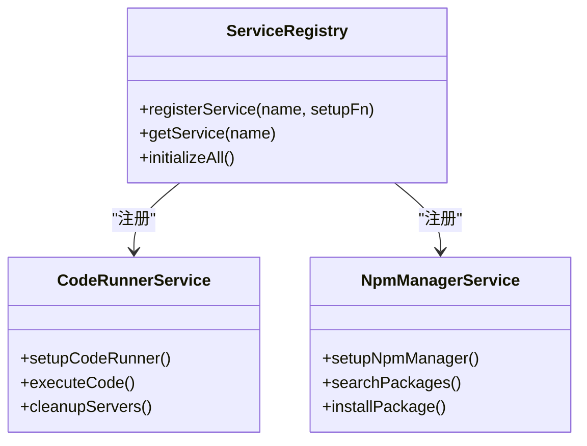
```mermaid
classDiagram
class ServiceRegistry {
+registerService(name, setupFn)
+getService(name)
+initializeAll()
}
class CodeRunnerService {
+setupCodeRunner()
+executeCode()
+cleanupServers()
}
class NpmManagerService {
+setupNpmManager()
+searchPackages()
+installPackage()
}
ServiceRegistry --> CodeRunnerService : "注册"
ServiceRegistry --> NpmManagerService : "注册"
```

**图表来源**
- [src/main/index.ts:422-428](file://src/main/index.ts#L422-L428)
- [src/main/services/codeRunner.ts:98-318](file://src/main/services/codeRunner.ts#L98-L318)
- [src/main/services/npmManager.ts:207-552](file://src/main/services/npmManager.ts#L207-L552)

**章节来源**
- [src/main/index.ts:422-428](file://src/main/index.ts#L422-L428)
- [src/main/services/codeRunner.ts:98-318](file://src/main/services/codeRunner.ts#L98-L318)
- [src/main/services/npmManager.ts:207-552](file://src/main/services/npmManager.ts#L207-L552)

## 架构概览

项目采用三层架构设计：

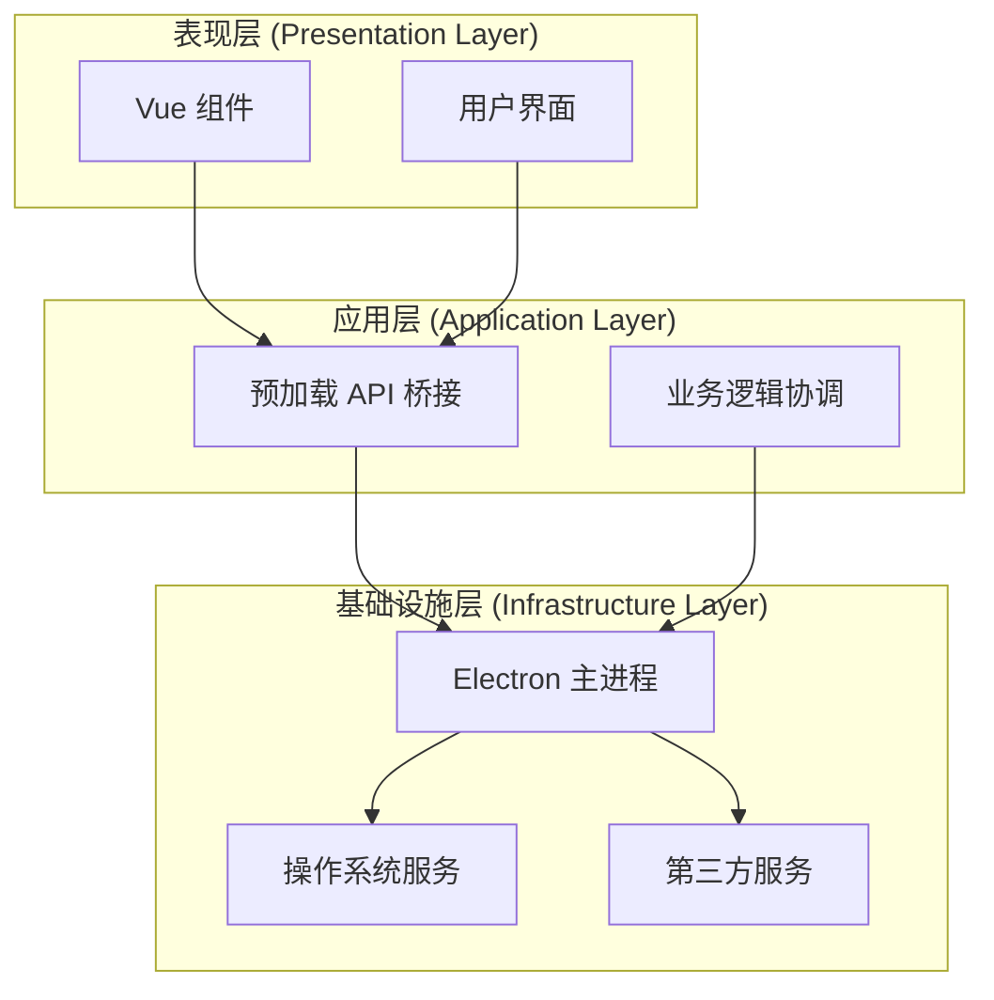
```mermaid
graph TB
subgraph "表现层 (Presentation Layer)"
A[Vue 组件]
B[用户界面]
end
subgraph "应用层 (Application Layer)"
C[预加载 API 桥接]
D[业务逻辑协调]
end
subgraph "基础设施层 (Infrastructure Layer)"
E[Electron 主进程]
F[操作系统服务]
G[第三方服务]
end
A --> C
B --> C
C --> E
D --> E
E --> F
E --> G
```

**图表来源**
- [src/preload/index.ts:1-229](file://src/preload/index.ts#L1-L229)
- [src/main/index.ts:1-444](file://src/main/index.ts#L1-L444)

### 模块生命周期管理

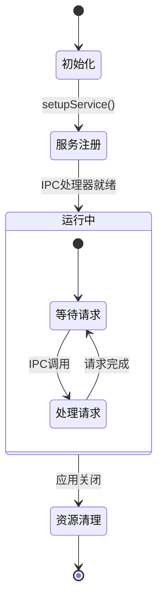
```mermaid
stateDiagram-v2
[*] --> 初始化
初始化 --> 服务注册 : setupService()
服务注册 --> 运行中 : IPC处理器就绪
运行中 --> 资源清理 : 应用关闭
资源清理 --> [*]
state 运行中 {
[*] --> 等待请求
等待请求 --> 处理请求 : IPC调用
处理请求 --> 等待请求 : 请求完成
}
```

**图表来源**
- [src/main/index.ts:422-428](file://src/main/index.ts#L422-L428)
- [src/main/services/codeRunner.ts:237-246](file://src/main/services/codeRunner.ts#L237-L246)

**章节来源**
- [src/main/index.ts:422-428](file://src/main/index.ts#L422-L428)
- [src/main/services/codeRunner.ts:237-246](file://src/main/services/codeRunner.ts#L237-L246)

## 详细组件分析

### 代码运行器 (CodeRunner) 模块

代码运行器是项目的核心模块之一，提供了安全的代码执行环境：

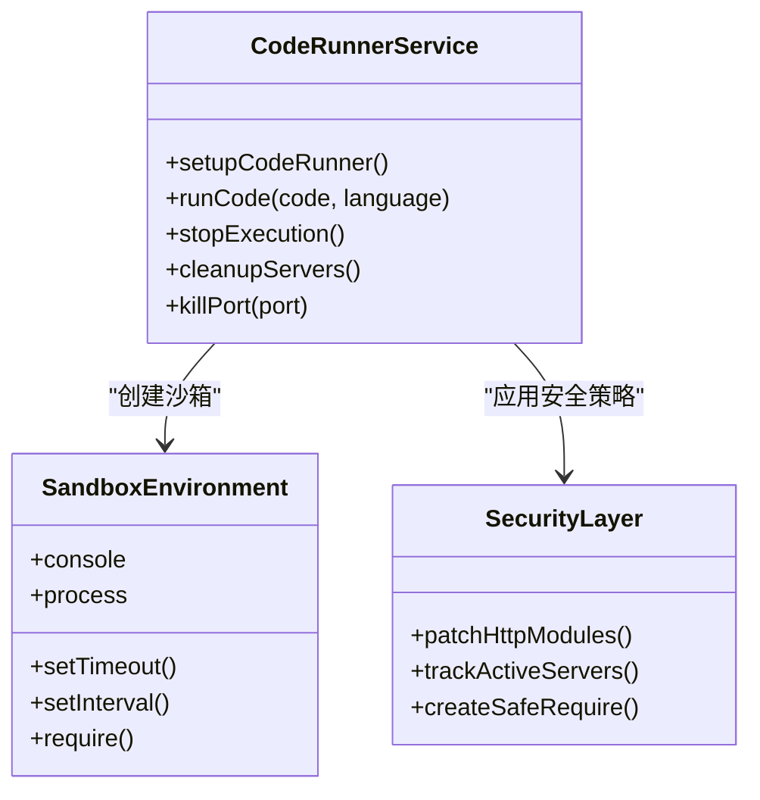
```mermaid
classDiagram
class CodeRunnerService {
+setupCodeRunner()
+runCode(code, language)
+stopExecution()
+cleanupServers()
+killPort(port)
}
class SandboxEnvironment {
+console
+setTimeout()
+setInterval()
+require()
+process
}
class SecurityLayer {
+patchHttpModules()
+trackActiveServers()
+createSafeRequire()
}
CodeRunnerService --> SandboxEnvironment : "创建沙箱"
CodeRunnerService --> SecurityLayer : "应用安全策略"
```

**图表来源**
- [src/main/services/codeRunner.ts:98-318](file://src/main/services/codeRunner.ts#L98-L318)

#### 安全沙箱设计

代码运行器实现了多层次的安全防护：

1. **HTTP 模块劫持**：拦截 http/https/net 模块的 createServer 调用
2. **服务器追踪**：监控所有活跃的网络服务器实例
3. **安全模块加载**：限制模块访问范围，仅允许已安装包
4. **资源清理**：自动清理僵尸进程和网络连接

#### 依赖关系处理

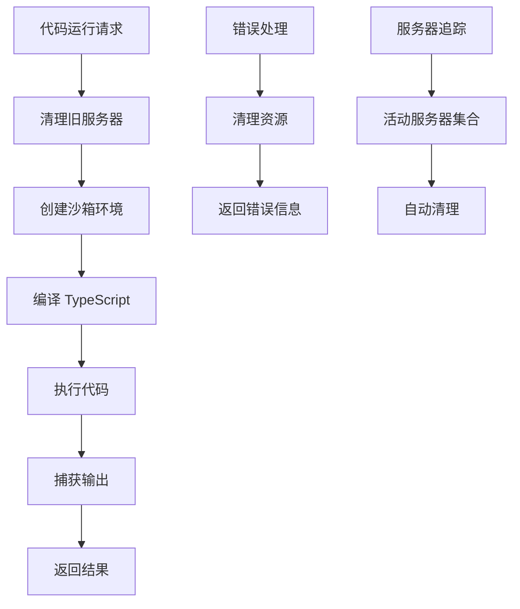
```mermaid
flowchart TD
A[代码运行请求] --> B[清理旧服务器]
B --> C[创建沙箱环境]
C --> D[编译 TypeScript]
D --> E[执行代码]
E --> F[捕获输出]
F --> G[返回结果]
H[错误处理] --> I[清理资源]
I --> J[返回错误信息]
K[服务器追踪] --> L[活动服务器集合]
L --> M[自动清理]
```

**图表来源**
- [src/main/services/codeRunner.ts:106-234](file://src/main/services/codeRunner.ts#L106-L234)

**章节来源**
- [src/main/services/codeRunner.ts:98-318](file://src/main/services/codeRunner.ts#L98-L318)

### HTTP 客户端 (HttpClient) 模块

HTTP 客户端模块提供了强大的网络请求能力：

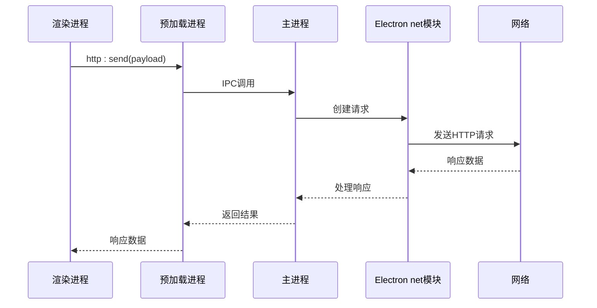
```mermaid
sequenceDiagram
participant Renderer as 渲染进程
participant Preload as 预加载进程
participant Main as 主进程
participant Net as Electron net模块
participant Network as 网络
Renderer->>Preload : http : send(payload)
Preload->>Main : IPC调用
Main->>Net : 创建请求
Net->>Network : 发送HTTP请求
Network-->>Net : 响应数据
Net-->>Main : 处理响应
Main-->>Preload : 返回结果
Preload-->>Renderer : 响应数据
```

**图表来源**
- [src/main/services/httpClient.ts:15-112](file://src/main/services/httpClient.ts#L15-L112)
- [src/preload/index.ts:106-115](file://src/preload/index.ts#L106-L115)

#### 功能特性

- **CORS 绕过**：在主进程发送请求，完全绕过浏览器 CORS 限制
- **代理支持**：自动使用应用代理设置
- **超时控制**：可配置的请求超时机制
- **错误处理**：完善的错误捕获和处理

**章节来源**
- [src/main/services/httpClient.ts:15-112](file://src/main/services/httpClient.ts#L15-L112)

### SQL 专家 (SqlExpert) 模块

SQL 专家模块是最复杂的业务服务模块：

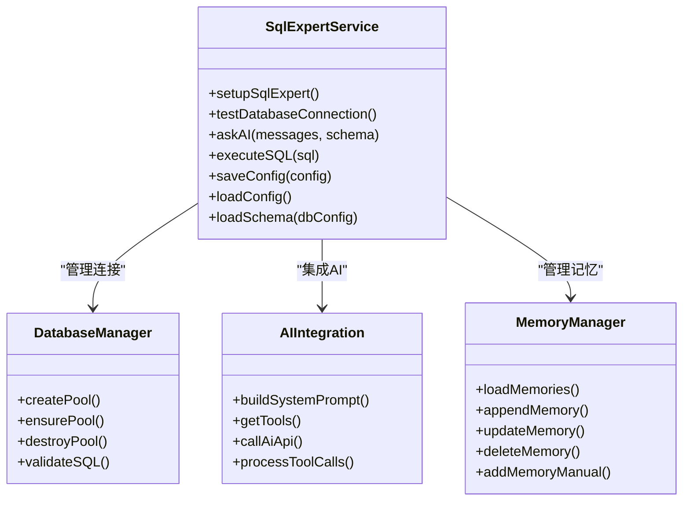
```mermaid
classDiagram
class SqlExpertService {
+setupSqlExpert()
+testDatabaseConnection()
+askAI(messages, schema)
+executeSQL(sql)
+saveConfig(config)
+loadConfig()
+loadSchema(dbConfig)
}
class DatabaseManager {
+createPool()
+ensurePool()
+destroyPool()
+validateSQL()
}
class AIIntegration {
+buildSystemPrompt()
+getTools()
+callAiApi()
+processToolCalls()
}
class MemoryManager {
+loadMemories()
+appendMemory()
+updateMemory()
+deleteMemory()
+addMemoryManual()
}
SqlExpertService --> DatabaseManager : "管理连接"
SqlExpertService --> AIIntegration : "集成AI"
SqlExpertService --> MemoryManager : "管理记忆"
```

**图表来源**
- [src/main/services/sqlExpert.ts:128-250](file://src/main/services/sqlExpert.ts#L128-L250)

#### 核心功能

1. **数据库连接管理**：使用连接池管理 MySQL 连接
2. **SQL 校验**：严格的只读 SQL 语法和语义校验
3. **AI 集成**：与大语言模型的工具调用集成
4. **记忆管理**：本地化的知识记忆存储
5. **配置持久化**：用户配置的本地存储

**章节来源**
- [src/main/services/sqlExpert.ts:128-250](file://src/main/services/sqlExpert.ts#L128-L250)

### NPM 管理器 (NpmManager) 模块

NPM 管理器提供了完整的包管理功能：

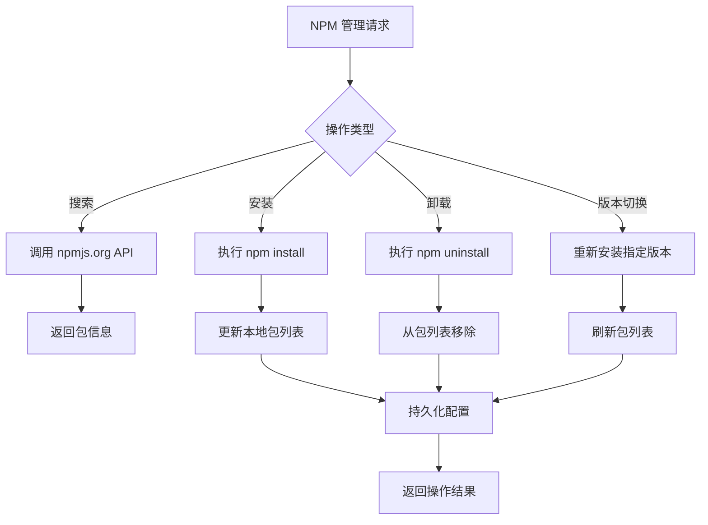
```mermaid
flowchart TD
A[NPM 管理请求] --> B{操作类型}
B --> |搜索| C[调用 npmjs.org API]
B --> |安装| D[执行 npm install]
B --> |卸载| E[执行 npm uninstall]
B --> |版本切换| F[重新安装指定版本]
C --> G[返回包信息]
D --> H[更新本地包列表]
E --> I[从包列表移除]
F --> J[刷新包列表]
H --> K[持久化配置]
I --> K
J --> K
K --> L[返回操作结果]
```

**图表来源**
- [src/main/services/npmManager.ts:207-552](file://src/main/services/npmManager.ts#L207-L552)

#### 包管理特性

- **包搜索**：实时搜索 npmjs.org 包仓库
- **版本管理**：支持包版本切换和锁定
- **类型定义**：自动处理 TypeScript 类型文件
- **目录配置**：可配置的包安装目录

**章节来源**
- [src/main/services/npmManager.ts:207-552](file://src/main/services/npmManager.ts#L207-L552)

### 域名查询 (DomainLookup) 模块

域名查询模块提供了全面的网络诊断功能：

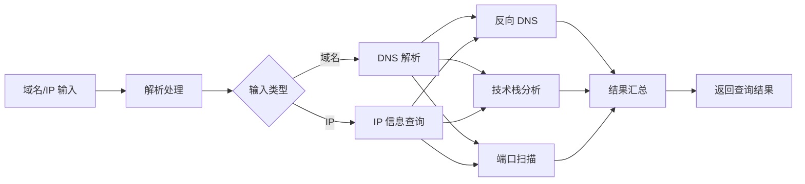
```mermaid
graph LR
A[域名/IP 输入] --> B[解析处理]
B --> C{输入类型}
C --> |域名| D[DNS 解析]
C --> |IP| E[IP 信息查询]
D --> F[反向 DNS]
D --> G[技术栈分析]
D --> H[端口扫描]
E --> F
E --> G
E --> H
F --> I[结果汇总]
G --> I
H --> I
I --> J[返回查询结果]
```

**图表来源**
- [src/main/services/domainLookup.ts:607-666](file://src/main/services/domainLookup.ts#L607-L666)

#### 查询能力

- **DNS 解析**：支持 IPv4 和 IPv6 解析
- **IP 信息**：地理位置、运营商、网络类别
- **技术栈识别**：通过 HTTP 头部分析
- **端口扫描**：优先使用 nmap，回退 Socket 扫描

**章节来源**
- [src/main/services/domainLookup.ts:607-666](file://src/main/services/domainLookup.ts#L607-L666)

### Dock 服务 (DockService) 模块

Dock 服务提供了 macOS 风格的悬浮工具栏：

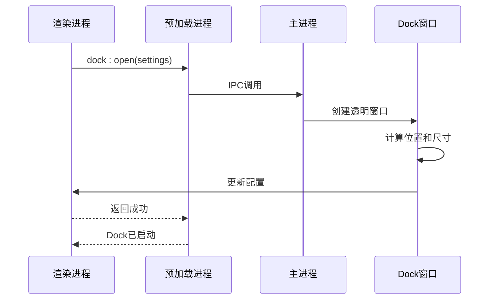
```mermaid
sequenceDiagram
participant Renderer as 渲染进程
participant Preload as 预加载进程
participant Main as 主进程
participant Dock as Dock窗口
Renderer->>Preload : dock : open(settings)
Preload->>Main : IPC调用
Main->>Dock : 创建透明窗口
Dock->>Dock : 计算位置和尺寸
Dock->>Renderer : 更新配置
Renderer-->>Preload : 返回成功
Preload-->>Renderer : Dock已启动
```

**图表来源**
- [src/main/services/dockService.ts:111-141](file://src/main/services/dockService.ts#L111-L141)

#### Dock 功能

- **透明窗口**：始终置顶的透明悬浮窗口
- **多位置支持**：底部、左侧、右侧停靠
- **应用集成**：可配置的应用项和快捷动作
- **平台适配**：跨平台的窗口管理

**章节来源**
- [src/main/services/dockService.ts:111-141](file://src/main/services/dockService.ts#L111-L141)

### OSS 管理器 (OssManager) 模块

OSS 管理器提供了阿里云 OSS 的完整上传功能：

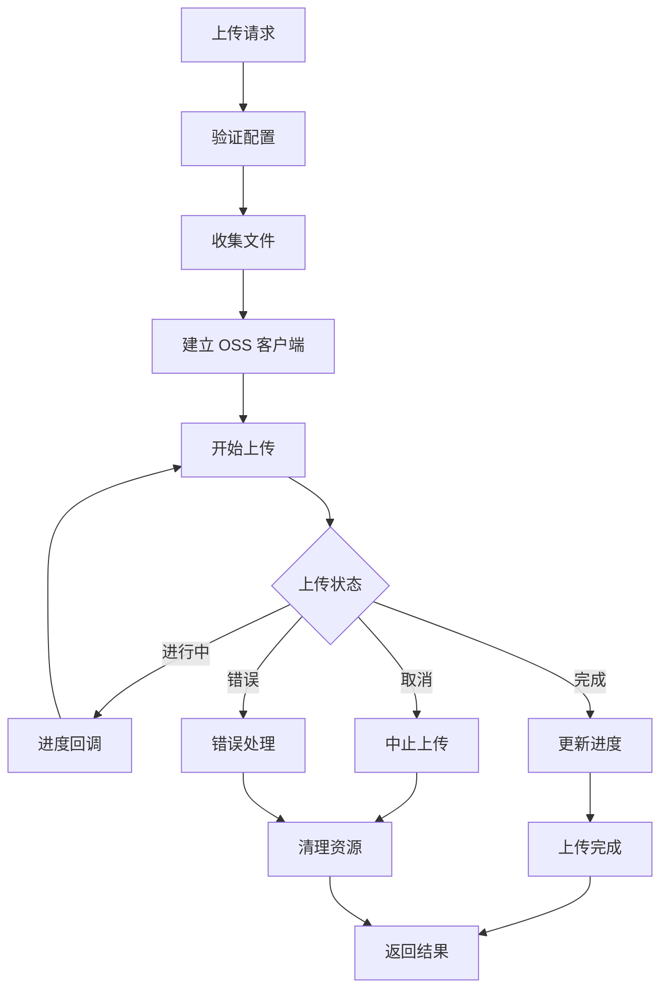
```mermaid
flowchart TD
A[上传请求] --> B[验证配置]
B --> C[收集文件]
C --> D[建立 OSS 客户端]
D --> E[开始上传]
E --> F{上传状态}
F --> |进行中| G[进度回调]
F --> |完成| H[更新进度]
F --> |取消| I[中止上传]
F --> |错误| J[错误处理]
G --> E
H --> K[上传完成]
I --> L[清理资源]
J --> L
K --> M[返回结果]
L --> M
```

**图表来源**
- [src/main/services/ossManager.ts:296-439](file://src/main/services/ossManager.ts#L296-L439)

#### 上传特性

- **多文件支持**：支持文件和文件夹批量上传
- **断点续传**：基于 OSS 分片上传的断点续传
- **进度跟踪**：实时的上传进度反馈
- **任务管理**：支持上传任务取消和管理

**章节来源**
- [src/main/services/ossManager.ts:296-439](file://src/main/services/ossManager.ts#L296-L439)

## 依赖分析

### 外部依赖关系

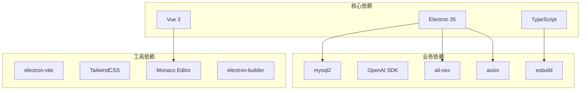
```mermaid
graph TB
subgraph "核心依赖"
A[Electron 35]
B[Vue 3]
C[TypeScript]
end
subgraph "业务依赖"
D[mysql2]
E[OpenAI SDK]
F[ali-oss]
G[axios]
H[esbuild]
end
subgraph "工具依赖"
I[electron-vite]
J[TailwindCSS]
K[Monaco Editor]
L[electron-builder]
end
A --> D
A --> F
A --> G
B --> K
C --> H
```

**图表来源**
- [package.json:28-51](file://package.json#L28-L51)

### 内部模块依赖

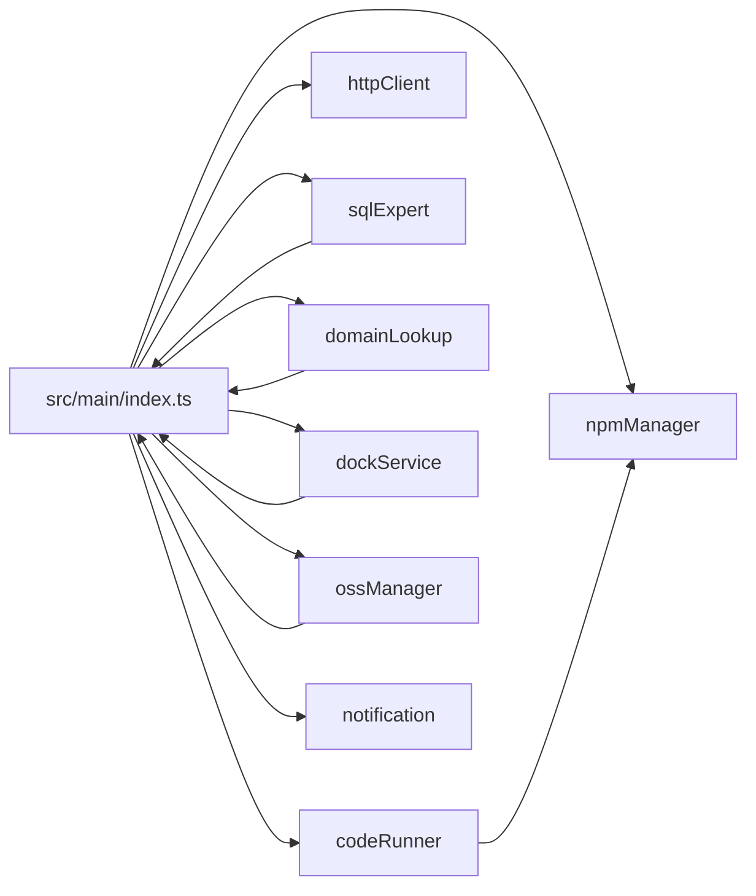
```mermaid
graph LR
A[src/main/index.ts] --> B[codeRunner]
A --> C[httpClient]
A --> D[sqlExpert]
A --> E[npmManager]
A --> F[domainLookup]
A --> G[dockService]
A --> H[ossManager]
A --> I[notification]
B --> E
D --> A
F --> A
G --> A
H --> A
```

**图表来源**
- [src/main/index.ts:422-428](file://src/main/index.ts#L422-L428)

**章节来源**
- [package.json:28-51](file://package.json#L28-L51)
- [src/main/index.ts:422-428](file://src/main/index.ts#L422-L428)

## 性能考虑

### 模块初始化顺序

项目采用合理的初始化顺序以确保依赖关系正确：

1. **基础服务**：通知、Dock 服务等基础功能
2. **工具服务**：代码运行器、HTTP 客户端等工具类
3. **业务服务**：SQL 专家、OSS 管理器等业务功能
4. **应用服务**：自动更新、代理配置等应用级功能

### 资源管理策略

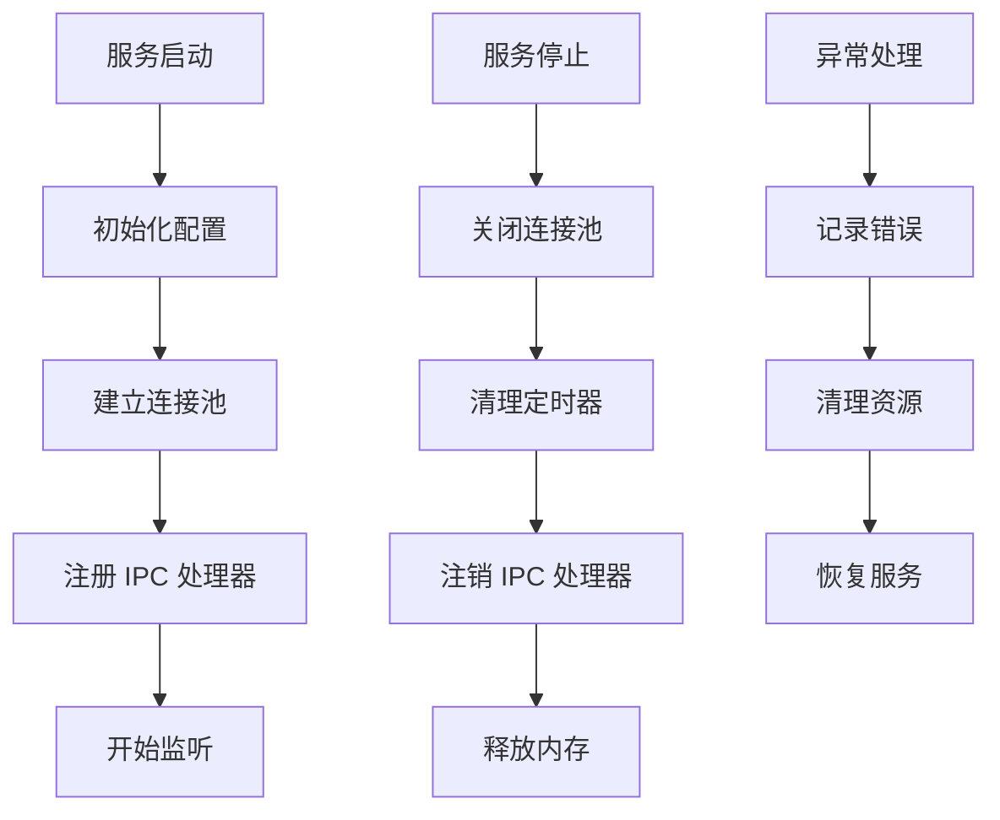
```mermaid
flowchart TD
A[服务启动] --> B[初始化配置]
B --> C[建立连接池]
C --> D[注册 IPC 处理器]
D --> E[开始监听]
F[服务停止] --> G[关闭连接池]
G --> H[清理定时器]
H --> I[注销 IPC 处理器]
I --> J[释放内存]
K[异常处理] --> L[记录错误]
L --> M[清理资源]
M --> N[恢复服务]
```

**图表来源**
- [src/main/services/codeRunner.ts:77-96](file://src/main/services/codeRunner.ts#L77-L96)
- [src/main/services/sqlExpert.ts:428-435](file://src/main/services/sqlExpert.ts#L428-L435)

### 性能优化建议

1. **连接池管理**：合理配置数据库连接池大小
2. **内存监控**：定期检查内存使用情况
3. **异步处理**：大量 I/O 操作使用异步模式
4. **缓存策略**：合理使用文件系统缓存

## 故障排除指南

### 常见问题诊断

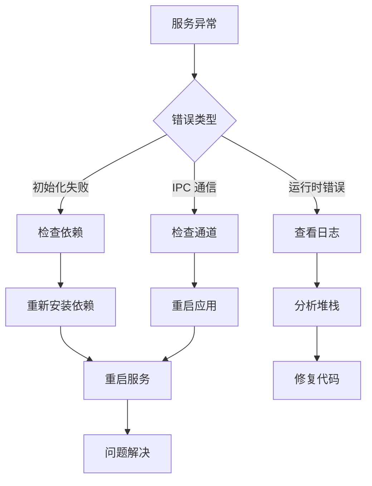
```mermaid
flowchart TD
A[服务异常] --> B{错误类型}
B --> |初始化失败| C[检查依赖]
B --> |运行时错误| D[查看日志]
B --> |IPC 通信| E[检查通道]
C --> F[重新安装依赖]
D --> G[分析堆栈]
E --> H[重启应用]
F --> I[重启服务]
G --> J[修复代码]
H --> I
I --> K[问题解决]
```

### 错误处理机制

各服务模块都实现了完善的错误处理：

1. **服务级错误**：每个服务独立处理自身错误
2. **IPC 错误**：通过 IPC 返回标准化错误信息
3. **资源清理**：错误发生时自动清理资源
4. **降级策略**：部分功能不可用时提供替代方案

**章节来源**
- [src/main/services/codeRunner.ts:220-233](file://src/main/services/codeRunner.ts#L220-L233)
- [src/main/services/sqlExpert.ts:428-435](file://src/main/services/sqlExpert.ts#L428-L435)

## 结论

开发者工具箱项目展现了优秀的模块化设计实践：

### 设计优势

1. **高内聚低耦合**：每个服务模块职责单一，接口清晰
2. **可扩展性强**：新增功能模块无需修改现有代码
3. **安全性保障**：通过沙箱和权限控制确保运行安全
4. **用户体验优秀**：模块化设计提升了应用的稳定性和响应性

### 最佳实践总结

1. **服务注册模式**：统一的 `setupService()` 接口约定
2. **IPC 通信**：通过 Electron IPC 实现进程间通信
3. **依赖注入**：通过参数传递依赖而非全局状态
4. **错误隔离**：每个模块独立处理错误和异常
5. **资源管理**：完善的资源清理和生命周期管理

### 未来发展方向

1. **插件化架构**：进一步抽象服务接口，支持动态加载
2. **微服务化**：将大型服务拆分为更小的独立服务
3. **配置驱动**：通过配置文件管理服务启用状态
4. **监控增强**：添加更完善的性能监控和日志系统

这个模块化设计为开发者提供了一个清晰、可维护、可扩展的架构基础，便于持续的功能迭代和性能优化。