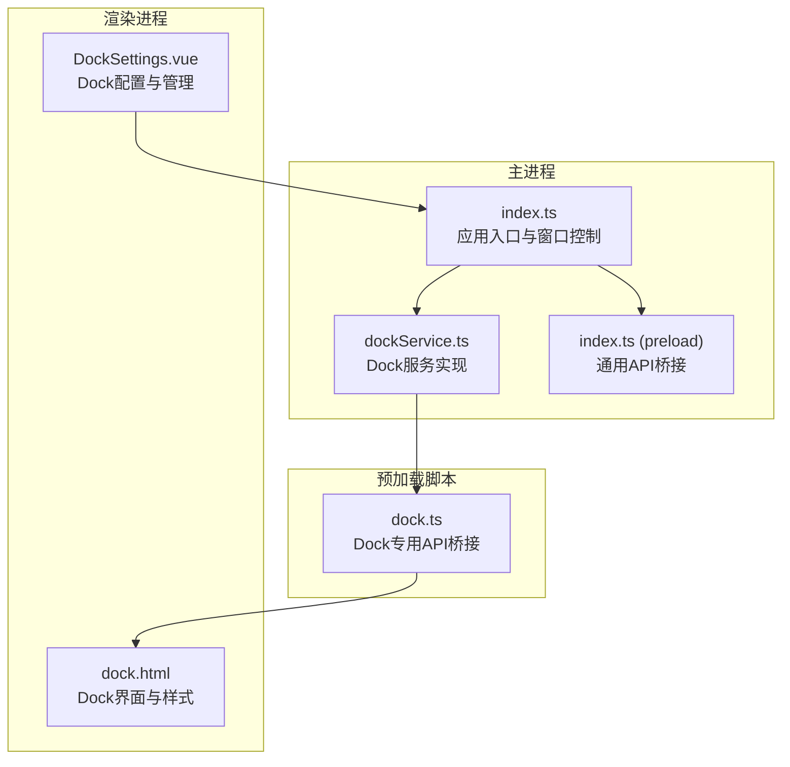
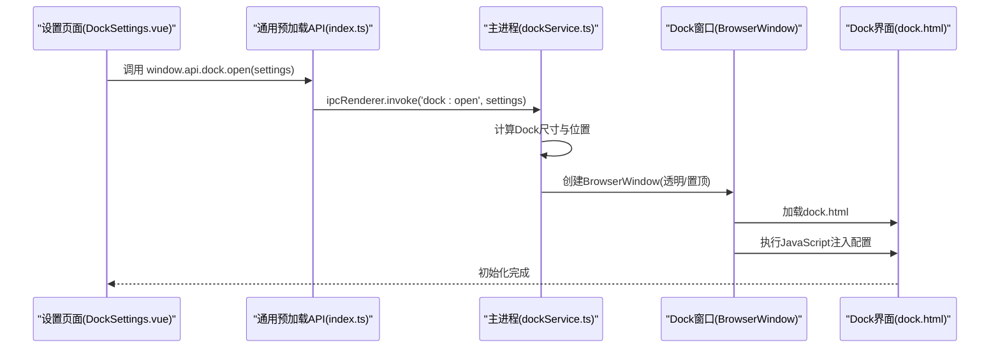
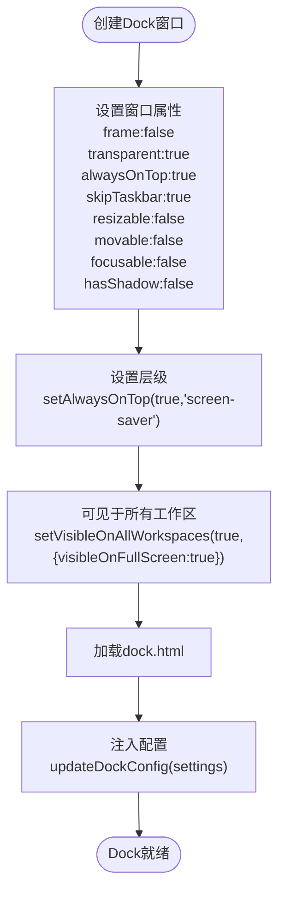
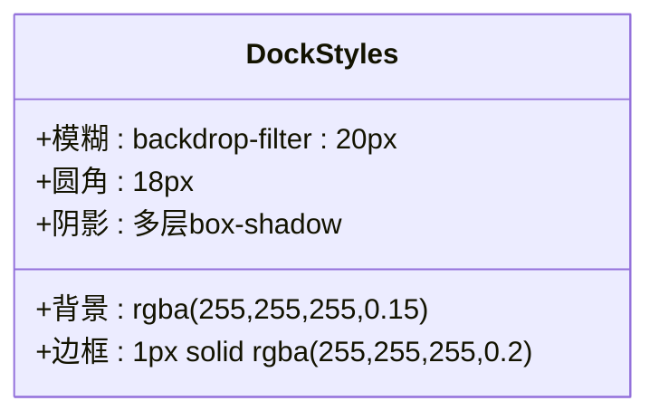
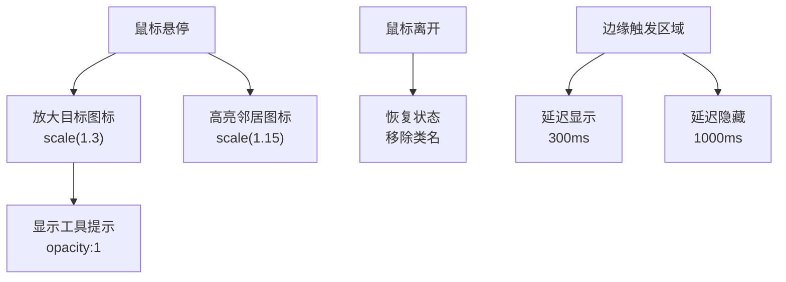
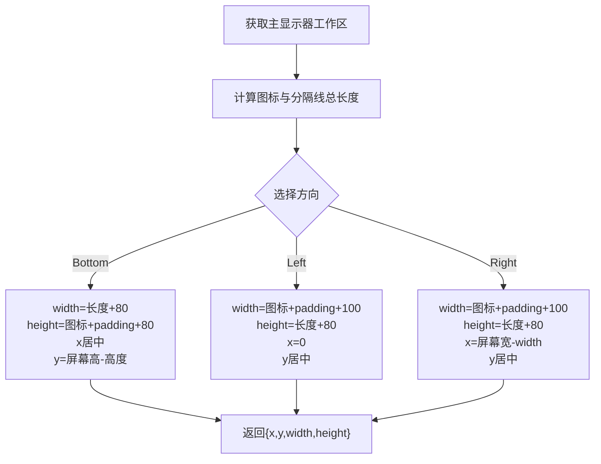
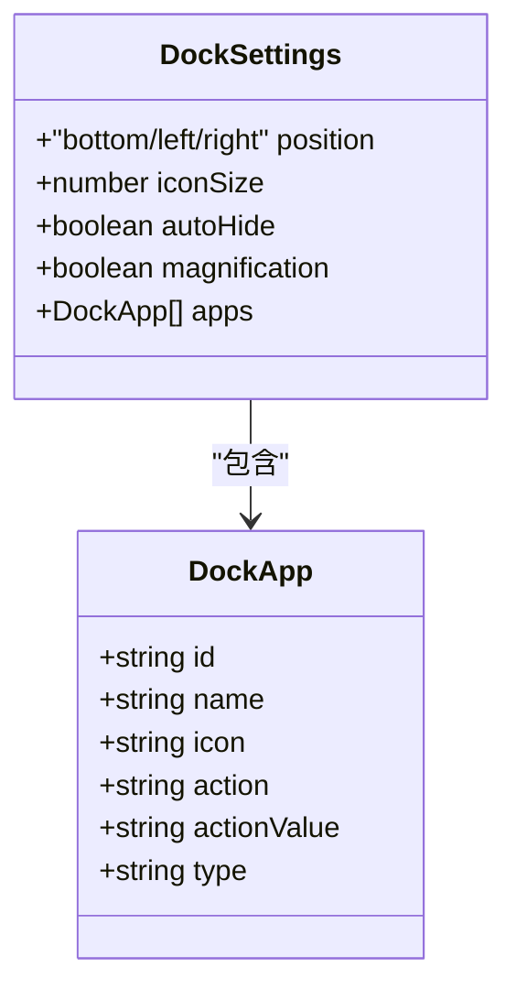
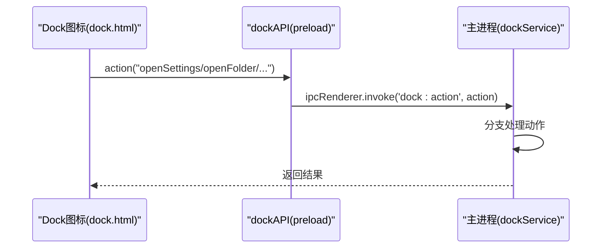
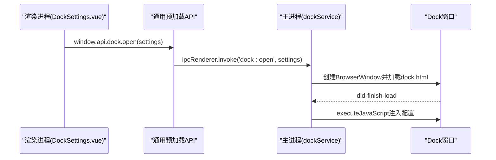
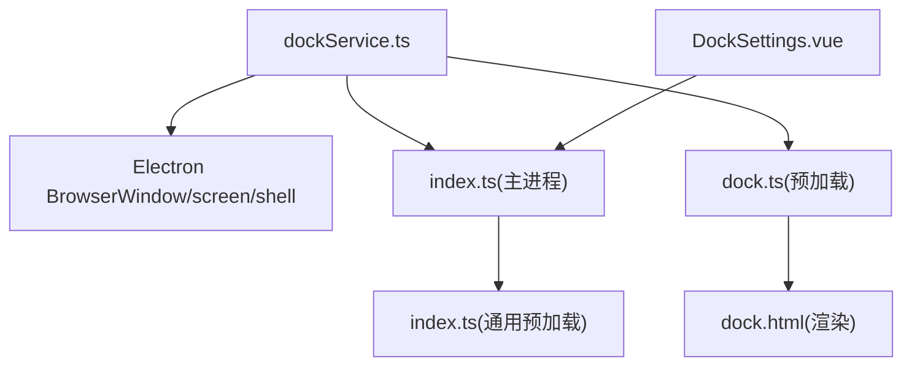

# Dock服务

<cite>
**本文档引用的文件**
- [dockService.ts](file://src/main/services/dockService.ts)
- [dock.ts](file://src/preload/dock.ts)
- [dock.html](file://src/renderer/dock.html)
- [index.ts](file://src/main/index.ts)
- [DockSettings.vue](file://src/renderer/src/views/dock/DockSettings.vue)
- [index.ts](file://src/preload/index.ts)
- [electron.vite.config.ts](file://electron.vite.config.ts)
- [package.json](file://package.json)
- [README.md](file://README.md)
</cite>

## 目录
1. [简介](#简介)
2. [项目结构](#项目结构)
3. [核心组件](#核心组件)
4. [架构总览](#架构总览)
5. [详细组件分析](#详细组件分析)
6. [依赖关系分析](#依赖关系分析)
7. [性能考虑](#性能考虑)
8. [故障排除指南](#故障排除指南)
9. [结论](#结论)
10. [附录](#附录)

## 简介
本项目提供了一个 macOS 风格的悬浮工具栏（Dock）实现，通过独立的透明悬浮窗口提供应用入口、快捷操作与系统集成能力。该实现包含窗口管理、透明与阴影效果、动画过渡、系统集成（窗口层级、焦点、任务栏、热键）、自定义应用项配置、图标管理、点击行为与上下文菜单、位置计算与多显示器适配、IPC 通信接口以及性能优化与资源释放策略。本文档将对上述功能进行全面解析，并给出可视化图示与最佳实践建议。

## 项目结构
项目采用 Electron + Vue 3 + TypeScript 的架构，Dock 服务位于主进程，渲染进程负责 UI 与交互，预加载脚本提供安全的 IPC 桥接。

**图表来源**
- [index.ts:110-395](file://src/main/index.ts#L110-L395)
- [dockService.ts:111-229](file://src/main/services/dockService.ts#L111-L229)
- [index.ts:10-229](file://src/preload/index.ts#L10-L229)
- [dock.ts:1-19](file://src/preload/dock.ts#L1-L19)
- [dock.html:1-464](file://src/renderer/dock.html#L1-L464)
- [DockSettings.vue:1-651](file://src/renderer/src/views/dock/DockSettings.vue#L1-L651)

**章节来源**
- [README.md:1-163](file://README.md#L1-L163)
- [package.json:1-120](file://package.json#L1-L120)

## 核心组件
- 主进程 Dock 服务：负责创建与管理 Dock 窗口、处理动作、IPC 通信与系统集成。
- 预加载脚本 Dock API：为 Dock 窗口暴露安全的 IPC 调用接口。
- 渲染进程 Dock 界面：提供 UI、动画、布局与交互逻辑。
- 渲染进程 Dock 设置页：提供配置管理、应用项编辑与本地存储。
- 通用预加载 API：为主窗口提供统一的 IPC 桥接。

**章节来源**
- [dockService.ts:1-243](file://src/main/services/dockService.ts#L1-L243)
- [dock.ts:1-19](file://src/preload/dock.ts#L1-L19)
- [dock.html:1-464](file://src/renderer/dock.html#L1-L464)
- [DockSettings.vue:1-651](file://src/renderer/src/views/dock/DockSettings.vue#L1-L651)
- [index.ts:10-229](file://src/preload/index.ts#L10-L229)

## 架构总览
Dock 服务通过主进程创建独立的透明悬浮窗口，渲染进程加载 Dock 界面并注入配置；预加载脚本为 Dock 窗口提供安全的 IPC 调用能力；渲染进程的设置页面通过通用 API 控制 Dock 的生命周期与行为。

**图表来源**
- [DockSettings.vue:114-127](file://src/renderer/src/views/dock/DockSettings.vue#L114-L127)
- [index.ts:94-104](file://src/preload/index.ts#L94-L104)
- [dockService.ts:115-141](file://src/main/services/dockService.ts#L115-L141)
- [dock.html:459-461](file://src/renderer/dock.html#L459-L461)

## 详细组件分析

### 窗口管理与系统集成
- 窗口属性：无边框、透明、不可调整大小、不可移动、非焦点、无阴影，始终置顶且可见于所有工作区。
- 层级管理：使用 alwaysOnTop 并设置为 screen-saver 级别，确保在全屏与系统界面之上。
- 任务栏集成：skipTaskbar=true，Dock 窗口不显示在任务栏。
- 焦点处理：focusable=false，避免 Dock 窗口干扰主窗口焦点。
- 热键支持：当前未实现全局热键，可通过扩展在主进程注册系统级热键。

**图表来源**
- [dockService.ts:68-108](file://src/main/services/dockService.ts#L68-L108)

**章节来源**
- [dockService.ts:68-108](file://src/main/services/dockService.ts#L68-L108)

### 透明效果与阴影渲染
- 透明背景：backgroundColor 设为透明，结合 CSS backdrop-filter 实现毛玻璃效果。
- 阴影：通过多层 box-shadow 模拟 macOS 阴影，配合圆角与边框增强立体感。
- 毛玻璃：backdrop-filter: blur(20px) 与 -webkit-backdrop-filter: blur(20px) 提供视觉层次。

**图表来源**
- [dock.html:55-65](file://src/renderer/dock.html#L55-L65)

**章节来源**
- [dock.html:55-65](file://src/renderer/dock.html#L55-L65)

### 动画过渡与交互
- 悬浮放大：hover 时对目标图标与邻居图标进行缩放与位移，使用 cubic-bezier 曲线保证顺滑。
- 工具提示：悬停显示名称提示，使用透明度过渡。
- 点击指示器：激活状态显示小圆点，支持左右侧布局。
- 自动隐藏：边缘触发区域检测，进入显示、离开隐藏，带延迟与悬停保持。

**图表来源**
- [dock.html:83-93](file://src/renderer/dock.html#L83-L93)
- [dock.html:140-175](file://src/renderer/dock.html#L140-L175)
- [dock.html:221-235](file://src/renderer/dock.html#L221-L235)

**章节来源**
- [dock.html:83-93](file://src/renderer/dock.html#L83-L93)
- [dock.html:140-175](file://src/renderer/dock.html#L140-L175)
- [dock.html:221-235](file://src/renderer/dock.html#L221-L235)

### 位置计算算法与多显示器适配
- 位置计算：根据屏幕工作区尺寸与 Dock 方向（底部/左侧/右侧）计算 x/y 与宽高。
- 尺寸计算：依据图标数量、间距、分隔线宽度与内边距动态计算长度。
- 多显示器：当前使用主显示器工作区，未实现跨屏或多屏适配；可扩展为根据鼠标所在屏幕定位。

**图表来源**
- [dockService.ts:29-62](file://src/main/services/dockService.ts#L29-L62)

**章节来源**
- [dockService.ts:29-62](file://src/main/services/dockService.ts#L29-L62)

### 自定义应用项配置与图标管理
- 应用项结构：包含 id、name、icon、action、actionValue、type（分隔线）。
- 图标管理：内置 SVG 图标与渐变背景，支持自定义图标与颜色。
- 动作类型：预设动作（打开设置、打开文件夹、打开终端、打开浏览器）与自定义动作（openUrl:xxx、openApp:xxx）。
- 分隔线：支持在应用项之间插入分隔线，用于视觉分区。

**图表来源**
- [dockService.ts:10-26](file://src/main/services/dockService.ts#L10-L26)
- [DockSettings.vue:4-12](file://src/renderer/src/views/dock/DockSettings.vue#L4-L12)

**章节来源**
- [dockService.ts:10-26](file://src/main/services/dockService.ts#L10-L26)
- [DockSettings.vue:4-12](file://src/renderer/src/views/dock/DockSettings.vue#L4-L12)

### 点击行为与上下文菜单
- 点击行为：通过 window.dockAPI.action 调用主进程处理，支持打开设置、打开文件夹、打开终端、打开浏览器与自定义 URL/应用。
- 上下文菜单：Dock 窗口本身不提供上下文菜单，但可通过扩展在主进程注册系统级菜单或在设置页中提供操作入口。

**图表来源**
- [dock.ts:4-6](file://src/preload/dock.ts#L4-L6)
- [dockService.ts:162-228](file://src/main/services/dockService.ts#L162-L228)

**章节来源**
- [dock.ts:4-6](file://src/preload/dock.ts#L4-L6)
- [dockService.ts:162-228](file://src/main/services/dockService.ts#L162-L228)

### IPC 通信接口
- 主进程到渲染进程：通过 did-finish-load 事件后执行 JavaScript 注入配置。
- 渲染进程到主进程：通过 window.api.dock.open/close/isOpen/action 调用主进程处理。
- Dock 窗口到主进程：通过 window.dockAPI.action 调用主进程动作处理。
- 预加载构建：electron-vite 配置了 dock 专用预加载入口，确保 Dock 窗口独立加载。

**图表来源**
- [index.ts:94-104](file://src/preload/index.ts#L94-L104)
- [dockService.ts:98-105](file://src/main/services/dockService.ts#L98-L105)
- [electron.vite.config.ts:22-29](file://electron.vite.config.ts#L22-L29)

**章节来源**
- [index.ts:94-104](file://src/preload/index.ts#L94-L104)
- [dockService.ts:98-105](file://src/main/services/dockService.ts#L98-L105)
- [electron.vite.config.ts:22-29](file://electron.vite.config.ts#L22-L29)

### 性能优化与资源释放
- 窗口属性优化：禁用可调整大小与移动，减少不必要的重绘与布局计算。
- 透明窗口 GPU 限制：Windows 下禁用 GPU 合成以避免标题栏问题。
- 资源释放：应用退出时通过 closeDockWindow 关闭 Dock 窗口，避免残留进程。
- 内存管理：Dock 窗口为一次性使用，关闭即销毁；渲染进程中的事件监听在组件卸载时应清理。

**章节来源**
- [index.ts:39-41](file://src/main/index.ts#L39-L41)
- [index.ts:379-384](file://src/main/index.ts#L379-L384)
- [dockService.ts:237-242](file://src/main/services/dockService.ts#L237-L242)

## 依赖关系分析
Dock 服务与其他模块的依赖关系如下：

**图表来源**
- [dockService.ts:1-4](file://src/main/services/dockService.ts#L1-L4)
- [index.ts:1-12](file://src/main/index.ts#L1-L12)
- [dock.ts:1-1](file://src/preload/dock.ts#L1-L1)
- [dock.html:1-1](file://src/renderer/dock.html#L1-L1)
- [DockSettings.vue:1-2](file://src/renderer/src/views/dock/DockSettings.vue#L1-L2)

**章节来源**
- [dockService.ts:1-4](file://src/main/services/dockService.ts#L1-L4)
- [index.ts:1-12](file://src/main/index.ts#L1-L12)

## 性能考虑
- 减少 DOM 操作：Dock 图标数量较多时，尽量批量更新与复用节点。
- 动画性能：使用 transform 与 opacity 控制动画，避免触发布局与重绘。
- 事件节流：自动隐藏的鼠标移动事件可加入节流，降低频繁计算。
- 多显示器：若未来支持多屏，应根据鼠标所在屏幕计算位置，避免跨屏闪烁。

## 故障排除指南
- Dock 窗口不显示：检查主进程是否成功创建 BrowserWindow，确认 did-finish-load 事件是否触发。
- 透明效果异常：Windows 下确认已禁用 GPU 合成；检查 CSS backdrop-filter 支持情况。
- 点击无响应：确认 window.dockAPI 是否正确暴露，主进程是否注册 dock:action 处理。
- 自动隐藏失效：检查边缘触发阈值与定时器清理逻辑，确保 mouseenter/mouseleave 事件正确绑定。
- 多显示器适配：当前仅使用主显示器工作区，如需跨屏请扩展屏幕检测逻辑。

**章节来源**
- [dockService.ts:98-105](file://src/main/services/dockService.ts#L98-L105)
- [index.ts:39-41](file://src/main/index.ts#L39-L41)
- [dock.ts:9-18](file://src/preload/dock.ts#L9-L18)
- [dock.html:372-444](file://src/renderer/dock.html#L372-L444)

## 结论
本 Dock 服务实现了 macOS 风格的悬浮工具栏，具备独立透明窗口、动画过渡、系统集成与可扩展的配置能力。通过清晰的 IPC 分层与预加载桥接，既保证了安全性又提供了良好的用户体验。未来可在多显示器适配、全局热键、上下文菜单等方面进一步增强。

## 附录
- 预加载入口配置：electron-vite 为 dock.html 与 dock.ts 配置了独立的构建入口，确保 Dock 窗口的独立性与性能。
- 应用入口：主进程在 whenReady 后创建主窗口并初始化各服务，随后设置 Dock 服务。

**章节来源**
- [electron.vite.config.ts:22-29](file://electron.vite.config.ts#L22-L29)
- [index.ts:421-429](file://src/main/index.ts#L421-L429)