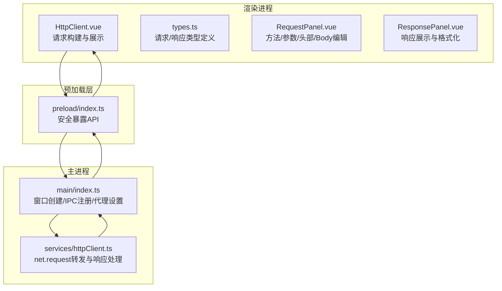
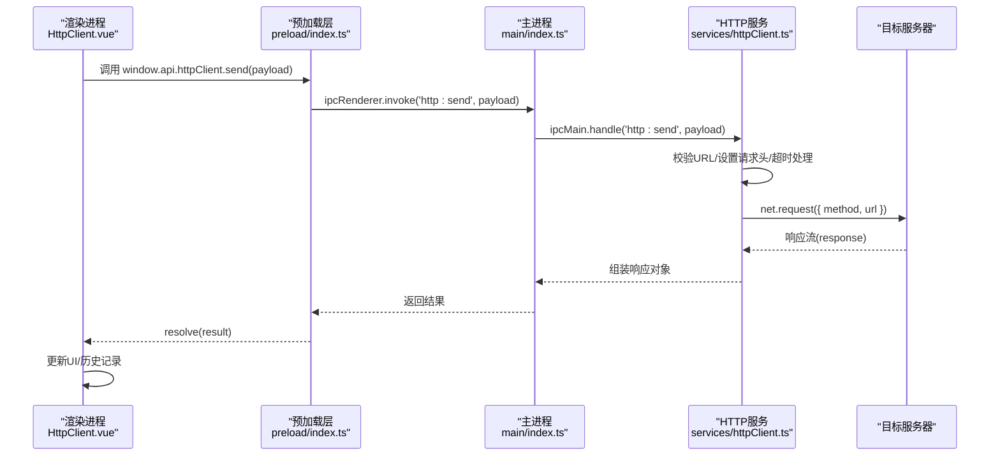
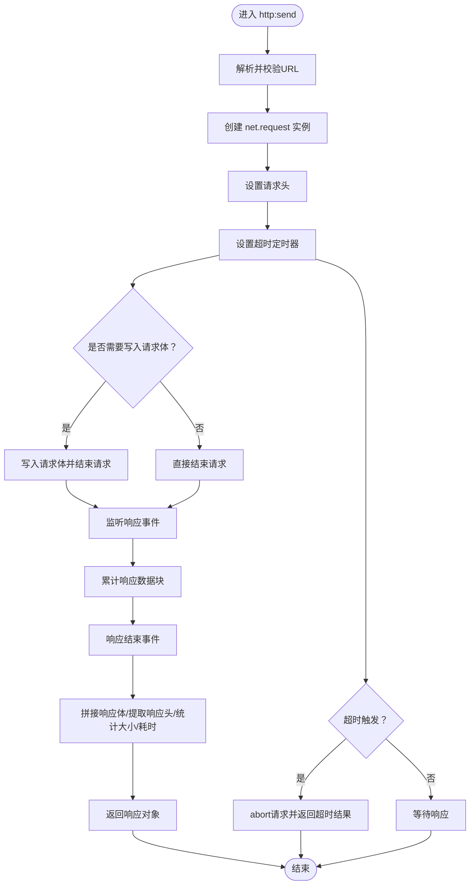
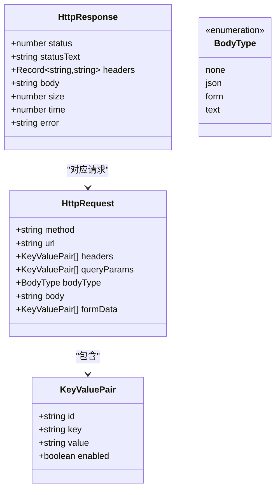
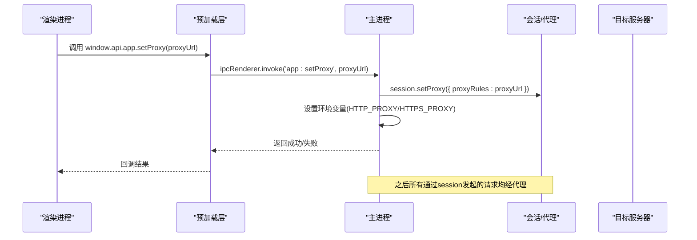
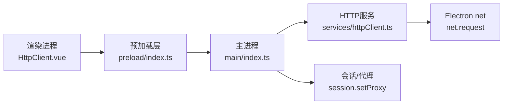

# CORS绕过机制

<cite>
**本文引用的文件**
- [httpClient.ts](file://src/main/services/httpClient.ts)
- [index.ts](file://src/main/index.ts)
- [index.ts](file://src/preload/index.ts)
- [HttpClient.vue](file://src/renderer/src/views/httpclient/HttpClient.vue)
- [types.ts](file://src/renderer/src/views/httpclient/types.ts)
- [RequestPanel.vue](file://src/renderer/src/views/httpclient/components/RequestPanel.vue)
- [ResponsePanel.vue](file://src/renderer/src/views/httpclient/components/ResponsePanel.vue)
- [README.md](file://README.md)
- [package.json](file://package.json)
</cite>

## 目录
1. [引言](#引言)
2. [项目结构](#项目结构)
3. [核心组件](#核心组件)
4. [架构总览](#架构总览)
5. [详细组件分析](#详细组件分析)
6. [依赖关系分析](#依赖关系分析)
7. [性能考量](#性能考量)
8. [故障排查指南](#故障排查指南)
9. [结论](#结论)
10. [附录](#附录)

## 引言
本文件围绕Electron应用中的CORS绕过机制展开，重点解释主进程通过Electron net模块发起HTTP请求以规避浏览器CORS限制的工作原理，并结合项目现有实现，系统性地阐述请求转发流程、代理配置、请求拦截与响应处理、URL验证与协议支持范围、安全注意事项、IPC通信机制以及错误处理策略。同时提供常见问题的解决方案、调试技巧与性能优化建议，帮助读者在实际开发中安全、稳定地使用该机制。

## 项目结构
该项目采用标准的Electron + Vue 3架构，主要涉及以下与CORS绕过相关的模块：
- 主进程服务：提供HTTP请求转发与代理设置
- 预加载层：安全暴露IPC接口给渲染进程
- 渲染进程视图：HTTP客户端界面与请求构建

**图表来源**
- [HttpClient.vue:1-275](file://src/renderer/src/views/httpclient/HttpClient.vue#L1-L275)
- [types.ts:1-38](file://src/renderer/src/views/httpclient/types.ts#L1-L38)
- [RequestPanel.vue:1-227](file://src/renderer/src/views/httpclient/components/RequestPanel.vue#L1-L227)
- [ResponsePanel.vue:1-180](file://src/renderer/src/views/httpclient/components/ResponsePanel.vue#L1-L180)
- [index.ts:1-229](file://src/preload/index.ts#L1-L229)
- [index.ts:1-444](file://src/main/index.ts#L1-L444)
- [httpClient.ts:1-113](file://src/main/services/httpClient.ts#L1-L113)

**章节来源**
- [README.md:1-163](file://README.md#L1-L163)
- [package.json:1-120](file://package.json#L1-L120)

## 核心组件
- 主进程HTTP服务：负责接收渲染进程请求、校验URL、使用Electron net模块发起请求、设置请求头、处理超时与错误、聚合响应并返回。
- 预加载层API：通过contextBridge安全暴露IPC接口，供渲染进程调用。
- 渲染进程HTTP客户端：负责构建请求（方法、URL、Headers、Body）、调用预加载层API、展示响应与历史记录。

**章节来源**
- [httpClient.ts:1-113](file://src/main/services/httpClient.ts#L1-L113)
- [index.ts:106-115](file://src/preload/index.ts#L106-L115)
- [HttpClient.vue:121-167](file://src/renderer/src/views/httpclient/HttpClient.vue#L121-L167)

## 架构总览
下图展示了从渲染进程到主进程再到目标服务器的完整请求链路，以及代理配置如何贯穿整个过程。

**图表来源**
- [HttpClient.vue:133-138](file://src/renderer/src/views/httpclient/HttpClient.vue#L133-L138)
- [index.ts:106-115](file://src/preload/index.ts#L106-L115)
- [index.ts:15-112](file://src/main/index.ts#L15-L112)
- [httpClient.ts:15-112](file://src/main/services/httpClient.ts#L15-L112)

## 详细组件分析

### 主进程HTTP服务（CORS绕过核心）
- 请求入口：ipcMain.handle('http:send', ...)接收渲染进程传入的请求负载。
- URL验证：使用URL构造器解析并校验URL合法性，确保后续net.request可用。
- 请求头设置：遍历headers键值对，逐个设置到net.request实例上。
- 超时与错误处理：设置定时器，超时则abort并返回超时结果；捕获error事件并返回错误信息。
- 响应聚合：累计响应数据块，拼接为字符串，提取状态码、状态文本、响应头、字节大小与耗时。
- 方法支持：根据方法是否属于['POST','PUT','PATCH','DELETE']决定是否写入请求体。

**图表来源**
- [httpClient.ts:15-112](file://src/main/services/httpClient.ts#L15-L112)

**章节来源**
- [httpClient.ts:15-112](file://src/main/services/httpClient.ts#L15-L112)

### 预加载层API（IPC桥接）
- 暴露window.api.httpClient.send方法，封装ipcRenderer.invoke调用，屏蔽底层IPC细节。
- 渲染进程通过该API与主进程交互，实现跨进程的安全通信。

**章节来源**
- [index.ts:106-115](file://src/preload/index.ts#L106-L115)

### 渲染进程HTTP客户端（请求构建与展示）
- 请求构建：根据用户输入的方法、URL、Headers、Query Params、Body Type与Body，生成最终请求负载。
- URL自动补全：若未包含协议，自动补全为https://。
- Content-Type自动推断：当未显式设置且方法允许时，依据Body Type自动设置Content-Type。
- 发送请求：调用window.api.httpClient.send，等待Promise完成并更新响应面板。
- 历史记录：将每次请求与响应保存至localStorage，支持查看、删除与清空。

**图表来源**
- [types.ts:1-38](file://src/renderer/src/views/httpclient/types.ts#L1-L38)

**章节来源**
- [HttpClient.vue:121-167](file://src/renderer/src/views/httpclient/HttpClient.vue#L121-L167)
- [types.ts:1-38](file://src/renderer/src/views/httpclient/types.ts#L1-L38)

### 代理配置与请求拦截
- 代理设置：主进程提供ipcMain.handle('app:setProxy', ...)，通过webContents.session.setProxy配置应用级代理，同时设置HTTP_PROXY/HTTPS_PROXY环境变量使autoUpdater等也能使用代理。
- 请求拦截：主进程通过net.request拦截HTTP(S)请求，绕过浏览器同源策略限制，从而实现CORS绕过。
- 代理生效范围：应用级代理影响所有通过session发起的网络请求，包括HTTP客户端与自动更新。

**图表来源**
- [index.ts:306-327](file://src/main/index.ts#L306-L327)

**章节来源**
- [index.ts:306-327](file://src/main/index.ts#L306-L327)

### URL验证机制与协议支持范围
- URL验证：使用new URL(url)进行解析与校验，确保scheme/host等字段有效。
- 协议支持：项目中通过URL构造器支持http/https；在HTTP客户端中URL自动补全逻辑默认添加https://，表明对https的优先支持。
- 安全考虑：URL解析失败将导致异常，主进程捕获并返回错误信息，避免无效请求进入下游。

**章节来源**
- [httpClient.ts:22-23](file://src/main/services/httpClient.ts#L22-L23)
- [HttpClient.vue:58-77](file://src/renderer/src/views/httpclient/HttpClient.vue#L58-L77)

### 请求头与请求体处理
- 请求头：遍历headers对象，逐个设置到net.request实例，键值均需非空才生效。
- 请求体：仅当方法属于['POST','PUT','PATCH','DELETE']时，才会写入请求体并结束请求。
- Content-Type：若未显式设置且方法允许，依据Body Type自动设置相应Content-Type。

**章节来源**
- [httpClient.ts:31-36](file://src/main/services/httpClient.ts#L31-L36)
- [httpClient.ts:94-98](file://src/main/services/httpClient.ts#L94-L98)
- [HttpClient.vue:86-98](file://src/renderer/src/views/httpclient/HttpClient.vue#L86-L98)

### 响应处理与错误策略
- 响应聚合：累计响应数据块，拼接为UTF-8字符串，提取响应头（统一为字符串形式），计算字节大小与耗时。
- 错误处理：捕获error事件，返回包含错误信息的对象；超时则abort并返回超时结果。
- UI反馈：渲染进程在catch分支中构造错误响应对象，保证UI一致性。

**章节来源**
- [httpClient.ts:52-78](file://src/main/services/httpClient.ts#L52-L78)
- [httpClient.ts:81-92](file://src/main/services/httpClient.ts#L81-L92)
- [HttpClient.vue:154-166](file://src/renderer/src/views/httpclient/HttpClient.vue#L154-L166)

## 依赖关系分析
- 渲染进程依赖预加载层提供的API，预加载层通过ipcRenderer与主进程通信。
- 主进程通过ipcMain.handle注册服务，内部使用Electron net模块发起请求。
- 应用级代理通过webContents.session.setProxy配置，影响所有网络请求。

**图表来源**
- [HttpClient.vue:133-138](file://src/renderer/src/views/httpclient/HttpClient.vue#L133-L138)
- [index.ts:106-115](file://src/preload/index.ts#L106-L115)
- [index.ts:15-112](file://src/main/index.ts#L15-L112)
- [httpClient.ts:25-29](file://src/main/services/httpClient.ts#L25-L29)
- [index.ts:306-327](file://src/main/index.ts#L306-L327)

**章节来源**
- [index.ts:1-444](file://src/main/index.ts#L1-L444)
- [httpClient.ts:1-113](file://src/main/services/httpClient.ts#L1-L113)

## 性能考量
- 超时控制：主进程为每个请求设置超时时间，避免长时间占用资源；建议根据目标服务特性调整超时阈值。
- 数据聚合：响应数据以Buffer数组累积，最后一次性拼接为字符串，减少中间转换成本。
- 代理效率：应用级代理可统一复用，减少重复配置带来的开销。
- UI渲染：响应面板对JSON进行格式化展示，注意大数据量时的渲染性能，必要时可延迟或分页展示。

[本节为通用性能建议，无需特定文件引用]

## 故障排查指南
- CORS相关问题
  - 现象：浏览器端请求因CORS被拒绝。
  - 解决：使用主进程HTTP服务发起请求，绕过浏览器CORS限制。
  - 验证：确认渲染进程调用window.api.httpClient.send，主进程ipcMain.handle('http:send')被触发。
- 代理配置问题
  - 现象：网络连接失败或超时。
  - 解决：在应用设置中配置代理地址，主进程通过app:setProxy设置会话代理与环境变量。
  - 验证：调用window.api.app.setProxy后，观察返回结果与通知提示。
- URL格式问题
  - 现象：请求无法发送或报错。
  - 解决：确保URL包含协议与主机，必要时使用自动补全逻辑；主进程会进行URL解析校验。
- 超时问题
  - 现象：请求长时间无响应。
  - 解决：适当增大timeout参数；检查代理连通性与目标服务器状态。
- 错误信息定位
  - 使用渲染进程的catch分支与主进程的error事件返回的error字段，快速定位问题原因。

**章节来源**
- [HttpClient.vue:154-166](file://src/renderer/src/views/httpclient/HttpClient.vue#L154-L166)
- [index.ts:306-327](file://src/main/index.ts#L306-L327)
- [httpClient.ts:38-50](file://src/main/services/httpClient.ts#L38-L50)
- [httpClient.ts:81-92](file://src/main/services/httpClient.ts#L81-L92)

## 结论
本项目通过Electron主进程的net.request实现HTTP请求转发，有效绕过了浏览器CORS限制。配合应用级代理配置与严格的URL验证、超时与错误处理机制，能够在保证安全性的同时提供良好的用户体验。渲染进程通过预加载层安全地调用主进程服务，形成清晰的职责边界与可控的错误传播路径。建议在生产环境中持续关注代理稳定性、超时策略与响应数据的内存占用，以获得更稳健的性能表现。

[本节为总结性内容，无需特定文件引用]

## 附录

### IPC与API一览
- 渲染进程调用：window.api.httpClient.send(payload)
- 主进程注册：ipcMain.handle('http:send', ...)
- 预加载层暴露：ipcRenderer.invoke('http:send', ...)

**章节来源**
- [index.ts:106-115](file://src/preload/index.ts#L106-L115)
- [index.ts:15-112](file://src/main/index.ts#L15-L112)
- [HttpClient.vue:133-138](file://src/renderer/src/views/httpclient/HttpClient.vue#L133-L138)

### 安全注意事项
- 代理风险：代理可能引入中间人风险，建议仅在可信网络与可信代理环境下使用。
- URL校验：严格校验URL格式，避免注入与越权访问。
- 请求头过滤：谨慎传递敏感头信息，避免泄露凭证或内部标识。
- 错误信息：对外仅返回必要的错误摘要，避免泄露内部细节。

[本节为通用安全建议，无需特定文件引用]