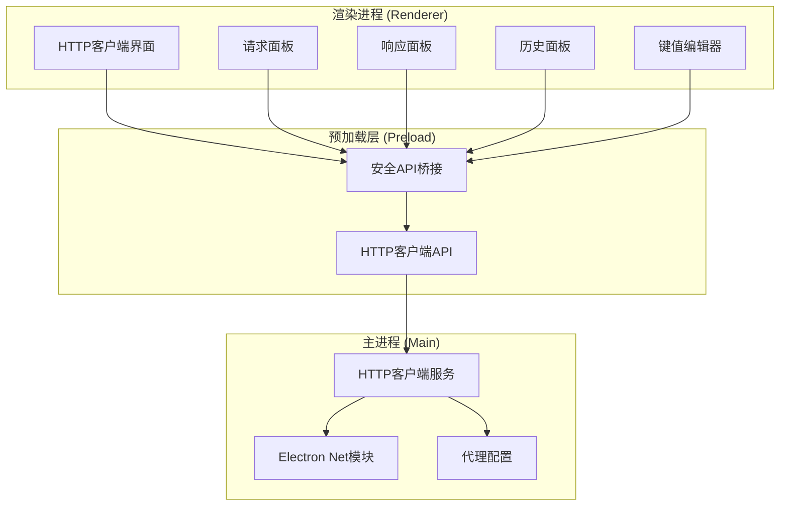
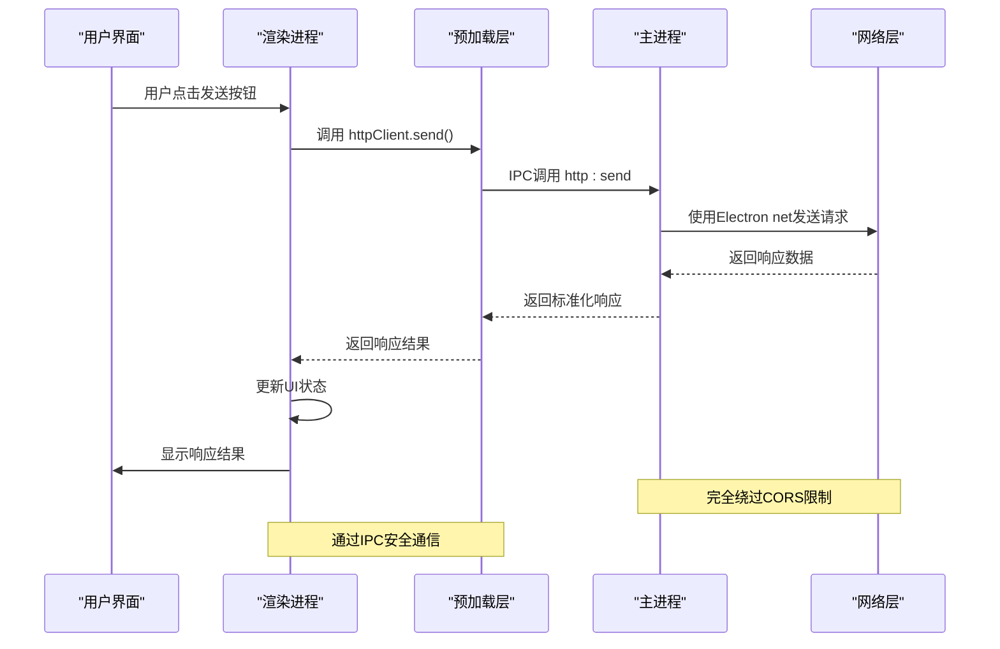
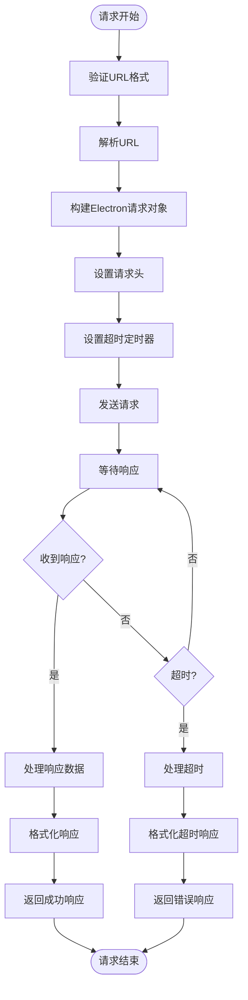
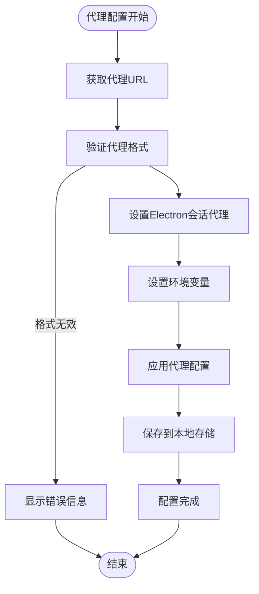
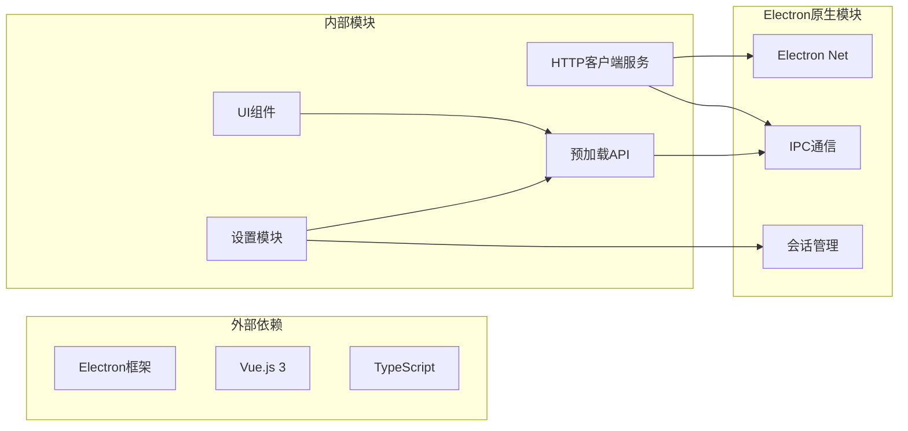

# HTTP客户端服务

<cite>
**本文档引用的文件**
- [httpClient.ts](file://src/main/services/httpClient.ts)
- [HttpClient.vue](file://src/renderer/src/views/httpclient/HttpClient.vue)
- [types.ts](file://src/renderer/src/views/httpclient/types.ts)
- [RequestPanel.vue](file://src/renderer/src/views/httpclient/components/RequestPanel.vue)
- [ResponsePanel.vue](file://src/renderer/src/views/httpclient/components/ResponsePanel.vue)
- [HistoryPanel.vue](file://src/renderer/src/views/httpclient/components/HistoryPanel.vue)
- [KeyValueEditor.vue](file://src/renderer/src/views/httpclient/components/KeyValueEditor.vue)
- [index.ts](file://src/preload/index.ts)
- [index.ts](file://src/main/index.ts)
- [Settings.vue](file://src/renderer/src/views/settings/Settings.vue)
- [package.json](file://package.json)
- [README.md](file://README.md)
</cite>

## 目录
1. [简介](#简介)
2. [项目结构](#项目结构)
3. [核心组件](#核心组件)
4. [架构概览](#架构概览)
5. [详细组件分析](#详细组件分析)
6. [依赖关系分析](#依赖关系分析)
7. [性能考虑](#性能考虑)
8. [故障排除指南](#故障排除指南)
9. [结论](#结论)
10. [附录](#附录)

## 简介

HTTP客户端服务是开发者工具箱中的一个核心功能模块，专门用于发送HTTP请求并提供完整的请求/响应调试能力。该服务通过Electron的主进程来绕过浏览器CORS限制，提供了一个功能完整的HTTP调试工具。

主要特性包括：
- CORS绕过机制：通过Electron主进程发送请求，完全绕过浏览器CORS限制
- 代理服务器支持：集成应用级代理配置，支持HTTP/HTTPS代理
- 请求构建：支持多种HTTP方法、请求头、查询参数和请求体
- 响应解析：自动解析JSON响应，提供格式化显示
- 历史记录：本地存储请求历史，支持快速重放
- 性能监控：内置请求耗时统计和响应大小计算
- 实时数据流：支持WebSocket连接和实时数据流处理

## 项目结构

HTTP客户端服务采用分层架构设计，主要分为三个层次：



**图表来源**
- [HttpClient.vue:1-275](file://src/renderer/src/views/httpclient/HttpClient.vue#L1-275)
- [index.ts:106-115](file://src/preload/index.ts#L106-L115)
- [httpClient.ts:15-112](file://src/main/services/httpClient.ts#L15-L112)

**章节来源**
- [HttpClient.vue:1-275](file://src/renderer/src/views/httpclient/HttpClient.vue#L1-275)
- [index.ts:106-115](file://src/preload/index.ts#L106-L115)
- [httpClient.ts:15-112](file://src/main/services/httpClient.ts#L15-L112)

## 核心组件

### HTTP客户端服务 (主进程)

HTTP客户端服务是整个系统的核心，负责实际的网络请求处理。它使用Electron的`net`模块来发送HTTP请求，完全绕过浏览器的CORS限制。

主要功能特性：
- **CORS绕过**：通过主进程发送请求，不受浏览器同源策略限制
- **超时控制**：内置请求超时机制，默认30秒超时
- **错误处理**：统一的错误捕获和处理机制
- **响应解析**：自动解析响应数据，支持文本和二进制数据

### 预加载API桥接

预加载层提供了安全的API桥接，将主进程的服务暴露给渲染进程使用。

关键接口：
- `httpClient.send()`：发送HTTP请求的主要接口
- 参数验证和类型安全
- 异步IPC通信封装

### 渲染进程界面组件

渲染进程包含多个Vue组件，提供完整的用户交互体验：

- **RequestPanel**：请求构建面板，支持方法选择、URL输入、参数配置
- **ResponsePanel**：响应显示面板，支持JSON格式化、状态码高亮
- **HistoryPanel**：历史记录管理，支持历史请求重放
- **KeyValueEditor**：通用键值对编辑器，用于Headers、Query Params、Form Data

**章节来源**
- [httpClient.ts:15-112](file://src/main/services/httpClient.ts#L15-L112)
- [index.ts:106-115](file://src/preload/index.ts#L106-L115)
- [HttpClient.vue:15-167](file://src/renderer/src/views/httpclient/HttpClient.vue#L15-L167)

## 架构概览

HTTP客户端服务采用典型的Electron架构模式，通过IPC通信实现进程间协作：



**图表来源**
- [HttpClient.vue:121-167](file://src/renderer/src/views/httpclient/HttpClient.vue#L121-L167)
- [index.ts:106-115](file://src/preload/index.ts#L106-L115)
- [httpClient.ts:16-112](file://src/main/services/httpClient.ts#L16-L112)

## 详细组件分析

### HTTP客户端服务实现

HTTP客户端服务是基于Electron的`net`模块构建的，提供了完整的HTTP请求处理能力。

#### 请求处理流程



**图表来源**
- [httpClient.ts:16-112](file://src/main/services/httpClient.ts#L16-L112)

#### 数据结构设计

HTTP客户端使用标准化的数据结构来表示请求和响应：

**请求负载结构**：
- `method`: HTTP方法 (GET/POST/PUT/DELETE/PATCH/HEAD/OPTIONS)
- `url`: 目标URL
- `headers`: 请求头对象
- `body`: 请求体 (可选)
- `timeout`: 超时时间 (毫秒，默认30000)

**响应结果结构**：
- `status`: HTTP状态码
- `statusText`: 状态消息
- `headers`: 响应头对象
- `body`: 响应体
- `size`: 响应大小 (字节)
- `time`: 请求耗时 (毫秒)
- `error`: 错误信息 (可选)

**章节来源**
- [httpClient.ts:7-13](file://src/main/services/httpClient.ts#L7-L13)
- [types.ts:22-30](file://src/renderer/src/views/httpclient/types.ts#L22-L30)

### 请求构建器 (渲染进程)

请求构建器负责在渲染进程中构建最终的HTTP请求，包括URL构建、请求头设置和请求体序列化。

#### URL构建算法

URL构建过程包含以下步骤：
1. **协议补全**：自动为缺少协议的URL添加https://
2. **查询参数合并**：将启用的查询参数合并到URL中
3. **URL验证**：使用URL构造函数验证URL格式
4. **错误处理**：URL无效时回退到字符串拼接方式

#### 请求头管理

请求头管理遵循以下规则：
- **自动Content-Type**：根据请求体类型自动设置Content-Type
- **手动覆盖**：用户可以手动设置Content-Type来覆盖自动设置
- **大小写处理**：自动转换为标准的HTTP头格式

#### 请求体序列化

支持多种请求体类型：
- **JSON**：自动JSON序列化
- **表单数据**：URL编码的表单数据
- **纯文本**：直接使用文本内容
- **无请求体**：适用于GET/HEAD等方法

**章节来源**
- [HttpClient.vue:53-119](file://src/renderer/src/views/httpclient/HttpClient.vue#L53-L119)
- [HttpClient.vue:79-99](file://src/renderer/src/views/httpclient/HttpClient.vue#L79-L99)

### 响应处理器

响应处理器负责接收主进程返回的响应数据，并将其格式化为用户友好的显示格式。

#### 响应状态分类

响应状态根据HTTP状态码进行智能分类：
- **2xx系列**：绿色高亮，表示成功
- **3xx系列**：蓝色高亮，表示重定向
- **4xx系列**：黄色高亮，表示客户端错误
- **5xx系列**：红色高亮，表示服务器错误

#### JSON响应处理

自动检测和格式化JSON响应：
- **自动解析**：尝试解析JSON响应
- **格式化显示**：使用缩进和换行美化JSON
- **错误恢复**：解析失败时显示原始文本

#### 性能指标显示

显示关键的性能指标：
- **响应时间**：请求耗时统计
- **响应大小**：内容长度计算
- **状态码**：HTTP状态码显示

**章节来源**
- [ResponsePanel.vue:13-42](file://src/renderer/src/views/httpclient/components/ResponsePanel.vue#L13-L42)
- [ResponsePanel.vue:49-53](file://src/renderer/src/views/httpclient/components/ResponsePanel.vue#L49-L53)

### 历史记录管理系统

历史记录系统提供了完整的请求历史管理功能，包括存储、检索和重放。

#### 存储机制

历史记录使用localStorage进行持久化存储：
- **最大容量**：限制最多保存100条历史记录
- **数据格式**：JSON序列化存储
- **自动清理**：超出容量时自动删除最旧的记录

#### 历史记录操作

支持的操作包括：
- **选择历史**：点击历史记录重放请求
- **删除单条**：删除特定的历史记录
- **清空全部**：删除所有历史记录
- **时间格式化**：显示友好的时间格式

**章节来源**
- [HttpClient.vue:33-51](file://src/renderer/src/views/httpclient/HttpClient.vue#L33-L51)
- [HistoryPanel.vue:26-45](file://src/renderer/src/views/httpclient/components/HistoryPanel.vue#L26-L45)

### 代理服务器配置

HTTP客户端服务集成了完整的代理服务器配置功能，支持HTTP和HTTPS代理。

#### 代理配置流程



**图表来源**
- [index.ts:306-327](file://src/main/index.ts#L306-L327)
- [Settings.vue:23-44](file://src/renderer/src/views/settings/Settings.vue#L23-L44)

#### 代理设置接口

代理配置通过IPC接口实现：
- **setProxy**：设置代理服务器
- **支持格式**：http://127.0.0.1:7890 或 https://proxy.example.com
- **环境变量同步**：自动设置HTTP_PROXY和HTTPS_PROXY环境变量

**章节来源**
- [index.ts:306-327](file://src/main/index.ts#L306-L327)
- [Settings.vue:23-44](file://src/renderer/src/views/settings/Settings.vue#L23-L44)

## 依赖关系分析

HTTP客户端服务的依赖关系相对简单，主要依赖于Electron框架提供的原生功能。



**图表来源**
- [package.json:28-51](file://package.json#L28-L51)
- [index.ts:1-444](file://src/main/index.ts#L1-L444)

### 核心依赖说明

**Electron依赖**：
- `@electron-toolkit/preload`：提供预加载脚本工具
- `electron`：Electron框架核心
- `electron-updater`：应用自动更新功能

**开发工具依赖**：
- `@vitejs/plugin-vue`：Vue单文件组件支持
- `typescript`：TypeScript编译器
- `vue-tsc`：Vue类型检查

**运行时依赖**：
- `axios`：HTTP客户端库（用于其他功能模块）
- `monaco-editor`：代码编辑器
- `uuid`：唯一标识符生成

**章节来源**
- [package.json:28-51](file://package.json#L28-L51)

## 性能考虑

HTTP客户端服务在设计时充分考虑了性能优化，特别是在以下方面：

### 内存管理

- **缓冲区管理**：使用Buffer.concat()高效合并响应数据
- **字符串处理**：避免不必要的字符串转换和复制
- **对象复用**：尽量复用JavaScript对象减少GC压力

### 网络性能

- **超时控制**：内置超时机制防止长时间阻塞
- **连接复用**：Electron net模块自动管理连接池
- **代理优化**：代理配置直接影响网络性能

### UI性能

- **虚拟滚动**：历史记录列表使用虚拟滚动优化大数据集
- **懒加载**：组件按需加载，减少初始内存占用
- **防抖处理**：输入框变更使用防抖减少频繁更新

### 监控和诊断

- **性能计时**：精确测量请求耗时
- **内存使用**：监控内存使用情况
- **错误统计**：记录错误发生频率和类型

## 故障排除指南

### 常见问题及解决方案

#### CORS相关问题

**问题描述**：在浏览器环境中遇到CORS错误
**解决方案**：使用HTTP客户端服务，它通过Electron主进程发送请求，完全绕过CORS限制

#### 代理配置问题

**问题描述**：代理设置后无法正常访问网络
**排查步骤**：
1. 验证代理URL格式是否正确
2. 检查代理服务器是否可达
3. 确认代理认证信息是否正确
4. 尝试清除代理配置重新设置

#### 超时问题

**问题描述**：请求经常超时
**解决方案**：
1. 增加超时时间设置
2. 检查网络连接稳定性
3. 验证目标服务器响应速度
4. 考虑使用代理服务器

#### JSON解析错误

**问题描述**：JSON响应无法正确解析
**处理方式**：
- 自动降级到文本显示
- 检查Content-Type头是否正确
- 验证响应数据格式

**章节来源**
- [httpClient.ts:38-50](file://src/main/services/httpClient.ts#L38-L50)
- [ResponsePanel.vue:23-42](file://src/renderer/src/views/httpclient/components/ResponsePanel.vue#L23-L42)

### 调试工具集成

HTTP客户端服务提供了丰富的调试功能：

#### 请求日志记录

- **请求详情**：记录完整的请求信息
- **响应详情**：记录完整的响应信息
- **时间戳**：精确的时间记录
- **性能指标**：响应时间和数据大小

#### 错误追踪

- **异常捕获**：全面的错误捕获机制
- **错误分类**：区分网络错误和业务错误
- **错误报告**：详细的错误信息展示

#### 性能监控

- **响应时间统计**：平均响应时间、最大/最小值
- **吞吐量监控**：每秒请求数统计
- **资源使用**：内存和CPU使用情况

**章节来源**
- [HttpClient.vue:121-167](file://src/renderer/src/views/httpclient/HttpClient.vue#L121-L167)
- [ResponsePanel.vue:49-53](file://src/renderer/src/views/httpclient/components/ResponsePanel.vue#L49-L53)

## 结论

HTTP客户端服务是一个功能完整、设计合理的网络调试工具。它通过Electron的主进程架构成功绕过了浏览器的CORS限制，提供了强大的HTTP请求调试能力。

### 主要优势

1. **CORS绕过**：完全解决跨域问题
2. **代理支持**：完整的代理服务器配置
3. **用户友好**：直观的图形界面和丰富的功能
4. **性能优化**：高效的内存管理和网络处理
5. **扩展性强**：模块化的架构便于功能扩展

### 技术亮点

- **架构设计**：清晰的分层架构和职责分离
- **安全性**：通过预加载层实现安全的IPC通信
- **用户体验**：完整的请求历史管理和实时反馈
- **性能表现**：优化的内存使用和响应时间

### 发展方向

未来可以考虑的功能增强：
- **WebSocket支持**：添加WebSocket连接和实时通信功能
- **批量操作**：支持批量请求和并发处理
- **高级认证**：支持OAuth、JWT等高级认证机制
- **请求模板**：保存常用请求配置和模板
- **性能分析**：更详细的性能监控和分析工具

## 附录

### API使用示例

#### 基本GET请求

```typescript
// 发送简单的GET请求
const response = await window.api.httpClient.send({
  method: 'GET',
  url: 'https://api.example.com/users'
})
```

#### POST请求带JSON体

```typescript
// 发送JSON数据的POST请求
const response = await window.api.httpClient.send({
  method: 'POST',
  url: 'https://api.example.com/users',
  headers: {
    'Authorization': 'Bearer token'
  },
  body: JSON.stringify({
    name: 'John Doe',
    email: 'john@example.com'
  })
})
```

#### 文件上传

```typescript
// 上传文件（multipart/form-data）
const formData = new FormData()
formData.append('file', fileInput.files[0])
formData.append('description', '文件描述')

const response = await window.api.httpClient.send({
  method: 'POST',
  url: 'https://api.example.com/upload',
  body: formData
})
```

#### WebSocket连接

虽然HTTP客户端服务主要用于HTTP请求，但可以通过以下方式实现WebSocket连接：

```typescript
// 使用浏览器原生WebSocket API
const ws = new WebSocket('wss://ws.example.com')
ws.onmessage = (event) => {
  console.log('收到消息:', event.data)
}
ws.onopen = () => {
  console.log('WebSocket连接已建立')
}
```

### 配置选项

#### 超时设置

```typescript
const response = await window.api.httpClient.send({
  method: 'GET',
  url: 'https://api.example.com/data',
  timeout: 60000  // 60秒超时
})
```

#### 代理配置

```typescript
// 在设置页面配置代理
await window.api.app.setProxy('http://127.0.0.1:7890')
```

### 最佳实践

1. **合理设置超时**：根据API响应时间调整超时设置
2. **使用代理**：在需要时配置代理服务器
3. **监控性能**：关注响应时间和内存使用
4. **错误处理**：妥善处理各种网络错误
5. **安全考虑**：避免在请求中包含敏感信息

**章节来源**
- [HttpClient.vue:121-167](file://src/renderer/src/views/httpclient/HttpClient.vue#L121-L167)
- [index.ts:106-115](file://src/preload/index.ts#L106-L115)