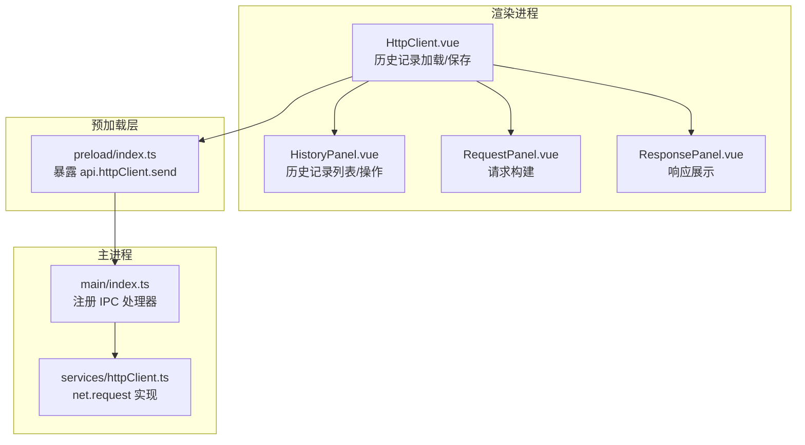
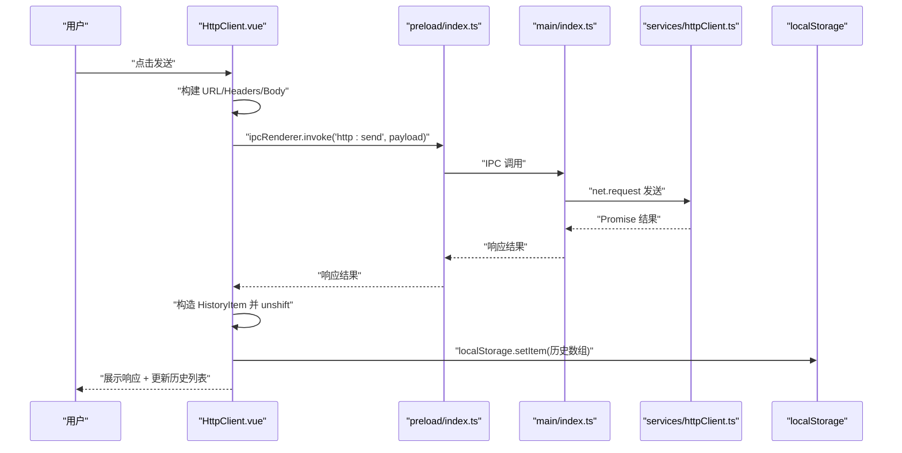
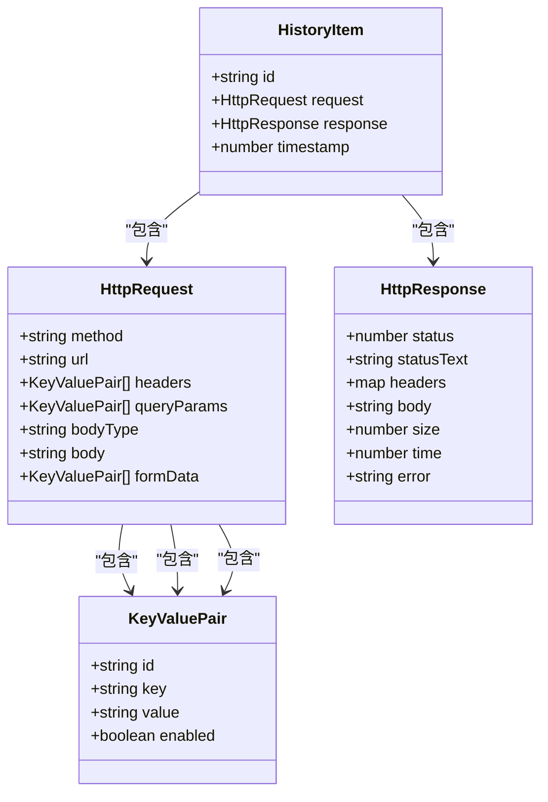
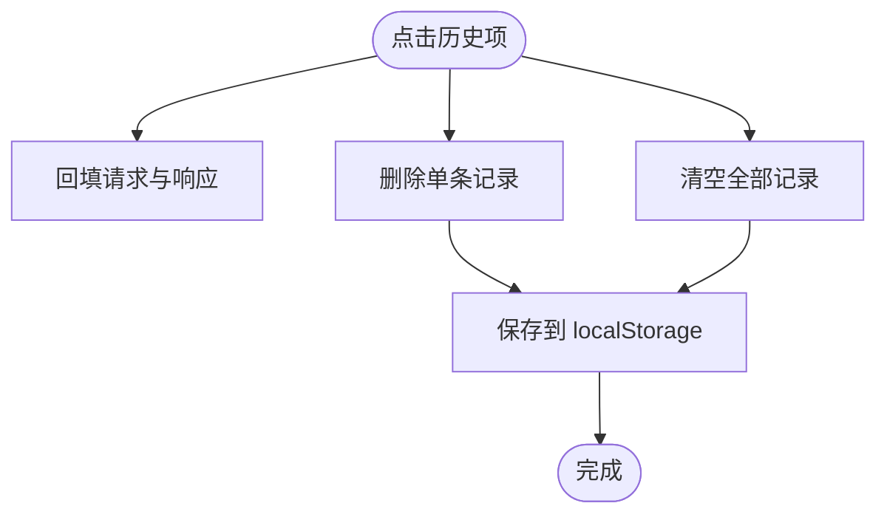
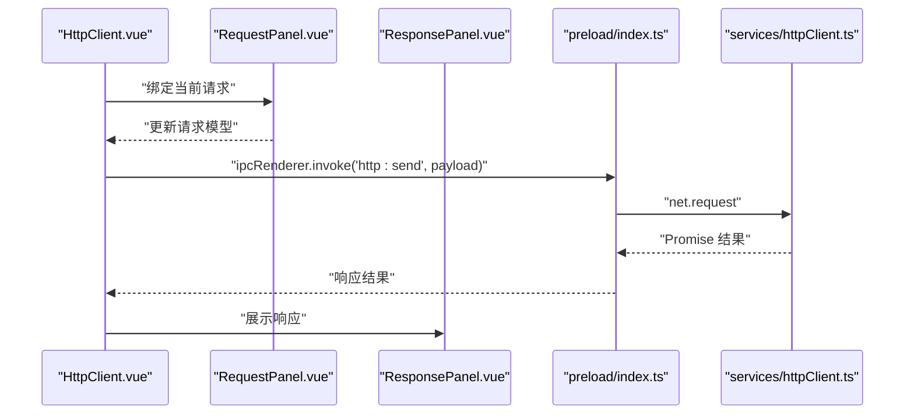
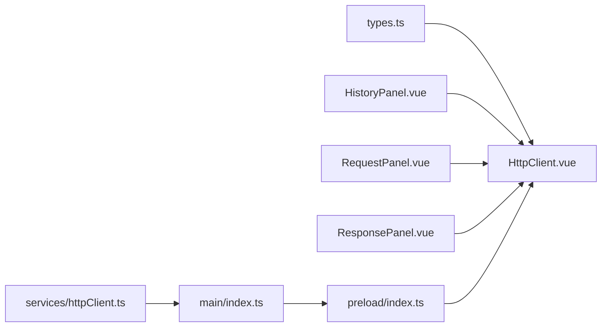

# 历史记录管理

<cite>
**本文档引用的文件**
- [HttpClient.vue](file://src/renderer/src/views/httpclient/HttpClient.vue)
- [HistoryPanel.vue](file://src/renderer/src/views/httpclient/components/HistoryPanel.vue)
- [types.ts](file://src/renderer/src/views/httpclient/types.ts)
- [httpClient.ts](file://src/main/services/httpClient.ts)
- [index.ts](file://src/preload/index.ts)
- [index.ts](file://src/main/index.ts)
- [RequestPanel.vue](file://src/renderer/src/views/httpclient/components/RequestPanel.vue)
- [ResponsePanel.vue](file://src/renderer/src/views/httpclient/components/ResponsePanel.vue)
</cite>

## 目录
1. [简介](#简介)
2. [项目结构](#项目结构)
3. [核心组件](#核心组件)
4. [架构总览](#架构总览)
5. [详细组件分析](#详细组件分析)
6. [依赖关系分析](#依赖关系分析)
7. [性能考虑](#性能考虑)
8. [故障排除指南](#故障排除指南)
9. [结论](#结论)

## 简介
本文件针对 HTTP 请求历史记录管理功能进行系统化技术文档整理，覆盖以下方面：
- 存储机制：本地存储策略、数据结构设计、索引优化
- 展示方式：列表视图、详情查看、搜索过滤、分组显示
- 操作功能：删除单条记录、批量清理、导出导入、分享链接生成
- 持久化：备份、恢复、存储空间管理
- 分类管理、标签系统、快速访问
- 性能优化与大数据量处理策略

## 项目结构
HTTP 历史记录管理位于 HTTP 客户端模块中，采用“渲染进程 + 主进程 + 预加载桥接”的架构模式：
- 渲染进程负责 UI 交互与本地存储（localStorage）
- 主进程负责实际网络请求与错误处理
- 预加载层通过 IPC 暴露安全的 API 给渲染进程

**图表来源**
- [HttpClient.vue:1-275](file://src/renderer/src/views/httpclient/HttpClient.vue#L1-L275)
- [HistoryPanel.vue:1-116](file://src/renderer/src/views/httpclient/components/HistoryPanel.vue#L1-L116)
- [RequestPanel.vue:1-227](file://src/renderer/src/views/httpclient/components/RequestPanel.vue#L1-L227)
- [ResponsePanel.vue:1-180](file://src/renderer/src/views/httpclient/components/ResponsePanel.vue#L1-L180)
- [index.ts:106-115](file://src/preload/index.ts#L106-L115)
- [index.ts:426-427](file://src/main/index.ts#L426-L427)
- [httpClient.ts:15-113](file://src/main/services/httpClient.ts#L15-L113)

**章节来源**
- [HttpClient.vue:1-275](file://src/renderer/src/views/httpclient/HttpClient.vue#L1-L275)
- [HistoryPanel.vue:1-116](file://src/renderer/src/views/httpclient/components/HistoryPanel.vue#L1-L116)
- [index.ts:106-115](file://src/preload/index.ts#L106-L115)
- [index.ts:426-427](file://src/main/index.ts#L426-L427)
- [httpClient.ts:15-113](file://src/main/services/httpClient.ts#L15-L113)

## 核心组件
- 历史记录数据模型：包含请求、响应、时间戳与唯一标识
- 历史记录面板：提供列表展示、选择、删除、清空、折叠切换
- 请求构建面板：方法、URL、查询参数、头部、请求体
- 响应展示面板：状态码、耗时、大小、响应体与头部
- 本地存储：localStorage 持久化，最大容量限制
- 主进程网络：IPC 调用 net.request，统一超时与错误处理

**章节来源**
- [types.ts:32-38](file://src/renderer/src/views/httpclient/types.ts#L32-L38)
- [HttpClient.vue:8-51](file://src/renderer/src/views/httpclient/HttpClient.vue#L8-L51)
- [HistoryPanel.vue:16-46](file://src/renderer/src/views/httpclient/components/HistoryPanel.vue#L16-L46)
- [RequestPanel.vue:16-55](file://src/renderer/src/views/httpclient/components/RequestPanel.vue#L16-L55)
- [ResponsePanel.vue:13-47](file://src/renderer/src/views/httpclient/components/ResponsePanel.vue#L13-L47)
- [httpClient.ts:15-113](file://src/main/services/httpClient.ts#L15-L113)

## 架构总览
历史记录的生命周期：请求发送 -> 响应返回 -> 历史项入栈 -> 本地持久化 -> 面板展示 -> 选择回填。

**图表来源**
- [HttpClient.vue:122-167](file://src/renderer/src/views/httpclient/HttpClient.vue#L122-L167)
- [index.ts:106-115](file://src/preload/index.ts#L106-L115)
- [index.ts:426-427](file://src/main/index.ts#L426-L427)
- [httpClient.ts:15-113](file://src/main/services/httpClient.ts#L15-L113)

## 详细组件分析

### 历史记录数据模型与本地存储
- 数据结构：HistoryItem 包含 id、request、response、timestamp
- 本地存储：使用 localStorage，键名为固定常量，值为 HistoryItem 数组
- 存储上限：每次保存时截断至最大历史数量，防止无限增长
- 加载逻辑：应用启动时尝试从 localStorage 恢复历史

**图表来源**
- [types.ts:12-38](file://src/renderer/src/views/httpclient/types.ts#L12-L38)

**章节来源**
- [types.ts:12-38](file://src/renderer/src/views/httpclient/types.ts#L12-L38)
- [HttpClient.vue:8-51](file://src/renderer/src/views/httpclient/HttpClient.vue#L8-L51)

### 历史记录面板（列表视图与操作）
- 列表渲染：遍历历史数组，展示方法、状态码、耗时、短 URL、时间
- 交互操作：
  - 选择历史项：回填请求与响应
  - 删除单条：根据 id 过滤
  - 清空全部：置空数组
  - 折叠切换：控制面板可见性
- 视觉反馈：方法颜色、状态码颜色、hover 删除按钮

**图表来源**
- [HttpClient.vue:170-183](file://src/renderer/src/views/httpclient/HttpClient.vue#L170-L183)
- [HistoryPanel.vue:82-112](file://src/renderer/src/views/httpclient/components/HistoryPanel.vue#L82-L112)

**章节来源**
- [HistoryPanel.vue:16-46](file://src/renderer/src/views/httpclient/components/HistoryPanel.vue#L16-L46)
- [HttpClient.vue:170-183](file://src/renderer/src/views/httpclient/HttpClient.vue#L170-L183)

### 请求构建与响应展示
- 请求构建：方法选择、URL 输入、查询参数、头部、请求体（JSON/Form/Text）
- 响应展示：状态码高亮、耗时、大小、响应体格式化、复制、头部查看
- 错误处理：统一包装错误响应，包含错误信息

**图表来源**
- [RequestPanel.vue:16-55](file://src/renderer/src/views/httpclient/components/RequestPanel.vue#L16-L55)
- [ResponsePanel.vue:13-47](file://src/renderer/src/views/httpclient/components/ResponsePanel.vue#L13-L47)
- [index.ts:106-115](file://src/preload/index.ts#L106-L115)
- [httpClient.ts:15-113](file://src/main/services/httpClient.ts#L15-L113)

**章节来源**
- [RequestPanel.vue:16-55](file://src/renderer/src/views/httpclient/components/RequestPanel.vue#L16-L55)
- [ResponsePanel.vue:13-47](file://src/renderer/src/views/httpclient/components/ResponsePanel.vue#L13-L47)
- [httpClient.ts:15-113](file://src/main/services/httpClient.ts#L15-L113)

### 本地存储策略与索引优化
- 存储介质：localStorage（键名固定）
- 数据结构：HistoryItem[]，按时间倒序排列
- 索引策略：
  - 读取：一次性 JSON.parse 恢复
  - 写入：slice 截断 + JSON.stringify
  - 删除：filter 过滤 + 保存
- 空间管理：MAX_HISTORY 限制，避免无限增长
- 时间复杂度：
  - 保存：O(n)（截断 + stringify）
  - 删除：O(n)（filter）
  - 展示：O(n)（列表渲染）

**章节来源**
- [HttpClient.vue:8-51](file://src/renderer/src/views/httpclient/HttpClient.vue#L8-L51)
- [HttpClient.vue:175-183](file://src/renderer/src/views/httpclient/HttpClient.vue#L175-L183)

### 搜索过滤与分组显示
- 搜索过滤：当前实现为列表滚动浏览，未内置搜索过滤功能
- 分组显示：当前实现按时间倒序，未按日期/状态等维度分组
- 建议扩展：
  - 增加搜索框，基于 URL、方法、状态码、时间范围过滤
  - 增加分组：按日期（今日/昨日/更早）、状态码区间、方法类别

**章节来源**
- [HistoryPanel.vue:78-112](file://src/renderer/src/views/httpclient/components/HistoryPanel.vue#L78-L112)

### 操作功能详解
- 删除单条记录：通过 id 过滤数组并保存
- 批量清理：清空全部历史并保存
- 导出导入：当前未实现，建议基于 localStorage JSON 进行导入导出
- 分享链接生成：当前未实现，可在历史项上生成可分享的 JSON 片段或链接

**章节来源**
- [HttpClient.vue:175-183](file://src/renderer/src/views/httpclient/HttpClient.vue#L175-L183)

### 持久化存储、备份与恢复
- 持久化：localStorage 持久化，应用重启后恢复
- 备份：可直接读取 localStorage 中的历史键值进行备份
- 恢复：应用启动时自动加载历史
- 存储空间管理：MAX_HISTORY 限制，超出自动截断

**章节来源**
- [HttpClient.vue:8-51](file://src/renderer/src/views/httpclient/HttpClient.vue#L8-L51)

### 分类管理、标签系统与快速访问
- 分类管理：当前未实现标签系统
- 快速访问：历史面板折叠/展开，点击历史项快速回填
- 建议扩展：
  - 引入标签字段，支持多标签选择过滤
  - 支持收藏/星标功能
  - 快捷键支持（如 Ctrl+Shift+H 展开历史面板）

**章节来源**
- [HistoryPanel.vue:48-58](file://src/renderer/src/views/httpclient/components/HistoryPanel.vue#L48-L58)

## 依赖关系分析
- 渲染进程依赖：
  - types.ts 提供数据模型
  - preload/index.ts 暴露 api.httpClient.send
  - main/index.ts 注册 IPC 处理器
  - services/httpClient.ts 实现 net.request
- 组件耦合：
  - HttpClient.vue 与 HistoryPanel.vue 通过事件通信
  - RequestPanel.vue 与 ResponsePanel.vue 与 HttpClient.vue 双向数据绑定

**图表来源**
- [types.ts:12-38](file://src/renderer/src/views/httpclient/types.ts#L12-L38)
- [HttpClient.vue:1-31](file://src/renderer/src/views/httpclient/HttpClient.vue#L1-L31)
- [HistoryPanel.vue:1-14](file://src/renderer/src/views/httpclient/components/HistoryPanel.vue#L1-L14)
- [RequestPanel.vue:1-14](file://src/renderer/src/views/httpclient/components/RequestPanel.vue#L1-L14)
- [ResponsePanel.vue:1-8](file://src/renderer/src/views/httpclient/components/ResponsePanel.vue#L1-L8)
- [index.ts:106-115](file://src/preload/index.ts#L106-L115)
- [index.ts:426-427](file://src/main/index.ts#L426-L427)
- [httpClient.ts:15-113](file://src/main/services/httpClient.ts#L15-L113)

**章节来源**
- [HttpClient.vue:1-31](file://src/renderer/src/views/httpclient/HttpClient.vue#L1-L31)
- [index.ts:106-115](file://src/preload/index.ts#L106-L115)
- [index.ts:426-427](file://src/main/index.ts#L426-L427)
- [httpClient.ts:15-113](file://src/main/services/httpClient.ts#L15-L113)

## 性能考虑
- 本地存储性能：
  - 保存：O(n)（截断 + stringify），建议在高频写入场景下节流
  - 删除：O(n)（filter），建议批量删除时合并操作
- 渲染性能：
  - 列表渲染：O(n)，建议启用虚拟滚动（如 vue-virtual-scroller）处理大量历史
  - JSON 格式化：响应体格式化为 O(n)，建议在大响应体时延迟或懒加载
- 网络性能：
  - 主进程 net.request 已内置超时与错误处理，避免阻塞 UI
- 存储空间：
  - MAX_HISTORY 控制内存占用，建议结合虚拟滚动进一步降低 DOM 节点数

[本节为通用性能建议，无需特定文件来源]

## 故障排除指南
- 历史记录无法加载：
  - 检查 localStorage 中对应键是否存在且可解析
  - 确认应用启动时 onMounted 的加载逻辑是否执行
- 历史记录无法保存：
  - 检查 saveHistory 是否被调用，localStorage 是否可用
- 请求失败：
  - 检查主进程 net.request 的错误回调，确认错误信息
  - 确认 URL 合法性与代理设置

**章节来源**
- [HttpClient.vue:33-51](file://src/renderer/src/views/httpclient/HttpClient.vue#L33-L51)
- [httpClient.ts:81-110](file://src/main/services/httpClient.ts#L81-L110)

## 结论
HTTP 请求历史记录管理功能以简洁的 localStorage 为基础，实现了基本的增删改查与 UI 展示。当前版本未包含搜索过滤、分组显示、标签系统与导出导入等功能，但具备良好的扩展基础。建议在保持现有架构不变的前提下，逐步引入搜索过滤、分组显示、标签系统、导出导入与快捷访问等能力，以满足更复杂的使用场景。