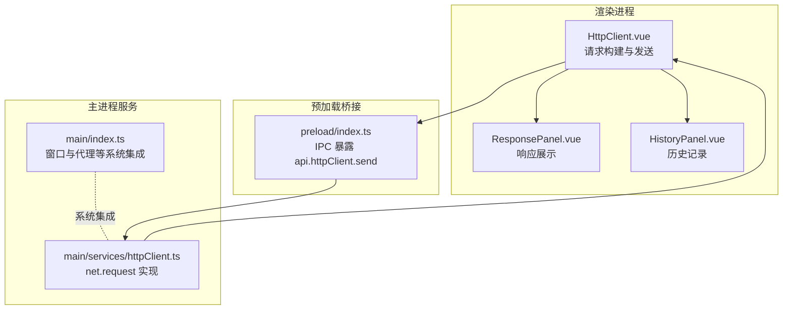
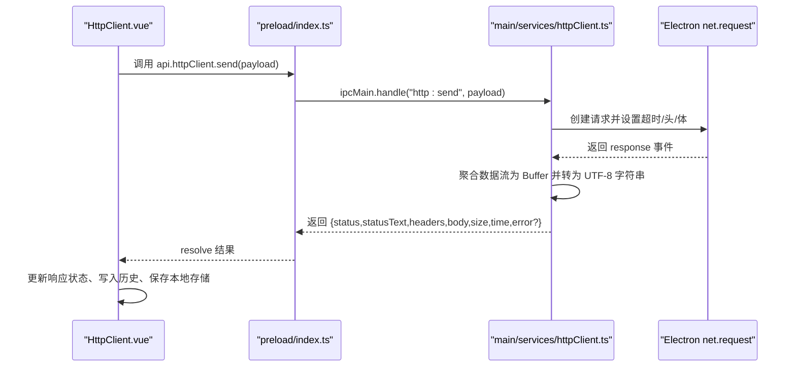
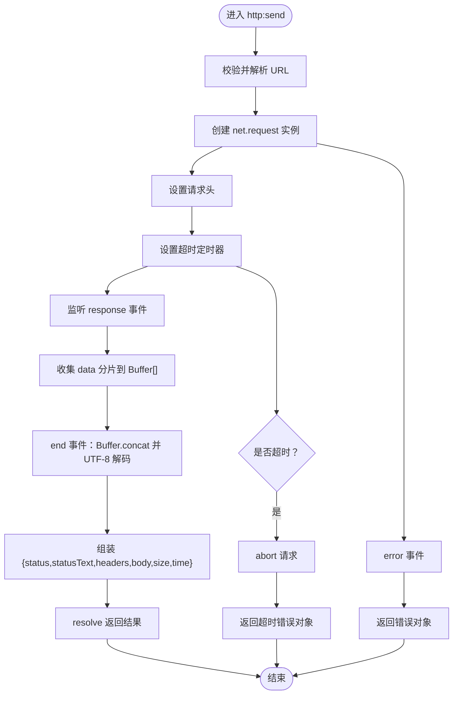
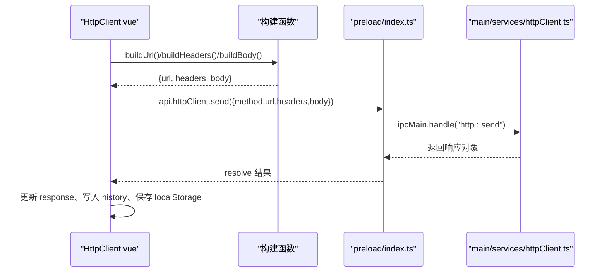
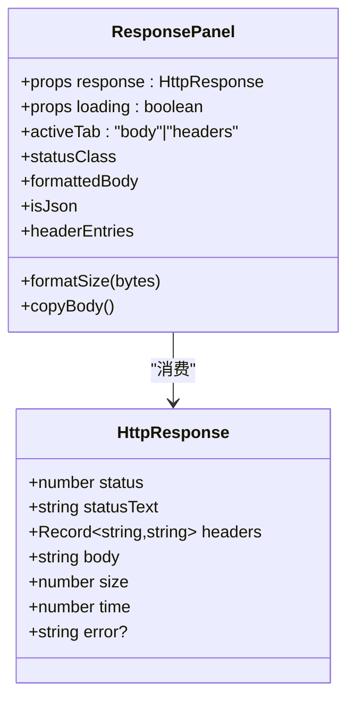
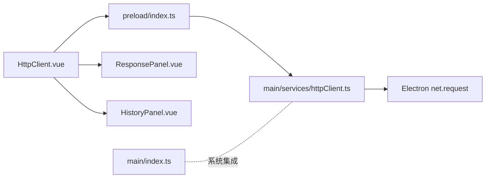

# 响应处理

<cite>
**本文引用的文件**
- [httpClient.ts](file://src/main/services/httpClient.ts)
- [index.ts](file://src/main/index.ts)
- [index.ts](file://src/preload/index.ts)
- [HttpClient.vue](file://src/renderer/src/views/httpclient/HttpClient.vue)
- [ResponsePanel.vue](file://src/renderer/src/views/httpclient/components/ResponsePanel.vue)
- [HistoryPanel.vue](file://src/renderer/src/views/httpclient/components/HistoryPanel.vue)
- [types.ts](file://src/renderer/src/views/httpclient/types.ts)
</cite>

## 目录
1. [简介](#简介)
2. [项目结构](#项目结构)
3. [核心组件](#核心组件)
4. [架构总览](#架构总览)
5. [详细组件分析](#详细组件分析)
6. [依赖关系分析](#依赖关系分析)
7. [性能考虑](#性能考虑)
8. [故障排查指南](#故障排查指南)
9. [结论](#结论)
10. [附录](#附录)

## 简介
本章节面向“HTTP 响应处理”能力，系统性阐述从请求发起、响应解析、格式化展示到错误处理与性能监控的完整流程。重点覆盖：
- 响应解析机制：状态码分类、响应头提取、内容类型与字符编码识别
- 响应体处理：文本、JSON、二进制与流式响应的解析策略
- 响应格式化显示：美化 JSON、表格展示、图片预览与文件下载链接生成
- 响应缓存策略、内存管理与大文件处理优化
- 响应时间统计、大小计算与性能监控
- 错误响应处理、异常捕获与用户友好提示

## 项目结构
HTTP 响应处理涉及三层协作：
- 主进程服务层：负责实际网络请求、超时控制、缓冲区聚合与基础解析
- 预加载桥接层：向渲染进程暴露安全的 IPC 接口
- 渲染进程视图层：负责请求构建、响应展示、历史记录与交互反馈

图表来源
- [HttpClient.vue:121-167](file://src/renderer/src/views/httpclient/HttpClient.vue#L121-L167)
- [index.ts:107-115](file://src/preload/index.ts#L107-L115)
- [httpClient.ts:15-112](file://src/main/services/httpClient.ts#L15-L112)
- [index.ts:426-427](file://src/main/index.ts#L426-L427)

章节来源
- [HttpClient.vue:1-275](file://src/renderer/src/views/httpclient/HttpClient.vue#L1-L275)
- [index.ts:107-115](file://src/preload/index.ts#L107-L115)
- [httpClient.ts:15-112](file://src/main/services/httpClient.ts#L15-L112)
- [index.ts:426-427](file://src/main/index.ts#L426-L427)

## 核心组件
- 主进程 HTTP 客户端服务：封装 Electron net.request，统一处理超时、错误、响应头与响应体聚合
- 预加载 IPC 暴露：将主进程能力安全地暴露给渲染进程
- 渲染进程 HTTP 客户端页面：负责请求参数构建、调用 IPC 发送请求、接收并展示响应
- 响应面板：状态码高亮、JSON 美化、复制、头部展示
- 历史面板：请求/响应历史记录的持久化与选择

章节来源
- [httpClient.ts:15-112](file://src/main/services/httpClient.ts#L15-L112)
- [index.ts:107-115](file://src/preload/index.ts#L107-L115)
- [HttpClient.vue:121-167](file://src/renderer/src/views/httpclient/HttpClient.vue#L121-L167)
- [ResponsePanel.vue:1-180](file://src/renderer/src/views/httpclient/components/ResponsePanel.vue#L1-L180)
- [HistoryPanel.vue:1-116](file://src/renderer/src/views/httpclient/components/HistoryPanel.vue#L1-L116)
- [types.ts:22-30](file://src/renderer/src/views/httpclient/types.ts#L22-L30)

## 架构总览
下图展示了从渲染进程发起请求到主进程执行网络请求，再到渲染进程展示响应的端到端流程。

图表来源
- [HttpClient.vue:133-138](file://src/renderer/src/views/httpclient/HttpClient.vue#L133-L138)
- [index.ts:107-115](file://src/preload/index.ts#L107-L115)
- [httpClient.ts:16-99](file://src/main/services/httpClient.ts#L16-L99)

## 详细组件分析

### 主进程 HTTP 客户端服务（响应解析与聚合）
- 超时控制：基于 setTimeout 在指定超时后 abort 请求，并返回标准化错误对象
- 响应头提取：遍历原始 headers，统一转换为字符串值
- 响应体聚合：使用 Buffer[] 收集分片，最终 concat 并按 UTF-8 解码为字符串
- 时间统计：以毫秒计，从请求开始到结束
- 错误处理：捕获 request error 与内部异常，统一返回带 error 字段的对象

图表来源
- [httpClient.ts:16-99](file://src/main/services/httpClient.ts#L16-L99)

章节来源
- [httpClient.ts:15-112](file://src/main/services/httpClient.ts#L15-L112)

### 预加载桥接层（IPC 暴露）
- 暴露 api.httpClient.send 方法，供渲染进程调用
- 通过 ipcRenderer.invoke 与主进程 ipcMain.handle 对接，确保安全隔离

章节来源
- [index.ts:107-115](file://src/preload/index.ts#L107-L115)

### 渲染进程 HTTP 客户端页面（请求构建与发送）
- 构建 URL：自动补全协议、拼接查询参数
- 构建请求头：过滤启用项；根据 bodyType 自动设置 Content-Type
- 构建请求体：支持 json/text/form；仅对允许的方法发送 body
- 发送请求：调用 api.httpClient.send，等待结果
- 历史记录：保存请求/响应到内存数组，上限 100 条，持久化到 localStorage

图表来源
- [HttpClient.vue:54-119](file://src/renderer/src/views/httpclient/HttpClient.vue#L54-L119)
- [HttpClient.vue:121-167](file://src/renderer/src/views/httpclient/HttpClient.vue#L121-L167)
- [index.ts:107-115](file://src/preload/index.ts#L107-L115)
- [httpClient.ts:16-99](file://src/main/services/httpClient.ts#L16-L99)

章节来源
- [HttpClient.vue:1-275](file://src/renderer/src/views/httpclient/HttpClient.vue#L1-L275)

### 响应面板（格式化展示与交互）
- 状态码高亮：依据状态码区间着色
- JSON 美化：尝试解析并以缩进格式输出；失败则原样显示
- 复制功能：将格式化后的文本复制到剪贴板
- 头部展示：将 headers 展示为键值列表
- 错误状态：当响应包含 error 字段时，以红色提示

图表来源
- [ResponsePanel.vue:1-180](file://src/renderer/src/views/httpclient/components/ResponsePanel.vue#L1-L180)
- [types.ts:22-30](file://src/renderer/src/views/httpclient/types.ts#L22-L30)

章节来源
- [ResponsePanel.vue:1-180](file://src/renderer/src/views/httpclient/components/ResponsePanel.vue#L1-L180)
- [types.ts:22-30](file://src/renderer/src/views/httpclient/types.ts#L22-L30)

### 历史面板（持久化与回放）
- 展示历史记录：方法、状态码、耗时、短 URL、时间戳
- 回放：点击历史项将请求/响应回填到当前界面
- 清空与删除：支持清空全部或逐条删除
- 本地存储：使用 localStorage 持久化，上限 100 条

章节来源
- [HistoryPanel.vue:1-116](file://src/renderer/src/views/httpclient/components/HistoryPanel.vue#L1-L116)
- [HttpClient.vue:33-51](file://src/renderer/src/views/httpclient/HttpClient.vue#L33-L51)

## 依赖关系分析
- 渲染进程依赖预加载桥接层提供的 api.httpClient.send
- 预加载桥接层依赖主进程 ipcMain.handle 的实现
- 主进程服务依赖 Electron net.request 进行网络请求
- 窗口与代理等系统能力由主进程入口统一配置

图表来源
- [HttpClient.vue:121-167](file://src/renderer/src/views/httpclient/HttpClient.vue#L121-L167)
- [index.ts:107-115](file://src/preload/index.ts#L107-L115)
- [httpClient.ts:15-112](file://src/main/services/httpClient.ts#L15-L112)
- [index.ts:426-427](file://src/main/index.ts#L426-L427)

章节来源
- [HttpClient.vue:1-275](file://src/renderer/src/views/httpclient/HttpClient.vue#L1-L275)
- [index.ts:107-115](file://src/preload/index.ts#L107-L115)
- [httpClient.ts:15-112](file://src/main/services/httpClient.ts#L15-L112)
- [index.ts:426-427](file://src/main/index.ts#L426-L427)

## 性能考虑
- 响应时间统计：主进程在请求开始时记录时间戳，结束时计算差值，单位毫秒
- 响应大小计算：基于 Buffer.length，单位字节
- 超时控制：主进程在指定超时后主动 abort，避免长时间占用资源
- 内存管理：主进程使用 Buffer[] 逐步累积响应体，结束后一次性解码为字符串；建议后续可引入分块解析策略以降低峰值内存
- 大文件处理：当前实现将整个响应体聚合为字符串，不适合超大响应；建议在后续版本中引入流式解析与分页/分块展示
- 本地历史存储：localStorage 有容量限制，当前实现限制最多 100 条，避免过度占用

章节来源
- [httpClient.ts:17-76](file://src/main/services/httpClient.ts#L17-L76)
- [HttpClient.vue:45-51](file://src/renderer/src/views/httpclient/HttpClient.vue#L45-L51)
- [HistoryPanel.vue:48-116](file://src/renderer/src/views/httpclient/components/HistoryPanel.vue#L48-L116)

## 故障排查指南
- 超时错误：主进程在超时后返回 status=0、statusText='Timeout'、并携带 error 描述
- 网络错误：request error 时返回 status=0、statusText='Error'、error=message
- URL 不合法：构建 URL 时若抛出异常，会回退为拼接查询字符串的方式
- Content-Type 自动设置：当未手动设置且方法允许时，根据 bodyType 自动设置 Content-Type
- 代理与网络：主进程入口提供代理设置接口，用于解决网络受限场景

章节来源
- [httpClient.ts:38-92](file://src/main/services/httpClient.ts#L38-L92)
- [HttpClient.vue:54-77](file://src/renderer/src/views/httpclient/HttpClient.vue#L54-L77)
- [HttpClient.vue:86-96](file://src/renderer/src/views/httpclient/HttpClient.vue#L86-L96)
- [index.ts:306-327](file://src/main/index.ts#L306-L327)

## 结论
该响应处理方案以 Electron net.request 为核心，结合预加载桥接与渲染层视图组件，实现了从请求构建、发送、解析到展示的闭环。当前实现具备完善的超时控制、错误兜底与历史记录能力；在 JSON 美化、状态码高亮与复制等用户体验方面表现良好。针对大文件与流式响应，建议引入分块解析与增量渲染策略以进一步提升性能与稳定性。

## 附录

### 数据模型与字段说明
- 请求模型 HttpRequest：包含方法、URL、启用的头、查询参数、Body 类型与内容、表单数据
- 响应模型 HttpResponse：包含状态码、状态文本、响应头、响应体、大小、耗时、错误信息

章节来源
- [types.ts:12-30](file://src/renderer/src/views/httpclient/types.ts#L12-L30)