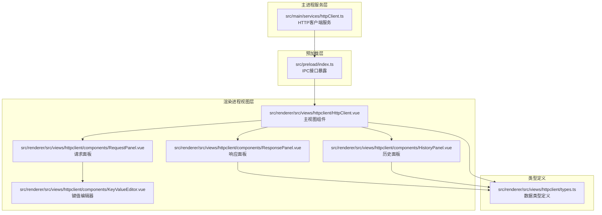
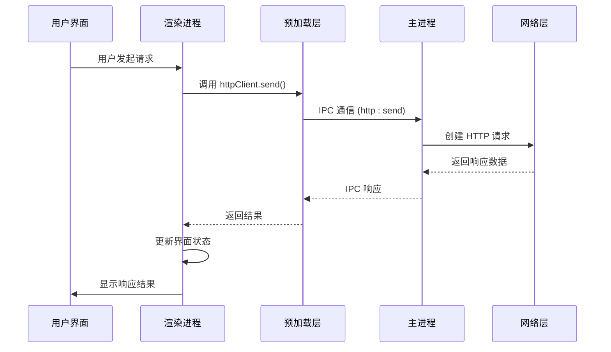
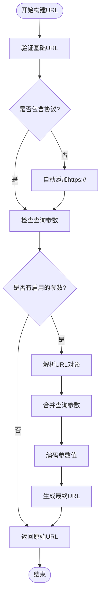
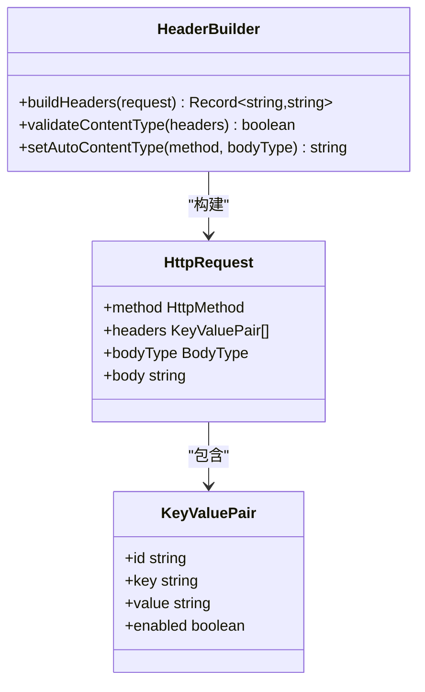
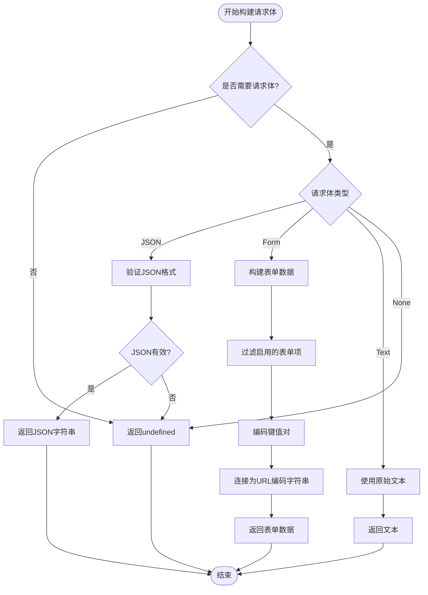
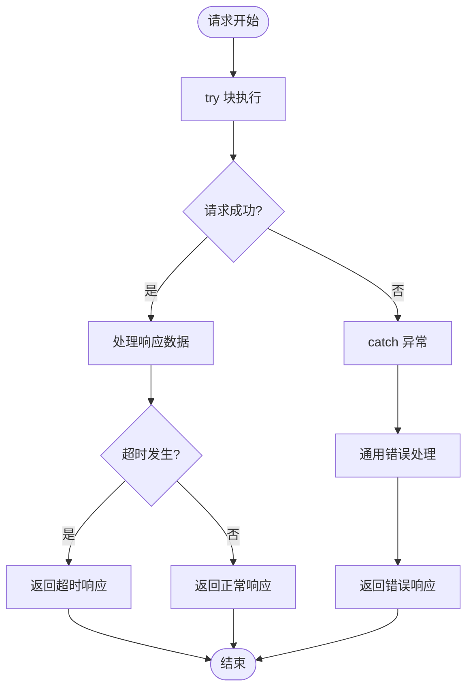
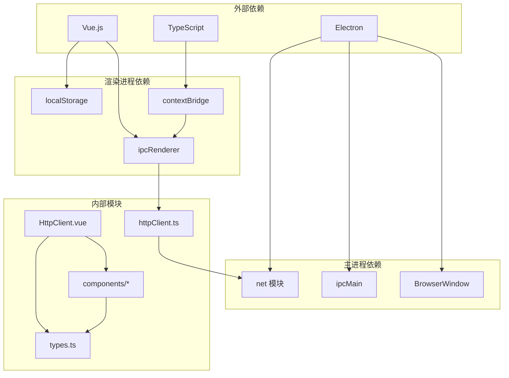

# 请求管理

<cite>
**本文档引用的文件**
- [httpClient.ts](file://src/main/services/httpClient.ts)
- [HttpClient.vue](file://src/renderer/src/views/httpclient/HttpClient.vue)
- [types.ts](file://src/renderer/src/views/httpclient/types.ts)
- [RequestPanel.vue](file://src/renderer/src/views/httpclient/components/RequestPanel.vue)
- [ResponsePanel.vue](file://src/renderer/src/views/httpclient/components/ResponsePanel.vue)
- [HistoryPanel.vue](file://src/renderer/src/views/httpclient/components/HistoryPanel.vue)
- [KeyValueEditor.vue](file://src/renderer/src/views/httpclient/components/KeyValueEditor.vue)
- [index.ts](file://src/preload/index.ts)
- [index.ts](file://src/main/index.ts)
</cite>

## 目录
1. [简介](#简介)
2. [项目结构](#项目结构)
3. [核心组件](#核心组件)
4. [架构概览](#架构概览)
5. [详细组件分析](#详细组件分析)
6. [依赖关系分析](#依赖关系分析)
7. [性能考虑](#性能考虑)
8. [故障排除指南](#故障排除指南)
9. [结论](#结论)

## 简介

请求管理功能是一个基于 Electron 的 HTTP 客户端工具，提供了完整的 HTTP 请求发送能力。该功能支持多种 HTTP 方法、请求头管理、请求体序列化、查询参数处理以及历史记录管理。通过主进程的网络请求处理和渲染进程的用户界面交互，实现了高效、可靠的 HTTP 请求管理体验。

## 项目结构

请求管理功能主要分布在以下目录结构中：

**图表来源**
- [httpClient.ts:1-113](file://src/main/services/httpClient.ts#L1-L113)
- [HttpClient.vue:1-275](file://src/renderer/src/views/httpclient/HttpClient.vue#L1-L275)
- [types.ts:1-38](file://src/renderer/src/views/httpclient/types.ts#L1-L38)

**章节来源**
- [httpClient.ts:1-113](file://src/main/services/httpClient.ts#L1-L113)
- [HttpClient.vue:1-275](file://src/renderer/src/views/httpclient/HttpClient.vue#L1-L275)
- [types.ts:1-38](file://src/renderer/src/views/httpclient/types.ts#L1-L38)

## 核心组件

### HTTP 客户端服务

HTTP 客户端服务是整个请求管理功能的核心，负责在主进程中执行实际的 HTTP 请求。

**主要特性：**
- 支持所有标准 HTTP 方法（GET、POST、PUT、DELETE、PATCH、HEAD、OPTIONS）
- 自动代理设置和跨域请求处理
- 超时控制机制
- 错误处理和异常捕获
- 响应数据格式化

**关键实现要点：**
- 使用 Electron 的 `net` 模块进行网络请求
- 通过 IPC 与渲染进程通信
- 自动处理请求头和请求体
- 提供详细的错误信息反馈

**章节来源**
- [httpClient.ts:15-113](file://src/main/services/httpClient.ts#L15-L113)

### 预加载接口

预加载层负责在渲染进程中暴露安全的 API 接口，实现主进程和渲染进程之间的通信。

**主要职责：**
- 暴露 `httpClient.send` 方法给渲染进程调用
- 通过 IPC 通道传递请求参数
- 处理异步响应数据

**章节来源**
- [index.ts:106-115](file://src/preload/index.ts#L106-L115)

### 主视图组件

主视图组件是用户界面的核心，负责协调各个子组件的工作。

**核心功能：**
- 请求构建和验证
- 历史记录管理和持久化
- 响应数据显示和格式化
- 用户交互处理

**章节来源**
- [HttpClient.vue:1-275](file://src/renderer/src/views/httpclient/HttpClient.vue#L1-L275)

## 架构概览

请求管理功能采用典型的 Electron 双进程架构，实现了清晰的职责分离：

**图表来源**
- [HttpClient.vue:122-167](file://src/renderer/src/views/httpclient/HttpClient.vue#L122-L167)
- [index.ts:106-115](file://src/preload/index.ts#L106-L115)
- [httpClient.ts:15-113](file://src/main/services/httpClient.ts#L15-L113)

## 详细组件分析

### 请求构建流程

请求构建是整个功能的核心，涉及多个层面的数据处理和转换。

#### URL 参数处理

URL 参数处理包含协议自动补全、查询参数合并和编码处理：

**图表来源**
- [HttpClient.vue:53-77](file://src/renderer/src/views/httpclient/HttpClient.vue#L53-L77)

#### 请求头管理机制

请求头管理支持默认头部设置、自定义头部添加和自动 Content-Type 检测：

**图表来源**
- [HttpClient.vue:79-99](file://src/renderer/src/views/httpclient/HttpClient.vue#L79-L99)
- [types.ts:3-8](file://src/renderer/src/views/httpclient/types.ts#L3-L8)

**章节来源**
- [HttpClient.vue:79-99](file://src/renderer/src/views/httpclient/HttpClient.vue#L79-L99)

#### 请求体序列化

请求体序列化支持多种格式，包括 JSON、表单数据、文本和原始数据：

**图表来源**
- [HttpClient.vue:101-119](file://src/renderer/src/views/httpclient/HttpClient.vue#L101-L119)

**章节来源**
- [HttpClient.vue:101-119](file://src/renderer/src/views/httpclient/HttpClient.vue#L101-L119)

### 超时控制、重试机制和错误处理

#### 超时控制

超时控制通过 Node.js 的 `setTimeout` 机制实现，确保长时间无响应的请求能够及时中断：

**实现特点：**
- 默认超时时间为 30 秒
- 使用 `request.abort()` 中断请求
- 提供详细的超时错误信息
- 清理定时器避免内存泄漏

#### 错误处理策略

错误处理采用多层次的异常捕获机制：

**图表来源**
- [httpClient.ts:19-110](file://src/main/services/httpClient.ts#L19-L110)

**章节来源**
- [httpClient.ts:19-110](file://src/main/services/httpClient.ts#L19-L110)

### 历史记录管理

历史记录管理提供了完整的请求历史存储和检索功能：

#### 数据持久化

历史记录使用 localStorage 进行持久化存储，具有以下特性：
- 存储键名：`httpclient_history`
- 最大历史数量：100 条
- 自动截断机制：超过限制时自动清理旧记录
- JSON 序列化：确保数据完整性

#### 历史记录操作

支持的操作包括：
- **选择历史记录**：恢复到指定的历史请求状态
- **删除单条记录**：移除特定的历史项
- **清空历史记录**：删除所有历史记录
- **切换面板显示**：控制历史面板的可见性

**章节来源**
- [HttpClient.vue:33-51](file://src/renderer/src/views/httpclient/HttpClient.vue#L33-L51)
- [HttpClient.vue:169-183](file://src/renderer/src/views/httpclient/HttpClient.vue#L169-L183)

### 用户界面组件

#### 请求面板

请求面板提供完整的请求配置界面，支持：
- HTTP 方法选择和颜色标识
- URL 输入和验证
- 查询参数管理
- 请求头编辑
- 多种请求体格式支持

#### 响应面板

响应面板负责展示服务器响应：
- 状态码和状态文本显示
- 响应头和响应体展示
- JSON 格式化和复制功能
- 错误状态处理

#### 历史面板

历史面板提供历史记录的浏览和管理：
- 缩略URL显示
- 方法和状态颜色标识
- 时间戳显示
- 历史记录操作按钮

**章节来源**
- [RequestPanel.vue:1-227](file://src/renderer/src/views/httpclient/components/RequestPanel.vue#L1-L227)
- [ResponsePanel.vue:1-180](file://src/renderer/src/views/httpclient/components/ResponsePanel.vue#L1-L180)
- [HistoryPanel.vue:1-116](file://src/renderer/src/views/httpclient/components/HistoryPanel.vue#L1-L116)

## 依赖关系分析

请求管理功能的依赖关系体现了清晰的分层架构：

**图表来源**
- [httpClient.ts:5-13](file://src/main/services/httpClient.ts#L5-L13)
- [HttpClient.vue:1-6](file://src/renderer/src/views/httpclient/HttpClient.vue#L1-L6)
- [index.ts:1-8](file://src/preload/index.ts#L1-L8)

**章节来源**
- [httpClient.ts:5-13](file://src/main/services/httpClient.ts#L5-L13)
- [HttpClient.vue:1-6](file://src/renderer/src/views/httpclient/HttpClient.vue#L1-L6)
- [index.ts:1-8](file://src/preload/index.ts#L1-L8)

## 性能考虑

### 网络请求优化

1. **超时控制**：默认 30 秒超时时间平衡了响应速度和可靠性
2. **内存管理**：及时清理定时器和事件监听器
3. **缓冲区处理**：使用 Buffer.concat() 合并响应数据
4. **代理支持**：自动使用应用代理设置

### 用户界面优化

1. **懒加载**：历史面板支持折叠显示
2. **虚拟滚动**：大量历史记录时的性能优化
3. **防抖处理**：输入验证和实时更新
4. **状态缓存**：避免重复计算和DOM操作

### 数据存储优化

1. **增量存储**：只存储必要的历史数据
2. **自动清理**：超出限制时自动删除旧记录
3. **JSON 序列化**：高效的序列化和反序列化
4. **本地存储**：避免网络传输开销

## 故障排除指南

### 常见问题及解决方案

#### 网络连接问题

**症状**：请求超时或连接失败
**原因**：网络连接不稳定或代理配置错误
**解决方案**：
1. 检查网络连接状态
2. 配置正确的代理设置
3. 增加超时时间
4. 重试请求

#### URL 格式错误

**症状**：URL 解析失败
**原因**：URL 格式不正确或缺少协议
**解决方案**：
1. 确保 URL 包含协议前缀（http:// 或 https://）
2. 检查特殊字符的编码
3. 验证域名格式

#### 请求体格式错误

**症状**：服务器返回 400 错误
**原因**：请求体格式与 Content-Type 不匹配
**解决方案**：
1. 确认 Content-Type 与请求体格式一致
2. 检查 JSON 格式的有效性
3. 验证表单数据的编码

#### 历史记录丢失

**症状**：历史记录无法保存或丢失
**原因**：localStorage 权限问题或存储空间不足
**解决方案**：
1. 检查浏览器的 localStorage 设置
2. 清理不必要的历史记录
3. 检查磁盘空间

**章节来源**
- [httpClient.ts:38-92](file://src/main/services/httpClient.ts#L38-L92)
- [HttpClient.vue:154-166](file://src/renderer/src/views/httpclient/HttpClient.vue#L154-L166)

## 结论

请求管理功能通过精心设计的架构和实现，提供了完整而高效的 HTTP 请求管理能力。其主要优势包括：

1. **完整的功能覆盖**：支持所有标准 HTTP 方法和请求体格式
2. **良好的用户体验**：直观的界面设计和丰富的交互功能
3. **可靠的数据管理**：完善的请求历史记录和持久化机制
4. **健壮的错误处理**：多层次的异常捕获和用户友好的错误提示
5. **可扩展的架构**：清晰的分层设计便于功能扩展和维护

该功能为开发者提供了强大的 HTTP 请求调试和测试工具，特别适用于 API 开发、服务监控和网络调试等场景。通过 Electron 的原生能力，实现了桌面应用的高性能和稳定性。