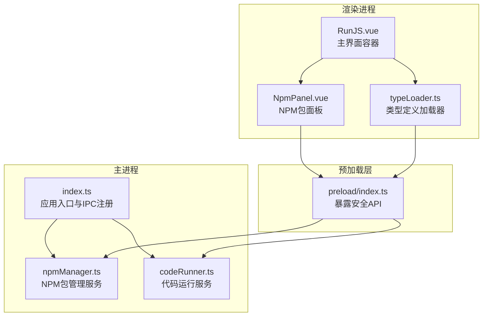
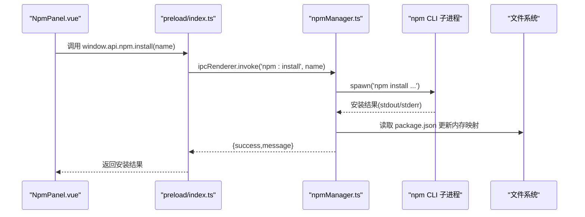
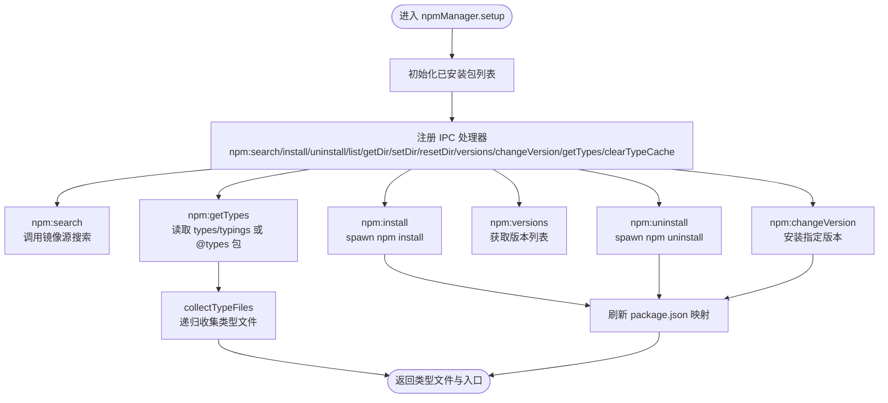
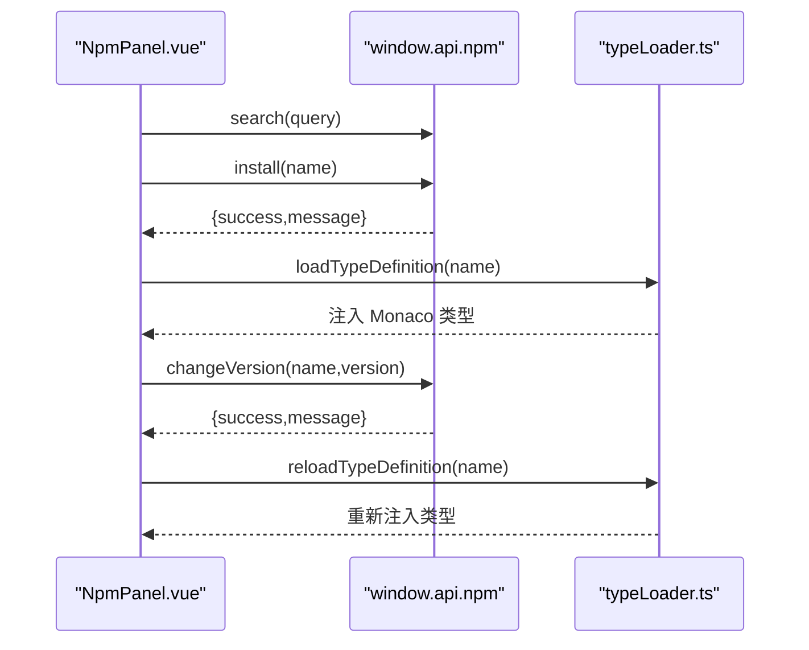
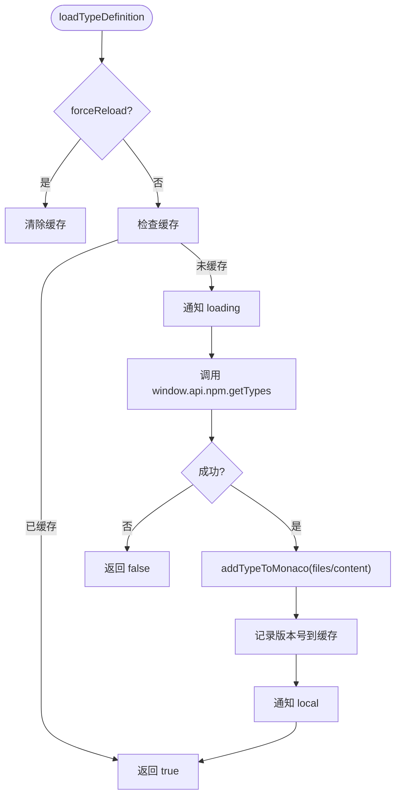
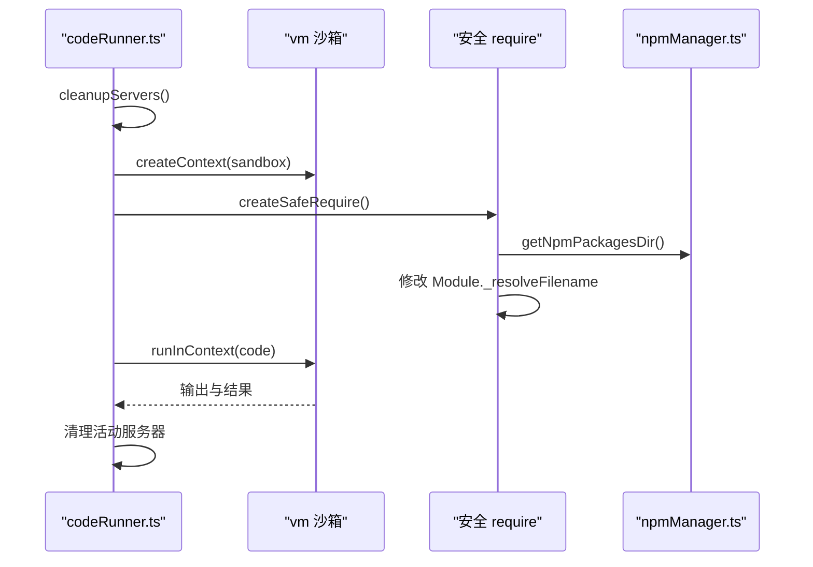
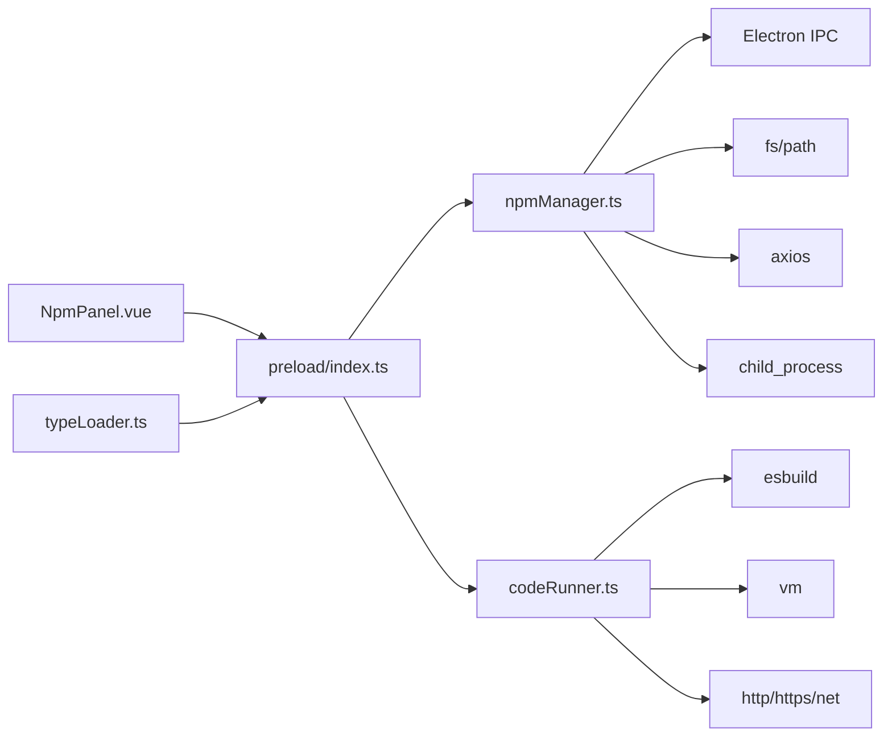

# NPM包管理服务

<cite>
**本文档引用的文件**
- [npmManager.ts](file://src/main/services/npmManager.ts)
- [NpmPanel.vue](file://src/renderer/src/views/runjs/components/NpmPanel.vue)
- [index.ts](file://src/main/index.ts)
- [typeLoader.ts](file://src/renderer/src/utils/typeLoader.ts)
- [codeRunner.ts](file://src/main/services/codeRunner.ts)
- [RunJS.vue](file://src/renderer/src/views/runjs/RunJS.vue)
- [index.ts](file://src/preload/index.ts)
- [.npmrc](file://.npmrc)
- [package.json](file://package.json)
</cite>

## 目录
1. [简介](#简介)
2. [项目结构](#项目结构)
3. [核心组件](#核心组件)
4. [架构总览](#架构总览)
5. [详细组件分析](#详细组件分析)
6. [依赖关系分析](#依赖关系分析)
7. [性能考虑](#性能考虑)
8. [故障排除指南](#故障排除指南)
9. [结论](#结论)
10. [附录](#附录)

## 简介
本项目为一个基于 Electron 的开发者工具箱，其中 NPM 包管理服务是核心功能之一。该服务负责：
- 包安装、卸载、版本切换的完整流程
- 依赖解析与冲突处理机制
- 包搜索算法与版本比较逻辑
- 依赖树构建与循环依赖检测
- 包信息获取、元数据解析、许可证验证与安全扫描
- 包缓存策略、增量更新机制与离线模式支持
- API 使用指南（包操作接口、状态查询与进度监控）
- 错误处理、回滚机制与故障恢复策略
- 与代码运行服务的集成方式与类型定义加载流程

## 项目结构
该项目采用 Electron + Vue 的前后端分离架构，NPM 包管理服务位于主进程（main）侧，渲染进程（renderer）负责 UI 交互与类型定义加载。

图表来源
- [index.ts:421-429](file://src/main/index.ts#L421-L429)
- [npmManager.ts:207-552](file://src/main/services/npmManager.ts#L207-L552)
- [codeRunner.ts:98-318](file://src/main/services/codeRunner.ts#L98-L318)
- [index.ts:71-85](file://src/preload/index.ts#L71-L85)
- [RunJS.vue:1-353](file://src/renderer/src/views/runjs/RunJS.vue#L1-L353)
- [NpmPanel.vue:1-431](file://src/renderer/src/views/runjs/components/NpmPanel.vue#L1-L431)
- [typeLoader.ts:1-206](file://src/renderer/src/utils/typeLoader.ts#L1-L206)

章节来源
- [index.ts:421-429](file://src/main/index.ts#L421-L429)
- [npmManager.ts:207-552](file://src/main/services/npmManager.ts#L207-L552)
- [index.ts:71-85](file://src/preload/index.ts#L71-L85)
- [RunJS.vue:1-353](file://src/renderer/src/views/runjs/RunJS.vue#L1-L353)
- [NpmPanel.vue:1-431](file://src/renderer/src/views/runjs/components/NpmPanel.vue#L1-L431)
- [typeLoader.ts:1-206](file://src/renderer/src/utils/typeLoader.ts#L1-L206)

## 核心组件
- NPM 包管理服务（主进程）：提供包搜索、安装、卸载、版本切换、类型定义获取、目录管理等能力，并通过 IPC 暴露给渲染进程。
- 预加载层（preload）：通过 contextBridge 暴露受控的 API，封装 npm 管理相关的 IPC 调用。
- NPM 包面板（渲染进程）：提供包搜索、安装、卸载、版本选择与切换的 UI。
- 类型定义加载器（渲染进程）：负责从本地 node_modules 加载类型定义，注入 Monaco 编辑器，并提供缓存与并发加载策略。
- 代码运行服务（主进程）：与 NPM 包管理服务协作，提供安全的 require 与沙箱执行环境，支持实时输出与端口清理。

章节来源
- [npmManager.ts:207-552](file://src/main/services/npmManager.ts#L207-L552)
- [index.ts:71-85](file://src/preload/index.ts#L71-L85)
- [NpmPanel.vue:1-431](file://src/renderer/src/views/runjs/components/NpmPanel.vue#L1-L431)
- [typeLoader.ts:1-206](file://src/renderer/src/utils/typeLoader.ts#L1-L206)
- [codeRunner.ts:98-318](file://src/main/services/codeRunner.ts#L98-L318)

## 架构总览
NPM 包管理服务通过 IPC 与渲染进程通信，主进程使用子进程调用 npm CLI，实现真实的包安装与卸载；类型定义加载器从本地 node_modules 读取类型文件，递归收集依赖并注入 Monaco 编辑器。

图表来源
- [NpmPanel.vue:80-98](file://src/renderer/src/views/runjs/components/NpmPanel.vue#L80-L98)
- [index.ts:71-85](file://src/preload/index.ts#L71-L85)
- [npmManager.ts:233-267](file://src/main/services/npmManager.ts#L233-L267)

## 详细组件分析

### NPM 包管理服务（主进程）
- 配置与目录管理
  - 支持自定义安装目录与回退到默认目录，确保目录存在并初始化 package.json。
  - 通过配置文件持久化安装路径，提供目录变更与重置能力。
- 包搜索与版本查询
  - 使用镜像源进行包搜索与版本列表获取，支持超时控制与错误处理。
- 安装、卸载与版本切换
  - 通过子进程调用 npm CLI 执行真实安装/卸载/版本切换，解析输出并更新内存映射。
  - 安装/卸载后刷新本地 package.json，保证状态一致。
- 类型定义获取
  - 优先读取包自身 package.json 的 types/typings 字段，若不存在则尝试 @types 包自动安装与递归收集类型文件。
  - 支持循环依赖检测与文件路径规范化，避免重复加载。
- 目录与缓存
  - 通过 getNpmPackagesDir 暴露包安装目录，供代码运行服务与类型加载器使用。

图表来源
- [npmManager.ts:207-552](file://src/main/services/npmManager.ts#L207-L552)
- [npmManager.ts:557-634](file://src/main/services/npmManager.ts#L557-L634)

章节来源
- [npmManager.ts:27-80](file://src/main/services/npmManager.ts#L27-L80)
- [npmManager.ts:212-230](file://src/main/services/npmManager.ts#L212-L230)
- [npmManager.ts:233-267](file://src/main/services/npmManager.ts#L233-L267)
- [npmManager.ts:270-304](file://src/main/services/npmManager.ts#L270-L304)
- [npmManager.ts:364-377](file://src/main/services/npmManager.ts#L364-L377)
- [npmManager.ts:380-426](file://src/main/services/npmManager.ts#L380-L426)
- [npmManager.ts:429-552](file://src/main/services/npmManager.ts#L429-L552)
- [npmManager.ts:557-634](file://src/main/services/npmManager.ts#L557-L634)

### 预加载层（安全 API 暴露）
- 通过 contextBridge 将受限的 API 暴露给渲染进程，统一命名空间 window.api。
- 暴露 npm 管理相关接口，包括搜索、安装、卸载、列出、版本查询、版本切换、目录管理、类型获取与缓存清理。

章节来源
- [index.ts:71-85](file://src/preload/index.ts#L71-L85)

### NPM 包面板（渲染进程）
- 搜索与安装：输入关键词进行包搜索，点击安装按钮触发安装流程，安装完成后自动加载类型定义。
- 卸载与版本切换：展示已安装包列表，支持卸载与版本选择，切换后重新加载类型定义。
- 目录管理：支持更改与重置 NPM 安装目录，刷新列表。

图表来源
- [NpmPanel.vue:59-78](file://src/renderer/src/views/runjs/components/NpmPanel.vue#L59-L78)
- [NpmPanel.vue:80-98](file://src/renderer/src/views/runjs/components/NpmPanel.vue#L80-L98)
- [NpmPanel.vue:118-137](file://src/renderer/src/views/runjs/components/NpmPanel.vue#L118-L137)
- [NpmPanel.vue:139-156](file://src/renderer/src/views/runjs/components/NpmPanel.vue#L139-L156)
- [typeLoader.ts:68-103](file://src/renderer/src/utils/typeLoader.ts#L68-L103)
- [typeLoader.ts:108-110](file://src/renderer/src/utils/typeLoader.ts#L108-L110)

章节来源
- [NpmPanel.vue:1-431](file://src/renderer/src/views/runjs/components/NpmPanel.vue#L1-L431)

### 类型定义加载器（渲染进程）
- 加载策略
  - 优先从本地 node_modules 加载类型定义，支持字符串与多文件两种格式。
  - 提供缓存（loadedTypes），避免重复加载。
- 并发与批量
  - 支持批量加载已安装包的类型，限制并发数为 3，提升加载效率。
- 代码分析
  - 从代码中提取 require/import 的包名，按需加载类型定义。
- 事件通知
  - 提供订阅接口，监听类型加载状态变化（loading/local/cached/failed）。

图表来源
- [typeLoader.ts:68-103](file://src/renderer/src/utils/typeLoader.ts#L68-L103)
- [typeLoader.ts:122-139](file://src/renderer/src/utils/typeLoader.ts#L122-L139)
- [typeLoader.ts:144-184](file://src/renderer/src/utils/typeLoader.ts#L144-L184)

章节来源
- [typeLoader.ts:1-206](file://src/renderer/src/utils/typeLoader.ts#L1-L206)

### 代码运行服务（主进程）与 NPM 集成
- 安全 require
  - 仅允许已安装包与内置模块，动态修改模块解析以优先从用户安装目录加载。
- 沙箱执行
  - 使用 vm.createContext 构建沙箱，捕获 console 输出，支持 TypeScript 编译与 Promise 错误处理。
- 服务器追踪与清理
  - 全局劫持 http/https/net 模块，追踪并清理活动服务器，避免端口占用。
- 端口清理
  - 提供根据端口号终止进程的能力，仅终止 Electron 相关进程，避免误杀。

图表来源
- [codeRunner.ts:98-318](file://src/main/services/codeRunner.ts#L98-L318)
- [codeRunner.ts:364-460](file://src/main/services/codeRunner.ts#L364-L460)
- [npmManager.ts:25-80](file://src/main/services/npmManager.ts#L25-L80)

章节来源
- [codeRunner.ts:1-461](file://src/main/services/codeRunner.ts#L1-L461)

## 依赖关系分析
- NPM 包管理服务依赖：
  - Electron IPC（ipcMain/ipcRenderer）
  - 子进程（child_process）调用 npm CLI
  - 文件系统（fs/path）读写 package.json 与类型文件
  - HTTP 客户端（axios）访问镜像源
- 预加载层依赖：
  - contextBridge 暴露受控 API
- 类型定义加载器依赖：
  - Monaco 编辑器（monacoSetup）
  - window.api.npm.getTypes
- 代码运行服务依赖：
  - esbuild（TypeScript 编译）
  - vm（沙箱执行）
  - http/https/net（服务器追踪）

图表来源
- [npmManager.ts:1-6](file://src/main/services/npmManager.ts#L1-L6)
- [index.ts:1-2](file://src/preload/index.ts#L1-L2)
- [NpmPanel.vue:1-4](file://src/renderer/src/views/runjs/components/NpmPanel.vue#L1-L4)
- [typeLoader.ts](file://src/renderer/src/utils/typeLoader.ts#L5)
- [codeRunner.ts:1-8](file://src/main/services/codeRunner.ts#L1-L8)

章节来源
- [npmManager.ts:1-6](file://src/main/services/npmManager.ts#L1-L6)
- [index.ts:1-2](file://src/preload/index.ts#L1-L2)
- [NpmPanel.vue:1-4](file://src/renderer/src/views/runjs/components/NpmPanel.vue#L1-L4)
- [typeLoader.ts](file://src/renderer/src/utils/typeLoader.ts#L5)
- [codeRunner.ts:1-8](file://src/main/services/codeRunner.ts#L1-L8)

## 性能考虑
- 并发加载：类型定义加载器对已安装包进行分批并发加载，限制并发数为 3，避免阻塞 UI。
- 缓存策略：类型定义加载器维护内存缓存（loadedTypes），避免重复加载。
- I/O 优化：安装/卸载/版本切换后仅在必要时刷新 package.json，减少频繁写入。
- 超时控制：npm 命令执行设置超时（60 秒），防止长时间卡顿。
- 代理与镜像：通过 .npmrc 指定镜像源，提升网络稳定性与速度。

章节来源
- [typeLoader.ts:122-139](file://src/renderer/src/utils/typeLoader.ts#L122-L139)
- [npmManager.ts:188-194](file://src/main/services/npmManager.ts#L188-L194)
- [.npmrc:1-3](file://.npmrc#L1-L3)

## 故障排除指南
- 安装失败
  - 检查网络与代理设置，确认镜像源可达。
  - 查看 npm 命令输出，定位具体错误原因。
  - 若目录不可写，尝试重置安装目录。
- 类型定义缺失
  - 确认包存在 types/typings 字段或 @types 包是否可安装。
  - 手动触发 clearTypeCache 后重新加载。
- 端口占用
  - 使用 code:killPort 根据端口号终止进程，注意仅终止 Electron 相关进程。
- 服务器未清理
  - 调用 code:clean 或 code:stop，确保活动服务器被清理。

章节来源
- [npmManager.ts:233-267](file://src/main/services/npmManager.ts#L233-L267)
- [npmManager.ts:429-552](file://src/main/services/npmManager.ts#L429-L552)
- [codeRunner.ts:248-318](file://src/main/services/codeRunner.ts#L248-L318)
- [typeLoader.ts:115-117](file://src/renderer/src/utils/typeLoader.ts#L115-L117)

## 结论
本 NPM 包管理服务通过清晰的职责划分与安全的 IPC 设计，实现了包安装、卸载、版本切换与类型定义加载的完整闭环。结合代码运行服务的安全 require 与沙箱执行，为开发者提供了高效、稳定的包管理与运行体验。未来可在以下方面进一步增强：
- 增强许可证验证与安全扫描能力
- 引入依赖树可视化与循环依赖检测
- 支持离线模式与增量更新策略
- 提供更丰富的 API 与状态查询接口

## 附录

### API 使用指南
- 搜索包：window.api.npm.search(query)
- 安装包：window.api.npm.install(packageName)
- 卸载包：window.api.npm.uninstall(packageName)
- 列出包：window.api.npm.list()
- 获取版本：window.api.npm.versions(packageName)
- 切换版本：window.api.npm.changeVersion(packageName, version)
- 获取安装目录：window.api.npm.getDir()
- 设置安装目录：window.api.npm.setDir()
- 重置安装目录：window.api.npm.resetDir()
- 获取类型定义：window.api.npm.getTypes(packageName)
- 清除类型缓存：window.api.npm.clearTypeCache(packageName)

章节来源
- [index.ts:71-85](file://src/preload/index.ts#L71-L85)
- [NpmPanel.vue:50-210](file://src/renderer/src/views/runjs/components/NpmPanel.vue#L50-L210)

### 与代码运行服务的集成
- 代码运行服务通过安全 require 与模块解析，优先从用户安装目录加载包。
- 类型定义加载器在安装/版本切换后自动重新加载，确保编辑器具备最新类型信息。

章节来源
- [codeRunner.ts:364-460](file://src/main/services/codeRunner.ts#L364-L460)
- [typeLoader.ts:108-110](file://src/renderer/src/utils/typeLoader.ts#L108-L110)