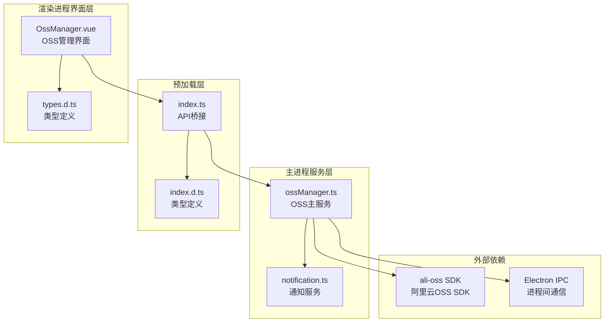
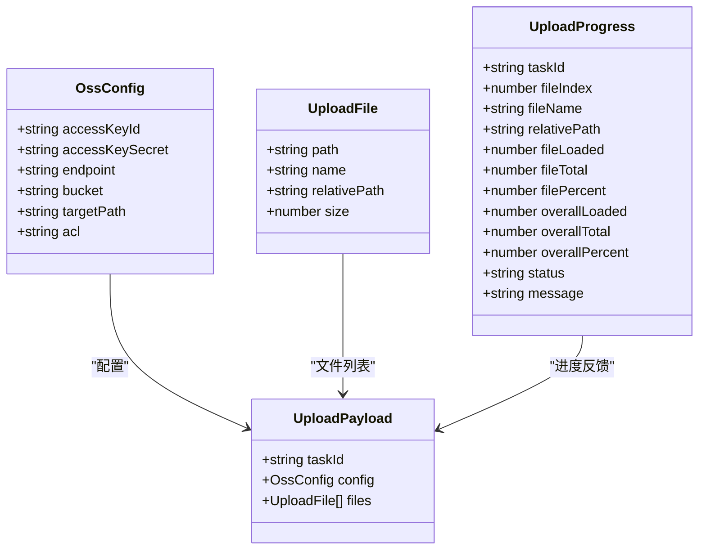
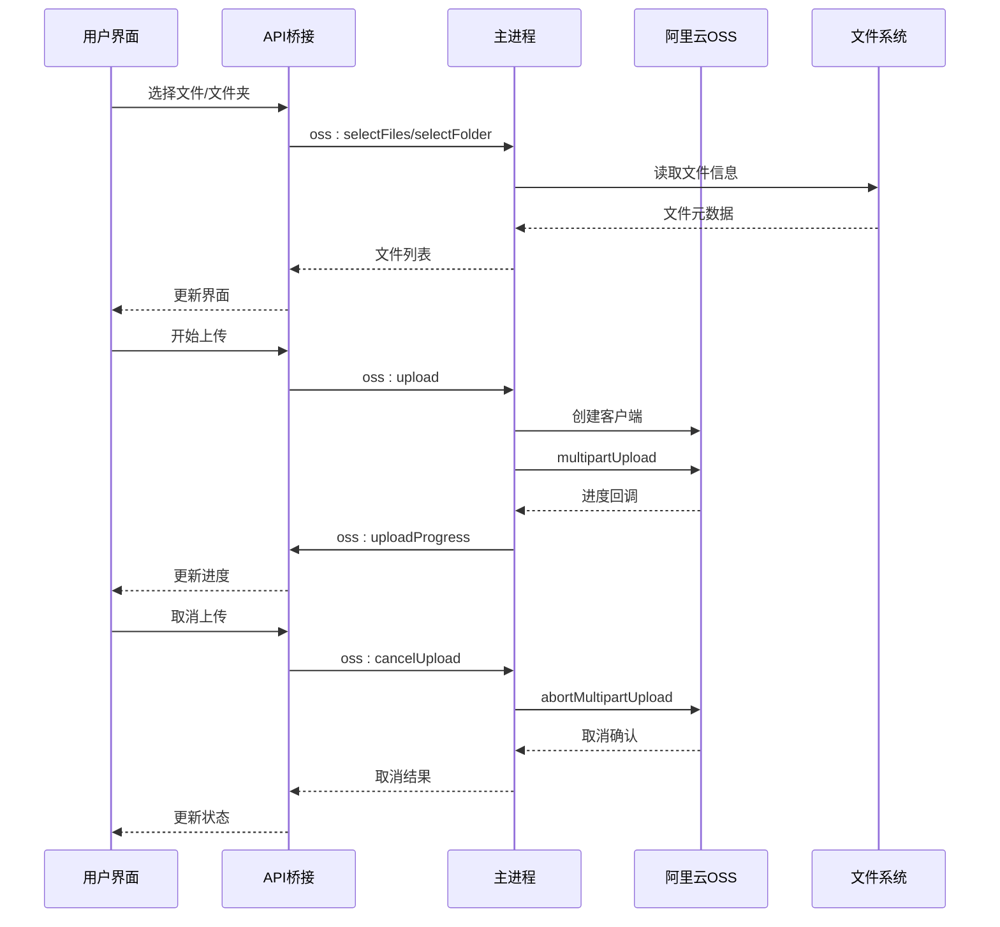
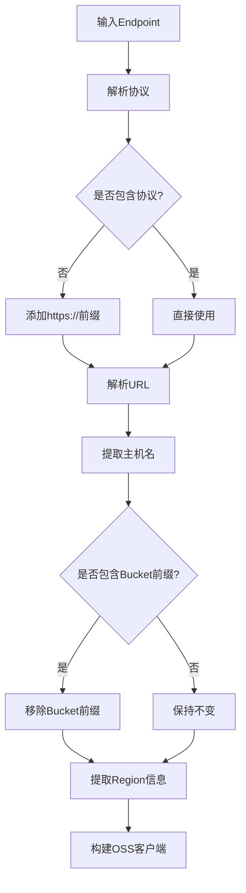
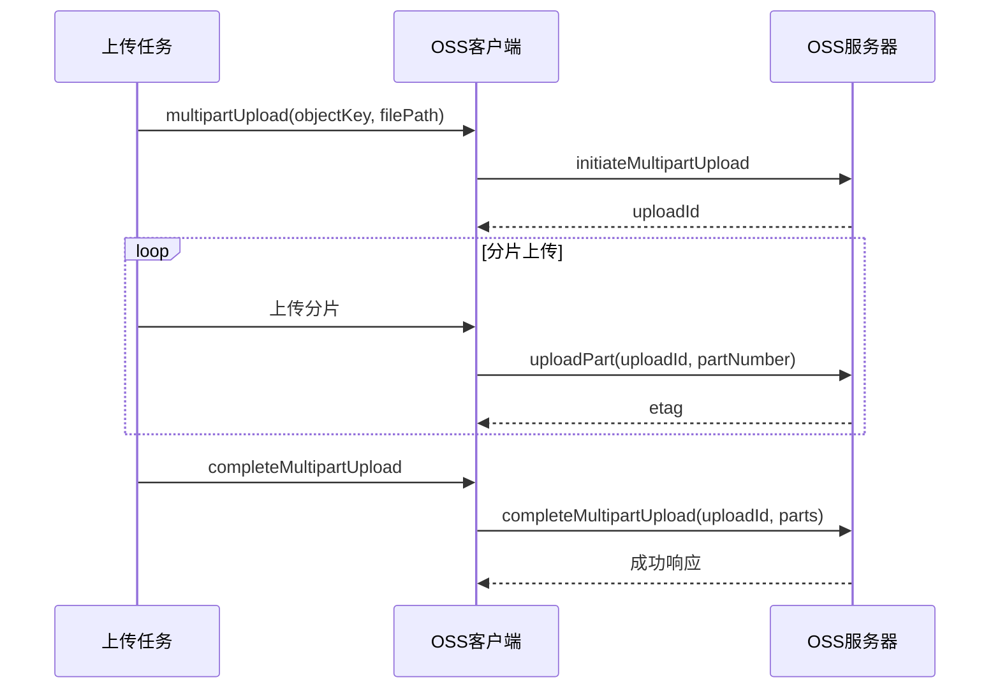
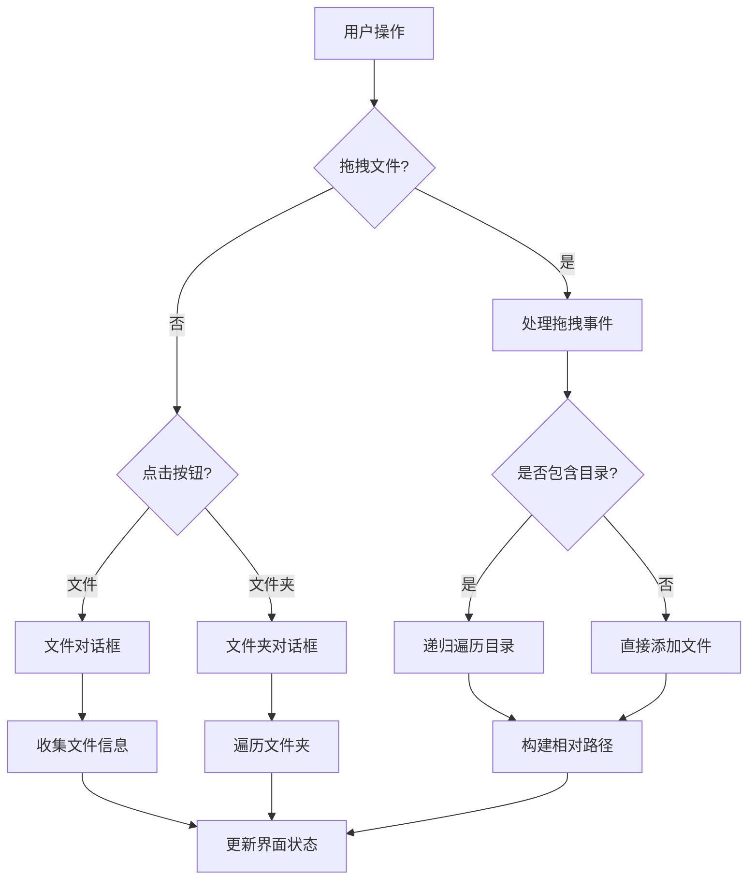
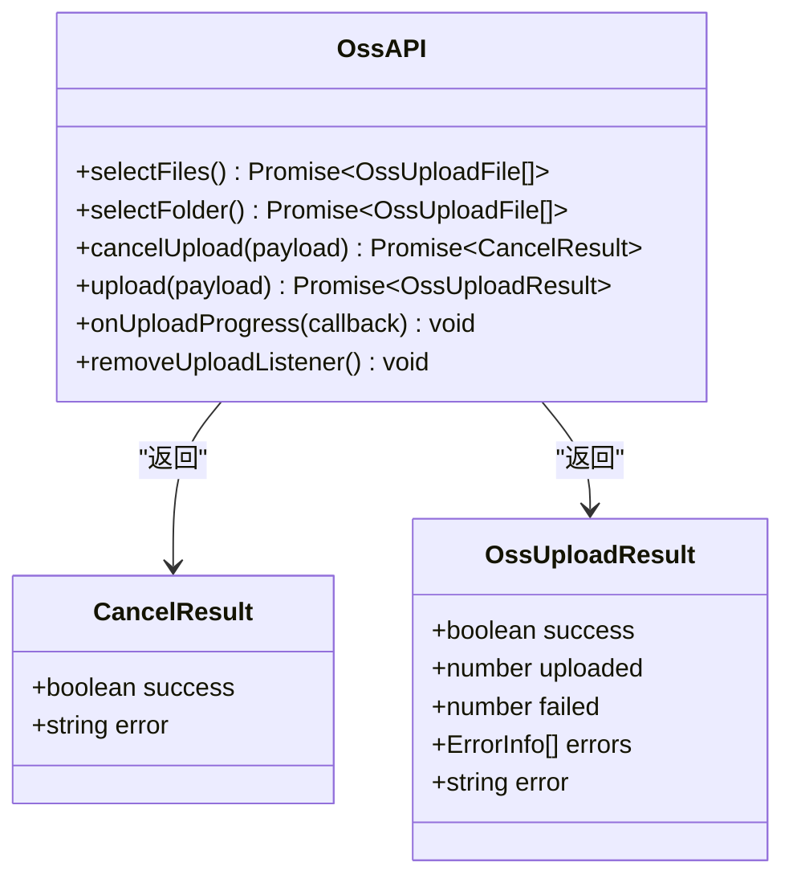
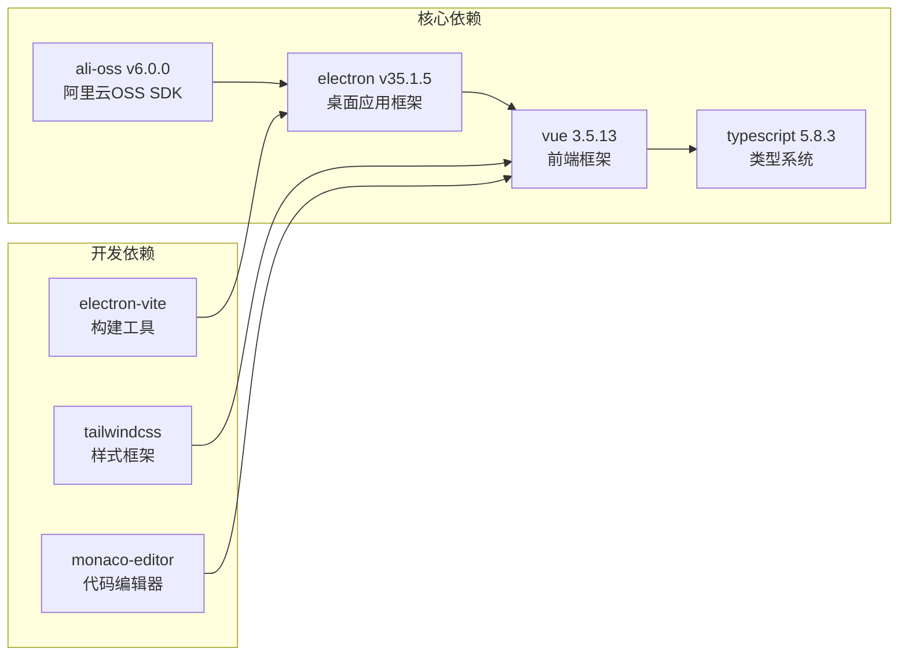
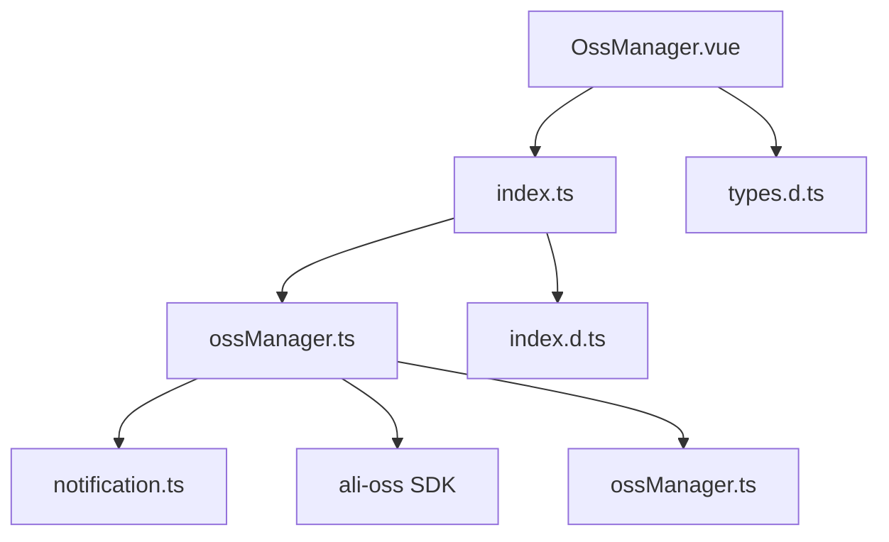
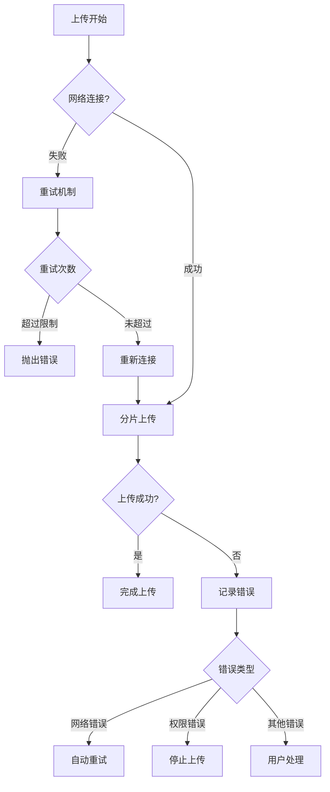

# OSS管理服务

<cite>
**本文档引用的文件**
- [ossManager.ts](file://src/main/services/ossManager.ts)
- [OssManager.vue](file://src/renderer/src/views/oss/OssManager.vue)
- [index.ts](file://src/preload/index.ts)
- [index.d.ts](file://src/preload/index.d.ts)
- [types.d.ts](file://src/renderer/src/types.d.ts)
- [package.json](file://package.json)
- [README.md](file://README.md)
</cite>

## 目录
1. [简介](#简介)
2. [项目结构](#项目结构)
3. [核心组件](#核心组件)
4. [架构概览](#架构概览)
5. [详细组件分析](#详细组件分析)
6. [依赖关系分析](#依赖关系分析)
7. [性能考虑](#性能考虑)
8. [故障排除指南](#故障排除指南)
9. [结论](#结论)
10. [附录](#附录)

## 简介

OSS管理服务是开发者工具箱中的一个核心功能模块，基于阿里云OSS SDK实现了桌面应用程序中的文件上传管理功能。该服务提供了完整的文件上传、进度监控、错误处理和用户界面集成，支持多文件并发上传、断点续传和任务取消等高级特性。

该模块采用Electron架构，通过主进程处理OSS SDK操作，渲染进程负责用户界面交互，两者通过IPC通信实现数据传递。系统集成了阿里云OSS SDK v6.0.0，支持标准的Multipart Upload机制，提供高效的文件传输能力。

## 项目结构

OSS管理服务位于项目的多模块架构中，主要涉及以下关键文件：

**图表来源**
- [ossManager.ts:1-440](file://src/main/services/ossManager.ts#L1-L440)
- [OssManager.vue:1-913](file://src/renderer/src/views/oss/OssManager.vue#L1-L913)
- [index.ts:1-229](file://src/preload/index.ts#L1-L229)

**章节来源**
- [ossManager.ts:1-440](file://src/main/services/ossManager.ts#L1-L440)
- [OssManager.vue:1-913](file://src/renderer/src/views/oss/OssManager.vue#L1-L913)
- [index.ts:1-229](file://src/preload/index.ts#L1-L229)

## 核心组件

### 主要功能模块

OSS管理服务包含以下核心组件：

1. **OSS上传服务** - 主进程中的核心业务逻辑，处理文件上传、进度监控和错误处理
2. **用户界面组件** - 渲染进程中的Vue组件，提供拖拽上传、进度显示和配置管理
3. **API桥接层** - 预加载脚本，提供安全的IPC通信接口
4. **类型定义系统** - TypeScript接口定义，确保类型安全

### 数据结构设计

系统采用以下核心数据结构：

**图表来源**
- [ossManager.ts:14-50](file://src/main/services/ossManager.ts#L14-L50)
- [types.d.ts:79-128](file://src/renderer/src/types.d.ts#L79-L128)

**章节来源**
- [ossManager.ts:14-50](file://src/main/services/ossManager.ts#L14-L50)
- [types.d.ts:79-128](file://src/renderer/src/types.d.ts#L79-L128)

## 架构概览

OSS管理服务采用分层架构设计，实现了清晰的关注点分离：

**图表来源**
- [OssManager.vue:220-278](file://src/renderer/src/views/oss/OssManager.vue#L220-L278)
- [index.ts:117-154](file://src/preload/index.ts#L117-L154)
- [ossManager.ts:296-438](file://src/main/services/ossManager.ts#L296-L438)

系统架构特点：
- **分层设计**：主进程负责业务逻辑，渲染进程负责UI交互
- **类型安全**：完整的TypeScript类型定义确保接口一致性
- **异步处理**：基于Promise和async/await的异步编程模式
- **错误隔离**：独立的错误处理机制，防止异常传播到UI层

**章节来源**
- [OssManager.vue:220-345](file://src/renderer/src/views/oss/OssManager.vue#L220-L345)
- [index.ts:117-154](file://src/preload/index.ts#L117-L154)
- [ossManager.ts:296-438](file://src/main/services/ossManager.ts#L296-L438)

## 详细组件分析

### 主进程OSS服务

主进程中的OSS服务是整个系统的中枢，负责所有OSS SDK操作和业务逻辑处理。

#### 认证配置管理

服务支持灵活的Endpoint解析和客户端构建：

**图表来源**
- [ossManager.ts:81-127](file://src/main/services/ossManager.ts#L81-L127)

#### Multipart Upload实现

系统采用阿里云OSS SDK的标准Multipart Upload机制：

**图表来源**
- [ossManager.ts:266-294](file://src/main/services/ossManager.ts#L266-L294)

#### 并发控制和进度监控

系统实现了智能的并发控制和实时进度监控：

- **分片大小**：5MB（5 * 1024 * 1024字节）
- **并发数量**：4个分片同时上传
- **进度更新**：每80毫秒更新一次，避免过度频繁的UI更新
- **内存管理**：动态计算整体进度，避免重复计算

**章节来源**
- [ossManager.ts:266-294](file://src/main/services/ossManager.ts#L266-L294)
- [ossManager.ts:229-264](file://src/main/services/ossManager.ts#L229-L264)

### 渲染进程用户界面

渲染进程提供了直观的用户界面和完整的交互体验：

#### 文件选择和拖拽上传

界面支持多种文件选择方式：

**图表来源**
- [OssManager.vue:171-209](file://src/renderer/src/views/oss/OssManager.vue#L171-L209)
- [OssManager.vue:139-151](file://src/renderer/src/views/oss/OssManager.vue#L139-L151)

#### 进度显示和状态管理

界面实现了完整的进度跟踪和状态显示：

- **文件级别进度**：每个文件的上传进度条
- **整体进度**：所有文件的累计进度
- **状态指示**：成功、失败、进行中三种状态
- **错误处理**：详细的错误信息显示

**章节来源**
- [OssManager.vue:307-345](file://src/renderer/src/views/oss/OssManager.vue#L307-L345)
- [OssManager.vue:446-485](file://src/renderer/src/views/oss/OssManager.vue#L446-L485)

### API桥接层

预加载脚本提供了安全的API桥接，确保渲染进程只能访问授权的方法：

#### 类型安全的API定义

**图表来源**
- [index.d.ts:211-218](file://src/preload/index.d.ts#L211-L218)
- [types.d.ts:117-128](file://src/renderer/src/types.d.ts#L117-L128)

**章节来源**
- [index.ts:117-154](file://src/preload/index.ts#L117-L154)
- [index.d.ts:211-218](file://src/preload/index.d.ts#L211-L218)

## 依赖关系分析

### 外部依赖

系统依赖以下关键外部库：

**图表来源**
- [package.json:28-51](file://package.json#L28-L51)

### 内部模块依赖

**图表来源**
- [OssManager.vue:1-345](file://src/renderer/src/views/oss/OssManager.vue#L1-L345)
- [index.ts:1-229](file://src/preload/index.ts#L1-L229)
- [ossManager.ts:1-440](file://src/main/services/ossManager.ts#L1-L440)

**章节来源**
- [package.json:28-51](file://package.json#L28-L51)
- [OssManager.vue:1-345](file://src/renderer/src/views/oss/OssManager.vue#L1-L345)

## 性能考虑

### 上传性能优化

系统在多个层面实现了性能优化：

1. **智能并发控制**：默认4个并发分片，平衡上传速度和资源占用
2. **分片大小优化**：5MB分片大小在小文件和大文件之间取得良好平衡
3. **进度更新节流**：80ms间隔更新，减少UI渲染压力
4. **内存管理**：动态计算整体进度，避免重复计算开销

### 错误处理和重试机制

系统实现了完善的错误处理策略：

**图表来源**
- [ossManager.ts:282-294](file://src/main/services/ossManager.ts#L282-L294)

### 资源管理

- **任务生命周期**：活动任务映射管理，避免内存泄漏
- **文件句柄管理**：及时关闭文件描述符
- **IPC通信优化**：批量发送进度更新，减少通信开销

## 故障排除指南

### 常见问题诊断

#### 认证配置问题

**症状**：连接失败，提示认证错误
**可能原因**：
- AccessKey ID/Secret错误
- Endpoint格式不正确
- Bucket名称错误

**解决方案**：
1. 验证AccessKey配置
2. 检查Endpoint格式（支持HTTP/HTTPS）
3. 确认Bucket存在且有权限

#### 上传中断问题

**症状**：上传过程中断，无法恢复
**可能原因**：
- 网络连接不稳定
- 任务被手动取消
- 服务器端异常

**解决方案**：
1. 检查网络连接稳定性
2. 查看日志中的错误信息
3. 重新开始上传任务

#### 进度显示异常

**症状**：进度条不更新或显示错误
**可能原因**：
- IPC通信异常
- 进度回调频率过高
- 文件大小计算错误

**解决方案**：
1. 检查IPC通道状态
2. 调整进度更新间隔
3. 重新计算文件大小

**章节来源**
- [ossManager.ts:178-189](file://src/main/services/ossManager.ts#L178-L189)
- [ossManager.ts:296-438](file://src/main/services/ossManager.ts#L296-L438)

### 日志和调试

系统提供了完整的日志记录机制：

- **错误日志**：详细的错误信息和堆栈跟踪
- **进度日志**：上传进度和性能指标
- **配置日志**：认证配置验证结果

## 结论

OSS管理服务是一个功能完整、架构清晰的桌面应用模块。它成功地将复杂的OSS上传功能封装为易用的桌面界面，同时保持了高性能和可靠性。

### 主要优势

1. **架构设计优秀**：分层清晰，职责明确
2. **用户体验良好**：直观的界面和实时进度反馈
3. **功能完整**：支持多文件上传、断点续传、任务取消
4. **类型安全**：完整的TypeScript类型定义
5. **性能优化**：智能并发控制和资源管理

### 改进建议

1. **增加断点续传**：虽然SDK支持，但界面层需要相应功能
2. **批量操作增强**：支持更多批量处理选项
3. **权限管理**：增加更细粒度的ACL控制
4. **生命周期配置**：支持对象过期和存储类别转换

该服务为开发者提供了一个可靠的OSS文件管理解决方案，适合各种桌面应用场景。

## 附录

### API参考

#### 主进程API

| 方法 | 参数 | 返回值 | 描述 |
|------|------|--------|------|
| oss:selectFiles | 无 | Promise<OssUploadFile[]> | 选择文件对话框 |
| oss:selectFolder | 无 | Promise<OssUploadFile[]> | 选择文件夹对话框 |
| oss:cancelUpload | {taskId: string} | Promise<CancelResult> | 取消上传任务 |
| oss:upload | UploadPayload | Promise<OssUploadResult> | 开始上传任务 |

#### 渲染进程API

| 方法 | 参数 | 返回值 | 描述 |
|------|------|--------|------|
| oss.onUploadProgress | (progress: OssUploadProgress) => void | void | 监听上传进度 |
| oss.removeUploadListener | 无 | void | 移除进度监听器 |

**章节来源**
- [index.ts:117-154](file://src/preload/index.ts#L117-L154)
- [types.d.ts:117-128](file://src/renderer/src/types.d.ts#L117-L128)

### 配置说明

#### OSS连接配置

| 配置项 | 类型 | 必填 | 默认值 | 描述 |
|--------|------|------|--------|------|
| accessKeyId | string | 是 | - | 阿里云Access Key ID |
| accessKeySecret | string | 是 | - | 阿里云Access Key Secret |
| endpoint | string | 是 | - | OSS服务Endpoint |
| bucket | string | 是 | - | 存储空间名称 |
| targetPath | string | 否 | - | 目标路径前缀 |
| acl | string | 否 | 'public-read' | 对象访问权限 |

#### 上传配置

| 配置项 | 类型 | 默认值 | 描述 |
|--------|------|--------|------|
| partSize | number | 5MB | 分片大小 |
| parallel | number | 4 | 并发分片数 |
| retryTimes | number | 3 | 重试次数 |
| timeout | number | 30000ms | 超时时间 |

### 安全考虑

1. **凭据保护**：敏感信息存储在本地，建议使用加密存储
2. **权限控制**：默认public-read权限，可根据需要调整
3. **网络传输**：使用HTTPS协议，确保数据传输安全
4. **输入验证**：对用户输入进行严格验证和过滤

### 性能优化建议

1. **分片大小调整**：根据网络环境调整分片大小
2. **并发控制**：根据系统资源调整并发数量
3. **内存管理**：及时清理已完成的任务数据
4. **网络优化**：使用CDN加速和连接池复用