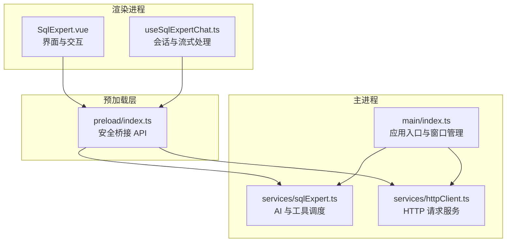
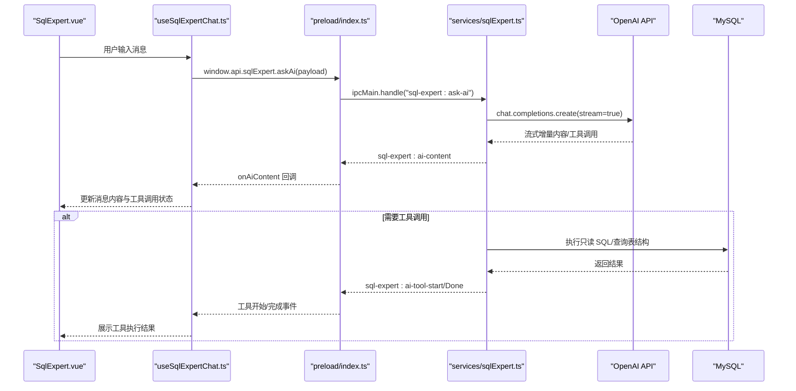
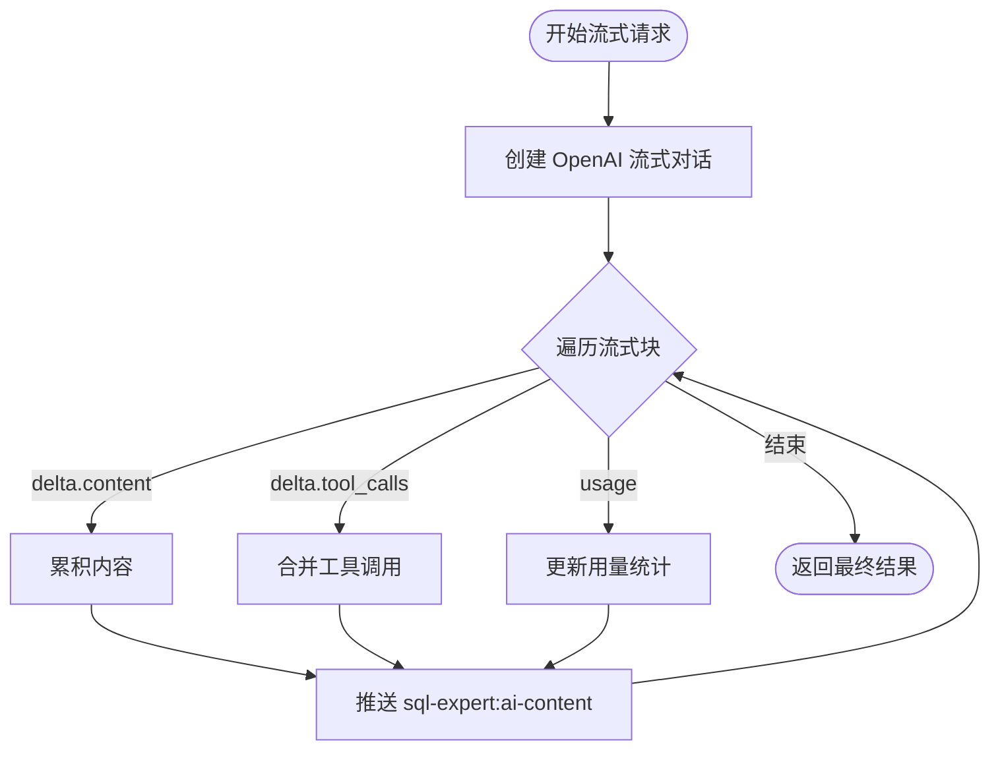
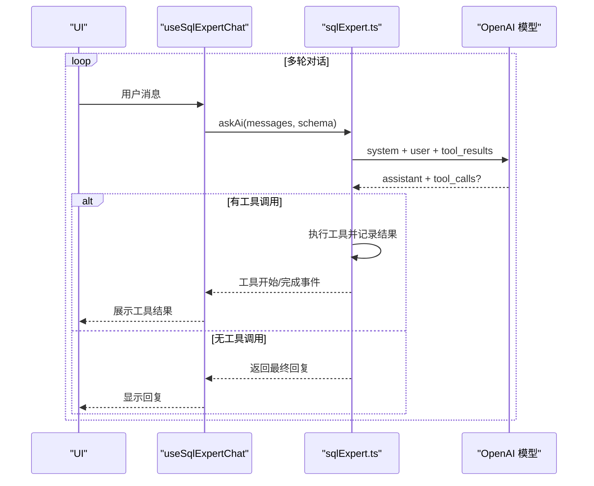
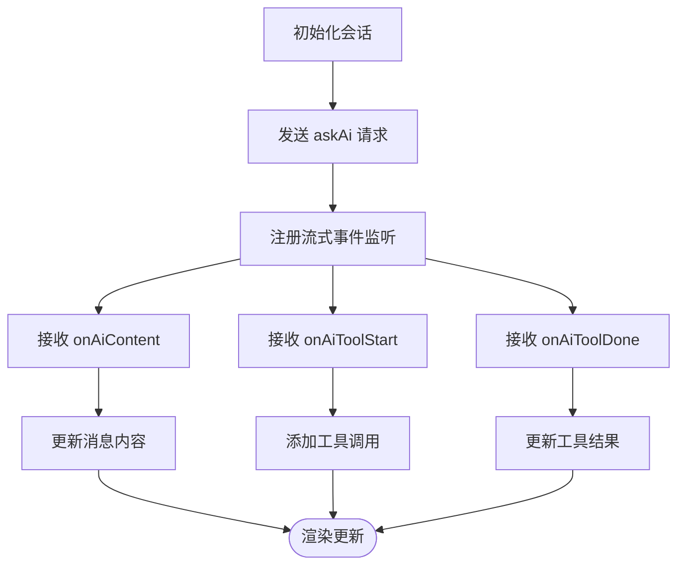
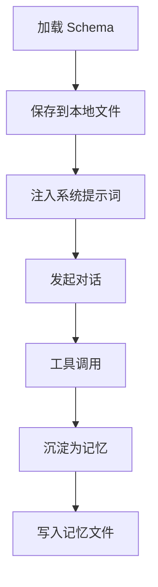
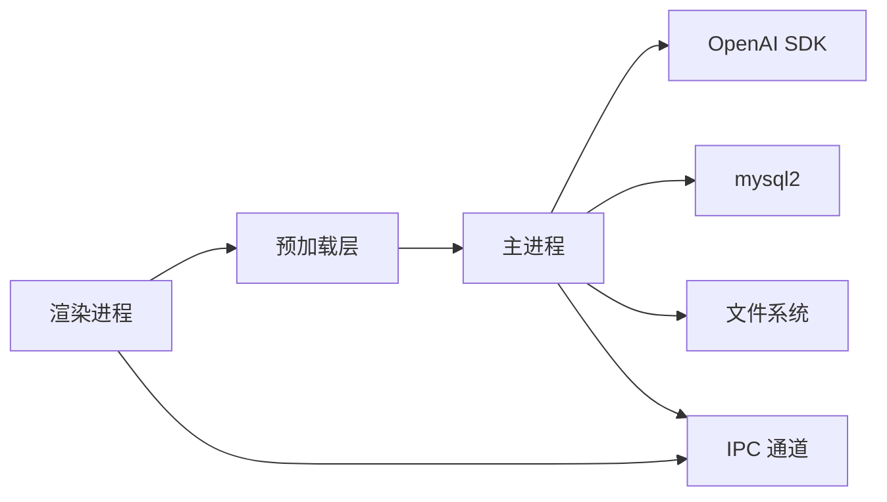

# AI集成系统

<cite>
**本文档引用的文件**
- [src/main/index.ts](file://src/main/index.ts)
- [src/main/services/sqlExpert.ts](file://src/main/services/sqlExpert.ts)
- [src/main/services/httpClient.ts](file://src/main/services/httpClient.ts)
- [src/preload/index.ts](file://src/preload/index.ts)
- [src/renderer/src/views/sqlexpert/useSqlExpertChat.ts](file://src/renderer/src/views/sqlexpert/useSqlExpertChat.ts)
- [src/renderer/src/views/sqlexpert/SqlExpert.vue](file://src/renderer/src/views/sqlexpert/SqlExpert.vue)
- [package.json](file://package.json)
- [README.md](file://README.md)
</cite>

## 目录
1. [简介](#简介)
2. [项目结构](#项目结构)
3. [核心组件](#核心组件)
4. [架构总览](#架构总览)
5. [详细组件分析](#详细组件分析)
6. [依赖关系分析](#依赖关系分析)
7. [性能考虑](#性能考虑)
8. [故障排除指南](#故障排除指南)
9. [结论](#结论)
10. [附录](#附录)

## 简介
本项目是一个基于 Electron + Vue 3 + TypeScript 的桌面应用，集成了企业级分析专家（SQL Expert）功能，通过 OpenAI API 提供多轮对话、工具调用与流式响应能力。系统围绕“数据库 + 大模型”的协作模式设计，支持：
- OpenAI API 集成（流式响应、工具调用、用量统计）
- 数据库 Schema 动态加载与只读 SQL 校验
- 本地记忆（memories）持久化与增量沉淀
- 流式进度推送与多轮对话管理
- 余额查询与成本估算
- 代理配置与网络异常处理

## 项目结构
项目采用 Electron 主进程 + 渲染进程的双进程架构，核心模块分布如下：
- 主进程：负责数据库连接池、OpenAI API 调用、工具调度、内存与 Schema 持久化、IPC 服务注册
- 渲染进程：负责 UI 交互、会话管理、流式进度展示、工具调用可视化
- 预加载层：安全暴露 IPC API 给渲染进程

**图表来源**
- [src/renderer/src/views/sqlexpert/SqlExpert.vue](file://src/renderer/src/views/sqlexpert/SqlExpert.vue)
- [src/renderer/src/views/sqlexpert/useSqlExpertChat.ts](file://src/renderer/src/views/sqlexpert/useSqlExpertChat.ts)
- [src/preload/index.ts](file://src/preload/index.ts)
- [src/main/index.ts](file://src/main/index.ts)
- [src/main/services/sqlExpert.ts](file://src/main/services/sqlExpert.ts)
- [src/main/services/httpClient.ts](file://src/main/services/httpClient.ts)

**章节来源**
- [README.md:1-163](file://README.md#L1-L163)
- [package.json:1-120](file://package.json#L1-L120)

## 核心组件
- OpenAI API 集成：主进程通过 OpenAI SDK 发起流式对话，实时推送内容与工具调用进度
- 工具定义与调度：内置数据库查询、表结构查询、图表渲染、数据导出、记忆沉淀等工具
- 会话与流式处理：渲染进程维护会话历史，接收主进程推送的流式内容与工具调用状态
- Schema 与记忆：动态加载数据库 Schema 并持久化至本地，支持增量沉淀为可复用记忆
- 余额与用量：查询账户余额并估算成本，支持按 token 统计

**章节来源**
- [src/main/services/sqlExpert.ts:473-572](file://src/main/services/sqlExpert.ts#L473-L572)
- [src/main/services/sqlExpert.ts:676-739](file://src/main/services/sqlExpert.ts#L676-L739)
- [src/renderer/src/views/sqlexpert/useSqlExpertChat.ts:282-420](file://src/renderer/src/views/sqlexpert/useSqlExpertChat.ts#L282-L420)

## 架构总览
系统采用“主进程服务 + 渲染进程 UI”的分层架构，通过 IPC 实现双向通信。主进程负责：
- 数据库连接池与只读 SQL 校验
- OpenAI API 流式对话与工具调用
- Schema 与记忆的本地持久化
- 余额查询与用量统计

渲染进程负责：
- 会话与消息管理
- 流式内容与工具调用可视化
- 设置面板与文件导出

**图表来源**
- [src/renderer/src/views/sqlexpert/useSqlExpertChat.ts:362-420](file://src/renderer/src/views/sqlexpert/useSqlExpertChat.ts#L362-L420)
- [src/preload/index.ts:156-212](file://src/preload/index.ts#L156-L212)
- [src/main/services/sqlExpert.ts:1280-1501](file://src/main/services/sqlExpert.ts#L1280-L1501)

## 详细组件分析

### OpenAI API 集成与流式响应
- 流式创建：主进程使用 OpenAI SDK 创建流式对话，启用 include_usage 以获取 token 使用情况
- 增量推送：逐块处理 choices.delta，实时合并内容并通过 IPC 推送给渲染进程
- 工具调用解析：将 tool_calls 的增量拼接为完整函数调用，支持多工具并行
- 中断控制：通过 AbortController 支持取消请求

**图表来源**
- [src/main/services/sqlExpert.ts:676-739](file://src/main/services/sqlExpert.ts#L676-L739)

**章节来源**
- [src/main/services/sqlExpert.ts:676-739](file://src/main/services/sqlExpert.ts#L676-L739)
- [src/main/services/sqlExpert.ts:1280-1501](file://src/main/services/sqlExpert.ts#L1280-L1501)

### 工具定义与函数调用协议
系统定义了以下工具，均通过函数调用协议实现：
- query_database：执行只读 SQL，限制为 SELECT 或 WITH...SELECT，输出列必须使用 AS 指定表头
- describe_table_schema：查询一个或多个表的字段结构
- render_chart：根据真实查询结果绘制图表（line/bar/pie/line_bar）
- export_data：导出完整结果为 CSV 文件
- save_memory：保存可复用经验到本地记忆文件

工具参数校验与结果摘要：
- 参数校验：对 SQL 语法、关键字、通配符、表名合法性进行严格校验
- 结果摘要：将工具执行结果序列化为简洁摘要，便于模型二次推理

**章节来源**
- [src/main/services/sqlExpert.ts:473-572](file://src/main/services/sqlExpert.ts#L473-L572)
- [src/main/services/sqlExpert.ts:836-951](file://src/main/services/sqlExpert.ts#L836-L951)

### 多轮对话与上下文管理
- 系统提示词构建：结合当前 Schema、历史记忆与动态时间，生成严格的系统提示词
- 消息转换：将 UI 消息转换为模型消息，过滤 loading/error 状态消息，保留工具调用与结果
- 多轮循环：最大轮次限制为 15，每轮根据工具调用结果动态扩展上下文

**图表来源**
- [src/renderer/src/views/sqlexpert/useSqlExpertChat.ts:362-420](file://src/renderer/src/views/sqlexpert/useSqlExpertChat.ts#L362-L420)
- [src/main/services/sqlExpert.ts:1280-1501](file://src/main/services/sqlExpert.ts#L1280-L1501)

**章节来源**
- [src/main/services/sqlExpert.ts:437-471](file://src/main/services/sqlExpert.ts#L437-L471)
- [src/main/services/sqlExpert.ts:598-651](file://src/main/services/sqlExpert.ts#L598-L651)
- [src/main/services/sqlExpert.ts:1280-1501](file://src/main/services/sqlExpert.ts#L1280-L1501)

### 会话管理与流式进度
- 会话持久化：使用 localStorage 存储会话列表，清理大数据字段以减少体积
- 流式进度：渲染进程注册 onAiContent/onAiToolStart/onAiToolDone 事件，实时更新消息与工具调用状态
- 停止生成：通过 cancelAskAi 取消当前请求，清理事件监听

**图表来源**
- [src/renderer/src/views/sqlexpert/useSqlExpertChat.ts:282-420](file://src/renderer/src/views/sqlexpert/useSqlExpertChat.ts#L282-L420)

**章节来源**
- [src/renderer/src/views/sqlexpert/useSqlExpertChat.ts:104-135](file://src/renderer/src/views/sqlexpert/useSqlExpertChat.ts#L104-L135)
- [src/renderer/src/views/sqlexpert/useSqlExpertChat.ts:282-420](file://src/renderer/src/views/sqlexpert/useSqlExpertChat.ts#L282-L420)

### Schema 与记忆系统
- Schema 动态加载：从 information_schema 查询表名与注释，生成与项目一致的文本格式
- 记忆持久化：按数据库名与 API Key 组合生成作用域，将记忆保存为 JSON 文件，支持手动与自动沉淀
- 记忆检索：在系统提示词中注入历史记忆，提升上下文一致性

**图表来源**
- [src/main/services/sqlExpert.ts:1158-1212](file://src/main/services/sqlExpert.ts#L1158-L1212)
- [src/main/services/sqlExpert.ts:172-264](file://src/main/services/sqlExpert.ts#L172-L264)
- [src/main/services/sqlExpert.ts:437-471](file://src/main/services/sqlExpert.ts#L437-L471)

**章节来源**
- [src/main/services/sqlExpert.ts:1158-1212](file://src/main/services/sqlExpert.ts#L1158-L1212)
- [src/main/services/sqlExpert.ts:172-264](file://src/main/services/sqlExpert.ts#L172-L264)

### API 接口文档
- 认证方式：通过 API Key 进行认证，余额查询使用 Authorization: Bearer
- 请求格式：JSON，包含消息数组、Schema 文本、可选工具定义与选择策略
- 错误处理：主进程捕获异常并返回结构化错误信息，渲染进程展示友好提示

常用 IPC 接口（路径与参数）：
- sql-expert:ask-ai
  - 请求：{ requestId?, messages: Array, schema: string, tools?, toolChoice? }
  - 响应：{ success: boolean, requestId?, reply?, toolCalls?, usage?, status? }
- sql-expert:cancel-ask-ai
  - 请求：{ requestId: string }
  - 响应：{ success: boolean, message? }
- sql-expert:check-balance
  - 请求：{ url?, apiKey? }
  - 响应：{ success: boolean, message? }
- sql-expert:load-schema
  - 请求：{ host, port, user, password, database }?
  - 响应：{ success: boolean, schema?, tableCount?, schemaPath?, memories?, memoryPath?, memoryScope? }
- sql-expert:load-memories
  - 请求：{ database?, apiKey? }
  - 响应：{ success: boolean, memories, memoryPath, memoryScope, memoryCount }
- sql-expert:update-memory / delete-memory / add-memory
  - 请求：{ memoryId?, content?, database?, apiKey? }
  - 响应：{ success: boolean, memories, memoryPath, memoryScope, memoryCount }

**章节来源**
- [src/preload/index.ts:156-212](file://src/preload/index.ts#L156-L212)
- [src/main/services/sqlExpert.ts:968-1501](file://src/main/services/sqlExpert.ts#L968-L1501)

## 依赖关系分析
- Electron 主进程：负责数据库连接池、OpenAI SDK、文件系统与 IPC 服务
- 渲染进程：负责 UI、会话管理与流式事件处理
- 预加载层：统一暴露安全 API，避免直接访问主进程敏感对象
- 第三方依赖：OpenAI SDK、mysql2、axios、electron-updater 等

**图表来源**
- [src/preload/index.ts:156-212](file://src/preload/index.ts#L156-L212)
- [src/main/services/sqlExpert.ts:968-1501](file://src/main/services/sqlExpert.ts#L968-L1501)
- [package.json:28-51](file://package.json#L28-L51)

**章节来源**
- [package.json:28-51](file://package.json#L28-L51)

## 性能考虑
- 连接池与超时：数据库连接池限制并发，SQL 查询超时控制在 60 秒，防止阻塞
- 流式增量：仅累积必要的文本增量，避免一次性拼接大量字符串
- 用量统计：启用 include_usage 获取 prompt/completion/token 细分统计，便于成本估算
- 本地缓存：Schema 与记忆文件本地缓存，减少重复加载
- UI 优化：会话持久化时清理大数据字段，降低内存占用

**章节来源**
- [src/main/services/sqlExpert.ts:404-435](file://src/main/services/sqlExpert.ts#L404-L435)
- [src/main/services/sqlExpert.ts:824-834](file://src/main/services/sqlExpert.ts#L824-L834)
- [src/main/services/sqlExpert.ts:686-692](file://src/main/services/sqlExpert.ts#L686-L692)
- [src/renderer/src/views/sqlexpert/useSqlExpertChat.ts:104-121](file://src/renderer/src/views/sqlexpert/useSqlExpertChat.ts#L104-L121)

## 故障排除指南
- 网络与代理
  - 应用支持设置代理，自动更新与 HTTP 请求均会使用代理配置
  - 更新失败时根据错误类型提示网络问题并引导配置代理
- 数据库连接
  - 提供测试连接功能，失败时返回具体错误信息
  - Schema 加载失败时检查数据库名与权限
- OpenAI API
  - 余额查询失败时检查 API Key 有效性与网络连通性
  - 流式响应中断可通过取消请求恢复
- 工具调用
  - SQL 校验失败时根据提示修正语法与关键字
  - 图表参数校验失败时检查 series 与 xAxisData

**章节来源**
- [src/main/index.ts:306-327](file://src/main/index.ts#L306-L327)
- [src/main/services/sqlExpert.ts:969-991](file://src/main/services/sqlExpert.ts#L969-L991)
- [src/main/services/sqlExpert.ts:1158-1212](file://src/main/services/sqlExpert.ts#L1158-L1212)
- [src/main/services/sqlExpert.ts:1005-1057](file://src/main/services/sqlExpert.ts#L1005-L1057)
- [src/main/services/sqlExpert.ts:844-859](file://src/main/services/sqlExpert.ts#L844-L859)

## 结论
本系统通过主进程服务与渲染进程 UI 的清晰分工，实现了稳定可靠的 AI 集成体验。OpenAI API 的流式响应与工具调用机制、数据库 Schema 与记忆的本地化管理，以及完善的错误处理与性能优化策略，共同构成了一个可扩展的企业级分析助手。未来可在限流控制、成本阈值告警、并发请求队列等方面进一步增强。

## 附录
- 配置说明
  - 数据库：支持主机、端口、用户名、密码、数据库名
  - AI：支持 URL、API Key、模型名
  - 代理：支持 HTTP/HTTPS 代理配置
- 常用命令
  - 开发：npm run dev
  - 构建：npm run build
  - 打包：npm run build:win / build:mac / build:linux

**章节来源**
- [README.md:116-163](file://README.md#L116-L163)
- [package.json:12-27](file://package.json#L12-L27)