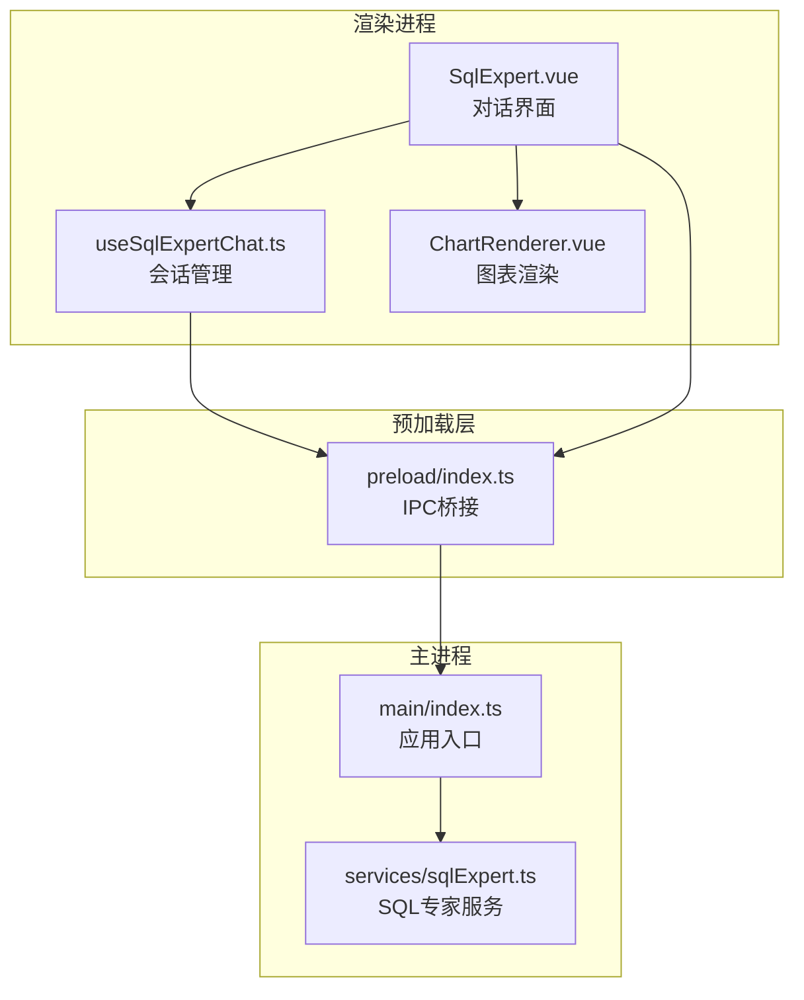
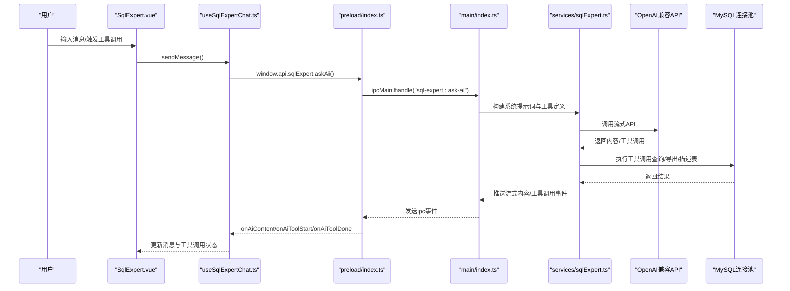
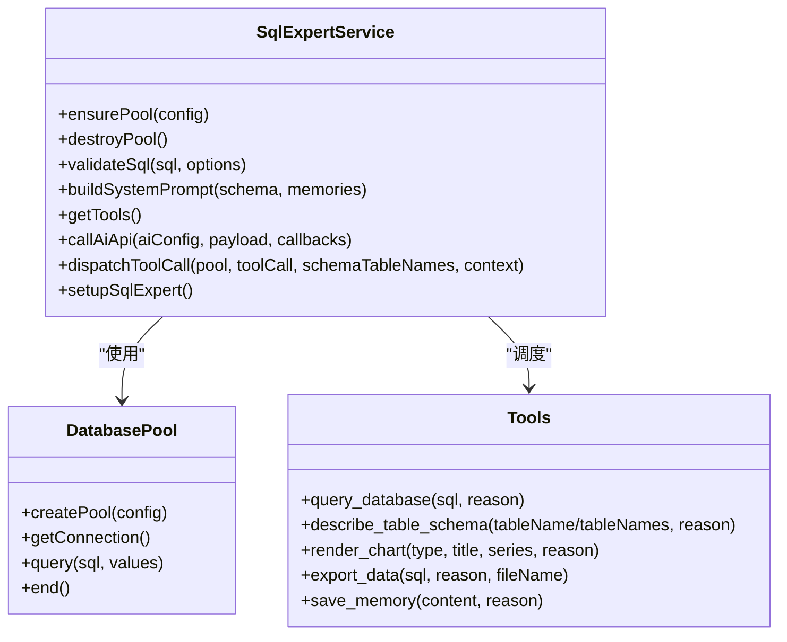
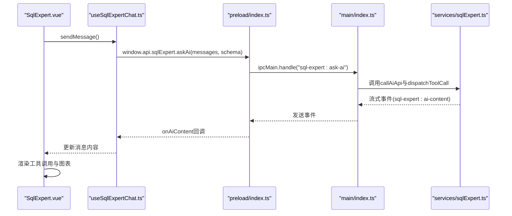
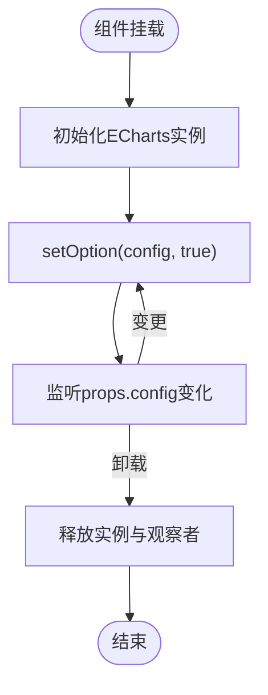
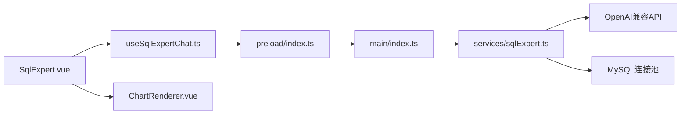

# SQL专家服务

<cite>
**本文档引用的文件**
- [sqlExpert.ts](file://src/main/services/sqlExpert.ts)
- [SqlExpert.vue](file://src/renderer/src/views/sqlexpert/SqlExpert.vue)
- [useSqlExpertChat.ts](file://src/renderer/src/views/sqlexpert/useSqlExpertChat.ts)
- [ChartRenderer.vue](file://src/renderer/src/views/sqlexpert/ChartRenderer.vue)
- [index.ts](file://src/main/index.ts)
- [index.ts](file://src/preload/index.ts)
- [index.d.ts](file://src/preload/index.d.ts)
- [package.json](file://package.json)
</cite>

## 目录
1. [简介](#简介)
2. [项目结构](#项目结构)
3. [核心组件](#核心组件)
4. [架构总览](#架构总览)
5. [详细组件分析](#详细组件分析)
6. [依赖关系分析](#依赖关系分析)
7. [性能考量](#性能考量)
8. [故障排查指南](#故障排查指南)
9. [结论](#结论)
10. [附录](#附录)

## 简介
SQL专家服务是一个基于Electron的桌面应用，提供AI驱动的企业级SQL分析能力。系统通过OpenAI兼容的API进行智能对话，结合MySQL数据库连接池实现只读查询、Schema动态生成、工具调用（数据库查询、表结构查询、图表渲染、数据导出、记忆沉淀）等功能。前端采用Vue3 + ECharts实现流畅的对话体验与可视化展示，支持多轮对话、流式响应、会话状态管理与本地记忆系统。

## 项目结构
项目采用Electron主进程+渲染进程的双层架构：
- 主进程负责数据库连接池管理、AI请求、工具调度、文件系统持久化（配置、Schema、记忆、导出文件）。
- 渲染进程负责UI交互、对话管理、图表渲染、Markdown渲染与本地状态持久化（会话历史）。

**图表来源**
- [index.ts:110-174](file://src/main/index.ts#L110-L174)
- [index.ts:156-212](file://src/preload/index.ts#L156-L212)
- [sqlExpert.ts:968-1501](file://src/main/services/sqlExpert.ts#L968-L1501)

**章节来源**
- [index.ts:110-174](file://src/main/index.ts#L110-L174)
- [index.ts:156-212](file://src/preload/index.ts#L156-L212)
- [package.json:28-51](file://package.json#L28-L51)

## 核心组件
- SQL专家服务（主进程）：负责数据库连接池、AI请求（OpenAI兼容）、工具调度（query_database、describe_table_schema、render_chart、export_data、save_memory）、Schema动态生成、本地记忆管理、CSV导出、余额查询、IPC注册。
- 会话管理（渲染进程）：负责多轮对话、流式进度监听、消息构建、工具调用结果展示、会话历史持久化、停止生成、重新生成。
- 图表渲染（渲染进程）：基于ECharts的轻量封装，支持响应式尺寸与配置变更。
- 预加载层（preload）：暴露受控的IPC API给渲染进程，统一类型声明与事件监听。

**章节来源**
- [sqlExpert.ts:402-471](file://src/main/services/sqlExpert.ts#L402-L471)
- [useSqlExpertChat.ts:165-507](file://src/renderer/src/views/sqlexpert/useSqlExpertChat.ts#L165-L507)
- [ChartRenderer.vue:1-66](file://src/renderer/src/views/sqlexpert/ChartRenderer.vue#L1-L66)
- [index.ts:156-212](file://src/preload/index.ts#L156-L212)

## 架构总览
系统采用“对话-工具-数据库”的闭环架构：
- 用户通过渲染进程发起对话与工具调用请求。
- 预加载层将请求转发至主进程IPC处理。
- 主进程构建系统提示词与工具定义，调用OpenAI兼容API获取回复与工具调用指令。
- 主进程根据工具指令执行数据库查询、Schema查询、图表配置生成、CSV导出、记忆写入等操作。
- 主进程通过流式事件向渲染进程推送内容与工具调用进度，渲染进程实时更新UI。

**图表来源**
- [useSqlExpertChat.ts:282-420](file://src/renderer/src/views/sqlexpert/useSqlExpertChat.ts#L282-L420)
- [index.ts:196-211](file://src/preload/index.ts#L196-L211)
- [sqlExpert.ts:1280-1501](file://src/main/services/sqlExpert.ts#L1280-L1501)

## 详细组件分析

### 主进程服务：SQL专家服务
- 数据库连接管理
  - 使用mysql2/promise创建连接池，限制并发与队列长度，设置连接超时。
  - 支持动态重建连接池（配置变更后销毁旧池）。
- SQL校验
  - 严格限制为只读查询（SELECT/ WITH），禁止DDL/DML/系统库访问，强制列别名，防止SELECT *。
- Schema动态生成
  - 从information_schema读取表名与注释，生成与项目一致的文本格式，缓存于内存与磁盘。
- 工具调度
  - query_database：执行只读SQL，限制返回行数，支持超时。
  - describe_table_schema：查询表字段结构，支持多表。
  - render_chart：根据series与xAxisData生成ECharts配置。
  - export_data：执行SQL并导出CSV文件，自动命名与路径管理。
  - save_memory：将经验沉淀为本地JSON记忆文件。
- 对话与流式响应
  - 构建系统提示词，注册工具定义，调用OpenAI兼容API，流式推送内容与工具调用事件。
  - 支持最大轮次限制与请求取消（AbortController）。
- 余额查询
  - 通过用户余额接口查询可用余额与货币信息。
- IPC注册
  - 提供测试数据库、保存配置、加载配置、加载Schema、加载/更新/删除/新增记忆、描述表、执行SQL、取消AI请求、AI对话等接口。

**图表来源**
- [sqlExpert.ts:402-471](file://src/main/services/sqlExpert.ts#L402-L471)
- [sqlExpert.ts:741-951](file://src/main/services/sqlExpert.ts#L741-L951)
- [sqlExpert.ts:968-1501](file://src/main/services/sqlExpert.ts#L968-L1501)

**章节来源**
- [sqlExpert.ts:402-471](file://src/main/services/sqlExpert.ts#L402-L471)
- [sqlExpert.ts:741-951](file://src/main/services/sqlExpert.ts#L741-L951)
- [sqlExpert.ts:968-1501](file://src/main/services/sqlExpert.ts#L968-L1501)

### 渲染进程：会话管理与UI
- 会话管理
  - 创建/选择/删除会话，构建消息结构，持久化到localStorage（清理大数据字段）。
  - 流式事件监听：onAiContent、onAiToolStart、onAiToolDone，实时更新消息与工具调用状态。
  - 支持停止生成、重新生成、复制文本、打开导出文件。
- 对话界面
  - 支持Markdown渲染、工具调用分段显示、展开/折叠工具详情、图表渲染组件集成。
  - 顶部工具栏显示余额、Schema状态、设置入口。
- 记忆管理
  - 本地记忆文件按数据库与API Key哈希命名，支持新增、更新、删除、刷新。
- 图表渲染
  - 基于ECharts，自动监听容器尺寸变化并重绘。

**图表来源**
- [SqlExpert.vue:494-517](file://src/renderer/src/views/sqlexpert/SqlExpert.vue#L494-L517)
- [useSqlExpertChat.ts:282-420](file://src/renderer/src/views/sqlexpert/useSqlExpertChat.ts#L282-L420)
- [index.ts:196-211](file://src/preload/index.ts#L196-L211)

**章节来源**
- [SqlExpert.vue:1-800](file://src/renderer/src/views/sqlexpert/SqlExpert.vue#L1-L800)
- [useSqlExpertChat.ts:165-507](file://src/renderer/src/views/sqlexpert/useSqlExpertChat.ts#L165-L507)
- [ChartRenderer.vue:1-66](file://src/renderer/src/views/sqlexpert/ChartRenderer.vue#L1-L66)

### 图表渲染组件
- 依赖ECharts，初始化时自动监听容器尺寸变化，配置变更时深度对比并重绘。
- 提供高度可配置的渲染容器，适合嵌入工具调用结果展示。

**图表来源**
- [ChartRenderer.vue:23-57](file://src/renderer/src/views/sqlexpert/ChartRenderer.vue#L23-L57)

**章节来源**
- [ChartRenderer.vue:1-66](file://src/renderer/src/views/sqlexpert/ChartRenderer.vue#L1-L66)

## 依赖关系分析
- 外部依赖
  - OpenAI兼容API：用于对话与工具调用推理。
  - mysql2：MySQL连接池与查询执行。
  - echarts：图表渲染。
  - electron、@electron-toolkit：Electron框架与工具。
- 内部模块耦合
  - 渲染进程通过preload暴露的API与主进程通信，主进程集中处理数据库与AI逻辑，降低渲染进程复杂度。
  - 会话管理与UI解耦，便于扩展其他视图。

**图表来源**
- [index.ts:421-428](file://src/main/index.ts#L421-L428)
- [index.ts:156-212](file://src/preload/index.ts#L156-L212)
- [sqlExpert.ts:968-1501](file://src/main/services/sqlExpert.ts#L968-L1501)

**章节来源**
- [package.json:28-51](file://package.json#L28-L51)
- [index.ts:421-428](file://src/main/index.ts#L421-L428)

## 性能考量
- 数据库查询
  - 连接池并发限制与队列长度控制，避免过载。
  - 查询超时（默认60秒），防止长时间阻塞。
  - 工具返回行数限制（默认10行），减少传输与渲染压力。
- AI请求
  - 流式响应，逐步推送内容与工具调用事件，提升感知速度。
  - 最大轮次限制（默认15轮），避免无限循环。
  - 使用AbortController支持请求取消，快速释放资源。
- 本地存储
  - 会话持久化时清理大数据字段（rows），减少localStorage体积。
  - Schema与记忆文件按数据库与API Key哈希命名，避免冲突。
- 图表渲染
  - ECharts实例复用与深度配置对比，减少不必要的重绘。
  - ResizeObserver监听容器尺寸变化，避免手动触发重绘。

[本节为通用性能建议，无需特定文件引用]

## 故障排查指南
- 数据库连接失败
  - 使用“测试链接”按钮验证主机、端口、账号、密码与数据库名。
  - 检查防火墙与网络代理设置。
- AI请求失败
  - 确认AI URL、API Key与模型配置正确。
  - 检查网络连通性与代理设置。
  - 查看余额接口返回，确认账户可用性。
- 工具调用异常
  - query_database：检查SQL是否符合只读规则与列别名要求。
  - describe_table_schema：确认表名存在于Schema中。
  - export_data：确认SQL可执行且结果集较小，避免过大CSV导出。
- 图表渲染异常
  - 确认series与xAxisData格式正确，类型匹配。
  - 检查容器尺寸与ECharts初始化状态。
- 会话与记忆
  - 清理localStorage中的会话数据，重新加载Schema与记忆。
  - 检查记忆文件路径与权限。

**章节来源**
- [SqlExpert.vue:250-256](file://src/renderer/src/views/sqlexpert/SqlExpert.vue#L250-L256)
- [sqlExpert.ts:970-991](file://src/main/services/sqlExpert.ts#L970-L991)
- [sqlExpert.ts:1005-1057](file://src/main/services/sqlExpert.ts#L1005-L1057)
- [ChartRenderer.vue:33-57](file://src/renderer/src/views/sqlexpert/ChartRenderer.vue#L33-L57)

## 结论
SQL专家服务通过清晰的主/渲染分层、严格的SQL校验、完善的工具调度与流式响应机制，实现了企业级的AI驱动SQL分析体验。配合本地记忆与图表渲染，满足从数据查询、分析到可视化与导出的全链路需求。建议在生产环境中加强网络代理与安全策略配置，并持续监控AI用量与数据库负载。

[本节为总结性内容，无需特定文件引用]

## 附录

### API接口文档（IPC与预加载）
- 数据库与配置
  - testDb(config)：测试数据库连接
  - saveConfig(config)：保存数据库与AI配置
  - loadConfig()：加载配置、Schema与记忆
  - loadSchema(dbConfig?)：动态加载数据库Schema
  - describeTable(tableNames)：查询表字段结构
- 对话与工具
  - askAi(payload)：发起AI对话（支持工具调用）
  - cancelAskAi(payload)：取消AI请求
  - onAiContent(cb)：监听流式内容
  - onAiToolStart(cb)：监听工具调用开始
  - onAiToolDone(cb)：监听工具调用完成
  - removeAiListeners()：移除所有AI事件监听
- 数据与记忆
  - executeSql(sql)：执行只读SQL
  - loadMemories(payload?)：加载本地记忆
  - updateMemory(payload)：更新记忆
  - deleteMemory(payload)：删除记忆
  - addMemory(payload)：新增手动记忆
- 其他
  - checkBalance(config?)：查询余额

**章节来源**
- [index.ts:156-212](file://src/preload/index.ts#L156-L212)
- [index.d.ts:274-372](file://src/preload/index.d.ts#L274-L372)
- [sqlExpert.ts:968-1278](file://src/main/services/sqlExpert.ts#L968-L1278)