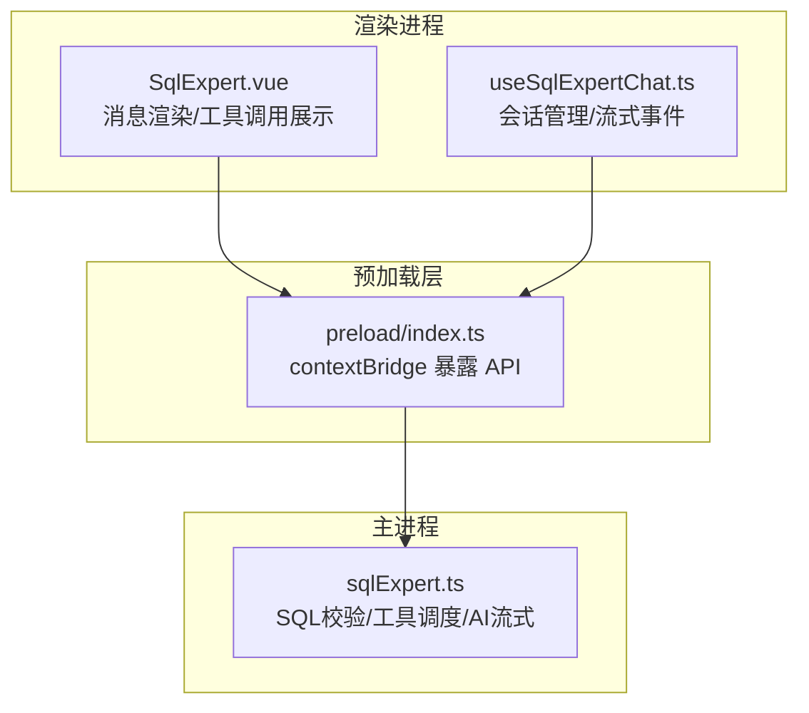
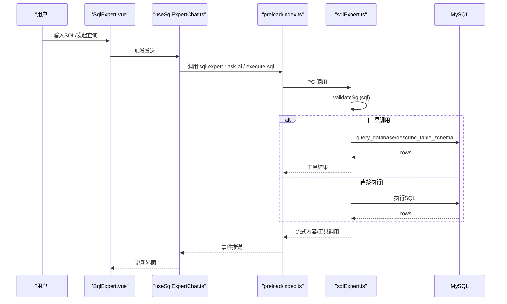
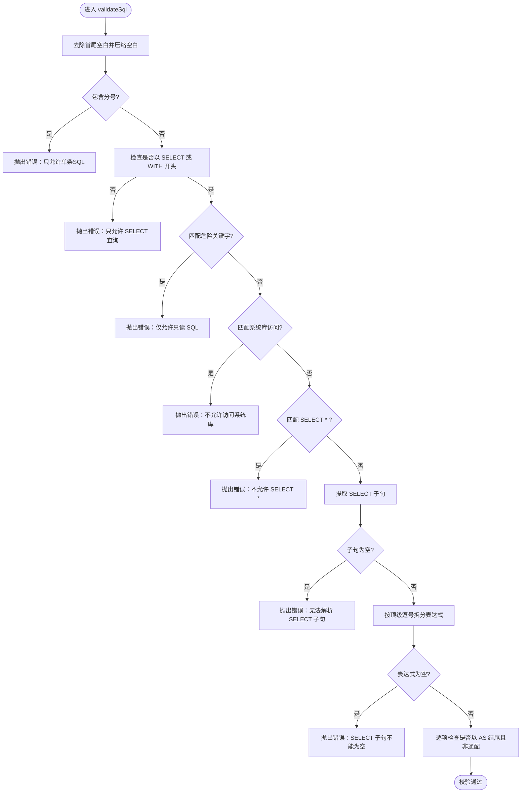
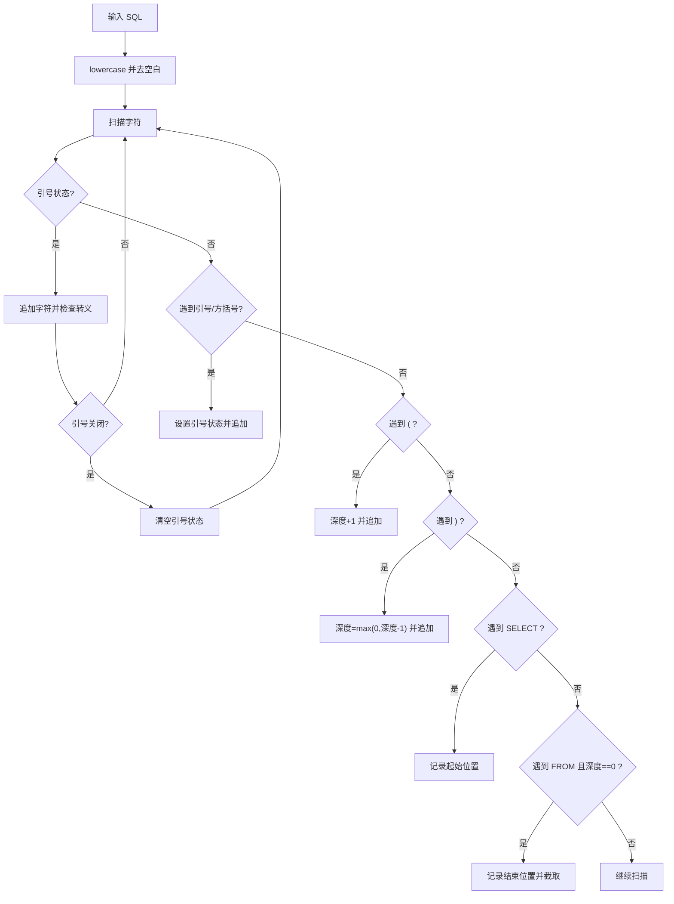
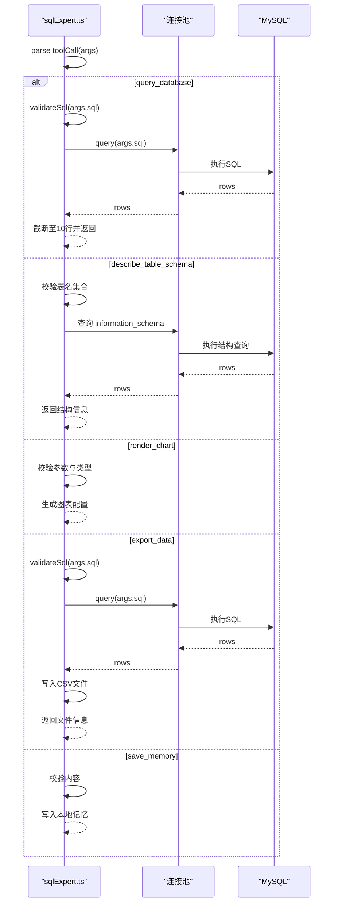
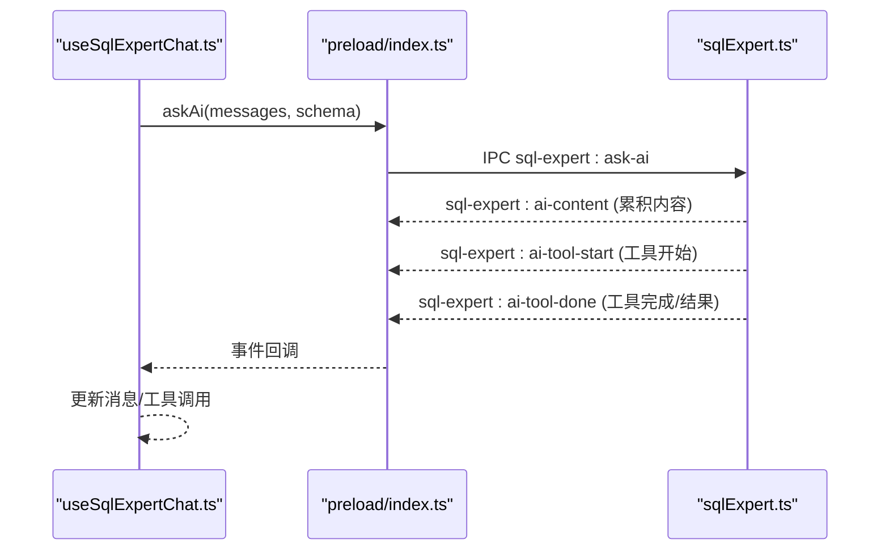
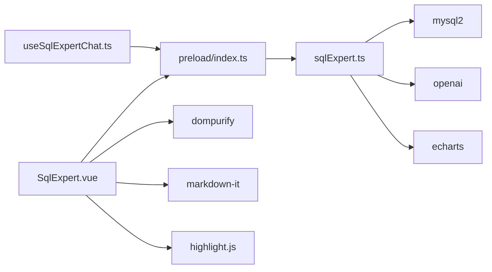

# SQL验证引擎

<cite>
**本文引用的文件**
- [sqlExpert.ts](file://src/main/services/sqlExpert.ts)
- [SqlExpert.vue](file://src/renderer/src/views/sqlexpert/SqlExpert.vue)
- [useSqlExpertChat.ts](file://src/renderer/src/views/sqlexpert/useSqlExpertChat.ts)
- [index.ts](file://src/preload/index.ts)
- [README.md](file://README.md)
- [package.json](file://package.json)
</cite>

## 目录
1. [简介](#简介)
2. [项目结构](#项目结构)
3. [核心组件](#核心组件)
4. [架构总览](#架构总览)
5. [详细组件分析](#详细组件分析)
6. [依赖关系分析](#依赖关系分析)
7. [性能考量](#性能考量)
8. [故障排查指南](#故障排查指南)
9. [结论](#结论)
10. [附录](#附录)

## 简介
本项目提供“企业级分析专家”能力，核心围绕SQL验证引擎展开，确保用户输入的SQL满足只读、列别名、通配符、系统库访问等安全与合规约束。主进程负责数据库连接、SQL校验、工具调度与AI对话流式推送；渲染进程负责用户交互、消息展示与工具调用可视化。

## 项目结构
- 主进程服务：SQL专家服务位于主进程，提供IPC接口、数据库连接池、SQL校验、工具调用、AI对话流式推送等能力。
- 渲染进程：SQL Expert视图负责用户输入、消息渲染、工具调用结果展示、图表渲染与CSV导出。
- 预加载层：通过contextBridge暴露受控API给渲染进程，封装IPC调用与事件监听。

**图表来源**
- [SqlExpert.vue:1-120](file://src/renderer/src/views/sqlexpert/SqlExpert.vue#L1-L120)
- [useSqlExpertChat.ts:1-120](file://src/renderer/src/views/sqlexpert/useSqlExpertChat.ts#L1-L120)
- [index.ts:156-212](file://src/preload/index.ts#L156-L212)
- [sqlExpert.ts:968-1503](file://src/main/services/sqlExpert.ts#L968-L1503)

**章节来源**
- [README.md:54-61](file://README.md#L54-L61)
- [package.json:28-51](file://package.json#L28-L51)

## 核心组件
- SQL验证器：负责解析SELECT子句、拆分表达式、校验只读、系统库访问、通配符与列别名。
- 选择子句提取器：在忽略字符串字面量与括号嵌套的情况下，定位SELECT与FROM之间的表达式。
- 顶级逗号分割器：在忽略字符串字面量与括号嵌套的情况下，按顶级逗号拆分表达式。
- 工具调度器：将AI工具调用映射到数据库查询、表结构查询、图表渲染、数据导出与记忆管理。
- AI对话流：构建系统提示词、工具定义、消息序列，流式推送内容与工具调用状态。

**章节来源**
- [sqlExpert.ts:267-400](file://src/main/services/sqlExpert.ts#L267-L400)
- [sqlExpert.ts:836-951](file://src/main/services/sqlExpert.ts#L836-L951)
- [sqlExpert.ts:437-571](file://src/main/services/sqlExpert.ts#L437-L571)

## 架构总览
SQL验证引擎贯穿“输入校验—工具调度—数据库执行—结果返回”的闭环，确保只读与合规。

**图表来源**
- [index.ts:156-212](file://src/preload/index.ts#L156-L212)
- [sqlExpert.ts:1280-1501](file://src/main/services/sqlExpert.ts#L1280-L1501)
- [sqlExpert.ts:836-951](file://src/main/services/sqlExpert.ts#L836-L951)
- [sqlExpert.ts:1244-1266](file://src/main/services/sqlExpert.ts#L1244-L1266)

## 详细组件分析

### SQL语法解析器与安全验证器
- 设计原则
  - 仅允许只读查询：以SELECT或WITH开头，禁止DDL/DML/系统库访问。
  - 严格列别名：每个输出列必须以AS结尾，避免SELECT *。
  - 顶级表达式解析：在忽略字符串与括号嵌套的前提下，正确拆分SELECT子句。
  - 注释处理：通过深度计数与引号状态跳过注释与字符串字面量，避免误判。
- 关键算法
  - 选择子句提取：双指针扫描，维护引号状态与括号深度，定位FROM前的表达式。
  - 顶级逗号分割：同上，遇到逗号且深度为0时切分，保证嵌套表达式不被错误拆分。
  - 正则匹配：使用单词边界与大小写不敏感标志，覆盖常见危险关键字与系统库模式。
- 边界情况
  - 转义引号：字符串内部的转义字符不影响引号状态。
  - 方括号标识符：支持SQL Server风格的方括号标识符。
  - 多行与空白压缩：统一空白后进行匹配，提升鲁棒性。
  - 空SQL与空表达式：显式抛错，避免空输入导致的异常。

**图表来源**
- [sqlExpert.ts:365-400](file://src/main/services/sqlExpert.ts#L365-L400)
- [sqlExpert.ts:267-315](file://src/main/services/sqlExpert.ts#L267-L315)
- [sqlExpert.ts:317-363](file://src/main/services/sqlExpert.ts#L317-L363)

**章节来源**
- [sqlExpert.ts:267-400](file://src/main/services/sqlExpert.ts#L267-L400)

### 选择子句提取与表达式分割
- 选择子句提取
  - 从SQL中定位第一个“SELECT ”的位置，随后忽略引号与括号深度，直到遇到“ FROM ”，截取中间部分作为SELECT子句。
  - 支持大小写不敏感匹配，兼容多行与多余空白。
- 表达式分割
  - 在顶级逗号处切分，忽略引号与括号深度，确保嵌套表达式不被错误拆分。
  - 支持方括号标识符与反引号标识符，兼容不同数据库方言。

**图表来源**
- [sqlExpert.ts:267-315](file://src/main/services/sqlExpert.ts#L267-L315)

**章节来源**
- [sqlExpert.ts:267-363](file://src/main/services/sqlExpert.ts#L267-L363)

### 工具调度与安全执行
- 工具定义
  - query_database：执行只读SQL，限制最多返回10行样例，强制列别名与AS。
  - describe_table_schema：查询表结构，支持单表或多表，仅允许合法表名。
  - render_chart：根据结果生成图表配置。
  - export_data：导出完整结果为CSV文件。
  - save_memory：保存本地记忆。
- 安全执行
  - 所有工具调用均先经过validateSql校验，确保只读与合规。
  - 表结构查询通过合法表名集合限定，避免任意表枚举。
  - 查询超时控制与结果截断，防止长耗时与大结果集影响体验。

**图表来源**
- [sqlExpert.ts:836-951](file://src/main/services/sqlExpert.ts#L836-L951)
- [sqlExpert.ts:473-571](file://src/main/services/sqlExpert.ts#L473-L571)

**章节来源**
- [sqlExpert.ts:836-951](file://src/main/services/sqlExpert.ts#L836-L951)
- [sqlExpert.ts:473-571](file://src/main/services/sqlExpert.ts#L473-L571)

### AI对话与流式推送
- 系统提示词
  - 明确只读查询、列别名、系统库禁用、工具使用规范与最终答复要求。
- 工具调用
  - AI生成工具调用后，主进程执行并流式推送内容与工具状态。
- 事件监听
  - 渲染进程注册ai-content、ai-tool-start、ai-tool-done事件，实时更新界面。

**图表来源**
- [useSqlExpertChat.ts:282-420](file://src/renderer/src/views/sqlexpert/useSqlExpertChat.ts#L282-L420)
- [index.ts:197-211](file://src/preload/index.ts#L197-L211)
- [sqlExpert.ts:1280-1501](file://src/main/services/sqlExpert.ts#L1280-L1501)

**章节来源**
- [sqlExpert.ts:437-571](file://src/main/services/sqlExpert.ts#L437-L571)
- [useSqlExpertChat.ts:282-420](file://src/renderer/src/views/sqlexpert/useSqlExpertChat.ts#L282-L420)

## 依赖关系分析
- 外部依赖
  - mysql2：数据库连接与查询。
  - openai：AI对话与流式响应。
  - echarts：图表渲染。
  - dompurify/markdown-it/highlight.js：内容安全与高亮渲染。
- 内部依赖
  - 预加载层通过contextBridge暴露API，渲染进程通过window.api调用。
  - 主进程通过ipcMain.handle注册IPC处理器，渲染进程通过ipcRenderer.invoke调用。

**图表来源**
- [package.json:28-51](file://package.json#L28-L51)
- [index.ts:156-212](file://src/preload/index.ts#L156-L212)
- [sqlExpert.ts:1-12](file://src/main/services/sqlExpert.ts#L1-L12)

**章节来源**
- [package.json:28-51](file://package.json#L28-L51)

## 性能考量
- 连接池与超时
  - 连接池限制并发与队列，查询超时控制在60秒，避免阻塞。
- 结果截断
  - 工具结果最多返回10行样例，降低网络与内存压力。
- 令牌用量
  - 流式响应中统计prompt/completion/token用量，便于成本估算。
- UI渲染
  - 会话持久化时清理大数据字段，减少localStorage体积。

**章节来源**
- [sqlExpert.ts:404-435](file://src/main/services/sqlExpert.ts#L404-L435)
- [sqlExpert.ts:743-744](file://src/main/services/sqlExpert.ts#L743-L744)
- [sqlExpert.ts:1310-1316](file://src/main/services/sqlExpert.ts#L1310-L1316)
- [useSqlExpertChat.ts:104-121](file://src/renderer/src/views/sqlexpert/useSqlExpertChat.ts#L104-L121)

## 故障排查指南
- 常见错误与修复建议
  - “SQL 不能为空”：检查输入是否为空或仅空白字符。
  - “只允许单条 SQL”：移除末尾分号或拆分为多条独立请求。
  - “只允许 SELECT 查询”：仅使用SELECT或WITH，避免DDL/DML。
  - “仅允许只读 SQL”：移除INSERT/UPDATE/DELETE等危险关键字。
  - “不允许访问系统库”：避免information_schema/mysql等系统库访问。
  - “不允许 SELECT *”：为每个输出列显式使用AS别名。
  - “无法解析 SELECT 子句”：检查SQL语法，确保SELECT与FROM存在且顺序正确。
  - “SELECT 子句不能为空”：确保SELECT子句包含至少一个表达式。
  - “每个输出列都必须以 AS 别名结尾”：为每个列添加AS别名。
  - “未知工具”：确认工具名称拼写正确。
  - “至少需要提供一个合法表名”：核对表名是否存在于schema中。
  - “不支持的图表类型/series 不能为空/xAxisData 缺失”：按工具要求提供参数。
  - “记忆内容不能为空/记忆 ID 和内容不能为空”：确保内容非空且ID有效。
- 诊断步骤
  - 使用“一键加载当前数据库表结构”，确认schema已正确加载。
  - 在设置中测试数据库连接，确认主机、端口、账号、库名正确。
  - 查看余额接口返回，确认AI服务可用。
  - 检查会话文件弹窗，确认导出文件路径与数量。

**章节来源**
- [sqlExpert.ts:365-400](file://src/main/services/sqlExpert.ts#L365-L400)
- [sqlExpert.ts:836-951](file://src/main/services/sqlExpert.ts#L836-L951)
- [sqlExpert.ts:1005-1057](file://src/main/services/sqlExpert.ts#L1005-L1057)
- [SqlExpert.vue:575-611](file://src/renderer/src/views/sqlexpert/SqlExpert.vue#L575-L611)

## 结论
SQL验证引擎通过严格的语法解析与安全校验，确保所有数据库操作均为只读且符合列别名与通配符规则；结合工具调度与AI流式对话，形成“输入校验—工具执行—结果返回”的闭环。配合连接池、超时与结果截断等机制，兼顾安全性与性能。建议在生产环境中持续完善错误消息与修复建议，增强用户体验与可维护性。

## 附录
- 验证规则摘要
  - 仅允许SELECT或WITH开头。
  - 禁止DDL/DML/系统库访问。
  - 禁止SELECT *，必须显式AS别名。
  - 顶级逗号分割表达式，忽略引号与括号嵌套。
  - 工具调用前统一validateSql。
- 错误消息格式
  - 统一抛出Error对象，包含明确的中文提示。
  - 工具调用结果通过JSON字符串汇总关键字段（ok、reason、totalRows、returnedRows、truncated、error、fileName、chartConfig等）。
- 安全最佳实践
  - 严格限制只读查询与列别名。
  - 通过合法表名集合限定结构查询。
  - 使用连接池与超时控制，避免资源泄露。
  - 对用户输入进行严格校验与清洗，避免XSS与注入风险。
  - 通过本地记忆沉淀可复用经验，减少重复查询。