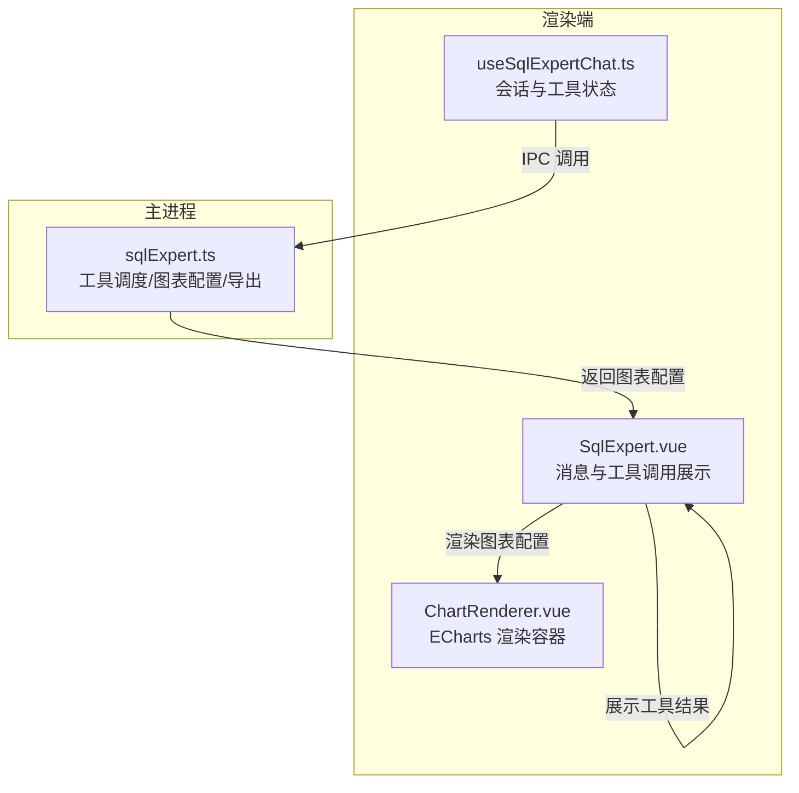
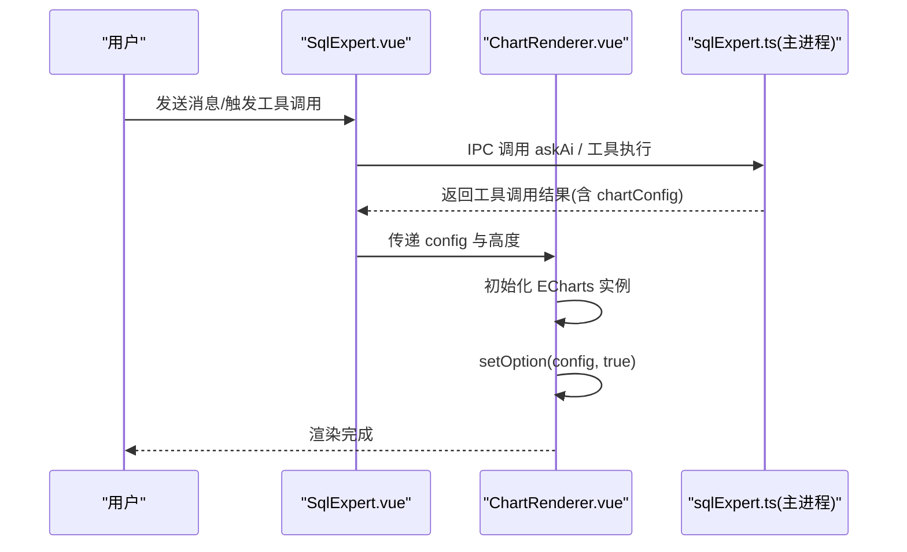
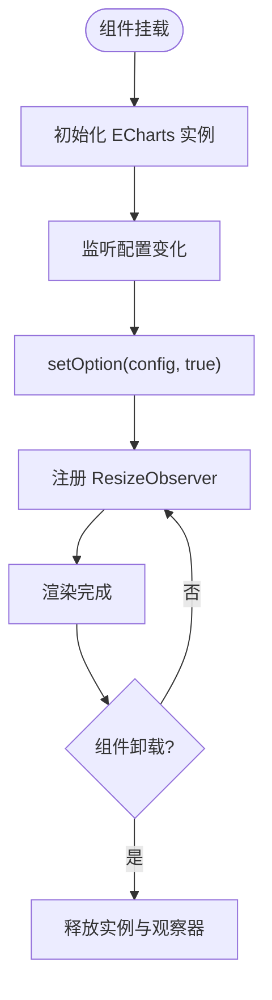
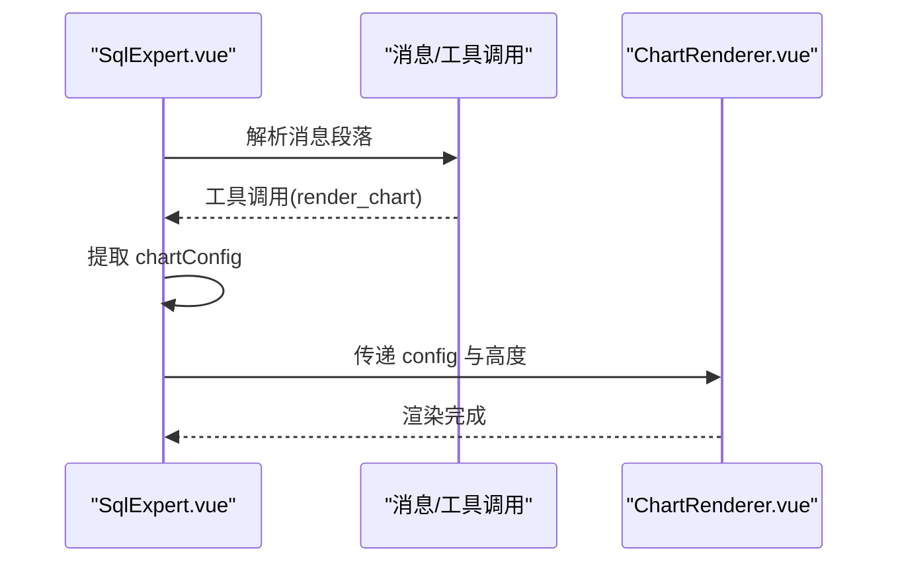
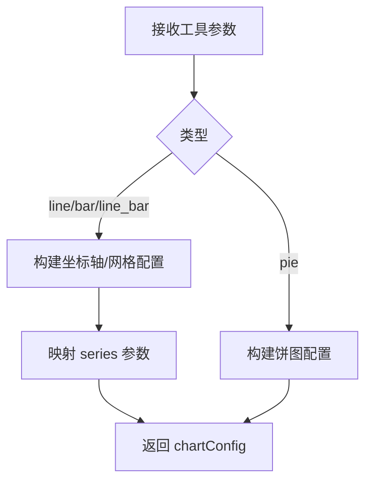
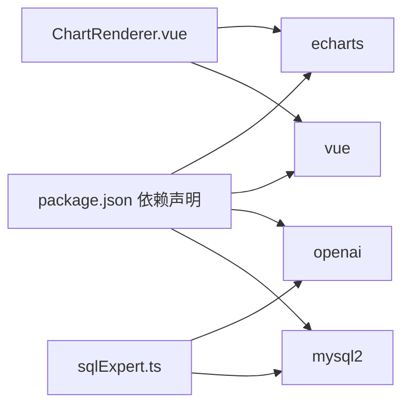

# 图表渲染组件

<cite>
**本文引用的文件**
- [ChartRenderer.vue](file://src/renderer/src/views/sqlexpert/ChartRenderer.vue)
- [SqlExpert.vue](file://src/renderer/src/views/sqlexpert/SqlExpert.vue)
- [useSqlExpertChat.ts](file://src/renderer/src/views/sqlexpert/useSqlExpertChat.ts)
- [sqlExpert.ts](file://src/main/services/sqlExpert.ts)
- [index.css](file://src/renderer/src/styles/index.css)
- [package.json](file://package.json)
</cite>

## 目录
1. [简介](#简介)
2. [项目结构](#项目结构)
3. [核心组件](#核心组件)
4. [架构总览](#架构总览)
5. [详细组件分析](#详细组件分析)
6. [依赖关系分析](#依赖关系分析)
7. [性能考量](#性能考量)
8. [故障排查指南](#故障排查指南)
9. [结论](#结论)
10. [附录](#附录)

## 简介
本文件面向“图表渲染组件”的技术文档，聚焦于基于 ECharts 的集成架构与实现细节。内容覆盖：
- 图表配置生成与选项构建流程
- 支持的图表类型与参数约束
- 数据格式转换、坐标轴与交互设置
- 响应式设计与主题定制
- 性能优化策略与事件处理
- 图表导出、打印支持与无障碍访问优化

该组件位于“企业级分析专家”子模块中，负责接收来自 AI 工具链的图表配置并进行渲染，同时提供基础的导出能力与 UI 交互。

## 项目结构
图表渲染组件位于渲染端的“SQL 专家”视图内，采用“组件 + 组合式逻辑 + 主进程服务”的分层设计：
- 渲染端组件：ChartRenderer.vue 负责初始化 ECharts 实例、接收配置并渲染
- 视图容器：SqlExpert.vue 负责消息渲染、工具调用结果展示与图表容器挂载
- 组合式逻辑：useSqlExpertChat.ts 提供消息与工具调用状态管理
- 主进程服务：sqlExpert.ts 负责工具调度、图表配置构建与数据导出

**图表来源**
- [SqlExpert.vue:144-148](file://src/renderer/src/views/sqlexpert/SqlExpert.vue#L144-L148)
- [ChartRenderer.vue:1-65](file://src/renderer/src/views/sqlexpert/ChartRenderer.vue#L1-L65)
- [useSqlExpertChat.ts:495-507](file://src/renderer/src/views/sqlexpert/useSqlExpertChat.ts#L495-L507)
- [sqlExpert.ts:473-572](file://src/main/services/sqlExpert.ts#L473-L572)

**章节来源**
- [SqlExpert.vue:1-200](file://src/renderer/src/views/sqlexpert/SqlExpert.vue#L1-L200)
- [ChartRenderer.vue:1-65](file://src/renderer/src/views/sqlexpert/ChartRenderer.vue#L1-L65)
- [useSqlExpertChat.ts:1-120](file://src/renderer/src/views/sqlexpert/useSqlExpertChat.ts#L1-L120)
- [sqlExpert.ts:1-120](file://src/main/services/sqlExpert.ts#L1-L120)

## 核心组件
- ChartRenderer.vue
  - 接收配置对象与高度参数，初始化 ECharts 实例并设置选项
  - 使用 ResizeObserver 监听容器尺寸变化以触发图表自适应
  - 在组件卸载时释放实例与观察器
- SqlExpert.vue
  - 展示 AI 回复与工具调用过程，当检测到图表工具调用时渲染 ChartRenderer 容器
  - 提供导出文件打开入口与会话文件弹窗
- useSqlExpertChat.ts
  - 管理会话、消息、工具调用状态与 IPC 事件监听
  - 提供工具调用结果解析与图表配置提取
- sqlExpert.ts
  - 定义 AI 工具集，其中 render_chart 工具用于生成 ECharts 配置
  - 构建图表选项（标题、提示框、图例、网格、坐标轴、系列等）
  - 提供数据导出 CSV 的能力

**章节来源**
- [ChartRenderer.vue:1-65](file://src/renderer/src/views/sqlexpert/ChartRenderer.vue#L1-L65)
- [SqlExpert.vue:144-148](file://src/renderer/src/views/sqlexpert/SqlExpert.vue#L144-L148)
- [useSqlExpertChat.ts:495-507](file://src/renderer/src/views/sqlexpert/useSqlExpertChat.ts#L495-L507)
- [sqlExpert.ts:473-572](file://src/main/services/sqlExpert.ts#L473-L572)

## 架构总览
图表渲染的端到端流程如下：
- 用户在 SqlExpert.vue 中发起查询或请求图表
- 主进程 sqlExpert.ts 根据工具定义与输入参数构建 ECharts 配置
- 主进程通过 IPC 返回工具调用结果，其中包含 chartConfig
- 渲染端 SqlExpert.vue 检测到 render_chart 工具调用后，将 chartConfig 传递给 ChartRenderer.vue
- ChartRenderer.vue 初始化 ECharts 并应用配置，完成渲染

**图表来源**
- [SqlExpert.vue:144-148](file://src/renderer/src/views/sqlexpert/SqlExpert.vue#L144-L148)
- [ChartRenderer.vue:23-31](file://src/renderer/src/views/sqlexpert/ChartRenderer.vue#L23-L31)
- [sqlExpert.ts:898-916](file://src/main/services/sqlExpert.ts#L898-L916)

## 详细组件分析

### ChartRenderer.vue 组件
- 职责
  - 接收配置对象与高度，初始化 ECharts 实例
  - 监听容器尺寸变化并触发 resize
  - 深度监听配置变化，重新设置选项
  - 卸载时释放实例与观察器
- 关键点
  - 使用 setOption(config, true) 启用平滑过渡与增量更新
  - 通过 ResizeObserver 实现响应式布局
  - 通过 Vue 生命周期钩子确保资源正确释放

**图表来源**
- [ChartRenderer.vue:23-57](file://src/renderer/src/views/sqlexpert/ChartRenderer.vue#L23-L57)

**章节来源**
- [ChartRenderer.vue:1-65](file://src/renderer/src/views/sqlexpert/ChartRenderer.vue#L1-L65)

### SqlExpert.vue 与工具调用
- 职责
  - 渲染消息与工具调用过程，识别 render_chart 工具调用并渲染图表
  - 提供导出文件打开入口与会话文件弹窗
- 关键点
  - 通过工具调用结果中的 chartConfig 决定是否渲染图表容器
  - 使用 getChartConfig 提取配置并传递给 ChartRenderer

**图表来源**
- [SqlExpert.vue:144-148](file://src/renderer/src/views/sqlexpert/SqlExpert.vue#L144-L148)
- [useSqlExpertChat.ts:700-703](file://src/renderer/src/views/sqlexpert/useSqlExpertChat.ts#L700-L703)

**章节来源**
- [SqlExpert.vue:144-148](file://src/renderer/src/views/sqlexpert/SqlExpert.vue#L144-L148)
- [useSqlExpertChat.ts:700-703](file://src/renderer/src/views/sqlexpert/useSqlExpertChat.ts#L700-L703)

### 主进程工具与配置构建（sqlExpert.ts）
- 工具定义
  - render_chart：支持 line、bar、pie、line_bar 类型，要求提供 series 与必要参数
  - export_data：导出完整查询结果为 CSV
  - save_memory：保存可复用经验
  - query_database、describe_table_schema：数据库查询与表结构描述
- 图表配置构建
  - 根据类型生成标题、提示框、图例、网格、坐标轴与系列
  - 折线图启用平滑曲线，柱状图限制最大宽度
  - 支持双 Y 轴场景（右侧轴隐藏分割线）

**图表来源**
- [sqlExpert.ts:473-572](file://src/main/services/sqlExpert.ts#L473-L572)
- [sqlExpert.ts:746-785](file://src/main/services/sqlExpert.ts#L746-L785)

**章节来源**
- [sqlExpert.ts:473-572](file://src/main/services/sqlExpert.ts#L473-L572)
- [sqlExpert.ts:746-785](file://src/main/services/sqlExpert.ts#L746-L785)

### 支持的图表类型与参数
- 折线图（line）
  - 特征：平滑曲线、类别轴、数值轴
  - 参数：type、title、xAxisData、series（name、type、data）、可选 yAxisIndex
- 柱状图（bar）
  - 特征：柱形、类别轴、数值轴
  - 参数：type、title、xAxisData、series（name、type、data）、可选 yAxisIndex
- 饼图（pie）
  - 特征：环形内外半径、百分比标签
  - 参数：type、title、series（name、data），无需 xAxisData
- 组合图（line_bar）
  - 特征：折线与柱状混合，支持双 Y 轴
  - 参数：type、title、xAxisData、series（name、type、data、yAxisIndex）

**章节来源**
- [sqlExpert.ts:518-536](file://src/main/services/sqlExpert.ts#L518-L536)
- [sqlExpert.ts:746-785](file://src/main/services/sqlExpert.ts#L746-L785)

### 数据格式与转换
- 输入数据
  - series：数组，每项包含 name、type、data、可选 yAxisIndex
  - xAxisData：折线/柱状图必需，饼图不需要
- 输出配置
  - 通过 buildChartOption 生成 ECharts 选项对象，包含 title、tooltip、legend、grid、xAxis、yAxis、series
- 导出 CSV
  - rowsToCsv 将查询结果转为 CSV 文本，写入 exports 目录

**章节来源**
- [sqlExpert.ts:746-785](file://src/main/services/sqlExpert.ts#L746-L785)
- [sqlExpert.ts:795-808](file://src/main/services/sqlExpert.ts#L795-L808)
- [sqlExpert.ts:810-814](file://src/main/services/sqlExpert.ts#L810-L814)

### 坐标轴与交互设置
- 提示框：axisPointer 为 cross，item 类型为 tooltip
- 图例：底部滚动图例
- 网格：top、bottom、left、right、containLabel 根据是否存在右侧轴动态调整
- X 轴：category 类型，数据来自 xAxisData
- Y 轴：默认单轴；若存在 series.yAxisIndex=1，则启用双轴并隐藏右侧轴分割线
- 系列：line 启用 smooth，bar 设置最大宽度

**章节来源**
- [sqlExpert.ts:769-784](file://src/main/services/sqlExpert.ts#L769-L784)

### 响应式设计与主题定制
- 响应式
  - 使用 ResizeObserver 监听容器尺寸变化并触发图表 resize
  - 容器最小高度与宽度保证在小屏设备上的可读性
- 主题
  - 渲染端使用 CSS 变量定义主题色板与阴影，ChartRenderer.vue 通过容器类名继承样式
  - ECharts 主题由全局 CSS 变量驱动，图表颜色与背景与整体界面一致

**章节来源**
- [ChartRenderer.vue:60-65](file://src/renderer/src/views/sqlexpert/ChartRenderer.vue#L60-L65)
- [index.css:4-31](file://src/renderer/src/styles/index.css#L4-L31)

### 性能优化策略
- 配置增量更新
  - setOption 第二个参数为 true，启用平滑过渡与增量更新，减少重绘成本
- 深度监听
  - 对配置对象进行深度监听，避免不必要的全量重绘
- 资源释放
  - 组件卸载时释放 ECharts 实例与 ResizeObserver，防止内存泄漏
- 数据截断
  - 工具结果行数限制为 10，避免大结果集导致渲染卡顿

**章节来源**
- [ChartRenderer.vue:44-50](file://src/renderer/src/views/sqlexpert/ChartRenderer.vue#L44-L50)
- [ChartRenderer.vue:52-57](file://src/renderer/src/views/sqlexpert/ChartRenderer.vue#L52-L57)
- [sqlExpert.ts:743-744](file://src/main/services/sqlExpert.ts#L743-L744)

### 事件处理与交互
- 工具调用事件
  - 使用 IPC 监听 AI 内容与工具开始/结束事件，实时更新消息与工具调用状态
- 用户操作
  - 支持复制文本、重新生成消息、打开导出文件等
- 图表交互
  - ECharts 默认交互（缩放、选择、悬停提示）由配置中的 tooltip 与 axisPointer 控制

**章节来源**
- [useSqlExpertChat.ts:282-420](file://src/renderer/src/views/sqlexpert/useSqlExpertChat.ts#L282-L420)
- [SqlExpert.vue:134-142](file://src/renderer/src/views/sqlexpert/SqlExpert.vue#L134-L142)

### 图表导出与打印支持
- 导出 CSV
  - export_data 工具执行后，将查询结果写入 exports 目录下的 CSV 文件
  - 提供打开文件入口，便于用户查看导出结果
- 打印支持
  - 可通过浏览器打印功能打印包含图表的页面
  - 建议在打印前切换到浅色主题以提升可读性

**章节来源**
- [sqlExpert.ts:933-948](file://src/main/services/sqlExpert.ts#L933-L948)
- [SqlExpert.vue:134-142](file://src/renderer/src/views/sqlexpert/SqlExpert.vue#L134-L142)

### 无障碍访问优化
- 文本对比度
  - 使用高对比度的主题色板，确保深色背景下文字清晰可读
- 键盘导航
  - 通过工具栏按钮与消息区域的键盘可达性，提升交互效率
- 屏幕阅读器友好
  - 图表容器具备基本的语义化结构，建议在实际部署中补充 aria-label 与描述

**章节来源**
- [index.css:4-31](file://src/renderer/src/styles/index.css#L4-L31)

## 依赖关系分析
- 渲染端依赖
  - ECharts：图表渲染核心库
  - Vue：组件化与响应式系统
- 主进程依赖
  - OpenAI：AI 工具链与模型调用
  - mysql2：数据库连接与查询
  - fs/path：配置与导出文件管理

**图表来源**
- [package.json:28-51](file://package.json#L28-L51)
- [ChartRenderer.vue](file://src/renderer/src/views/sqlexpert/ChartRenderer.vue#L7)
- [sqlExpert.ts](file://src/main/services/sqlExpert.ts#L10)

**章节来源**
- [package.json:28-51](file://package.json#L28-L51)

## 性能考量
- 渲染性能
  - 使用 setOption(true) 与深度监听减少重绘
  - ResizeObserver 仅在容器尺寸变化时触发 resize
- 数据传输
  - 工具结果行数限制为 10，避免大结果集影响渲染
- 资源管理
  - 组件卸载时释放实例与观察器，避免内存泄漏

[本节为通用指导，无需特定文件引用]

## 故障排查指南
- 图表不显示
  - 检查 chartConfig 是否为空或参数缺失（series、xAxisData）
  - 确认容器尺寸是否为 0，检查 ResizeObserver 是否生效
- 图表渲染异常
  - 确认 series 中的 type 与数据格式是否匹配
  - 检查是否有双轴配置错误（yAxisIndex）
- 导出失败
  - 检查导出目录权限与磁盘空间
  - 确认 SQL 查询是否超时（默认 60 秒）

**章节来源**
- [sqlExpert.ts:898-916](file://src/main/services/sqlExpert.ts#L898-L916)
- [sqlExpert.ts:743-744](file://src/main/services/sqlExpert.ts#L743-L744)

## 结论
图表渲染组件通过清晰的分层设计与严格的参数校验，实现了从 AI 工具链到 ECharts 的高效闭环。其响应式布局、主题一致性与性能优化策略，确保了在复杂数据场景下的稳定表现。未来可在以下方面进一步完善：
- 增强图表交互（缩放、钻取、联动）
- 提供主题切换与自定义样式接口
- 优化大数据量场景下的渲染性能
- 补充无障碍访问属性与屏幕阅读器支持

[本节为总结性内容，无需特定文件引用]

## 附录

### 配置示例与参数说明
- 折线图
  - 必填：type、title、series（name、type、data）、xAxisData
  - 可选：yAxisIndex
- 柱状图
  - 必填：type、title、series（name、type、data）、xAxisData
  - 可选：yAxisIndex
- 饼图
  - 必填：type、title、series（name、data）
  - 不需要 xAxisData
- 组合图（line_bar）
  - 必填：type、title、xAxisData、series（name、type、data）
  - 可选：yAxisIndex（用于双轴）

**章节来源**
- [sqlExpert.ts:518-536](file://src/main/services/sqlExpert.ts#L518-L536)
- [sqlExpert.ts:746-785](file://src/main/services/sqlExpert.ts#L746-L785)

### 样式定制与主题变量
- 主题色板：通过 CSS 变量定义主色、表面色、文本色、边框色等
- 阴影与圆角：卡片阴影与圆角变量统一风格
- 图表容器：继承主题变量，确保与整体界面一致

**章节来源**
- [index.css:4-31](file://src/renderer/src/styles/index.css#L4-L31)
- [ChartRenderer.vue:60-65](file://src/renderer/src/views/sqlexpert/ChartRenderer.vue#L60-L65)