# 数据库连接管理

<cite>
**本文档引用的文件**
- [sqlExpert.ts](file://src/main/services/sqlExpert.ts)
- [index.d.ts](file://src/preload/index.d.ts)
</cite>

## 目录
1. [简介](#简介)
2. [项目结构](#项目结构)
3. [核心组件](#核心组件)
4. [架构概览](#架构概览)
5. [详细组件分析](#详细组件分析)
6. [依赖关系分析](#依赖关系分析)
7. [性能考虑](#性能考虑)
8. [故障排除指南](#故障排除指南)
9. [结论](#结论)

## 简介

本文档详细介绍了数据库连接管理模块的设计与实现，重点分析了MySQL连接池的创建、配置和管理机制。该模块采用Electron主进程架构，使用mysql2/promise库实现数据库连接管理，提供了完整的连接池生命周期管理、超时控制、队列限制、自动重连机制和异常处理策略。

## 项目结构

数据库连接管理功能主要集中在`src/main/services/sqlExpert.ts`文件中，该文件实现了以下关键功能：

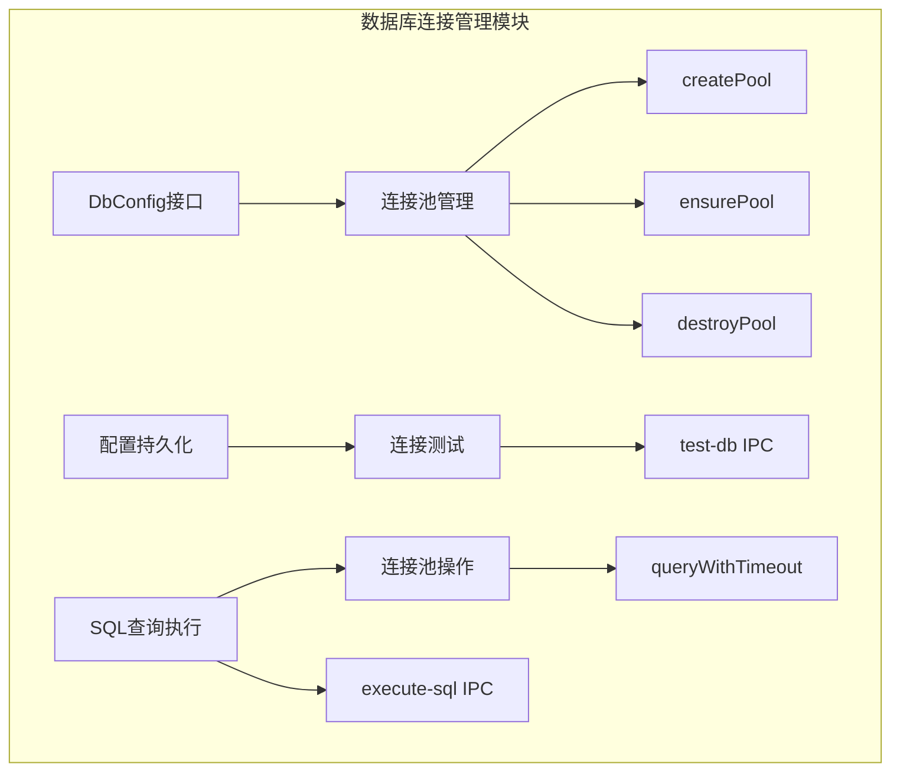

**图表来源**
- [sqlExpert.ts:14-31](file://src/main/services/sqlExpert.ts#L14-L31)
- [sqlExpert.ts:404-435](file://src/main/services/sqlExpert.ts#L404-L435)
- [sqlExpert.ts:968-1266](file://src/main/services/sqlExpert.ts#L968-L1266)

**章节来源**
- [sqlExpert.ts:1-1503](file://src/main/services/sqlExpert.ts#L1-L1503)

## 核心组件

### 数据库配置接口

模块定义了完整的数据库配置接口，确保连接参数的标准化：

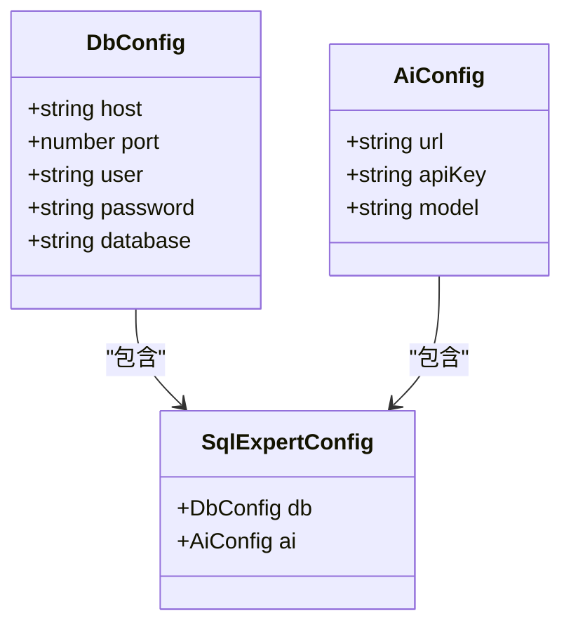

**图表来源**
- [sqlExpert.ts:14-31](file://src/main/services/sqlExpert.ts#L14-L31)

### 连接池管理核心类

连接池管理是整个模块的核心，提供了完整的生命周期管理：

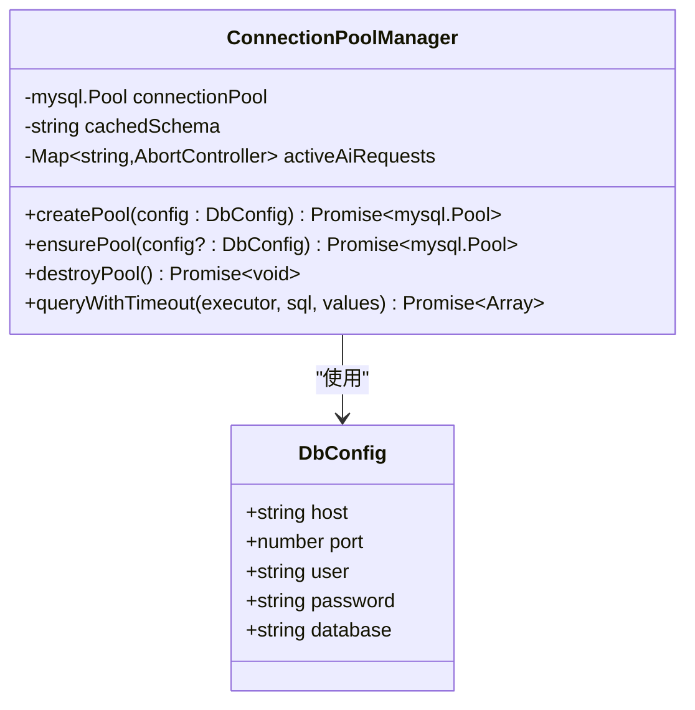

**图表来源**
- [sqlExpert.ts:90-92](file://src/main/services/sqlExpert.ts#L90-L92)
- [sqlExpert.ts:404-435](file://src/main/services/sqlExpert.ts#L404-L435)

**章节来源**
- [sqlExpert.ts:14-31](file://src/main/services/sqlExpert.ts#L14-L31)
- [sqlExpert.ts:404-435](file://src/main/services/sqlExpert.ts#L404-L435)

## 架构概览

模块采用分层架构设计，实现了完整的数据库连接管理：

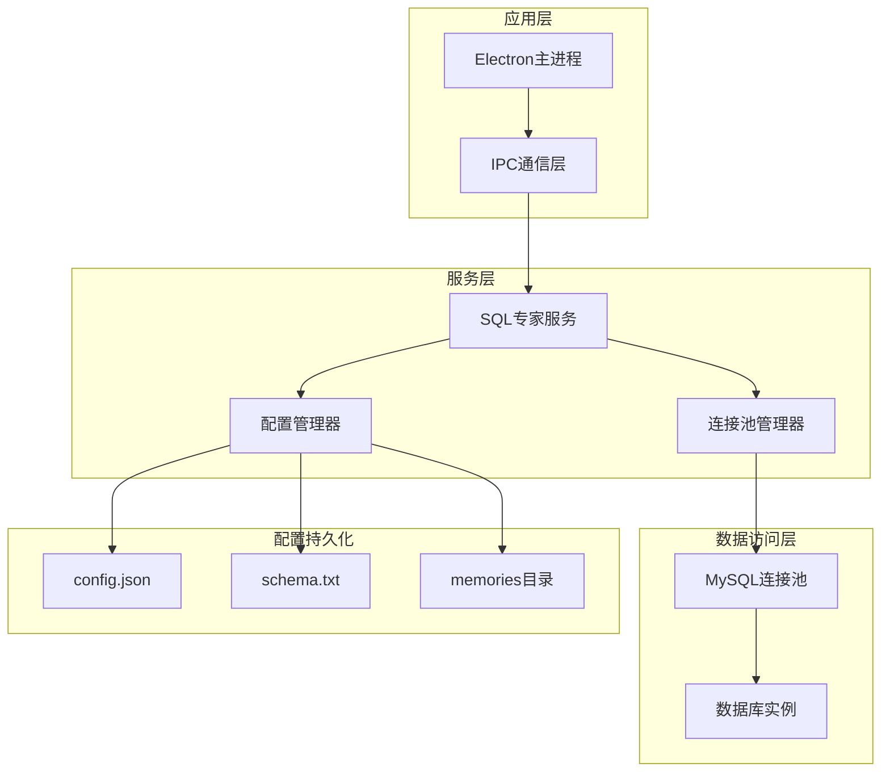

**图表来源**
- [sqlExpert.ts:968-1501](file://src/main/services/sqlExpert.ts#L968-L1501)

## 详细组件分析

### 连接池创建与配置

连接池的创建采用了精心设计的配置参数，确保系统的稳定性和性能：

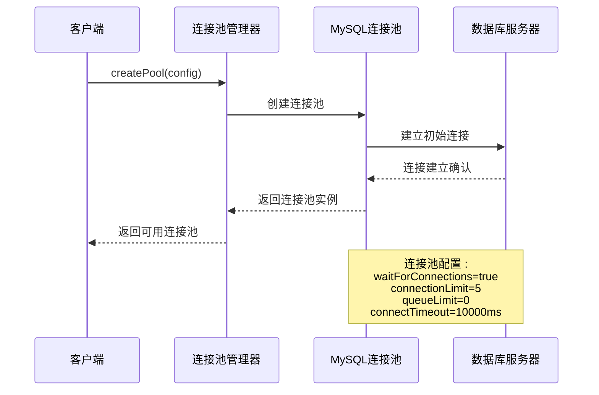

**图表来源**
- [sqlExpert.ts:404-416](file://src/main/services/sqlExpert.ts#L404-L416)

连接池的关键配置参数说明：
- `waitForConnections: true` - 当连接池满时等待而非拒绝新连接
- `connectionLimit: 5` - 最大连接数限制
- `queueLimit: 0` - 队列长度无限制
- `connectTimeout: 10000` - 连接超时时间为10秒

**章节来源**
- [sqlExpert.ts:404-416](file://src/main/services/sqlExpert.ts#L404-L416)

### 连接池生命周期管理

连接池的生命周期管理提供了完整的创建、使用和销毁流程：

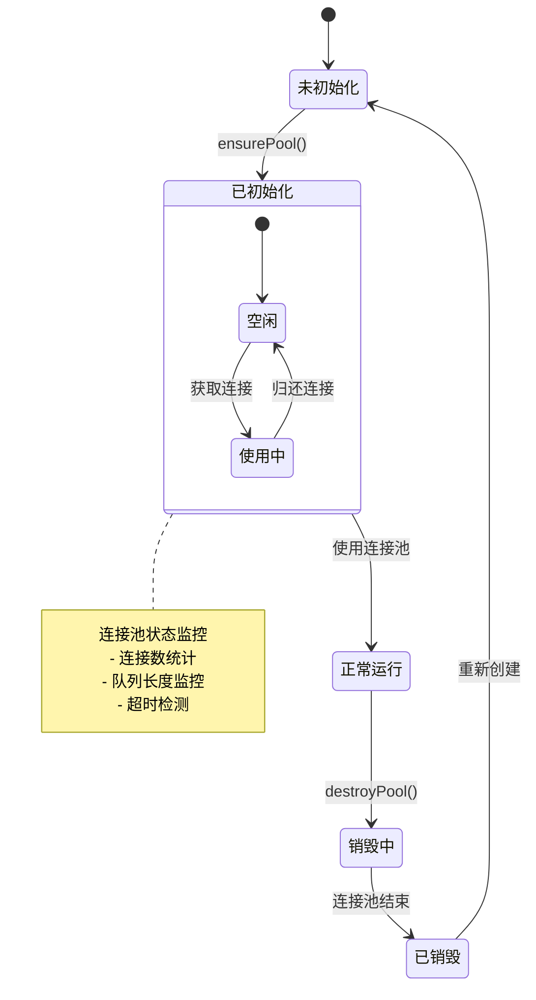

**图表来源**
- [sqlExpert.ts:418-435](file://src/main/services/sqlExpert.ts#L418-L435)

### 查询执行与超时控制

查询执行采用了统一的超时控制机制，确保系统响应性：

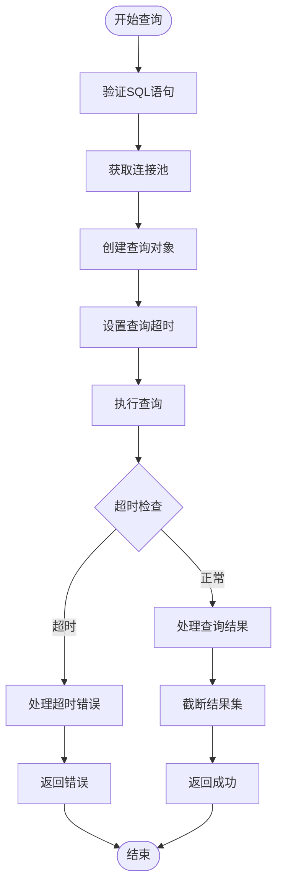

**图表来源**
- [sqlExpert.ts:824-834](file://src/main/services/sqlExpert.ts#L824-L834)
- [sqlExpert.ts:742-744](file://src/main/services/sqlExpert.ts#L742-L744)

查询超时参数配置：
- `SQL_QUERY_TIMEOUT_MS: 60000` - SQL查询超时时间为60秒
- `TOOL_RESULT_ROW_LIMIT: 10` - 工具调用结果行数限制为10行

**章节来源**
- [sqlExpert.ts:742-744](file://src/main/services/sqlExpert.ts#L742-L744)
- [sqlExpert.ts:824-834](file://src/main/services/sqlExpert.ts#L824-L834)

### IPC通信接口

模块提供了完整的IPC通信接口，支持远程数据库连接管理：

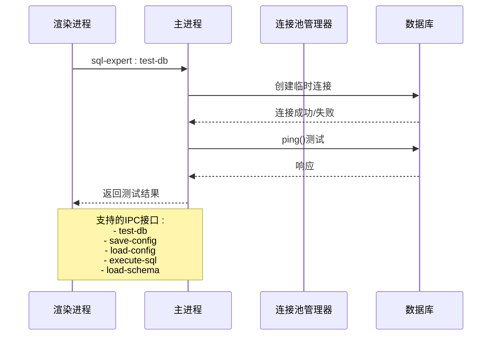

**图表来源**
- [sqlExpert.ts:968-1266](file://src/main/services/sqlExpert.ts#L968-L1266)

**章节来源**
- [sqlExpert.ts:968-1266](file://src/main/services/sqlExpert.ts#L968-L1266)

### 配置持久化机制

配置持久化提供了完整的配置存储和恢复功能：

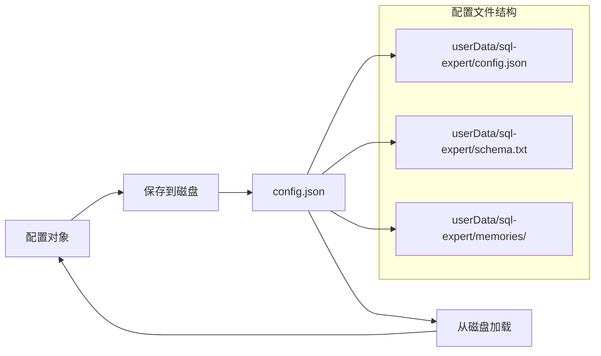

**图表来源**
- [sqlExpert.ts:139-156](file://src/main/services/sqlExpert.ts#L139-L156)
- [sqlExpert.ts:158-170](file://src/main/services/sqlExpert.ts#L158-L170)

**章节来源**
- [sqlExpert.ts:139-170](file://src/main/services/sqlExpert.ts#L139-L170)

## 依赖关系分析

模块的依赖关系相对简洁，主要依赖于mysql2/promise库：

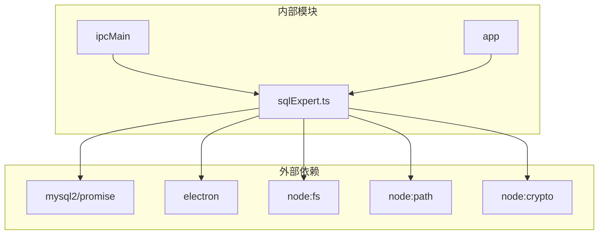

**图表来源**
- [sqlExpert.ts:5-10](file://src/main/services/sqlExpert.ts#L5-L10)

**章节来源**
- [sqlExpert.ts:5-10](file://src/main/services/sqlExpert.ts#L5-L10)

## 性能考虑

### 连接池性能优化

当前连接池配置在性能和稳定性之间取得了平衡：

| 参数 | 当前值 | 设计考虑 |
|------|--------|----------|
| connectionLimit | 5 | 控制最大并发连接数，防止数据库过载 |
| waitForConnections | true | 避免连接拒绝，提高系统韧性 |
| queueLimit | 0 | 允许无限排队，但可能影响响应时间 |
| connectTimeout | 10000ms | 平衡连接建立时间和资源占用 |

### 查询性能优化

查询执行层面的优化策略：

1. **超时控制**：统一的查询超时机制防止长时间阻塞
2. **结果截断**：工具调用结果自动截断，避免大数据量传输
3. **连接复用**：连接池实现连接复用，减少连接建立开销

### 内存管理

模块采用了有效的内存管理策略：

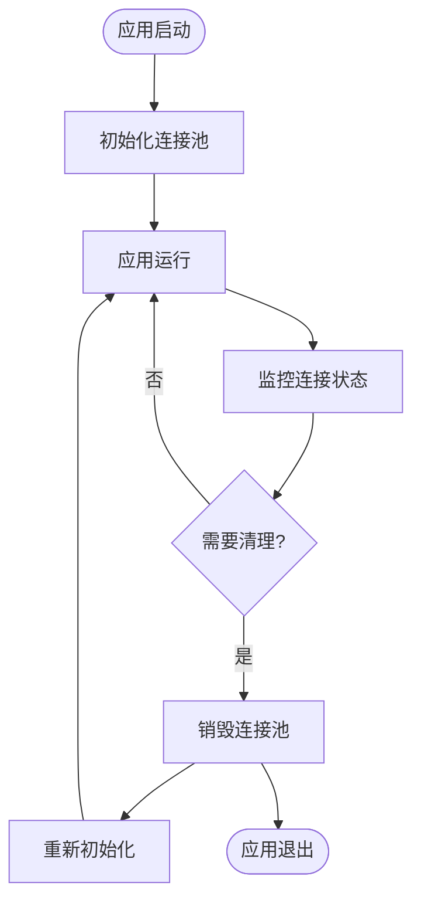

**图表来源**
- [sqlExpert.ts:428-435](file://src/main/services/sqlExpert.ts#L428-L435)

## 故障排除指南

### 常见连接问题

| 问题类型 | 症状 | 可能原因 | 解决方案 |
|----------|------|----------|----------|
| 连接超时 | "连接超时"错误 | 网络延迟、数据库负载高 | 增加connectTimeout、检查网络连接 |
| 连接池满 | "连接池已满"错误 | 并发过高、连接泄漏 | 减少connectionLimit、检查连接释放 |
| 查询超时 | "查询超时"错误 | SQL执行时间过长 | 优化SQL、增加SQL_QUERY_TIMEOUT_MS |
| 认证失败 | "认证失败"错误 | 用户名密码错误 | 检查数据库凭据配置 |

### 调试技巧

1. **启用详细日志**：在开发环境中添加更多调试信息
2. **监控连接状态**：定期检查连接池状态和队列长度
3. **测试连接**：使用`sql-expert:test-db`接口验证连接配置

### 性能监控指标

建议监控以下关键指标：
- 连接池利用率（活跃连接数/总连接数）
- 队列长度和等待时间
- 查询响应时间分布
- 错误率统计

**章节来源**
- [sqlExpert.ts:970-991](file://src/main/services/sqlExpert.ts#L970-L991)
- [sqlExpert.ts:1244-1266](file://src/main/services/sqlExpert.ts#L1244-L1266)

## 结论

数据库连接管理模块展现了良好的工程实践，实现了：

1. **完整的生命周期管理**：从连接池创建到销毁的全流程管理
2. **稳健的错误处理**：完善的异常捕获和资源清理机制
3. **高效的性能控制**：合理的连接池配置和超时控制
4. **可靠的IPC集成**：与Electron主进程的无缝集成

该模块为类似的应用场景提供了优秀的参考实现，特别是在连接池管理和错误处理方面具有很高的实用价值。建议在生产环境中根据实际负载情况调整连接池参数，并添加更详细的监控和告警机制。