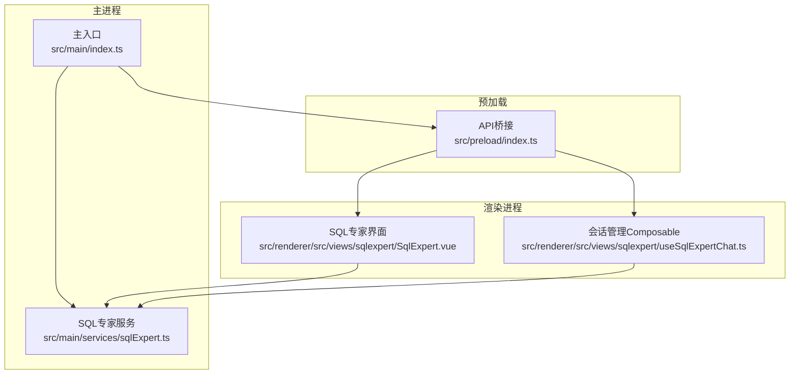
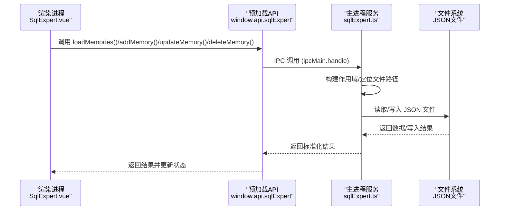
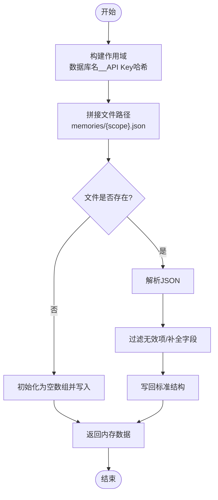
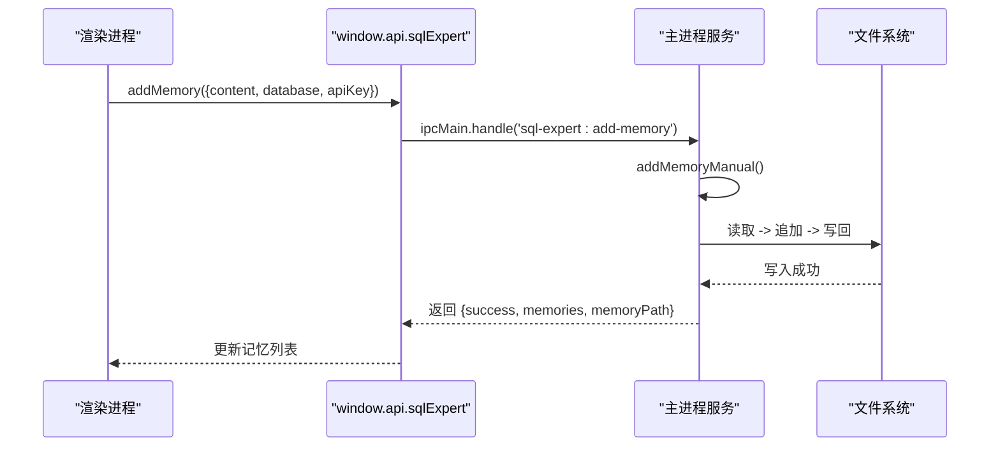
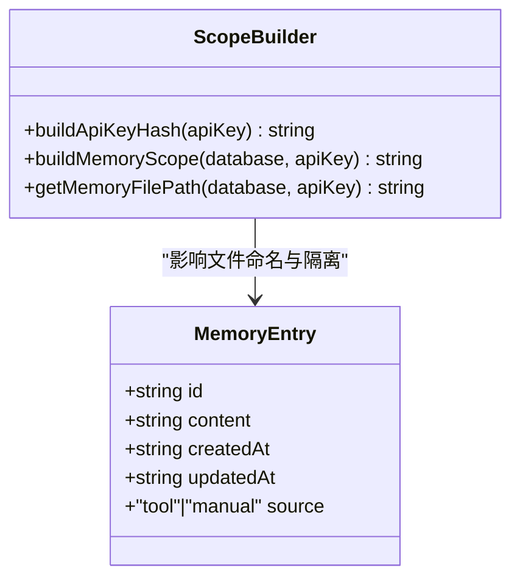
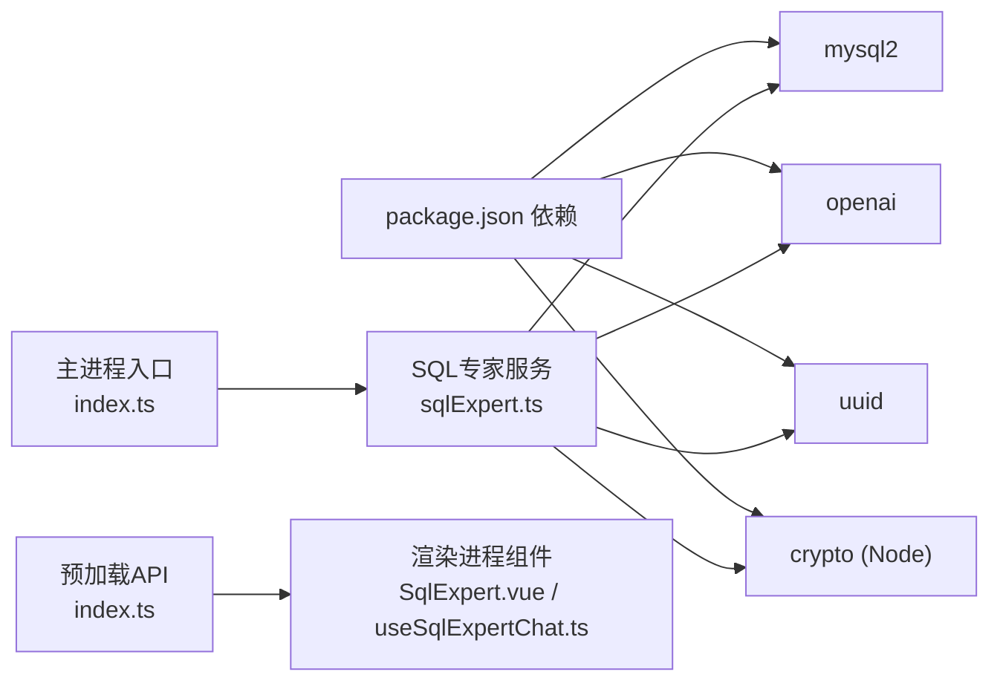

# 记忆管理系统

<cite>
**本文档引用的文件**
- [src/main/index.ts](file://src/main/index.ts)
- [src/main/services/sqlExpert.ts](file://src/main/services/sqlExpert.ts)
- [src/renderer/src/views/sqlexpert/SqlExpert.vue](file://src/renderer/src/views/sqlexpert/SqlExpert.vue)
- [src/renderer/src/views/sqlexpert/useSqlExpertChat.ts](file://src/renderer/src/views/sqlexpert/useSqlExpertChat.ts)
- [src/preload/index.ts](file://src/preload/index.ts)
- [package.json](file://package.json)
</cite>

## 目录
1. [简介](#简介)
2. [项目结构](#项目结构)
3. [核心组件](#核心组件)
4. [架构总览](#架构总览)
5. [详细组件分析](#详细组件分析)
6. [依赖关系分析](#依赖关系分析)
7. [性能考虑](#性能考虑)
8. [故障排除指南](#故障排除指南)
9. [结论](#结论)
10. [附录](#附录)

## 简介
本项目提供了一个基于 Electron 的开发者工具箱，其中的记忆管理系统用于在本地持久化可复用的经验与知识。系统通过主进程的服务层实现文件级的本地存储，采用数据库名与 API Key 的组合构建“作用域”，确保不同数据库与不同 API Key 下的记忆相互隔离。记忆条目支持自动保存（AI 工具调用时）与手动新增两种方式，提供增删改查能力，并具备兼容性处理与数据校验。

## 项目结构
该项目采用典型的 Electron + Vue 前后端分离架构：
- 主进程负责系统窗口、IPC 通信、数据库连接、AI 请求与本地文件存储
- 预加载脚本暴露受控 API 给渲染进程
- 渲染进程使用 Vue 组件承载 UI，通过 window.api.sqlExpert 与主进程交互

**图表来源**
- [src/main/index.ts:1-444](file://src/main/index.ts#L1-L444)
- [src/main/services/sqlExpert.ts:1-1503](file://src/main/services/sqlExpert.ts#L1-L1503)
- [src/preload/index.ts:1-229](file://src/preload/index.ts#L1-L229)
- [src/renderer/src/views/sqlexpert/SqlExpert.vue:1-1105](file://src/renderer/src/views/sqlexpert/SqlExpert.vue#L1-L1105)
- [src/renderer/src/views/sqlexpert/useSqlExpertChat.ts:1-508](file://src/renderer/src/views/sqlexpert/useSqlExpertChat.ts#L1-L508)

**章节来源**
- [src/main/index.ts:1-444](file://src/main/index.ts#L1-L444)
- [src/preload/index.ts:1-229](file://src/preload/index.ts#L1-L229)
- [package.json:1-120](file://package.json#L1-L120)

## 核心组件
- 主进程服务：SQL 专家服务负责数据库连接、AI 请求、工具调度、SQL 校验、导出、图表渲染与本地记忆文件的读写
- 预加载 API：封装 window.api.sqlExpert，向渲染进程暴露安全可控的方法
- 渲染进程组件：SqlExpert.vue 提供记忆列表、新增/编辑/删除、刷新等功能；useSqlExpertChat.ts 管理会话与流式事件

**章节来源**
- [src/main/services/sqlExpert.ts:1-1503](file://src/main/services/sqlExpert.ts#L1-L1503)
- [src/preload/index.ts:156-212](file://src/preload/index.ts#L156-L212)
- [src/renderer/src/views/sqlexpert/SqlExpert.vue:294-430](file://src/renderer/src/views/sqlexpert/SqlExpert.vue#L294-L430)
- [src/renderer/src/views/sqlexpert/useSqlExpertChat.ts:165-507](file://src/renderer/src/views/sqlexpert/useSqlExpertChat.ts#L165-L507)

## 架构总览
记忆管理的端到端流程如下：
- 渲染进程通过 window.api.sqlExpert 调用主进程方法
- 主进程根据数据库名与 API Key 构建作用域，定位对应的记忆文件
- 读取/写入 JSON 文件，进行数据校验与兼容性处理
- 返回结果给渲染进程，UI 层更新记忆列表

**图表来源**
- [src/renderer/src/views/sqlexpert/SqlExpert.vue:717-725](file://src/renderer/src/views/sqlexpert/SqlExpert.vue#L717-L725)
- [src/preload/index.ts:184-191](file://src/preload/index.ts#L184-L191)
- [src/main/services/sqlExpert.ts:1078-1156](file://src/main/services/sqlExpert.ts#L1078-L1156)

## 详细组件分析

### 本地记忆存储架构
- 存储位置：主进程 userData 目录下的 sql-expert/memories 子目录
- 文件命名规则：以“数据库名__API Key哈希.json”命名，确保不同数据库与不同 API Key 的记忆相互隔离
- 数据格式：JSON 数组，每条记忆包含 id、content、createdAt、updatedAt、source 字段

**图表来源**
- [src/main/services/sqlExpert.ts:128-137](file://src/main/services/sqlExpert.ts#L128-L137)
- [src/main/services/sqlExpert.ts:172-214](file://src/main/services/sqlExpert.ts#L172-L214)

**章节来源**
- [src/main/services/sqlExpert.ts:112-137](file://src/main/services/sqlExpert.ts#L112-L137)
- [src/main/services/sqlExpert.ts:172-214](file://src/main/services/sqlExpert.ts#L172-L214)

### 记忆条目增删改查操作
- 新增（自动保存）：AI 工具 save_memory 调用 appendMemory，生成随机 UUID，设置 createdAt/updatedAt，source 为 tool
- 新增（手动）：UI 点击“+ 新增”，调用 addMemoryManual，source 为 manual
- 更新：根据 id 查找并更新 content 与 updatedAt
- 删除：根据 id 查找并移除

**图表来源**
- [src/renderer/src/views/sqlexpert/SqlExpert.vue:796-800](file://src/renderer/src/views/sqlexpert/SqlExpert.vue#L796-L800)
- [src/preload/index.ts:190-191](file://src/preload/index.ts#L190-L191)
- [src/main/services/sqlExpert.ts:1142-1156](file://src/main/services/sqlExpert.ts#L1142-L1156)

**章节来源**
- [src/main/services/sqlExpert.ts:216-249](file://src/main/services/sqlExpert.ts#L216-L249)
- [src/main/services/sqlExpert.ts:251-264](file://src/main/services/sqlExpert.ts#L251-L264)
- [src/main/services/sqlExpert.ts:1107-1139](file://src/main/services/sqlExpert.ts#L1107-L1139)

### ID 生成、时间戳管理与来源标记
- ID：使用随机 UUID 生成，确保全局唯一
- 时间戳：createdAt/updatedAt 使用 ISO 8601 字符串表示
- 来源：AI 自动生成为 tool，手动新增为 manual

**章节来源**
- [src/main/services/sqlExpert.ts:189-195](file://src/main/services/sqlExpert.ts#L189-L195)
- [src/main/services/sqlExpert.ts:219-225](file://src/main/services/sqlExpert.ts#L219-L225)
- [src/main/services/sqlExpert.ts:254-260](file://src/main/services/sqlExpert.ts#L254-L260)

### 记忆作用域计算与数据库隔离
- 作用域构建：数据库名经文件名清洗后与 API Key 的 SHA256 哈希前 24 位拼接
- 文件隔离：不同作用域对应不同 JSON 文件，天然实现数据库与 API Key 的隔离
- 作用域一致性：UI 与主进程均使用相同规则构建作用域

**图表来源**
- [src/main/services/sqlExpert.ts:72-78](file://src/main/services/sqlExpert.ts#L72-L78)
- [src/main/services/sqlExpert.ts:124-137](file://src/main/services/sqlExpert.ts#L124-L137)

**章节来源**
- [src/main/services/sqlExpert.ts:124-137](file://src/main/services/sqlExpert.ts#L124-L137)
- [src/renderer/src/views/sqlexpert/SqlExpert.vue:311-312](file://src/renderer/src/views/sqlexpert/SqlExpert.vue#L311-L312)

### API 密钥哈希
- 使用 SHA256 对 API Key 进行哈希，取前 24 位作为文件名的一部分，避免明文泄露
- 哈希结果参与作用域构建，确保不同 API Key 的记忆文件隔离

**章节来源**
- [src/main/services/sqlExpert.ts:124-126](file://src/main/services/sqlExpert.ts#L124-L126)

### 数据库隔离机制
- 通过“数据库名__API Key哈希”的文件命名实现天然隔离
- 主进程在加载/写入时始终基于当前配置的 database 与 apiKey 计算作用域
- UI 层在调用 IPC 时传递 database 与 apiKey，保证前后端一致

**章节来源**
- [src/main/services/sqlExpert.ts:128-137](file://src/main/services/sqlExpert.ts#L128-L137)
- [src/main/services/sqlExpert.ts:1078-1105](file://src/main/services/sqlExpert.ts#L1078-L1105)

### 记忆文件读写与数据校验
- 读取：若文件不存在则初始化空数组；解析失败则清空为数组并写回
- 写入：每次操作后将内存中的标准结构写回文件，保证后续可直接增量追加
- 校验：过滤掉无效项，确保 content 为字符串，缺失字段补齐默认值

**章节来源**
- [src/main/services/sqlExpert.ts:172-214](file://src/main/services/sqlExpert.ts#L172-L214)

### UI 管理与批量操作
- 列表展示：记忆列表支持点击查看详情、刷新按钮重新加载
- 编辑：打开记忆详情弹窗，支持保存与删除
- 新增：打开新增弹窗，输入内容后保存为手动记忆
- 批量：通过刷新按钮批量拉取最新记忆

**章节来源**
- [src/renderer/src/views/sqlexpert/SqlExpert.vue:294-430](file://src/renderer/src/views/sqlexpert/SqlExpert.vue#L294-L430)
- [src/renderer/src/views/sqlexpert/SqlExpert.vue:717-725](file://src/renderer/src/views/sqlexpert/SqlExpert.vue#L717-L725)
- [src/renderer/src/views/sqlexpert/SqlExpert.vue:733-794](file://src/renderer/src/views/sqlexpert/SqlExpert.vue#L733-L794)
- [src/renderer/src/views/sqlexpert/SqlExpert.vue:796-800](file://src/renderer/src/views/sqlexpert/SqlExpert.vue#L796-L800)

### 数据备份策略与迁移方案
- 备份：建议定期复制 userData/sql-expert/memories 目录至安全位置
- 迁移：当升级或更换设备时，可将该目录整体迁移；系统具备兼容性处理，可自动修复非标准结构
- 备注：当前未实现自动备份/恢复功能，需手动执行

**章节来源**
- [src/main/services/sqlExpert.ts:172-214](file://src/main/services/sqlExpert.ts#L172-L214)

## 依赖关系分析

**图表来源**
- [package.json:28-51](file://package.json#L28-L51)
- [src/main/index.ts:1-12](file://src/main/index.ts#L1-L12)
- [src/main/services/sqlExpert.ts:5-10](file://src/main/services/sqlExpert.ts#L5-L10)

**章节来源**
- [package.json:28-51](file://package.json#L28-L51)
- [src/main/index.ts:1-12](file://src/main/index.ts#L1-L12)
- [src/main/services/sqlExpert.ts:5-10](file://src/main/services/sqlExpert.ts#L5-L10)

## 性能考虑
- 文件 I/O：每次增删改均进行读取与写回，建议在高频操作场景下合并批量写入（当前实现逐次写回）
- JSON 解析：大文件解析与序列化可能成为瓶颈，建议限制单文件大小或拆分记忆
- SQL 校验：在工具调用前进行严格校验，避免无效查询导致的资源浪费
- 导出与图表：导出 CSV 与图表渲染为 CPU 密集型任务，建议限制并发与结果集大小

[本节为通用指导，无需特定文件引用]

## 故障排除指南
- 记忆文件损坏：系统会在解析失败时自动初始化为空数组并写回，确保功能可用
- 未配置数据库或 API Key：加载记忆时会抛出错误，需先完成配置
- 未找到记忆 ID：更新/删除时若 ID 不存在会抛出错误
- 平台差异：Windows 上透明窗口需禁用某些 GPU 功能以避免标题栏问题

**章节来源**
- [src/main/services/sqlExpert.ts:206-213](file://src/main/services/sqlExpert.ts#L206-L213)
- [src/main/services/sqlExpert.ts:1083-1085](file://src/main/services/sqlExpert.ts#L1083-L1085)
- [src/main/services/sqlExpert.ts:234-235](file://src/main/services/sqlExpert.ts#L234-L235)
- [src/main/index.ts:39-41](file://src/main/index.ts#L39-L41)

## 结论
该记忆管理系统通过“数据库名__API Key哈希”的作用域设计实现了天然的数据隔离，结合严格的文件命名规则与 JSON 结构，提供了可靠的本地持久化能力。系统支持自动保存与手动新增两种记忆来源，具备完善的增删改查与兼容性处理。建议在未来版本中引入批量写入、自动备份与迁移工具，以进一步提升用户体验与数据安全性。

[本节为总结性内容，无需特定文件引用]

## 附录

### API 接口说明（IPC）
- 加载记忆：ipcMain.handle('sql-expert:load-memories', payload?) -> { success, memories, memoryPath, memoryScope, memoryCount }
- 更新记忆：ipcMain.handle('sql-expert:update-memory', payload) -> { success, memories, memoryPath, memoryScope, memoryCount }
- 删除记忆：ipcMain.handle('sql-expert:delete-memory', payload) -> { success, memories, memoryPath, memoryScope, memoryCount }
- 新增记忆（手动）：ipcMain.handle('sql-expert:add-memory', payload) -> { success, memories, memoryPath, memoryScope, memoryCount }

**章节来源**
- [src/main/services/sqlExpert.ts:1078-1156](file://src/main/services/sqlExpert.ts#L1078-L1156)

### UI 交互要点
- 刷新记忆：调用 refreshMemories，重新从主进程加载
- 新增/编辑/删除：通过弹窗操作，完成后自动刷新列表
- 文件路径显示：UI 展示 memoryPath，便于用户定位文件

**章节来源**
- [src/renderer/src/views/sqlexpert/SqlExpert.vue:717-725](file://src/renderer/src/views/sqlexpert/SqlExpert.vue#L717-L725)
- [src/renderer/src/views/sqlexpert/SqlExpert.vue:309-310](file://src/renderer/src/views/sqlexpert/SqlExpert.vue#L309-L310)