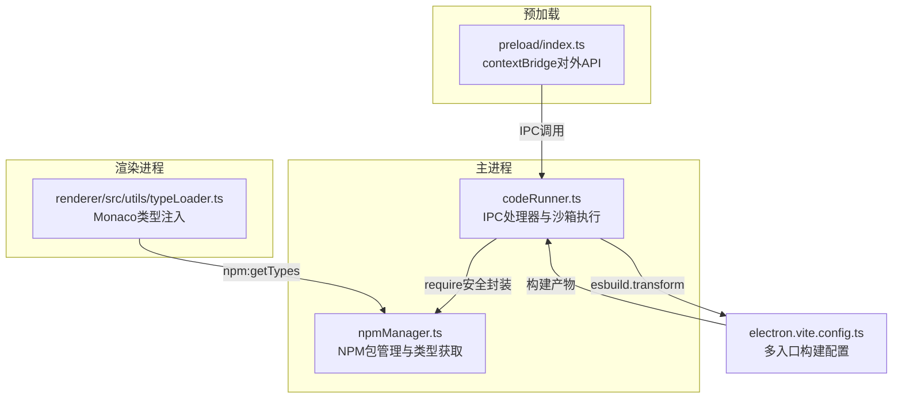
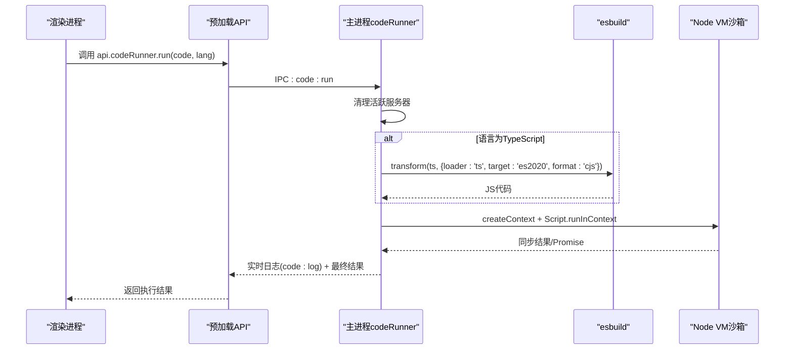
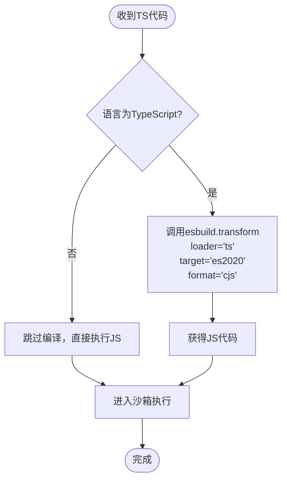
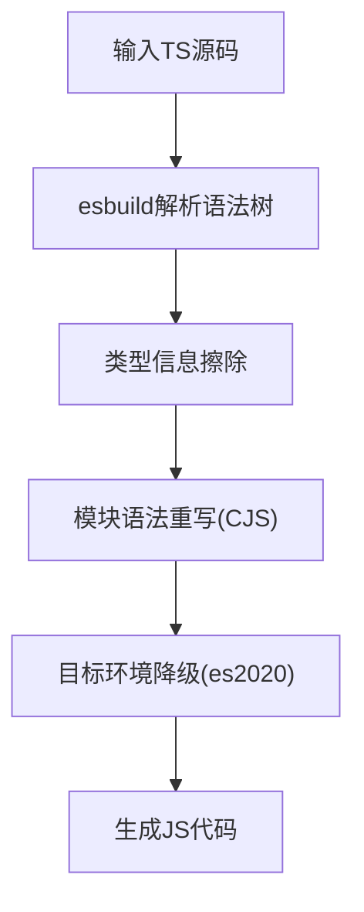
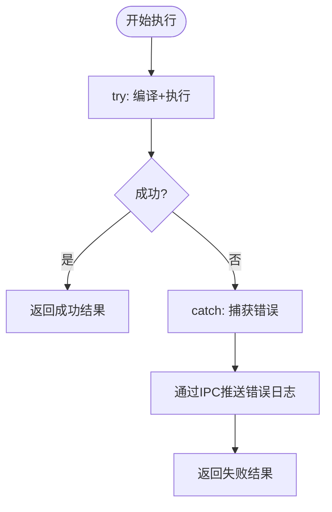
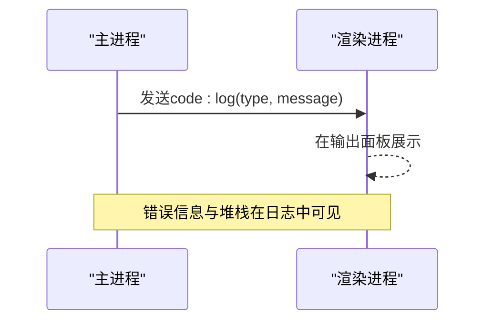
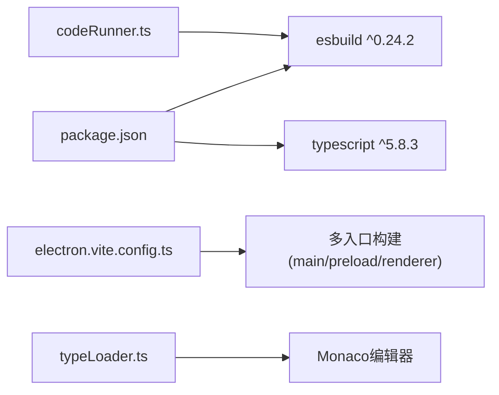

# TypeScript编译处理

<cite>
**本文档引用的文件**
- [package.json](file://package.json)
- [tsconfig.json](file://tsconfig.json)
- [tsconfig.node.json](file://tsconfig.node.json)
- [tsconfig.web.json](file://tsconfig.web.json)
- [electron.vite.config.ts](file://electron.vite.config.ts)
- [src/main/services/codeRunner.ts](file://src/main/services/codeRunner.ts)
- [src/main/services/npmManager.ts](file://src/main/services/npmManager.ts)
- [src/preload/index.ts](file://src/preload/index.ts)
- [src/renderer/src/utils/typeLoader.ts](file://src/renderer/src/utils/typeLoader.ts)
</cite>

## 目录
1. [简介](#简介)
2. [项目结构](#项目结构)
3. [核心组件](#核心组件)
4. [架构总览](#架构总览)
5. [详细组件分析](#详细组件分析)
6. [依赖关系分析](#依赖关系分析)
7. [性能考虑](#性能考虑)
8. [故障排查指南](#故障排查指南)
9. [结论](#结论)
10. [附录](#附录)

## 简介
本文件面向TypeScript编译处理模块，系统性阐述项目中对esbuild的集成方式与编译流水线，覆盖编译配置选项、目标环境设置、模块格式转换、TS到JS转换流程（语法解析、类型擦除、模块重写、代码优化）、错误处理机制、性能优化策略、缓存与增量编译支持，以及调试与用户友好化错误处理。同时提供针对模块导入、装饰器、泛型与高级类型特性的实践指引与示例路径。

## 项目结构
该项目采用Electron + Vite的多入口架构，区分主进程、预加载脚本与渲染进程三类构建目标；TypeScript类型检查通过独立的tsconfig配置进行分层管理；运行时代码执行通过主进程内的esbuild编译器实现即时TS转JS并沙箱执行。

**图表来源**
- [src/main/services/codeRunner.ts:1-461](file://src/main/services/codeRunner.ts#L1-L461)
- [src/main/services/npmManager.ts:1-635](file://src/main/services/npmManager.ts#L1-L635)
- [src/preload/index.ts:1-229](file://src/preload/index.ts#L1-L229)
- [src/renderer/src/utils/typeLoader.ts:1-206](file://src/renderer/src/utils/typeLoader.ts#L1-L206)
- [electron.vite.config.ts:1-49](file://electron.vite.config.ts#L1-L49)

**章节来源**
- [tsconfig.json:1-8](file://tsconfig.json#L1-L8)
- [tsconfig.node.json:1-19](file://tsconfig.node.json#L1-L19)
- [tsconfig.web.json:1-18](file://tsconfig.web.json#L1-L18)
- [electron.vite.config.ts:1-49](file://electron.vite.config.ts#L1-L49)

## 核心组件
- 主进程编译与执行器：负责接收TS/JS代码，通过esbuild进行即时编译，构造沙箱环境执行并捕获输出与错误，同时管理网络服务生命周期。
- NPM包管理器：负责包的安装/卸载/版本切换、类型定义检索与递归收集，支撑运行时require与编辑器智能感知。
- 预加载桥接层：通过contextBridge暴露受控API给渲染进程，统一IPC调用入口。
- 类型加载器：从本地或CDN加载类型定义，注入Monaco编辑器，提升开发体验。

**章节来源**
- [src/main/services/codeRunner.ts:1-461](file://src/main/services/codeRunner.ts#L1-L461)
- [src/main/services/npmManager.ts:1-635](file://src/main/services/npmManager.ts#L1-L635)
- [src/preload/index.ts:1-229](file://src/preload/index.ts#L1-L229)
- [src/renderer/src/utils/typeLoader.ts:1-206](file://src/renderer/src/utils/typeLoader.ts#L1-L206)

## 架构总览
下图展示了从渲染进程发起代码执行请求，到主进程使用esbuild编译、沙箱执行、实时日志回传的完整链路。

**图表来源**
- [src/preload/index.ts:63-69](file://src/preload/index.ts#L63-L69)
- [src/main/services/codeRunner.ts:98-235](file://src/main/services/codeRunner.ts#L98-L235)

## 详细组件分析

### esbuild集成与编译配置
- 编译触发时机：当语言参数为TypeScript时，主进程调用esbuild.transform进行即时编译。
- 关键配置项：
  - loader: 'ts'（启用TS解析）
  - target: 'es2020'（目标运行时环境）
  - format: 'cjs'（模块格式为CommonJS，适配Node沙箱）
- 输出：返回编译后的JavaScript字符串，随后进入沙箱执行。

**图表来源**
- [src/main/services/codeRunner.ts:121-129](file://src/main/services/codeRunner.ts#L121-L129)

**章节来源**
- [src/main/services/codeRunner.ts:121-129](file://src/main/services/codeRunner.ts#L121-L129)

### TS到JS转换流程详解
- 语法解析：由esbuild内部解析TS语法树，支持现代TS特性（如装饰器、泛型、高级类型）。
- 类型擦除：esbuild在编译阶段移除类型信息，保留运行时所需的JavaScript结构。
- 模块重写：将ESM/TS模块语法重写为CommonJS（format=cjs），便于Node VM执行。
- 代码优化：esbuild提供快速的最小化与语法降级能力，满足实时执行场景。

**图表来源**
- [src/main/services/codeRunner.ts:121-129](file://src/main/services/codeRunner.ts#L121-L129)

**章节来源**
- [src/main/services/codeRunner.ts:121-129](file://src/main/services/codeRunner.ts#L121-L129)

### 编译错误处理机制
- 顶层try/catch捕获：编译或执行异常会被捕获并转化为用户可读的错误消息，同时通过IPC实时推送至前端。
- Promise未处理拒绝：对顶层返回的Promise进行await，捕获未处理拒绝并提示。
- 模块加载失败：当require外部模块失败时，给出明确的“未安装/未找到”提示与建议。

**图表来源**
- [src/main/services/codeRunner.ts:220-234](file://src/main/services/codeRunner.ts#L220-L234)

**章节来源**
- [src/main/services/codeRunner.ts:220-234](file://src/main/services/codeRunner.ts#L220-L234)

### 编译性能优化策略
- 即时编译：每次执行均进行编译，适合交互式运行；若需更高性能，可在上层引入缓存与增量编译（见后续建议）。
- 沙箱隔离：使用vm.createContext隔离执行环境，避免污染主进程。
- 并发控制：类型加载器对已安装包采用批量并行加载，限制并发度以平衡速度与资源占用。

**章节来源**
- [src/renderer/src/utils/typeLoader.ts:128-133](file://src/renderer/src/utils/typeLoader.ts#L128-L133)

### 缓存机制与增量编译支持
- 类型缓存：typeLoader维护已加载类型映射，避免重复加载同一包的类型定义。
- NPM类型缓存：npmManager在获取类型时优先读取本地node_modules，减少网络请求。
- 建议增强：
  - 引入esbuild的watch模式或缓存目录，结合文件变更触发增量编译。
  - 对频繁使用的包建立编译缓存，命中则跳过编译直接执行。

**章节来源**
- [src/renderer/src/utils/typeLoader.ts:40-80](file://src/renderer/src/utils/typeLoader.ts#L40-L80)
- [src/main/services/npmManager.ts:428-552](file://src/main/services/npmManager.ts#L428-L552)

### 代码示例与特性覆盖
以下示例路径展示如何处理不同类型的TypeScript代码（请在对应文件中查看具体实现）：
- 模块导入：参考运行时require的安全封装与白名单机制。
  - [createSafeRequire:364-460](file://src/main/services/codeRunner.ts#L364-L460)
- 装饰器：esbuild transform默认支持TS装饰器语法，无需额外配置。
  - [编译配置:121-129](file://src/main/services/codeRunner.ts#L121-L129)
- 泛型与高级类型：esbuild在编译期移除类型信息，不影响运行时行为。
  - [编译配置:121-129](file://src/main/services/codeRunner.ts#L121-L129)
- 服务型代码（如Express）：主进程会跟踪并清理网络服务，避免端口占用。
  - [服务器追踪与清理:29-96](file://src/main/services/codeRunner.ts#L29-L96)

**章节来源**
- [src/main/services/codeRunner.ts:29-96](file://src/main/services/codeRunner.ts#L29-L96)
- [src/main/services/codeRunner.ts:121-129](file://src/main/services/codeRunner.ts#L121-L129)
- [src/main/services/codeRunner.ts:364-460](file://src/main/services/codeRunner.ts#L364-L460)

### 编译产物的调试与错误友好化
- 实时日志：通过IPC向渲染进程推送stdout/stderr，便于调试。
- 用户友好错误：对模块未安装、加载失败等情况给出明确提示与解决建议。
- 端口冲突处理：提供按端口终止进程的能力，避免服务残留。

**图表来源**
- [src/main/services/codeRunner.ts:110-116](file://src/main/services/codeRunner.ts#L110-L116)
- [src/main/services/codeRunner.ts:224-225](file://src/main/services/codeRunner.ts#L224-L225)

**章节来源**
- [src/main/services/codeRunner.ts:110-116](file://src/main/services/codeRunner.ts#L110-L116)
- [src/main/services/codeRunner.ts:224-225](file://src/main/services/codeRunner.ts#L224-L225)

## 依赖关系分析
- esbuild版本：项目使用esbuild ^0.24.2，提供高性能的TS/JS编译能力。
- TypeScript版本：项目使用TypeScript ^5.8.3，配合vue-tsc进行Vue单文件组件类型检查。
- 构建工具：electron-vite负责多入口构建（main、preload、renderer），并提供别名与插件支持。

**图表来源**
- [package.json:40-49](file://package.json#L40-L49)
- [electron.vite.config.ts:1-49](file://electron.vite.config.ts#L1-L49)

**章节来源**
- [package.json:40-49](file://package.json#L40-L49)
- [electron.vite.config.ts:1-49](file://electron.vite.config.ts#L1-L49)

## 性能考虑
- 即时编译成本：每次执行都进行编译，适合交互式场景；若需更高吞吐，建议引入缓存与增量编译。
- 并发与资源：类型加载器限制并发批次，避免阻塞UI；主进程执行设置超时（30秒）防止卡死。
- 网络与磁盘：NPM类型获取优先本地，减少网络开销；安装过程设置超时与错误回退。

**章节来源**
- [src/renderer/src/utils/typeLoader.ts:128-133](file://src/renderer/src/utils/typeLoader.ts#L128-L133)
- [src/main/services/codeRunner.ts:190-201](file://src/main/services/codeRunner.ts#L190-L201)
- [src/main/services/npmManager.ts:188-194](file://src/main/services/npmManager.ts#L188-L194)

## 故障排查指南
- 编译失败：检查loader/target/format配置是否匹配运行环境；确认TS语法是否被esbuild支持。
- 模块未安装：通过NPM面板安装缺失包，或在应用内自动安装@types包。
- 端口占用：使用“按端口终止进程”功能清理残留服务。
- 输出过大：主进程对输出进行截断与格式化，避免UI卡顿。

**章节来源**
- [src/main/services/codeRunner.ts:320-362](file://src/main/services/codeRunner.ts#L320-L362)
- [src/main/services/npmManager.ts:232-267](file://src/main/services/npmManager.ts#L232-L267)
- [src/main/services/codeRunner.ts:248-318](file://src/main/services/codeRunner.ts#L248-L318)

## 结论
本模块通过esbuild实现了高性能的TypeScript即时编译与沙箱执行，结合严格的模块安全封装、实时日志与错误提示，为开发者提供了便捷的代码运行与调试体验。未来可在现有基础上引入缓存与增量编译、更细粒度的错误分类与修复建议，进一步提升性能与易用性。

## 附录
- 构建配置要点
  - 主进程与预加载入口：electron-vite配置了多入口与别名，便于模块化组织。
  - 类型检查：通过独立tsconfig分别管理Node与Web侧类型检查。
- IPC接口
  - 渲染进程通过预加载桥接层调用主进程的代码运行与NPM管理接口。

**章节来源**
- [electron.vite.config.ts:6-48](file://electron.vite.config.ts#L6-L48)
- [tsconfig.json:1-8](file://tsconfig.json#L1-L8)
- [tsconfig.node.json:1-19](file://tsconfig.node.json#L1-L19)
- [tsconfig.web.json:1-18](file://tsconfig.web.json#L1-L18)
- [src/preload/index.ts:62-85](file://src/preload/index.ts#L62-L85)