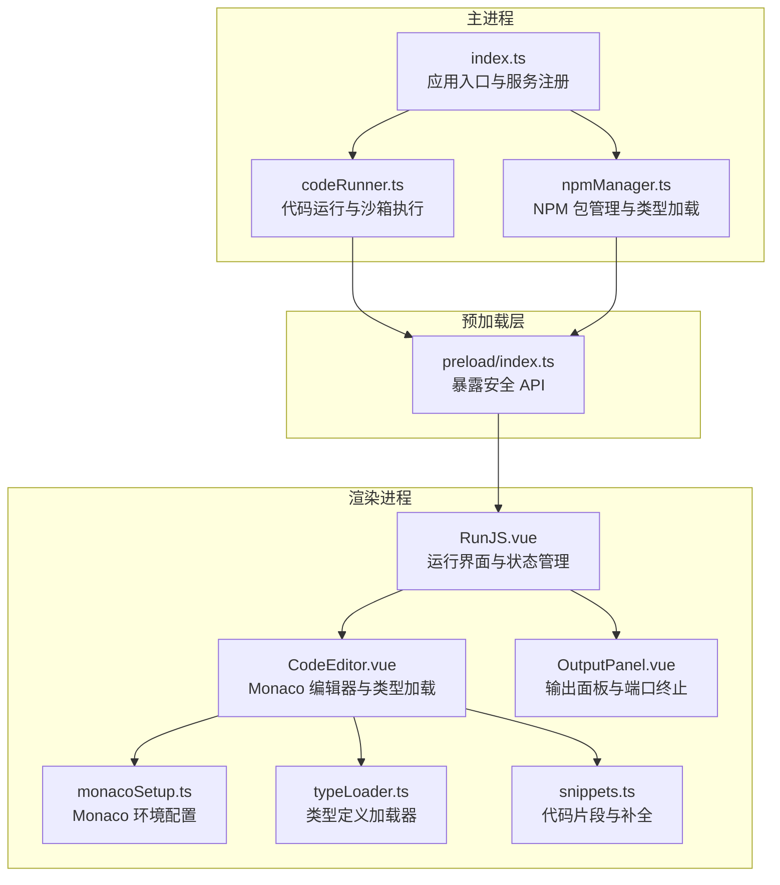
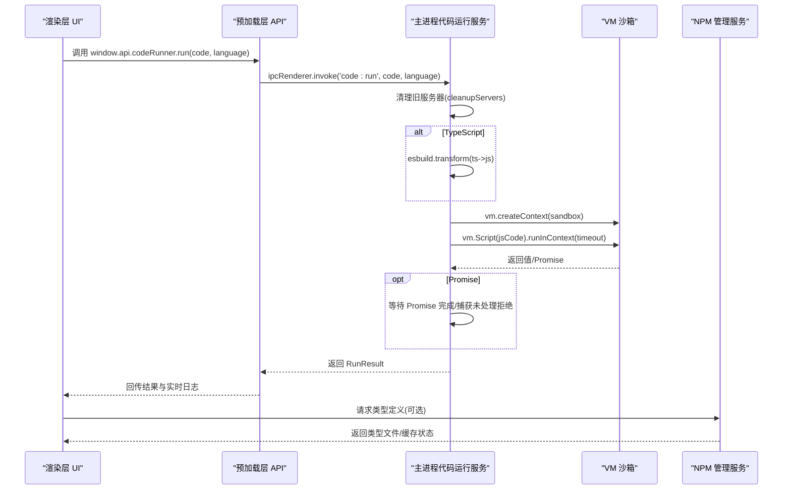
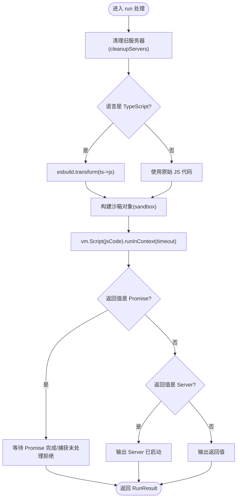
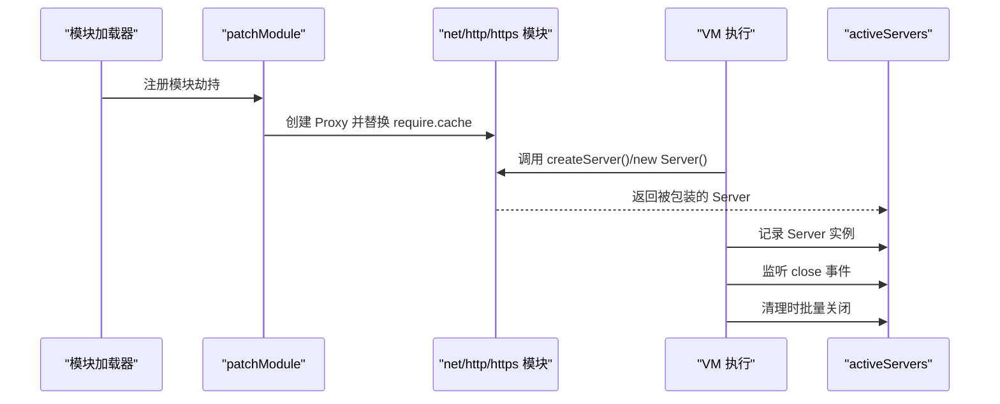
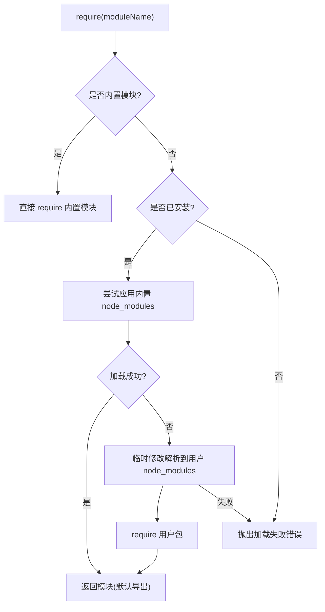
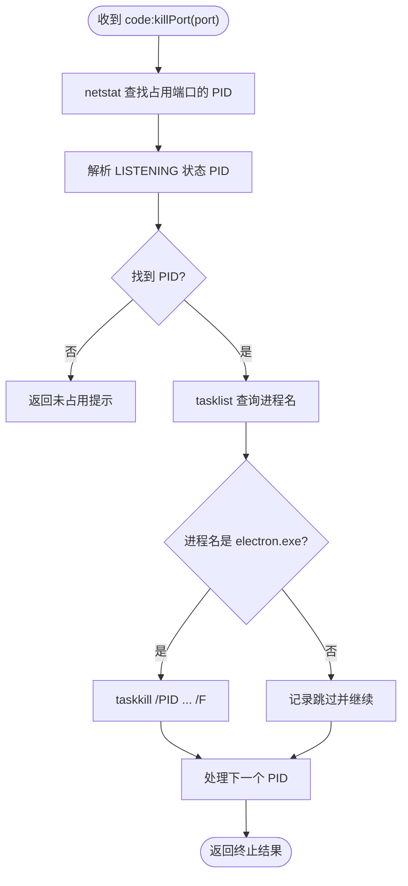
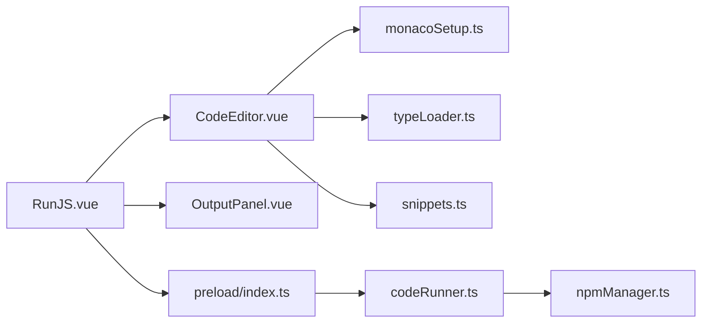

# 代码运行服务

<cite>
**本文档引用的文件**
- [codeRunner.ts](file://src/main/services/codeRunner.ts)
- [index.ts](file://src/main/index.ts)
- [npmManager.ts](file://src/main/services/npmManager.ts)
- [monacoSetup.ts](file://src/renderer/src/utils/monacoSetup.ts)
- [typeLoader.ts](file://src/renderer/src/utils/typeLoader.ts)
- [snippets.ts](file://src/renderer/src/utils/snippets.ts)
- [RunJS.vue](file://src/renderer/src/views/runjs/RunJS.vue)
- [CodeEditor.vue](file://src/renderer/src/views/runjs/Components/CodeEditor.vue)
- [OutputPanel.vue](file://src/renderer/src/views/runjs/Components/OutputPanel.vue)
- [preload/index.ts](file://src/preload/index.ts)
- [package.json](file://package.json)
</cite>

## 目录
1. [简介](#简介)
2. [项目结构](#项目结构)
3. [核心组件](#核心组件)
4. [架构总览](#架构总览)
5. [详细组件分析](#详细组件分析)
6. [依赖关系分析](#依赖关系分析)
7. [性能考量](#性能考量)
8. [故障排查指南](#故障排查指南)
9. [结论](#结论)
10. [附录](#附录)

## 简介
本项目提供一个安全可控的“代码运行服务”，允许在 Electron 主进程中以沙箱方式执行 JavaScript/TypeScript 代码，并提供实时输出捕获、模块安全加载、服务器生命周期管理、端口占用处理、IPC 接口与调试工具集成。核心能力包括：
- 沙箱执行与 VM 上下文隔离
- 模块劫持与代理（http/https/net）
- TypeScript 编译流程（esbuild）
- 安全 require 与 NPM 包加载
- 进程清理与端口占用处理
- IPC 通信接口与渲染层集成
- 实时输出捕获与格式化输出
- 类型定义加载与编辑器智能提示

## 项目结构
项目采用 Electron + Vue3 + Monaco Editor 的架构，主进程负责安全执行与系统交互，渲染进程负责编辑与可视化输出。

图表来源
- [index.ts:1-444](file://src/main/index.ts#L1-L444)
- [codeRunner.ts:1-461](file://src/main/services/codeRunner.ts#L1-L461)
- [npmManager.ts:1-635](file://src/main/services/npmManager.ts#L1-L635)
- [RunJS.vue:1-353](file://src/renderer/src/views/runjs/RunJS.vue#L1-L353)
- [CodeEditor.vue:1-556](file://src/renderer/src/views/runjs/Components/CodeEditor.vue#L1-L556)
- [OutputPanel.vue:1-250](file://src/renderer/src/views/runjs/Components/OutputPanel.vue#L1-L250)
- [monacoSetup.ts:1-76](file://src/renderer/src/utils/monacoSetup.ts#L1-L76)
- [typeLoader.ts:1-206](file://src/renderer/src/utils/typeLoader.ts#L1-L206)
- [snippets.ts:1-169](file://src/renderer/src/utils/snippets.ts#L1-L169)
- [preload/index.ts:1-229](file://src/preload/index.ts#L1-L229)

章节来源
- [index.ts:1-444](file://src/main/index.ts#L1-L444)
- [codeRunner.ts:1-461](file://src/main/services/codeRunner.ts#L1-L461)
- [npmManager.ts:1-635](file://src/main/services/npmManager.ts#L1-L635)
- [RunJS.vue:1-353](file://src/renderer/src/views/runjs/RunJS.vue#L1-L353)
- [CodeEditor.vue:1-556](file://src/renderer/src/views/runjs/Components/CodeEditor.vue#L1-L556)
- [OutputPanel.vue:1-250](file://src/renderer/src/views/runjs/Components/OutputPanel.vue#L1-L250)
- [monacoSetup.ts:1-76](file://src/renderer/src/utils/monacoSetup.ts#L1-L76)
- [typeLoader.ts:1-206](file://src/renderer/src/utils/typeLoader.ts#L1-L206)
- [snippets.ts:1-169](file://src/renderer/src/utils/snippets.ts#L1-L169)
- [preload/index.ts:1-229](file://src/preload/index.ts#L1-L229)

## 核心组件
- 代码运行服务（主进程）：负责沙箱执行、模块劫持、服务器追踪与清理、端口终止、IPC 处理。
- NPM 管理服务（主进程）：负责包安装/卸载/版本切换、类型定义加载与缓存。
- 预加载层（Preload）：安全暴露 IPC API 给渲染进程。
- 渲染层（Vue + Monaco）：提供编辑器、类型加载、输出面板、快捷键与 UI 交互。

章节来源
- [codeRunner.ts:98-318](file://src/main/services/codeRunner.ts#L98-L318)
- [npmManager.ts:207-552](file://src/main/services/npmManager.ts#L207-L552)
- [preload/index.ts:62-69](file://src/preload/index.ts#L62-L69)
- [RunJS.vue:151-181](file://src/renderer/src/views/runjs/RunJS.vue#L151-L181)

## 架构总览
代码运行服务通过 IPC 与渲染层交互，主进程在 VM 沙箱中执行代码，同时劫持 http/https/net 模块以追踪服务器实例，提供统一清理策略；TypeScript 代码通过 esbuild 编译为 CommonJS；NPM 包通过安全 require 与内置白名单加载；输出通过自定义 console 捕获并实时发送到渲染层。

图表来源
- [codeRunner.ts:98-235](file://src/main/services/codeRunner.ts#L98-L235)
- [RunJS.vue:151-172](file://src/renderer/src/views/runjs/RunJS.vue#L151-L172)
- [npmManager.ts:428-552](file://src/main/services/npmManager.ts#L428-L552)

## 详细组件分析

### 沙箱执行机制与 VM 上下文
- VM 上下文创建：主进程构建沙箱对象，包含受限的全局对象、console 代理、process.stdout/stderr 代理、require 安全包装等。
- 代码执行：使用 vm.Script + runInContext 执行，设置超时保护；对顶层 Promise 结果进行等待与错误捕获。
- 输出捕获：自定义 console 将输出通过 IPC 实时发送到渲染层，同时累积到 initialOutputs 以兼容旧逻辑。
- 安全边界：仅暴露必要 API，禁止访问 Node.js 文件系统、网络等敏感模块；require 通过 createSafeRequire 白名单与内置模块控制。

图表来源
- [codeRunner.ts:118-235](file://src/main/services/codeRunner.ts#L118-L235)

章节来源
- [codeRunner.ts:141-181](file://src/main/services/codeRunner.ts#L141-L181)
- [codeRunner.ts:183-201](file://src/main/services/codeRunner.ts#L183-L201)
- [codeRunner.ts:320-362](file://src/main/services/codeRunner.ts#L320-L362)

### 模块劫持与 HTTP/HTTPS/NET 代理
- 全局劫持：在模块加载时对 http/https/net 模块创建 Proxy，拦截 createServer 与 Server 构造函数，包装返回的 Server 实例并加入活动服务器集合。
- 服务器追踪：trackServer 将 Server 实例加入 Set，并在 close 事件时移除，便于统一清理。
- 清理策略：cleanupServers 异步关闭所有活动服务器，等待所有关闭 Promise 完成后清空集合。

图表来源
- [codeRunner.ts:29-75](file://src/main/services/codeRunner.ts#L29-L75)
- [codeRunner.ts:77-96](file://src/main/services/codeRunner.ts#L77-L96)

章节来源
- [codeRunner.ts:29-75](file://src/main/services/codeRunner.ts#L29-L75)
- [codeRunner.ts:77-96](file://src/main/services/codeRunner.ts#L77-L96)

### TypeScript 编译流程
- 编译器：使用 esbuild 将 TypeScript 源码转换为 CommonJS 格式的 JavaScript。
- 目标与格式：目标 ES2020，输出格式为 CommonJS，确保在 VM 环境中可运行。
- 时机：在 run 处理开始阶段，若语言为 TypeScript，则先进行 transform，再进入 VM 执行。

章节来源
- [codeRunner.ts:121-129](file://src/main/services/codeRunner.ts#L121-L129)

### 安全模块加载机制
- 安全 require：createSafeRequire 返回受控的 require 函数，支持内置模块白名单与用户安装包目录优先加载。
- 用户包目录：从 npmManager 获取包安装目录，优先从应用内置 node_modules 加载，失败则尝试用户安装目录。
- 内置模块白名单：包含 fs/path/url/querystring/crypto/util/buffer/stream/events/os/assert/zlib/http/https/net 等常用内置模块。
- 错误处理：对未安装模块抛出明确错误，提示用户在 NPM 面板安装。

图表来源
- [codeRunner.ts:364-460](file://src/main/services/codeRunner.ts#L364-L460)
- [npmManager.ts:120-128](file://src/main/services/npmManager.ts#L120-L128)

章节来源
- [codeRunner.ts:364-460](file://src/main/services/codeRunner.ts#L364-L460)
- [npmManager.ts:120-128](file://src/main/services/npmManager.ts#L120-L128)

### 进程清理策略与端口占用处理
- 服务器清理：每次运行前调用 cleanupServers，异步关闭所有活动服务器，等待完成后清空集合。
- 端口终止：提供 code:killPort IPC，通过 netstat/tasklist 查找并终止占用指定端口的 electron.exe 进程，避免误杀非 Electron 进程。
- 安全性：仅终止 electron.exe，过滤非目标进程；对无结果场景返回明确提示。

图表来源
- [codeRunner.ts:248-317](file://src/main/services/codeRunner.ts#L248-L317)

章节来源
- [codeRunner.ts:248-317](file://src/main/services/codeRunner.ts#L248-L317)

### IPC 通信接口与渲染层集成
- 主进程暴露：ipcMain.handle('code:run', ...)、ipcMain.on('code:stop')、ipcMain.handle('code:clean')、ipcMain.handle('code:killPort', ...)。
- 预加载层封装：window.api.codeRunner.{run, stop, clean, killPort}，统一暴露给渲染层。
- 渲染层调用：RunJS.vue 调用 window.api.codeRunner.run 执行代码，接收实时日志与最终结果；OutputPanel.vue 提供端口终止入口。

章节来源
- [codeRunner.ts:98-318](file://src/main/services/codeRunner.ts#L98-L318)
- [preload/index.ts:62-69](file://src/preload/index.ts#L62-L69)
- [RunJS.vue:151-172](file://src/renderer/src/views/runjs/RunJS.vue#L151-L172)
- [OutputPanel.vue:34-56](file://src/renderer/src/views/runjs/Components/OutputPanel.vue#L34-L56)

### 实时输出捕获与格式化输出
- 输出捕获：自定义 console 将 log/error/warn/info/dir/table 输出通过 IPC 发送到渲染层，同时累积到 initialOutputs。
- 格式化：formatOutput 对各种类型进行格式化，限制数组/对象输出长度，特殊处理 Server 对象与 Error 对象，避免输出巨大 JSON。
- 渲染层展示：RunJS.vue 与 OutputPanel.vue 接收实时日志并展示，支持运行时间、错误高亮与清空输出。

章节来源
- [codeRunner.ts:110-116](file://src/main/services/codeRunner.ts#L110-L116)
- [codeRunner.ts:320-362](file://src/main/services/codeRunner.ts#L320-L362)
- [RunJS.vue:151-172](file://src/renderer/src/views/runjs/RunJS.vue#L151-L172)
- [OutputPanel.vue:17-56](file://src/renderer/src/views/runjs/Components/OutputPanel.vue#L17-L56)

### 类型定义加载与编辑器集成
- 类型加载：typeLoader.ts 从 npmManager 获取类型定义，支持本地 node_modules 与 CDN 源，添加到 Monaco 编辑器。
- 并发控制：加载已安装包类型时分批并发，避免阻塞。
- 代码分析：从代码中提取 require/import 的包名，按需加载类型定义。
- 编辑器配置：monacoSetup.ts 配置 TypeScript/JavaScript 编译选项与 Worker，启用同步模型与智能提示。

章节来源
- [typeLoader.ts:68-103](file://src/renderer/src/utils/typeLoader.ts#L68-L103)
- [typeLoader.ts:122-139](file://src/renderer/src/utils/typeLoader.ts#L122-L139)
- [typeLoader.ts:174-184](file://src/renderer/src/utils/typeLoader.ts#L174-L184)
- [monacoSetup.ts:21-73](file://src/renderer/src/utils/monacoSetup.ts#L21-L73)

### 错误处理机制
- 顶层错误：VM 执行异常被捕获，实时发送错误到渲染层，并返回包含错误信息的结果。
- 未处理 Promise：对顶层 Promise 的拒绝进行捕获并输出提示。
- 端口终止错误：对 netstat/tasklist 执行异常进行兜底处理，返回明确错误信息。
- NPM 加载错误：对 require 失败抛出明确提示，引导用户安装包。

章节来源
- [codeRunner.ts:220-233](file://src/main/services/codeRunner.ts#L220-L233)
- [codeRunner.ts:194-201](file://src/main/services/codeRunner.ts#L194-L201)
- [codeRunner.ts:307-317](file://src/main/services/codeRunner.ts#L307-L317)
- [codeRunner.ts:444-459](file://src/main/services/codeRunner.ts#L444-L459)

## 依赖关系分析
- 主进程依赖：Electron IPC、vm、esbuild、net/http/https、path、child_process（端口终止）、npmManager。
- 渲染进程依赖：Monaco Editor、Vue3、TypeLoader、Snippets、MonacoSetup。
- 依赖图（简化）：

图表来源
- [RunJS.vue:1-353](file://src/renderer/src/views/runjs/RunJS.vue#L1-L353)
- [CodeEditor.vue:1-556](file://src/renderer/src/views/runjs/Components/CodeEditor.vue#L1-L556)
- [OutputPanel.vue:1-250](file://src/renderer/src/views/runjs/Components/OutputPanel.vue#L1-L250)
- [monacoSetup.ts:1-76](file://src/renderer/src/utils/monacoSetup.ts#L1-L76)
- [typeLoader.ts:1-206](file://src/renderer/src/utils/typeLoader.ts#L1-L206)
- [snippets.ts:1-169](file://src/renderer/src/utils/snippets.ts#L1-L169)
- [preload/index.ts:1-229](file://src/preload/index.ts#L1-L229)
- [codeRunner.ts:1-461](file://src/main/services/codeRunner.ts#L1-L461)
- [npmManager.ts:1-635](file://src/main/services/npmManager.ts#L1-L635)

章节来源
- [package.json:28-51](file://package.json#L28-L51)

## 性能考量
- VM 超时：runInContext 设置 30 秒超时，防止长时间运行阻塞。
- 并发加载：类型定义加载采用分批并发，避免阻塞 UI。
- 输出限制：formatOutput 对大对象/数组进行截断，避免渲染层卡顿。
- 服务器清理：异步批量关闭，减少阻塞。
- 编译优化：esbuild transform 速度快，适合开发场景即时编译。

## 故障排查指南
- 无法运行代码
  - 检查是否选择了正确的语言（JavaScript/TypeScript）。
  - 查看实时输出面板是否有错误信息。
  - 若为 TypeScript，确认 esbuild 是否正常工作。
- 端口被占用
  - 使用 OutputPanel 的“终止端口”功能，输入端口号后执行。
  - 确认进程名是 electron.exe，避免误杀其他服务。
- 模块未安装
  - 在 NPM 面板搜索并安装所需包，或使用内置包（如 lodash、axios、express）。
  - 重启应用后再次尝试加载。
- 输出过大导致卡顿
  - 检查输出内容，避免打印大型对象/数组；使用 formatOutput 的限制策略。
- 编辑器类型提示缺失
  - 确认已安装对应包的类型定义；等待类型加载完成；必要时手动触发类型加载。

章节来源
- [codeRunner.ts:248-317](file://src/main/services/codeRunner.ts#L248-L317)
- [codeRunner.ts:444-459](file://src/main/services/codeRunner.ts#L444-L459)
- [typeLoader.ts:122-139](file://src/renderer/src/utils/typeLoader.ts#L122-L139)

## 结论
代码运行服务通过 VM 沙箱、模块劫持、安全 require、类型加载与端口清理等机制，实现了在 Electron 主进程中的安全、可控、可观测的代码执行体验。结合 Monaco 编辑器与实时输出面板，为开发者提供了高效、直观的开发与调试环境。建议在生产环境中进一步强化超时与内存监控，并持续优化类型加载策略以提升性能。

## 附录

### 使用示例（路径参考）
- 同步执行
  - 路径参考：[RunJS.vue:151-172](file://src/renderer/src/views/runjs/RunJS.vue#L151-L172)
  - IPC 调用：window.api.codeRunner.run(code, language)
- 异步 Promise 处理
  - 路径参考：[codeRunner.ts:192-201](file://src/main/services/codeRunner.ts#L192-L201)
  - 说明：顶层 Promise 会被等待并捕获未处理拒绝
- 服务器监听与资源清理
  - 路径参考：[codeRunner.ts:186-211](file://src/main/services/codeRunner.ts#L186-L211)
  - 清理：window.api.codeRunner.clean() 或在下次运行前自动清理
- 端口占用处理
  - 路径参考：[OutputPanel.vue:34-56](file://src/renderer/src/views/runjs/Components/OutputPanel.vue#L34-L56)
  - IPC 调用：window.api.codeRunner.killPort(port)
- 实时输出捕获与格式化
  - 路径参考：[codeRunner.ts:110-116](file://src/main/services/codeRunner.ts#L110-L116), [codeRunner.ts:320-362](file://src/main/services/codeRunner.ts#L320-L362)
- 调试工具集成
  - 路径参考：[monacoSetup.ts:21-73](file://src/renderer/src/utils/monacoSetup.ts#L21-L73), [typeLoader.ts:68-103](file://src/renderer/src/utils/typeLoader.ts#L68-L103)