# 模块安全加载

<cite>
**本文档引用的文件**
- [codeRunner.ts](file://src/main/services/codeRunner.ts)
- [npmManager.ts](file://src/main/services/npmManager.ts)
- [httpClient.ts](file://src/main/services/httpClient.ts)
</cite>

## 目录
1. [简介](#简介)
2. [项目结构](#项目结构)
3. [核心组件](#核心组件)
4. [架构概览](#架构概览)
5. [详细组件分析](#详细组件分析)
6. [依赖关系分析](#依赖关系分析)
7. [性能考虑](#性能考虑)
8. [故障排除指南](#故障排除指南)
9. [结论](#结论)

## 简介

模块安全加载系统是开发者工具箱中的核心安全机制，负责在受控的沙箱环境中安全地加载和执行第三方模块。该系统通过严格的白名单验证、路径重写策略和模块缓存机制，确保代码执行的安全性和稳定性。

系统主要包含以下关键功能：
- 安全的模块加载器 `createSafeRequire` 函数
- 内置模块和第三方模块的双重验证机制
- 模块解析和路径重写策略
- 模块缓存和循环依赖检测
- 动态导入支持和错误处理策略
- 权限控制和依赖注入机制

## 项目结构

模块安全加载系统主要分布在以下文件中：

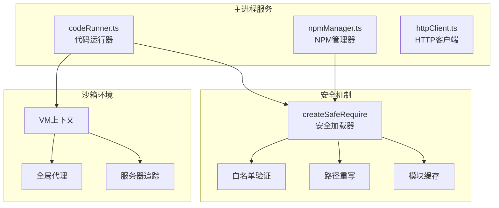

**图表来源**
- [codeRunner.ts:364-461](file://src/main/services/codeRunner.ts#L364-L461)
- [npmManager.ts:120-128](file://src/main/services/npmManager.ts#L120-L128)

**章节来源**
- [codeRunner.ts:1-461](file://src/main/services/codeRunner.ts#L1-L461)
- [npmManager.ts:1-635](file://src/main/services/npmManager.ts#L1-L635)

## 核心组件

### createSafeRequire 函数

`createSafeRequire` 是整个安全加载系统的核心，它创建了一个受控的模块加载器，专门用于在沙箱环境中安全地加载模块。

#### 主要特性

1. **白名单验证**：严格检查模块是否在允许列表中
2. **路径重写**：动态修改模块解析逻辑
3. **ESM兼容**：自动处理ES模块的默认导出
4. **错误处理**：提供详细的错误信息和恢复机制

#### 实现架构

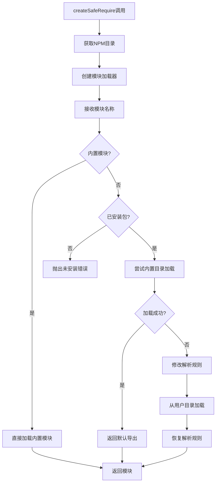

**图表来源**
- [codeRunner.ts:364-461](file://src/main/services/codeRunner.ts#L364-L461)

**章节来源**
- [codeRunner.ts:364-461](file://src/main/services/codeRunner.ts#L364-L461)

## 架构概览

模块安全加载系统采用分层架构设计，确保每个组件都有明确的职责和边界。

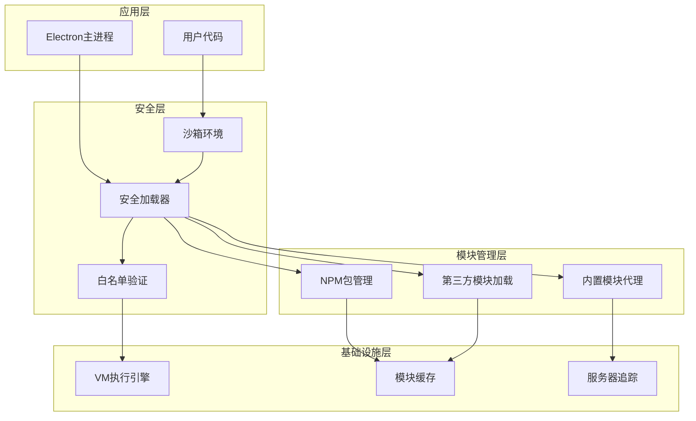

**图表来源**
- [codeRunner.ts:141-181](file://src/main/services/codeRunner.ts#L141-L181)
- [codeRunner.ts:364-461](file://src/main/services/codeRunner.ts#L364-L461)

## 详细组件分析

### 安全加载器实现

#### 白名单验证机制

系统维护两个关键的白名单集合：

1. **内置模块白名单**：包含 Node.js 核心模块
2. **已安装包白名单**：基于用户安装的第三方包

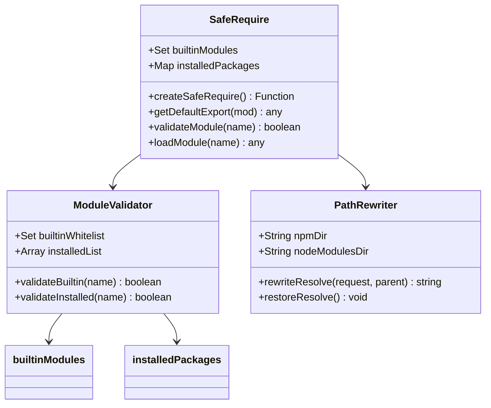

**图表来源**
- [codeRunner.ts:364-461](file://src/main/services/codeRunner.ts#L364-L461)
- [npmManager.ts:120-128](file://src/main/services/npmManager.ts#L120-L128)

#### 路径重写策略

系统通过临时修改 `Module._resolveFilename` 方法来实现精确的路径重写：

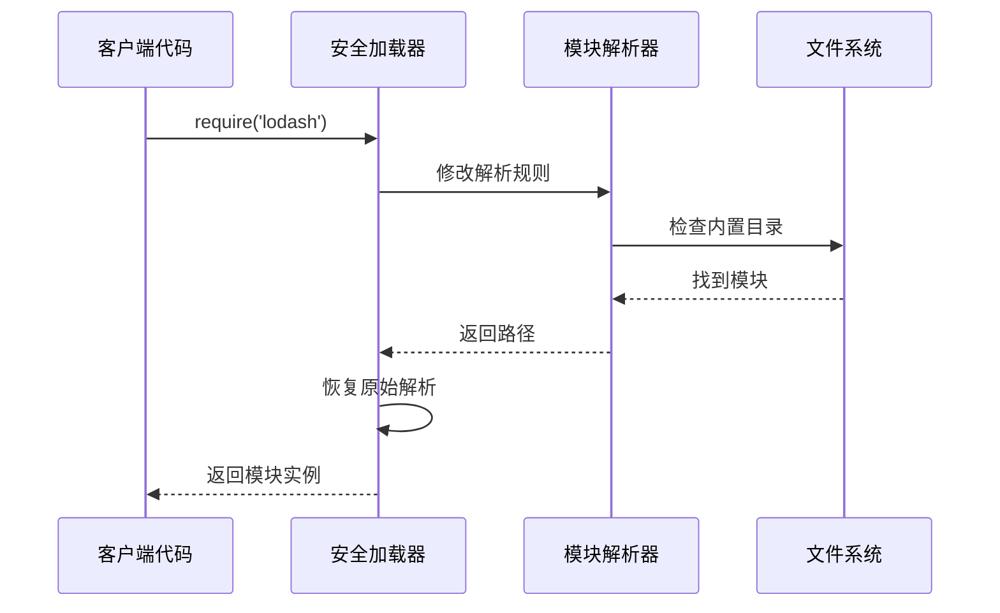

**图表来源**
- [codeRunner.ts:423-443](file://src/main/services/codeRunner.ts#L423-L443)

**章节来源**
- [codeRunner.ts:364-461](file://src/main/services/codeRunner.ts#L364-L461)

### 内置模块和第三方模块的安全加载

#### 内置模块处理

内置模块（如 fs、path、http 等）通过直接调用原生 `require` 方法加载，但经过白名单验证：

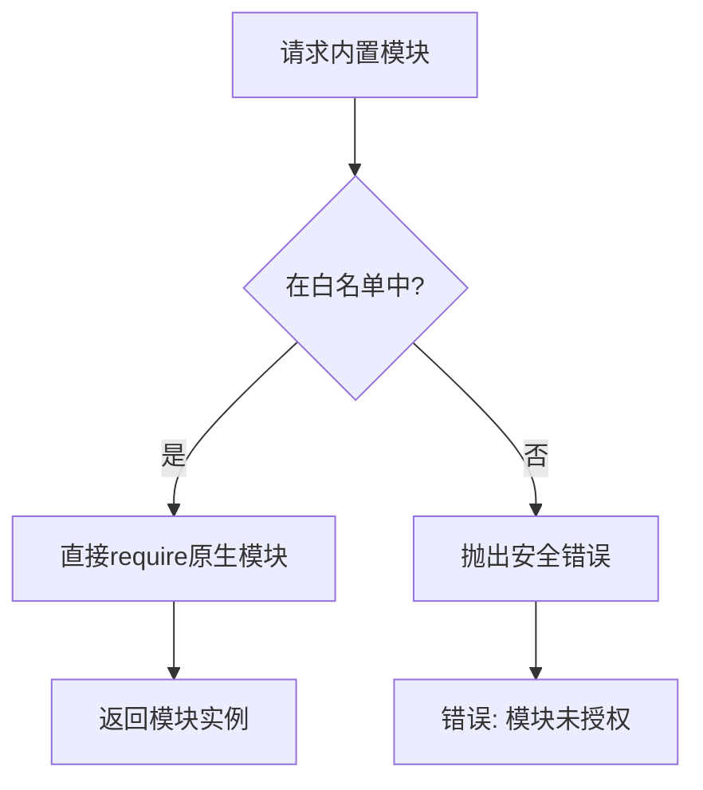

**图表来源**
- [codeRunner.ts:400-405](file://src/main/services/codeRunner.ts#L400-L405)

#### 第三方模块处理

第三方模块的加载流程更加复杂，包含多层验证和回退机制：

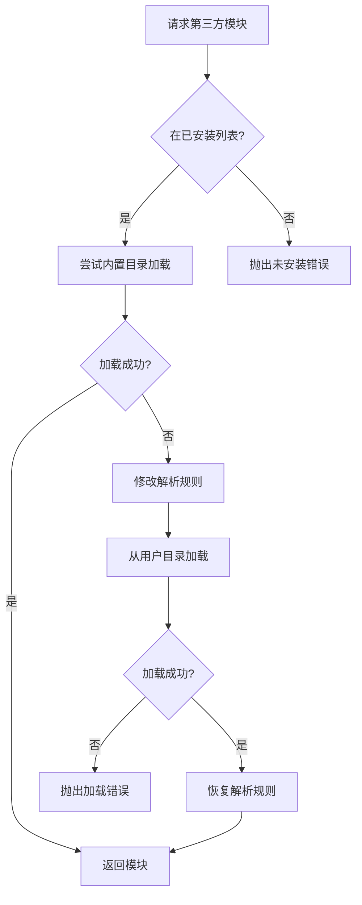

**图表来源**
- [codeRunner.ts:407-451](file://src/main/services/codeRunner.ts#L407-L451)

**章节来源**
- [codeRunner.ts:373-451](file://src/main/services/codeRunner.ts#L373-L451)

### 模块缓存机制

系统利用 Node.js 的 `require.cache` 机制来实现高效的模块缓存：

#### 缓存策略

1. **全局缓存**：利用 Node.js 默认的模块缓存
2. **代理缓存**：对特定模块（http/https/net）进行缓存代理
3. **失效机制**：支持模块的重新加载和清理

#### 服务器追踪机制

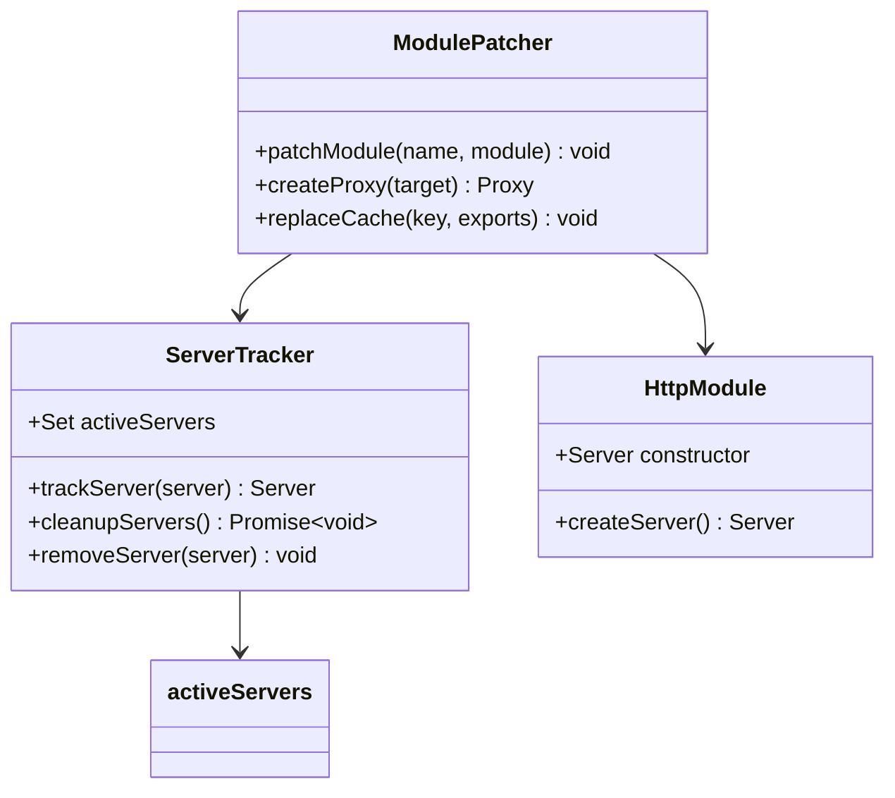

**图表来源**
- [codeRunner.ts:29-75](file://src/main/services/codeRunner.ts#L29-L75)

**章节来源**
- [codeRunner.ts:29-75](file://src/main/services/codeRunner.ts#L29-L75)

### 循环依赖检测

系统通过以下机制来处理和检测循环依赖：

1. **类型文件递归解析**：使用深度优先搜索遍历类型文件依赖
2. **访问标记**：使用 `visited` 集合防止重复访问
3. **异常处理**：捕获解析过程中的各种异常

**章节来源**
- [npmManager.ts:557-634](file://src/main/services/npmManager.ts#L557-L634)

### 动态导入支持

系统支持动态导入（Dynamic Import），通过 ES6 的 `import()` 语法实现：

#### ESM兼容性处理

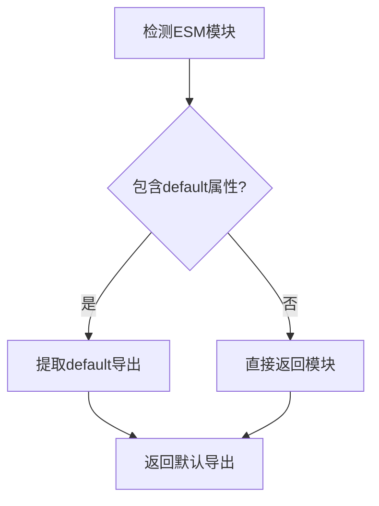

**图表来源**
- [codeRunner.ts:393-398](file://src/main/services/codeRunner.ts#L393-L398)

**章节来源**
- [codeRunner.ts:392-398](file://src/main/services/codeRunner.ts#L392-L398)

### 错误处理策略

系统实现了多层次的错误处理机制：

#### 错误分类

1. **模块未安装错误**：提供安装指导
2. **模块加载失败**：显示详细错误信息
3. **权限不足错误**：提示用户检查权限
4. **超时错误**：提供超时处理

#### 错误恢复机制

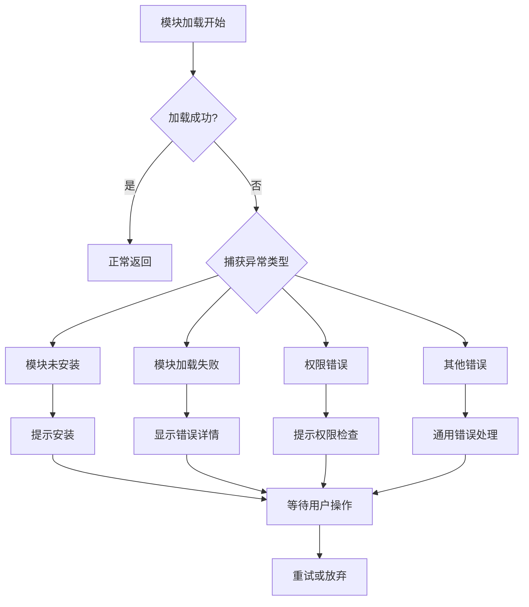

**图表来源**
- [codeRunner.ts:444-458](file://src/main/services/codeRunner.ts#L444-L458)

**章节来源**
- [codeRunner.ts:444-458](file://src/main/services/codeRunner.ts#L444-L458)

## 依赖关系分析

模块安全加载系统与其他组件的依赖关系如下：

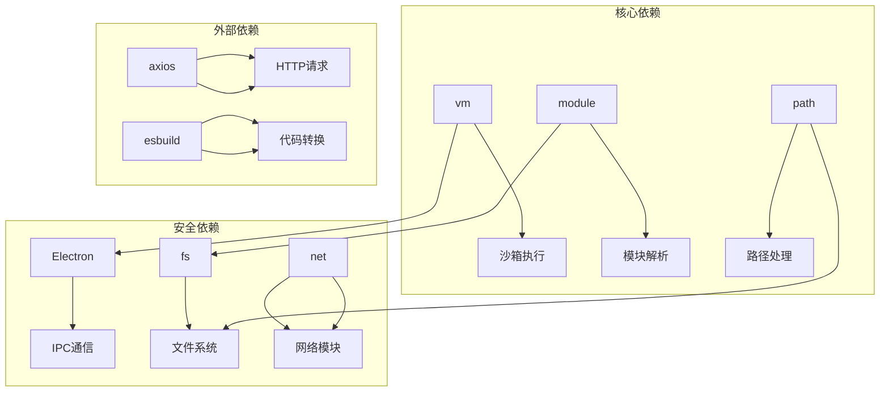

**图表来源**
- [codeRunner.ts:1-12](file://src/main/services/codeRunner.ts#L1-L12)
- [npmManager.ts:1-6](file://src/main/services/npmManager.ts#L1-L6)

**章节来源**
- [codeRunner.ts:1-12](file://src/main/services/codeRunner.ts#L1-L12)
- [npmManager.ts:1-6](file://src/main/services/npmManager.ts#L1-L6)

## 性能考虑

### 模块加载优化

1. **缓存利用**：充分利用 Node.js 的模块缓存机制
2. **延迟加载**：只在需要时才加载模块
3. **批量操作**：支持多个模块的批量安装和管理

### 内存管理

1. **服务器清理**：自动跟踪和清理活动的服务器实例
2. **资源回收**：定期清理不再使用的模块缓存
3. **内存监控**：监控内存使用情况，防止内存泄漏

### 并发处理

1. **异步操作**：所有 I/O 操作都是异步的
2. **超时控制**：设置合理的超时时间
3. **并发限制**：限制同时进行的操作数量

## 故障排除指南

### 常见问题及解决方案

#### 模块加载失败

**症状**：`模块 "${moduleName}" 加载失败`

**可能原因**：
1. 模块未正确安装
2. 路径解析错误
3. 权限不足

**解决步骤**：
1. 检查模块是否在已安装列表中
2. 确认模块路径是否正确
3. 验证文件系统权限

#### 服务器无法启动

**症状**：端口被占用或服务器启动失败

**解决步骤**：
1. 使用 `code:killPort` IPC 处理程序终止占用端口的进程
2. 检查防火墙设置
3. 验证端口可用性

#### 类型定义加载问题

**症状**：无法获取或加载类型定义文件

**解决步骤**：
1. 检查 `@types` 包是否正确安装
2. 验证类型文件路径
3. 清除类型缓存并重新加载

**章节来源**
- [codeRunner.ts:249-317](file://src/main/services/codeRunner.ts#L249-L317)
- [npmManager.ts:428-552](file://src/main/services/npmManager.ts#L428-L552)

## 结论

模块安全加载系统通过精心设计的安全机制，为开发者提供了一个既强大又安全的模块加载环境。系统的主要优势包括：

1. **安全性**：严格的白名单验证和路径重写机制
2. **可靠性**：完善的错误处理和恢复机制
3. **性能**：高效的模块缓存和优化策略
4. **兼容性**：支持 CommonJS 和 ES 模块的混合使用
5. **可维护性**：清晰的架构设计和模块化组织

该系统为开发者工具箱提供了坚实的基础，使得用户可以在安全的环境中自由地探索和使用各种第三方模块，同时确保应用程序的整体稳定性和安全性。