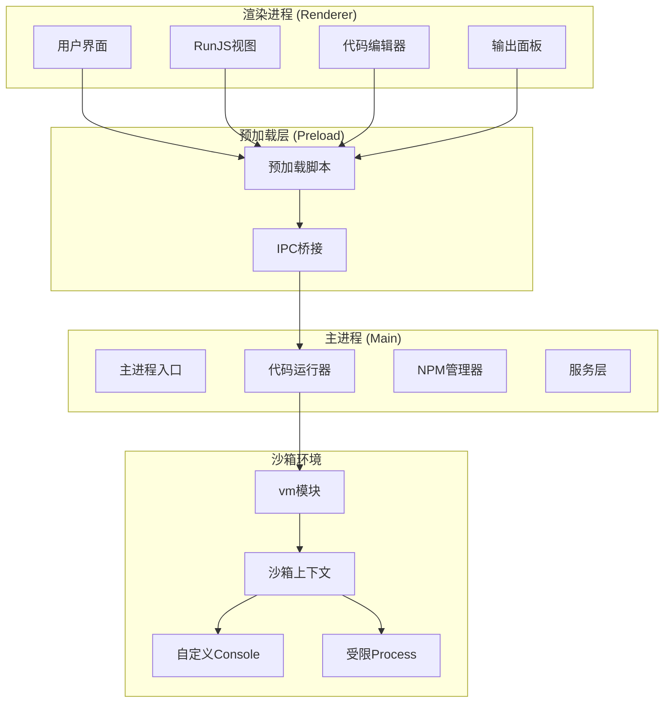
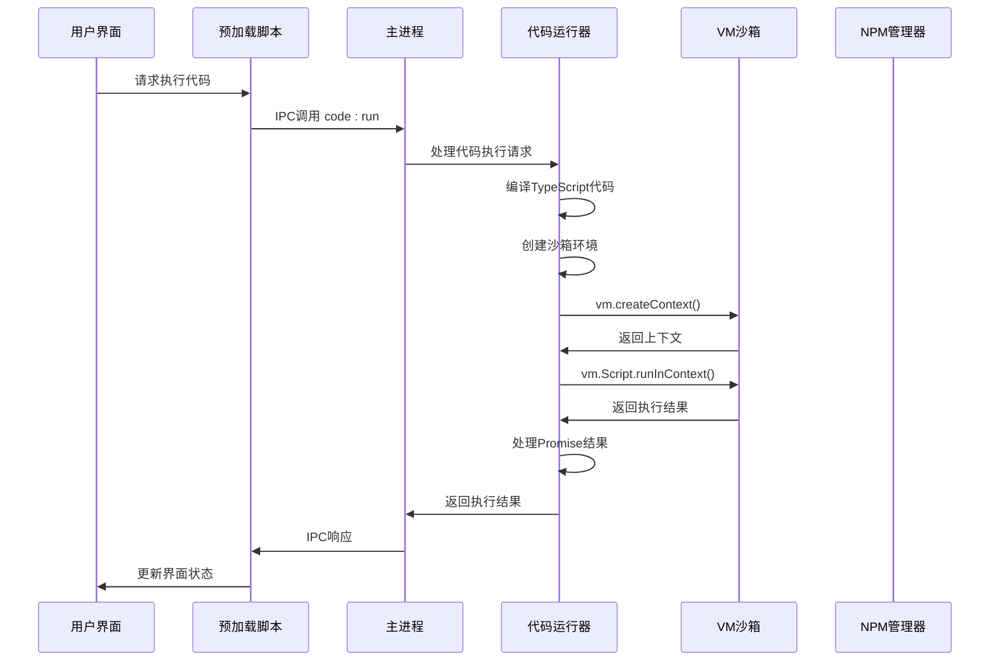
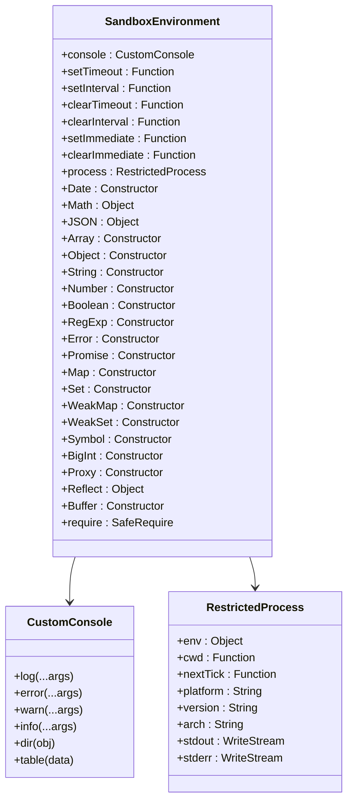
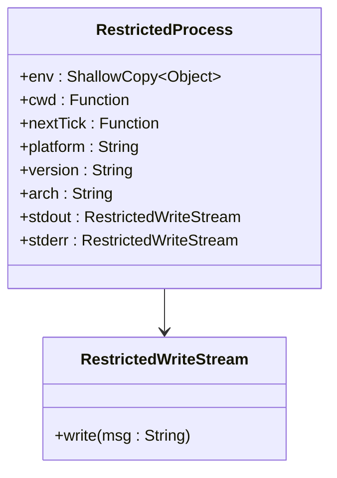
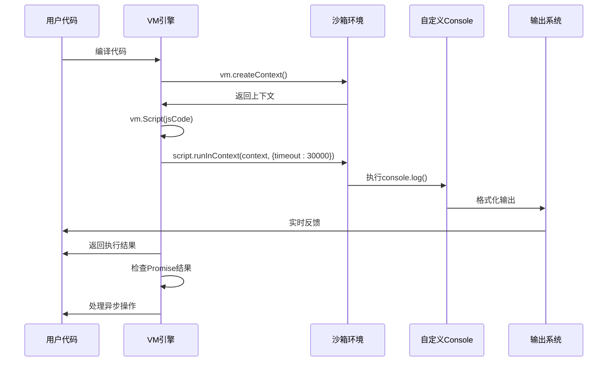
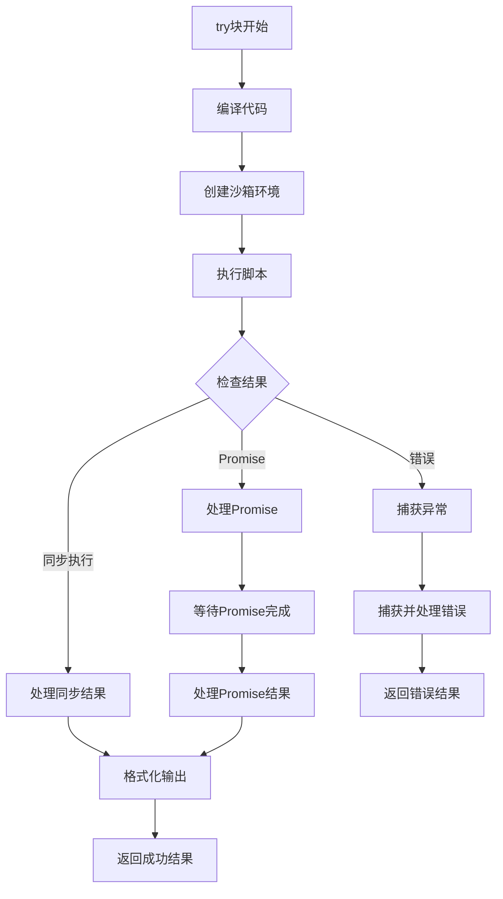
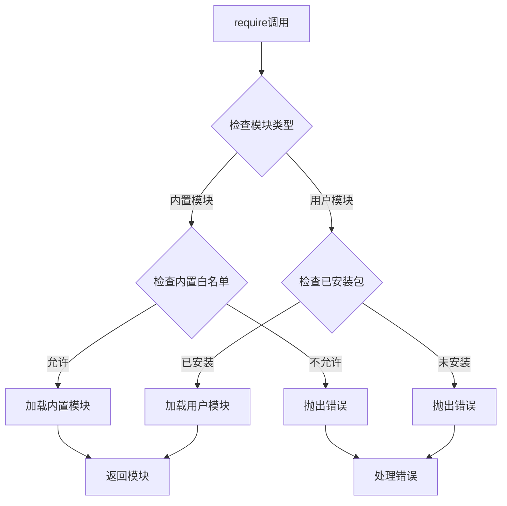
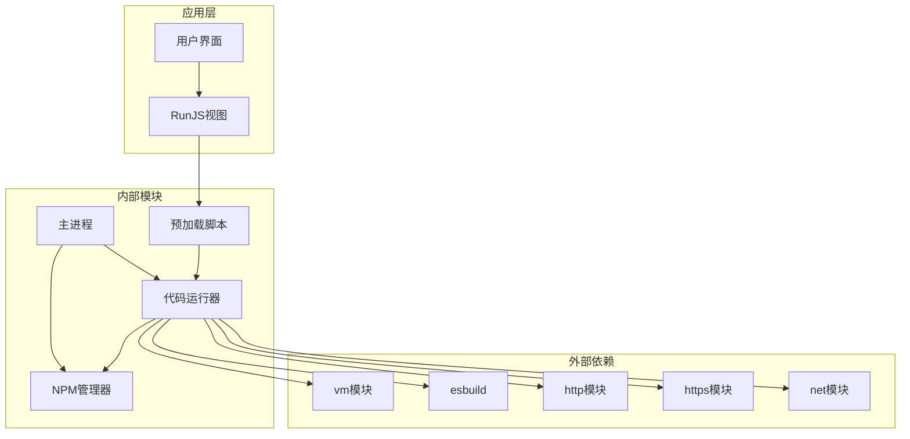
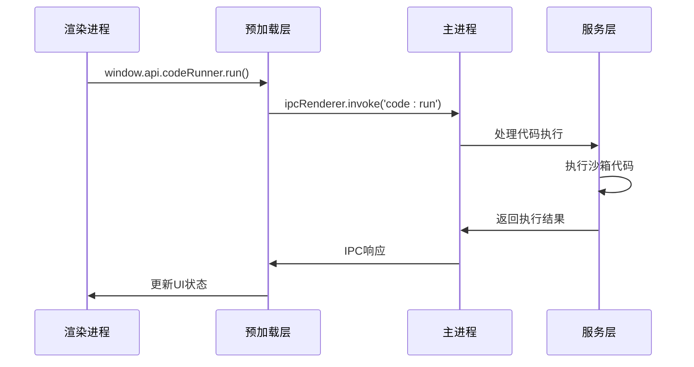

# 沙箱执行引擎

<cite>
**本文档引用的文件**
- [codeRunner.ts](file://src/main/services/codeRunner.ts)
- [npmManager.ts](file://src/main/services/npmManager.ts)
- [index.ts](file://src/main/index.ts)
- [index.ts](file://src/preload/index.ts)
- [RunJS.vue](file://src/renderer/src/views/runjs/RunJS.vue)
- [package.json](file://package.json)
</cite>

## 目录
1. [简介](#简介)
2. [项目结构](#项目结构)
3. [核心组件](#核心组件)
4. [架构概览](#架构概览)
5. [详细组件分析](#详细组件分析)
6. [依赖关系分析](#依赖关系分析)
7. [性能考虑](#性能考虑)
8. [故障排除指南](#故障排除指南)
9. [结论](#结论)

## 简介

沙箱执行引擎是开发者工具箱项目中的核心安全执行组件，负责在受控的隔离环境中安全地执行用户代码。该引擎基于Node.js的vm模块构建，提供了完整的代码执行、安全隔离、资源管理和错误处理机制。

该系统的主要特点包括：
- 基于vm.createContext的严格沙箱隔离
- 全局对象白名单机制
- 自定义console代理实现
- 进程对象受限访问控制
- 定时器函数安全包装
- 模块加载白名单管理
- 超时控制和资源清理

## 项目结构

项目采用Electron架构，主要分为三个层次：



**图表来源**
- [index.ts:110-127](file://src/main/index.ts#L110-L127)
- [index.ts:1-229](file://src/preload/index.ts#L1-L229)
- [codeRunner.ts:1-461](file://src/main/services/codeRunner.ts#L1-L461)

**章节来源**
- [index.ts:1-444](file://src/main/index.ts#L1-L444)
- [package.json:1-120](file://package.json#L1-L120)

## 核心组件

### 1. 代码运行器 (CodeRunner)

代码运行器是沙箱执行引擎的核心组件，负责：
- 代码编译和转换
- 沙箱环境创建
- 代码执行和监控
- 资源管理和清理

### 2. NPM包管理器

提供安全的第三方包加载机制：
- 包安装和卸载
- 版本管理
- 类型定义支持
- 包目录管理

### 3. 预加载脚本

建立安全的IPC通信桥梁：
- API暴露控制
- 安全上下文隔离
- 权限管理

**章节来源**
- [codeRunner.ts:98-318](file://src/main/services/codeRunner.ts#L98-L318)
- [npmManager.ts:207-552](file://src/main/services/npmManager.ts#L207-L552)
- [index.ts:1-229](file://src/preload/index.ts#L1-L229)

## 架构概览

沙箱执行引擎采用分层架构设计，确保代码执行的安全性和可控性：



**图表来源**
- [codeRunner.ts:98-235](file://src/main/services/codeRunner.ts#L98-L235)
- [index.ts:62-69](file://src/preload/index.ts#L62-L69)

## 详细组件分析

### vm.createContext沙箱环境创建

#### 沙箱环境初始化

代码运行器通过精心设计的沙箱环境来确保代码执行的安全性：



**图表来源**
- [codeRunner.ts:141-181](file://src/main/services/codeRunner.ts#L141-L181)

#### 安全上下文隔离机制

沙箱环境通过以下方式实现严格的安全隔离：

1. **全局对象白名单**：仅暴露必要的全局对象
2. **进程对象受限**：限制process对象的访问能力
3. **自定义console代理**：完全控制输出流
4. **模块加载控制**：实现安全的模块加载机制

**章节来源**
- [codeRunner.ts:141-184](file://src/main/services/codeRunner.ts#L141-L184)

### console对象代理实现

#### 自定义Console实现

代码运行器实现了高度定制化的console对象代理：

```mermaid
flowchart TD
Start([创建自定义Console]) --> Log[log方法]
Start --> Error[error方法]
Start --> Warn[warn方法]
Start --> Info[info方法]
Start --> Dir[dir方法]
Start --> Table[table方法]
Log --> SendLog1[sendLog('stdout', ...args)]
Error --> SendLog2[sendLog('stderr', ...args)]
Warn --> SendLog3[sendLog('stderr', '[Warn]', ...args)]
Info --> SendLog4[sendLog('stdout', '[Info]', ...args)]
Dir --> SendLog5[sendLog('stdout', formatOutput(obj))]
Table --> SendLog6[sendLog('stdout', formatOutput(data))]
SendLog1 --> Realtime1[实时发送到前端]
SendLog2 --> Realtime2[实时发送到前端]
SendLog3 --> Realtime3[实时发送到前端]
SendLog4 --> Realtime4[实时发送到前端]
SendLog5 --> Realtime5[实时发送到前端]
SendLog6 --> Realtime6[实时发送到前端]
Realtime1 --> Collect1[收集到初始输出]
Realtime2 --> Collect2[收集到初始输出]
Realtime3 --> Collect3[收集到初始输出]
Realtime4 --> Collect4[收集到初始输出]
Realtime5 --> Collect5[收集到初始输出]
Realtime6 --> Collect6[收集到初始输出]
```

**图表来源**
- [codeRunner.ts:131-139](file://src/main/services/codeRunner.ts#L131-L139)

#### 输出格式化和限制

输出系统包含智能的格式化和大小限制机制：

**章节来源**
- [codeRunner.ts:320-362](file://src/main/services/codeRunner.ts#L320-L362)

### 沙箱中的安全边界设计

#### process对象的受限访问

process对象经过精心设计的限制：



**图表来源**
- [codeRunner.ts:150-159](file://src/main/services/codeRunner.ts#L150-L159)

#### 定时器函数的安全包装

定时器函数通过直接引用原生函数实现安全包装：

**章节来源**
- [codeRunner.ts:144-149](file://src/main/services/codeRunner.ts#L144-L149)

#### Buffer和Symbol等特殊对象的处理

系统对特殊JavaScript对象进行了专门处理：

**章节来源**
- [codeRunner.ts:175-179](file://src/main/services/codeRunner.ts#L175-L179)

### VM脚本执行流程

#### 代码执行生命周期



**图表来源**
- [codeRunner.ts:183-201](file://src/main/services/codeRunner.ts#L183-L201)

**章节来源**
- [codeRunner.ts:183-190](file://src/main/services/codeRunner.ts#L183-L190)

### 超时控制机制

#### 执行超时保护

系统实现了严格的执行超时控制：

**章节来源**
- [codeRunner.ts](file://src/main/services/codeRunner.ts#L190)

### 内存限制策略

#### 资源管理策略

系统通过多种机制实现资源的有效管理：

**章节来源**
- [codeRunner.ts:21-36](file://src/main/services/codeRunner.ts#L21-L36)

### 异常捕获处理

#### 错误处理机制



**图表来源**
- [codeRunner.ts:118-234](file://src/main/services/codeRunner.ts#L118-L234)

**章节来源**
- [codeRunner.ts:220-233](file://src/main/services/codeRunner.ts#L220-L233)

### 模块加载白名单机制

#### 安全模块加载



**图表来源**
- [codeRunner.ts:364-460](file://src/main/services/codeRunner.ts#L364-L460)

**章节来源**
- [codeRunner.ts:364-460](file://src/main/services/codeRunner.ts#L364-L460)

### HTTP服务器追踪机制

#### 网络服务安全控制

系统实现了对HTTP服务器的全面追踪和管理：

**章节来源**
- [codeRunner.ts:29-96](file://src/main/services/codeRunner.ts#L29-L96)

## 依赖关系分析

### 核心依赖关系



**图表来源**
- [codeRunner.ts:1-8](file://src/main/services/codeRunner.ts#L1-L8)
- [npmManager.ts:1-6](file://src/main/services/npmManager.ts#L1-L6)

**章节来源**
- [codeRunner.ts:1-8](file://src/main/services/codeRunner.ts#L1-L8)
- [npmManager.ts:1-6](file://src/main/services/npmManager.ts#L1-L6)

### IPC通信架构



**图表来源**
- [index.ts:62-69](file://src/preload/index.ts#L62-L69)
- [index.ts:110-127](file://src/main/index.ts#L110-L127)

**章节来源**
- [index.ts:62-69](file://src/preload/index.ts#L62-L69)
- [index.ts:110-127](file://src/main/index.ts#L110-L127)

## 性能考虑

### 执行性能优化

沙箱执行引擎在保证安全性的同时，采用了多项性能优化措施：

1. **即时编译优化**：使用vm.Script进行代码编译缓存
2. **内存管理**：及时清理活动服务器实例
3. **输出优化**：智能的输出格式化和大小限制
4. **异步处理**：非阻塞的Promise处理机制

### 资源管理策略

系统实现了完善的资源管理机制：

**章节来源**
- [codeRunner.ts:77-96](file://src/main/services/codeRunner.ts#L77-L96)

## 故障排除指南

### 常见问题诊断

#### 代码执行超时

当代码执行超过30秒时，系统会自动终止执行：

**章节来源**
- [codeRunner.ts](file://src/main/services/codeRunner.ts#L190)

#### 模块加载失败

当用户尝试加载未安装的模块时：

**章节来源**
- [codeRunner.ts:453-458](file://src/main/services/codeRunner.ts#L453-L458)

#### 端口占用问题

当服务器无法启动时，可以使用端口终止功能：

**章节来源**
- [codeRunner.ts:248-317](file://src/main/services/codeRunner.ts#L248-L317)

### 调试技巧

1. **启用详细日志**：观察控制台输出
2. **检查模块依赖**：确认包是否正确安装
3. **监控资源使用**：注意内存和CPU使用情况
4. **验证沙箱隔离**：确保代码无法访问敏感API

## 结论

沙箱执行引擎通过多层次的安全设计和严格的资源管理，为用户提供了安全可靠的代码执行环境。其核心优势包括：

1. **强隔离性**：基于vm.createContext的严格沙箱隔离
2. **可控性**：完善的全局对象白名单和模块加载控制
3. **可观测性**：全面的输出捕获和错误处理机制
4. **可维护性**：清晰的架构设计和模块化组织

该系统为开发者工具箱提供了坚实的技术基础，支持各种类型的代码执行需求，同时确保了系统的安全性和稳定性。