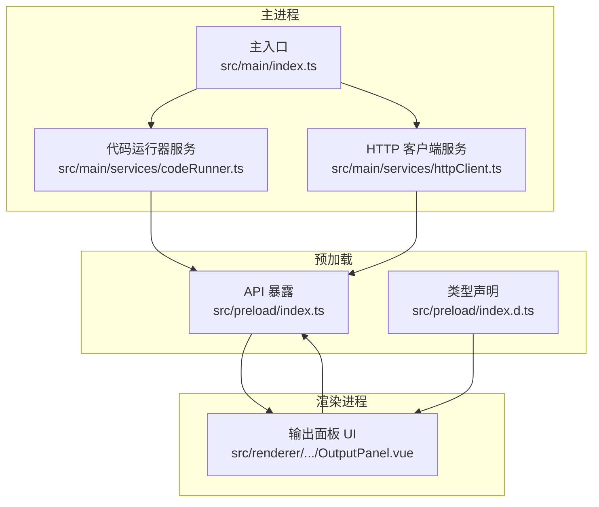
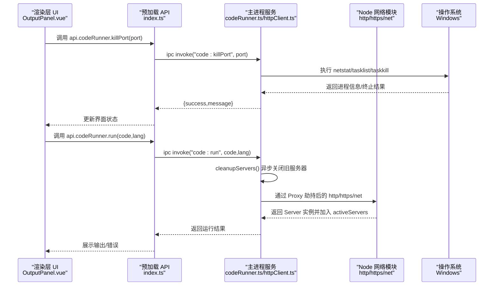
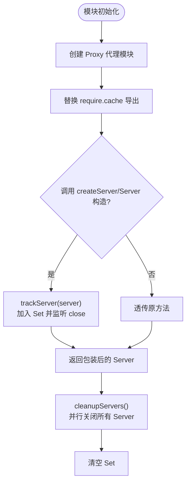
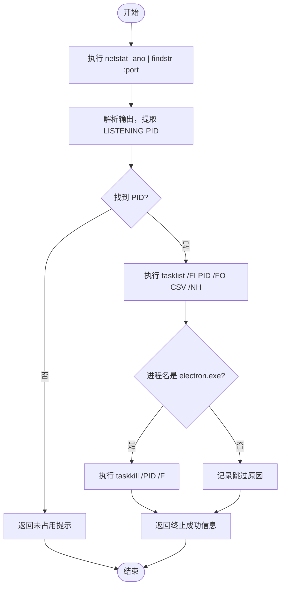
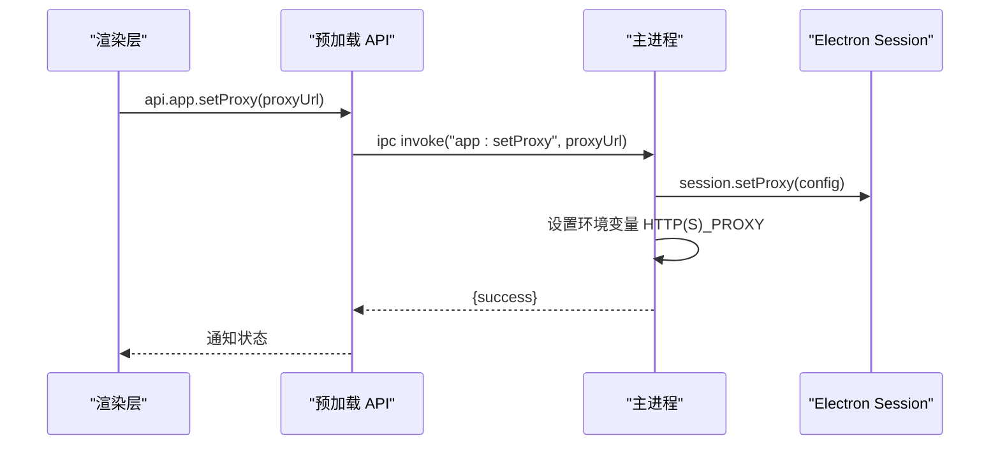
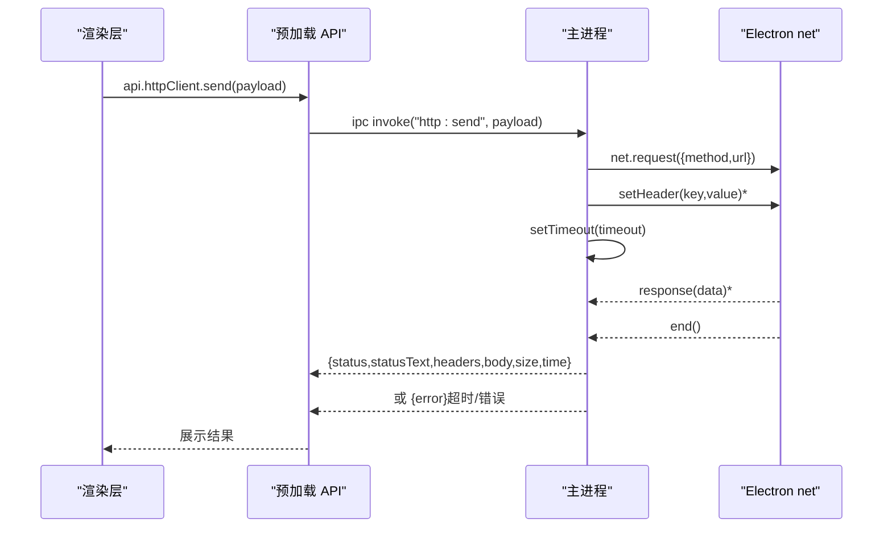
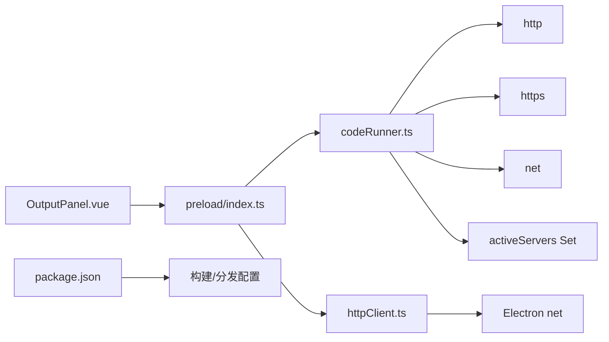

# 网络模块劫持

<cite>
**本文引用的文件列表**
- [src/main/index.ts](file://src/main/index.ts)
- [src/main/services/codeRunner.ts](file://src/main/services/codeRunner.ts)
- [src/main/services/httpClient.ts](file://src/main/services/httpClient.ts)
- [src/preload/index.ts](file://src/preload/index.ts)
- [src/preload/index.d.ts](file://src/preload/index.d.ts)
- [src/renderer/src/views/runjs/components/OutputPanel.vue](file://src/renderer/src/views/runjs/components/OutputPanel.vue)
- [package.json](file://package.json)
</cite>

## 目录
1. [简介](#简介)
2. [项目结构](#项目结构)
3. [核心组件](#核心组件)
4. [架构总览](#架构总览)
5. [详细组件分析](#详细组件分析)
6. [依赖关系分析](#依赖关系分析)
7. [性能考量](#性能考量)
8. [故障排查指南](#故障排查指南)
9. [结论](#结论)
10. [附录](#附录)

## 简介
本技术文档围绕“网络模块劫持”主题，系统阐述本项目在 Electron 主进程中对 Node.js 原生网络模块（http/https/net）进行的代理劫持机制，以及与之配套的服务器生命周期管理、端口占用检测与进程终止、跨平台兼容性、透明代理与资源清理策略。文档同时提供关键流程的可视化图示与实践建议，帮助读者快速理解并安全地扩展相关能力。

## 项目结构
该项目采用 Electron 主进程 + 渲染进程的典型架构，网络模块劫持主要集中在主进程的服务层：
- 主进程入口负责窗口、IPC、托盘、自动更新等系统级功能
- 代码运行器服务在主进程中通过 Proxy 劫持 http/https/net 模块，追踪并管理 Server 实例
- HTTP 客户端服务封装 Electron 的 net 模块，提供统一的请求能力
- 预加载脚本暴露 API 给渲染进程，渲染层通过 OutputPanel 提供交互入口

图表来源
- [src/main/index.ts:1-444](file://src/main/index.ts#L1-L444)
- [src/main/services/codeRunner.ts:1-461](file://src/main/services/codeRunner.ts#L1-L461)
- [src/main/services/httpClient.ts:1-113](file://src/main/services/httpClient.ts#L1-L113)
- [src/preload/index.ts:1-229](file://src/preload/index.ts#L1-L229)
- [src/preload/index.d.ts:1-412](file://src/preload/index.d.ts#L1-L412)
- [src/renderer/src/views/runjs/components/OutputPanel.vue:1-250](file://src/renderer/src/views/runjs/components/OutputPanel.vue#L1-L250)

章节来源
- [src/main/index.ts:1-444](file://src/main/index.ts#L1-L444)
- [src/main/services/codeRunner.ts:1-461](file://src/main/services/codeRunner.ts#L1-L461)
- [src/main/services/httpClient.ts:1-113](file://src/main/services/httpClient.ts#L1-L113)
- [src/preload/index.ts:1-229](file://src/preload/index.ts#L1-L229)
- [src/preload/index.d.ts:1-412](file://src/preload/index.d.ts#L1-L412)
- [src/renderer/src/views/runjs/components/OutputPanel.vue:1-250](file://src/renderer/src/views/runjs/components/OutputPanel.vue#L1-L250)

## 核心组件
- 网络模块劫持与 Server 追踪：在模块加载时通过 Proxy 替换 require.cache 中的 http/https/net 导出，拦截 createServer 与 net.Server 构造，将 Server 实例加入 Set 并监听 close 事件移除，实现全局服务器生命周期管理。
- 服务器清理：提供异步清理函数，批量关闭所有活跃 Server，并清空集合，避免资源泄漏。
- 端口占用检测与进程终止：基于 Windows 的 netstat/tasklist/taskkill 实现，仅终止 Electron 进程，避免误杀其他服务。
- 透明代理：通过 Electron session.setProxy 与环境变量设置，使 autoUpdater 与应用内网络请求走代理。
- HTTP 客户端：封装 Electron net.request，支持超时、错误处理与响应聚合。

章节来源
- [src/main/services/codeRunner.ts:21-96](file://src/main/services/codeRunner.ts#L21-L96)
- [src/main/services/codeRunner.ts:248-318](file://src/main/services/codeRunner.ts#L248-L318)
- [src/main/services/httpClient.ts:15-113](file://src/main/services/httpClient.ts#L15-L113)
- [src/main/index.ts:306-327](file://src/main/index.ts#L306-L327)

## 架构总览
下图展示了网络模块劫持与相关服务之间的交互关系，以及渲染层如何通过预加载 API 触发主进程操作。

图表来源
- [src/renderer/src/views/runjs/components/OutputPanel.vue:34-56](file://src/renderer/src/views/runjs/components/OutputPanel.vue#L34-L56)
- [src/preload/index.ts:63-69](file://src/preload/index.ts#L63-L69)
- [src/main/services/codeRunner.ts:98-247](file://src/main/services/codeRunner.ts#L98-L247)
- [src/main/services/codeRunner.ts:248-318](file://src/main/services/codeRunner.ts#L248-L318)

## 详细组件分析

### 组件一：网络模块劫持与 Server 实例管理
- 劫持机制：在模块初始化阶段，对 http/https/net 的 require.cache 条目进行 Proxy 包装，拦截 createServer 与 net.Server 构造，返回经 trackServer 包装的 Server 实例。
- Server 追踪：trackServer 将 Server 加入 Set，并监听 close 事件移除，实现生命周期闭环。
- 清理策略：cleanupServers 并行关闭所有活跃 Server，等待所有 close 回调完成，最后清空集合，避免资源泄漏。

图表来源
- [src/main/services/codeRunner.ts:40-75](file://src/main/services/codeRunner.ts#L40-L75)
- [src/main/services/codeRunner.ts:29-37](file://src/main/services/codeRunner.ts#L29-L37)
- [src/main/services/codeRunner.ts:77-96](file://src/main/services/codeRunner.ts#L77-L96)

章节来源
- [src/main/services/codeRunner.ts:24-75](file://src/main/services/codeRunner.ts#L24-L75)
- [src/main/services/codeRunner.ts:77-96](file://src/main/services/codeRunner.ts#L77-L96)

### 组件二：端口占用检测与进程终止（Windows）
- 端口检测：通过 netstat -ano 查询指定端口的 LISTENING 进程 PID。
- 进程筛选：tasklist 查询进程名，仅当进程名为 electron.exe 时才终止，避免误杀其他服务。
- 终止执行：taskkill /PID /F 强制终止目标进程，并汇总结果反馈。

图表来源
- [src/main/services/codeRunner.ts:248-318](file://src/main/services/codeRunner.ts#L248-L318)

章节来源
- [src/main/services/codeRunner.ts:248-318](file://src/main/services/codeRunner.ts#L248-L318)
- [src/renderer/src/views/runjs/components/OutputPanel.vue:34-56](file://src/renderer/src/views/runjs/components/OutputPanel.vue#L34-L56)

### 组件三：透明代理设置与应用
- 代理配置：通过 Electron session.setProxy 设置代理规则，同时设置 HTTP_PROXY/HTTPS_PROXY 环境变量，使 autoUpdater 也走代理。
- UI 触发：渲染层通过 api.app.setProxy 调用，主进程返回成功/失败状态。

图表来源
- [src/main/index.ts:306-327](file://src/main/index.ts#L306-L327)
- [src/preload/index.ts:24-38](file://src/preload/index.ts#L24-L38)

章节来源
- [src/main/index.ts:306-327](file://src/main/index.ts#L306-L327)
- [src/preload/index.ts:24-38](file://src/preload/index.ts#L24-L38)

### 组件四：HTTP 客户端（主进程）
- 请求封装：使用 Electron net.request，支持方法、URL、headers、body、timeout。
- 超时处理：定时器触发 request.abort 并返回超时结果。
- 响应聚合：收集 response.data，拼接 Buffer，转换为字符串，整理 headers 为对象。
- 错误处理：捕获 request.error，返回包含 error 字段的结果。

图表来源
- [src/main/services/httpClient.ts:15-113](file://src/main/services/httpClient.ts#L15-L113)
- [src/preload/index.ts:106-115](file://src/preload/index.ts#L106-L115)

章节来源
- [src/main/services/httpClient.ts:15-113](file://src/main/services/httpClient.ts#L15-L113)
- [src/preload/index.ts:106-115](file://src/preload/index.ts#L106-L115)

## 依赖关系分析
- 代码运行器服务依赖 Node 原生模块（http/https/net），并通过 Proxy 劫持实现 Server 实例追踪。
- 预加载脚本向渲染层暴露统一 API，渲染层通过 OutputPanel 触发端口终止与代码运行。
- HTTP 客户端服务依赖 Electron net 模块，提供主进程内的网络请求能力。
- 项目构建与分发配置由 package.json 管理，支持多平台打包。

图表来源
- [src/main/services/codeRunner.ts:1-8](file://src/main/services/codeRunner.ts#L1-L8)
- [src/main/services/httpClient.ts:5](file://src/main/services/httpClient.ts#L5)
- [src/preload/index.ts:1-229](file://src/preload/index.ts#L1-L229)
- [src/renderer/src/views/runjs/components/OutputPanel.vue:1-250](file://src/renderer/src/views/runjs/components/OutputPanel.vue#L1-L250)
- [package.json:1-120](file://package.json#L1-L120)

章节来源
- [src/main/services/codeRunner.ts:1-8](file://src/main/services/codeRunner.ts#L1-L8)
- [src/main/services/httpClient.ts:5](file://src/main/services/httpClient.ts#L5)
- [src/preload/index.ts:1-229](file://src/preload/index.ts#L1-L229)
- [src/renderer/src/views/runjs/components/OutputPanel.vue:1-250](file://src/renderer/src/views/runjs/components/OutputPanel.vue#L1-L250)
- [package.json:1-120](file://package.json#L1-L120)

## 性能考量
- 劫持成本：Proxy 包装与 require.cache 替换在模块初始化阶段一次性完成，运行期仅在 createServer/Server 构造时产生少量开销；对频繁创建 Server 的场景，建议避免过度并发创建，优先复用现有 Server。
- 清理策略：cleanupServers 并行关闭所有活跃 Server，适合长时运行的代码执行场景；若 Server 数量较多，注意等待 Promise.all 完成的时间。
- 端口检测：Windows 下 netstat/tasklist/taskkill 为同步阻塞命令，建议在后台线程或异步任务中执行，避免阻塞主线程 UI。
- 代理设置：设置环境变量与 session.setProxy 为轻量操作，但需注意代理不可用时的降级策略与错误提示。
- HTTP 客户端：net.request 为异步流式处理，注意及时释放内存与取消超时定时器，避免内存泄漏。

[本节为通用性能指导，无需特定文件引用]

## 故障排查指南
- 无法终止端口进程
  - 确认端口确实被占用且处于 LISTENING 状态
  - 检查进程名是否为 electron.exe，避免误杀其他服务
  - 查看返回的错误信息，确认权限与系统命令可用性
- Server 未被清理导致端口占用
  - 确保在运行前调用 cleanupServers 或使用 api.codeRunner.clean
  - 检查是否存在长时间运行的 Server 未正常关闭
- 代理设置无效
  - 确认 session.setProxy 成功返回
  - 检查 HTTP(S)_PROXY 环境变量是否正确设置
  - 验证代理地址格式与可达性
- HTTP 请求超时或失败
  - 调整 timeout 参数
  - 检查 URL 格式与网络连通性
  - 查看 error 字段定位具体错误

章节来源
- [src/main/services/codeRunner.ts:248-318](file://src/main/services/codeRunner.ts#L248-L318)
- [src/main/services/codeRunner.ts:77-96](file://src/main/services/codeRunner.ts#L77-L96)
- [src/main/index.ts:306-327](file://src/main/index.ts#L306-L327)
- [src/main/services/httpClient.ts:38-92](file://src/main/services/httpClient.ts#L38-L92)

## 结论
本项目在网络模块劫持方面实现了对 http/https/net 的透明代理与 Server 生命周期管理，结合端口占用检测与进程终止能力，有效解决了开发调试中的常见问题。通过预加载 API 与渲染层 UI 的配合，用户可以直观地管理本地服务与网络请求。建议在生产环境中谨慎使用劫持机制，确保与第三方模块的兼容性，并持续优化清理策略与错误处理，提升稳定性与性能。

[本节为总结性内容，无需特定文件引用]

## 附录
- 相关文件与职责概览
  - 主入口：负责窗口、IPC、托盘、自动更新等系统级功能
  - 代码运行器服务：劫持网络模块、追踪 Server、清理资源、端口终止
  - HTTP 客户端服务：封装 Electron net.request，提供统一请求能力
  - 预加载脚本：暴露 API 给渲染层，类型声明完善
  - 渲染层 UI：通过 OutputPanel 触发端口终止与代码运行

章节来源
- [src/main/index.ts:1-444](file://src/main/index.ts#L1-L444)
- [src/main/services/codeRunner.ts:1-461](file://src/main/services/codeRunner.ts#L1-L461)
- [src/main/services/httpClient.ts:1-113](file://src/main/services/httpClient.ts#L1-L113)
- [src/preload/index.ts:1-229](file://src/preload/index.ts#L1-L229)
- [src/preload/index.d.ts:1-412](file://src/preload/index.d.ts#L1-L412)
- [src/renderer/src/views/runjs/components/OutputPanel.vue:1-250](file://src/renderer/src/views/runjs/components/OutputPanel.vue#L1-L250)