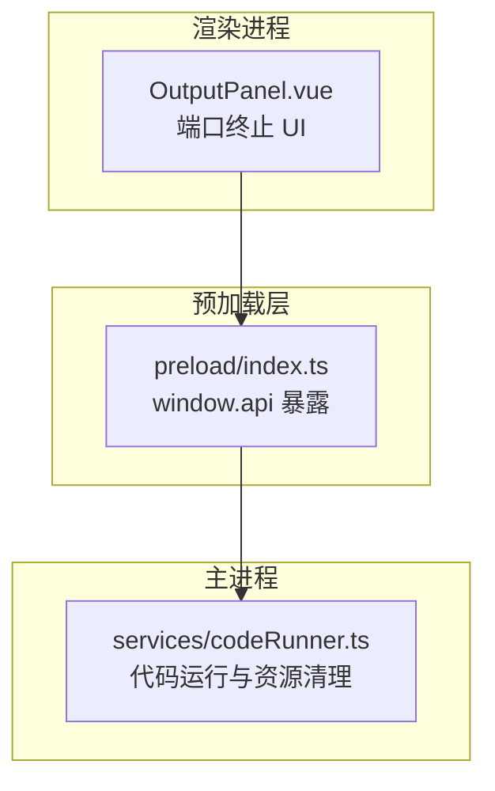
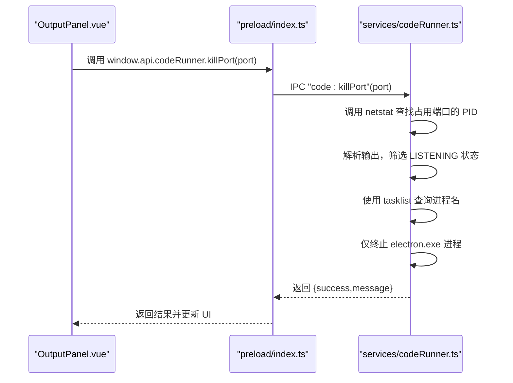
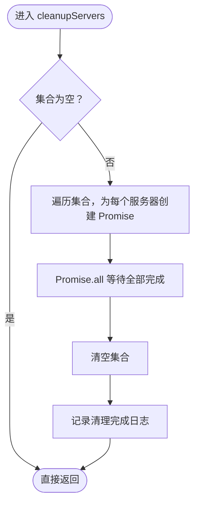
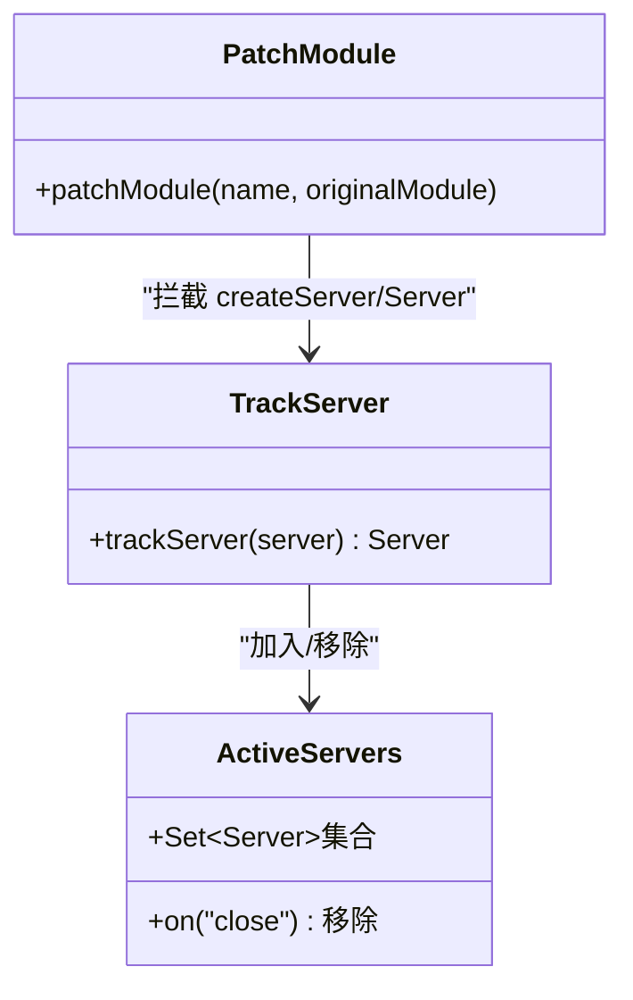
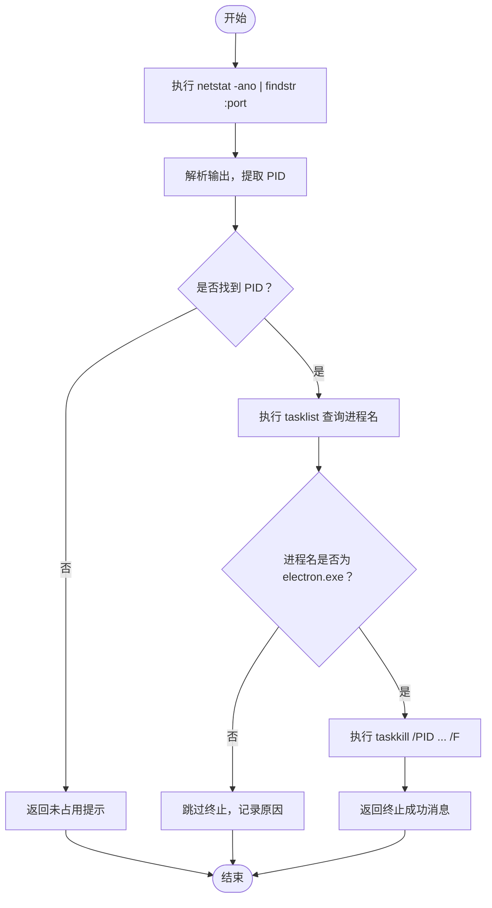
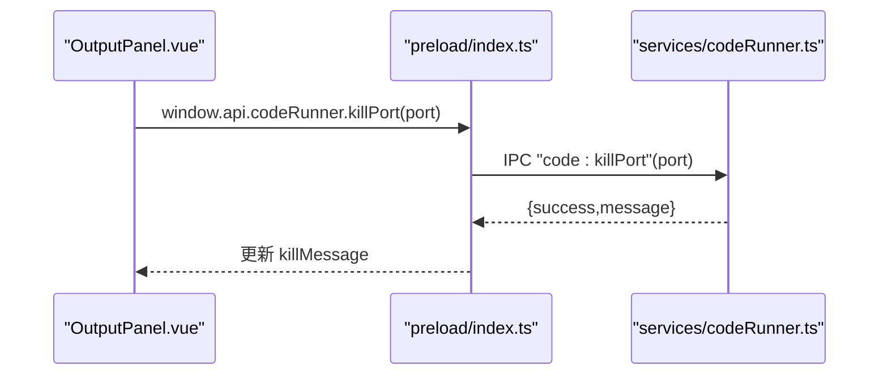
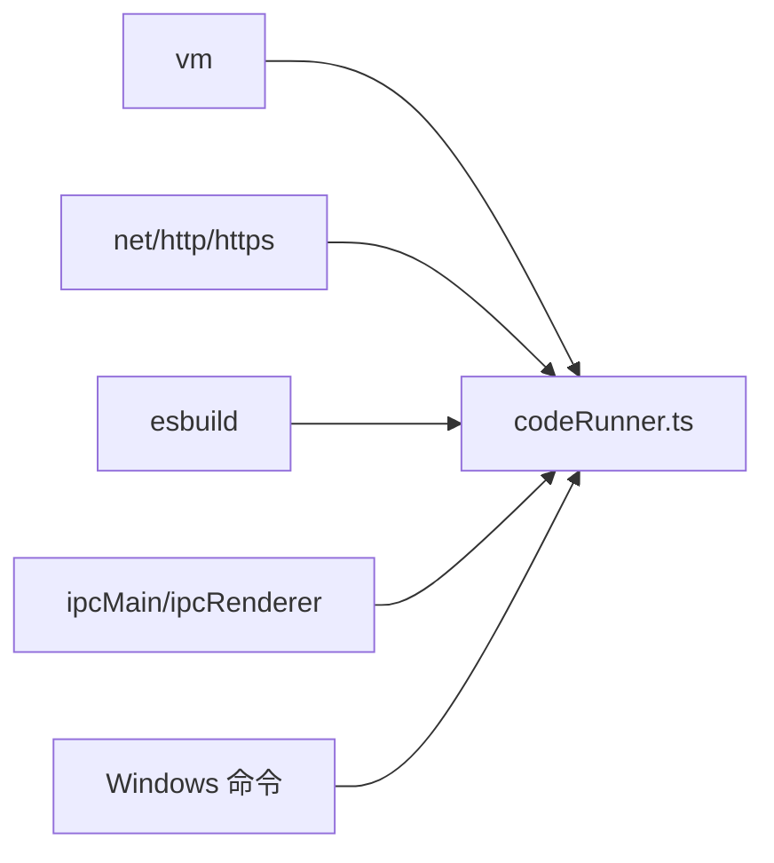

# 资源管理与清理

<cite>
**本文引用的文件列表**
- [codeRunner.ts](file://src/main/services/codeRunner.ts)
- [OutputPanel.vue](file://src/renderer/src/views/runjs/components/OutputPanel.vue)
- [index.ts](file://src/preload/index.ts)
- [package.json](file://package.json)
</cite>

## 目录
1. [简介](#简介)
2. [项目结构](#项目结构)
3. [核心组件](#核心组件)
4. [架构总览](#架构总览)
5. [详细组件分析](#详细组件分析)
6. [依赖关系分析](#依赖关系分析)
7. [性能考量](#性能考量)
8. [故障排查指南](#故障排查指南)
9. [结论](#结论)
10. [附录](#附录)

## 简介
本技术文档围绕“资源管理与清理系统”展开，重点解析以下能力：
- cleanupServers 函数的实现原理：活跃服务器集合管理、异步清理流程、错误处理策略与超时控制。
- 端口占用检测机制：基于 Windows 的 netstat 命令调用、PID 解析、进程终止处理与跨平台兼容性设计思路。
- 手动清理接口与自动清理触发条件：IPC 接口暴露、前端交互、后端处理链路。
- 资源泄漏预防与性能监控：集合生命周期、Promise 并发、错误降级与输出裁剪。
- 典型清理场景示例：正常退出、异常终止、强制清理、批量资源管理。
- 清理策略对系统稳定性与性能的影响及最佳实践建议。

## 项目结构
本项目采用 Electron + Vue 的主渲染分离架构，资源管理与清理主要集中在主进程服务层与渲染进程 UI 层之间通过 IPC 通信协同完成。

图表来源
- [OutputPanel.vue:34-56](file://src/renderer/src/views/runjs/components/OutputPanel.vue#L34-L56)
- [index.ts:62-69](file://src/preload/index.ts#L62-L69)
- [codeRunner.ts:98-246](file://src/main/services/codeRunner.ts#L98-L246)

章节来源
- [codeRunner.ts:1-120](file://src/main/services/codeRunner.ts#L1-L120)
- [index.ts:1-120](file://src/preload/index.ts#L1-L120)
- [package.json:1-120](file://package.json#L1-L120)

## 核心组件
- 活跃服务器集合：使用 Set 存储当前活跃的 net.Server 实例，并在 close 事件时移除，保证集合一致性。
- 全局模块劫持：通过 Proxy 劫持 http/https/net 模块的 createServer 与 net.Server 构造函数，统一注入追踪逻辑。
- 异步清理函数：cleanupServers 并发关闭所有活跃服务器，等待所有 Promise 完成后清空集合。
- 端口占用检测与终止：基于 Windows 的 netstat + tasklist + taskkill 组合，解析 PID 并仅终止 Electron 进程。
- IPC 接口：提供 code:run、code:stop、code:clean、code:killPort 四类接口，前后端协作完成资源管理。

章节来源
- [codeRunner.ts:21-75](file://src/main/services/codeRunner.ts#L21-L75)
- [codeRunner.ts:77-96](file://src/main/services/codeRunner.ts#L77-L96)
- [codeRunner.ts:98-246](file://src/main/services/codeRunner.ts#L98-L246)
- [codeRunner.ts:248-318](file://src/main/services/codeRunner.ts#L248-L318)

## 架构总览
下图展示了从 UI 触发到主进程执行清理与端口终止的整体流程。

图表来源
- [OutputPanel.vue:34-56](file://src/renderer/src/views/runjs/components/OutputPanel.vue#L34-L56)
- [index.ts:62-69](file://src/preload/index.ts#L62-L69)
- [codeRunner.ts:248-318](file://src/main/services/codeRunner.ts#L248-L318)

## 详细组件分析

### 活跃服务器集合与清理流程
- 集合管理
  - 使用 Set 存储活跃服务器实例，便于快速增删与遍历。
  - 每个被追踪的服务器在 close 事件时从集合中移除，避免泄漏。
- 清理策略
  - cleanupServers 并发关闭所有活跃服务器，使用 Promise.all 等待全部完成，提升吞吐。
  - 若无活跃服务器则直接返回，避免无效操作。
  - 清理完成后清空集合，确保下次运行前干净状态。
- 超时控制
  - 当前清理流程未设置超时，若服务器无法关闭，Promise 将保持 pending。
  - 建议在上层调用处增加超时包装，防止长时间阻塞。

图表来源
- [codeRunner.ts:77-96](file://src/main/services/codeRunner.ts#L77-L96)

章节来源
- [codeRunner.ts:21-37](file://src/main/services/codeRunner.ts#L21-L37)
- [codeRunner.ts:77-96](file://src/main/services/codeRunner.ts#L77-L96)

### 全局模块劫持与服务器追踪
- 劫持时机：模块加载时立即执行，替换 require.cache 中的导出，确保后续 require 获取到代理后的模块。
- 劫持范围：http/https/net 模块的 createServer 方法；net.Server 构造函数。
- 追踪逻辑：每次创建服务器后加入 Set，并绑定 close 事件移除，保证生命周期闭环。

图表来源
- [codeRunner.ts:40-75](file://src/main/services/codeRunner.ts#L40-L75)
- [codeRunner.ts:29-37](file://src/main/services/codeRunner.ts#L29-L37)

章节来源
- [codeRunner.ts:40-75](file://src/main/services/codeRunner.ts#L40-L75)
- [codeRunner.ts:29-37](file://src/main/services/codeRunner.ts#L29-L37)

### 端口占用检测与进程终止
- 命令链路
  - netstat -ano | findstr :port：列出占用端口的进程信息。
  - 解析输出，提取本地地址、状态与 PID，筛选 LISTENING 且 PID 非 0 的条目。
  - tasklist /FI "PID eq ..." /FO CSV /NH：查询进程名，仅当进程名为 electron.exe 时才终止。
  - taskkill /PID ... /F：强制终止进程。
- 错误处理
  - 未找到占用端口：返回明确提示，避免误判。
  - 命令执行失败：捕获错误并返回友好消息。
  - 非 Electron 进程：跳过终止，避免误杀其他服务。
- 跨平台兼容性
  - 当前实现基于 Windows 命令（netstat/tasklist/taskkill），不适用于 macOS/Linux。
  - 建议：在非 Windows 平台使用 lsof 或 fuser/netstat 替代方案，并统一抽象为平台无关接口。

图表来源
- [codeRunner.ts:248-318](file://src/main/services/codeRunner.ts#L248-L318)

章节来源
- [codeRunner.ts:248-318](file://src/main/services/codeRunner.ts#L248-L318)

### IPC 接口与前端交互
- 主进程接口
  - code:run：运行代码前先清理旧服务器，防止端口冲突；支持 TypeScript 编译与 VM 执行。
  - code:stop：请求停止，触发清理。
  - code:clean：手动清理资源。
  - code:killPort：根据端口号终止占用进程。
- 预加载层
  - 通过 contextBridge 暴露 window.api.codeRunner.* 给渲染进程。
- 渲染层
  - OutputPanel.vue 提供端口输入框与“终止端口”按钮，调用 window.api.codeRunner.killPort 并展示结果。

图表来源
- [OutputPanel.vue:34-56](file://src/renderer/src/views/runjs/components/OutputPanel.vue#L34-L56)
- [index.ts:62-69](file://src/preload/index.ts#L62-L69)
- [codeRunner.ts:248-318](file://src/main/services/codeRunner.ts#L248-L318)

章节来源
- [index.ts:62-69](file://src/preload/index.ts#L62-L69)
- [OutputPanel.vue:34-56](file://src/renderer/src/views/runjs/components/OutputPanel.vue#L34-L56)
- [codeRunner.ts:98-246](file://src/main/services/codeRunner.ts#L98-L246)

### 自动清理触发条件
- 代码运行前：在 code:run 中显式 await cleanupServers，确保新服务启动前无残留端口占用。
- 停止执行：收到 code:stop 事件时立即清理。
- 手动清理：提供 code:clean 接口，允许外部主动触发清理。

章节来源
- [codeRunner.ts:106-107](file://src/main/services/codeRunner.ts#L106-L107)
- [codeRunner.ts:237-240](file://src/main/services/codeRunner.ts#L237-L240)
- [codeRunner.ts:243-246](file://src/main/services/codeRunner.ts#L243-L246)

### 性能监控与输出裁剪
- 输出裁剪：formatOutput 对大对象、数组、Buffer、Server 等进行特殊处理，避免输出巨大 JSON 导致 UI 卡顿。
- 日志实时推送：运行过程中通过 IPC 实时发送日志到前端，便于观察执行状态。
- 超时控制：VM 执行设置 30 秒超时，防止长时间阻塞；清理流程未设置超时，建议补充。

章节来源
- [codeRunner.ts:109-116](file://src/main/services/codeRunner.ts#L109-L116)
- [codeRunner.ts](file://src/main/services/codeRunner.ts#L190)
- [codeRunner.ts:320-362](file://src/main/services/codeRunner.ts#L320-L362)

## 依赖关系分析
- 模块依赖
  - 依赖 electron 的 ipcMain、vm、net、http、https 等模块。
  - 使用 esbuild 对 TypeScript 进行编译。
- 外部命令
  - Windows 命令：netstat、tasklist、taskkill。
- 前后端通信
  - 渲染层通过 preload 暴露的 window.api 调用主进程 IPC 接口。

图表来源
- [codeRunner.ts:1-10](file://src/main/services/codeRunner.ts#L1-L10)
- [codeRunner.ts:123-129](file://src/main/services/codeRunner.ts#L123-L129)
- [codeRunner.ts:248-318](file://src/main/services/codeRunner.ts#L248-L318)

章节来源
- [codeRunner.ts:1-10](file://src/main/services/codeRunner.ts#L1-L10)
- [package.json:28-51](file://package.json#L28-L51)

## 性能考量
- 清理并发度：cleanupServers 使用 Promise.all 并发关闭服务器，显著降低等待时间。
- 输出体积控制：formatOutput 对大对象进行截断与简化，避免 UI 压力。
- 超时策略：VM 执行设置超时，清理流程建议同样增加超时保护，防止极端情况导致卡死。
- I/O 开销：端口检测涉及多次子进程调用，建议在高频场景下引入缓存与去重策略。

## 故障排查指南
- 端口未被占用
  - 现象：返回“端口未被占用”。
  - 排查：确认目标端口是否被其他进程占用；检查 netstat 输出格式差异。
- 未找到 PID
  - 现象：解析不到 PID。
  - 排查：确认 netstat 输出包含 LISTENING 状态且 PID 非 0。
- 非 Electron 进程
  - 现象：跳过终止并提示非 Electron 进程。
  - 排查：确认进程名大小写与匹配逻辑；避免误杀其他服务。
- 权限不足
  - 现象：taskkill 失败。
  - 排查：以管理员权限运行；检查安全软件拦截。
- 跨平台问题
  - 现象：在 macOS/Linux 上无法使用 Windows 命令。
  - 排查：替换为 lsof/fuser/netstat 等替代方案，并抽象统一接口。

章节来源
- [codeRunner.ts:277-279](file://src/main/services/codeRunner.ts#L277-L279)
- [codeRunner.ts:289-293](file://src/main/services/codeRunner.ts#L289-L293)
- [codeRunner.ts:307-316](file://src/main/services/codeRunner.ts#L307-L316)

## 结论
本资源管理与清理系统通过“全局模块劫持 + 活跃服务器集合 + 并发清理 + 端口检测终止”的组合，有效解决了开发场景下的端口占用与资源泄漏问题。其关键优势在于：
- 清理流程自动化且可手动触发，保障端口可用性。
- 输出裁剪与日志推送提升可观测性。
- 端口检测与进程终止具备一定容错与安全策略（仅终止 Electron 进程）。

建议进一步完善：
- 为清理流程增加超时保护；
- 抽象跨平台命令，提升兼容性；
- 引入缓存与去重策略，降低端口检测开销；
- 增加更细粒度的错误分类与重试机制。

## 附录
- 示例场景路径（不展示具体代码内容）
  - 正常退出：参考 [codeRunner.ts:106-107](file://src/main/services/codeRunner.ts#L106-L107) 与 [codeRunner.ts:237-240](file://src/main/services/codeRunner.ts#L237-L240)
  - 异常终止：参考 [codeRunner.ts:220-233](file://src/main/services/codeRunner.ts#L220-L233)
  - 强制清理：参考 [codeRunner.ts:243-246](file://src/main/services/codeRunner.ts#L243-L246)
  - 批量资源管理：参考 [codeRunner.ts:77-96](file://src/main/services/codeRunner.ts#L77-L96) 与 [codeRunner.ts:248-318](file://src/main/services/codeRunner.ts#L248-L318)
- 最佳实践
  - 在运行新服务前总是先清理旧服务，避免端口冲突。
  - 对长时间运行的服务，关注其返回值与 Promise 拒绝，及时清理。
  - 在非 Windows 平台实现替代的端口检测与终止逻辑，确保一致行为。
  - 为关键清理路径增加超时与重试，提升鲁棒性。