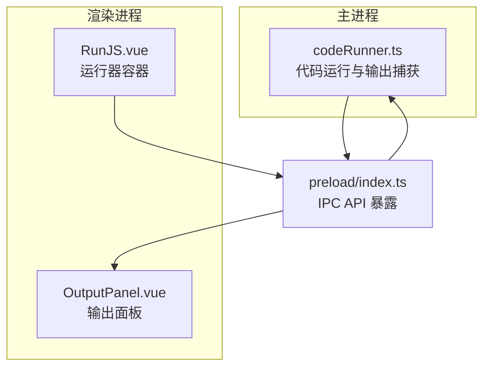
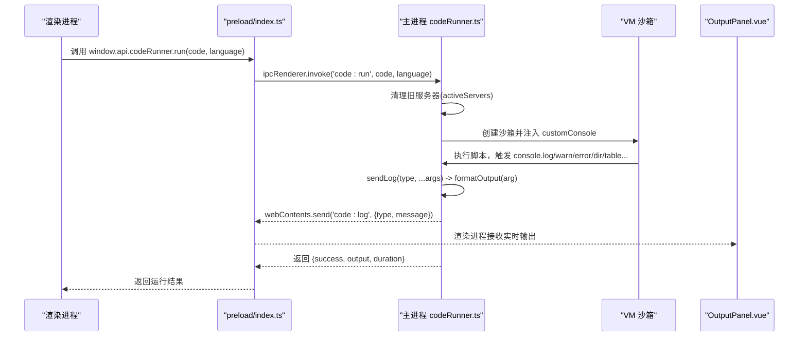
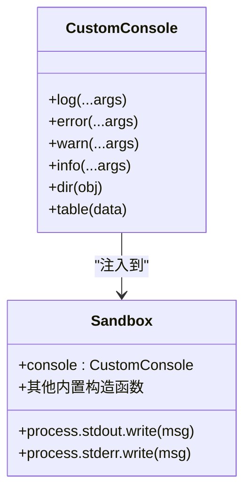
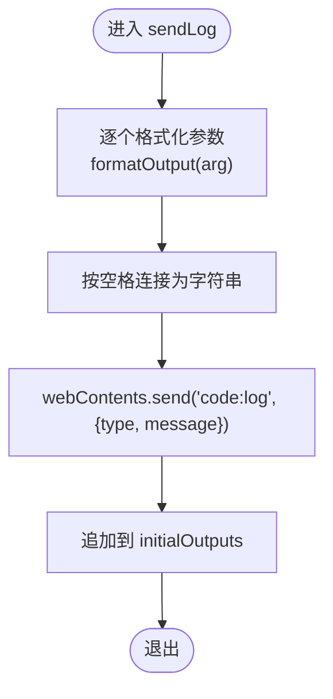
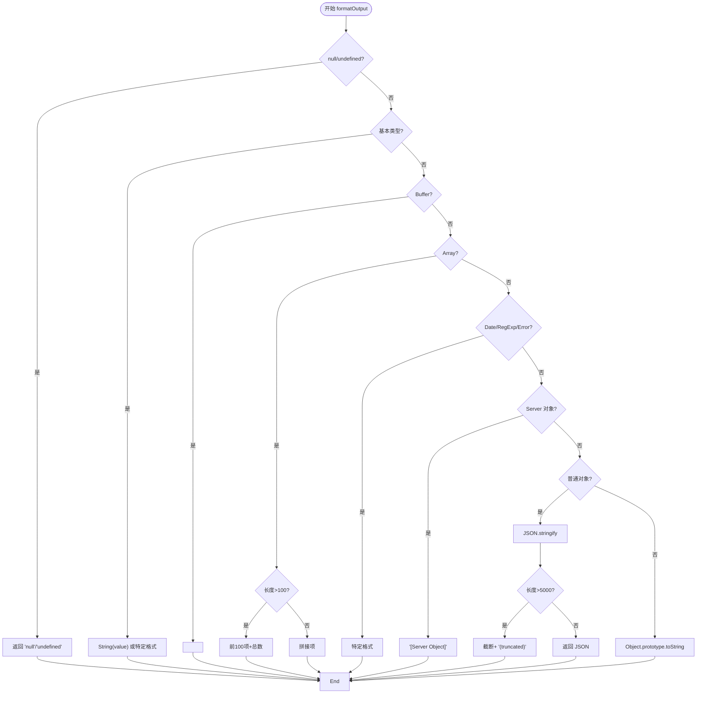
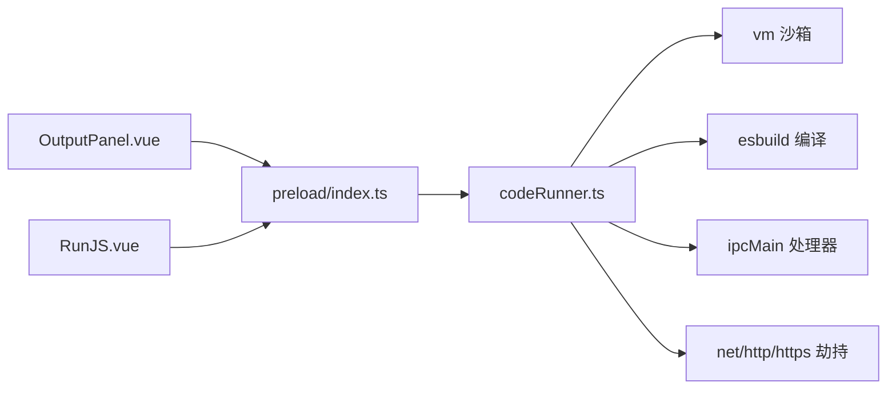

# 输出捕获与格式化

<cite>
**本文引用的文件列表**
- [codeRunner.ts](file://src/main/services/codeRunner.ts)
- [OutputPanel.vue](file://src/renderer/src/views/runjs/components/OutputPanel.vue)
- [RunJS.vue](file://src/renderer/src/views/runjs/RunJS.vue)
- [index.ts](file://src/preload/index.ts)
</cite>

## 目录
1. [简介](#简介)
2. [项目结构](#项目结构)
3. [核心组件](#核心组件)
4. [架构总览](#架构总览)
5. [详细组件分析](#详细组件分析)
6. [依赖关系分析](#依赖关系分析)
7. [性能考量](#性能考量)
8. [故障排查指南](#故障排查指南)
9. [结论](#结论)
10. [附录](#附录)

## 简介
本技术文档围绕“输出捕获与格式化”系统展开，重点解释以下方面：
- customConsole 对象的实现机制：如何代理 console.log、console.error 等方法，以及在沙箱环境中注入自定义 console 的方式。
- 实时输出传输：sendLog 函数如何将格式化后的输出通过 IPC 实时发送至渲染进程，并同时维护同步输出缓冲。
- formatOutput 函数的格式化逻辑：覆盖基本类型、数组、Buffer、Date、RegExp、Error、普通对象、以及特殊对象（如 Server）的处理；包含长度限制与截断策略。
- 输出流的实时传输、错误输出分类、格式化字符串生成与性能优化策略。
- 用户体验优化与调试信息增强：前端输出面板的标签页、运行时状态、错误高亮与排版。

## 项目结构
输出捕获与格式化系统横跨主进程与渲染进程：
- 主进程负责代码执行、沙箱隔离、自定义 console 注入、实时输出传输与格式化。
- 渲染进程负责接收实时输出、展示控制台与错误标签页、显示运行时长与交互操作。

图表来源
- [codeRunner.ts:98-235](file://src/main/services/codeRunner.ts#L98-L235)
- [RunJS.vue:151-181](file://src/renderer/src/views/runjs/RunJS.vue#L151-L181)
- [OutputPanel.vue:161-210](file://src/renderer/src/views/runjs/components/OutputPanel.vue#L161-L210)
- [index.ts:62-69](file://src/preload/index.ts#L62-L69)

章节来源
- [codeRunner.ts:98-235](file://src/main/services/codeRunner.ts#L98-L235)
- [RunJS.vue:151-181](file://src/renderer/src/views/runjs/RunJS.vue#L151-L181)
- [OutputPanel.vue:161-210](file://src/renderer/src/views/runjs/components/OutputPanel.vue#L161-L210)
- [index.ts:62-69](file://src/preload/index.ts#L62-L69)

## 核心组件
- customConsole：在沙箱环境中注入的自定义 console，将 log/error/warn/info/dir/table 等方法重定向到 sendLog，从而统一进行格式化与实时传输。
- sendLog：格式化参数、实时通过 IPC 发送到渲染进程，并追加到同步输出缓冲（initialOutputs），用于兼容旧逻辑。
- formatOutput：核心格式化函数，对不同数据类型进行检测与转换，包含长度限制与截断策略，避免大对象输出导致性能问题。
- 输出面板（OutputPanel）：渲染进程侧的输出展示组件，区分“控制台”和“错误”两个标签页，支持清空、运行时长显示与运行中状态提示。

章节来源
- [codeRunner.ts:131-139](file://src/main/services/codeRunner.ts#L131-L139)
- [codeRunner.ts:110-116](file://src/main/services/codeRunner.ts#L110-L116)
- [codeRunner.ts:320-362](file://src/main/services/codeRunner.ts#L320-L362)
- [OutputPanel.vue:62-85](file://src/renderer/src/views/runjs/components/OutputPanel.vue#L62-L85)

## 架构总览
整体流程：渲染进程调用主进程的 code:run，主进程在 VM 沙箱中执行代码，注入 customConsole，所有输出经由 sendLog 实时传输到渲染进程，同时累积到同步输出缓冲；最终返回运行结果与耗时。

图表来源
- [codeRunner.ts:98-235](file://src/main/services/codeRunner.ts#L98-L235)
- [index.ts:62-69](file://src/preload/index.ts#L62-L69)
- [OutputPanel.vue:161-210](file://src/renderer/src/views/runjs/components/OutputPanel.vue#L161-L210)

## 详细组件分析

### customConsole 与沙箱注入
- customConsole 将 console.log、console.error、console.warn、console.info、console.dir、console.table 重定向到 sendLog，确保所有输出都经过统一格式化与实时传输。
- 沙箱环境 sandbox 中包含 console、process.stdout/stderr 的 write 方法也被重定向到 sendLog，保证标准输出与错误输出同样被捕获。
- 通过 vm.createContext 与 vm.Script 执行代码，确保代码在受控环境下运行，避免污染主进程全局。

图表来源
- [codeRunner.ts:131-139](file://src/main/services/codeRunner.ts#L131-L139)
- [codeRunner.ts:142-181](file://src/main/services/codeRunner.ts#L142-L181)

章节来源
- [codeRunner.ts:131-139](file://src/main/services/codeRunner.ts#L131-L139)
- [codeRunner.ts:142-181](file://src/main/services/codeRunner.ts#L142-L181)

### sendLog：实时输出传输与缓冲管理
- sendLog 接收输出类型（stdout/stderr）与可变参数，逐个调用 formatOutput 进行格式化后拼接为空格分隔的字符串。
- 通过 webContents.send('code:log', { type, message }) 实时发送到渲染进程，实现“边运行边看”的体验。
- 同时将格式化后的消息追加到 initialOutputs 缓冲数组，用于兼容旧逻辑（最终返回同步期间的输出）。

图表来源
- [codeRunner.ts:110-116](file://src/main/services/codeRunner.ts#L110-L116)

章节来源
- [codeRunner.ts:110-116](file://src/main/services/codeRunner.ts#L110-L116)

### formatOutput：格式化逻辑与性能优化
formatOutput 的核心策略如下：
- 基本类型：null、undefined、string、number、boolean、bigint、symbol、function 直接转为字符串或特定表示。
- Buffer：以十六进制片段展示，避免大 Buffer 导致输出膨胀。
- 数组：超过 100 项时仅展示前 100 项并标注总数，避免超长数组输出。
- 日期与正则：使用标准 toString 或 ISO 字符串。
- Error：输出 name 与 message，避免大对象 JSON。
- 特殊对象：对 Server 对象不输出 JSON，而是显示简短提示，避免巨大 JSON。
- 普通对象：优先 JSON.stringify，超过 5000 字符截断并追加“(truncated)”。
- 其他情况：回退到 Object.prototype.toString。

图表来源
- [codeRunner.ts:320-362](file://src/main/services/codeRunner.ts#L320-L362)

章节来源
- [codeRunner.ts:320-362](file://src/main/services/codeRunner.ts#L320-L362)

### 输出流的实时传输与错误分类
- 实时传输：主进程在执行过程中，每次 console 输出都会通过 sendLog 实时发送到渲染进程，确保用户能即时看到输出。
- 错误分类：stdout 与 stderr 分别标记，渲染端在输出面板中以不同标签页呈现，便于区分。
- Promise 未处理拒绝：若代码返回的 Promise 被拒绝，主进程会捕获并发送错误信息到 stderr，避免静默失败。

章节来源
- [codeRunner.ts:110-116](file://src/main/services/codeRunner.ts#L110-L116)
- [codeRunner.ts:194-201](file://src/main/services/codeRunner.ts#L194-L201)

### 前端输出面板：用户体验与调试增强
- 标签页：控制台与错误两个标签页，根据是否存在 error 自动切换活动标签。
- 运行时长：以毫秒或秒形式展示，便于评估性能。
- 运行中状态：当 isRunning=true 时显示“代码运行中...”动画提示。
- 错误高亮：错误文本使用红色背景与边框，提升可读性。
- 清空功能：一键清空输出与错误内容，便于连续测试。

章节来源
- [OutputPanel.vue:23-26](file://src/renderer/src/views/runjs/components/OutputPanel.vue#L23-L26)
- [OutputPanel.vue:29-32](file://src/renderer/src/views/runjs/components/OutputPanel.vue#L29-L32)
- [OutputPanel.vue:164-167](file://src/renderer/src/views/runjs/components/OutputPanel.vue#L164-L167)
- [OutputPanel.vue:183-193](file://src/renderer/src/views/runjs/components/OutputPanel.vue#L183-L193)

## 依赖关系分析
- 主进程依赖：
  - vm：创建沙箱并执行代码。
  - esbuild：TypeScript 编译为 JavaScript。
  - electron.ipcMain：注册 code:run、code:stop、code:clean、code:killPort 等处理器。
  - net/http/https：通过 Proxy 劫持模块，追踪 Server 实例。
- 渲染进程依赖：
  - preload 暴露的 window.api.codeRunner：封装 IPC 调用。
  - Vue 组件：RunJS.vue 作为容器，OutputPanel.vue 负责输出展示。

图表来源
- [codeRunner.ts:1-8](file://src/main/services/codeRunner.ts#L1-L8)
- [index.ts:62-69](file://src/preload/index.ts#L62-L69)

章节来源
- [codeRunner.ts:1-8](file://src/main/services/codeRunner.ts#L1-L8)
- [index.ts:62-69](file://src/preload/index.ts#L62-L69)

## 性能考量
- 长度限制与截断：formatOutput 对数组（>100 项）、对象（>5000 字符）进行截断，避免大对象输出造成内存与渲染压力。
- 特殊对象优化：对 Server 对象不输出 JSON，仅提示“Server started.”，避免巨大 JSON。
- 实时传输：sendLog 每次输出即刻发送，避免大量累积后再一次性输出导致卡顿。
- Promise 未处理拒绝：及时捕获并上报，避免长时间运行的 Promise 隐性失败。
- Buffer 处理：仅输出十六进制片段，避免超大 Buffer 导致输出膨胀。

章节来源
- [codeRunner.ts:329-333](file://src/main/services/codeRunner.ts#L329-L333)
- [codeRunner.ts:350-356](file://src/main/services/codeRunner.ts#L350-L356)
- [codeRunner.ts:344-347](file://src/main/services/codeRunner.ts#L344-L347)
- [codeRunner.ts:110-116](file://src/main/services/codeRunner.ts#L110-L116)
- [codeRunner.ts:194-201](file://src/main/services/codeRunner.ts#L194-L201)

## 故障排查指南
- 无法看到实时输出：
  - 检查主进程是否调用 sendLog 并通过 webContents.send('code:log', ...) 发送。
  - 确认渲染进程已正确监听并接收 'code:log' 事件。
- 输出过大导致卡顿：
  - formatOutput 已对数组与对象进行长度限制与截断，确认未绕过该逻辑。
- Server 对象输出异常：
  - 确认 Server 对象被特殊处理，不会输出巨大 JSON。
- Promise 未处理拒绝：
  - 若代码返回 Promise，需确保在主进程中 await 或捕获拒绝，避免静默失败。

章节来源
- [codeRunner.ts:110-116](file://src/main/services/codeRunner.ts#L110-L116)
- [codeRunner.ts:194-201](file://src/main/services/codeRunner.ts#L194-L201)
- [codeRunner.ts:329-333](file://src/main/services/codeRunner.ts#L329-L333)
- [codeRunner.ts:350-356](file://src/main/services/codeRunner.ts#L350-L356)
- [codeRunner.ts:344-347](file://src/main/services/codeRunner.ts#L344-L347)

## 结论
该输出捕获与格式化系统通过 customConsole 与沙箱注入，实现了对 console.* 方法的统一代理；借助 sendLog 的实时传输与 formatOutput 的智能格式化与长度限制，既保证了良好的用户体验，又兼顾了性能与稳定性。配合渲染端的输出面板，用户可以直观地查看控制台与错误输出，并获得运行时长与运行中状态反馈。

## 附录
- 代码示例路径（不展示具体代码内容，仅提供定位）：
  - customConsole 注入位置：[codeRunner.ts:131-139](file://src/main/services/codeRunner.ts#L131-L139)
  - sendLog 实时传输与缓冲：[codeRunner.ts:110-116](file://src/main/services/codeRunner.ts#L110-L116)
  - formatOutput 核心逻辑：[codeRunner.ts:320-362](file://src/main/services/codeRunner.ts#L320-L362)
  - 前端输出面板展示：[OutputPanel.vue:161-210](file://src/renderer/src/views/runjs/components/OutputPanel.vue#L161-L210)
  - IPC API 暴露：[index.ts:62-69](file://src/preload/index.ts#L62-L69)