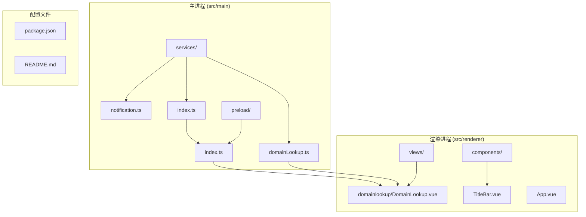
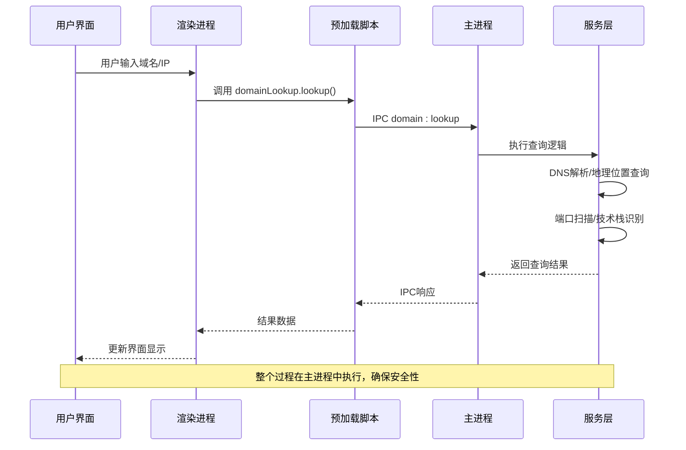
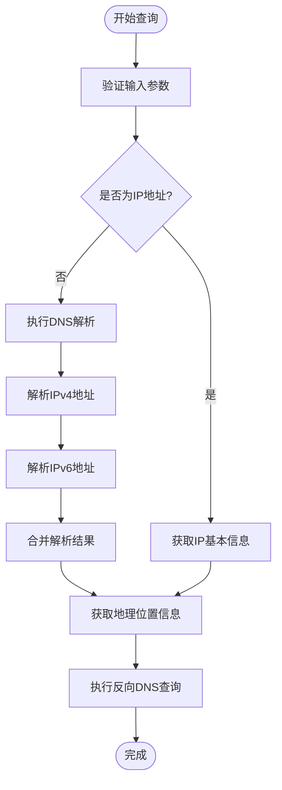
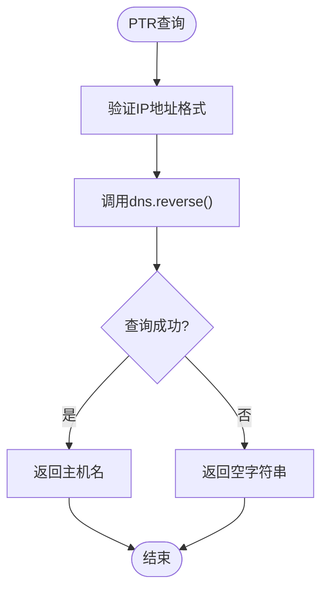
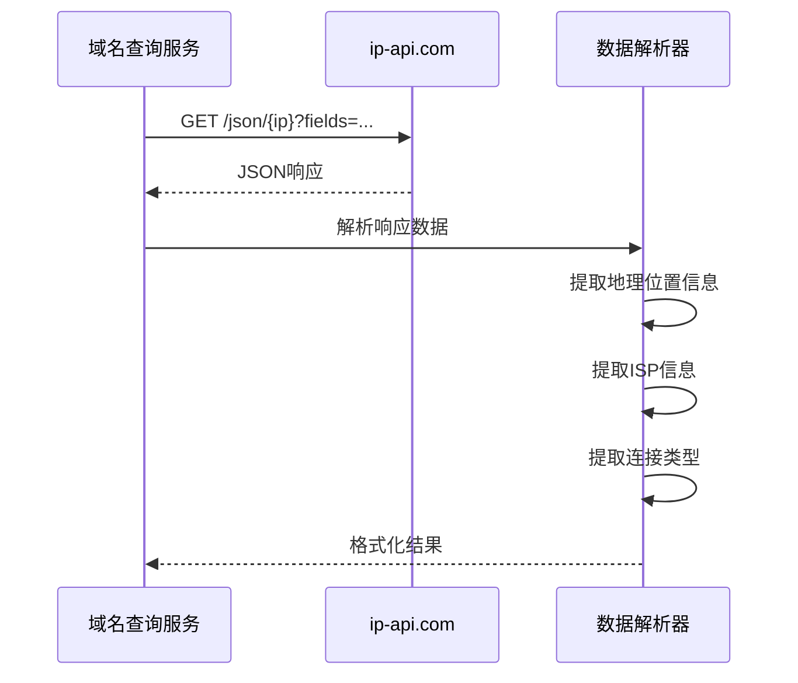
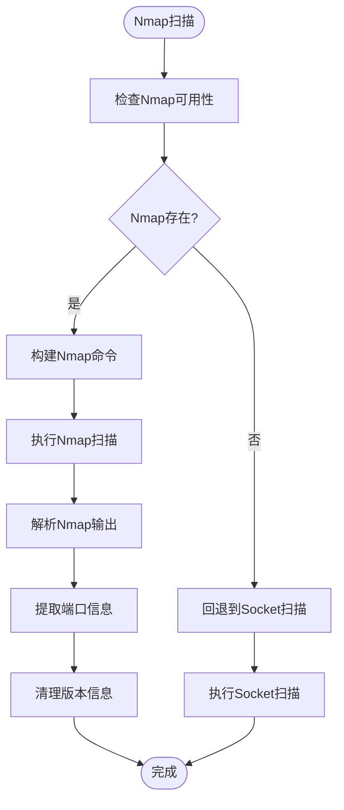
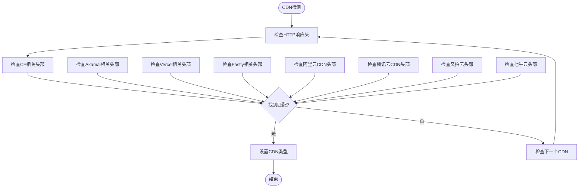
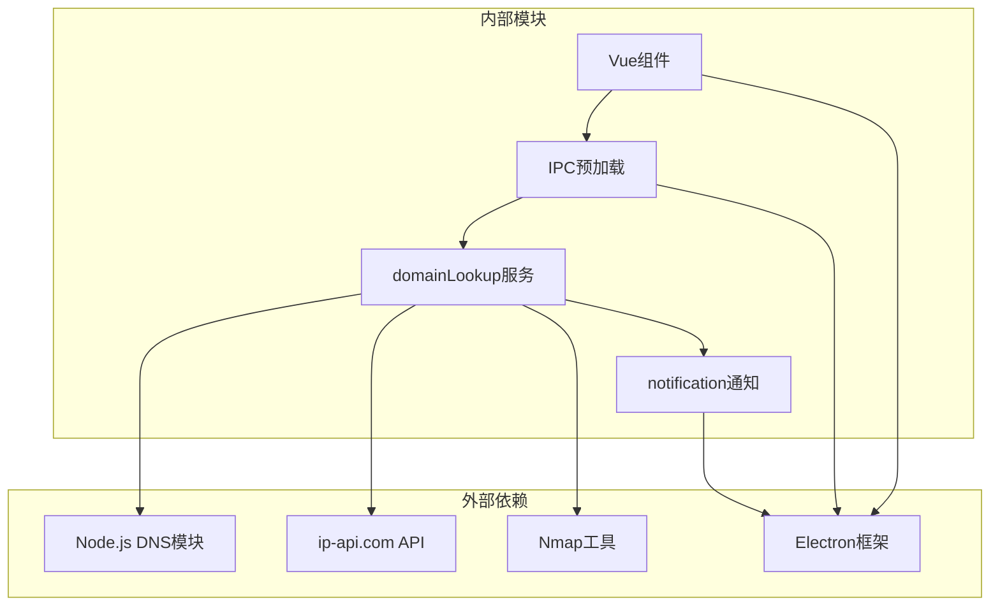

# 域名查询服务

<cite>
**本文档引用的文件**
- [domainLookup.ts](file://src/main/services/domainLookup.ts)
- [DomainLookup.vue](file://src/renderer/src/views/domainlookup/DomainLookup.vue)
- [index.ts](file://src/main/index.ts)
- [index.ts](file://src/preload/index.ts)
- [App.vue](file://src/renderer/src/App.vue)
- [README.md](file://README.md)
- [package.json](file://package.json)
- [notification.ts](file://src/main/services/notification.ts)
</cite>

## 目录
1. [简介](#简介)
2. [项目结构](#项目结构)
3. [核心组件](#核心组件)
4. [架构概览](#架构概览)
5. [详细组件分析](#详细组件分析)
6. [依赖关系分析](#依赖关系分析)
7. [性能考虑](#性能考虑)
8. [故障排除指南](#故障排除指南)
9. [结论](#结论)
10. [附录](#附录)

## 简介

域名查询服务是开发者工具箱中的一个核心功能模块，基于 Electron + Vue 3 + TypeScript 技术栈构建。该服务提供了全面的域名/IP地址分析能力，包括：

- **DNS解析机制**：支持IPv4/IPv6地址查询、MX记录解析、TXT记录获取和PTR反向解析
- **IP地理位置查询**：集成ip-api.com服务，获取经纬度、国家/城市识别、ISP信息和ASN归属
- **端口扫描功能**：支持TCP/UDP扫描、服务识别、开放端口检测和安全风险评估
- **技术栈识别**：自动检测服务器技术、Web框架、CDN服务和负载均衡器
- **WAF检测**：通过HTTP头部特征识别Web应用防火墙
- **实时结果显示**：提供直观的Vue组件界面和实时状态反馈

该服务采用主进程-渲染进程分离架构，通过IPC通信实现安全的数据交换和操作执行。

## 项目结构

项目采用模块化的文件组织结构，主要包含以下核心目录：

**图表来源**
- [index.ts:1-50](file://src/main/index.ts#L1-L50)
- [domainLookup.ts:1-50](file://src/main/services/domainLookup.ts#L1-L50)
- [DomainLookup.vue:1-50](file://src/renderer/src/views/domainlookup/DomainLookup.vue#L1-L50)

**章节来源**
- [README.md:140-153](file://README.md#L140-L153)
- [package.json:1-73](file://package.json#L1-L73)

## 核心组件

### 主进程服务层

主进程负责执行实际的网络操作和系统调用，确保安全性并提供稳定的后台服务。

**章节来源**
- [domainLookup.ts:1-690](file://src/main/services/domainLookup.ts#L1-L690)
- [notification.ts:1-29](file://src/main/services/notification.ts#L1-L29)

### 渲染进程界面层

渲染进程提供用户友好的交互界面，实时展示查询结果和状态信息。

**章节来源**
- [DomainLookup.vue:1-913](file://src/renderer/src/views/domainlookup/DomainLookup.vue#L1-L913)

### IPC通信层

预加载脚本提供安全的API桥接，允许渲染进程调用主进程功能。

**章节来源**
- [index.ts:1-229](file://src/preload/index.ts#L1-L229)

## 架构概览

系统采用分层架构设计，实现了清晰的职责分离和安全隔离：

**图表来源**
- [index.ts:87-91](file://src/preload/index.ts#L87-L91)
- [index.ts:421-429](file://src/main/index.ts#L421-L429)
- [domainLookup.ts:679-689](file://src/main/services/domainLookup.ts#L679-L689)

## 详细组件分析

### DNS解析机制

系统实现了完整的DNS解析功能，支持多种记录类型的查询：

#### IPv4/IPv6地址查询

**图表来源**
- [domainLookup.ts:175-204](file://src/main/services/domainLookup.ts#L175-L204)
- [domainLookup.ts:607-666](file://src/main/services/domainLookup.ts#L607-L666)

#### MX记录解析
系统支持MX记录查询，用于邮件服务器配置分析。

#### TXT记录获取
支持TXT记录查询，常用于SPF、DKIM等邮件安全配置。

#### PTR反向解析

**图表来源**
- [domainLookup.ts:196-204](file://src/main/services/domainLookup.ts#L196-L204)

**章节来源**
- [domainLookup.ts:175-204](file://src/main/services/domainLookup.ts#L175-L204)

### IP地理位置查询服务

系统集成了ip-api.com服务，提供全面的IP地理定位信息：

#### 数据获取流程

**图表来源**
- [domainLookup.ts:206-257](file://src/main/services/domainLookup.ts#L206-L257)

#### 支持的信息类型
- **地理位置**：国家、地区、城市、邮政编码、时区
- **坐标信息**：纬度、经度
- **网络信息**：ISP名称、组织、AS号码、AS名称
- **连接类型**：移动网络、代理/VPN、数据中心

**章节来源**
- [domainLookup.ts:206-257](file://src/main/services/domainLookup.ts#L206-L257)

### 端口扫描功能

系统提供两种端口扫描方案，确保在不同环境下的兼容性：

#### Nmap扫描方案

**图表来源**
- [domainLookup.ts:388-435](file://src/main/services/domainLookup.ts#L388-L435)
- [domainLookup.ts:437-531](file://src/main/services/domainLookup.ts#L437-L531)

#### Socket扫描方案
当Nmap不可用时，系统自动回退到基于Socket的扫描方式：

**章节来源**
- [domainLookup.ts:388-602](file://src/main/services/domainLookup.ts#L388-L602)

### 技术栈识别算法

系统通过分析HTTP响应头来识别服务器技术栈：

#### CDN检测

**图表来源**
- [domainLookup.ts:266-275](file://src/main/services/domainLookup.ts#L266-L275)

#### Web框架识别
系统支持多种主流Web框架的识别，包括Express.js、Next.js、WordPress等。

**章节来源**
- [domainLookup.ts:259-360](file://src/main/services/domainLookup.ts#L259-L360)

### WAF检测、CDN识别和负载均衡检测

系统具备高级的Web安全和基础设施检测能力：

#### WAF检测
通过分析特定的HTTP头部和响应特征来识别Web应用防火墙的存在。

#### 负载均衡检测
识别常见的负载均衡器实现，如Nginx、Apache等。

**章节来源**
- [domainLookup.ts:259-360](file://src/main/services/domainLookup.ts#L259-L360)

## 依赖关系分析

系统的核心依赖关系如下：

**图表来源**
- [domainLookup.ts:5-11](file://src/main/services/domainLookup.ts#L5-L11)
- [index.ts:1-10](file://src/preload/index.ts#L1-L10)

**章节来源**
- [package.json:28-51](file://package.json#L28-L51)

## 性能考虑

### 并发查询管理
系统采用异步编程模式，支持多个查询的并发执行：

- **DNS解析**：使用Promise.all实现IPv4和IPv6的并行解析
- **端口扫描**：限制并发数量为10，避免过度消耗系统资源
- **HTTP请求**：设置合理的超时时间（10秒）

### 缓存策略
虽然当前实现未实现专门的缓存机制，但系统具备以下优化特性：

- **智能回退**：Nmap不可用时自动使用Socket扫描
- **错误处理**：完善的异常捕获和降级处理
- **资源清理**：及时释放网络连接和系统资源

### 性能优化建议
1. **增加本地缓存**：为IP地理位置信息添加本地缓存
2. **批量查询**：支持多个域名的批量解析
3. **连接池管理**：为HTTP请求建立连接池
4. **结果预取**：对常用域名进行预解析

## 故障排除指南

### 常见问题及解决方案

#### Nmap未安装
**问题**：端口扫描功能不可用
**解决方案**：安装Nmap工具或等待系统自动回退到Socket扫描

#### DNS解析失败
**问题**：无法解析域名或获取IP地址
**解决方案**：检查网络连接、DNS服务器配置或使用其他DNS服务

#### API调用超时
**问题**：地理位置查询响应缓慢
**解决方案**：检查网络连接、调整超时设置或使用代理

#### 权限不足
**问题**：某些系统功能无法正常工作
**解决方案**：以管理员权限运行应用或检查系统权限设置

**章节来源**
- [domainLookup.ts:388-400](file://src/main/services/domainLookup.ts#L388-L400)
- [domainLookup.ts:533-585](file://src/main/services/domainLookup.ts#L533-L585)

## 结论

域名查询服务是一个功能完整、架构清晰的网络分析工具。它成功地将复杂的网络查询功能封装为易用的桌面应用，为开发者和运维人员提供了强大的工具支持。

### 主要优势
- **功能全面**：涵盖DNS解析、地理位置查询、端口扫描等核心功能
- **架构安全**：采用主进程-渲染进程分离，确保系统安全
- **用户体验**：提供直观的图形界面和实时状态反馈
- **兼容性强**：支持多种操作系统和网络环境

### 技术特色
- **双扫描方案**：Nmap和Socket的智能回退机制
- **HTTP头部分析**：准确的技术栈识别能力
- **实时通知**：完善的用户反馈机制
- **模块化设计**：清晰的代码结构和职责分离

该服务为网络分析和安全评估提供了强有力的技术支撑，是开发者工具箱中的重要组成部分。

## 附录

### API接口说明

#### 域名查询接口
- **接口名称**：domain:lookup
- **参数**：input (string) - 域名或IP地址
- **返回值**：DomainInfo对象
- **用途**：执行完整的域名/IP分析查询

#### 端口扫描接口
- **接口名称**：domain:scanPorts
- **参数**：ip (string) - 目标IP地址
- **返回值**：{ success: boolean, ports: PortInfo[], useNmap: boolean }
- **用途**：对指定IP地址执行端口扫描

### 响应数据结构

#### DomainInfo对象
- **input**：原始输入内容
- **ips**：解析到的IP地址数组
- **basic**：IP基本信息
- **location**：地理位置信息
- **isp**：ISP信息
- **connection**：连接类型信息
- **domainDetails**：域名相关信息
- **tech**：技术栈信息
- **error**：错误信息（可选）

### 错误处理机制

系统实现了多层次的错误处理：

1. **输入验证**：检查域名/IP格式的有效性
2. **网络异常**：处理DNS解析失败、API调用超时等
3. **系统异常**：处理Nmap不可用、权限不足等问题
4. **用户反馈**：通过通知系统向用户报告错误信息

**章节来源**
- [domainLookup.ts:679-689](file://src/main/services/domainLookup.ts#L679-L689)
- [index.ts:87-91](file://src/preload/index.ts#L87-L91)