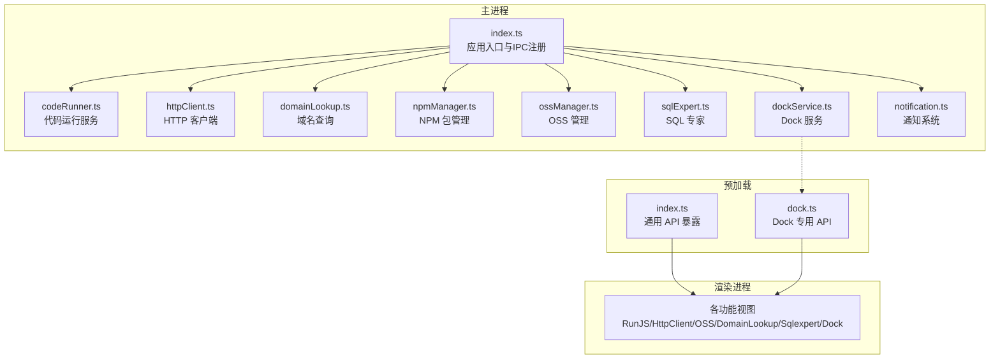
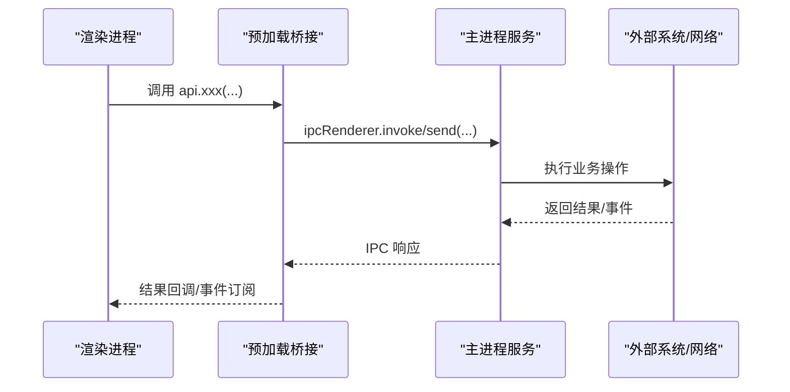
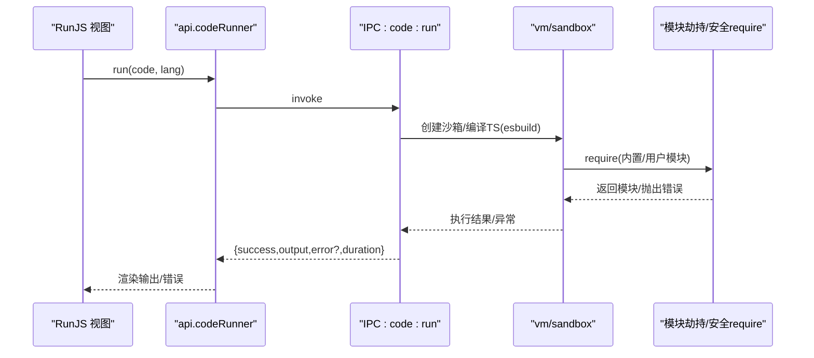
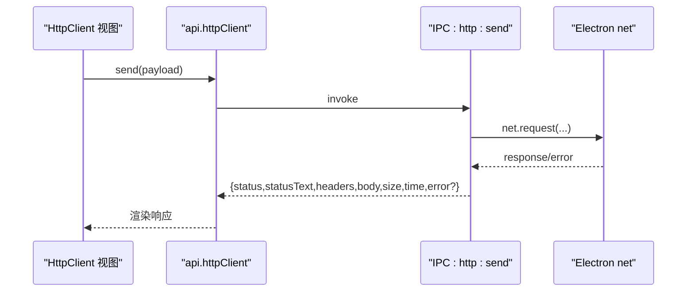
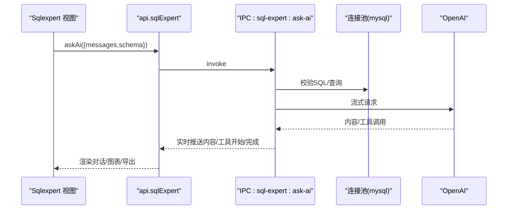
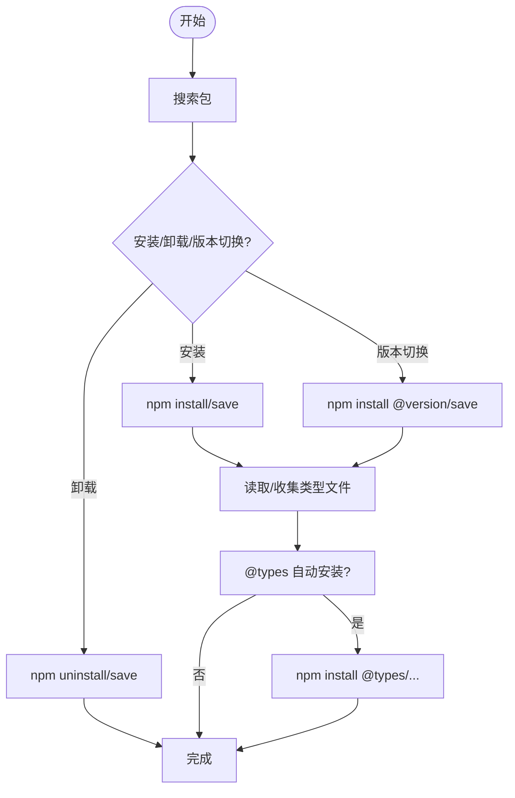
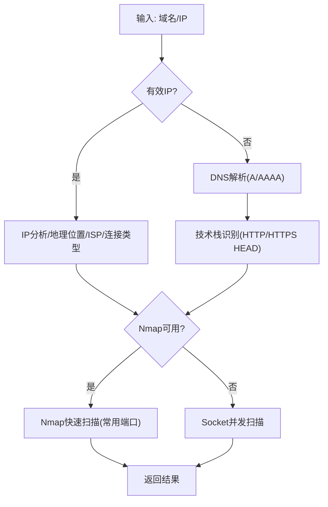
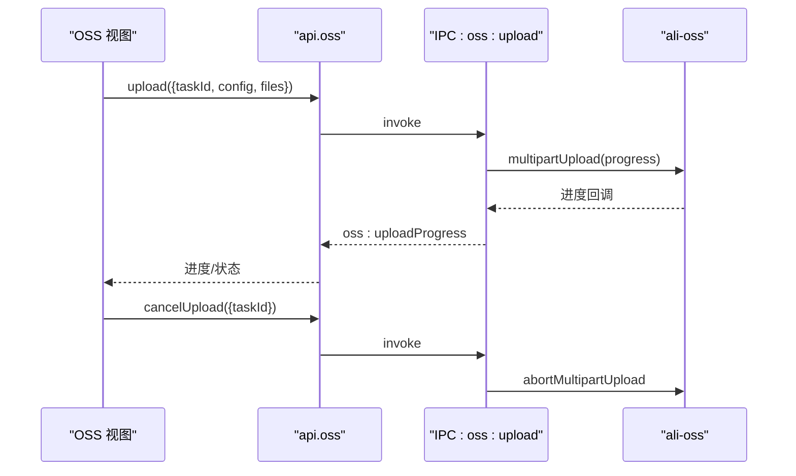
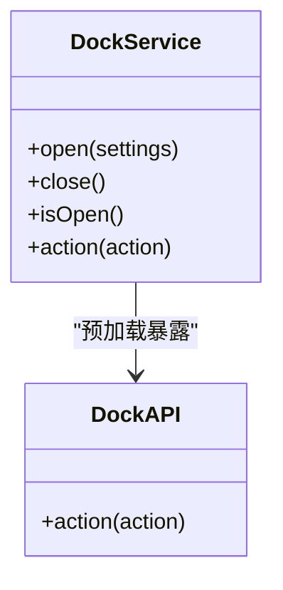
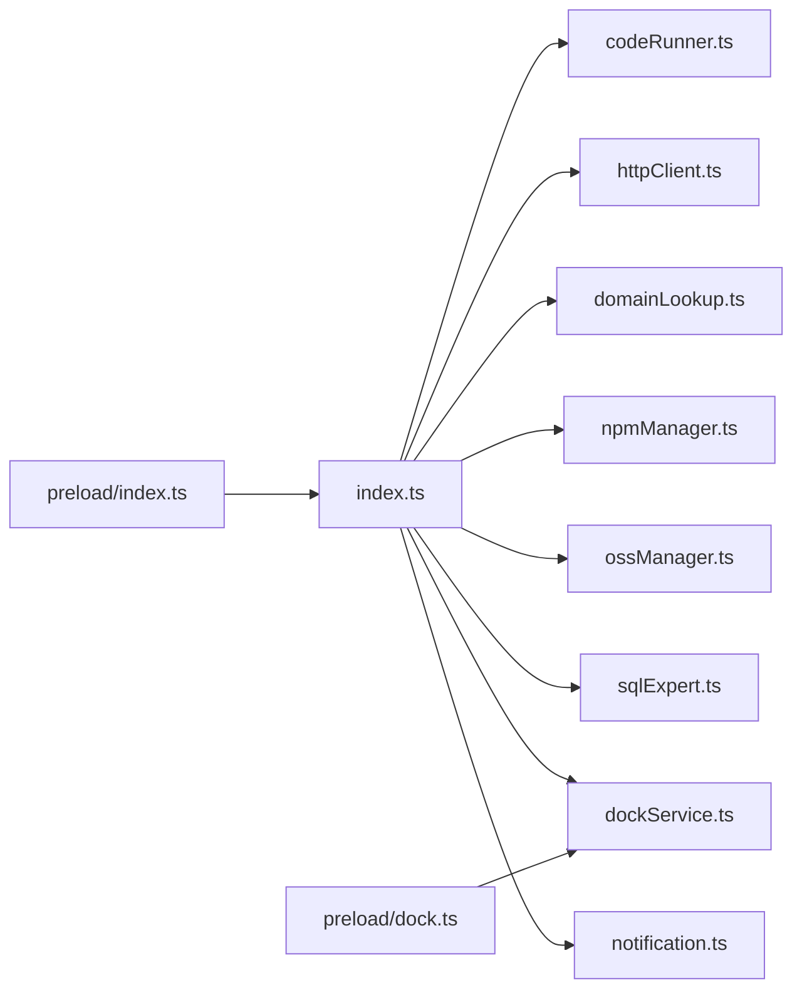

# 核心服务模块

<cite>
**本文档引用的文件**
- [src/main/services/codeRunner.ts](file://src/main/services/codeRunner.ts)
- [src/main/services/dockService.ts](file://src/main/services/dockService.ts)
- [src/main/services/domainLookup.ts](file://src/main/services/domainLookup.ts)
- [src/main/services/httpClient.ts](file://src/main/services/httpClient.ts)
- [src/main/services/notification.ts](file://src/main/services/notification.ts)
- [src/main/services/npmManager.ts](file://src/main/services/npmManager.ts)
- [src/main/services/ossManager.ts](file://src/main/services/ossManager.ts)
- [src/main/services/sqlExpert.ts](file://src/main/services/sqlExpert.ts)
- [src/main/index.ts](file://src/main/index.ts)
- [src/preload/index.ts](file://src/preload/index.ts)
- [src/preload/dock.ts](file://src/preload/dock.ts)
- [package.json](file://package.json)
</cite>

## 目录
1. [简介](#简介)
2. [项目结构](#项目结构)
3. [核心组件](#核心组件)
4. [架构总览](#架构总览)
5. [详细组件分析](#详细组件分析)
6. [依赖关系分析](#依赖关系分析)
7. [性能考虑](#性能考虑)
8. [故障排查指南](#故障排查指南)
9. [结论](#结论)
10. [附录](#附录)

## 简介
本文件面向开发者工具箱的核心服务模块，系统性梳理并解读以下服务：
- 代码运行服务：沙箱执行、模块安全加载、服务器生命周期管理
- HTTP 客户端：绕过 CORS、统一代理、超时与错误处理
- SQL 专家：数据库连接池、AI 对话、工具调用、Schema 动态生成
- NPM 包管理：包搜索、安装/卸载、版本切换、类型系统集成
- 域名查询：DNS 解析、IP 地理位置、ISP 信息、反向 DNS、端口扫描
- OSS 管理：阿里云 OSS 上传、断点续传、进度回调、取消上传
- Dock 服务：系统集成、窗口层级、动作路由、平台差异处理
- 通知系统：全局通知桥接、渲染进程广播

每个服务均包含职责边界、实现原理、API 接口、配置选项、错误处理与最佳实践，并提供集成指引与可视化流程图。

## 项目结构
核心服务位于主进程 src/main/services 下，通过 IPC 与渲染进程交互；预加载脚本 src/preload 提供安全的 API 暴露层。

**图表来源**
- [src/main/index.ts:421-429](file://src/main/index.ts#L421-L429)
- [src/preload/index.ts:1-229](file://src/preload/index.ts#L1-L229)
- [src/preload/dock.ts:1-19](file://src/preload/dock.ts#L1-L19)

**章节来源**
- [src/main/index.ts:421-429](file://src/main/index.ts#L421-L429)
- [src/preload/index.ts:1-229](file://src/preload/index.ts#L1-L229)
- [src/preload/dock.ts:1-19](file://src/preload/dock.ts#L1-L19)

## 核心组件
- 代码运行服务：基于 vm/sandbox + esbuild 编译 + http/https/net 模块劫持，支持 TypeScript 编译、实时日志、服务器生命周期管理与端口终止
- HTTP 客户端：基于 Electron net 模块，绕过浏览器 CORS，自动使用应用代理设置，统一超时与错误处理
- SQL 专家：数据库连接池 + OpenAI 流式对话 + 工具调用（查询、描述表、渲染图表、导出、记忆沉淀）
- NPM 包管理：包搜索、安装/卸载、版本切换、类型文件收集与 @types 自动安装
- 域名查询：DNS 解析、IP 地理位置、ISP 信息、反向 DNS、端口扫描（Nmap 优先，Socket 备选）
- OSS 管理：阿里云 OSS 客户端封装、多文件上传、断点续传、进度回调、取消上传
- Dock 服务：系统集成窗口、位置计算、动作路由、平台差异处理
- 通知系统：全局通知桥接，渲染进程统一接收

**章节来源**
- [src/main/services/codeRunner.ts:98-318](file://src/main/services/codeRunner.ts#L98-L318)
- [src/main/services/httpClient.ts:15-112](file://src/main/services/httpClient.ts#L15-L112)
- [src/main/services/sqlExpert.ts:968-1501](file://src/main/services/sqlExpert.ts#L968-L1501)
- [src/main/services/npmManager.ts:207-552](file://src/main/services/npmManager.ts#L207-L552)
- [src/main/services/domainLookup.ts:679-689](file://src/main/services/domainLookup.ts#L679-L689)
- [src/main/services/ossManager.ts:296-439](file://src/main/services/ossManager.ts#L296-L439)
- [src/main/services/dockService.ts:111-229](file://src/main/services/dockService.ts#L111-L229)
- [src/main/services/notification.ts:15-28](file://src/main/services/notification.ts#L15-L28)

## 架构总览
主进程通过 IPC 暴露服务，渲染进程通过预加载桥接调用；Dock 服务使用独立窗口并在预加载中暴露专用 API。

**图表来源**
- [src/preload/index.ts:11-229](file://src/preload/index.ts#L11-L229)
- [src/main/index.ts:421-429](file://src/main/index.ts#L421-L429)

## 详细组件分析

### 代码运行服务（沙箱执行与模块安全）
- 职责边界
  - 在主进程中安全执行用户代码（JavaScript/TypeScript）
  - 捕获 console 输出并实时回传
  - 管理 http/https/net 服务器生命周期，支持清理与端口终止
  - 安全 require：内置模块白名单 + 用户安装包目录隔离
- 实现要点
  - 使用 vm.createContext 构建沙箱，注入安全的 console/process 等
  - esbuild 将 TypeScript 编译为 ESModule/CJS，再注入 vm 执行
  - 全局劫持 http/https/net 模块，追踪并统一清理 Server 实例
  - createSafeRequire 限制模块加载范围，避免任意文件系统访问
  - 提供 code:run、code:stop、code:clean、code:killPort IPC 接口
- API 接口
  - run(code, language)：执行代码，返回 {success, output, error?, duration}
  - stop()：清理活动服务器
  - clean()：强制清理服务器
  - killPort(port)：终止占用端口的 electron 进程
- 配置与最佳实践
  - 仅允许同步执行与顶层 Promise，避免长时间阻塞
  - 使用 TypeScript 时自动编译，注意类型检查与导入路径
  - 服务器启动后不会阻塞，可通过 killPort 终止
  - 建议在执行前清理旧服务器，避免端口占用
- 错误处理
  - 捕获语法/运行时错误，实时上报 stderr
  - 端口查找失败时返回明确错误信息
- 性能与安全
  - 30s 超时保护
  - 严格限制 require 范围，避免加载未安装模块
  - 输出格式化与长度限制，避免内存膨胀

**图表来源**
- [src/main/services/codeRunner.ts:98-246](file://src/main/services/codeRunner.ts#L98-L246)
- [src/preload/index.ts:62-70](file://src/preload/index.ts#L62-L70)

**章节来源**
- [src/main/services/codeRunner.ts:98-318](file://src/main/services/codeRunner.ts#L98-L318)
- [src/preload/index.ts:62-70](file://src/preload/index.ts#L62-L70)

### HTTP 客户端（绕过 CORS 的请求服务）
- 职责边界
  - 在主进程发起 HTTP/HTTPS 请求，绕过浏览器 CORS 限制
  - 自动使用应用代理设置，支持超时与错误处理
- 实现要点
  - 基于 Electron net.request，支持 GET/POST/PUT/PATCH/DELETE
  - 统一超时控制（默认 30s），错误时返回标准化结构
  - 自动合并响应头为字符串形式，便于前端处理
- API 接口
  - send({method, url, headers, body?, timeout?})：返回 {status, statusText, headers, body, size, time, error?}
- 配置与最佳实践
  - 通过 app:setProxy 设置代理，影响 autoUpdater 与 HTTP 请求
  - 建议在渲染进程通过 api.httpClient 调用，避免跨域限制
- 错误处理
  - 超时返回 status=0，error 包含超时信息
  - 网络错误返回 error 字段
- 性能与安全
  - 使用 net 模块，避免浏览器同源策略
  - 保持超时合理，避免长时间阻塞

**图表来源**
- [src/main/services/httpClient.ts:15-112](file://src/main/services/httpClient.ts#L15-L112)
- [src/preload/index.ts:106-115](file://src/preload/index.ts#L106-L115)

**章节来源**
- [src/main/services/httpClient.ts:15-112](file://src/main/services/httpClient.ts#L15-L112)
- [src/main/index.ts:306-327](file://src/main/index.ts#L306-L327)
- [src/preload/index.ts:106-115](file://src/preload/index.ts#L106-L115)

### SQL 专家（AI 分析与数据库工具）
- 职责边界
  - 数据库连接池管理、SQL 校验、Schema 动态生成
  - OpenAI 流式对话 + 工具调用（查询、描述表、渲染图表、导出、记忆沉淀）
  - 配置持久化（数据库/模型）、记忆管理、余额查询
- 实现要点
  - mysql2/promise 连接池，限制并发与队列
  - SQL 校验：仅允许 SELECT/WITH，禁止系统库访问，禁止 SELECT *
  - 工具定义：query_database、describe_table_schema、render_chart、export_data、save_memory
  - 流式 AI：OpenAI Chat Completions 流式返回，实时推送内容与工具调用
  - 记忆系统：本地 JSON 文件，支持增删改查
- API 接口
  - testDb(config)：测试数据库连接
  - saveConfig(config)/loadConfig()：保存/加载配置
  - loadSchema(dbConfig?)：动态加载 Schema 并缓存
  - describeTable(tableNames)：查询表结构
  - executeSql(sql)：执行只读 SQL
  - askAi(payload)：流式对话，支持取消
  - checkBalance({url?, apiKey?})：查询余额
  - 记忆接口：load-memories、add-memory、update-memory、delete-memory
- 配置与最佳实践
  - 数据库配置与 AI 模型配置分离，分别持久化
  - Schema 与记忆按数据库名与 API Key 组合命名，避免冲突
  - 导出 CSV 时自动规范化文件名，避免非法字符
- 错误处理
  - SQL 校验失败直接抛出错误
  - 工具调用异常记录状态与错误信息
  - AI 请求可取消，避免长时间占用
- 性能与安全
  - 查询超时 60s，结果限制 10 行，避免大结果集
  - 仅允许只读 SQL，禁止 DDL/DML
  - 连接池限制并发，避免资源耗尽

**图表来源**
- [src/main/services/sqlExpert.ts:1280-1501](file://src/main/services/sqlExpert.ts#L1280-L1501)
- [src/preload/index.ts:156-212](file://src/preload/index.ts#L156-L212)

**章节来源**
- [src/main/services/sqlExpert.ts:968-1501](file://src/main/services/sqlExpert.ts#L968-L1501)
- [src/preload/index.ts:156-212](file://src/preload/index.ts#L156-L212)

### NPM 包管理（类型系统与版本控制）
- 职责边界
  - 包搜索、安装/卸载、版本切换、类型文件收集与 @types 自动安装
  - 包安装目录可配置，支持重置与版本列表查询
- 实现要点
  - 使用 npm 命令行进行真实安装/卸载，写入 package.json
  - 类型文件收集：递归解析 d.ts 引用，支持 @types 自动安装
  - 默认内置包（lodash/dayjs/uuid/axios/express），升级补全 express
  - 支持镜像源（npmmirror.com）加速安装
- API 接口
  - search(query)、install(name)、uninstall(name)、list()
  - versions(name)、changeVersion(name, version)
  - getDir/setDir/resetDir
  - getTypes(name)、clearTypeCache(name)
- 配置与最佳实践
  - 包安装目录可自定义，需具备写权限
  - 类型文件缓存由渲染进程维护，变更版本后需清理缓存
  - 版本切换会覆盖旧版本，注意依赖兼容性
- 错误处理
  - 安装/卸载失败返回详细输出
  - 类型文件缺失时尝试自动安装 @types 包
- 性能与安全
  - 60s 超时保护
  - 仅允许受控包名与内置模块白名单

**图表来源**
- [src/main/services/npmManager.ts:207-552](file://src/main/services/npmManager.ts#L207-L552)

**章节来源**
- [src/main/services/npmManager.ts:207-552](file://src/main/services/npmManager.ts#L207-L552)
- [src/preload/index.ts:71-85](file://src/preload/index.ts#L71-L85)

### 域名查询（网络诊断与端口扫描）
- 职责边界
  - DNS 解析、IP 地理位置、ISP 信息、反向 DNS、技术栈识别
  - 端口扫描：Nmap 优先，Socket 备选，支持解码与指纹提取
- 实现要点
  - IP 分析：IPv4/IPv6、私有/公有、网络类别、子网
  - ip-api.com 获取地理/ISP/连接类型信息
  - 技术栈识别：HEAD 请求 + 响应头匹配（Cloudflare/Vercel/Akamai 等）
  - 端口扫描：Nmap 常用端口快速扫描 + 版本探测，降强度与非特权模式
  - Socket 扫描：并发批量扫描，限制并发数
- API 接口
  - lookup(input)：统一查询（域名/IP）
  - scanPorts(ip)：端口扫描
- 配置与最佳实践
  - 未检测到 Nmap 时自动降级为 Socket 扫描
  - 扫描耗时较长，建议在后台执行并提示用户
- 错误处理
  - DNS 解析失败返回空 IP 列表
  - ip-api.com 请求失败时返回 null
- 性能与安全
  - Nmap 扫描带超时与强度控制
  - Socket 扫描限制并发，避免阻塞

**图表来源**
- [src/main/services/domainLookup.ts:606-666](file://src/main/services/domainLookup.ts#L606-L666)
- [src/main/services/domainLookup.ts:590-602](file://src/main/services/domainLookup.ts#L590-L602)

**章节来源**
- [src/main/services/domainLookup.ts:679-689](file://src/main/services/domainLookup.ts#L679-L689)
- [src/main/services/domainLookup.ts:606-666](file://src/main/services/domainLookup.ts#L606-L666)
- [src/main/services/domainLookup.ts:590-602](file://src/main/services/domainLookup.ts#L590-L602)

### OSS 管理（阿里云存储上传）
- 职责边界
  - 阿里云 OSS 客户端封装、多文件上传、断点续传、进度回调、取消上传
- 实现要点
  - Endpoint 解析：支持 region/cname/自定义 host
  - 断点续传：multipartUpload + progress 回调，支持取消
  - 进度计算：单文件与总体进度，80ms 间隔节流
  - 任务管理：Map 存储 activeTasks，支持取消并 abort
- API 接口
  - selectFiles()/selectFolder()：选择文件/文件夹
  - upload({taskId, config, files})：上传任务
  - cancelUpload({taskId})：取消任务
- 配置与最佳实践
  - 支持 public-read/private/public-read-write ACL
  - 目标路径自动规范化，支持相对路径拼接
  - 上传完成后通知成功/失败与错误明细
- 错误处理
  - 任务不存在或已结束返回明确错误
  - 取消时主动 abort multipartUpload
- 性能与安全
  - 5MB 分片、4 并发，平衡速度与稳定性
  - 严格校验配置完整性

**图表来源**
- [src/main/services/ossManager.ts:296-439](file://src/main/services/ossManager.ts#L296-L439)
- [src/preload/index.ts:117-154](file://src/preload/index.ts#L117-L154)

**章节来源**
- [src/main/services/ossManager.ts:296-439](file://src/main/services/ossManager.ts#L296-L439)
- [src/preload/index.ts:117-154](file://src/preload/index.ts#L117-L154)

### Dock 服务（系统集成与动作路由）
- 职责边界
  - macOS 风格 Dock 窗口：位置计算、尺寸适配、始终置顶、跨工作区显示
  - 动作路由：打开设置、打开文件夹、打开终端、打开浏览器、打开应用/链接
- 实现要点
  - 独立 BrowserWindow，预加载 dock.ts 暴露 dockAPI
  - 位置计算：根据图标数量、间距、tooltip 宽高计算窗口尺寸
  - 平台差异：Windows 使用 cmd，macOS 使用 open -a Terminal，Linux 使用 x-terminal-emulator
  - 动作处理：支持 openUrl:xxx 与 openApp:xxx（路径转义处理）
- API 接口
  - open(settings)/close()/isOpen()
  - action(actionStr)：执行动作
- 配置与最佳实践
  - Dock 窗口 alwaysOnTop(screen-saver)，跨工作区可见
  - 打开 Dock 时隐藏主窗口，关闭 Dock 恢复主窗口
- 错误处理
  - 未知动作记录日志，不中断流程
- 性能与安全
  - 窗口无边框、透明背景，减少资源占用
  - 预加载启用 contextIsolation，限制 Node 集成

**图表来源**
- [src/main/services/dockService.ts:111-229](file://src/main/services/dockService.ts#L111-L229)
- [src/preload/dock.ts:4-6](file://src/preload/dock.ts#L4-L6)

**章节来源**
- [src/main/services/dockService.ts:111-229](file://src/main/services/dockService.ts#L111-L229)
- [src/preload/dock.ts:1-19](file://src/preload/dock.ts#L1-L19)

### 通知系统（全局消息管理）
- 职责边界
  - 从主进程向渲染进程发送通知，统一 info/success/warning/error
- 实现要点
  - sendNotification(message, type)：遍历所有窗口，发送 app:notify
  - notify 对象提供便捷方法：info/success/warning/error
- API 接口
  - sendNotification(message, type)
  - notify.info/warning/success/error
- 集成建议
  - 在服务内部统一使用 notify，避免分散的日志打印
  - 渲染进程通过 api.notification.onNotify 订阅

**章节来源**
- [src/main/services/notification.ts:15-28](file://src/main/services/notification.ts#L15-L28)
- [src/preload/index.ts:50-60](file://src/preload/index.ts#L50-L60)

## 依赖关系分析
- 主进程入口 src/main/index.ts 统一注册各服务
- 预加载 src/preload/index.ts 暴露统一 API，Dock 专用 API 在 src/preload/dock.ts
- package.json 声明核心依赖：ali-oss、mysql2、openai、esbuild、electron-updater 等

**图表来源**
- [src/main/index.ts:421-429](file://src/main/index.ts#L421-L429)
- [src/preload/index.ts:1-229](file://src/preload/index.ts#L1-L229)
- [src/preload/dock.ts:1-19](file://src/preload/dock.ts#L1-L19)

**章节来源**
- [src/main/index.ts:421-429](file://src/main/index.ts#L421-L429)
- [package.json:28-51](file://package.json#L28-L51)

## 性能考虑
- 代码运行：30s 超时，避免长时间阻塞；服务器统一清理，防止端口占用
- HTTP 客户端：统一超时与错误处理，避免长时间等待
- SQL 专家：查询超时 60s，结果限制 10 行；连接池限制并发
- NPM：60s 超时，镜像源加速；类型文件递归收集，避免重复读取
- 域名查询：Nmap 降强度与非特权模式；Socket 扫描限制并发
- OSS：5MB 分片、4 并发；80ms 进度节流
- Dock：无边框透明窗口，减少资源占用

## 故障排查指南
- 代码运行
  - 端口占用：使用 code:killPort 终止占用进程
  - 模块未安装：检查已安装包列表，或在 NPM 面板安装
  - 输出过大：输出格式化与长度限制，避免内存溢出
- HTTP 客户端
  - CORS 问题：使用主进程 http:send，绕过浏览器限制
  - 代理设置：通过 app:setProxy 设置代理，影响 autoUpdater 与 HTTP 请求
- SQL 专家
  - 连接失败：使用 testDb 检查连接参数
  - SQL 不合法：仅允许 SELECT/WITH，禁止系统库与 SELECT *
  - AI 请求卡住：使用 cancel-ask-ai 取消
- NPM
  - 安装失败：检查网络与镜像源，查看详细输出
  - 类型文件缺失：尝试自动安装 @types 包或手动刷新类型缓存
- 域名查询
  - Nmap 未安装：自动降级为 Socket 扫描，范围有限
  - ip-api.com 失败：返回 null，不影响其他信息
- OSS
  - 上传失败：检查配置与网络，查看错误详情
  - 取消无效：确认 taskId 正确且任务仍活跃
- Dock
  - 窗口不显示：检查 alwaysOnTop 与跨工作区设置
  - 动作无效：确认 action 字符串格式（openUrl:/ openApp:）

**章节来源**
- [src/main/services/codeRunner.ts:248-318](file://src/main/services/codeRunner.ts#L248-L318)
- [src/main/services/httpClient.ts:15-112](file://src/main/services/httpClient.ts#L15-L112)
- [src/main/services/sqlExpert.ts:968-1057](file://src/main/services/sqlExpert.ts#L968-L1057)
- [src/main/services/npmManager.ts:232-267](file://src/main/services/npmManager.ts#L232-L267)
- [src/main/services/domainLookup.ts:590-602](file://src/main/services/domainLookup.ts#L590-L602)
- [src/main/services/ossManager.ts:296-311](file://src/main/services/ossManager.ts#L296-L311)
- [src/main/services/dockService.ts:161-228](file://src/main/services/dockService.ts#L161-L228)

## 结论
开发者工具箱的核心服务模块围绕“安全、可控、可观测”的设计原则构建：主进程负责关键能力与系统集成，预加载提供安全 API 暴露，渲染进程专注 UI 与交互。各服务通过 IPC 解耦，具备完善的错误处理与性能保障。建议在集成时遵循各服务的最佳实践，合理配置与监控，确保稳定高效的开发体验。

## 附录
- 集成指引
  - 在渲染进程通过 api.xxx 调用对应服务
  - 代码运行：api.codeRunner.run(code, language)
  - HTTP 请求：api.httpClient.send(payload)
  - SQL 专家：api.sqlExpert.askAi(payload) + onAiContent/onAiToolStart/onAiToolDone
  - NPM：api.npm.search/install/list/getTypes
  - 域名查询：api.domainLookup.lookup(input) / scanPorts(ip)
  - OSS：api.oss.selectFiles/selectFolder/upload/onUploadProgress
  - Dock：api.dock.open/close/isOpen/action
- 配置文件
  - SQL 专家配置与 Schema 缓存位于 userData/sql-expert 目录
  - NPM 配置位于 userData/npm-config.json
  - OSS 任务状态与进度通过 IPC 事件推送