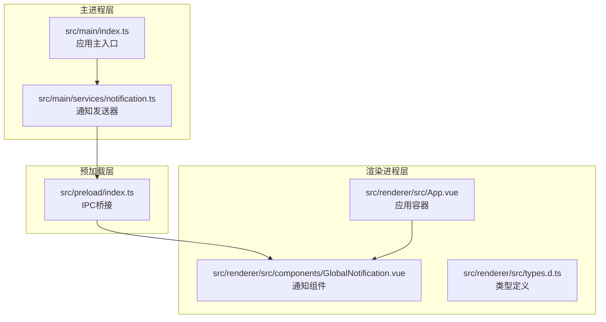
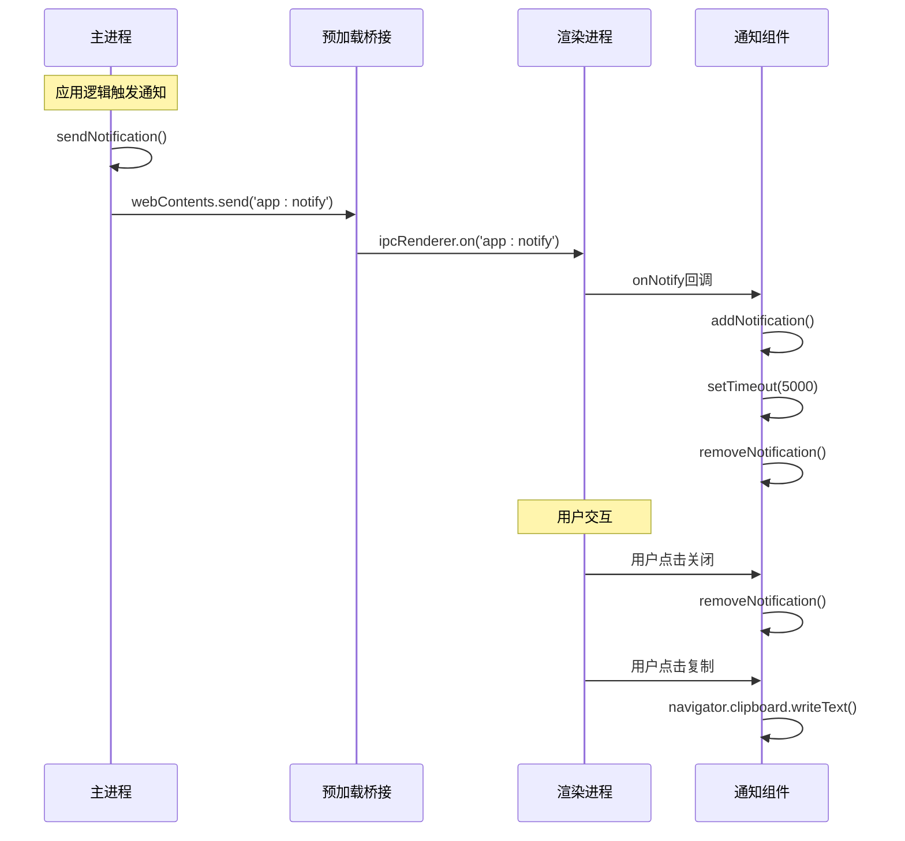
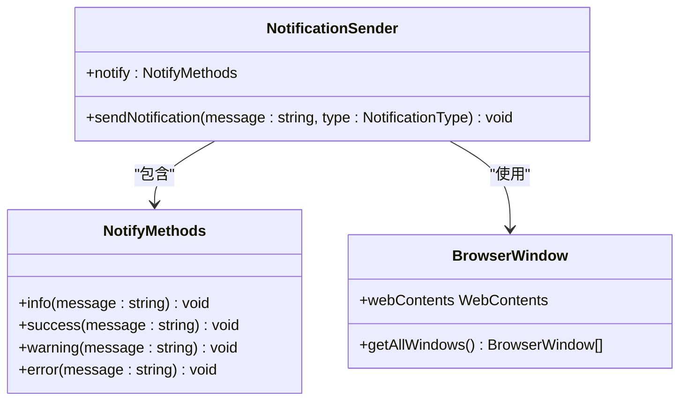
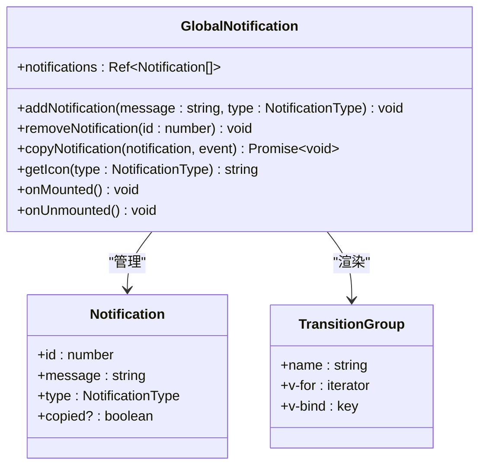
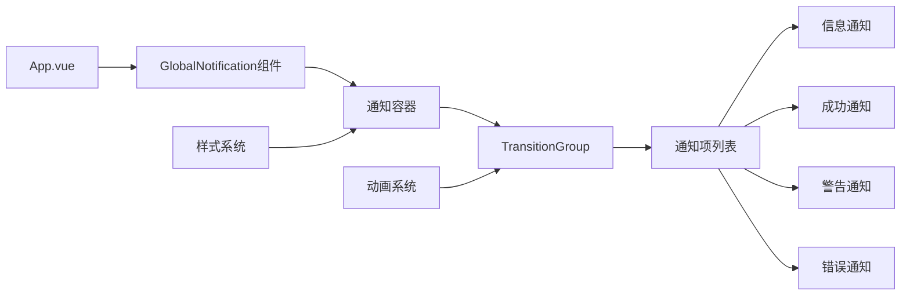

# 通知服务

<cite>
**本文档引用的文件**
- [notification.ts](file://src/main/services/notification.ts)
- [GlobalNotification.vue](file://src/renderer/src/components/GlobalNotification.vue)
- [index.ts](file://src/main/index.ts)
- [index.ts](file://src/preload/index.ts)
- [index.css](file://src/renderer/src/styles/index.css)
- [App.vue](file://src/renderer/src/App.vue)
- [types.d.ts](file://src/renderer/src/types.d.ts)
</cite>

## 目录
1. [简介](#简介)
2. [项目结构](#项目结构)
3. [核心组件](#核心组件)
4. [架构概览](#架构概览)
5. [详细组件分析](#详细组件分析)
6. [依赖关系分析](#依赖关系分析)
7. [性能考虑](#性能考虑)
8. [故障排除指南](#故障排除指南)
9. [结论](#结论)
10. [附录](#附录)

## 简介

通知服务是 Dev Toolbox 应用中的一个关键组件，负责在主进程和渲染进程之间传递系统通知。该服务实现了跨进程通信机制，支持多种通知类型，并提供了简洁的 API 接口供其他模块调用。

当前的通知系统具有以下特点：
- 跨进程通知传递（主进程 ↔ 渲染进程）
- 四种通知类型：信息、成功、警告、错误
- 自动消失机制（5秒后自动移除）
- 手动关闭功能
- 复制通知内容到剪贴板
- 响应式动画效果

## 项目结构

通知服务涉及三个主要层次的文件：



**图表来源**
- [notification.ts:1-29](file://src/main/services/notification.ts#L1-L29)
- [index.ts:1-444](file://src/main/index.ts#L1-L444)
- [index.ts:1-229](file://src/preload/index.ts#L1-L229)
- [GlobalNotification.vue:1-211](file://src/renderer/src/components/GlobalNotification.vue#L1-L211)

**章节来源**
- [notification.ts:1-29](file://src/main/services/notification.ts#L1-L29)
- [index.ts:1-444](file://src/main/index.ts#L1-L444)
- [index.ts:1-229](file://src/preload/index.ts#L1-L229)
- [GlobalNotification.vue:1-211](file://src/renderer/src/components/GlobalNotification.vue#L1-L211)
- [App.vue:1-102](file://src/renderer/src/App.vue#L1-L102)

## 核心组件

通知服务由四个核心组件构成：

### 1. 通知发送器（主进程）
- 类型：`sendNotification(message: string, type: NotificationType)`
- 功能：向所有打开的窗口发送通知
- 特性：单例模式，确保通知一致性

### 2. 通知接收器（渲染进程）
- 组件：`GlobalNotification.vue`
- 功能：接收通知、管理通知列表、处理用户交互
- 特性：自动消失、手动关闭、复制功能

### 3. IPC 桥接器
- 文件：`src/preload/index.ts`
- 功能：暴露安全的 API 给渲染进程
- 特性：类型安全、事件监听管理

### 4. 应用集成点
- 文件：`src/renderer/src/App.vue`
- 功能：全局通知组件挂载点
- 特性：与应用生命周期集成

**章节来源**
- [notification.ts:15-28](file://src/main/services/notification.ts#L15-L28)
- [GlobalNotification.vue:16-66](file://src/renderer/src/components/GlobalNotification.vue#L16-L66)
- [index.ts:50-60](file://src/preload/index.ts#L50-L60)
- [App.vue:57-58](file://src/renderer/src/App.vue#L57-L58)

## 架构概览

通知服务采用典型的 Electron IPC 架构模式：



**图表来源**
- [notification.ts:15-20](file://src/main/services/notification.ts#L15-L20)
- [index.ts:52-59](file://src/preload/index.ts#L52-L59)
- [GlobalNotification.vue:54-62](file://src/renderer/src/components/GlobalNotification.vue#L54-L62)

## 详细组件分析

### 通知发送器（主进程）

通知发送器是一个轻量级的服务模块，提供统一的通知发送接口：



**图表来源**
- [notification.ts:15-28](file://src/main/services/notification.ts#L15-L28)

**章节来源**
- [notification.ts:1-29](file://src/main/services/notification.ts#L1-L29)

### 通知接收器（渲染进程）

通知接收器是一个 Vue 组件，负责处理通知的显示和交互：



**图表来源**
- [GlobalNotification.vue:6-66](file://src/renderer/src/components/GlobalNotification.vue#L6-L66)

**章节来源**
- [GlobalNotification.vue:1-211](file://src/renderer/src/components/GlobalNotification.vue#L1-L211)

### IPC 桥接器

预加载脚本提供了类型安全的 API 暴露机制：

```mermaid
flowchart TD
A[预加载初始化] --> B[创建API对象]
B --> C[window.api.notification]
C --> D[onNotify(callback)]
C --> E[removeListener()]
D --> F[ipcRenderer.on('app:notify')]
F --> G[回调执行]
E --> H[移除所有监听器]
I[类型定义] --> J[NotificationType]
J --> K['info' | 'success' | 'warning' | 'error']
```

**图表来源**
- [index.ts:50-60](file://src/preload/index.ts#L50-L60)
- [types.d.ts:130-136](file://src/renderer/src/types.d.ts#L130-L136)

**章节来源**
- [index.ts:1-229](file://src/preload/index.ts#L1-L229)
- [types.d.ts:130-136](file://src/renderer/src/types.d.ts#L130-L136)

### 应用集成

通知服务与应用的整体集成：



**图表来源**
- [App.vue:57-58](file://src/renderer/src/App.vue#L57-L58)
- [GlobalNotification.vue:70-95](file://src/renderer/src/components/GlobalNotification.vue#L70-L95)

**章节来源**
- [App.vue:1-102](file://src/renderer/src/App.vue#L1-L102)
- [index.css:98-210](file://src/renderer/src/styles/index.css#L98-L210)

## 依赖关系分析

通知服务的依赖关系相对简单但功能完整：

```mermaid
graph TB
subgraph "外部依赖"
A[Electron BrowserWindow]
B[Vue 3 Composition API]
C[IPC通信]
end
subgraph "内部模块"
D[notification.ts]
E[index.ts (preload)]
F[GlobalNotification.vue]
G[types.d.ts]
end
D --> A
E --> C
F --> B
F --> E
G --> F
H[应用主入口] --> D
H --> E
I[App.vue] --> F
```

**图表来源**
- [notification.ts:5-6](file://src/main/services/notification.ts#L5-L6)
- [index.ts:1-2](file://src/preload/index.ts#L1-L2)
- [GlobalNotification.vue:2-3](file://src/renderer/src/components/GlobalNotification.vue#L2-L3)

**章节来源**
- [notification.ts:1-29](file://src/main/services/notification.ts#L1-L29)
- [index.ts:1-229](file://src/preload/index.ts#L1-L229)
- [GlobalNotification.vue:1-211](file://src/renderer/src/components/GlobalNotification.vue#L1-L211)

## 性能考虑

当前通知系统在性能方面有以下特点：

### 内存管理
- 使用 Vue 的响应式系统管理通知列表
- 自动定时器清理机制（5秒后自动移除）
- 组件卸载时清理所有事件监听器

### 渲染性能
- 使用 CSS 过渡动画而非 JavaScript 动画
- 单一通知容器，避免 DOM 节点过多
- 使用 `TransitionGroup` 进行高效的列表动画

### IPC 通信效率
- 单一 IPC 通道 `'app:notify'`
- 轻量级数据传输（字符串 + 类型）
- 事件监听器的正确清理

**章节来源**
- [GlobalNotification.vue:20-22](file://src/renderer/src/components/GlobalNotification.vue#L20-L22)
- [GlobalNotification.vue:60-62](file://src/renderer/src/components/GlobalNotification.vue#L60-L62)

## 故障排除指南

### 常见问题及解决方案

#### 1. 通知无法显示
**症状**：调用通知函数后没有界面变化  
**可能原因**：
- 渲染进程未正确初始化
- IPC 通信中断
- 窗口实例不存在

**解决步骤**：
1. 检查 `GlobalNotification.vue` 是否正确挂载
2. 验证 IPC 通道是否正常工作
3. 确认有活动的 BrowserWindow 实例

#### 2. 通知不自动消失
**症状**：通知显示后不会自动移除  
**可能原因**：
- `setTimeout` 调度异常
- 组件状态管理问题

**解决步骤**：
1. 检查 `addNotification` 函数中的定时器设置
2. 验证 `removeNotification` 方法的索引查找逻辑

#### 3. 复制功能失效
**症状**：点击复制按钮无响应  
**可能原因**：
- 浏览器剪贴板 API 不可用
- 权限问题

**解决步骤**：
1. 检查浏览器兼容性
2. 验证 HTTPS 环境要求
3. 确认用户授权状态

**章节来源**
- [GlobalNotification.vue:32-43](file://src/renderer/src/components/GlobalNotification.vue#L32-L43)
- [index.ts:52-59](file://src/preload/index.ts#L52-L59)

## 结论

通知服务当前版本实现了基本的跨进程通知功能，具有以下优势：
- 架构简洁，易于理解和维护
- 类型安全的 API 设计
- 良好的用户体验（自动消失、手动关闭、复制功能）
- 与应用整体架构无缝集成

存在的局限性：
- 缺少通知队列管理机制
- 无优先级排序功能
- 无去重机制
- 不支持用户偏好设置
- 无静默模式
- 无批量操作功能

建议的改进方向：
1. 实现通知队列和优先级管理
2. 添加去重和合并机制
3. 支持用户偏好设置和静默模式
4. 提供批量操作 API
5. 增强通知持久化存储
6. 添加通知历史记录功能

## 附录

### API 接口规范

#### 主进程 API
```typescript
// 发送通知
function sendNotification(message: string, type: NotificationType): void;

// 便捷方法
const notify = {
  info(message: string): void,
  success(message: string): void,
  warning(message: string): void,
  error(message: string): void
};
```

#### 渲染进程 API
```typescript
// 监听通知
window.api.notification.onNotify((message: string, type: NotificationType) => void);

// 移除监听器
window.api.notification.removeListener();

// 暴露的方法
interface NotificationAPI {
  onNotify: (callback: (message: string, type: NotificationType) => void) => void;
  removeListener: () => void;
}
```

**章节来源**
- [notification.ts:15-28](file://src/main/services/notification.ts#L15-L28)
- [types.d.ts:133-136](file://src/renderer/src/types.d.ts#L133-L136)
- [index.ts:50-60](file://src/preload/index.ts#L50-L60)