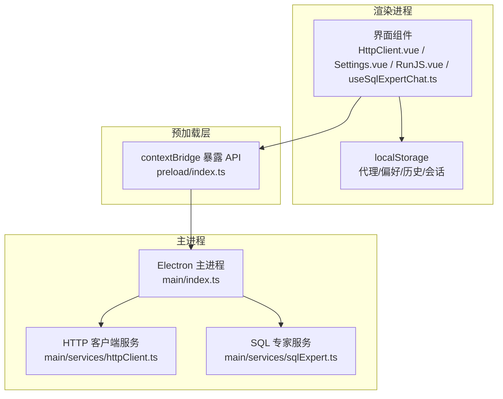
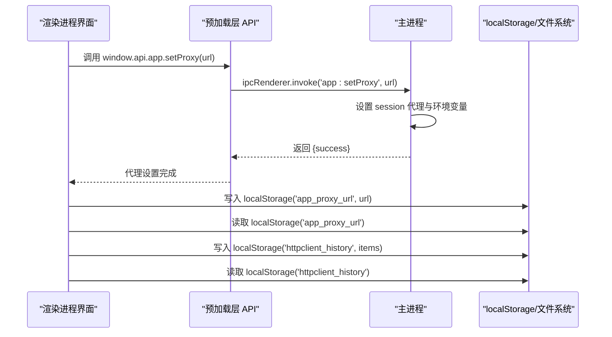
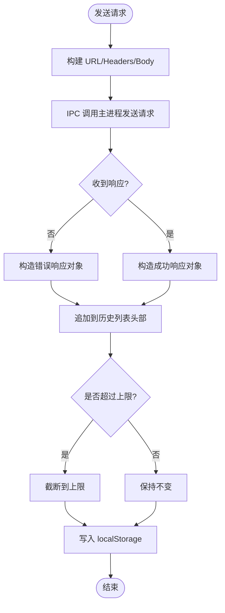
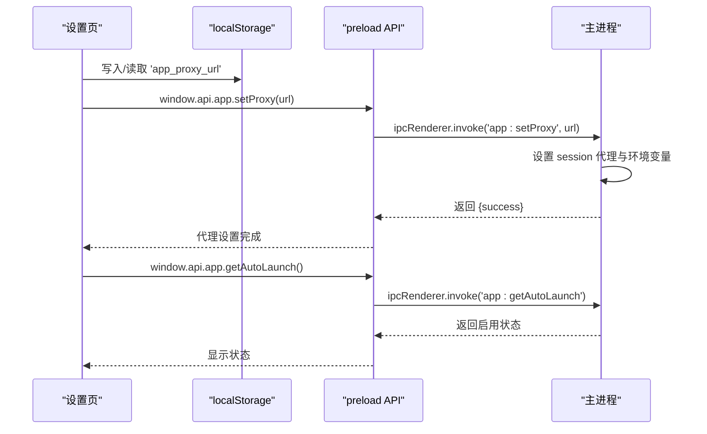
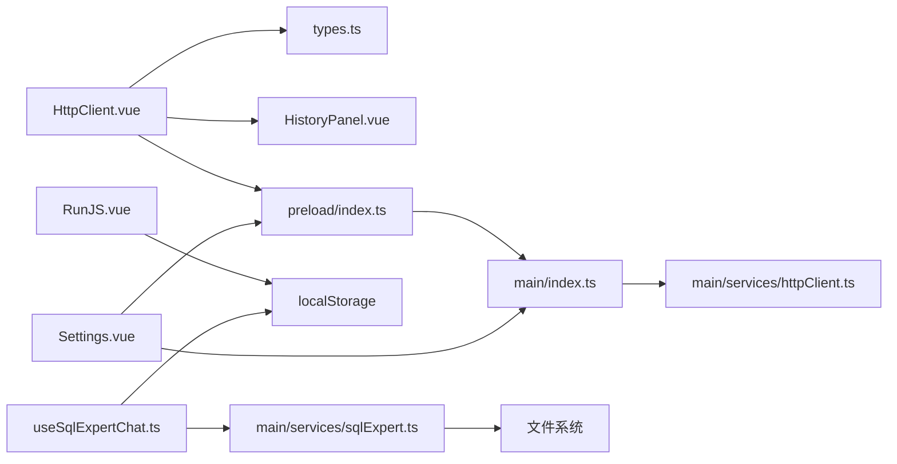

# 存储与持久化

<cite>
**本文引用的文件列表**
- [src/main/services/httpClient.ts](file://src/main/services/httpClient.ts)
- [src/renderer/src/views/httpclient/HttpClient.vue](file://src/renderer/src/views/httpclient/HttpClient.vue)
- [src/renderer/src/views/httpclient/types.ts](file://src/renderer/src/views/httpclient/types.ts)
- [src/renderer/src/views/httpclient/components/HistoryPanel.vue](file://src/renderer/src/views/httpclient/components/HistoryPanel.vue)
- [src/renderer/src/views/settings/Settings.vue](file://src/renderer/src/views/settings/Settings.vue)
- [src/main/index.ts](file://src/main/index.ts)
- [src/preload/index.ts](file://src/preload/index.ts)
- [src/renderer/src/views/runjs/RunJS.vue](file://src/renderer/src/views/runjs/RunJS.vue)
- [src/renderer/src/views/sqlexpert/useSqlExpertChat.ts](file://src/renderer/src/views/sqlexpert/useSqlExpertChat.ts)
- [src/main/services/sqlExpert.ts](file://src/main/services/sqlExpert.ts)
</cite>

## 目录
1. [简介](#简介)
2. [项目结构与存储位置概览](#项目结构与存储位置概览)
3. [核心组件与存储机制](#核心组件与存储机制)
4. [架构总览](#架构总览)
5. [详细组件分析](#详细组件分析)
6. [依赖关系分析](#依赖关系分析)
7. [性能与容量管理](#性能与容量管理)
8. [故障排查指南](#故障排查指南)
9. [结论](#结论)

## 简介
本指南聚焦于开发者工具箱的“存储与持久化”能力，涵盖以下方面：
- localStorage 使用现状与边界：代理设置、用户偏好、HTTP 客户端历史记录、代码运行器文件集、SQL 专家会话等。
- HTTP 客户端历史记录的保存策略、容量限制与清理方法。
- 应用数据的备份与恢复思路（基于现有持久化实现）。
- 存储空间管理与性能优化建议。

## 项目结构与存储位置概览
- 主进程负责网络代理、自动更新、系统托盘等全局能力，并通过 IPC 暴露给渲染进程。
- 渲染进程使用 localStorage 存储用户偏好与轻量数据；部分功能采用文件系统进行持久化（如 SQL 专家配置与记忆文件）。
- HTTP 客户端在渲染侧使用 localStorage 缓存请求历史；主进程负责实际网络请求与代理设置。

图示来源
- [src/renderer/src/views/httpclient/HttpClient.vue:33-51](file://src/renderer/src/views/httpclient/HttpClient.vue#L33-L51)
- [src/renderer/src/views/settings/Settings.vue:9-21](file://src/renderer/src/views/settings/Settings.vue#L9-L21)
- [src/preload/index.ts:107-115](file://src/preload/index.ts#L107-L115)
- [src/main/index.ts:306-327](file://src/main/index.ts#L306-L327)
- [src/main/services/httpClient.ts:15-112](file://src/main/services/httpClient.ts#L15-L112)
- [src/main/services/sqlExpert.ts:139-156](file://src/main/services/sqlExpert.ts#L139-L156)

章节来源
- [src/renderer/src/views/httpclient/HttpClient.vue:1-275](file://src/renderer/src/views/httpclient/HttpClient.vue#L1-L275)
- [src/renderer/src/views/settings/Settings.vue:1-315](file://src/renderer/src/views/settings/Settings.vue#L1-L315)
- [src/preload/index.ts:1-229](file://src/preload/index.ts#L1-L229)
- [src/main/index.ts:1-444](file://src/main/index.ts#L1-L444)
- [src/main/services/httpClient.ts:1-113](file://src/main/services/httpClient.ts#L1-L113)
- [src/main/services/sqlExpert.ts:1-1200](file://src/main/services/sqlExpert.ts#L1-L1200)

## 核心组件与存储机制
- 代理设置与用户偏好
  - 代理设置通过设置页写入 localStorage 并调用主进程设置系统代理；主进程同时设置 Electron session 代理与环境变量，确保自动更新也能走代理。
  - 用户偏好（如开机自启动）通过主进程 IPC 控制，偏好值本身可能由渲染侧 localStorage 记忆，但实际生效由主进程执行。
- HTTP 客户端历史记录
  - 历史记录保存在 localStorage 中，包含请求/响应元数据与时间戳；每次发送请求后追加到顶部并限制最大数量。
- 代码运行器文件集
  - 文件列表与当前激活文件 ID 持久化到 localStorage；支持旧版单文件数据迁移。
- SQL 专家会话与配置
  - 会话数据（含消息与工具调用结果）在渲染侧持久化到 localStorage，但对大对象进行裁剪；配置与模式（schema）在主进程文件系统中持久化。

章节来源
- [src/renderer/src/views/settings/Settings.vue:9-57](file://src/renderer/src/views/settings/Settings.vue#L9-L57)
- [src/main/index.ts:306-353](file://src/main/index.ts#L306-L353)
- [src/renderer/src/views/httpclient/HttpClient.vue:8-51](file://src/renderer/src/views/httpclient/HttpClient.vue#L8-L51)
- [src/renderer/src/views/runjs/RunJS.vue:31-90](file://src/renderer/src/views/runjs/RunJS.vue#L31-L90)
- [src/renderer/src/views/sqlexpert/useSqlExpertChat.ts:104-135](file://src/renderer/src/views/sqlexpert/useSqlExpertChat.ts#L104-L135)
- [src/main/services/sqlExpert.ts:139-156](file://src/main/services/sqlExpert.ts#L139-L156)

## 架构总览
渲染进程通过 preload 暴露的 API 与主进程通信，同时使用 localStorage 存储用户偏好与轻量数据；主进程负责网络代理、自动更新、文件系统持久化等。

图示来源
- [src/preload/index.ts:30-38](file://src/preload/index.ts#L30-L38)
- [src/main/index.ts:306-327](file://src/main/index.ts#L306-L327)
- [src/renderer/src/views/settings/Settings.vue:23-44](file://src/renderer/src/views/settings/Settings.vue#L23-L44)
- [src/renderer/src/views/httpclient/HttpClient.vue:34-51](file://src/renderer/src/views/httpclient/HttpClient.vue#L34-L51)

## 详细组件分析

### HTTP 客户端历史记录存储
- 存储键与容量
  - 键名：固定常量键用于历史记录存储。
  - 容量上限：固定最大条目数，超出时仅保留最近的若干条。
- 保存策略
  - 每次发送请求成功后，将当前请求/响应封装为历史项并插入队列头部；若超过上限则截断。
  - 每次变更（新增/删除/清空）均同步写回 localStorage。
- 读取与展示
  - 组件挂载时从 localStorage 读取历史；展示组件按方法、状态码、耗时与时间排序呈现。
- 清理方法
  - 支持逐条删除与一键清空；删除后立即持久化。

图示来源
- [src/renderer/src/views/httpclient/HttpClient.vue:121-167](file://src/renderer/src/views/httpclient/HttpClient.vue#L121-L167)
- [src/renderer/src/views/httpclient/HttpClient.vue:45-51](file://src/renderer/src/views/httpclient/HttpClient.vue#L45-L51)
- [src/renderer/src/views/httpclient/HttpClient.vue:170-183](file://src/renderer/src/views/httpclient/HttpClient.vue#L170-L183)
- [src/renderer/src/views/httpclient/types.ts:32-37](file://src/renderer/src/views/httpclient/types.ts#L32-L37)

章节来源
- [src/renderer/src/views/httpclient/HttpClient.vue:8-51](file://src/renderer/src/views/httpclient/HttpClient.vue#L8-L51)
- [src/renderer/src/views/httpclient/HttpClient.vue:121-183](file://src/renderer/src/views/httpclient/HttpClient.vue#L121-L183)
- [src/renderer/src/views/httpclient/components/HistoryPanel.vue:1-116](file://src/renderer/src/views/httpclient/components/HistoryPanel.vue#L1-L116)
- [src/renderer/src/views/httpclient/types.ts:1-38](file://src/renderer/src/views/httpclient/types.ts#L1-L38)

### 代理设置与用户偏好
- 代理设置
  - 渲染侧保存代理 URL 到 localStorage，并调用主进程设置系统代理；主进程同时设置 Electron session 代理与环境变量，保证自动更新也能走代理。
- 用户偏好
  - 开机自启动状态通过主进程 IPC 获取/设置；渲染侧可显示当前状态并触发切换。

图示来源
- [src/renderer/src/views/settings/Settings.vue:9-57](file://src/renderer/src/views/settings/Settings.vue#L9-L57)
- [src/main/index.ts:306-353](file://src/main/index.ts#L306-L353)
- [src/preload/index.ts:30-38](file://src/preload/index.ts#L30-L38)

章节来源
- [src/renderer/src/views/settings/Settings.vue:1-315](file://src/renderer/src/views/settings/Settings.vue#L1-L315)
- [src/main/index.ts:306-353](file://src/main/index.ts#L306-L353)
- [src/preload/index.ts:24-47](file://src/preload/index.ts#L24-L47)

### 代码运行器文件集持久化
- 数据结构
  - 文件列表与当前激活文件 ID 分别持久化。
- 迁移策略
  - 若未检测到新格式数据，则尝试从旧格式（单文件代码与语言）迁移生成初始文件集。
- 持久化时机
  - 文件列表或激活文件变化时深度监听并写入 localStorage。

章节来源
- [src/renderer/src/views/runjs/RunJS.vue:31-90](file://src/renderer/src/views/runjs/RunJS.vue#L31-L90)

### SQL 专家会话与配置持久化
- 会话持久化
  - 会话列表在渲染侧持久化到 localStorage，写入前对大字段（如工具调用结果中的 rows）进行裁剪，避免 localStorage 膨胀。
- 配置与模式持久化
  - 数据库连接配置与模式（schema）在主进程文件系统中持久化，确保敏感信息与大体量数据不进入 localStorage。

章节来源
- [src/renderer/src/views/sqlexpert/useSqlExpertChat.ts:104-135](file://src/renderer/src/views/sqlexpert/useSqlExpertChat.ts#L104-L135)
- [src/main/services/sqlExpert.ts:139-156](file://src/main/services/sqlExpert.ts#L139-L156)

## 依赖关系分析
- 渲染进程依赖
  - 通过 preload 暴露的 window.api 与主进程通信。
  - localStorage 作为轻量数据存储。
- 主进程依赖
  - Electron session 代理配置、自动更新、文件系统读写。
- 组件间耦合
  - HTTP 客户端历史与设置页、预加载层、主进程 HTTP 服务之间形成清晰的 IPC 边界。

图示来源
- [src/renderer/src/views/httpclient/HttpClient.vue:1-10](file://src/renderer/src/views/httpclient/HttpClient.vue#L1-L10)
- [src/renderer/src/views/httpclient/types.ts:1-38](file://src/renderer/src/views/httpclient/types.ts#L1-L38)
- [src/renderer/src/views/httpclient/components/HistoryPanel.vue:1-14](file://src/renderer/src/views/httpclient/components/HistoryPanel.vue#L1-L14)
- [src/preload/index.ts:107-115](file://src/preload/index.ts#L107-L115)
- [src/main/index.ts:306-327](file://src/main/index.ts#L306-L327)
- [src/main/services/httpClient.ts:15-112](file://src/main/services/httpClient.ts#L15-L112)
- [src/renderer/src/views/settings/Settings.vue:1-57](file://src/renderer/src/views/settings/Settings.vue#L1-L57)
- [src/renderer/src/views/runjs/RunJS.vue:31-90](file://src/renderer/src/views/runjs/RunJS.vue#L31-L90)
- [src/renderer/src/views/sqlexpert/useSqlExpertChat.ts:104-135](file://src/renderer/src/views/sqlexpert/useSqlExpertChat.ts#L104-L135)
- [src/main/services/sqlExpert.ts:139-156](file://src/main/services/sqlExpert.ts#L139-L156)

## 性能与容量管理
- localStorage 限制与建议
  - 浏览器实现通常限制单站点约 5–10MB，建议：
    - 对大体量数据（如 SQL 专家工具调用结果）在渲染侧持久化前进行裁剪或分片。
    - 将敏感或大体积数据迁移到主进程文件系统（如 SQL 专家配置与模式）。
- HTTP 历史记录容量
  - 固定上限策略简单可靠；建议：
    - 提供用户可配置上限的入口（当前实现为硬编码上限）。
    - 对历史项进行更细粒度的裁剪（如只保留必要字段）。
- 写入频率控制
  - 历史与会话写入频繁，建议：
    - 合并写入批次，避免高频 JSON 序列化。
    - 对大对象使用浅拷贝或延迟序列化。
- 代理与网络稳定性
  - 代理设置失败时应有降级策略（如直连），并在 UI 层提示用户配置代理。

[本节为通用性能建议，无需特定文件引用]

## 故障排查指南
- 代理设置无效
  - 检查主进程代理设置返回值与环境变量是否正确设置。
  - 确认自动更新错误日志中是否包含网络超时/连接被拒等关键词。
- HTTP 历史记录异常
  - 检查 localStorage 中历史键是否存在且可解析。
  - 若历史为空，确认组件挂载时的读取逻辑是否执行。
- 代码运行器文件丢失
  - 检查旧版键是否存在并触发迁移逻辑。
  - 确认深度监听是否正常写入 localStorage。
- SQL 专家会话异常
  - 检查 localStorage 中会话键是否存在且格式正确。
  - 确认写入前的大对象裁剪逻辑是否生效。

章节来源
- [src/main/index.ts:140-157](file://src/main/index.ts#L140-L157)
- [src/renderer/src/views/httpclient/HttpClient.vue:33-51](file://src/renderer/src/views/httpclient/HttpClient.vue#L33-L51)
- [src/renderer/src/views/runjs/RunJS.vue:31-90](file://src/renderer/src/views/runjs/RunJS.vue#L31-L90)
- [src/renderer/src/views/sqlexpert/useSqlExpertChat.ts:104-135](file://src/renderer/src/views/sqlexpert/useSqlExpertChat.ts#L104-L135)

## 结论
- 本项目在渲染侧广泛使用 localStorage 存储用户偏好、代理设置与轻量数据（如 HTTP 历史、代码运行器文件集、SQL 专家会话），并通过 preload 暴露的 API 与主进程通信。
- 主进程负责系统代理、自动更新与文件系统持久化（如 SQL 专家配置与模式），确保敏感与大体量数据的安全与稳定。
- 建议在现有基础上增加：
  - HTTP 历史上限的用户可配置入口；
  - 对大体量数据的裁剪与分片策略；
  - 更完善的备份与恢复流程（如导出/导入 localStorage 或文件系统配置）。