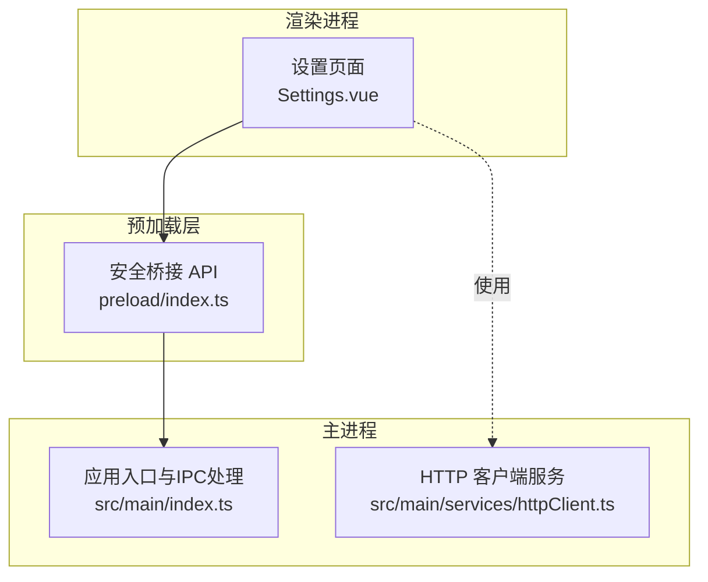
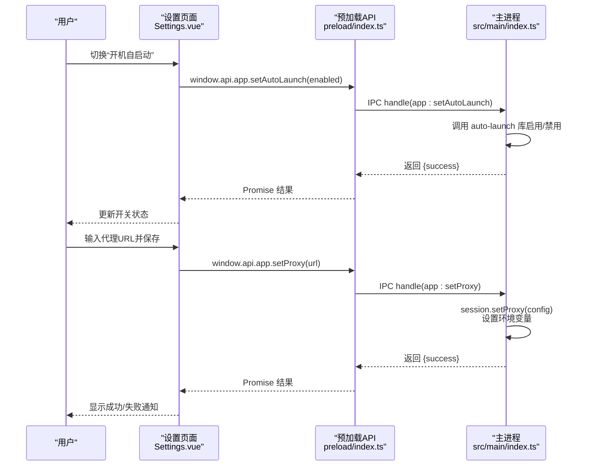
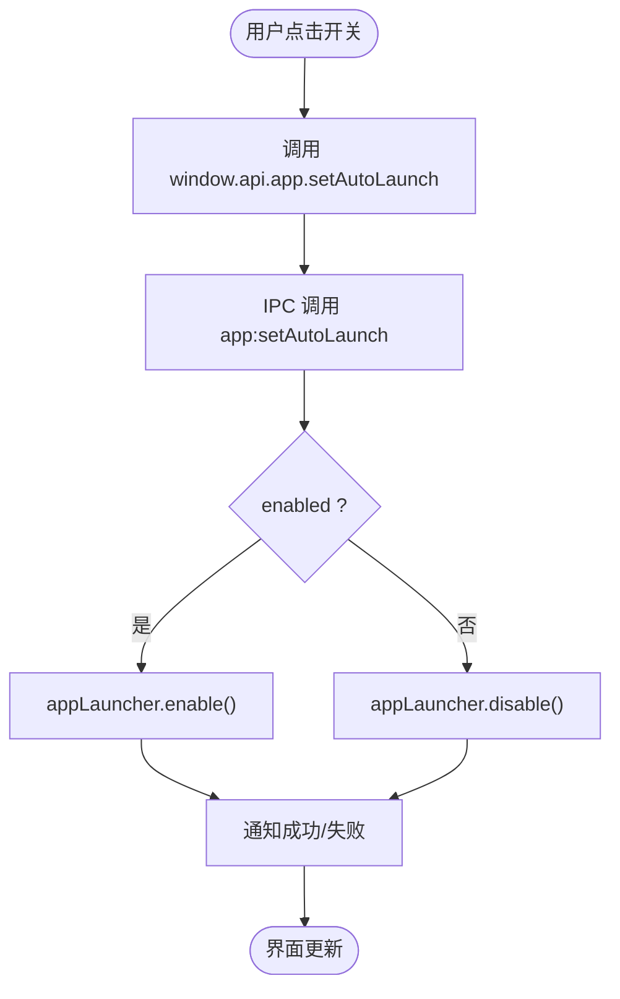
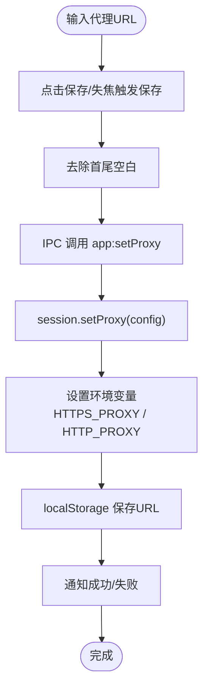
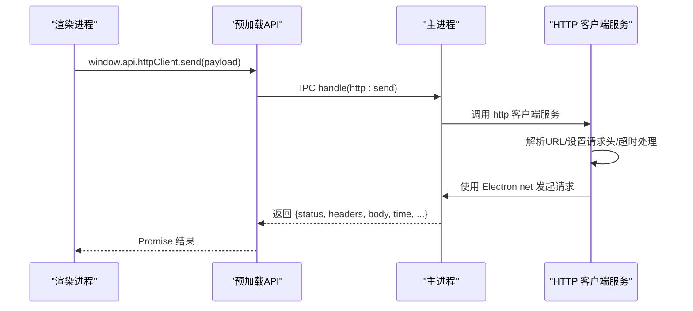
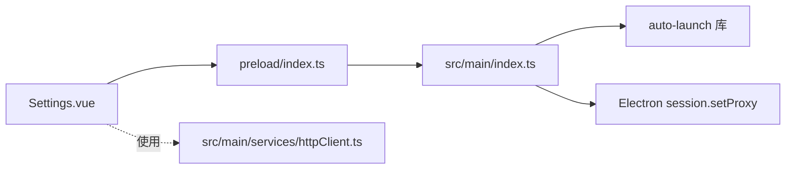

# 应用设置

<cite>
**本文引用的文件**
- [Settings.vue](file://src/renderer/src/views/settings/Settings.vue)
- [index.ts](file://src/main/index.ts)
- [index.ts](file://src/preload/index.ts)
- [httpClient.ts](file://src/main/services/httpClient.ts)
- [types.ts](file://src/renderer/src/views/httpclient/types.ts)
- [package.json](file://package.json)
- [README.md](file://README.md)
</cite>

## 目录
1. [简介](#简介)
2. [项目结构](#项目结构)
3. [核心组件](#核心组件)
4. [架构总览](#架构总览)
5. [详细组件分析](#详细组件分析)
6. [依赖关系分析](#依赖关系分析)
7. [性能考量](#性能考量)
8. [故障排除指南](#故障排除指南)
9. [结论](#结论)
10. [附录](#附录)

## 简介
本指南聚焦于开发者工具箱应用的“设置”模块，围绕以下目标展开：
- 如何启用/禁用开机自启动，并解释不同操作系统下的行为差异
- 如何配置HTTP代理，包括代理URL格式、支持的协议类型、认证方式与最佳实践
- 设置界面操作步骤与常见问题解决方案
- 代理设置在应用内的工作流程与错误处理策略

## 项目结构
设置模块位于渲染进程，通过安全桥接暴露的API与主进程交互，主进程负责实际的系统级配置（如开机自启动）与网络代理设置。

图示来源
- [Settings.vue:1-116](file://src/renderer/src/views/settings/Settings.vue#L1-L116)
- [index.ts:1-444](file://src/main/index.ts#L1-L444)
- [index.ts:1-229](file://src/preload/index.ts#L1-L229)
- [httpClient.ts:1-53](file://src/main/services/httpClient.ts#L1-L53)

章节来源
- [Settings.vue:1-116](file://src/renderer/src/views/settings/Settings.vue#L1-L116)
- [index.ts:1-444](file://src/main/index.ts#L1-L444)
- [index.ts:1-229](file://src/preload/index.ts#L1-L229)
- [httpClient.ts:1-53](file://src/main/services/httpClient.ts#L1-L53)

## 核心组件
- 设置页面（Settings.vue）
  - 提供“开机自启动”开关与“HTTP 代理”输入框
  - 通过 window.api.app 调用主进程接口
  - 本地持久化代理URL至 localStorage
- 预加载层（preload/index.ts）
  - 暴露 window.api.app 给渲染进程
  - 将 IPC 调用封装为易用的 Promise 接口
- 主进程（src/main/index.ts）
  - 实现开机自启动开关（auto-launch 库）
  - 实现代理设置（Electron session.setProxy 与环境变量）
  - 处理应用更新检查中的网络异常提示
- HTTP 客户端服务（src/main/services/httpClient.ts）
  - 在主进程发起请求，绕过前端CORS限制
  - 自动使用应用代理设置

章节来源
- [Settings.vue:1-116](file://src/renderer/src/views/settings/Settings.vue#L1-L116)
- [index.ts:1-229](file://src/preload/index.ts#L1-L229)
- [index.ts:306-353](file://src/main/index.ts#L306-L353)
- [httpClient.ts:1-53](file://src/main/services/httpClient.ts#L1-L53)

## 架构总览
设置模块的配置流程由渲染进程发起，经预加载层转发到主进程，主进程完成系统级配置并返回结果；HTTP 请求在主进程使用 Electron 的 net 模块发起，自动应用代理设置。

图示来源
- [Settings.vue:46-57](file://src/renderer/src/views/settings/Settings.vue#L46-L57)
- [index.ts:306-353](file://src/main/index.ts#L306-L353)
- [index.ts:306-327](file://src/main/index.ts#L306-L327)
- [index.ts:1-229](file://src/preload/index.ts#L1-L229)

## 详细组件分析

### 开机自启动配置
- 启用/禁用流程
  - 渲染进程点击开关后调用 window.api.app.setAutoLaunch(enabled)
  - 预加载层转发 IPC 调用
  - 主进程使用 auto-launch 库执行 enable/disable
  - 成功后通过通知组件反馈结果
- 行为差异（跨平台）
  - Windows/macOS/Linux 的注册机制不同，具体实现由 auto-launch 库处理
  - 若启用失败，主进程会记录错误并提示用户
- 数据持久化
  - 设置页面在挂载时会从 localStorage 读取上次保存的代理URL并立即应用
  - 开机自启动状态由主进程维护，设置页面仅展示当前值

图示来源
- [Settings.vue:46-57](file://src/renderer/src/views/settings/Settings.vue#L46-L57)
- [index.ts:339-353](file://src/main/index.ts#L339-L353)

章节来源
- [Settings.vue:46-57](file://src/renderer/src/views/settings/Settings.vue#L46-L57)
- [index.ts:339-353](file://src/main/index.ts#L339-L353)
- [package.json:33](file://package.json#L33)

### HTTP 代理配置
- 设置入口
  - 在设置页输入代理URL（如 http://127.0.0.1:7890），点击保存或离开输入框触发保存
  - 保存时会同时更新 Electron session 代理与环境变量，使 autoUpdater 等也能走代理
- URL格式与协议
  - 支持 HTTP 与 HTTPS 代理
  - URL 必须包含协议与主机端口，建议使用 http:// 或 https:// 前缀
- 认证方式
  - 当前实现未显式处理代理认证字段；若代理需要用户名/密码，建议在代理软件侧配置或使用支持认证的代理方案
- 持久化与回显
  - 保存成功后会写入 localStorage，下次打开设置页会自动读取并应用
- 故障提示
  - 主进程在检查更新时若遇到网络超时/连接被拒/域名解析失败，会提示用户先在设置中配置代理

图示来源
- [Settings.vue:23-44](file://src/renderer/src/views/settings/Settings.vue#L23-L44)
- [index.ts:306-327](file://src/main/index.ts#L306-L327)

章节来源
- [Settings.vue:23-44](file://src/renderer/src/views/settings/Settings.vue#L23-L44)
- [index.ts:306-327](file://src/main/index.ts#L306-L327)
- [README.md:118-121](file://README.md#L118-L121)

### HTTP 客户端与代理联动
- 请求发起
  - 渲染进程通过 window.api.httpClient.send 发起请求
  - 预加载层封装 IPC 调用
  - 主进程在 http 客户端服务中使用 Electron net 发起请求
- 代理生效
  - 由于主进程使用 Electron session，且代理已在主进程设置，因此所有主进程发起的请求都会自动使用代理
- 错误处理
  - 主进程对请求超时进行特殊处理并返回统一结构
  - 对于网络异常，主进程会根据错误信息提示用户检查代理

图示来源
- [index.ts:1-229](file://src/preload/index.ts#L1-L229)
- [httpClient.ts:15-53](file://src/main/services/httpClient.ts#L15-L53)

章节来源
- [index.ts:1-229](file://src/preload/index.ts#L1-L229)
- [httpClient.ts:15-53](file://src/main/services/httpClient.ts#L15-L53)

## 依赖关系分析
- 设置页面依赖预加载API提供的 window.api.app 接口
- 预加载API依赖 Electron 的 ipcRenderer 与 contextBridge
- 主进程依赖 auto-launch 实现开机自启动
- 主进程依赖 Electron session.setProxy 实现代理设置
- HTTP 客户端服务依赖 Electron net

图示来源
- [Settings.vue:1-116](file://src/renderer/src/views/settings/Settings.vue#L1-L116)
- [index.ts:1-229](file://src/preload/index.ts#L1-L229)
- [index.ts:1-444](file://src/main/index.ts#L1-L444)
- [httpClient.ts:1-53](file://src/main/services/httpClient.ts#L1-L53)
- [package.json:33](file://package.json#L33)

章节来源
- [package.json:33](file://package.json#L33)
- [index.ts:1-444](file://src/main/index.ts#L1-L444)

## 性能考量
- 代理设置为即时生效，无需重启应用
- 开机自启动切换为轻量操作，主要涉及系统注册表/启动项的增删
- HTTP 请求在主进程发起，避免了前端CORS限制带来的额外开销
- 代理URL变更后，主进程会同步更新 Electron session 与环境变量，确保后续网络请求均走代理

## 故障排除指南
- 无法设置代理
  - 检查代理URL格式是否正确（包含协议与端口）
  - 确认代理服务器可达，网络连通性正常
  - 若使用企业防火墙/安全策略，可能需要管理员权限或特定配置
- 更新检查失败
  - 主进程在检测/下载更新时若出现超时/连接被拒/域名解析失败，会提示用户先在设置中配置代理
  - 建议先在设置页保存代理，再重试更新
- 开机自启动无效
  - 不同操作系统注册机制不同，若启用失败，查看系统启动项或任务计划程序
  - 某些杀毒软件/系统策略可能阻止自启动，可在受信任列表中添加应用
- 代理认证问题
  - 当前实现未显式处理代理认证字段；若代理需要用户名/密码，请在代理软件侧配置或更换支持认证的代理方案

章节来源
- [index.ts:140-157](file://src/main/index.ts#L140-L157)
- [index.ts:252-269](file://src/main/index.ts#L252-L269)
- [index.ts:348-352](file://src/main/index.ts#L348-L352)

## 结论
设置模块提供了简洁直观的界面来管理开机自启动与HTTP代理。通过预加载层的安全桥接，渲染进程可以可靠地调用主进程能力；主进程利用 Electron 的 session 与 auto-launch 库分别实现网络代理与系统自启动。对于企业网络环境，建议在代理软件侧配置认证与访问策略，并在设置页保存代理URL以确保应用内外的网络请求均能正确路由。

## 附录

### 设置界面操作指南
- 开机自启动
  - 打开设置页，找到“通用”区域的“开机自启动”开关
  - 点击开关即可启用/禁用
  - 切换后会收到成功/失败的通知
- HTTP 代理
  - 打开设置页，找到“网络”区域的“HTTP 代理”输入框
  - 输入代理URL（如 http://127.0.0.1:7890），点击“保存”或离开输入框
  - 保存成功后，应用会自动应用代理设置
  - 如需清空代理，点击“清除”

章节来源
- [Settings.vue:68-113](file://src/renderer/src/views/settings/Settings.vue#L68-L113)

### 企业网络环境最佳实践
- 选择稳定可靠的代理服务器，避免频繁断连
- 在代理软件侧配置必要的认证与白名单规则
- 对于需要HTTPS代理的场景，确保代理支持CONNECT隧道
- 在应用内保存代理URL后，定期验证连通性
- 若使用公司防火墙，提前与IT部门确认允许范围与策略

章节来源
- [README.md:118-121](file://README.md#L118-L121)