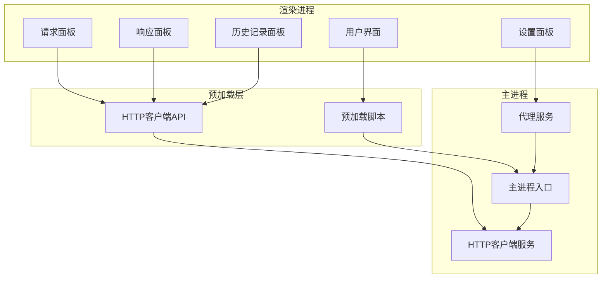
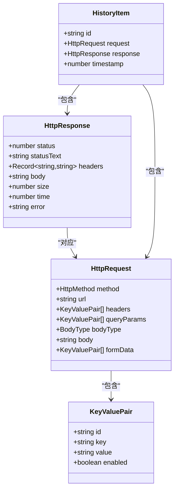
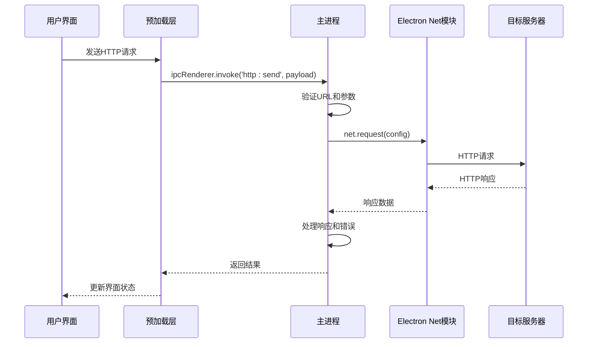
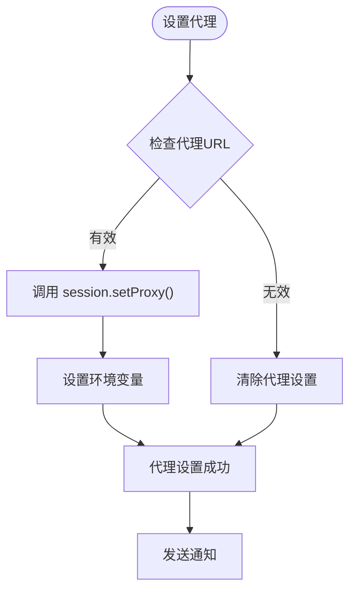
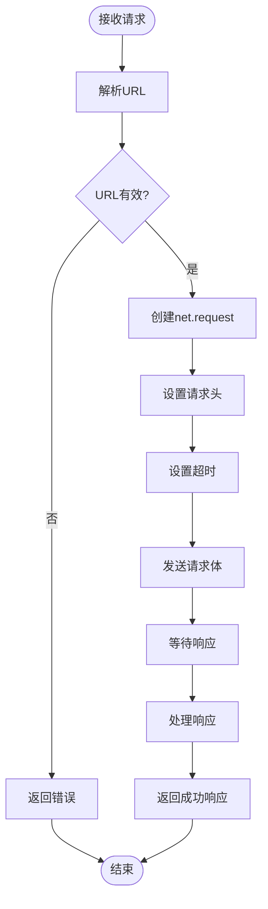
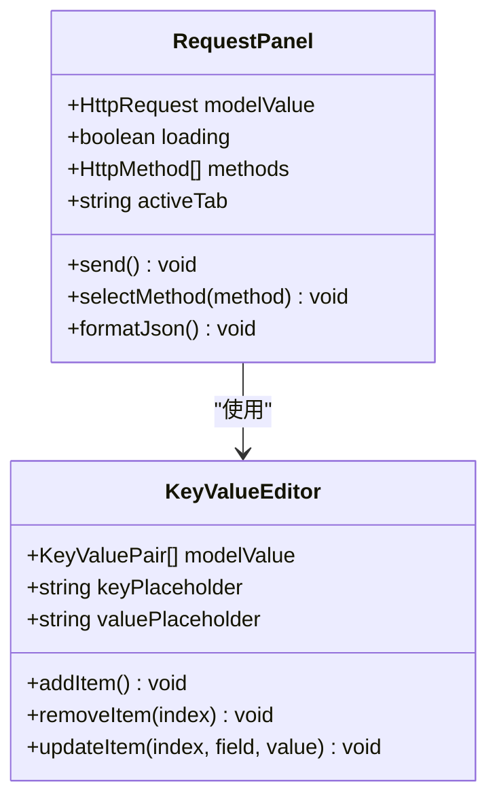
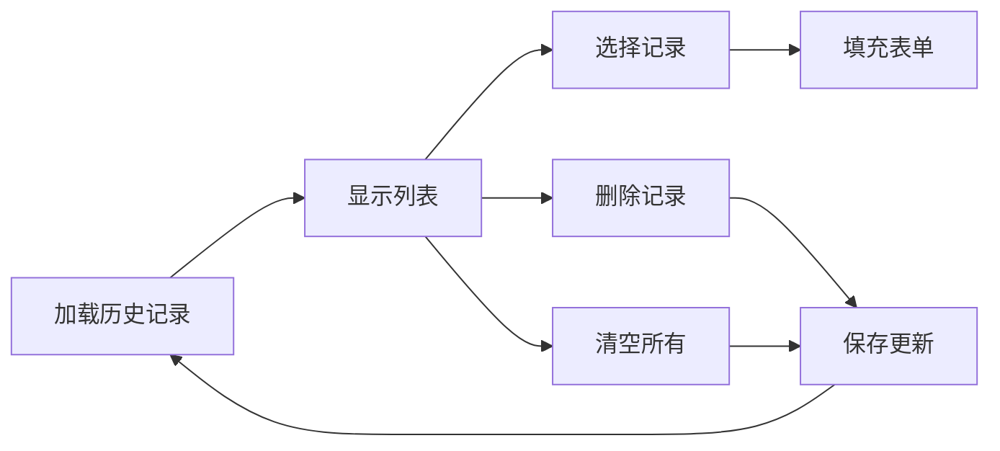
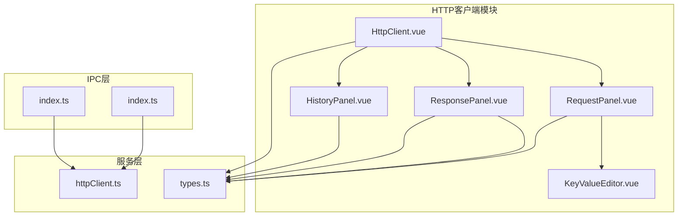

# HTTP客户端服务配置

<cite>
**本文档引用的文件**
- [httpClient.ts](file://src/main/services/httpClient.ts)
- [types.ts](file://src/renderer/src/views/httpclient/types.ts)
- [HttpClient.vue](file://src/renderer/src/views/httpclient/HttpClient.vue)
- [RequestPanel.vue](file://src/renderer/src/views/httpclient/components/RequestPanel.vue)
- [ResponsePanel.vue](file://src/renderer/src/views/httpclient/components/ResponsePanel.vue)
- [HistoryPanel.vue](file://src/renderer/src/views/httpclient/components/HistoryPanel.vue)
- [KeyValueEditor.vue](file://src/renderer/src/views/httpclient/components/KeyValueEditor.vue)
- [index.ts](file://src/preload/index.ts)
- [index.ts](file://src/main/index.ts)
- [Settings.vue](file://src/renderer/src/views/settings/Settings.vue)
</cite>

## 目录
1. [简介](#简介)
2. [项目结构](#项目结构)
3. [核心组件](#核心组件)
4. [架构概览](#架构概览)
5. [详细组件分析](#详细组件分析)
6. [依赖关系分析](#依赖关系分析)
7. [性能考虑](#性能考虑)
8. [故障排除指南](#故障排除指南)
9. [结论](#结论)

## 简介

HTTP客户端服务配置文档详细介绍了开发者工具箱中HTTP客户端的功能特性、配置选项和使用方法。该系统基于Electron框架构建，提供了完整的HTTP请求功能，包括请求配置、响应处理、历史记录管理和代理设置等核心功能。

本系统的主要特点：
- 支持多种HTTP方法（GET、POST、PUT、DELETE、PATCH、HEAD、OPTIONS）
- 提供完整的请求头管理功能
- 支持多种请求体格式（JSON、表单、文本）
- 内置超时机制和错误处理
- 集成代理配置和历史记录管理
- 提供响应格式化和复制功能

## 项目结构

HTTP客户端服务采用分层架构设计，主要包含以下层次：

**图表来源**
- [HttpClient.vue:1-275](file://src/renderer/src/views/httpclient/HttpClient.vue#L1-L275)
- [index.ts:106-115](file://src/preload/index.ts#L106-L115)
- [index.ts:306-327](file://src/main/index.ts#L306-L327)

**章节来源**
- [HttpClient.vue:1-275](file://src/renderer/src/views/httpclient/HttpClient.vue#L1-L275)
- [index.ts:106-115](file://src/preload/index.ts#L106-L115)
- [index.ts:306-327](file://src/main/index.ts#L306-L327)

## 核心组件

### HTTP客户端服务架构

HTTP客户端服务由三个主要组件构成：

1. **主进程HTTP服务** - 处理实际的HTTP请求
2. **渲染进程UI组件** - 提供用户交互界面
3. **IPC通信层** - 实现进程间通信

### 数据模型

系统使用统一的数据模型来表示HTTP请求和响应：

**图表来源**
- [types.ts:12-37](file://src/renderer/src/views/httpclient/types.ts#L12-L37)

**章节来源**
- [types.ts:12-37](file://src/renderer/src/views/httpclient/types.ts#L12-L37)

## 架构概览

HTTP客户端服务采用IPC（进程间通信）模式实现跨进程协作：

**图表来源**
- [httpClient.ts:15-112](file://src/main/services/httpClient.ts#L15-L112)
- [index.ts:106-115](file://src/preload/index.ts#L106-L115)

### 代理配置流程

系统支持全局代理配置，通过Electron的session.setProxy方法实现：

**图表来源**
- [index.ts:306-327](file://src/main/index.ts#L306-L327)

**章节来源**
- [httpClient.ts:15-112](file://src/main/services/httpClient.ts#L15-L112)
- [index.ts:306-327](file://src/main/index.ts#L306-L327)

## 详细组件分析

### 主进程HTTP客户端服务

主进程中的HTTP客户端服务负责实际的网络请求处理：

#### 请求处理流程

**图表来源**
- [httpClient.ts:16-98](file://src/main/services/httpClient.ts#L16-L98)

#### 超时机制实现

系统实现了完善的超时处理机制：

- 默认超时时间：30秒
- 使用setTimeout定时器监控请求
- 超时后自动终止请求
- 返回标准化的超时错误对象

**章节来源**
- [httpClient.ts:16-98](file://src/main/services/httpClient.ts#L16-L98)

### 渲染进程UI组件

#### 请求面板组件

请求面板提供了完整的HTTP请求配置界面：

**图表来源**
- [RequestPanel.vue:1-227](file://src/renderer/src/views/httpclient/components/RequestPanel.vue#L1-L227)
- [KeyValueEditor.vue:1-106](file://src/renderer/src/views/httpclient/components/KeyValueEditor.vue#L1-L106)

#### 响应面板组件

响应面板负责展示HTTP响应结果：

- 自动格式化JSON响应
- 显示响应状态码和耗时
- 提供响应头和响应体查看
- 支持复制响应内容

**章节来源**
- [RequestPanel.vue:1-227](file://src/renderer/src/views/httpclient/components/RequestPanel.vue#L1-L227)
- [ResponsePanel.vue:1-180](file://src/renderer/src/views/httpclient/components/ResponsePanel.vue#L1-L180)

### 历史记录管理系统

系统内置了完整的历史记录管理功能：

#### 历史记录存储

- 本地存储：使用localStorage持久化
- 存储上限：最多保存100条历史记录
- 自动清理：超出限制时自动删除最旧记录
- 结构化存储：包含请求和响应的完整信息

#### 历史记录操作

**图表来源**
- [HttpClient.vue:33-51](file://src/renderer/src/views/httpclient/HttpClient.vue#L33-L51)
- [HistoryPanel.vue:78-113](file://src/renderer/src/views/httpclient/components/HistoryPanel.vue#L78-L113)

**章节来源**
- [HttpClient.vue:33-51](file://src/renderer/src/views/httpclient/HttpClient.vue#L33-L51)
- [HistoryPanel.vue:78-113](file://src/renderer/src/views/httpclient/components/HistoryPanel.vue#L78-L113)

## 依赖关系分析

### 组件依赖图

**图表来源**
- [HttpClient.vue:1-275](file://src/renderer/src/views/httpclient/HttpClient.vue#L1-L275)
- [httpClient.ts:1-113](file://src/main/services/httpClient.ts#L1-L113)
- [index.ts:106-115](file://src/preload/index.ts#L106-L115)

### 外部依赖

系统使用的主要外部依赖：

- **Electron**: 提供桌面应用框架和IPC通信
- **Vue 3**: 构建用户界面
- **@electron-toolkit**: Electron开发工具包
- **TailwindCSS**: 样式框架

**章节来源**
- [HttpClient.vue:1-275](file://src/renderer/src/views/httpclient/HttpClient.vue#L1-L275)
- [httpClient.ts:1-113](file://src/main/services/httpClient.ts#L1-L113)

## 性能考虑

### 并发连接数限制

当前实现中，每个请求都是独立的，没有显式的并发连接数限制。Electron的net模块会根据系统资源动态管理连接。

### 内存管理

- 响应数据以Buffer形式处理，避免内存泄漏
- 超时机制确保长时间请求不会占用资源
- 历史记录自动清理机制防止内存溢出

### 缓存策略

系统目前不提供HTTP缓存功能，所有请求都会直接访问目标服务器。

## 故障排除指南

### 常见问题及解决方案

#### 代理设置问题

**问题描述**: 设置代理后请求仍然不生效

**可能原因**:
- 代理URL格式不正确
- 代理服务器不可达
- 环境变量未正确设置

**解决步骤**:
1. 检查代理URL格式：`http://127.0.0.1:7890`
2. 验证代理服务器连通性
3. 重新启动应用使代理设置生效

#### 超时问题

**问题描述**: 请求经常超时

**可能原因**:
- 网络连接不稳定
- 目标服务器响应慢
- 代理服务器延迟高

**解决步骤**:
1. 检查网络连接状态
2. 尝试直接连接目标服务器
3. 调整超时设置（如需）

#### SSL证书问题

**问题描述**: HTTPS请求出现证书错误

**可能原因**:
- 证书链不完整
- 自签名证书未受信任
- 证书过期

**解决步骤**:
1. 检查服务器证书有效性
2. 确保证书链完整
3. 如使用自签名证书，需要在系统中信任该证书

**章节来源**
- [index.ts:306-327](file://src/main/index.ts#L306-L327)
- [httpClient.ts:38-50](file://src/main/services/httpClient.ts#L38-L50)

## 结论

HTTP客户端服务配置提供了完整的HTTP请求功能，具有以下优势：

1. **功能完整**: 支持所有标准HTTP方法和请求体类型
2. **易于使用**: 直观的用户界面和丰富的配置选项
3. **可靠稳定**: 完善的错误处理和超时机制
4. **可扩展性强**: 基于Electron架构，便于功能扩展

建议的改进方向：
- 添加HTTP缓存支持
- 实现重试策略配置
- 增加并发连接数限制
- 提供更详细的SSL证书配置选项

该系统为开发者提供了强大的HTTP调试和测试能力，是开发和调试Web API的重要工具。