# OSS管理服务配置

<cite>
**本文档引用的文件**
- [ossManager.ts](file://src/main/services/ossManager.ts)
- [OssManager.vue](file://src/renderer/src/views/oss/OssManager.vue)
- [index.ts](file://src/preload/index.ts)
- [types.d.ts](file://src/renderer/src/types.d.ts)
- [package.json](file://package.json)
- [README.md](file://README.md)
- [main/index.ts](file://src/main/index.ts)
</cite>

## 目录
1. [简介](#简介)
2. [项目结构](#项目结构)
3. [核心组件](#核心组件)
4. [架构概览](#架构概览)
5. [详细组件分析](#详细组件分析)
6. [配置参数详解](#配置参数详解)
7. [权限管理配置](#权限管理配置)
8. [客户端配置选项](#客户端配置选项)
9. [性能优化参数](#性能优化参数)
10. [配置验证方法](#配置验证方法)
11. [故障排除指南](#故障排除指南)
12. [结论](#结论)

## 简介

开发者工具箱中的OSS管理服务是一个基于Electron + Vue 3 + TypeScript构建的阿里云OSS文件上传管理工具。该服务提供了完整的文件上传功能，包括单文件和文件夹上传、多文件进度跟踪、上传任务取消等特性。通过集成ali-oss SDK，用户可以轻松地将本地文件上传到阿里云OSS存储桶中。

## 项目结构

OSS管理服务采用模块化设计，主要由以下组件构成：

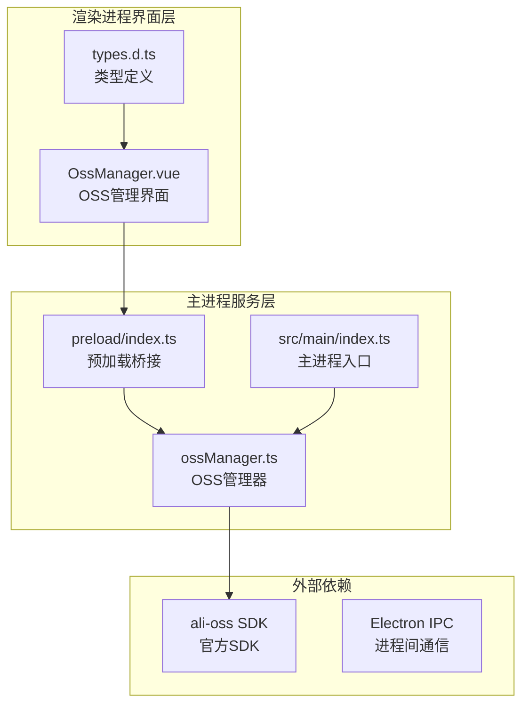
```mermaid
graph TB
subgraph "主进程服务层"
OSSMgr[ossManager.ts<br/>OSS管理器]
Preload[preload/index.ts<br/>预加载桥接]
MainIdx[src/main/index.ts<br/>主进程入口]
end
subgraph "渲染进程界面层"
OssView[OssManager.vue<br/>OSS管理界面]
Types[types.d.ts<br/>类型定义]
end
subgraph "外部依赖"
AliOSS[ali-oss SDK<br/>官方SDK]
Electron[Electron IPC<br/>进程间通信]
end
OssView --> Preload
Preload --> OSSMgr
OSSMgr --> AliOSS
MainIdx --> OSSMgr
Types --> OssView
```

**图表来源**
- [ossManager.ts:1-440](file://src/main/services/ossManager.ts#L1-L440)
- [index.ts:117-154](file://src/preload/index.ts#L117-L154)
- [main/index.ts:9-9](file://src/main/index.ts#L9-L9)

**章节来源**
- [ossManager.ts:1-440](file://src/main/services/ossManager.ts#L1-L440)
- [README.md:131-140](file://README.md#L131-L140)

## 核心组件

### OSS管理器类结构

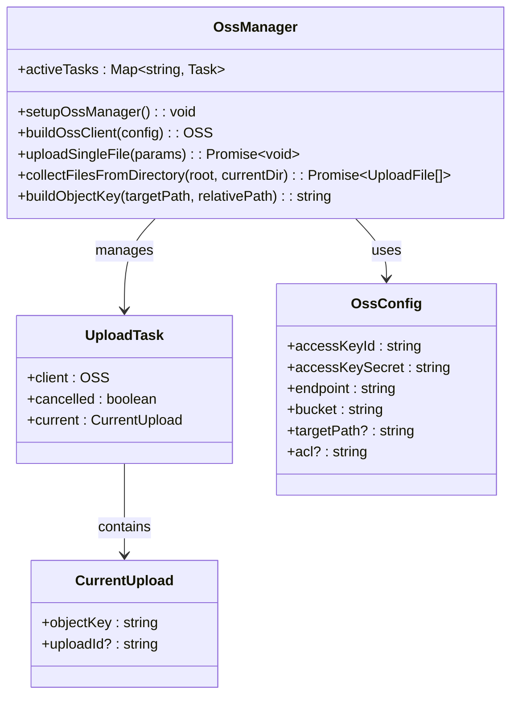
```mermaid
classDiagram
class OssManager {
+activeTasks : Map~string, Task~
+setupOssManager() : void
+buildOssClient(config) : OSS
+uploadSingleFile(params) : Promise~void~
+collectFilesFromDirectory(root, currentDir) : Promise~UploadFile[]~
+buildObjectKey(targetPath, relativePath) : string
}
class UploadTask {
+client : OSS
+cancelled : boolean
+current : CurrentUpload
}
class CurrentUpload {
+objectKey : string
+uploadId? : string
}
class OssConfig {
+accessKeyId : string
+accessKeySecret : string
+endpoint : string
+bucket : string
+targetPath? : string
+acl? : string
}
OssManager --> UploadTask : manages
UploadTask --> CurrentUpload : contains
OssManager --> OssConfig : uses
```

**图表来源**
- [ossManager.ts:64-74](file://src/main/services/ossManager.ts#L64-L74)
- [ossManager.ts:14-21](file://src/main/services/ossManager.ts#L14-L21)

### 数据流架构

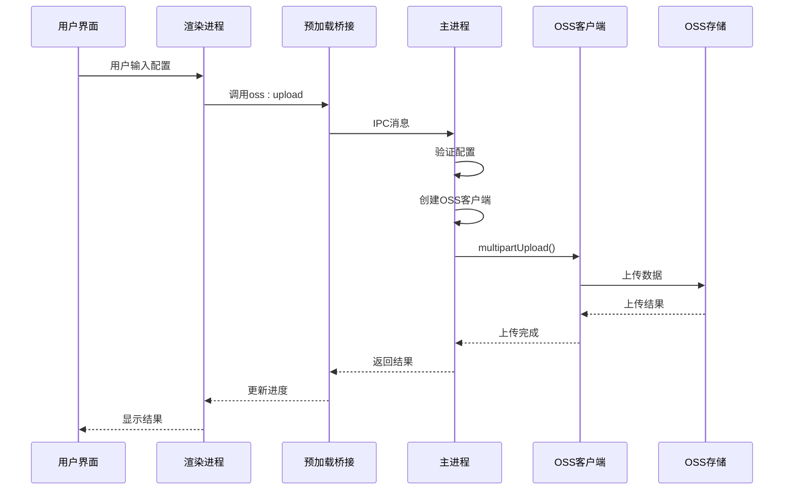
```mermaid
sequenceDiagram
participant UI as 用户界面
participant Renderer as 渲染进程
participant Preload as 预加载桥接
participant Main as 主进程
participant OSS as OSS客户端
participant Storage as OSS存储
UI->>Renderer : 用户输入配置
Renderer->>Preload : 调用oss : upload
Preload->>Main : IPC消息
Main->>Main : 验证配置
Main->>Main : 创建OSS客户端
Main->>OSS : multipartUpload()
OSS->>Storage : 上传数据
Storage-->>OSS : 上传结果
OSS-->>Main : 上传完成
Main-->>Preload : 返回结果
Preload-->>Renderer : 更新进度
Renderer-->>UI : 显示结果
```

**图表来源**
- [OssManager.vue:220-248](file://src/renderer/src/views/oss/OssManager.vue#L220-L248)
- [index.ts:122-132](file://src/preload/index.ts#L122-L132)
- [ossManager.ts:334-438](file://src/main/services/ossManager.ts#L334-L438)

**章节来源**
- [ossManager.ts:296-440](file://src/main/services/ossManager.ts#L296-L440)
- [OssManager.vue:1-913](file://src/renderer/src/views/oss/OssManager.vue#L1-L913)

## 架构概览

OSS管理服务采用Electron的双进程架构，实现了安全的跨进程通信：

```mermaid
graph LR
subgraph "渲染进程 (Renderer)"
UI[用户界面]
VueComp[Vue组件]
Bridge[预加载桥接]
end
subgraph "主进程 (Main)"
IPC[IPC处理器]
OSSClient[OSS客户端]
FS[文件系统]
end
subgraph "外部服务"
AliyunOSS[阿里云OSS]
end
UI --> VueComp
VueComp --> Bridge
Bridge < --> IPC
IPC --> OSSClient
OSSClient --> FS
OSSClient --> AliyunOSS
```

**图表来源**
- [main/index.ts:421-428](file://src/main/index.ts#L421-L428)
- [index.ts:216-229](file://src/preload/index.ts#L216-L229)

## 详细组件分析

### 主进程OSS管理器

主进程中的OSS管理器负责实际的文件上传操作，具有以下关键特性：

#### 配置验证机制

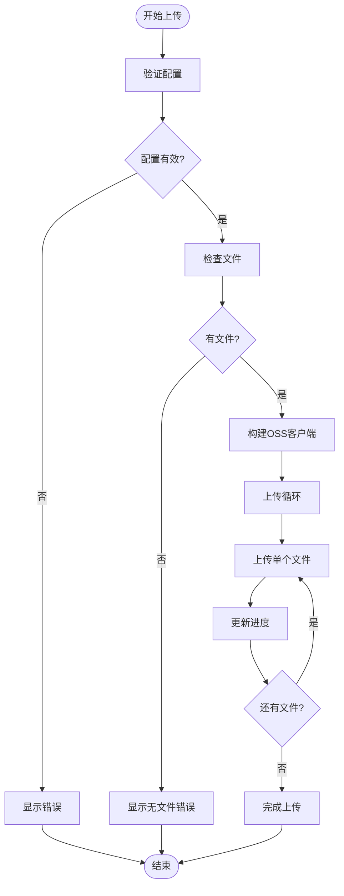
```mermaid
flowchart TD
Start([开始上传]) --> ValidateConfig[验证配置]
ValidateConfig --> ConfigValid{配置有效?}
ConfigValid --> |否| ShowError[显示错误]
ConfigValid --> |是| CheckFiles[检查文件]
CheckFiles --> FilesValid{有文件?}
FilesValid --> |否| ShowNoFiles[显示无文件错误]
FilesValid --> |是| BuildClient[构建OSS客户端]
BuildClient --> UploadLoop[上传循环]
UploadLoop --> UploadFile[上传单个文件]
UploadFile --> UpdateProgress[更新进度]
UpdateProgress --> NextFile{还有文件?}
NextFile --> |是| UploadFile
NextFile --> |否| Complete[完成上传]
ShowError --> End([结束])
ShowNoFiles --> End
Complete --> End
```

**图表来源**
- [ossManager.ts:334-438](file://src/main/services/ossManager.ts#L334-L438)

#### 多文件上传流程

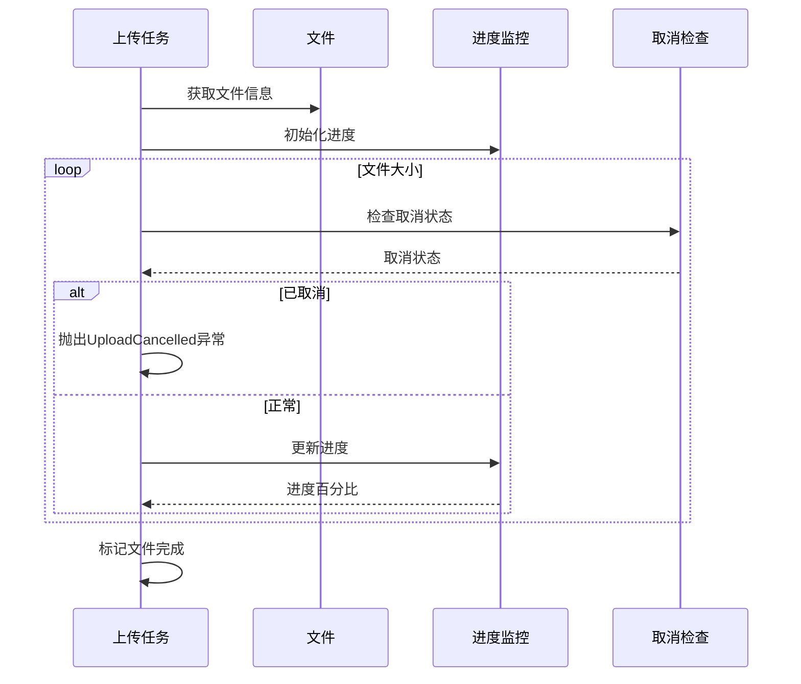
```mermaid
sequenceDiagram
participant Task as 上传任务
participant File as 文件
participant Progress as 进度监控
participant Cancel as 取消检查
Task->>File : 获取文件信息
Task->>Progress : 初始化进度
loop 文件大小
Task->>Cancel : 检查取消状态
Cancel-->>Task : 取消状态
alt 已取消
Task->>Task : 抛出UploadCancelled异常
else 正常
Task->>Progress : 更新进度
Progress-->>Task : 进度百分比
end
end
Task->>Task : 标记文件完成
```

**图表来源**
- [ossManager.ts:191-294](file://src/main/services/ossManager.ts#L191-L294)

**章节来源**
- [ossManager.ts:107-127](file://src/main/services/ossManager.ts#L107-L127)
- [ossManager.ts:334-438](file://src/main/services/ossManager.ts#L334-L438)

### 渲染进程界面组件

渲染进程提供了直观的用户界面，支持拖拽上传、文件选择、进度显示等功能。

#### 配置持久化机制

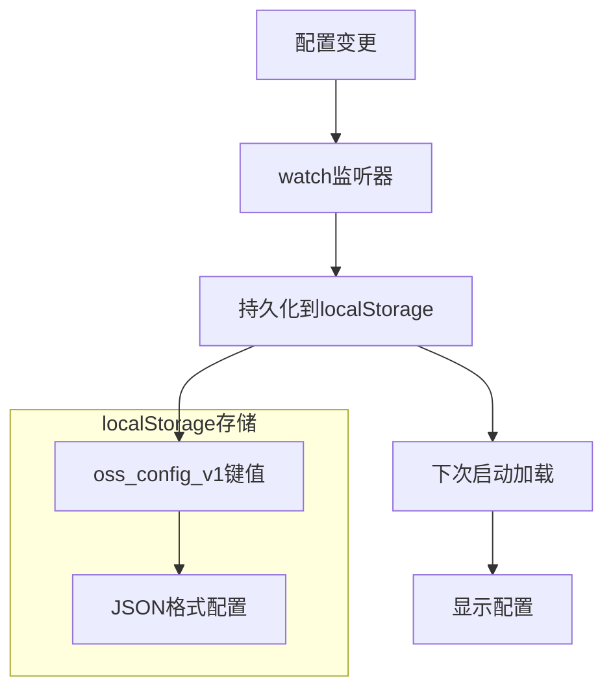
```mermaid
flowchart TD
ConfigChange[配置变更] --> Watcher[watch监听器]
Watcher --> Persist[持久化到localStorage]
Persist --> Load[下次启动加载]
Load --> Display[显示配置]
subgraph "localStorage存储"
Storage[oss_config_v1键值]
Data[JSON格式配置]
end
Persist --> Storage
Storage --> Data
```

**图表来源**
- [OssManager.vue:53-92](file://src/renderer/src/views/oss/OssManager.vue#L53-L92)

**章节来源**
- [OssManager.vue:1-913](file://src/renderer/src/views/oss/OssManager.vue#L1-L913)

## 配置参数详解

### 基础配置参数

| 参数名称 | 类型 | 必填 | 描述 | 示例 |
|---------|------|------|------|------|
| accessKeyId | string | 是 | 阿里云访问密钥ID | LTAIxxxxxxxxxxxx |
| accessKeySecret | string | 是 | 阿里云访问密钥Secret | ******************************** |
| endpoint | string | 是 | OSS服务端点 | https://oss-cn-beijing.aliyuncs.com |
| bucket | string | 是 | 存储桶名称 | your-bucket-name |

### 高级配置参数

| 参数名称 | 类型 | 默认值 | 描述 | 示例 |
|---------|------|--------|------|------|
| targetPath | string | 空字符串 | 目标路径前缀 | uploads/2026 |
| acl | string | 'public-read' | 对象ACL权限 | private/public-read/public-read-write |

### Endpoint配置规则

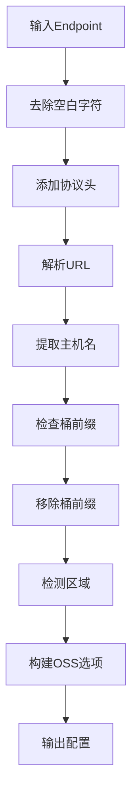
```mermaid
flowchart TD
Input[输入Endpoint] --> Trim[去除空白字符]
Trim --> AddProtocol[添加协议头]
AddProtocol --> ParseURL[解析URL]
ParseURL --> ExtractHost[提取主机名]
ExtractHost --> CheckBucket[检查桶前缀]
CheckBucket --> RemoveBucket[移除桶前缀]
RemoveBucket --> DetectRegion[检测区域]
DetectRegion --> BuildOptions[构建OSS选项]
BuildOptions --> Output[输出配置]
```

**图表来源**
- [ossManager.ts:81-105](file://src/main/services/ossManager.ts#L81-L105)

**章节来源**
- [ossManager.ts:14-21](file://src/main/services/ossManager.ts#L14-L21)
- [OssManager.vue:18-22](file://src/renderer/src/views/oss/OssManager.vue#L18-L22)

## 权限管理配置

### ACL权限设置

OSS支持三种基本ACL权限模式：

1. **public-read** (默认): 对象可公开读取
2. **private**: 对象私有，仅所有者可访问
3. **public-read-write**: 对象可公开读写

### RAM角色权限

虽然代码中未直接实现RAM角色配置，但可以通过以下方式实现：

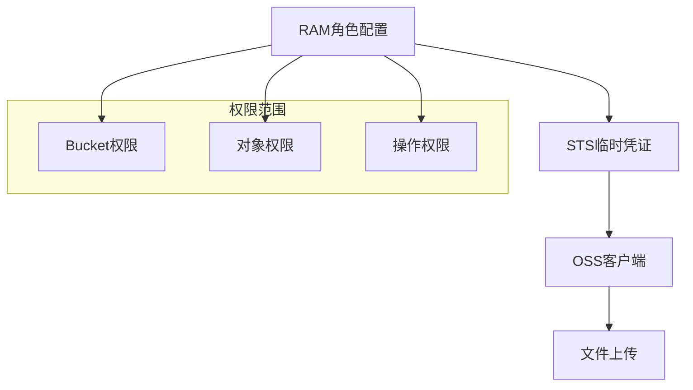
```mermaid
flowchart TD
RAMConfig[RAM角色配置] --> STS[STS临时凭证]
STS --> OSSClient[OSS客户端]
OSSClient --> Upload[文件上传]
subgraph "权限范围"
BucketPerm[Bucket权限]
ObjectPerm[对象权限]
ActionPerm[操作权限]
end
RAMConfig --> BucketPerm
RAMConfig --> ObjectPerm
RAMConfig --> ActionPerm
```

### Bucket Policy设置

建议的Bucket Policy示例：

```json
{
    "Version": "1",
    "Statement": [
        {
            "Effect": "Allow",
            "Principal": "*",
            "Action": "oss:GetObject",
            "Resource": "acs:oss:*:*:your-bucket/*"
        }
    ]
}
```

### CORS配置

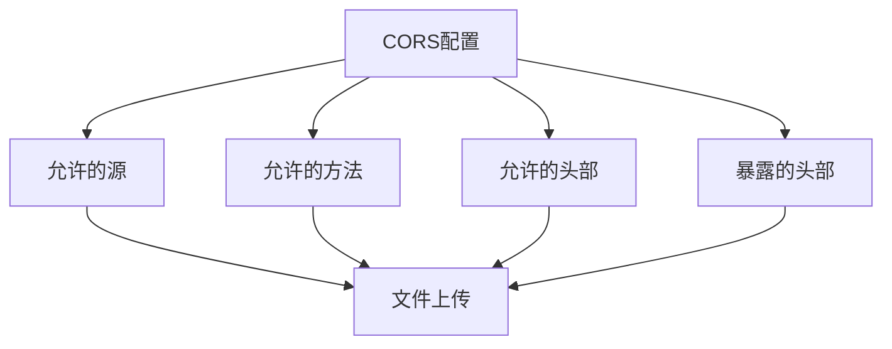
```mermaid
flowchart TD
CORSConfig[CORS配置] --> Origin[允许的源]
CORSConfig --> Methods[允许的方法]
CORSConfig --> Headers[允许的头部]
CORSConfig --> Expose[暴露的头部]
Origin --> Upload[文件上传]
Methods --> Upload
Headers --> Upload
Expose --> Upload
```

**章节来源**
- [ossManager.ts:217-217](file://src/main/services/ossManager.ts#L217-L217)
- [OssManager.vue:395-401](file://src/renderer/src/views/oss/OssManager.vue#L395-L401)

## 客户端配置选项

### 连接超时设置

OSS客户端支持多种超时配置：

| 配置项 | 默认值 | 描述 |
|-------|--------|------|
| connectTimeout | 5000ms | 连接超时时间 |
| requestTimeout | 10000ms | 请求超时时间 |
| retryDelay | 100ms | 重试延迟时间 |
| maxRetries | 3次 | 最大重试次数 |

### 重试策略

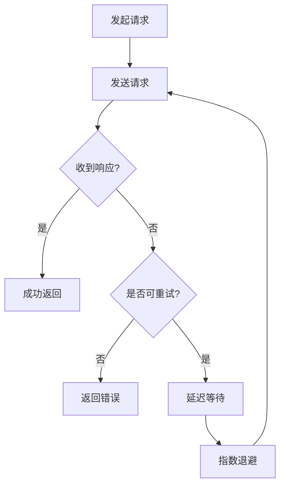
```mermaid
flowchart TD
Request[发起请求] --> Send[发送请求]
Send --> Response{收到响应?}
Response --> |是| Success[成功返回]
Response --> |否| RetryCheck{是否可重试?}
RetryCheck --> |否| Error[返回错误]
RetryCheck --> |是| Delay[延迟等待]
Delay --> Backoff[指数退避]
Backoff --> Send
```

### 断点续传配置

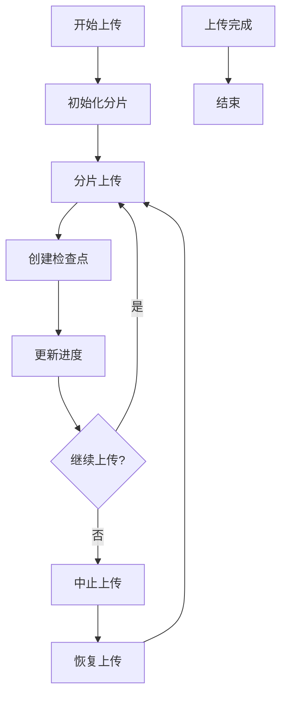
```mermaid
flowchart TD
Start[开始上传] --> Init[初始化分片]
Init --> PartUpload[分片上传]
PartUpload --> Checkpoint[创建检查点]
Checkpoint --> Progress[更新进度]
Progress --> Continue{继续上传?}
Continue --> |是| PartUpload
Continue --> |否| Abort[中止上传]
Abort --> Resume[恢复上传]
Resume --> PartUpload
Success[上传完成] --> End[结束]
```

**章节来源**
- [ossManager.ts:267-281](file://src/main/services/ossManager.ts#L267-L281)
- [ossManager.ts:271-280](file://src/main/services/ossManager.ts#L271-L280)

## 性能优化参数

### 并发上传配置

| 参数 | 默认值 | 优化建议 | 适用场景 |
|------|--------|----------|----------|
| parallel | 4 | 2-8 | 网络带宽充足 |
| partSize | 5MB | 5-50MB | 大文件上传 |
| progressInterval | 80ms | 50-100ms | 实时进度显示 |

### 内存管理

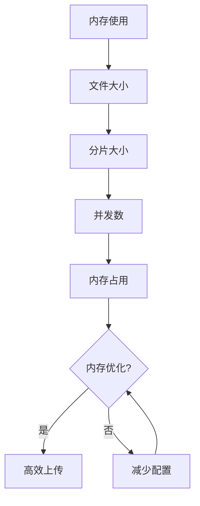
```mermaid
flowchart TD
Memory[内存使用] --> FileSize[文件大小]
FileSize --> PartSize[分片大小]
PartSize --> Parallel[并发数]
Parallel --> MemoryUsage[内存占用]
MemoryUsage --> Optimize{内存优化?}
Optimize --> |是| Efficient[高效上传]
Optimize --> |否| Reduce[减少配置]
Reduce --> Optimize
```

### 网络优化

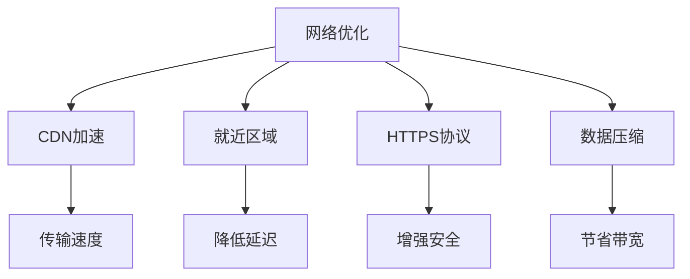
```mermaid
flowchart TD
Network[网络优化] --> CDN[CDN加速]
Network --> Region[就近区域]
Network --> Protocol[HTTPS协议]
Network --> Compression[数据压缩]
CDN --> Speed[传输速度]
Region --> Latency[降低延迟]
Protocol --> Security[增强安全]
Compression --> Bandwidth[节省带宽]
```

**章节来源**
- [ossManager.ts:269-270](file://src/main/services/ossManager.ts#L269-L270)

## 配置验证方法

### 网络连接测试

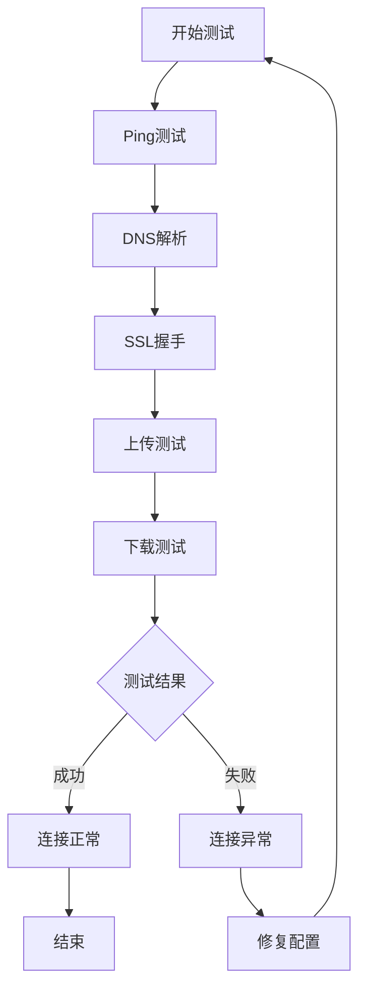
```mermaid
flowchart TD
TestStart[开始测试] --> Ping[Ping测试]
Ping --> DNS[DNS解析]
DNS --> SSL[SSL握手]
SSL --> UploadTest[上传测试]
UploadTest --> DownloadTest[下载测试]
DownloadTest --> Result{测试结果}
Result --> |成功| Success[连接正常]
Result --> |失败| Failure[连接异常]
Success --> End[结束]
Failure --> Fix[修复配置]
Fix --> TestStart
```

### 权限验证

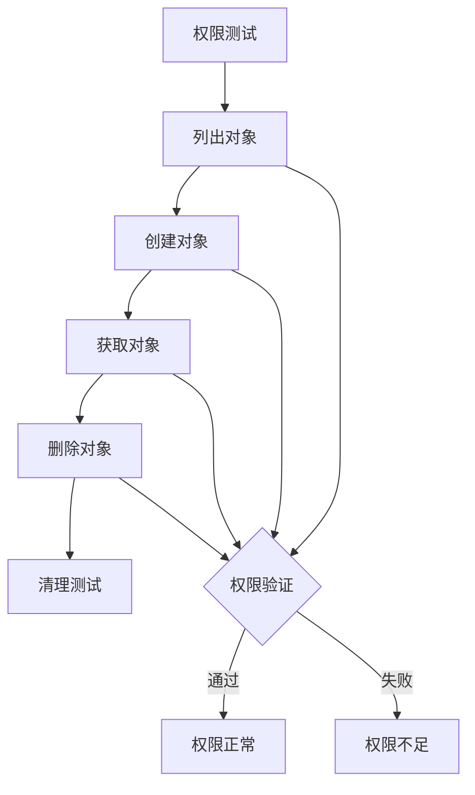
```mermaid
flowchart TD
PermTest[权限测试] --> ListTest[列出对象]
ListTest --> PutTest[创建对象]
PutTest --> GetTest[获取对象]
GetTest --> DeleteTest[删除对象]
DeleteTest --> CleanUp[清理测试]
ListTest --> PermResult{权限验证}
PutTest --> PermResult
GetTest --> PermResult
DeleteTest --> PermResult
PermResult --> |通过| PermSuccess[权限正常]
PermResult --> |失败| PermFailure[权限不足]
```

### 上传下载测试

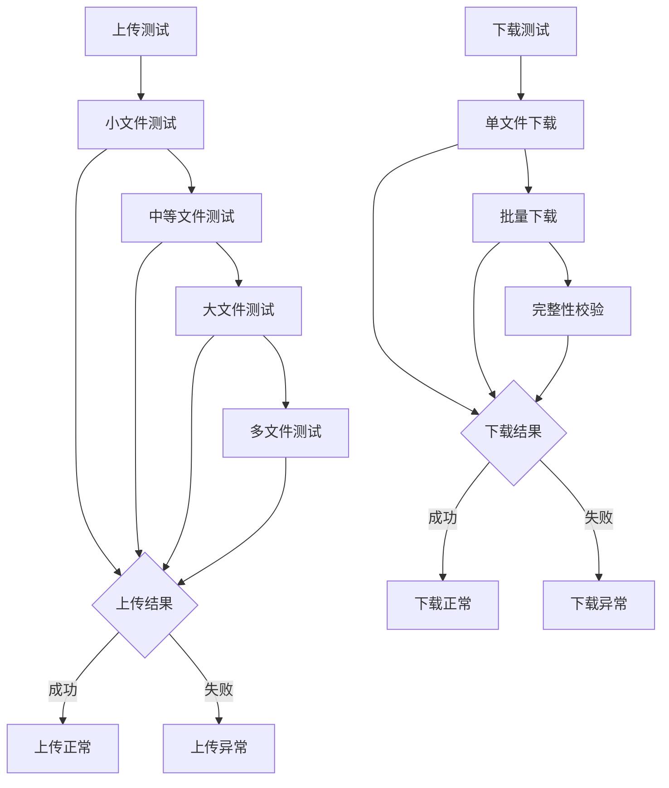
```mermaid
flowchart TD
UploadTest[上传测试] --> SmallFile[小文件测试]
SmallFile --> MediumFile[中等文件测试]
MediumFile --> LargeFile[大文件测试]
LargeFile --> MultiFile[多文件测试]
SmallFile --> UploadResult{上传结果}
MediumFile --> UploadResult
LargeFile --> UploadResult
MultiFile --> UploadResult
UploadResult --> |成功| UploadSuccess[上传正常]
UploadResult --> |失败| UploadFailure[上传异常]
DownloadTest[下载测试] --> SingleDownload[单文件下载]
SingleDownload --> MultiDownload[批量下载]
MultiDownload --> Verify[完整性校验]
SingleDownload --> DownloadResult{下载结果}
MultiDownload --> DownloadResult
Verify --> DownloadResult
DownloadResult --> |成功| DownloadSuccess[下载正常]
DownloadResult --> |失败| DownloadFailure[下载异常]
```

**章节来源**
- [ossManager.ts:341-350](file://src/main/services/ossManager.ts#L341-L350)

## 故障排除指南

### 常见错误类型

| 错误类型 | 错误码 | 可能原因 | 解决方案 |
|---------|--------|----------|----------|
| 认证失败 | 401/403 | AccessKey配置错误 | 检查AccessKey ID和Secret |
| 网络超时 | 408 | 网络连接问题 | 检查网络和代理设置 |
| 权限不足 | 403 | Bucket Policy配置 | 检查Bucket Policy和ACL |
| 端点错误 | 404 | Endpoint配置错误 | 验证Endpoint格式 |
| 文件过大 | 413 | 文件超过限制 | 分割文件或调整配置 |

### 错误处理机制

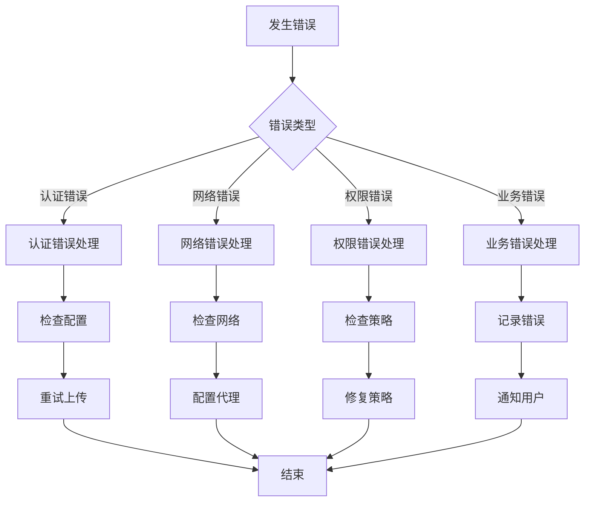
```mermaid
flowchart TD
Error[发生错误] --> Type{错误类型}
Type --> |认证错误| AuthError[认证错误处理]
Type --> |网络错误| NetError[网络错误处理]
Type --> |权限错误| PermError[权限错误处理]
Type --> |业务错误| BizError[业务错误处理]
AuthError --> CheckConfig[检查配置]
NetError --> CheckNetwork[检查网络]
PermError --> CheckPolicy[检查策略]
BizError --> LogError[记录错误]
CheckConfig --> Retry[重试上传]
CheckNetwork --> Proxy[配置代理]
CheckPolicy --> FixPolicy[修复策略]
LogError --> Notify[通知用户]
Retry --> End[结束]
Proxy --> End
FixPolicy --> End
Notify --> End
```

### 调试技巧

1. **启用详细日志**: 在开发环境中查看控制台输出
2. **检查网络连接**: 使用ping和traceroute测试网络
3. **验证配置**: 逐项检查AccessKey、Endpoint、Bucket配置
4. **测试权限**: 使用OSS控制台验证权限设置
5. **监控进度**: 查看上传进度和错误信息

### 性能诊断

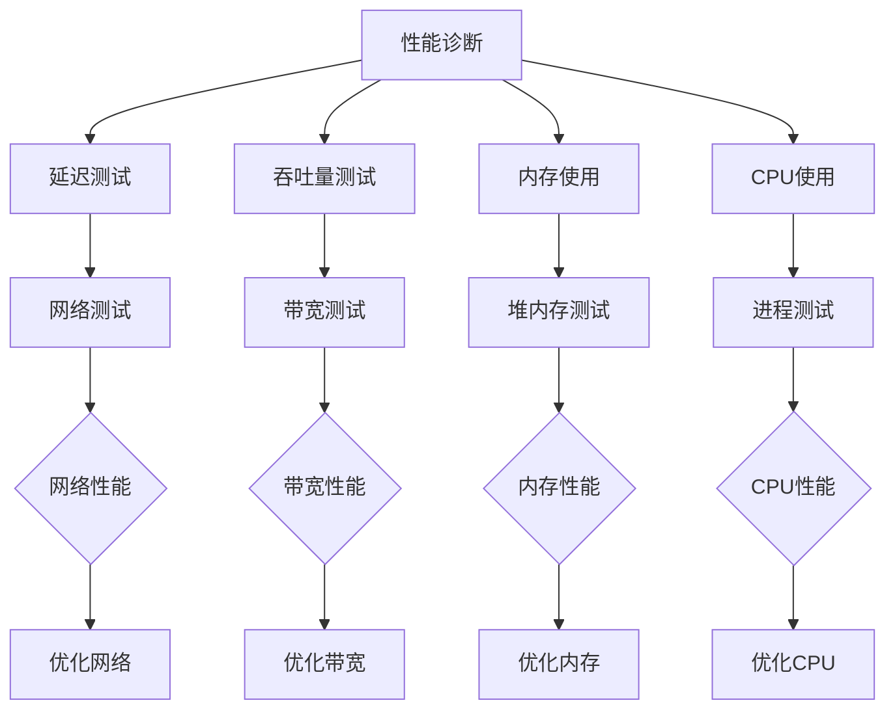
```mermaid
flowchart TD
Diagnose[性能诊断] --> Latency[延迟测试]
Diagnose --> Throughput[吞吐量测试]
Diagnose --> Memory[内存使用]
Diagnose --> CPU[CPU使用]
Latency --> NetworkTest[网络测试]
Throughput --> BandwidthTest[带宽测试]
Memory --> HeapTest[堆内存测试]
CPU --> ProcessTest[进程测试]
NetworkTest --> NetworkResult{网络性能}
BandwidthTest --> BandwidthResult{带宽性能}
HeapTest --> MemoryResult{内存性能}
ProcessTest --> CpuResult{CPU性能}
NetworkResult --> OptimizeNetwork[优化网络]
BandwidthResult --> OptimizeBandwidth[优化带宽]
MemoryResult --> OptimizeMemory[优化内存]
CpuResult --> OptimizeCPU[优化CPU]
```

**章节来源**
- [ossManager.ts:178-189](file://src/main/services/ossManager.ts#L178-L189)
- [ossManager.ts:418-421](file://src/main/services/ossManager.ts#L418-L421)

## 结论

OSS管理服务配置指南涵盖了从基础配置到高级优化的完整解决方案。通过理解项目的架构设计和实现细节，用户可以：

1. **正确配置基础参数**: AccessKey、Endpoint、Bucket等核心配置
2. **合理设置权限策略**: ACL、Bucket Policy、CORS等安全配置
3. **优化客户端参数**: 超时、重试、并发等性能参数调优
4. **实施验证和故障排除**: 建立完整的测试和诊断流程

该服务提供了完整的文件上传解决方案，支持多种上传模式和丰富的用户界面交互，能够满足不同场景下的OSS使用需求。通过遵循本文档的配置指南和最佳实践，用户可以确保OSS服务的稳定性和安全性。