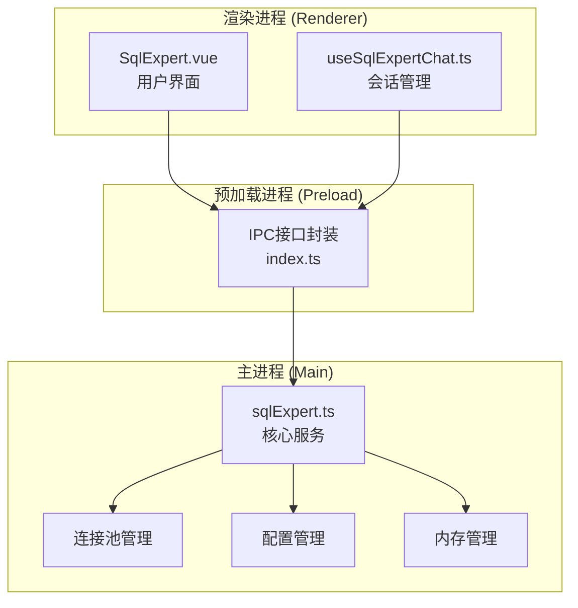
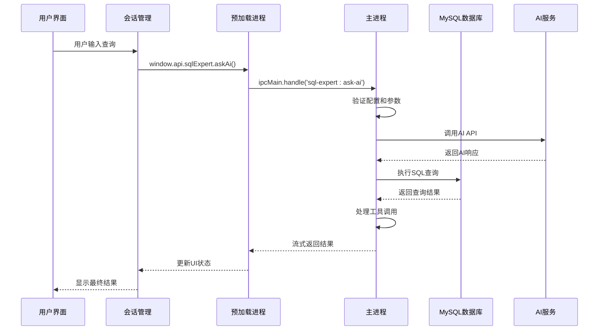
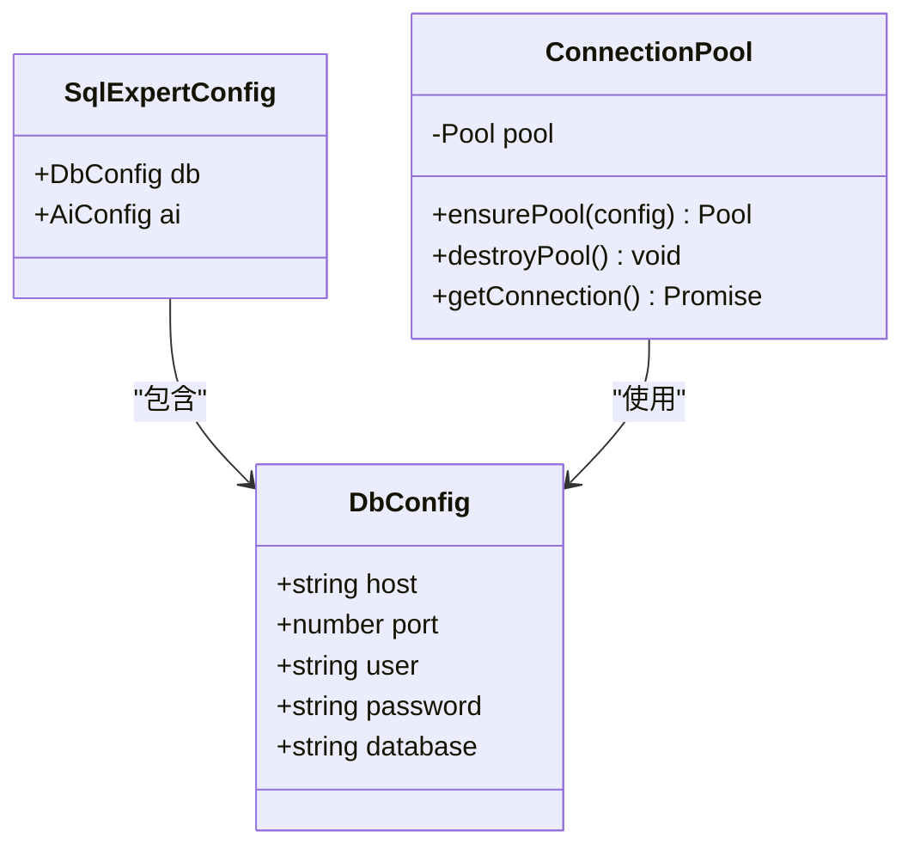
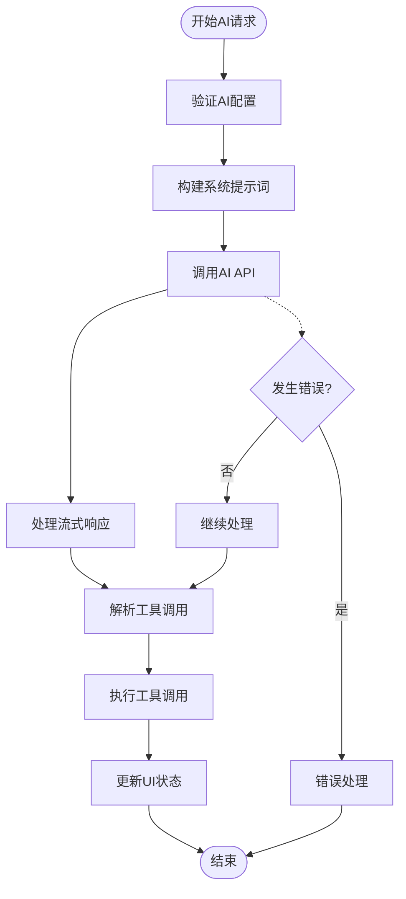
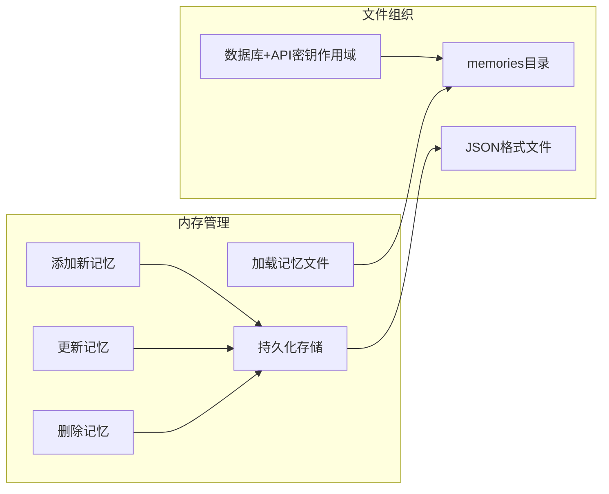
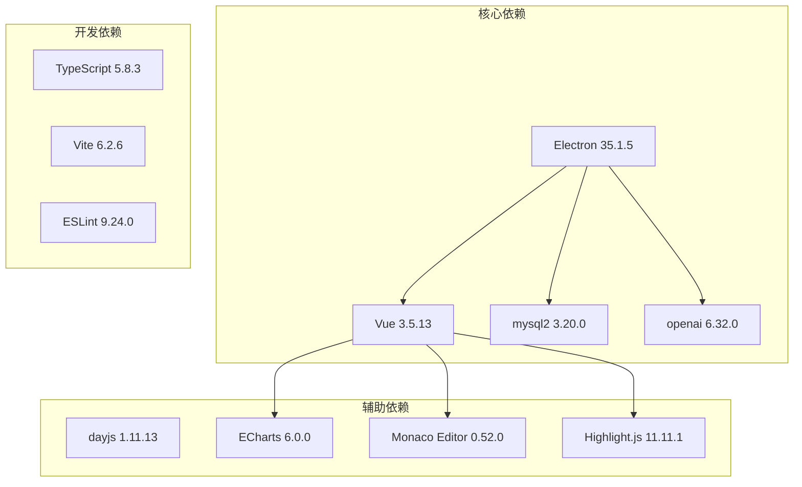

# SQL专家服务配置

<cite>
**本文档引用的文件**
- [sqlExpert.ts](file://src/main/services/sqlExpert.ts)
- [SqlExpert.vue](file://src/renderer/src/views/sqlexpert/SqlExpert.vue)
- [useSqlExpertChat.ts](file://src/renderer/src/views/sqlexpert/useSqlExpertChat.ts)
- [index.ts](file://src/preload/index.ts)
- [package.json](file://package.json)
</cite>

## 目录
1. [简介](#简介)
2. [项目结构](#项目结构)
3. [核心组件](#核心组件)
4. [架构概览](#架构概览)
5. [详细组件分析](#详细组件分析)
6. [依赖关系分析](#依赖关系分析)
7. [性能考虑](#性能考虑)
8. [故障排除指南](#故障排除指南)
9. [结论](#结论)

## 简介

SQL专家服务是一个基于Electron框架的企业级数据分析助手，集成了MySQL数据库连接管理和AI智能体功能。该服务提供了完整的数据库配置管理、AI模型配置、连接池优化、内存管理等高级功能，支持通过对话方式实现复杂的数据查询和分析任务。

## 项目结构

SQL专家服务采用典型的Electron应用架构，主要分为三个层次：



**图表来源**
- [SqlExpert.vue:1-800](file://src/renderer/src/views/sqlexpert/SqlExpert.vue#L1-L800)
- [useSqlExpertChat.ts:1-508](file://src/renderer/src/views/sqlexpert/useSqlExpertChat.ts#L1-L508)
- [index.ts:171-195](file://src/preload/index.ts#L171-L195)
- [sqlExpert.ts:1-1503](file://src/main/services/sqlExpert.ts#L1-L1503)

**章节来源**
- [SqlExpert.vue:1-800](file://src/renderer/src/views/sqlexpert/SqlExpert.vue#L1-L800)
- [useSqlExpertChat.ts:1-508](file://src/renderer/src/views/sqlexpert/useSqlExpertChat.ts#L1-L508)
- [index.ts:171-195](file://src/preload/index.ts#L171-L195)
- [sqlExpert.ts:1-1503](file://src/main/services/sqlExpert.ts#L1-L1503)

## 核心组件

### 数据库配置 (DbConfig)

数据库配置是SQL专家服务的基础，包含了连接MySQL数据库所需的所有参数：

| 参数名称 | 类型 | 必填 | 默认值 | 描述 |
|---------|------|------|--------|------|
| host | string | 是 | localhost | 数据库服务器主机地址 |
| port | number | 是 | 3306 | 数据库服务器端口号 |
| user | string | 是 | root | 数据库用户名 |
| password | string | 是 | 空 | 数据库密码 |
| database | string | 是 | 空 | 要连接的具体数据库名称 |

### AI配置 (AiConfig)

AI配置用于连接外部AI服务，支持多种兼容OpenAI API格式的服务：

| 参数名称 | 类型 | 必填 | 默认值 | 描述 |
|---------|------|------|--------|------|
| url | string | 是 | https://api.deepseek.com/v1 | AI服务API地址 |
| apiKey | string | 是 | 空 | 访问AI服务的密钥 |
| model | string | 是 | deepseek-chat | 使用的AI模型名称 |

### 配置文件结构

配置文件采用JSON格式存储，位于应用用户数据目录下的特定子目录中：

```mermaid
graph TD
UserData[用户数据目录<br/>app.getPath('userData')] --> ExpertDir[sql-expert/<br/>专家服务目录]
ExpertDir --> ConfigFile[config.json<br/>主配置文件]
ExpertDir --> SchemaFile[schema.txt<br/>表结构缓存]
ExpertDir --> MemoriesDir[memories/<br/>记忆文件目录]
MemoriesDir --> MemoryFile[memory_scope.json<br/>记忆文件]
```

**图表来源**
- [sqlExpert.ts:96-137](file://src/main/services/sqlExpert.ts#L96-L137)

**章节来源**
- [sqlExpert.ts:14-31](file://src/main/services/sqlExpert.ts#L14-L31)
- [sqlExpert.ts:139-156](file://src/main/services/sqlExpert.ts#L139-L156)

## 架构概览

SQL专家服务采用分层架构设计，实现了清晰的关注点分离：



**图表来源**
- [useSqlExpertChat.ts:282-420](file://src/renderer/src/views/sqlexpert/useSqlExpertChat.ts#L282-L420)
- [index.ts:171-195](file://src/preload/index.ts#L171-L195)
- [sqlExpert.ts:1280-1501](file://src/main/services/sqlExpert.ts#L1280-L1501)

## 详细组件分析

### 数据库连接池管理

SQL专家服务实现了高效的连接池管理机制，支持并发连接和资源优化：



**图表来源**
- [sqlExpert.ts:14-31](file://src/main/services/sqlExpert.ts#L14-L31)
- [sqlExpert.ts:404-435](file://src/main/services/sqlExpert.ts#L404-L435)

连接池的关键特性：
- **连接限制**: 最大5个并发连接
- **等待策略**: 支持连接队列等待
- **超时控制**: 连接超时10秒
- **自动重建**: 配置变更时自动重建连接池

### AI服务集成

AI服务通过OpenAI兼容的API进行集成，支持流式响应和工具调用：



**图表来源**
- [sqlExpert.ts:676-739](file://src/main/services/sqlExpert.ts#L676-L739)
- [sqlExpert.ts:1280-1501](file://src/main/services/sqlExpert.ts#L1280-L1501)

### 内存管理系统

SQL专家服务实现了智能的记忆管理功能，支持本地存储和增量更新：



**图表来源**
- [sqlExpert.ts:172-264](file://src/main/services/sqlExpert.ts#L172-L264)
- [sqlExpert.ts:128-137](file://src/main/services/sqlExpert.ts#L128-L137)

**章节来源**
- [sqlExpert.ts:404-435](file://src/main/services/sqlExpert.ts#L404-L435)
- [sqlExpert.ts:676-739](file://src/main/services/sqlExpert.ts#L676-L739)
- [sqlExpert.ts:172-264](file://src/main/services/sqlExpert.ts#L172-L264)

## 依赖关系分析

SQL专家服务依赖于多个关键库和模块：



**图表来源**
- [package.json:28-73](file://package.json#L28-L73)

**章节来源**
- [package.json:28-73](file://package.json#L28-L73)

## 性能考虑

### 连接池优化

SQL专家服务在连接池配置上采用了多项优化措施：

- **并发控制**: 限制最大连接数为5，避免过度占用数据库资源
- **超时设置**: 连接超时10秒，确保快速失败检测
- **队列管理**: 支持无限队列，防止连接请求丢失
- **自动重建**: 配置变更时自动销毁和重建连接池

### 内存管理

- **文件大小限制**: 工具调用结果最多返回10行，避免内存溢出
- **增量存储**: 记忆文件采用JSON格式，支持增量追加
- **作用域隔离**: 基于数据库名和API密钥生成唯一作用域标识

### 网络优化

- **流式响应**: AI响应采用流式传输，提升用户体验
- **批量查询**: 支持一次性查询多个表的结构信息
- **缓存机制**: 表结构信息缓存在本地文件中

## 故障排除指南

### 数据库连接问题

**常见问题及解决方案**：

1. **连接超时**
   - 检查网络连通性和防火墙设置
   - 验证数据库服务器状态
   - 调整连接超时时间

2. **认证失败**
   - 确认用户名和密码正确
   - 检查用户权限设置
   - 验证数据库名称拼写

3. **连接池耗尽**
   - 检查是否有未关闭的连接
   - 调整连接池大小
   - 优化查询执行时间

### AI服务配置问题

**常见问题及解决方案**：

1. **API密钥无效**
   - 确认API密钥格式正确
   - 检查密钥权限范围
   - 验证服务可用性

2. **模型名称错误**
   - 确认使用的模型名称正确
   - 检查模型是否可用
   - 验证API版本兼容性

3. **网络连接问题**
   - 检查代理设置
   - 验证DNS解析
   - 确认SSL证书有效

### 配置文件问题

**常见问题及解决方案**：

1. **配置文件损坏**
   - 备份现有配置文件
   - 重新生成配置文件
   - 检查文件权限

2. **路径权限问题**
   - 确认用户数据目录可写
   - 检查磁盘空间
   - 验证文件系统权限

3. **编码问题**
   - 确保配置文件使用UTF-8编码
   - 检查特殊字符转义
   - 验证JSON格式正确性

**章节来源**
- [sqlExpert.ts:970-991](file://src/main/services/sqlExpert.ts#L970-L991)
- [sqlExpert.ts:1159-1212](file://src/main/services/sqlExpert.ts#L1159-L1212)
- [sqlExpert.ts:1244-1266](file://src/main/services/sqlExpert.ts#L1244-L1266)

## 结论

SQL专家服务配置系统提供了完整的企业级数据查询和分析能力。通过合理的架构设计和配置管理，该系统能够满足复杂的企业应用场景需求。

**主要优势**：
- 完善的配置管理机制
- 高效的连接池优化
- 智能的内存管理
- 流式的AI交互体验
- 全面的错误处理和故障排除

**最佳实践建议**：
- 定期备份配置文件
- 监控连接池使用情况
- 优化AI模型选择
- 实施适当的超时设置
- 建立完善的日志监控

该配置系统为企业用户提供了一个强大而易用的数据分析平台，能够显著提升数据查询和分析效率。