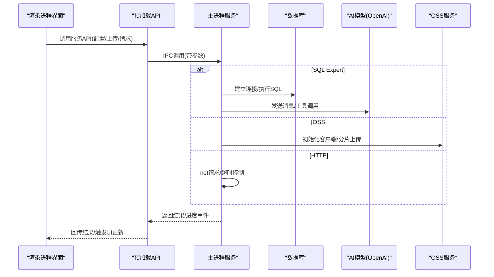
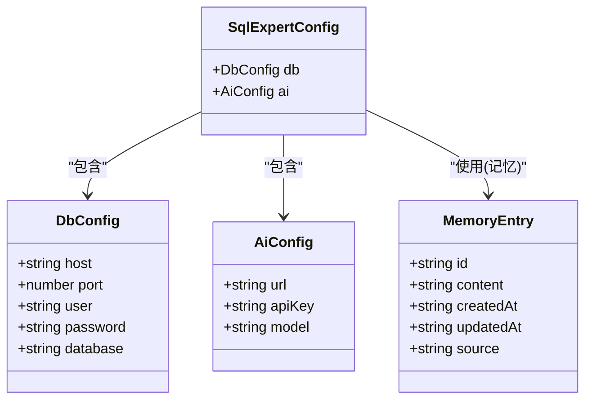
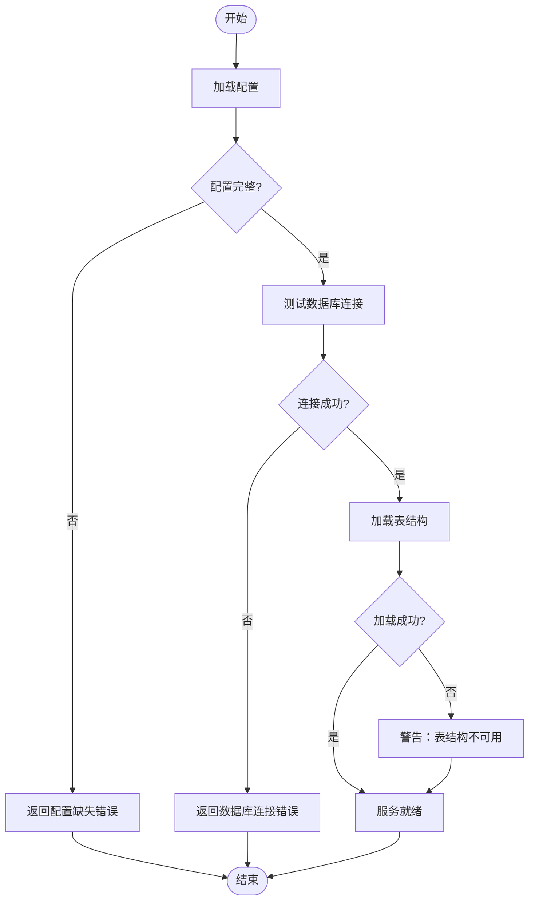
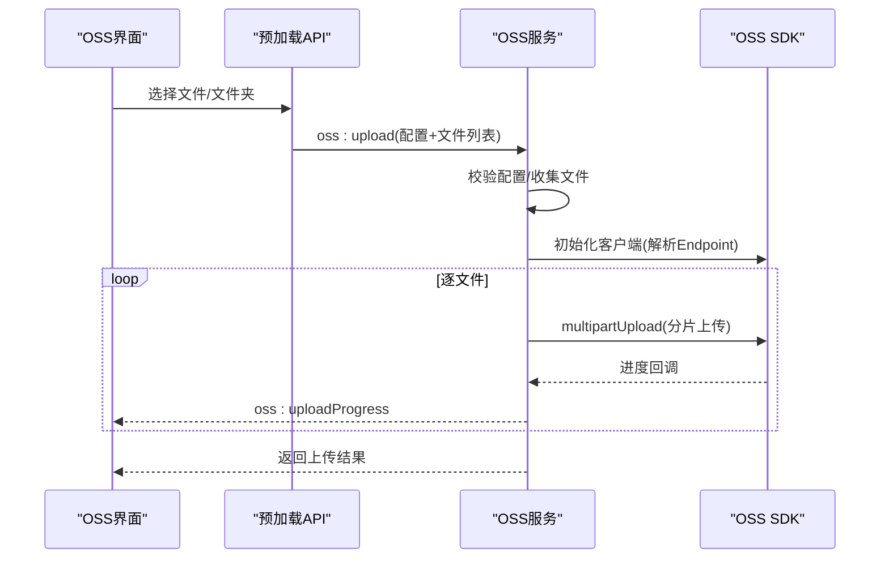
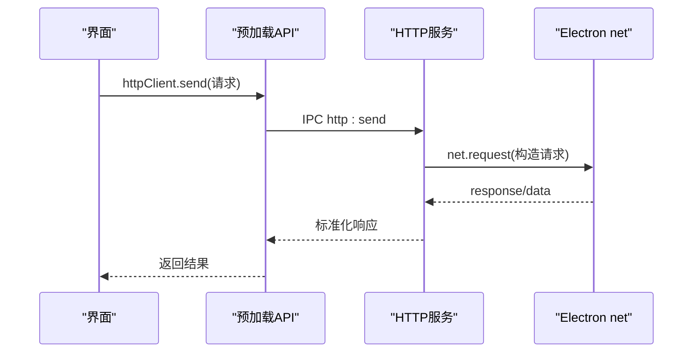
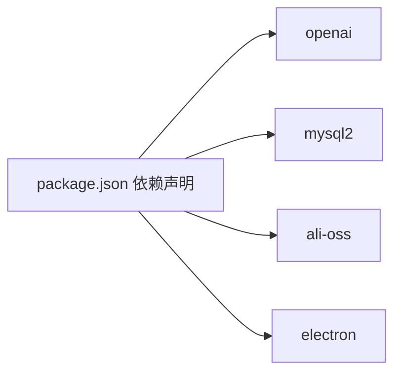

# 服务配置

<cite>
**本文档引用的文件**
- [sqlExpert.ts](file://src/main/services/sqlExpert.ts)
- [ossManager.ts](file://src/main/services/ossManager.ts)
- [httpClient.ts](file://src/main/services/httpClient.ts)
- [index.ts](file://src/main/index.ts)
- [index.ts](file://src/preload/index.ts)
- [SqlExpert.vue](file://src/renderer/src/views/sqlexpert/SqlExpert.vue)
- [OssManager.vue](file://src/renderer/src/views/oss/OssManager.vue)
- [Settings.vue](file://src/renderer/src/views/settings/Settings.vue)
- [package.json](file://package.json)
</cite>

## 目录
1. [简介](#简介)
2. [项目结构](#项目结构)
3. [核心组件](#核心组件)
4. [架构总览](#架构总览)
5. [详细组件分析](#详细组件分析)
6. [依赖关系分析](#依赖关系分析)
7. [性能考虑](#性能考虑)
8. [故障排除指南](#故障排除指南)
9. [结论](#结论)
10. [附录](#附录)

## 简介
本指南面向开发者工具箱中的核心服务配置，重点覆盖以下服务：
- SQL Expert 服务：数据库连接、AI 模型参数、SQL 校验与工具调用
- OSS 管理服务：阿里云 OSS 上传配置（AccessKey、Endpoint、Bucket、ACL）
- HTTP 客户端服务：请求超时、代理、错误处理
并提供配置验证方法、故障排除步骤及配置文件存储位置与格式说明。

## 项目结构
开发者工具箱采用 Electron + Vue 架构，主进程负责服务注册与系统集成，渲染进程提供 UI 交互。核心服务通过 IPC 暴露接口，实现跨进程通信。

```mermaid
graph TB
subgraph "主进程"
IDX["index.ts<br/>应用入口与IPC注册"]
SQLEX["services/sqlExpert.ts<br/>SQL专家服务"]
OSS["services/ossManager.ts<br/>OSS上传服务"]
HTTP["services/httpClient.ts<br/>HTTP客户端服务"]
end
subgraph "预加载层"
PRE["preload/index.ts<br/>安全暴露API"]
end
subgraph "渲染进程"
UI_SQL["views/sqlexpert/SqlExpert.vue<br/>SQL专家界面"]
UI_OSS["views/oss/OssManager.vue<br/>OSS管理界面"]
UI_SET["views/settings/Settings.vue<br/>应用设置"]
end
IDX --> SQLEX
IDX --> OSS
IDX --> HTTP
PRE <- --> UI_SQL
PRE <- --> UI_OSS
PRE <- --> UI_SET
```

**图表来源**
- [index.ts:421-428](file://src/main/index.ts#L421-L428)
- [sqlExpert.ts:1-120](file://src/main/services/sqlExpert.ts#L1-L120)
- [ossManager.ts:1-60](file://src/main/services/ossManager.ts#L1-L60)
- [httpClient.ts:1-30](file://src/main/services/httpClient.ts#L1-L30)
- [index.ts:106-212](file://src/preload/index.ts#L106-L212)
- [SqlExpert.vue:1-60](file://src/renderer/src/views/sqlexpert/SqlExpert.vue#L1-L60)
- [OssManager.vue:1-60](file://src/renderer/src/views/oss/OssManager.vue#L1-L60)
- [Settings.vue:1-60](file://src/renderer/src/views/settings/Settings.vue#L1-L60)

**章节来源**
- [index.ts:421-428](file://src/main/index.ts#L421-L428)
- [index.ts:106-212](file://src/preload/index.ts#L106-L212)

## 核心组件
本节概述三大核心服务的职责与配置要点：
- SQL Expert 服务：数据库连接池、AI 请求（OpenAI）、SQL 校验、工具函数（查询、导出、绘图、记忆）
- OSS 管理服务：阿里云 OSS 客户端构建、分片上传、多文件批量处理、进度与取消
- HTTP 客户端服务：原生 Electron net 请求、超时控制、代理集成

**章节来源**
- [sqlExpert.ts:14-86](file://src/main/services/sqlExpert.ts#L14-L86)
- [ossManager.ts:14-34](file://src/main/services/ossManager.ts#L14-L34)
- [httpClient.ts:7-13](file://src/main/services/httpClient.ts#L7-L13)

## 架构总览
服务配置通过 IPC 在主进程与渲染进程之间传递，预加载层统一暴露安全 API，UI 层负责配置输入与持久化。



**图表来源**
- [index.ts:421-428](file://src/main/index.ts#L421-L428)
- [index.ts:106-212](file://src/preload/index.ts#L106-L212)
- [sqlExpert.ts:676-739](file://src/main/services/sqlExpert.ts#L676-L739)
- [ossManager.ts:334-438](file://src/main/services/ossManager.ts#L334-L438)
- [httpClient.ts:15-112](file://src/main/services/httpClient.ts#L15-L112)

## 详细组件分析

### SQL Expert 服务配置
SQL Expert 服务在主进程内提供数据库连接、AI 对话、SQL 校验与工具调用能力。其配置项与持久化机制如下：

- 配置结构
  - 数据库配置：主机、端口、用户名、密码、数据库
  - AI 配置：模型服务地址、API Key、模型名称
- 配置持久化
  - 存储位置：应用数据目录下的专用子目录
  - 文件命名：配置文件、表结构缓存、记忆文件
- SQL 校验规则
  - 仅允许单条 SELECT 或 WITH...SELECT
  - 禁止写入类关键字
  - 禁止访问系统库
  - 禁止 SELECT *
  - 输出列必须使用 AS 明确别名
- 工具函数
  - 查询数据库、描述表结构、渲染图表、导出数据、保存记忆
- AI 请求
  - 支持流式响应与工具调用
  - 支持取消请求
  - 记录用量统计



**图表来源**
- [sqlExpert.ts:14-31](file://src/main/services/sqlExpert.ts#L14-L31)
- [sqlExpert.ts:72-78](file://src/main/services/sqlExpert.ts#L72-L78)

**章节来源**
- [sqlExpert.ts:94-170](file://src/main/services/sqlExpert.ts#L94-L170)
- [sqlExpert.ts:365-400](file://src/main/services/sqlExpert.ts#L365-L400)
- [sqlExpert.ts:473-572](file://src/main/services/sqlExpert.ts#L473-L572)
- [sqlExpert.ts:676-739](file://src/main/services/sqlExpert.ts#L676-L739)

#### 配置项与存储位置
- 配置文件
  - 路径：应用数据目录/sql-expert/config.json
  - 结构：包含 db 与 ai 两部分
- 表结构缓存
  - 路径：应用数据目录/sql-expert/schema.txt
- 记忆文件
  - 路径：应用数据目录/sql-expert/memories/{scope}.json
  - scope 由数据库名与 API Key 哈希组合生成
- UI 集成
  - 渲染进程通过预加载 API 保存/加载配置、加载表结构、管理记忆

**章节来源**
- [sqlExpert.ts:96-137](file://src/main/services/sqlExpert.ts#L96-L137)
- [index.ts:172-176](file://src/preload/index.ts#L172-L176)
- [SqlExpert.vue:1-60](file://src/renderer/src/views/sqlexpert/SqlExpert.vue#L1-L60)

#### 配置验证流程


**图表来源**
- [sqlExpert.ts:418-426](file://src/main/services/sqlExpert.ts#L418-L426)
- [sqlExpert.ts:139-156](file://src/main/services/sqlExpert.ts#L139-L156)

### OSS 管理服务配置
OSS 服务负责阿里云 OSS 的上传与管理，支持单文件/多文件、分片上传、断点续传、取消与进度反馈。

- 配置结构
  - AccessKey ID/Secret
  - Endpoint（支持自动识别协议与区域）
  - Bucket
  - 目标路径（可选）
  - ACL（public-read/private/public-read-write）
- 客户端构建
  - 自动解析 Endpoint，推断 region 或 endpoint
  - 非阿里云域名默认启用 cname
- 上传策略
  - 分片大小 5MB，4 并发
  - 断点续传，支持取消
- 进度与错误
  - 逐文件与总体进度
  - 错误码与消息提取



**图表来源**
- [ossManager.ts:334-438](file://src/main/services/ossManager.ts#L334-L438)
- [ossManager.ts:107-127](file://src/main/services/ossManager.ts#L107-L127)
- [index.ts:117-154](file://src/preload/index.ts#L117-L154)

**章节来源**
- [ossManager.ts:14-34](file://src/main/services/ossManager.ts#L14-L34)
- [ossManager.ts:81-127](file://src/main/services/ossManager.ts#L81-L127)
- [ossManager.ts:191-294](file://src/main/services/ossManager.ts#L191-L294)
- [ossManager.ts:334-438](file://src/main/services/ossManager.ts#L334-L438)
- [OssManager.vue:62-92](file://src/renderer/src/views/oss/OssManager.vue#L62-L92)

#### 配置项与存储位置
- 渲染进程本地存储
  - 键名：oss_config_v1
  - 结构：accessKeyId/accessKeySecret/endpoint/bucket/targetPath
- 主进程服务
  - 通过 IPC 接收配置并构建 OSS 客户端
  - 不在磁盘持久化敏感信息

**章节来源**
- [OssManager.vue:24-92](file://src/renderer/src/views/oss/OssManager.vue#L24-L92)
- [ossManager.ts:107-127](file://src/main/services/ossManager.ts#L107-L127)

### HTTP 客户端服务配置
HTTP 客户端服务绕过浏览器 CORS 限制，统一走 Electron net，支持超时控制与代理。

- 请求参数
  - method/url/headers/body/timeout
- 超时与错误
  - 默认超时 30 秒
  - 超时与错误均返回标准化结构
- 代理集成
  - 通过主进程设置应用级代理
  - autoUpdater 同步使用代理



**图表来源**
- [httpClient.ts:15-112](file://src/main/services/httpClient.ts#L15-L112)
- [index.ts:306-327](file://src/main/index.ts#L306-L327)
- [index.ts:106-115](file://src/preload/index.ts#L106-L115)

**章节来源**
- [httpClient.ts:7-13](file://src/main/services/httpClient.ts#L7-L13)
- [httpClient.ts:15-112](file://src/main/services/httpClient.ts#L15-L112)
- [Settings.vue:9-57](file://src/renderer/src/views/settings/Settings.vue#L9-L57)
- [index.ts:306-327](file://src/main/index.ts#L306-L327)

## 依赖关系分析
- 外部依赖
  - OpenAI SDK：用于 AI 对话与工具调用
  - MySQL2：数据库连接与查询
  - ali-oss：阿里云 OSS SDK
  - Electron：IPC、net、session、autoUpdater
- 内部依赖
  - 预加载层统一暴露 API，避免直接访问 Node API
  - 主进程服务集中注册，便于生命周期管理



**图表来源**
- [package.json:28-51](file://package.json#L28-L51)

**章节来源**
- [package.json:28-51](file://package.json#L28-L51)

## 性能考虑
- SQL Expert
  - 连接池：最大并发 5，队列无上限，连接超时 10 秒
  - 工具调用限制：查询最多返回 10 行样例，避免大结果集
  - 流式响应：逐步接收 AI 内容，降低首屏等待
- OSS
  - 分片上传：5MB 分片，4 并发，提升大文件上传效率
  - 断点续传：异常中断后可恢复
- HTTP
  - 默认超时 30 秒，可根据网络状况调整

[本节为通用指导，无需特定文件来源]

## 故障排除指南

### SQL Expert 常见问题
- 数据库连接失败
  - 检查主机、端口、用户名、密码、数据库是否正确
  - 确认网络可达与防火墙放行
  - 使用“测试连接”功能验证
- SQL 校验报错
  - 确保仅使用 SELECT 或 WITH...SELECT
  - 禁止写入类关键字与系统库
  - 输出列必须使用 AS 明确别名
- AI 请求异常
  - 检查 API Key 与模型地址
  - 确认网络可访问模型服务
  - 查看用量统计与错误信息

**章节来源**
- [sqlExpert.ts:418-426](file://src/main/services/sqlExpert.ts#L418-L426)
- [sqlExpert.ts:365-400](file://src/main/services/sqlExpert.ts#L365-L400)
- [sqlExpert.ts:676-739](file://src/main/services/sqlExpert.ts#L676-L739)

### OSS 上传失败
- 配置校验
  - 确认 AccessKey ID/Secret、Endpoint、Bucket 填写完整
  - Endpoint 必须包含协议（http/https），可自动识别区域
- 权限与 ACL
  - 确认 Bucket ACL 与对象 ACL 设置
  - 非阿里云域名默认启用 cname
- 上传中断
  - 使用取消按钮终止当前任务
  - 断点续传会在下一次上传自动恢复

**章节来源**
- [ossManager.ts:334-438](file://src/main/services/ossManager.ts#L334-L438)
- [ossManager.ts:81-127](file://src/main/services/ossManager.ts#L81-L127)

### HTTP 请求失败
- 超时与代理
  - 调整 timeout 参数
  - 在设置中配置代理，应用级生效
- 错误诊断
  - 查看返回的错误信息与状态码
  - 确认 URL 与请求头正确

**章节来源**
- [httpClient.ts:15-112](file://src/main/services/httpClient.ts#L15-L112)
- [Settings.vue:9-57](file://src/renderer/src/views/settings/Settings.vue#L9-L57)
- [index.ts:306-327](file://src/main/index.ts#L306-L327)

## 结论
本文档梳理了开发者工具箱三大核心服务的配置要点、存储位置与验证方法。通过预加载层的安全封装与主进程服务的统一注册，实现了配置与功能的解耦与可维护性。建议在生产环境中：
- 将敏感配置（API Key、AccessKey Secret）纳入安全存储
- 对网络与超时进行合理配置
- 使用 UI 提供的“测试连接/余额检查”功能进行快速验证

[本节为总结性内容，无需特定文件来源]

## 附录

### 配置文件存储位置与格式
- SQL Expert
  - 配置文件：应用数据目录/sql-expert/config.json
  - 表结构：应用数据目录/sql-expert/schema.txt
  - 记忆文件：应用数据目录/sql-expert/memories/{scope}.json
- OSS
  - 渲染进程本地存储键：oss_config_v1（localStorage）

**章节来源**
- [sqlExpert.ts:96-137](file://src/main/services/sqlExpert.ts#L96-L137)
- [OssManager.vue:62-92](file://src/renderer/src/views/oss/OssManager.vue#L62-L92)

### 配置验证方法
- SQL Expert
  - 保存配置后，调用“加载表结构”与“测试数据库连接”
  - 使用“检查余额”验证 AI 配置可用性
- OSS
  - 保存配置后，选择文件进行上传测试
  - 观察进度与错误提示
- HTTP
  - 在设置中配置代理后，发起请求验证连通性

**章节来源**
- [index.ts:172-195](file://src/preload/index.ts#L172-L195)
- [index.ts:117-154](file://src/preload/index.ts#L117-L154)
- [Settings.vue:9-57](file://src/renderer/src/views/settings/Settings.vue#L9-L57)