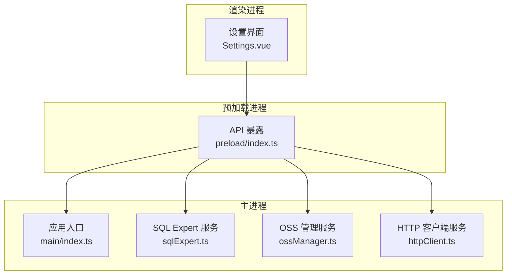
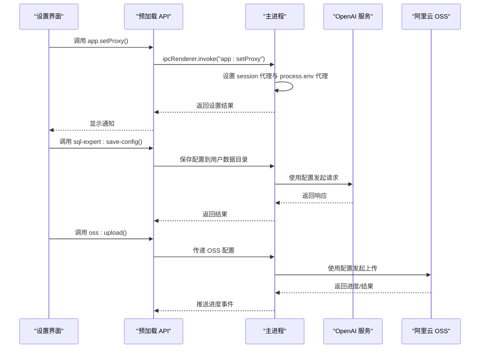
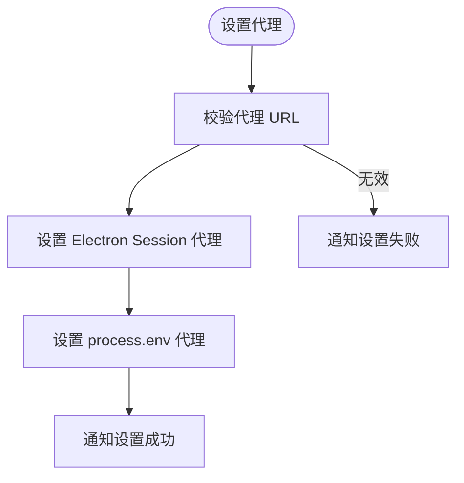
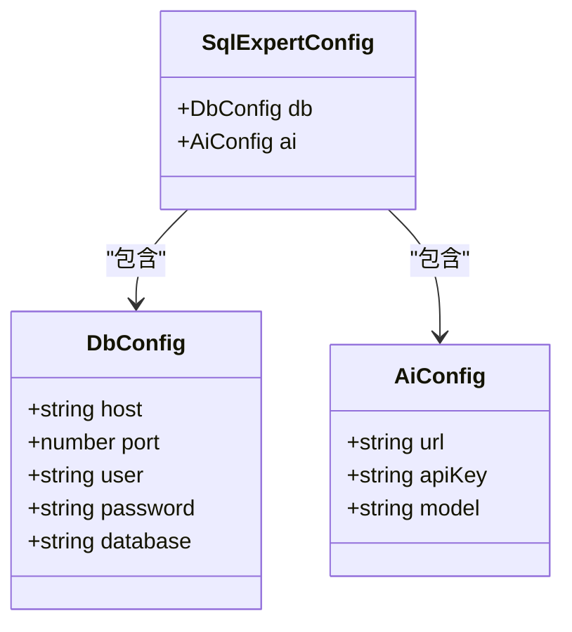
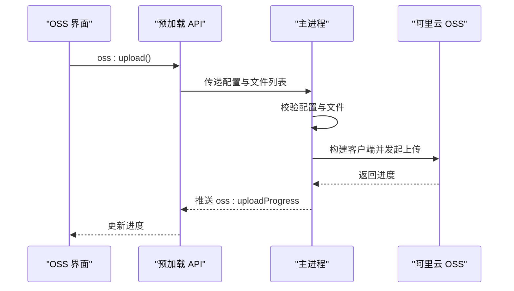
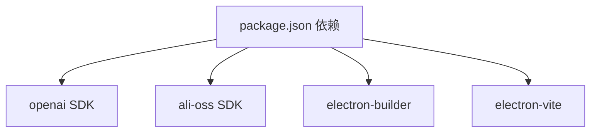

# 环境变量配置

<cite>
**本文档引用的文件**
- [package.json](file://package.json)
- [src/main/index.ts](file://src/main/index.ts)
- [src/main/services/ossManager.ts](file://src/main/services/ossManager.ts)
- [src/main/services/sqlExpert.ts](file://src/main/services/sqlExpert.ts)
- [src/main/services/httpClient.ts](file://src/main/services/httpClient.ts)
- [src/preload/index.ts](file://src/preload/index.ts)
- [src/preload/index.d.ts](file://src/preload/index.d.ts)
- [src/renderer/src/views/settings/Settings.vue](file://src/renderer/src/views/settings/Settings.vue)
- [README.md](file://README.md)
- [DEVELOPMENT.md](file://DEVELOPMENT.md)
</cite>

## 目录
1. [简介](#简介)
2. [项目结构](#项目结构)
3. [核心组件](#核心组件)
4. [架构概览](#架构概览)
5. [详细组件分析](#详细组件分析)
6. [依赖分析](#依赖分析)
7. [性能考虑](#性能考虑)
8. [故障排除指南](#故障排除指南)
9. [结论](#结论)
10. [附录](#附录)

## 简介
本指南面向开发者工具箱项目的环境变量配置，涵盖应用启动所需的关键环境变量、开发/生产模式切换、日志级别与调试模式配置，以及第三方服务（OpenAI API、阿里云 OSS）所需的配置项。文档还提供不同操作系统下的环境变量设置方法与安全存储最佳实践。

## 项目结构
开发者工具箱采用 Electron + Vue 3 + TypeScript 架构，分为渲染进程、预加载进程与主进程三层。环境变量主要影响以下方面：
- 应用启动与开发/生产模式
- 网络代理与更新检查
- 第三方服务认证与配置
- 平台特定行为（如 GPU 组合开关）

**图示来源**
- [src/renderer/src/views/settings/Settings.vue:1-145](file://src/renderer/src/views/settings/Settings.vue#L1-L145)
- [src/preload/index.ts:1-229](file://src/preload/index.ts#L1-L229)
- [src/main/index.ts:1-444](file://src/main/index.ts#L1-L444)
- [src/main/services/sqlExpert.ts:1-1503](file://src/main/services/sqlExpert.ts#L1-L1503)
- [src/main/services/ossManager.ts:1-440](file://src/main/services/ossManager.ts#L1-L440)
- [src/main/services/httpClient.ts:1-113](file://src/main/services/httpClient.ts#L1-L113)

**章节来源**
- [src/main/index.ts:1-444](file://src/main/index.ts#L1-L444)
- [src/preload/index.ts:1-229](file://src/preload/index.ts#L1-L229)
- [src/preload/index.d.ts:1-412](file://src/preload/index.d.ts#L1-L412)
- [src/renderer/src/views/settings/Settings.vue:1-145](file://src/renderer/src/views/settings/Settings.vue#L1-L145)

## 核心组件
本节概述与环境变量相关的三个核心组件及其配置要点：
- 应用入口与代理设置：主进程负责代理配置与更新检查，渲染进程通过预加载 API 与主进程通信。
- SQL Expert：依赖数据库连接与 OpenAI API 配置，配置持久化于用户数据目录。
- OSS 管理：依赖阿里云 OSS 的访问凭据与端点配置。

**章节来源**
- [src/main/index.ts:306-327](file://src/main/index.ts#L306-L327)
- [src/main/services/sqlExpert.ts:139-156](file://src/main/services/sqlExpert.ts#L139-L156)
- [src/main/services/ossManager.ts:14-34](file://src/main/services/ossManager.ts#L14-L34)

## 架构概览
环境变量在应用中的流转路径如下：
- 渲染进程通过预加载 API 调用主进程服务
- 主进程根据环境变量执行网络请求、代理设置与第三方服务调用
- 第三方服务（OpenAI、阿里云 OSS）的配置通过应用内设置或本地配置文件持久化

**图示来源**
- [src/renderer/src/views/settings/Settings.vue:1-145](file://src/renderer/src/views/settings/Settings.vue#L1-L145)
- [src/preload/index.ts:24-47](file://src/preload/index.ts#L24-L47)
- [src/main/index.ts:306-327](file://src/main/index.ts#L306-L327)
- [src/main/services/sqlExpert.ts:139-156](file://src/main/services/sqlExpert.ts#L139-L156)
- [src/main/services/ossManager.ts:334-438](file://src/main/services/ossManager.ts#L334-L438)

## 详细组件分析

### 应用启动与代理配置
- 开发/生产模式切换：通过主进程判断打包状态与环境变量决定加载方式。
- 代理设置：支持在应用设置中配置代理，主进程同时设置 Electron session 代理与 process.env 代理，确保更新检查与网络请求使用同一代理。
- 网络超时与错误处理：代理设置失败或网络异常时，应用会通过通知提示用户配置代理。

**图示来源**
- [src/main/index.ts:306-327](file://src/main/index.ts#L306-L327)
- [src/renderer/src/views/settings/Settings.vue:23-44](file://src/renderer/src/views/settings/Settings.vue#L23-L44)

**章节来源**
- [src/main/index.ts:306-327](file://src/main/index.ts#L306-L327)
- [src/renderer/src/views/settings/Settings.vue:1-145](file://src/renderer/src/views/settings/Settings.vue#L1-L145)

### SQL Expert 配置
- 数据库连接：需要 host、port、user、password、database 等配置，配置持久化于用户数据目录。
- AI 服务参数：需要 url、apiKey、model 等配置，配置持久化于用户数据目录。
- 配置加载与保存：应用启动时从本地文件读取配置，用户可在设置界面更新配置。

**图示来源**
- [src/main/services/sqlExpert.ts:14-31](file://src/main/services/sqlExpert.ts#L14-L31)
- [src/main/services/sqlExpert.ts:139-156](file://src/main/services/sqlExpert.ts#L139-L156)

**章节来源**
- [src/main/services/sqlExpert.ts:139-156](file://src/main/services/sqlExpert.ts#L139-L156)
- [README.md:122-129](file://README.md#L122-L129)

### OSS 上传配置
- 配置项：accessKeyId、accessKeySecret、endpoint、bucket、targetPath（可选）、acl（可选）。
- 客户端构建：根据 endpoint 自动推断 region、secure 与 cname 等参数。
- 上传流程：支持单文件与文件夹上传，支持进度事件与取消上传。

**图示来源**
- [src/main/services/ossManager.ts:14-34](file://src/main/services/ossManager.ts#L14-L34)
- [src/main/services/ossManager.ts:334-438](file://src/main/services/ossManager.ts#L334-L438)
- [src/preload/index.ts:118-154](file://src/preload/index.ts#L118-L154)

**章节来源**
- [src/main/services/ossManager.ts:14-34](file://src/main/services/ossManager.ts#L14-L34)
- [src/main/services/ossManager.ts:334-438](file://src/main/services/ossManager.ts#L334-L438)
- [README.md:131-139](file://README.md#L131-L139)

## 依赖分析
- 第三方依赖与环境变量关系：
  - OpenAI SDK：通过配置对象传入 apiKey 与 baseURL，无需额外环境变量。
  - ali-oss：通过配置对象传入 accessKeyId、accessKeySecret、endpoint、bucket，无需额外环境变量。
  - electron-builder：通过 package.json 中的 build 字段配置发布信息，与环境变量无关。
  - electron-vite：通过配置文件进行构建，与环境变量无关。

**图示来源**
- [package.json:28-51](file://package.json#L28-L51)

**章节来源**
- [package.json:28-51](file://package.json#L28-L51)

## 性能考虑
- 代理设置对网络性能的影响：合理的代理配置可提升更新检查与第三方服务请求的稳定性。
- SQL Expert 的并发与超时：数据库连接池与请求超时设置影响整体响应时间。
- OSS 上传的分片与并发：分片大小与并发数影响上传速度与稳定性。

## 故障排除指南
- 更新检查失败：多数为网络问题，先配置代理后重试。
- RunJS 包安装异常：检查 NPM 安装目录是否有写权限。
- 端口扫描慢或结果少：优先安装 nmap 提升扫描效果。
- SQL Expert 无法回答：先检查 DB 配置与 schema 是否加载成功，再检查 AI URL/API Key/Model 是否有效。

**章节来源**
- [DEVELOPMENT.md:344-346](file://DEVELOPMENT.md#L344-L346)
- [DEVELOPMENT.md:329-333](file://DEVELOPMENT.md#L329-L333)
- [DEVELOPMENT.md:334-338](file://DEVELOPMENT.md#L334-L338)
- [DEVELOPMENT.md:339-343](file://DEVELOPMENT.md#L339-L343)

## 结论
开发者工具箱的环境变量配置主要集中在应用代理设置、第三方服务配置与平台特定行为上。通过预加载 API 与主进程的协作，应用实现了灵活的配置管理与持久化。建议遵循安全存储最佳实践，避免在代码中硬编码敏感信息，并通过应用内设置或本地配置文件进行管理。

## 附录

### 环境变量清单与说明
- 应用代理设置
  - 作用：设置应用的网络代理，用于更新检查与网络请求。
  - 配置方式：通过设置界面输入代理 URL，应用内部同时设置 Electron session 代理与 process.env 代理。
  - 影响范围：所有网络请求与更新检查。
  - 参考路径：[src/main/index.ts:306-327](file://src/main/index.ts#L306-L327)、[src/renderer/src/views/settings/Settings.vue:23-44](file://src/renderer/src/views/settings/Settings.vue#L23-L44)

- 开发/生产模式切换
  - 作用：决定应用加载开发服务器还是本地 HTML。
  - 配置方式：通过 ELECTRON_RENDERER_URL 环境变量与 is.dev 判断。
  - 影响范围：开发环境热重载与生产环境打包。
  - 参考路径：[src/main/index.ts:169-173](file://src/main/index.ts#L169-L173)

- 平台特定行为
  - Windows GPU 组合开关：通过命令行参数禁用某些 GPU 功能以避免标题栏问题。
  - 参考路径：[src/main/index.ts:39-41](file://src/main/index.ts#L39-L41)

- 第三方服务配置
  - OpenAI API
    - 配置项：apiKey、baseURL、model
    - 配置位置：应用内设置界面，持久化至用户数据目录
    - 参考路径：[src/main/services/sqlExpert.ts:681-684](file://src/main/services/sqlExpert.ts#L681-L684)、[src/main/services/sqlExpert.ts:139-156](file://src/main/services/sqlExpert.ts#L139-L156)
  - 阿里云 OSS
    - 配置项：accessKeyId、accessKeySecret、endpoint、bucket、targetPath、acl
    - 配置位置：应用内 OSS 管理界面
    - 参考路径：[src/main/services/ossManager.ts:14-34](file://src/main/services/ossManager.ts#L14-L34)、[README.md:131-139](file://README.md#L131-L139)

### 不同操作系统下的环境变量设置方法
- Windows
  - 系统环境变量：通过“系统属性 → 高级 → 环境变量”添加或修改。
  - PowerShell：使用 $env:VARNAME=值 或 [Environment]::SetEnvironmentVariable("VARNAME","值","User")。
  - CMD：使用 set VARNAME=值。
  - 应用内设置：通过设置界面配置代理，应用会自动写入 process.env。
  - 参考路径：[src/main/index.ts:313-319](file://src/main/index.ts#L313-L319)、[src/renderer/src/views/settings/Settings.vue:23-44](file://src/renderer/src/views/settings/Settings.vue#L23-L44)

- macOS
  - 终端：使用 export VARNAME=值 或在 ~/.bashrc、~/.zshrc 中添加。
  - LaunchAgents/LaunchDaemons：通过 plist 文件设置环境变量。
  - 应用内设置：通过设置界面配置代理，应用会自动写入 process.env。
  - 参考路径：[src/main/index.ts:313-319](file://src/main/index.ts#L313-L319)、[src/renderer/src/views/settings/Settings.vue:23-44](file://src/renderer/src/views/settings/Settings.vue#L23-L44)

- Linux
  - Shell：使用 export VARNAME=值 或在 ~/.bashrc、~/.profile 中添加。
  - systemd：通过 Environment=VARNAME=值 设置。
  - 应用内设置：通过设置界面配置代理，应用会自动写入 process.env。
  - 参考路径：[src/main/index.ts:313-319](file://src/main/index.ts#L313-L319)、[src/renderer/src/views/settings/Settings.vue:23-44](file://src/renderer/src/views/settings/Settings.vue#L23-L44)

### 安全存储建议与最佳实践
- 避免硬编码：不要在代码中直接写入敏感信息，使用应用内设置或本地配置文件。
- 权限控制：确保用户数据目录与配置文件的读写权限仅限当前用户。
- 加密存储：对于高敏感配置，考虑加密存储并在运行时解密。
- 定期轮换：定期更换 API Key 与访问凭据，减少泄露风险。
- 审计日志：记录关键配置变更，便于审计与回溯。
- 参考路径：[DEVELOPMENT.md:249-265](file://DEVELOPMENT.md#L249-L265)