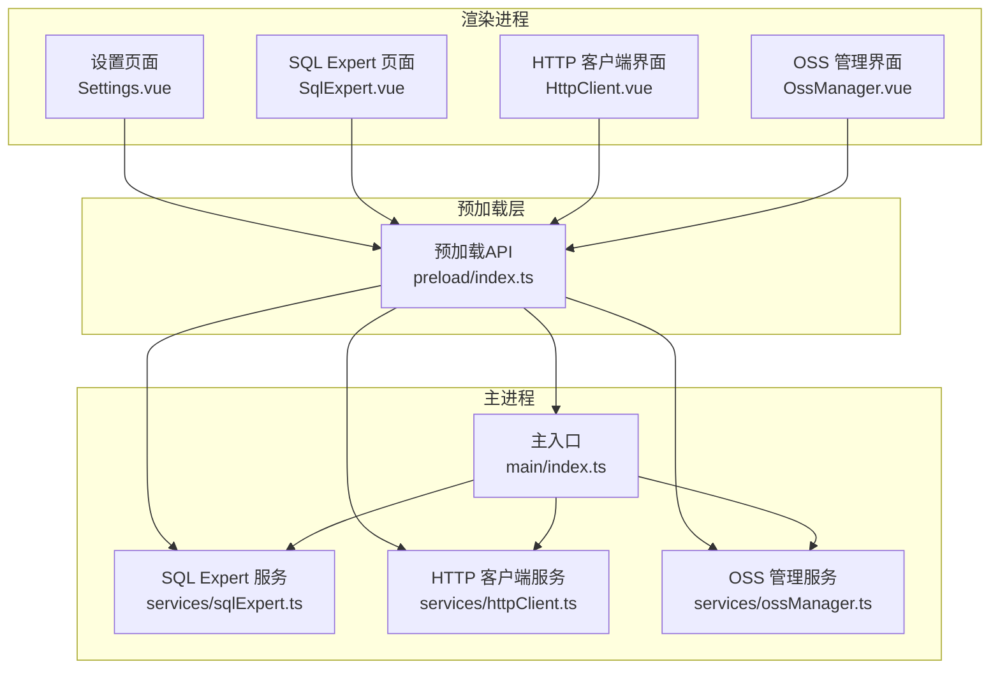
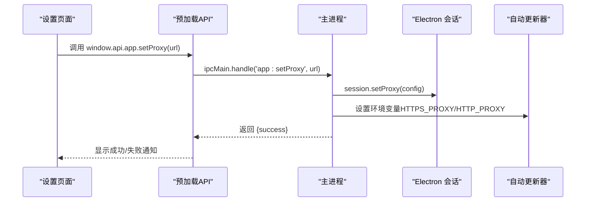
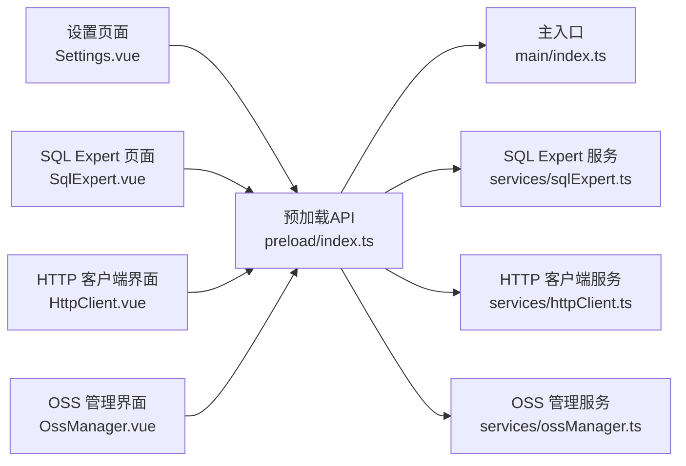

# 配置指南

<cite>
**本文档引用的文件**
- [src/main/index.ts](file://src/main/index.ts)
- [src/preload/index.ts](file://src/preload/index.ts)
- [src/renderer/src/views/settings/Settings.vue](file://src/renderer/src/views/settings/Settings.vue)
- [src/main/services/httpClient.ts](file://src/main/services/httpClient.ts)
- [src/main/services/sqlExpert.ts](file://src/main/services/sqlExpert.ts)
- [src/main/services/ossManager.ts](file://src/main/services/ossManager.ts)
- [package.json](file://package.json)
</cite>

## 目录
1. [简介](#简介)
2. [项目结构](#项目结构)
3. [核心组件](#核心组件)
4. [架构总览](#架构总览)
5. [详细组件分析](#详细组件分析)
6. [依赖关系分析](#依赖关系分析)
7. [性能考虑](#性能考虑)
8. [故障排除指南](#故障排除指南)
9. [结论](#结论)
10. [附录](#附录)

## 简介
本指南面向开发者工具箱的应用配置，涵盖代理设置、SQL Expert配置、OSS配置和HTTP客户端设置。文档详细说明配置文件位置、格式与修改方法，提供开发与生产环境的最佳实践、安全配置建议、配置验证方法、常见错误排查与解决方案，并给出配置模板与示例，帮助用户快速正确完成配置。

## 项目结构
应用采用Electron + Vue的架构，主进程负责系统集成与服务注册，渲染进程负责UI交互与用户配置界面。配置主要分为：
- 全局网络代理：通过主进程设置Electron会话代理，影响自动更新与HTTP请求
- SQL Expert：数据库连接与AI模型配置，持久化到用户数据目录
- OSS：阿里云OSS上传配置，通过IPC暴露给渲染进程
- HTTP客户端：主进程内核net模块封装，支持超时与错误处理

**图表来源**
- [src/main/index.ts:110-395](file://src/main/index.ts#L110-L395)
- [src/preload/index.ts:11-229](file://src/preload/index.ts#L11-L229)
- [src/renderer/src/views/settings/Settings.vue:1-116](file://src/renderer/src/views/settings/Settings.vue#L1-L116)

**章节来源**
- [src/main/index.ts:1-444](file://src/main/index.ts#L1-L444)
- [src/preload/index.ts:1-229](file://src/preload/index.ts#L1-L229)

## 核心组件
本节概述各配置组件及其职责：
- 代理设置：通过主进程设置Electron会话代理，同时设置环境变量影响自动更新
- HTTP客户端：主进程net请求封装，支持超时、错误处理与响应收集
- SQL Expert：数据库连接池、AI模型配置、Schema缓存、记忆文件持久化
- OSS：阿里云OSS客户端构建、分片上传、进度回调与取消机制

**章节来源**
- [src/main/index.ts:306-327](file://src/main/index.ts#L306-L327)
- [src/main/services/httpClient.ts:15-113](file://src/main/services/httpClient.ts#L15-L113)
- [src/main/services/sqlExpert.ts:139-170](file://src/main/services/sqlExpert.ts#L139-L170)
- [src/main/services/ossManager.ts:107-127](file://src/main/services/ossManager.ts#L107-L127)

## 架构总览
配置在应用中的流转如下：
- 渲染进程通过预加载桥接API调用主进程IPC接口
- 主进程执行具体配置操作（设置代理、注册服务、读写磁盘）
- 配置变更通过通知或事件反馈到渲染进程

**图表来源**
- [src/renderer/src/views/settings/Settings.vue:23-39](file://src/renderer/src/views/settings/Settings.vue#L23-L39)
- [src/preload/index.ts:30-31](file://src/preload/index.ts#L30-L31)
- [src/main/index.ts:306-327](file://src/main/index.ts#L306-L327)

## 详细组件分析

### 代理设置（网络）
- 配置入口：设置页面的“HTTP 代理”输入框，支持HTTP/HTTPS代理
- 存储方式：本地持久化到localStorage键名为'app_proxy_url'
- 应用方式：主进程通过Electron会话设置代理规则，并设置环境变量影响自动更新
- 验证方法：保存后立即应用，若网络异常会提示配置代理后重试

最佳实践：
- 开发环境：若需访问受限网络，配置本地代理（如127.0.0.1:7890）
- 生产环境：确保代理稳定可用，避免频繁超时
- 安全配置：代理URL应为可信地址，避免泄露敏感流量

常见问题与解决：
- 代理无效：检查代理URL格式与可达性，确认主进程已成功设置
- 自动更新失败：当出现超时/连接拒绝错误时，提示配置代理后重试

**章节来源**
- [src/renderer/src/views/settings/Settings.vue:9-44](file://src/renderer/src/views/settings/Settings.vue#L9-L44)
- [src/main/index.ts:306-327](file://src/main/index.ts#L306-L327)

### HTTP 客户端设置
- 接口：通过预加载API暴露window.api.httpClient.send
- 主进程实现：使用Electron net.request，支持自定义方法、URL、请求头、请求体与超时
- 错误处理：超时与网络错误分别返回状态码、错误信息与耗时
- 使用场景：绕过CORS限制，统一走主进程网络栈，便于代理与日志

最佳实践：
- 超时设置：根据目标服务稳定性调整timeout参数
- 请求头：避免携带Cookie等敏感头，遵循目标服务要求
- 错误恢复：结合代理设置与重试策略

**章节来源**
- [src/preload/index.ts:107-115](file://src/preload/index.ts#L107-L115)
- [src/main/services/httpClient.ts:15-113](file://src/main/services/httpClient.ts#L15-L113)

### SQL Expert 配置
- 配置结构：包含数据库连接与AI模型两部分
- 存储位置：用户数据目录下的sql-expert子目录，包含config.json、schema.txt与memories目录
- 服务注册：主进程注册测试连接、保存配置、加载配置、查询余额、加载/增删改查记忆、动态加载Schema等IPC接口
- 安全与隐私：API Key进行哈希处理，记忆文件按数据库与API Key组合命名，避免跨用户混淆

最佳实践：
- 开发环境：使用本地MySQL或测试库，确保连接参数正确
- 生产环境：API Key与数据库凭据通过安全渠道管理，定期轮换
- 性能优化：合理设置连接池大小与超时，避免长时间占用资源

**章节来源**
- [src/main/services/sqlExpert.ts:139-170](file://src/main/services/sqlExpert.ts#L139-L170)
- [src/main/services/sqlExpert.ts:968-1165](file://src/main/services/sqlExpert.ts#L968-L1165)

### OSS 配置
- 配置结构：包含AccessKey ID/Secret、Endpoint、Bucket、目标路径与ACL
- 客户端构建：根据Endpoint自动推断协议、区域与是否CNAME
- 上传流程：支持单文件与目录递归扫描，分片上传，进度回调，取消上传
- 错误处理：区分取消与失败，提供文件级错误汇总

最佳实践：
- Endpoint：优先使用官方域名或自定义CNAME，确保HTTPS
- ACL：默认public-read，按需调整为private或public-read-write
- 并发与分片：根据网络带宽调整并发数与分片大小

**章节来源**
- [src/main/services/ossManager.ts:14-34](file://src/main/services/ossManager.ts#L14-L34)
- [src/main/services/ossManager.ts:107-127](file://src/main/services/ossManager.ts#L107-L127)
- [src/main/services/ossManager.ts:334-438](file://src/main/services/ossManager.ts#L334-L438)

## 依赖关系分析
- Electron主进程负责系统级能力（托盘、自动更新、代理设置）
- 预加载层作为渲染进程与主进程之间的桥梁，暴露受控API
- 各服务模块通过IPC注册接口，供渲染进程调用

**图表来源**
- [src/preload/index.ts:11-229](file://src/preload/index.ts#L11-L229)
- [src/main/index.ts:1-444](file://src/main/index.ts#L1-L444)

**章节来源**
- [src/preload/index.ts:1-229](file://src/preload/index.ts#L1-L229)
- [src/main/index.ts:1-444](file://src/main/index.ts#L1-L444)

## 性能考虑
- 代理设置：代理延迟直接影响HTTP请求与自动更新速度，建议使用低延迟代理
- HTTP客户端：合理设置超时，避免阻塞UI线程
- SQL Expert：连接池大小与超时需平衡并发与资源占用
- OSS：分片大小与并发数需根据网络状况调整，避免拥塞

[本节为通用指导，无需特定文件引用]

## 故障排除指南
常见问题与排查步骤：
- 代理设置无效
  - 检查代理URL格式与可达性
  - 确认主进程已成功设置代理并应用到会话
  - 若自动更新报网络错误，提示配置代理后重试
- HTTP请求超时或失败
  - 调整timeout参数
  - 检查目标服务状态与CORS策略
- SQL Expert连接失败
  - 校验数据库连接参数与网络连通性
  - 使用测试连接功能验证
- OSS上传失败
  - 检查AccessKey与Endpoint配置
  - 查看进度回调中的错误信息，定位具体文件
  - 必要时取消任务并重试

**章节来源**
- [src/main/index.ts:140-157](file://src/main/index.ts#L140-L157)
- [src/main/services/httpClient.ts:38-50](file://src/main/services/httpClient.ts#L38-L50)
- [src/main/services/sqlExpert.ts:970-991](file://src/main/services/sqlExpert.ts#L970-L991)
- [src/main/services/ossManager.ts:334-438](file://src/main/services/ossManager.ts#L334-L438)

## 结论
本指南提供了开发者工具箱的完整配置方案，覆盖代理、HTTP客户端、SQL Expert与OSS四大模块。通过明确的配置位置、格式与修改方法，结合最佳实践与故障排除建议，用户可快速完成正确配置并稳定运行应用。

[本节为总结，无需特定文件引用]

## 附录

### 配置文件位置与格式
- 代理设置
  - 存储：localStorage键名为'app_proxy_url'
  - 应用：主进程Electron会话代理与环境变量HTTPS_PROXY/HTTP_PROXY
- SQL Expert
  - 配置文件：用户数据目录/sql-expert/config.json
  - Schema文件：用户数据目录/sql-expert/schema.txt
  - 记忆文件：用户数据目录/sql-expert/memories/{scope}.json
- OSS
  - 配置项：AccessKey ID/Secret、Endpoint、Bucket、目标路径、ACL

**章节来源**
- [src/renderer/src/views/settings/Settings.vue:10-33](file://src/renderer/src/views/settings/Settings.vue#L10-L33)
- [src/main/index.ts:306-327](file://src/main/index.ts#L306-L327)
- [src/main/services/sqlExpert.ts:139-170](file://src/main/services/sqlExpert.ts#L139-L170)
- [src/main/services/ossManager.ts:14-34](file://src/main/services/ossManager.ts#L14-L34)

### 配置模板与示例
- 代理设置
  - 示例：http://127.0.0.1:7890
  - 注意：支持HTTP/HTTPS代理，留空表示不使用代理
- SQL Expert 配置（config.json）
  - 结构要点：db.host/db.port/db.user/db.password/db.database；ai.url/ai.apiKey/ai.model
  - 说明：配置变更后会重建连接池
- OSS 配置
  - 结构要点：accessKeyId/accessKeySecret/endpoint/bucket/targetPath/acl
  - 说明：Endpoint可为域名或带协议的URL，自动推断区域与CNAME

**章节来源**
- [src/renderer/src/views/settings/Settings.vue:94-103](file://src/renderer/src/views/settings/Settings.vue#L94-L103)
- [src/main/services/sqlExpert.ts:139-170](file://src/main/services/sqlExpert.ts#L139-L170)
- [src/main/services/ossManager.ts:14-34](file://src/main/services/ossManager.ts#L14-L34)