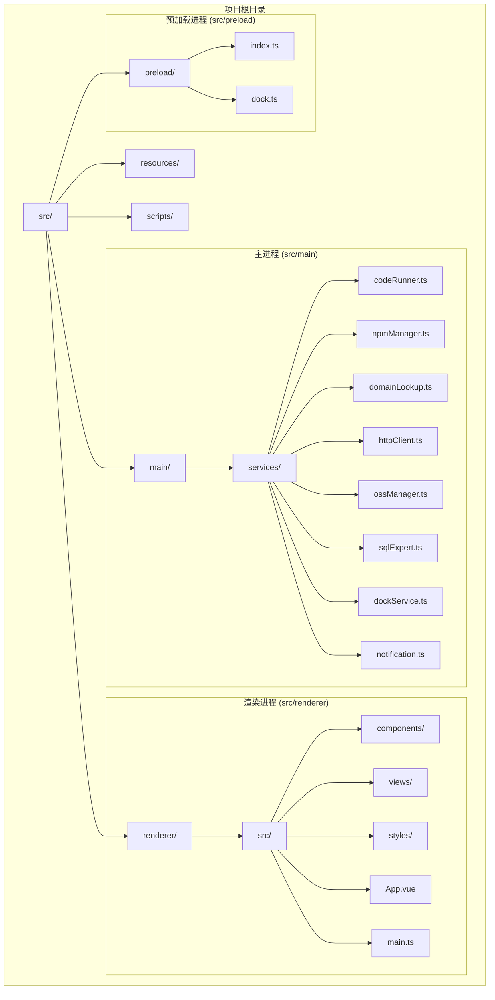
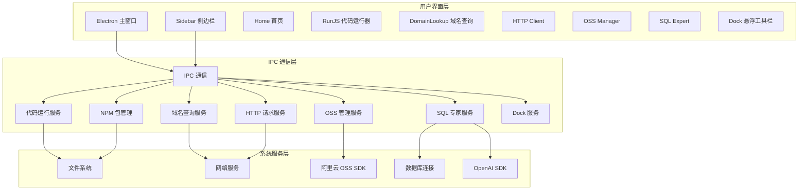
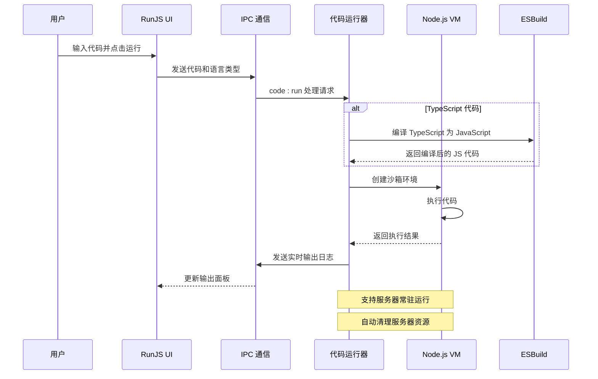
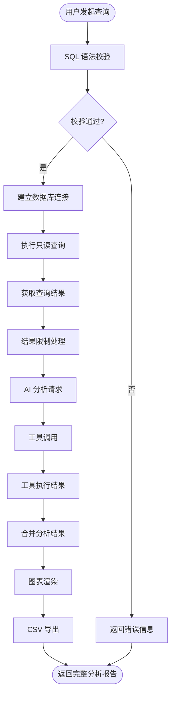
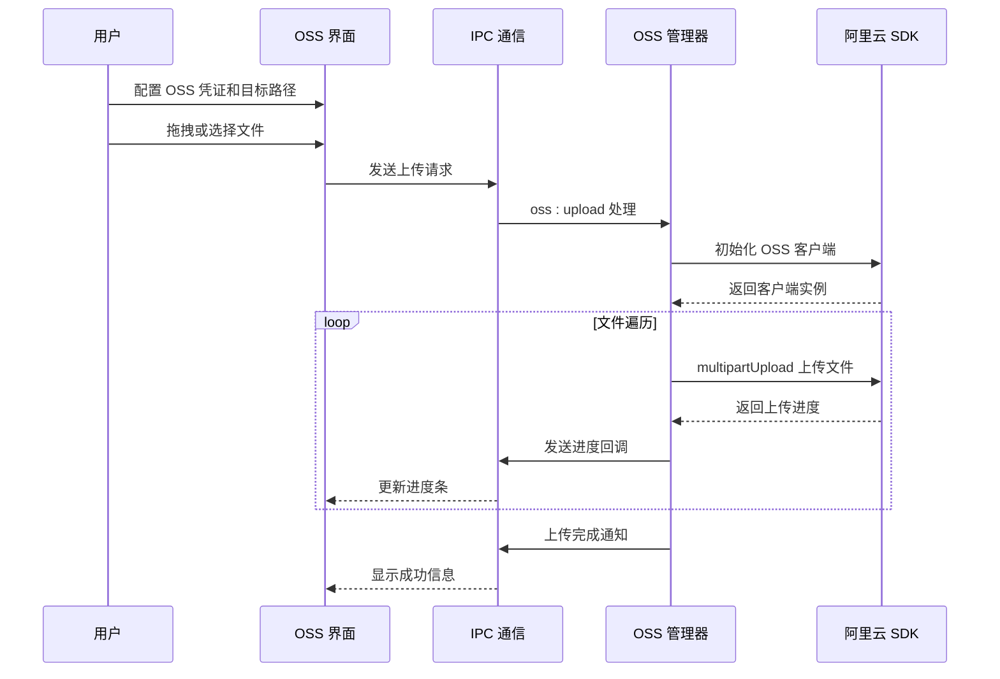
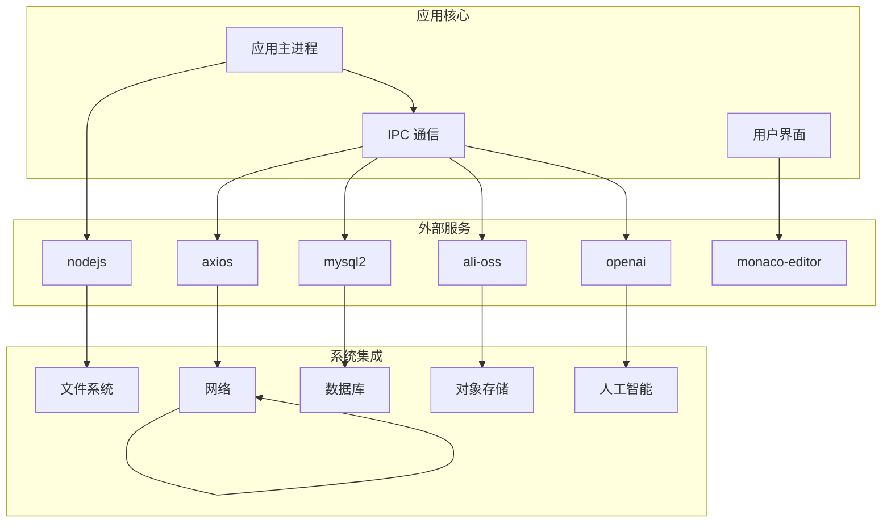

# 功能模块总览

<cite>
**本文档引用的文件**
- [package.json](file://package.json)
- [README.md](file://README.md)
- [src/main/index.ts](file://src/main/index.ts)
- [src/renderer/src/App.vue](file://src/renderer/src/App.vue)
- [src/renderer/src/views/home/Home.vue](file://src/renderer/src/views/home/Home.vue)
- [src/main/services/codeRunner.ts](file://src/main/services/codeRunner.ts)
- [src/main/services/npmManager.ts](file://src/main/services/npmManager.ts)
- [src/main/services/domainLookup.ts](file://src/main/services/domainLookup.ts)
- [src/main/services/httpClient.ts](file://src/main/services/httpClient.ts)
- [src/main/services/ossManager.ts](file://src/main/services/ossManager.ts)
- [src/main/services/sqlExpert.ts](file://src/main/services/sqlExpert.ts)
- [src/main/services/dockService.ts](file://src/main/services/dockService.ts)
- [src/main/services/notification.ts](file://src/main/services/notification.ts)
- [src/renderer/src/components/Sidebar.vue](file://src/renderer/src/components/Sidebar.vue)
- [src/renderer/src/views/runjs/RunJS.vue](file://src/renderer/src/views/runjs/RunJS.vue)
- [src/renderer/src/views/domainlookup/DomainLookup.vue](file://src/renderer/src/views/domainlookup/DomainLookup.vue)
- [src/renderer/src/views/httpclient/HttpClient.vue](file://src/renderer/src/views/httpclient/HttpClient.vue)
- [src/renderer/src/views/oss/OssManager.vue](file://src/renderer/src/views/oss/OssManager.vue)
</cite>

## 目录
1. [项目简介](#项目简介)
2. [项目结构](#项目结构)
3. [核心功能模块](#核心功能模块)
4. [架构概览](#架构概览)
5. [详细组件分析](#详细组件分析)
6. [依赖关系分析](#依赖关系分析)
7. [性能考虑](#性能考虑)
8. [故障排除指南](#故障排除指南)
9. [结论](#结论)

## 项目简介

开发者工具箱是一个基于 Electron + Vue 3 + TypeScript 的桌面开发工具集合，专注于日常开发与运维场景。该项目将多种高频能力集中在单一客户端中，提供一体化的开发工具体验。

### 主要特性
- **跨平台桌面应用**：基于 Electron 构建，支持 Windows、macOS 和 Linux
- **现代化技术栈**：Vue 3 + TypeScript + TailwindCSS + DaisyUI
- **模块化设计**：8个独立功能模块，可按需使用
- **企业级功能**：包含 SQL 分析专家、OSS 管理等高级工具

## 项目结构

**图表来源**
- [src/main/index.ts:1-444](file://src/main/index.ts#L1-L444)
- [src/renderer/src/App.vue:1-102](file://src/renderer/src/App.vue#L1-L102)

**章节来源**
- [package.json:1-120](file://package.json#L1-L120)
- [README.md:140-163](file://README.md#L140-L163)

## 核心功能模块

### RunJS 代码运行器
**核心能力**
- 支持 JavaScript/TypeScript 代码实时运行
- 集成 Monaco Editor 代码编辑器
- 实时输出日志（stdout/stderr）
- 支持常驻服务代码（如 Express）运行
- 内置服务器资源清理机制
- 端口终止功能（按端口终止 Electron 相关进程）

**使用价值**
- 开发调试利器，无需额外环境配置
- 支持复杂服务的快速原型验证
- 内置包管理集成，便于依赖管理

### NPM 包管理
**核心能力**
- 包搜索、安装、卸载、版本切换
- 可配置的包安装目录
- 类型定义文件读取（.d.ts）
- 自动类型补全（@types/*）

**使用价值**
- 集中式包管理，避免全局污染
- 开发环境隔离，便于版本控制
- 类型支持完善，提升开发体验

### 域名/IP 查询
**核心能力**
- DNS 解析（IPv4/IPv6）
- IP 地理位置与运营商信息
- 反向 DNS 查询
- HTTP 头分析识别技术栈
- 端口扫描（支持 nmap 和 Socket 方案）

**使用价值**
- 网络诊断和监控
- 安全审计和威胁情报
- 基础设施分析和优化

### HTTP 请求工具
**核心能力**
- 支持常见 HTTP 方法
- 自定义 Header/Body/Timeout
- Electron 主进程发请求，规避 CORS 限制
- 请求历史记录管理

**使用价值**
- API 测试和调试
- 跨域请求解决方案
- 请求性能分析

### OSS 管理
**核心能力**
- 阿里云 OSS 文件/文件夹上传
- 多文件上传进度跟踪
- 上传任务取消支持
- 断点续传和并发上传

**使用价值**
- 云端存储管理
- 批量文件传输
- 企业级文件管理

### SQL Expert 分析专家
**核心能力**
- MySQL 连接测试与配置持久化
- 动态读取表结构（Schema）
- 只读 SQL 校验与执行
- AI 大模型集成分析
- 图表渲染和 CSV 导出

**使用价值**
- 数据库查询优化
- SQL 代码审查
- 数据可视化分析
- 智能查询助手

### Dock 悬浮工具栏
**核心能力**
- 独立透明悬浮窗口，始终置顶
- 支持底部/左侧/右侧停靠
- 自定义应用项、拖拽排序、快捷动作
- 系统集成（打开文件管理器、终端、浏览器等）

**使用价值**
- 快速工具访问
- 提升工作效率
- 个性化工作流定制

### 应用级能力
**核心能力**
- 自动更新（GitHub Releases）
- 系统托盘最小化
- 关闭行为可配置（询问/最小化/退出）
- 代理配置
- 开机自启动

**使用价值**
- 无缝用户体验
- 系统集成优化
- 企业部署便利

## 架构概览

**图表来源**
- [src/main/index.ts:422-429](file://src/main/index.ts#L422-L429)
- [src/renderer/src/App.vue:11-29](file://src/renderer/src/App.vue#L11-L29)

## 详细组件分析

### RunJS 代码运行器架构

**图表来源**
- [src/main/services/codeRunner.ts:99-246](file://src/main/services/codeRunner.ts#L99-L246)
- [src/renderer/src/views/runjs/RunJS.vue:152-181](file://src/renderer/src/views/runjs/RunJS.vue#L152-L181)

**章节来源**
- [src/main/services/codeRunner.ts:1-461](file://src/main/services/codeRunner.ts#L1-L461)
- [src/renderer/src/views/runjs/RunJS.vue:1-353](file://src/renderer/src/views/runjs/RunJS.vue#L1-L353)

### SQL Expert 分析专家流程

**图表来源**
- [src/main/services/sqlExpert.ts:268-400](file://src/main/services/sqlExpert.ts#L268-L400)
- [src/main/services/sqlExpert.ts:836-951](file://src/main/services/sqlExpert.ts#L836-L951)

**章节来源**
- [src/main/services/sqlExpert.ts:1-1503](file://src/main/services/sqlExpert.ts#L1-L1503)

### OSS 上传管理流程

**图表来源**
- [src/main/services/ossManager.ts:334-438](file://src/main/services/ossManager.ts#L334-L438)
- [src/renderer/src/views/oss/OssManager.vue:220-248](file://src/renderer/src/views/oss/OssManager.vue#L220-L248)

**章节来源**
- [src/main/services/ossManager.ts:1-440](file://src/main/services/ossManager.ts#L1-L440)
- [src/renderer/src/views/oss/OssManager.vue:1-913](file://src/renderer/src/views/oss/OssManager.vue#L1-L913)

## 依赖关系分析

### 核心依赖关系图

**图表来源**
- [package.json:28-51](file://package.json#L28-L51)
- [src/main/index.ts:1-444](file://src/main/index.ts#L1-L444)

### 模块间协作关系

| 模块 | 依赖模块 | 协作方式 | 数据流向 |
|------|----------|----------|----------|
| RunJS | NPM Manager | 代码执行依赖包管理 | 代码 → 运行器 → 包管理 |
| SQL Expert | 数据库连接 | 查询执行和分析 | 用户查询 → AI 分析 → 结果返回 |
| Domain Lookup | 网络服务 | DNS 解析和端口扫描 | 域名/IP → 网络查询 → 结果展示 |
| HTTP Client | 网络服务 | 请求发送和响应处理 | 请求配置 → 主进程请求 → 响应返回 |
| OSS Manager | 对象存储 | 文件上传和管理 | 本地文件 → OSS SDK → 云端存储 |
| Dock Service | 系统集成 | 系统托盘和窗口管理 | 用户操作 → 系统调用 → 界面反馈 |

**章节来源**
- [src/main/services/npmManager.ts:207-552](file://src/main/services/npmManager.ts#L207-L552)
- [src/main/services/sqlExpert.ts:968-1503](file://src/main/services/sqlExpert.ts#L968-L1503)
- [src/main/services/domainLookup.ts:679-689](file://src/main/services/domainLookup.ts#L679-L689)
- [src/main/services/httpClient.ts:15-113](file://src/main/services/httpClient.ts#L15-L113)
- [src/main/services/ossManager.ts:296-440](file://src/main/services/ossManager.ts#L296-L440)
- [src/main/services/dockService.ts:111-243](file://src/main/services/dockService.ts#L111-L243)

## 性能考虑

### 代码运行器性能优化
- **沙箱隔离**：使用 Node.js VM 创建安全的执行环境
- **内存管理**：自动清理服务器资源，防止内存泄漏
- **超时控制**：30秒执行超时保护
- **并发控制**：支持多文件并行处理

### SQL Expert 性能策略
- **连接池管理**：mysql2 连接池，最大5个连接
- **结果限制**：默认只返回10行样例数据
- **查询超时**：60秒查询超时保护
- **缓存机制**：Schema 结果缓存减少重复查询

### OSS 上传优化
- **分片上传**：5MB 分片大小，支持断点续传
- **并发控制**：4个并发上传任务
- **进度跟踪**：精确的上传进度反馈
- **错误恢复**：支持取消和重试机制

## 故障排除指南

### 常见问题及解决方案

**代码运行器问题**
- **问题**：代码无法执行或报错
- **原因**：依赖包未安装或版本冲突
- **解决**：使用 NPM 管理器安装缺失的包

**SQL Expert 连接问题**
- **问题**：数据库连接失败
- **原因**：连接信息错误或网络问题
- **解决**：检查数据库配置和网络连通性

**OSS 上传失败**
- **问题**：文件上传中断或失败
- **原因**：网络不稳定或权限不足
- **解决**：检查 OSS 凭证和网络连接

**章节来源**
- [src/main/services/notification.ts:1-29](file://src/main/services/notification.ts#L1-L29)
- [src/main/services/sqlExpert.ts:970-991](file://src/main/services/sqlExpert.ts#L970-L991)
- [src/main/services/ossManager.ts:297-311](file://src/main/services/ossManager.ts#L297-L311)

## 结论

开发者工具箱项目通过模块化设计实现了功能的高内聚、低耦合。8个核心功能模块各司其职，既可独立使用，又能协同工作，为开发者提供了完整的工具链解决方案。

### 主要优势
- **统一界面**：8个功能模块共享一致的 UI 设计语言
- **模块化架构**：便于维护和功能扩展
- **企业级特性**：支持代理、自动更新、系统集成等企业需求
- **性能优化**：针对不同模块特点进行了专门的性能优化

### 技术亮点
- **Electron + Vue 3**：现代桌面应用开发框架
- **TypeScript 类型安全**：提升代码质量和开发效率
- **IPC 通信**：主进程与渲染进程的安全通信
- **模块化服务**：独立的服务模块便于测试和维护

该工具箱为开发者提供了一站式的开发工具解决方案，通过合理的架构设计和性能优化，能够满足从个人开发者到企业团队的各种使用场景。