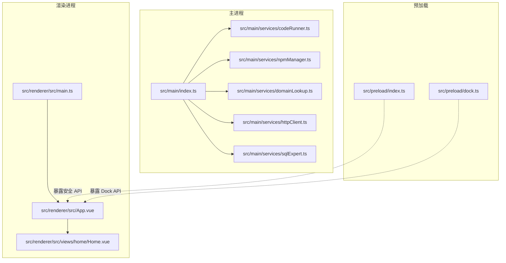
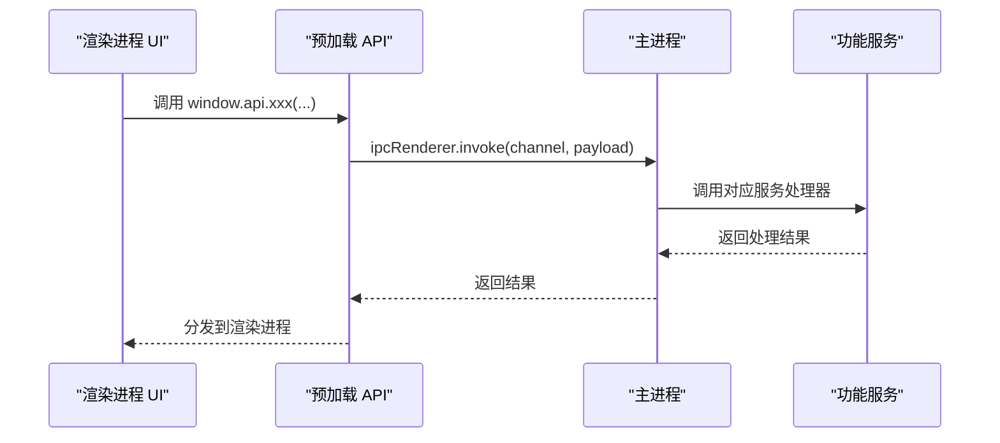
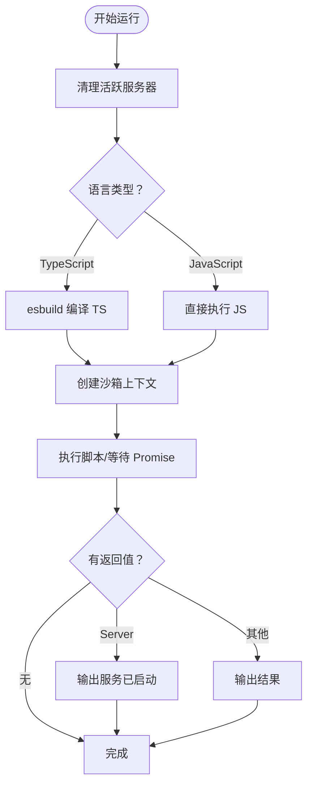
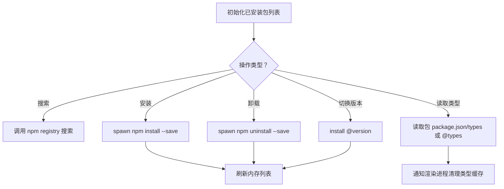
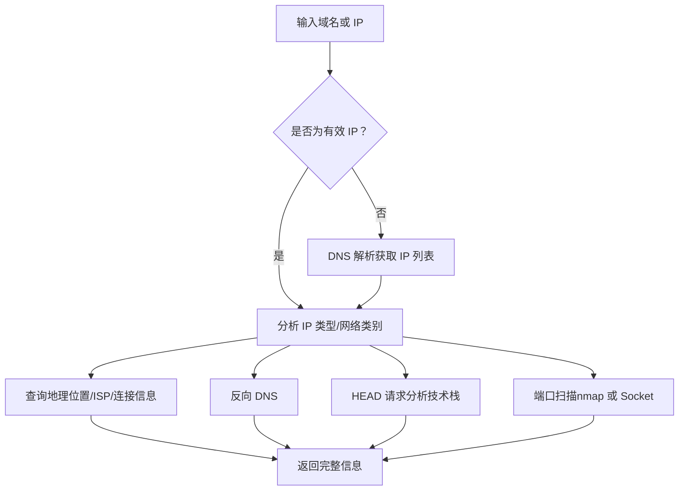
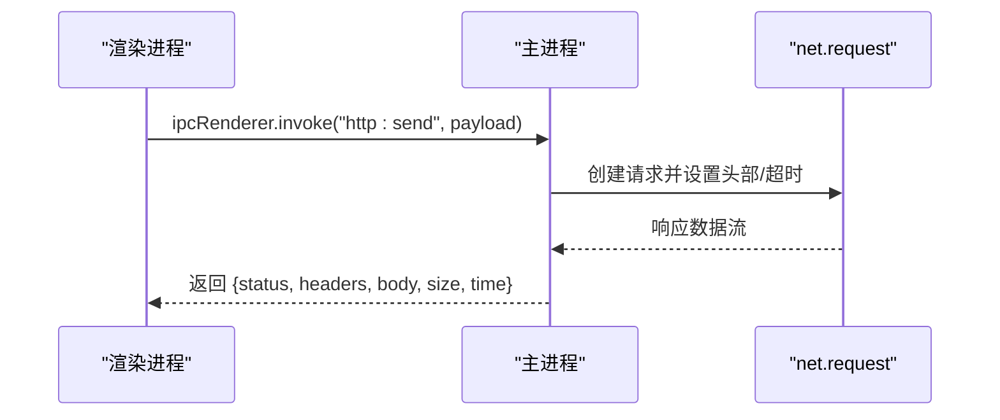
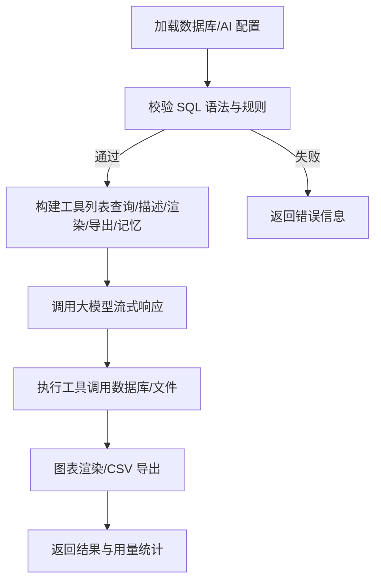

# 快速开始

<cite>
**本文引用的文件**   
- [package.json](file://package.json)
- [README.md](file://README.md)
- [electron.vite.config.ts](file://electron.vite.config.ts)
- [src/main/index.ts](file://src/main/index.ts)
- [src/main/services/codeRunner.ts](file://src/main/services/codeRunner.ts)
- [src/main/services/npmManager.ts](file://src/main/services/npmManager.ts)
- [src/main/services/domainLookup.ts](file://src/main/services/domainLookup.ts)
- [src/main/services/httpClient.ts](file://src/main/services/httpClient.ts)
- [src/main/services/sqlExpert.ts](file://src/main/services/sqlExpert.ts)
- [src/renderer/src/main.ts](file://src/renderer/src/main.ts)
- [src/renderer/src/App.vue](file://src/renderer/src/App.vue)
- [src/renderer/src/views/home/Home.vue](file://src/renderer/src/views/home/Home.vue)
- [tsconfig.json](file://tsconfig.json)
- [tsconfig.node.json](file://tsconfig.node.json)
- [tsconfig.web.json](file://tsconfig.web.json)
</cite>

## 目录
1. [简介](#简介)
2. [项目结构](#项目结构)
3. [核心组件](#核心组件)
4. [架构总览](#架构总览)
5. [详细组件分析](#详细组件分析)
6. [依赖分析](#依赖分析)
7. [性能考虑](#性能考虑)
8. [故障排查指南](#故障排查指南)
9. [结论](#结论)
10. [附录](#附录)

## 简介
本指南面向首次接触“开发者工具箱”的开发者，帮助你在约 30 分钟内完成环境准备、安装依赖、启动开发环境、体验核心功能，并掌握常用命令与构建流程。项目采用 Electron + Vue 3 + TypeScript 技术栈，提供代码运行器、NPM 包管理、域名/IP 查询、HTTP 请求调试、OSS 管理、SQL 分析助手、Dock 悬浮工具栏等实用能力。

## 项目结构
项目采用“主进程 + 渲染进程 + 预加载桥接”的分层组织方式，配合 electron-vite/Vite 进行构建与开发热更新。主要目录与职责如下：
- src/main：Electron 主进程与 IPC 服务，包含各功能模块的服务实现
- src/preload：预加载脚本，提供安全可控的渲染进程 API
- src/renderer：Vue 渲染进程，包含页面视图、组件与样式
- scripts：版本号等辅助脚本
- resources：图标与资源文件
- electron.vite.config.ts：主/预加载/渲染三入口配置与别名

**图表来源**
- [src/main/index.ts:1-444](file://src/main/index.ts#L1-L444)
- [src/main/services/codeRunner.ts:1-461](file://src/main/services/codeRunner.ts#L1-L461)
- [src/main/services/npmManager.ts:1-635](file://src/main/services/npmManager.ts#L1-L635)
- [src/main/services/domainLookup.ts:1-690](file://src/main/services/domainLookup.ts#L1-L690)
- [src/main/services/httpClient.ts:1-113](file://src/main/services/httpClient.ts#L1-L113)
- [src/main/services/sqlExpert.ts:1-800](file://src/main/services/sqlExpert.ts#L1-L800)
- [src/preload/index.ts:1-200](file://src/preload/index.ts#L1-L200)
- [src/preload/dock.ts:1-200](file://src/preload/dock.ts#L1-L200)
- [src/renderer/src/main.ts:1-6](file://src/renderer/src/main.ts#L1-L6)
- [src/renderer/src/App.vue:1-102](file://src/renderer/src/App.vue#L1-L102)
- [src/renderer/src/views/home/Home.vue:1-220](file://src/renderer/src/views/home/Home.vue#L1-L220)

**章节来源**
- [README.md:86-114](file://README.md#L86-L114)
- [electron.vite.config.ts:1-49](file://electron.vite.config.ts#L1-L49)
- [package.json:12-27](file://package.json#L12-L27)

## 核心组件
- 代码运行器（RunJS）：支持 JS/TS 运行、实时日志、服务器资源清理、端口终止
- NPM 包管理：搜索、安装、卸载、切换版本、类型定义读取与自动补全
- 域名/IP 查询：DNS 解析、地理位置/ISP、反向 DNS、HTTP 头技术栈识别、端口扫描（优先 nmap，否则 Socket 回退）
- HTTP 请求工具：主进程发起请求，规避前端 CORS 限制，支持超时与头部/体自定义
- OSS 管理：阿里云 OSS 文件/文件夹上传、多文件进度跟踪、支持取消
- SQL 分析助手：MySQL 连接测试与配置持久化、动态读取表结构、只读 SQL 校验与执行、接入大模型进行多轮工具调用分析、图表渲染与 CSV 导出
- Dock 模块：独立透明悬浮窗口，支持停靠位置与应用项自定义
- 应用级能力：自动更新（GitHub Releases）、系统托盘、关闭行为配置、代理设置、开机自启动

**章节来源**
- [README.md:17-75](file://README.md#L17-L75)

## 架构总览
下图展示了从用户操作到主进程服务的典型调用链，以及渲染进程与主进程之间的 IPC 交互。

**图表来源**
- [src/main/index.ts:420-434](file://src/main/index.ts#L420-L434)
- [src/main/services/codeRunner.ts:98-246](file://src/main/services/codeRunner.ts#L98-L246)
- [src/main/services/npmManager.ts:207-361](file://src/main/services/npmManager.ts#L207-L361)
- [src/main/services/domainLookup.ts:679-689](file://src/main/services/domainLookup.ts#L679-L689)
- [src/main/services/httpClient.ts:15-112](file://src/main/services/httpClient.ts#L15-L112)
- [src/main/services/sqlExpert.ts:1-800](file://src/main/services/sqlExpert.ts#L1-L800)

## 详细组件分析

### 代码运行器（RunJS）
- 支持 TypeScript 编译与运行、ESM 模块安全加载、内置模块白名单、自定义 require 与包目录解析
- 全局劫持 http/https/net 模块，追踪并可清理服务器实例，避免端口占用
- 提供“停止”与“清理”IPC 接口，支持按端口终止 Electron 相关进程

**图表来源**
- [src/main/services/codeRunner.ts:98-246](file://src/main/services/codeRunner.ts#L98-L246)

**章节来源**
- [src/main/services/codeRunner.ts:1-461](file://src/main/services/codeRunner.ts#L1-L461)

### NPM 包管理
- 默认安装目录位于用户数据目录下的 npm_packages，支持自定义目录与权限校验
- 提供搜索、安装、卸载、版本切换、类型定义读取与自动补全 @types 包
- 使用子进程调用 npm，带超时与错误处理

**图表来源**
- [src/main/services/npmManager.ts:207-552](file://src/main/services/npmManager.ts#L207-L552)

**章节来源**
- [src/main/services/npmManager.ts:1-635](file://src/main/services/npmManager.ts#L1-L635)

### 域名/IP 查询
- 支持域名解析（IPv4/IPv6）、反向 DNS、IP 地理位置与 ISP、HTTP 头技术栈识别
- 端口扫描优先使用 nmap，未安装则回退到 Socket 扫描，支持并发与超时控制

**图表来源**
- [src/main/services/domainLookup.ts:607-666](file://src/main/services/domainLookup.ts#L607-L666)

**章节来源**
- [src/main/services/domainLookup.ts:1-690](file://src/main/services/domainLookup.ts#L1-L690)

### HTTP 请求工具
- 在主进程使用 net.request 发起请求，自动应用代理设置，支持超时、头部与请求体
- 返回状态码、响应头、正文、大小与耗时

**图表来源**
- [src/main/services/httpClient.ts:15-112](file://src/main/services/httpClient.ts#L15-L112)

**章节来源**
- [src/main/services/httpClient.ts:1-113](file://src/main/services/httpClient.ts#L1-L113)

### SQL 分析助手
- 校验只读 SQL（SELECT/WITH），禁止系统库访问与通配列，强制列别名
- 通过工具函数与大模型进行多轮对话：查询表结构、执行只读 SQL、渲染图表、导出 CSV、保存记忆
- 连接池管理、配置持久化、内存记忆文件

**图表来源**
- [src/main/services/sqlExpert.ts:365-400](file://src/main/services/sqlExpert.ts#L365-L400)
- [src/main/services/sqlExpert.ts:473-572](file://src/main/services/sqlExpert.ts#L473-L572)
- [src/main/services/sqlExpert.ts:653-739](file://src/main/services/sqlExpert.ts#L653-L739)

**章节来源**
- [src/main/services/sqlExpert.ts:1-800](file://src/main/services/sqlExpert.ts#L1-L800)

## 依赖分析
- 构建与开发：electron-vite、vite、vue、@vitejs/plugin-vue、tailwindcss、@tailwindcss/vite
- 运行时：electron、@electron-toolkit/preload、@electron-toolkit/utils、electron-updater、auto-launch
- 功能依赖：axios、monaco-editor、mysql2、openai、ali-oss、lodash、highlight.js、echarts、uuid、dayjs、exceljs、dompurify、markdown-it、esbuild
- 类型检查：typescript、vue-tsc、@types/node、@types/uuid 等

**章节来源**
- [package.json:28-73](file://package.json#L28-L73)
- [tsconfig.json:1-8](file://tsconfig.json#L1-L8)
- [tsconfig.node.json:1-19](file://tsconfig.node.json#L1-L19)
- [tsconfig.web.json:1-18](file://tsconfig.web.json#L1-L18)

## 性能考虑
- 代码运行器对大型对象与数组输出进行截断与格式化，避免 UI 卡顿
- NPM 安装/卸载/切换版本均设置超时，避免长时间阻塞
- HTTP 请求工具支持超时与中断，防止长时间挂起
- SQL 分析助手限制工具返回行数与导出 CSV，避免大数据量导致内存压力
- 端口扫描优先使用 nmap，未安装时采用并发 Socket 扫描，兼顾速度与覆盖度

[本节为通用性能建议，无需特定文件引用]

## 故障排查指南
- 安装依赖失败（网络/镜像）
  - 现象：npm install 报错或卡住
  - 处理：项目默认使用国内镜像源，若仍失败，可在系统环境变量中设置代理或更换镜像源；确保网络可达
  - 参考：NPM 安装命令与镜像配置
  - 章节来源
    - [package.json:22-22](file://package.json#L22-L22)
    - [src/main/services/npmManager.ts:154-194](file://src/main/services/npmManager.ts#L154-L194)

- 端口占用导致服务无法启动
  - 现象：RunJS 启动服务失败或端口被占用
  - 处理：使用“清理资源”或“按端口终止 Electron 进程”，确保端口释放
  - 章节来源
    - [src/main/services/codeRunner.ts:237-318](file://src/main/services/codeRunner.ts#L237-L318)

- 代理设置无效
  - 现象：更新检查或网络请求失败
  - 处理：在应用设置中配置代理，或通过预加载 API 设置；重启应用使代理生效
  - 章节来源
    - [src/main/index.ts:306-327](file://src/main/index.ts#L306-L327)
    - [README.md:118-120](file://README.md#L118-L120)

- nmap 未安装导致端口扫描受限
  - 现象：端口扫描范围有限或回退到 Socket 扫描
  - 处理：安装 nmap 以获得更全面的扫描能力
  - 章节来源
    - [src/main/services/domainLookup.ts:388-395](file://src/main/services/domainLookup.ts#L388-L395)
    - [src/main/services/domainLookup.ts:587-602](file://src/main/services/domainLookup.ts#L587-L602)

- SQL 语法校验失败
  - 现象：提示仅允许只读查询、禁止 SELECT *、必须使用 AS 别名等
  - 处理：按照提示修正 SQL，确保使用 SELECT/WITH 且为每列指定别名
  - 章节来源
    - [src/main/services/sqlExpert.ts:365-400](file://src/main/services/sqlExpert.ts#L365-L400)

## 结论
通过本快速开始指南，你可以在 30 分钟内完成环境准备、安装依赖、启动开发环境并体验核心功能。建议在首次使用时优先尝试 RunJS、域名查询与 HTTP 请求工具，随后逐步探索 SQL 分析助手与 OSS 管理。遇到问题时，优先检查代理设置、网络连通性与端口占用情况。

[本节为总结性内容，无需特定文件引用]

## 附录

### 环境准备与安装步骤
- 系统要求
  - Windows/macOS/Linux 均可运行
- Node.js 版本
  - 项目使用 Electron 35、TypeScript 5、Vue 3、Vite 6 等现代工具链，建议使用 Node LTS（如 18/20）以获得最佳兼容性
- 包管理器
  - 推荐使用 npm（项目脚本默认基于 npm）
- 安装依赖
  - 在项目根目录执行安装命令
  - 章节来源
    - [README.md:88-94](file://README.md#L88-L94)
    - [package.json:12-27](file://package.json#L12-L27)

### 开发环境启动
- 启动开发服务器
  - 执行开发命令，进入热更新开发模式
  - 章节来源
    - [README.md:88-94](file://README.md#L88-L94)
    - [package.json:19-20](file://package.json#L19-L20)

### 常用命令与构建流程
- 代码检查与类型检查
  - 章节来源
    - [README.md:96-114](file://README.md#L96-L114)
    - [package.json:16-18](file://package.json#L16-L18)

- 格式化与构建
  - 章节来源
    - [README.md:96-114](file://README.md#L96-L114)
    - [package.json:14-21](file://package.json#L14-L21)

- 平台构建
  - 章节来源
    - [README.md:106-111](file://README.md#L106-L111)
    - [package.json:24-26](file://package.json#L24-L26)

### 首次使用操作演示
- 启动应用后，左侧边栏包含多个工具入口（RunJS、域名查询、HTTP 请求、OSS 管理、SQL 分析助手、Dock、设置）
- 进入 RunJS：编写/粘贴一段 JS/TS 代码，点击运行，观察实时日志输出
- 进入域名查询：输入域名或 IP，查看解析结果、地理位置、ISP、技术栈与端口扫描
- 进入 HTTP 请求：选择方法、填写 URL/Headers/Body/Timeout，发送请求并查看响应
- 进入 SQL 分析助手：在设置中配置 MySQL 与 AI 参数，使用只读 SQL 查询并导出结果
- 进入 OSS 管理：配置阿里云 OSS 凭据，进行文件/文件夹上传与进度跟踪
- 进入 Dock：自定义停靠位置与应用项，实现快速启动
- 设置：配置代理、关闭行为、开机自启动等

**章节来源**
- [src/renderer/src/App.vue:11-31](file://src/renderer/src/App.vue#L11-L31)
- [src/renderer/src/views/home/Home.vue:1-220](file://src/renderer/src/views/home/Home.vue#L1-L220)

### 快捷键与界面导航
- 界面导航：通过左侧边栏工具入口切换视图
- 设置与代理：在设置页配置代理地址，应用将自动使用代理进行网络请求与更新检查
- 关闭行为：支持“询问/最小化到托盘/直接退出”，可按需调整
- 章节来源
  - [README.md:118-120](file://README.md#L118-L120)
  - [src/main/index.ts:191-213](file://src/main/index.ts#L191-L213)

### 不同操作系统安装与运行指导
- Windows
  - 安装依赖与启动开发：使用 npm 命令
  - 端口扫描：若未安装 nmap，将回退到 Socket 扫描
  - 章节来源
    - [package.json:19-20](file://package.json#L19-L20)
    - [src/main/services/domainLookup.ts:388-395](file://src/main/services/domainLookup.ts#L388-L395)

- macOS
  - 安装依赖与启动开发：使用 npm 命令
  - 端口扫描：推荐安装 nmap 以获得更全面的扫描能力
  - 章节来源
    - [package.json:19-20](file://package.json#L19-L20)
    - [src/main/services/domainLookup.ts:388-395](file://src/main/services/domainLookup.ts#L388-L395)

- Linux
  - 安装依赖与启动开发：使用 npm 命令
  - 端口扫描：若未安装 nmap，将回退到 Socket 扫描
  - 章节来源
    - [package.json:19-20](file://package.json#L19-L20)
    - [src/main/services/domainLookup.ts:388-395](file://src/main/services/domainLookup.ts#L388-L395)