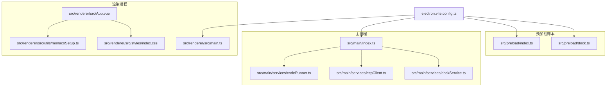
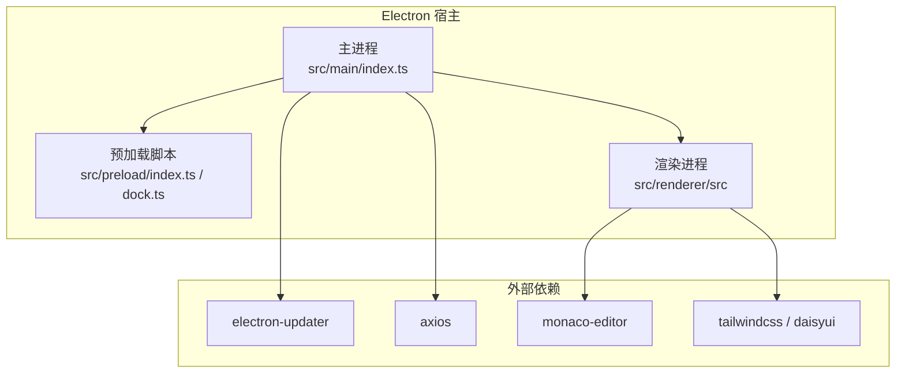
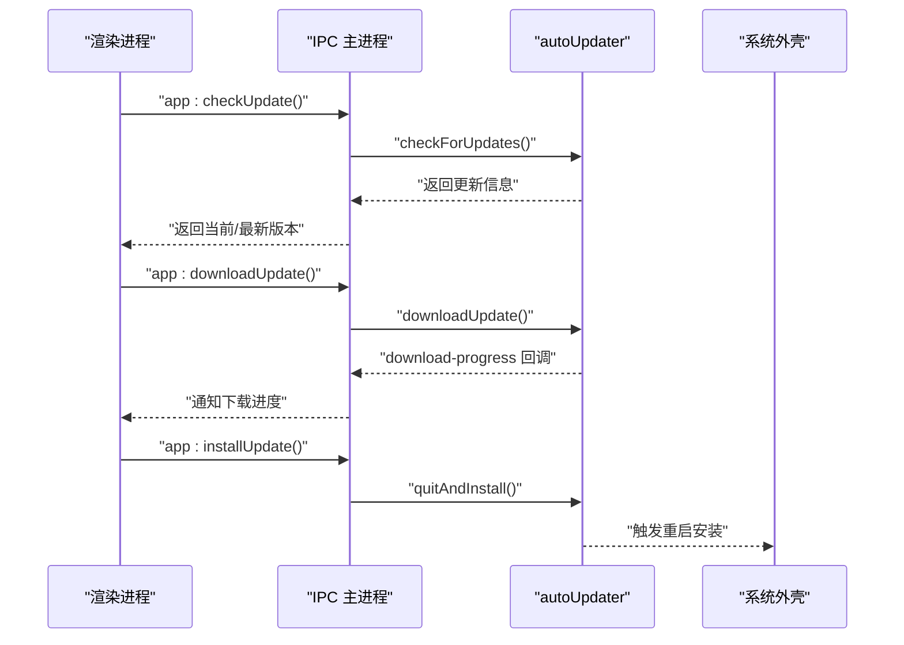
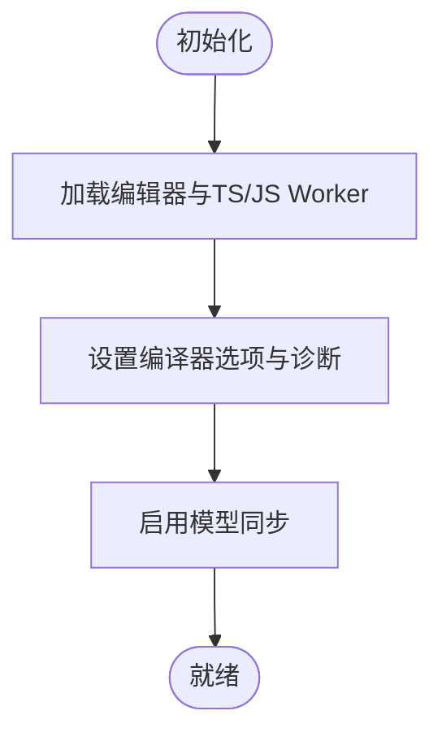
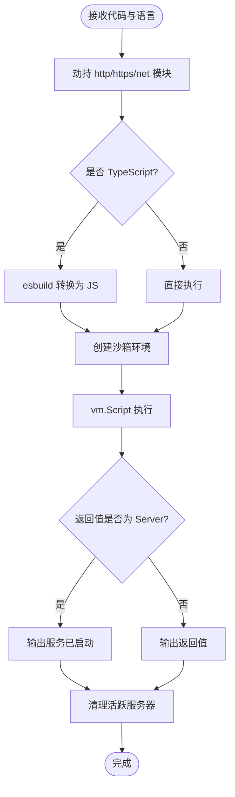
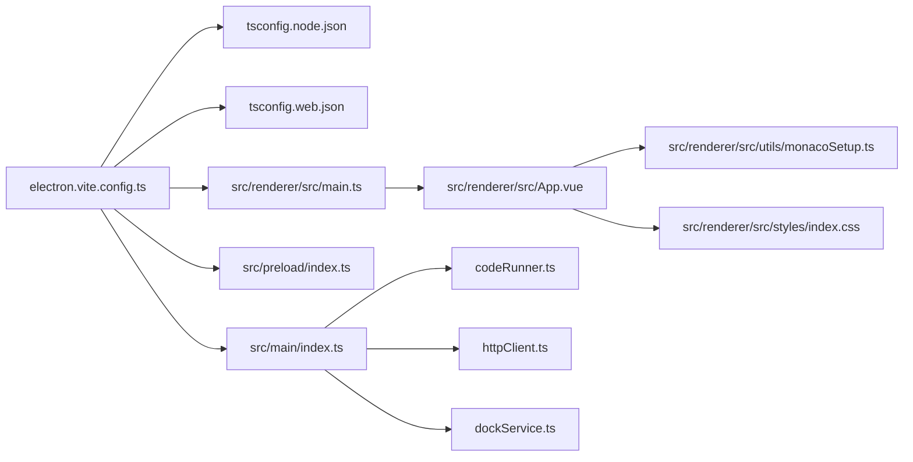

# 技术栈说明

<cite>
**本文引用的文件**
- [package.json](file://package.json)
- [electron.vite.config.ts](file://electron.vite.config.ts)
- [tsconfig.json](file://tsconfig.json)
- [tsconfig.node.json](file://tsconfig.node.json)
- [tsconfig.web.json](file://tsconfig.web.json)
- [src/main/index.ts](file://src/main/index.ts)
- [src/main/services/codeRunner.ts](file://src/main/services/codeRunner.ts)
- [src/main/services/dockService.ts](file://src/main/services/dockService.ts)
- [src/main/services/httpClient.ts](file://src/main/services/httpClient.ts)
- [src/renderer/src/main.ts](file://src/renderer/src/main.ts)
- [src/renderer/src/App.vue](file://src/renderer/src/App.vue)
- [src/renderer/src/styles/index.css](file://src/renderer/src/styles/index.css)
- [src/renderer/src/utils/monacoSetup.ts](file://src/renderer/src/utils/monacoSetup.ts)
- [src/renderer/src/tabs.d.ts](file://src/renderer/src/types.d.ts)
</cite>

## 目录
1. [引言](#引言)
2. [项目结构](#项目结构)
3. [核心组件](#核心组件)
4. [架构总览](#架构总览)
5. [详细组件分析](#详细组件分析)
6. [依赖关系分析](#依赖关系分析)
7. [性能考量](#性能考量)
8. [故障排查指南](#故障排查指南)
9. [结论](#结论)
10. [附录](#附录)

## 引言
本项目采用 Electron 35 + Vue 3 + TypeScript + electron-vite/Vite + TailwindCSS + DaisyUI + Monaco Editor 的组合，构建跨平台桌面应用。技术栈选择兼顾开发体验、性能表现与长期维护成本，既满足现代 Web 开发的工程化要求，又充分发挥桌面应用的系统级能力。本文将系统阐述各技术在项目中的角色、优势与权衡，并给出版本兼容性与升级策略建议。

## 项目结构
项目采用“主进程 + 预加载脚本 + 渲染进程”的三层架构，配合 electron-vite 实现多入口构建（主进程、预加载、渲染器、Dock 窗口）。TypeScript 通过双配置文件分别约束 Node 环境与 Web 环境，确保类型安全与开发效率。

图表来源
- [electron.vite.config.ts:1-49](file://electron.vite.config.ts#L1-L49)
- [src/main/index.ts:1-444](file://src/main/index.ts#L1-L444)
- [src/main/services/codeRunner.ts:1-461](file://src/main/services/codeRunner.ts#L1-L461)
- [src/main/services/httpClient.ts:1-113](file://src/main/services/httpClient.ts#L1-L113)
- [src/main/services/dockService.ts:1-243](file://src/main/services/dockService.ts#L1-L243)
- [src/renderer/src/main.ts:1-6](file://src/renderer/src/main.ts#L1-L6)
- [src/renderer/src/App.vue:1-102](file://src/renderer/src/App.vue#L1-L102)
- [src/renderer/src/utils/monacoSetup.ts:1-76](file://src/renderer/src/utils/monacoSetup.ts#L1-L76)
- [src/renderer/src/styles/index.css:1-171](file://src/renderer/src/styles/index.css#L1-L171)

章节来源
- [electron.vite.config.ts:1-49](file://electron.vite.config.ts#L1-L49)
- [tsconfig.json:1-8](file://tsconfig.json#L1-L8)
- [tsconfig.node.json:1-19](file://tsconfig.node.json#L1-L19)
- [tsconfig.web.json:1-18](file://tsconfig.web.json#L1-L18)

## 核心组件
- Electron 35：提供桌面应用宿主、窗口管理、系统集成（托盘、自动更新、代理）与安全上下文（隔离渲染、预加载）。
- Vue 3 + TypeScript：统一的 UI 框架与强类型保障，结合 Vite 提供快速热更新与按需构建。
- electron-vite：多入口、多环境构建工具，支持主进程、预加载与渲染器的独立配置与别名。
- TailwindCSS + DaisyUI：原子化样式与组件库，快速实现深色主题与一致的视觉语言。
- Monaco Editor：高性能代码编辑器，提供语法高亮、智能感知与 Worker 分离的性能优化。
- 主进程服务：封装代码运行、HTTP 请求、Dock 窗口、自动更新、开机自启等系统能力。

章节来源
- [package.json:28-73](file://package.json#L28-L73)
- [src/main/index.ts:1-444](file://src/main/index.ts#L1-L444)
- [src/renderer/src/App.vue:1-102](file://src/renderer/src/App.vue#L1-L102)

## 架构总览
Electron 35 作为运行时，主进程负责系统级功能与 IPC；预加载脚本提供受限的 Node 能力给渲染进程；渲染进程基于 Vue 3 + TypeScript 构建 UI，使用 TailwindCSS + DaisyUI 实现界面风格，Monaco Editor 提供代码编辑体验。

图表来源
- [src/main/index.ts:1-444](file://src/main/index.ts#L1-L444)
- [src/renderer/src/utils/monacoSetup.ts:1-76](file://src/renderer/src/utils/monacoSetup.ts#L1-L76)
- [src/renderer/src/styles/index.css:1-171](file://src/renderer/src/styles/index.css#L1-L171)
- [package.json:28-73](file://package.json#L28-L73)

## 详细组件分析

### Electron 35：主进程与系统集成
- 窗口与托盘：创建无边框窗口、系统托盘、最大化/最小化控制与关闭行为拦截。
- 自动更新：GitHub 源、下载进度回调、错误处理与安装流程。
- 代理设置：通过 session.setProxy 与环境变量同步，适配网络受限场景。
- IPC 服务：集中注册各类 API（代码运行、HTTP 请求、Dock 控制、应用设置等）。

图表来源
- [src/main/index.ts:129-299](file://src/main/index.ts#L129-L299)

章节来源
- [src/main/index.ts:110-395](file://src/main/index.ts#L110-L395)

### electron-vite：多入口与别名配置
- 主进程、预加载、渲染器三入口，支持别名路径（@main/@preload/@renderer）与 Rollup 输入配置。
- 预加载多入口（index/dock），便于 Dock 窗口独立构建。
- 插件：Vue 插件与 TailwindCSS 插件集成，提升开发体验。

章节来源
- [electron.vite.config.ts:6-48](file://electron.vite.config.ts#L6-L48)

### Vue 3 + TypeScript：渲染层
- 应用入口：创建 Vue 应用并挂载。
- 组件组织：侧边栏、标题栏、全局通知、动态视图切换。
- 类型声明：统一的 API 接口定义，覆盖窗口、代码运行、NPM、Dock、OSS、HTTP、SQL 专家等。

章节来源
- [src/renderer/src/main.ts:1-6](file://src/renderer/src/main.ts#L1-L6)
- [src/renderer/src/App.vue:1-102](file://src/renderer/src/App.vue#L1-L102)
- [src/renderer/src/types.d.ts:1-295](file://src/renderer/src/types.d.ts#L1-L295)

### TailwindCSS + DaisyUI：样式体系
- 原子化与组件化结合，深色主题变量、过渡动画、渐变边框、毛玻璃效果等。
- 通过 daisyui 提供常用组件样式，减少重复 CSS。

章节来源
- [src/renderer/src/styles/index.css:1-171](file://src/renderer/src/styles/index.css#L1-L171)

### Monaco Editor：代码编辑体验
- Worker 分离：编辑器与 TS/JS Worker 独立，避免主线程阻塞。
- 编译器选项：ESNext 目标、Node 解析、严格模式与库配置，启用 eager 模型同步。
- 环境配置：根据标签动态选择 Worker，保证语言特性与诊断可用。

图表来源
- [src/renderer/src/utils/monacoSetup.ts:1-76](file://src/renderer/src/utils/monacoSetup.ts#L1-L76)

章节来源
- [src/renderer/src/utils/monacoSetup.ts:1-76](file://src/renderer/src/utils/monacoSetup.ts#L1-L76)

### 主进程服务：代码运行器
- 代码执行：支持 JavaScript/TypeScript，TypeScript 通过 esbuild 转换。
- 沙箱环境：vm.Context + 自定义 console，限制全局污染。
- 服务器追踪：劫持 http/https/net 模块，跟踪并清理 Server 实例，避免端口占用。
- 模块安全：白名单内置模块与已安装包，避免任意模块加载风险。
- 端口清理：通过系统命令查找并终止占用端口的 Electron 进程。

图表来源
- [src/main/services/codeRunner.ts:1-461](file://src/main/services/codeRunner.ts#L1-L461)

章节来源
- [src/main/services/codeRunner.ts:98-318](file://src/main/services/codeRunner.ts#L98-L318)

### 主进程服务：HTTP 客户端
- 绕过浏览器 CORS 限制，使用 Electron net 模块发起请求。
- 支持超时、头部设置、错误处理与响应聚合。
- 与应用代理设置联动，统一网络策略。

章节来源
- [src/main/services/httpClient.ts:15-112](file://src/main/services/httpClient.ts#L15-L112)

### 主进程服务：Dock 窗口
- macOS 风格 Dock 窗口：透明、置顶、跨工作区可见。
- 动态布局：根据图标数量与尺寸计算窗口大小与位置。
- 行为分发：打开设置、打开文件夹、打开终端、打开浏览器、打开自定义应用或链接。

章节来源
- [src/main/services/dockService.ts:64-229](file://src/main/services/dockService.ts#L64-L229)

## 依赖关系分析
- 构建链路：electron-vite 为入口，分别构建主进程、预加载与渲染器；TypeScript 双配置分别约束 Node 与 Web 环境。
- 运行链路：主进程提供 IPC 服务，渲染进程通过 window.api 调用；Monaco Editor 与样式系统独立加载。
- 外部依赖：electron-updater、axios、monaco-editor、tailwindcss/daisyui、esbuild 等。

图表来源
- [electron.vite.config.ts:1-49](file://electron.vite.config.ts#L1-L49)
- [tsconfig.node.json:1-19](file://tsconfig.node.json#L1-L19)
- [tsconfig.web.json:1-18](file://tsconfig.web.json#L1-L18)
- [src/main/index.ts:1-444](file://src/main/index.ts#L1-L444)
- [src/renderer/src/main.ts:1-6](file://src/renderer/src/main.ts#L1-L6)
- [src/renderer/src/App.vue:1-102](file://src/renderer/src/App.vue#L1-L102)
- [src/renderer/src/utils/monacoSetup.ts:1-76](file://src/renderer/src/utils/monacoSetup.ts#L1-L76)
- [src/renderer/src/styles/index.css:1-171](file://src/renderer/src/styles/index.css#L1-L171)
- [src/main/services/codeRunner.ts:1-461](file://src/main/services/codeRunner.ts#L1-L461)
- [src/main/services/httpClient.ts:1-113](file://src/main/services/httpClient.ts#L1-L113)
- [src/main/services/dockService.ts:1-243](file://src/main/services/dockService.ts#L1-L243)

章节来源
- [package.json:28-73](file://package.json#L28-L73)

## 性能考量
- 构建性能：electron-vite 多入口与 Vite 生态，开发期热更新快、产物体积可控。
- 运行性能：Monaco Editor 使用 Worker 分离与 eager 模型同步，降低主线程压力；TailwindCSS 原子类减少样式计算开销。
- 安全与稳定性：主进程隔离、预加载脚本限制、VM 沙箱与模块白名单，有效降低注入与资源泄漏风险。
- 网络与更新：自动更新与代理设置解耦，避免阻塞 UI；HTTP 客户端统一超时与错误处理。

## 故障排查指南
- 自动更新失败：检查网络与代理设置，关注超时、拒绝连接与 DNS 错误；查看错误回调与通知提示。
- 代码运行卡住：确认是否存在长连接或未关闭的 Server；使用“清理服务器”与“端口终止”功能释放资源。
- Monaco 编辑器无语言支持：确认 Worker 加载与编译器选项；检查标签与 Worker 分配逻辑。
- Dock 窗口无法显示：验证屏幕边界与尺寸计算；确认预加载脚本与主进程通信正常。

章节来源
- [src/main/index.ts:129-299](file://src/main/index.ts#L129-L299)
- [src/main/services/codeRunner.ts:77-96](file://src/main/services/codeRunner.ts#L77-L96)
- [src/main/services/codeRunner.ts:248-318](file://src/main/services/codeRunner.ts#L248-L318)
- [src/renderer/src/utils/monacoSetup.ts:10-18](file://src/renderer/src/utils/monacoSetup.ts#L10-L18)
- [src/main/services/dockService.ts:64-108](file://src/main/services/dockService.ts#L64-L108)

## 结论
本项目通过 Electron 35 + Vue 3 + TypeScript + electron-vite/Vite + TailwindCSS + DaisyUI + Monaco Editor 的组合，实现了高性能、可维护、易扩展的桌面应用。技术选型在开发体验、运行性能与安全稳定之间取得平衡，并提供了清晰的升级路径与最佳实践建议。

## 附录

### 技术版本与兼容性
- Electron 35：提供稳定的桌面应用宿主与系统集成能力。
- Vue 3 + TypeScript：现代化 UI 与强类型保障。
- electron-vite：多入口与 Vite 生态，适配复杂桌面应用。
- TailwindCSS + DaisyUI：原子化与组件化结合，快速构建一致界面。
- Monaco Editor：高性能编辑器，Worker 分离与语言服务完善。

章节来源
- [package.json:62-70](file://package.json#L62-L70)

### 升级策略建议
- 保持主进程与渲染进程依赖版本对齐，优先升级 electron-vite 与 Vite 生态。
- TypeScript 升级前先运行类型检查，确保 tsconfig.node/web 配置兼容。
- TailwindCSS 与 DaisyUI 升级需验证深色主题变量与组件样式一致性。
- Monaco Editor 升级需关注 Worker 加载与编译器选项变更。
- Electron 升级后重点验证自动更新、代理设置与 Dock 窗口行为。

章节来源
- [package.json:28-73](file://package.json#L28-L73)
- [electron.vite.config.ts:1-49](file://electron.vite.config.ts#L1-L49)
- [tsconfig.json:1-8](file://tsconfig.json#L1-L8)
- [tsconfig.node.json:1-19](file://tsconfig.node.json#L1-L19)
- [tsconfig.web.json:1-18](file://tsconfig.web.json#L1-L18)