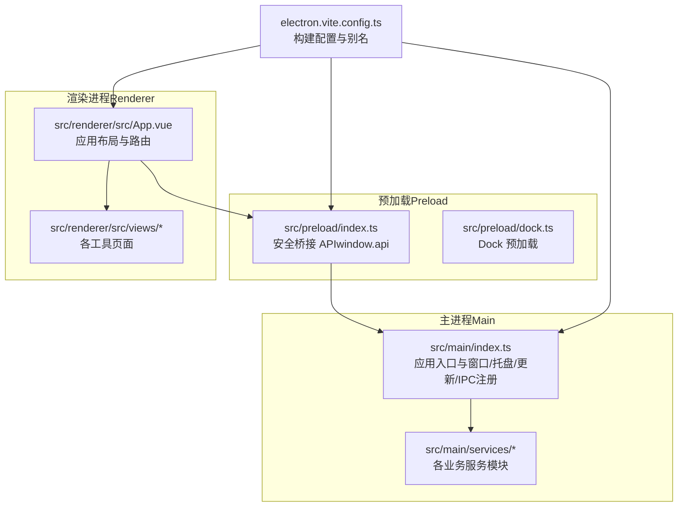
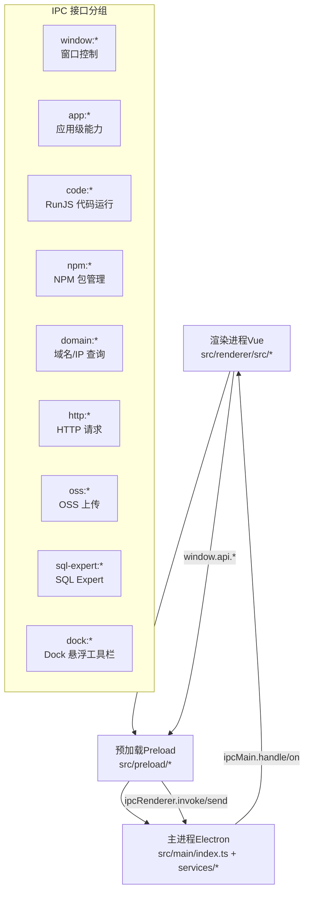
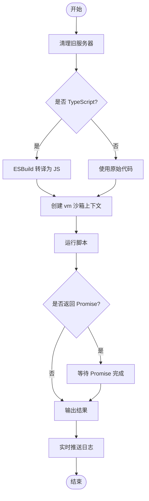
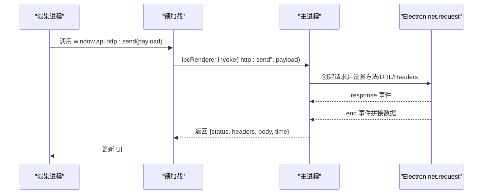
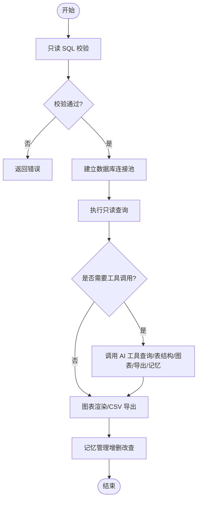
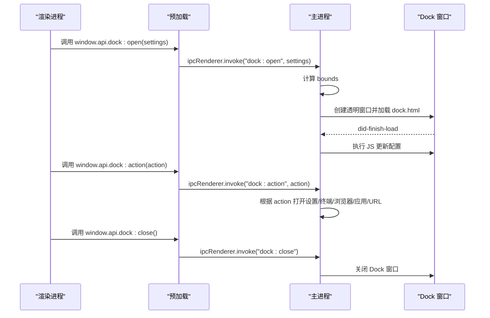
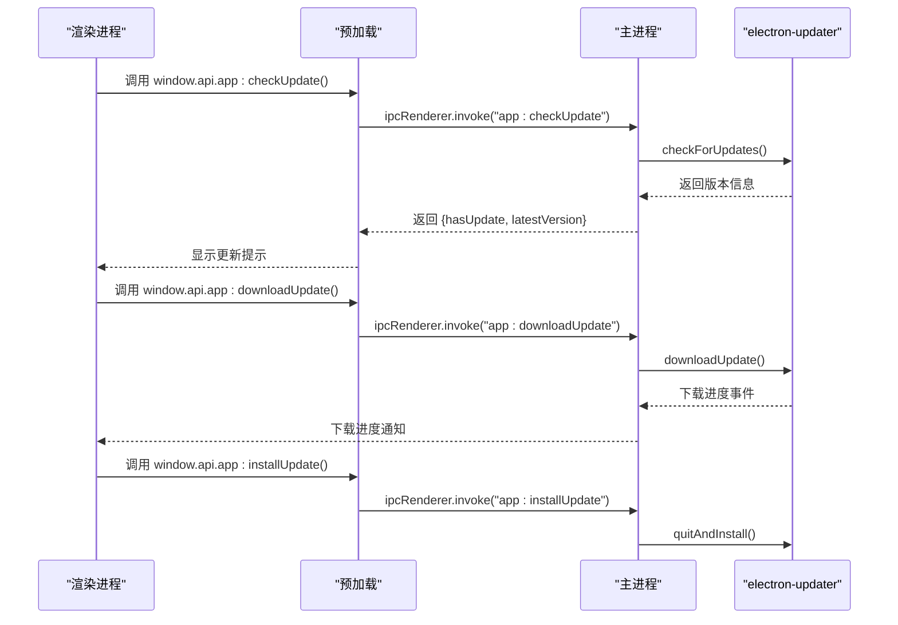
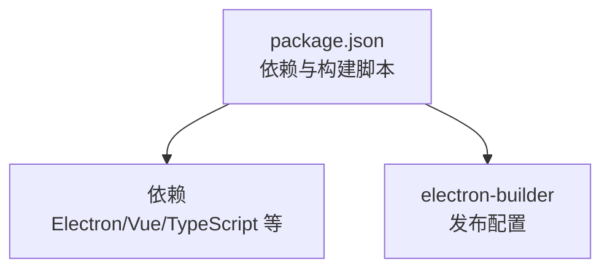

# 项目介绍

<cite>
**本文引用的文件**
- [README.md](file://README.md)
- [DEVELOPMENT.md](file://DEVELOPMENT.md)
- [package.json](file://package.json)
- [electron.vite.config.ts](file://electron.vite.config.ts)
- [src/main/index.ts](file://src/main/index.ts)
- [src/main/services/codeRunner.ts](file://src/main/services/codeRunner.ts)
- [src/main/services/httpClient.ts](file://src/main/services/httpClient.ts)
- [src/main/services/sqlExpert.ts](file://src/main/services/sqlExpert.ts)
- [src/main/services/dockService.ts](file://src/main/services/dockService.ts)
- [src/renderer/src/App.vue](file://src/renderer/src/App.vue)
- [src/renderer/src/views/home/Home.vue](file://src/renderer/src/views/home/Home.vue)
- [resources/README.md](file://resources/README.md)
</cite>

## 目录
1. [引言](#引言)
2. [项目结构](#项目结构)
3. [核心组件](#核心组件)
4. [架构总览](#架构总览)
5. [详细组件分析](#详细组件分析)
6. [依赖关系分析](#依赖关系分析)
7. [性能考量](#性能考量)
8. [故障排查指南](#故障排查指南)
9. [结论](#结论)
10. [附录](#附录)

## 引言
开发者工具箱（Dev Toolbox）是一个基于 Electron + Vue 3 + TypeScript 的桌面开发工具集合，旨在将多种高频开发与运维能力整合到一个统一的客户端中，显著提升日常开发调试、运维监控与 API 测试的工作效率与流程便利性。项目通过模块化设计与安全的 IPC 通信，提供从代码运行、包管理、域名查询、HTTP 请求、OSS 上传，到 SQL 分析与 macOS Dock 风格悬浮工具栏等丰富能力，满足开发者在不同场景下的工具需求。

- 核心价值主张
  - 一站式工具集成：将多个开发工具合并为一个桌面应用，减少切换成本，提升专注度。
  - 安全与隔离：采用 Electron 的上下文隔离与 preload 白名单机制，保障运行时安全。
  - 高效开发体验：提供实时日志、自动更新、代理配置、开机自启动等应用级能力。
  - 可扩展架构：清晰的模块边界与 IPC 接口，便于新增工具模块与持续演进。

- 目标用户群体
  - 前后端工程师：日常调试、API 测试、数据库查询与 SQL 分析。
  - 运维与 SRE：域名/IP 查询、端口扫描、网络诊断与系统工具调用。
  - 产品与运营：可视化数据导出、图表渲染与报表需求辅助。

- 解决的实际问题
  - 多工具切换与环境割裂：统一界面与工作流，降低上下文切换成本。
  - CORS 限制与网络调试：在主进程发起请求，规避前端跨域限制。
  - 本地开发与资源管理：RunJS 代码运行、NPM 包管理与类型提示、OSS 上传。
  - 数据分析与可视化：SQL Expert 结合 AI 与图表渲染，提升数据分析效率。

- 应用场景
  - 日常开发调试：RunJS 实时运行与日志输出、端口占用清理、按端口终止进程。
  - 运维监控：域名/IP 查询、反向 DNS、HTTP 头分析、端口扫描与 nmap 回退。
  - API 测试：HTTP 请求工具在主进程发起请求，支持自定义方法、Header、Body、Timeout。
  - 数据分析：SQL Expert 只读 SQL 校验、Schema 动态加载、AI 多轮工具调用、图表渲染与 CSV 导出。
  - 文件与对象存储：阿里云 OSS 文件/文件夹上传、多文件进度跟踪与任务取消。
  - 工作流优化：macOS Dock 风格悬浮工具栏，支持停靠位置、自动隐藏、快捷动作与拖拽排序。

- 开源理念与社区贡献
  - 项目遵循 MIT 许可，欢迎社区贡献与反馈。
  - 提供完善的开发文档与新增模块指南，便于贡献者快速上手。
  - 通过 GitHub Releases 进行发布与自动更新，便于用户获取最新版本。

- 未来发展规划
  - 持续扩展工具模块，完善 AI 辅助分析能力与可视化工具。
  - 优化性能与稳定性，增强跨平台体验与安全性。
  - 增强插件化与配置化能力，满足不同团队与场景的定制需求。

**章节来源**
- [README.md:1-163](file://README.md#L1-L163)
- [DEVELOPMENT.md:9-21](file://DEVELOPMENT.md#L9-L21)

## 项目结构
项目采用分层架构与模块化组织，主进程负责系统能力与业务服务，渲染进程负责 UI 与交互，preload 作为安全桥接层暴露受控 API。构建工具采用 electron-vite，支持主进程、preload 与渲染进程的独立构建与热更新。

**图示来源**
- [electron.vite.config.ts:6-48](file://electron.vite.config.ts#L6-L48)
- [src/main/index.ts:110-395](file://src/main/index.ts#L110-L395)
- [src/renderer/src/App.vue:11-31](file://src/renderer/src/App.vue#L11-L31)

**章节来源**
- [DEVELOPMENT.md:68-102](file://DEVELOPMENT.md#L68-L102)
- [electron.vite.config.ts:1-49](file://electron.vite.config.ts#L1-L49)
- [src/main/index.ts:1-444](file://src/main/index.ts#L1-L444)
- [src/renderer/src/App.vue:1-102](file://src/renderer/src/App.vue#L1-L102)

## 核心组件
- 应用入口与窗口管理
  - 创建主窗口、系统托盘、窗口控制 IPC、关闭行为策略与自动更新。
  - 支持最小化到托盘、直接退出或询问三种关闭行为，可持久化配置。
- RunJS 代码运行器
  - 支持 JavaScript/TypeScript 运行，实时输出日志，支持常驻服务（如 Express）并自动清理资源。
  - 全局劫持 http/https/net 模块以追踪活跃服务器，避免端口占用；支持按端口终止 Electron 相关进程。
- NPM 包管理
  - 搜索、安装、卸载、切换版本，安装目录可配置，读取已安装包的类型定义（.d.ts），自动尝试补全 @types/*。
- 域名/IP 查询与端口扫描
  - DNS 解析（IPv4/IPv6）、IP 地理位置与运营商信息、反向 DNS 查询、HTTP 头分析识别技术栈。
  - 端口扫描优先使用 nmap，无 nmap 时回退 Socket 扫描。
- HTTP 请求工具
  - 在主进程发起请求，规避前端 CORS 限制，支持常见 HTTP 方法、自定义 Header/Body/Timeout。
- OSS 管理（阿里云 OSS）
  - 文件/文件夹上传、多文件上传进度跟踪、支持上传任务取消。
- SQL Expert（分析专家）
  - MySQL 连接测试与配置持久化、动态读取表结构（Schema）、只读 SQL 校验与执行（限制为 SELECT/WITH）。
  - 接入大模型进行多轮工具调用分析，支持图表渲染与 CSV 导出。
- Dock 模块（macOS Dock 风格悬浮工具栏）
  - 独立透明悬浮窗口，始终置顶，支持底部/左侧/右侧停靠、自动隐藏、图标大小与拖拽排序。
- 应用级能力
  - 自动更新（GitHub Releases）、系统托盘最小化、关闭行为可配置、代理配置、开机自启动。

**章节来源**
- [src/main/index.ts:110-395](file://src/main/index.ts#L110-L395)
- [src/main/services/codeRunner.ts:98-318](file://src/main/services/codeRunner.ts#L98-L318)
- [src/main/services/httpClient.ts:15-112](file://src/main/services/httpClient.ts#L15-L112)
- [src/main/services/sqlExpert.ts:96-170](file://src/main/services/sqlExpert.ts#L96-L170)
- [src/main/services/dockService.ts:111-229](file://src/main/services/dockService.ts#L111-L229)
- [README.md:17-75](file://README.md#L17-L75)

## 架构总览
项目采用三层架构：渲染进程（Vue）负责 UI 与交互；preload 通过 contextBridge 暴露白名单 API；主进程负责系统能力、网络、文件、数据库与 AI 调用。数据流通过 IPC 实现，页面触发操作后经 preload 转发至主进程，执行业务逻辑并返回结果或推送事件流。

**图示来源**
- [DEVELOPMENT.md:114-127](file://DEVELOPMENT.md#L114-L127)
- [DEVELOPMENT.md:213-246](file://DEVELOPMENT.md#L213-L246)
- [src/main/index.ts:175-395](file://src/main/index.ts#L175-L395)

**章节来源**
- [DEVELOPMENT.md:106-127](file://DEVELOPMENT.md#L106-L127)
- [DEVELOPMENT.md:213-246](file://DEVELOPMENT.md#L213-L246)

## 详细组件分析

### RunJS 代码运行器
- 设计要点
  - 使用 vm 沙箱执行代码，限制可 require 范围，避免越权访问。
  - 全局劫持 http/https/net 模块的 createServer，追踪活跃服务器并在每次执行前清理，避免端口占用。
  - 实时日志推送（stdout/stderr），支持 TypeScript 编译与 ESBuild 转译。
  - 支持按端口终止 Electron 相关进程（Windows），避免误杀非 Electron 进程。
- 关键流程
  - 清理旧服务器 -> 编译/转换代码 -> 创建沙箱上下文 -> 运行脚本 -> 捕获输出与错误 -> 返回结果与耗时。

**图示来源**
- [src/main/services/codeRunner.ts:98-246](file://src/main/services/codeRunner.ts#L98-L246)

**章节来源**
- [src/main/services/codeRunner.ts:98-318](file://src/main/services/codeRunner.ts#L98-L318)
- [DEVELOPMENT.md:133-146](file://DEVELOPMENT.md#L133-L146)

### HTTP 请求工具
- 设计要点
  - 在主进程使用 Electron 的 net.request 发起请求，规避前端 CORS 限制。
  - 支持自定义方法、Header、Body、Timeout，统一超时处理与错误返回。
- 关键流程
  - 校验 URL -> 创建 net.request -> 设置请求头 -> 发送请求体 -> 监听 response/end/error -> 组装响应返回。

**图示来源**
- [src/main/services/httpClient.ts:15-112](file://src/main/services/httpClient.ts#L15-L112)
- [DEVELOPMENT.md:170-174](file://DEVELOPMENT.md#L170-L174)

**章节来源**
- [src/main/services/httpClient.ts:15-112](file://src/main/services/httpClient.ts#L15-L112)
- [DEVELOPMENT.md:170-174](file://DEVELOPMENT.md#L170-L174)

### SQL Expert（分析专家）
- 设计要点
  - MySQL 连接池管理与配置持久化，动态读取表结构（Schema），只读 SQL 校验与执行。
  - 接入大模型进行多轮工具调用（查询/表结构/图表/导出/记忆），支持流式内容与用量统计。
  - 记忆库按数据库与 API Key hash 隔离，支持增删改查与增量写回。
- 关键流程
  - 校验 SQL（只读、禁止系统库、禁止 SELECT *、列必须 AS 别名）-> 连接数据库 -> 执行查询 -> 工具调用（可选）-> 图表渲染/CSV 导出 -> 记忆管理。

**图示来源**
- [src/main/services/sqlExpert.ts:365-400](file://src/main/services/sqlExpert.ts#L365-L400)
- [src/main/services/sqlExpert.ts:473-572](file://src/main/services/sqlExpert.ts#L473-L572)
- [src/main/services/sqlExpert.ts:653-739](file://src/main/services/sqlExpert.ts#L653-L739)

**章节来源**
- [src/main/services/sqlExpert.ts:96-170](file://src/main/services/sqlExpert.ts#L96-L170)
- [src/main/services/sqlExpert.ts:365-400](file://src/main/services/sqlExpert.ts#L365-L400)
- [src/main/services/sqlExpert.ts:473-572](file://src/main/services/sqlExpert.ts#L473-L572)
- [src/main/services/sqlExpert.ts:653-739](file://src/main/services/sqlExpert.ts#L653-L739)
- [DEVELOPMENT.md:181-196](file://DEVELOPMENT.md#L181-L196)

### Dock 模块（macOS Dock 风格悬浮工具栏）
- 设计要点
  - 独立透明窗口，始终置顶，支持底部/左侧/右侧停靠，自动隐藏与图标大小配置。
  - 支持快捷动作（打开设置、打开文件夹、打开终端、打开浏览器、打开应用/URL）。
- 关键流程
  - 计算窗口尺寸与位置 -> 创建透明窗口 -> 加载 Dock HTML -> 发送配置 -> 处理动作事件 -> 关闭时恢复主窗口。

**图示来源**
- [src/main/services/dockService.ts:111-229](file://src/main/services/dockService.ts#L111-L229)

**章节来源**
- [src/main/services/dockService.ts:111-229](file://src/main/services/dockService.ts#L111-L229)
- [DEVELOPMENT.md:197-202](file://DEVELOPMENT.md#L197-L202)

### 应用级能力（自动更新、托盘、代理、开机自启动、关闭行为）
- 设计要点
  - 自动更新：GitHub Releases，支持下载进度与安装。
  - 托盘：最小化到托盘、双击显示主窗口、退出应用。
  - 代理：设置 HTTPS_PROXY/HTTP_PROXY 环境变量与 Electron session。
  - 开机自启动：使用 auto-launch 库。
  - 关闭行为：询问/最小化/退出，可持久化配置。
- 关键流程
  - 检查更新 -> 下载更新 -> 安装更新 -> 退出并重启。
  - 设置代理 -> 应用到 session 与 autoUpdater -> 通知结果。
  - 设置开机自启动 -> 启用/禁用 -> 通知结果。

**图示来源**
- [src/main/index.ts:218-299](file://src/main/index.ts#L218-L299)

**章节来源**
- [src/main/index.ts:218-299](file://src/main/index.ts#L218-L299)
- [DEVELOPMENT.md:203-210](file://DEVELOPMENT.md#L203-L210)

## 依赖关系分析
- 技术栈
  - Electron 35、Vue 3、TypeScript、electron-vite/Vite、TailwindCSS + DaisyUI、Monaco Editor、mysql2、OpenAI SDK、ali-oss、axios。
- 构建与打包
  - electron-builder 配置 GitHub 发布，支持多平台构建与安装包生成。
- 依赖关系图

**图示来源**
- [package.json:28-118](file://package.json#L28-L118)

**章节来源**
- [package.json:28-118](file://package.json#L28-L118)
- [README.md:76-84](file://README.md#L76-L84)

## 性能考量
- 代码运行与资源管理
  - RunJS 在每次执行前清理活跃服务器，避免端口占用与资源泄漏；VM 沙箱限制可 require 范围，减少不必要的模块加载。
- 网络与请求
  - HTTP 请求在主进程发起，避免前端 CORS 限制；统一超时与错误处理，减少 UI 卡顿。
- 数据库与 AI
  - SQL Expert 使用连接池与只读 SQL 校验，限制工具调用频率与返回行数，避免数据库压力过大；AI 流式返回与用量统计，优化用户体验。
- UI 与交互
  - 渲染进程采用异步组件与 KeepAlive，减少重复渲染；TailwindCSS 与 DaisyUI 提升样式一致性与开发效率。

[本节为通用指导，无需特定文件来源]

## 故障排查指南
- 更新检查失败
  - 多为网络问题，先在设置中配置代理（HTTPS_PROXY/HTTP_PROXY）后重试。
- RunJS 包安装异常
  - 检查 NPM 安装目录是否有写权限，必要时重启应用并重新加载类型。
- 端口扫描慢或结果少
  - 优先安装 nmap 提升扫描效果；无 nmap 时会回退 Socket 扫描，仅覆盖常见端口。
- SQL Expert 无法回答
  - 先检查 DB 配置与 schema 是否加载成功；再检查 AI URL/API Key/Model 是否有效。
- 关闭行为与托盘
  - 若最小化到托盘后无法恢复，检查托盘菜单是否正常；若关闭行为不符合预期，检查持久化配置。

**章节来源**
- [DEVELOPMENT.md:327-347](file://DEVELOPMENT.md#L327-L347)

## 结论
开发者工具箱通过模块化设计与安全的 IPC 通信，将多种开发与运维工具整合到一个桌面应用中，显著提升了日常开发调试、运维监控与 API 测试的工作效率。其清晰的架构、丰富的功能与良好的扩展性，使其成为开发者日常工作中的得力助手。未来将持续扩展工具模块、优化性能与稳定性，并增强插件化与配置化能力，满足不同团队与场景的定制需求。

[本节为总结，无需特定文件来源]

## 附录
- 快速开始
  - 安装依赖：npm install
  - 启动开发环境：npm run dev
- 常用命令
  - 代码检查：npm run lint / npm run typecheck
  - 格式化：npm run format
  - 构建：npm run build / npm run build:win / npm run build:mac / npm run build:linux
  - 版本号补丁升级：npm run bump:patch
- 配置说明
  - 代理：在应用「设置」中配置代理地址（例如 http://127.0.0.1:7890），用于网络请求与更新检查。
  - SQL Expert：在应用内配置 MySQL 连接信息与 AI 服务参数，相关配置与缓存保存在 Electron 用户目录中。
  - OSS：使用前需准备 accessKeyId、accessKeySecret、endpoint、bucket。

**章节来源**
- [README.md:86-163](file://README.md#L86-L163)
- [DEVELOPMENT.md:24-58](file://DEVELOPMENT.md#L24-L58)