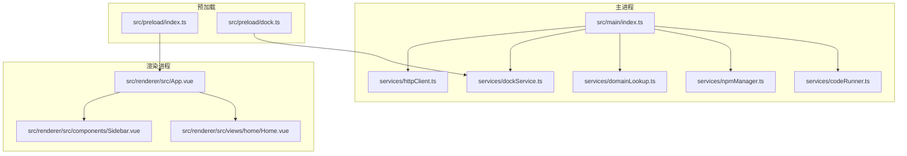
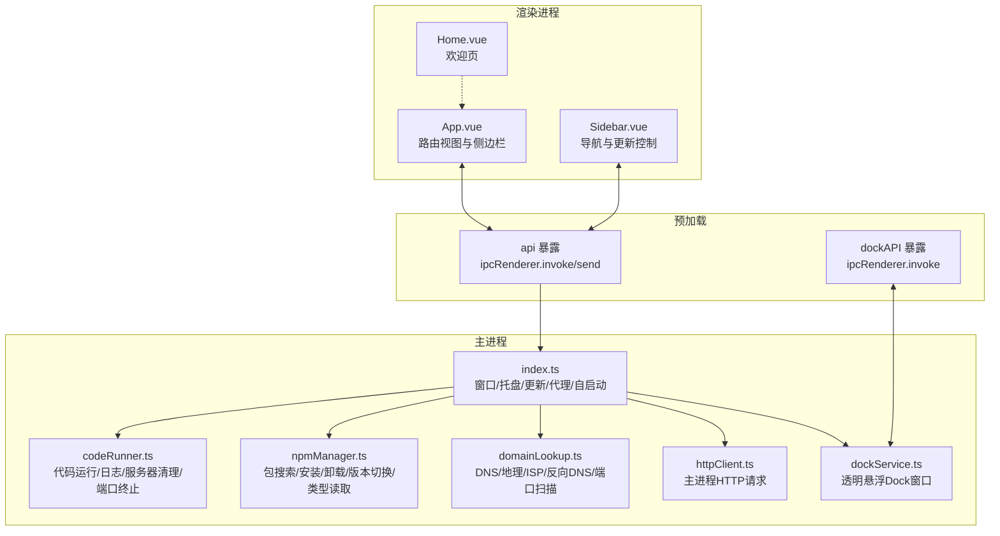
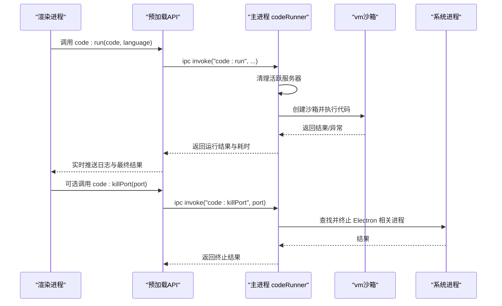
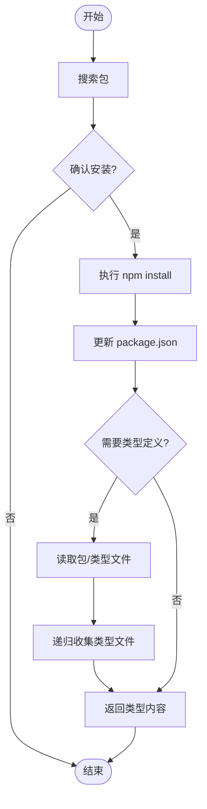
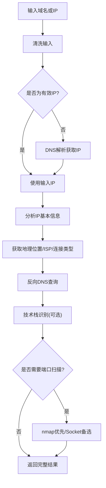
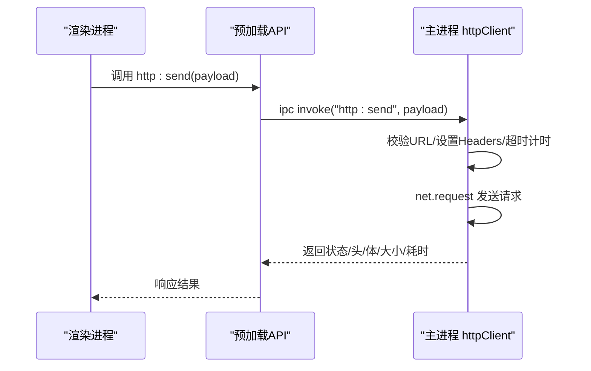
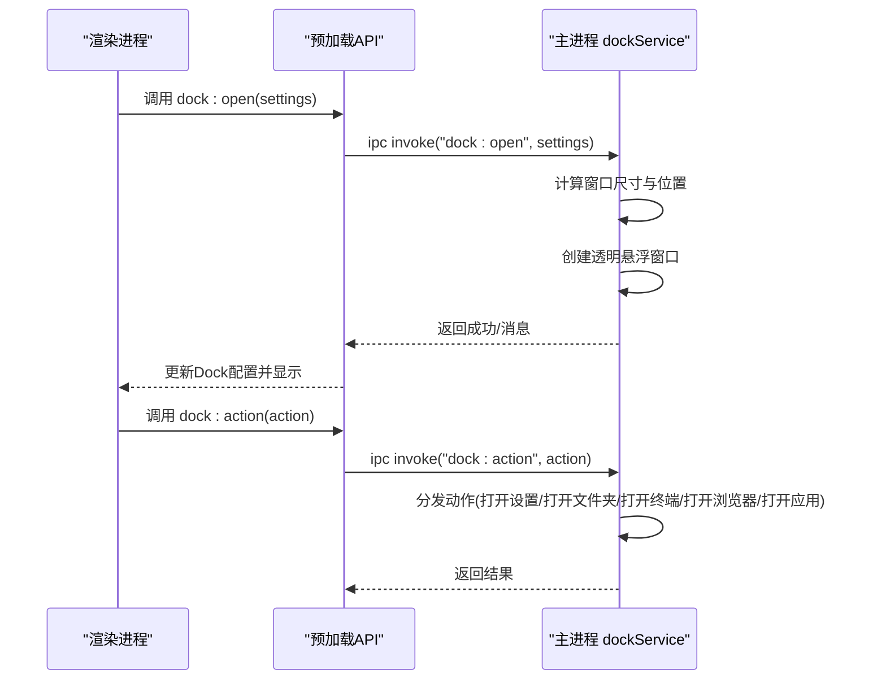
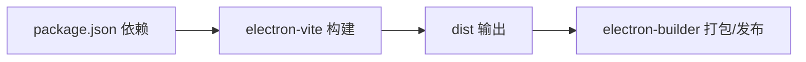

# 项目概述

<cite>
**本文档引用的文件**
- [README.md](file://README.md)
- [package.json](file://package.json)
- [electron.vite.config.ts](file://electron.vite.config.ts)
- [src/main/index.ts](file://src/main/index.ts)
- [src/main/services/codeRunner.ts](file://src/main/services/codeRunner.ts)
- [src/main/services/dockService.ts](file://src/main/services/dockService.ts)
- [src/main/services/npmManager.ts](file://src/main/services/npmManager.ts)
- [src/main/services/domainLookup.ts](file://src/main/services/domainLookup.ts)
- [src/main/services/httpClient.ts](file://src/main/services/httpClient.ts)
- [src/preload/index.ts](file://src/preload/index.ts)
- [src/preload/dock.ts](file://src/preload/dock.ts)
- [src/renderer/src/App.vue](file://src/renderer/src/App.vue)
- [src/renderer/src/views/home/Home.vue](file://src/renderer/src/views/home/Home.vue)
- [src/renderer/src/components/Sidebar.vue](file://src/renderer/src/components/Sidebar.vue)
</cite>

## 目录
1. [引言](#引言)
2. [项目结构](#项目结构)
3. [核心组件](#核心组件)
4. [架构总览](#架构总览)
5. [详细组件分析](#详细组件分析)
6. [依赖关系分析](#依赖关系分析)
7. [性能考虑](#性能考虑)
8. [故障排除指南](#故障排除指南)
9. [结论](#结论)

## 引言

开发者工具箱（Dev Toolbox）是一个基于 Electron + Vue 3 + TypeScript 的桌面开发工具集合，旨在将多种高频开发与运维能力整合到一个统一的客户端应用中。项目通过模块化的主进程服务与渲染进程界面分离，提供跨平台的桌面体验，并支持自动更新、系统托盘、开机自启动、代理配置等应用级能力。

项目核心价值体现在：
- 高频工具一体化：将代码运行器、NPM 包管理、域名/IP 查询、HTTP 客户端、OSS 管理、SQL 专家、Dock 悬浮工具等工具整合在同一应用，减少切换成本。
- 安全与隔离：主进程负责系统级操作与网络请求，渲染进程通过安全桥接 API 调用，既保证功能完整性又提升安全性。
- 跨平台与易用性：基于 Electron 实现 Windows/macOS/Linux 三端一致体验；提供简洁直观的侧边导航与主题化界面。

## 项目结构

项目采用“主进程 + 预加载桥接 + 渲染进程”的三层架构，配合 electron-vite 的多入口构建配置，实现主进程、预加载脚本与渲染进程的独立开发与构建。

**图示来源**
- [src/main/index.ts:1-444](file://src/main/index.ts#L1-L444)
- [src/main/services/codeRunner.ts:1-461](file://src/main/services/codeRunner.ts#L1-L461)
- [src/main/services/npmManager.ts:1-635](file://src/main/services/npmManager.ts#L1-L635)
- [src/main/services/domainLookup.ts:1-690](file://src/main/services/domainLookup.ts#L1-L690)
- [src/main/services/dockService.ts:1-243](file://src/main/services/dockService.ts#L1-L243)
- [src/main/services/httpClient.ts:1-113](file://src/main/services/httpClient.ts#L1-L113)
- [src/preload/index.ts:1-229](file://src/preload/index.ts#L1-L229)
- [src/preload/dock.ts:1-19](file://src/preload/dock.ts#L1-L19)
- [src/renderer/src/App.vue:1-102](file://src/renderer/src/App.vue#L1-L102)
- [src/renderer/src/views/home/Home.vue:1-220](file://src/renderer/src/views/home/Home.vue#L1-L220)
- [src/renderer/src/components/Sidebar.vue:1-385](file://src/renderer/src/components/Sidebar.vue#L1-L385)

**章节来源**
- [README.md:1-163](file://README.md#L1-L163)
- [package.json:1-120](file://package.json#L1-L120)
- [electron.vite.config.ts:1-49](file://electron.vite.config.ts#L1-L49)

## 核心组件

- 应用主进程与生命周期管理
  - 负责窗口创建、系统托盘、自动更新、代理设置、开机自启动、窗口关闭行为策略等。
  - 通过 IPC 注册各功能模块的主进程服务，统一对外暴露能力。

- 预加载桥接层
  - 通过 contextBridge 暴露受控 API 至渲染进程，封装 IPC 调用，提供类型安全的调用接口。
  - Dock 窗口拥有独立预加载脚本，仅暴露必要动作 API。

- 渲染进程与界面
  - 基于 Vue 3 + TypeScript，采用路由式视图组件与 KeepAlive 保持状态。
  - 侧边栏提供工具导航、版本检查与更新流程，首页展示欢迎与时间信息。

- 功能模块（主进程服务）
  - 代码运行器：支持 JS/TS 运行、实时日志、服务器资源清理、端口进程终止。
  - NPM 包管理：搜索、安装、卸载、版本切换、类型定义读取与自动补全。
  - 域名/IP 查询：DNS 解析、地理位置与 ISP、反向 DNS、HTTP 头技术栈识别、端口扫描（Nmap 优先）。
  - HTTP 客户端：在主进程发起请求，规避前端 CORS 限制，支持超时与头部自定义。
  - OSS 管理：阿里云 OSS 文件/文件夹上传、进度跟踪与任务取消。
  - SQL 专家：MySQL 连接测试、表结构读取、只读 SQL 校验与执行、AI 多轮工具调用、图表渲染与 CSV 导出。
  - Dock 悬浮工具：透明悬浮窗口、停靠位置与尺寸计算、动作分发（打开设置、打开文件夹、打开终端、打开浏览器、打开应用等）。

**章节来源**
- [src/main/index.ts:1-444](file://src/main/index.ts#L1-L444)
- [src/preload/index.ts:1-229](file://src/preload/index.ts#L1-L229)
- [src/preload/dock.ts:1-19](file://src/preload/dock.ts#L1-L19)
- [src/renderer/src/App.vue:1-102](file://src/renderer/src/App.vue#L1-L102)
- [src/renderer/src/views/home/Home.vue:1-220](file://src/renderer/src/views/home/Home.vue#L1-L220)
- [src/renderer/src/components/Sidebar.vue:1-385](file://src/renderer/src/components/Sidebar.vue#L1-L385)

## 架构总览

项目采用“主进程服务 + 预加载桥接 + 渲染进程界面”的分层架构，结合 electron-vite 的多入口配置，实现模块化开发与构建。

**图示来源**
- [src/renderer/src/App.vue:1-102](file://src/renderer/src/App.vue#L1-L102)
- [src/renderer/src/views/home/Home.vue:1-220](file://src/renderer/src/views/home/Home.vue#L1-L220)
- [src/renderer/src/components/Sidebar.vue:1-385](file://src/renderer/src/components/Sidebar.vue#L1-L385)
- [src/preload/index.ts:1-229](file://src/preload/index.ts#L1-L229)
- [src/preload/dock.ts:1-19](file://src/preload/dock.ts#L1-L19)
- [src/main/index.ts:1-444](file://src/main/index.ts#L1-L444)
- [src/main/services/codeRunner.ts:1-461](file://src/main/services/codeRunner.ts#L1-L461)
- [src/main/services/npmManager.ts:1-635](file://src/main/services/npmManager.ts#L1-L635)
- [src/main/services/domainLookup.ts:1-690](file://src/main/services/domainLookup.ts#L1-L690)
- [src/main/services/httpClient.ts:1-113](file://src/main/services/httpClient.ts#L1-L113)
- [src/main/services/dockService.ts:1-243](file://src/main/services/dockService.ts#L1-L243)

## 详细组件分析

### 代码运行器（RunJS）

- 功能要点
  - 支持 JavaScript/TypeScript 运行，TypeScript 通过 esbuild 编译为 ESModule。
  - 使用 vm 沙箱执行，捕获 console 输出与错误，实时通过 IPC 发送到渲染进程。
  - 全局劫持 http/https/net 模块，追踪并清理服务器实例，避免端口占用。
  - 提供“停止”“清理”“按端口终止进程”等控制能力。

- 关键流程（运行与清理）

**图示来源**
- [src/main/services/codeRunner.ts:1-461](file://src/main/services/codeRunner.ts#L1-L461)
- [src/preload/index.ts:62-69](file://src/preload/index.ts#L62-L69)

**章节来源**
- [src/main/services/codeRunner.ts:1-461](file://src/main/services/codeRunner.ts#L1-L461)

### NPM 包管理

- 功能要点
  - 搜索、安装、卸载、列出、切换版本。
  - 包安装目录可配置，默认位于用户数据目录，支持写权限校验与回退。
  - 类型定义读取与自动补全（@types 包），递归收集类型文件并去重。
  - 与代码运行器共享包目录，保障运行时模块解析一致性。

- 关键流程（安装与类型读取）

**图示来源**
- [src/main/services/npmManager.ts:207-552](file://src/main/services/npmManager.ts#L207-L552)

**章节来源**
- [src/main/services/npmManager.ts:1-635](file://src/main/services/npmManager.ts#L1-L635)

### 域名/IP 查询

- 功能要点
  - DNS 解析（IPv4/IPv6）、反向 DNS、IP 地理位置与 ISP、连接类型识别。
  - 技术栈识别（Server/Framework/CDN）通过 HTTP/HTTPS HEAD 请求分析响应头。
  - 端口扫描：优先使用 nmap，未安装时回退到 Socket 扫描，支持版本指纹提取与乱码解码。

- 关键流程（统一查询）

**图示来源**
- [src/main/services/domainLookup.ts:607-666](file://src/main/services/domainLookup.ts#L607-L666)

**章节来源**
- [src/main/services/domainLookup.ts:1-690](file://src/main/services/domainLookup.ts#L1-L690)

### HTTP 客户端

- 功能要点
  - 在主进程使用 Electron net 发起请求，绕过前端 CORS 限制。
  - 支持自定义方法、URL、Headers、Body、Timeout。
  - 统一错误处理与超时控制，返回状态码、响应头、正文、字节大小与耗时。

- 关键流程（请求发送）

**图示来源**
- [src/main/services/httpClient.ts:1-113](file://src/main/services/httpClient.ts#L1-L113)
- [src/preload/index.ts:106-115](file://src/preload/index.ts#L106-L115)

**章节来源**
- [src/main/services/httpClient.ts:1-113](file://src/main/services/httpClient.ts#L1-L113)

### Dock 悬浮工具

- 功能要点
  - 透明悬浮窗口，支持底部/左侧/右侧停靠，图标大小与自动隐藏可配置。
  - Dock 应用项支持自定义图标、动作与分隔符，支持拖拽排序。
  - 动作分发：打开设置、打开文件夹、打开终端、打开浏览器、打开应用等。

- 关键流程（Dock 打开与动作）

**图示来源**
- [src/main/services/dockService.ts:111-229](file://src/main/services/dockService.ts#L111-L229)
- [src/preload/dock.ts:1-19](file://src/preload/dock.ts#L1-L19)

**章节来源**
- [src/main/services/dockService.ts:1-243](file://src/main/services/dockService.ts#L1-L243)

### 应用级能力

- 自动更新：基于 electron-updater，支持检查更新、下载进度、下载完成与静默安装。
- 系统托盘：最小化到托盘、双击显示主窗口、退出应用。
- 关闭行为：可配置为“询问/最小化/退出”，支持记住用户选择。
- 代理设置：支持设置/清除代理，自动应用到会话与自动更新。
- 开机自启动：使用 auto-launch 库实现。

**章节来源**
- [src/main/index.ts:1-444](file://src/main/index.ts#L1-L444)

## 依赖关系分析

- 技术栈与外部依赖
  - Electron 35、Vue 3、TypeScript、electron-vite/Vite、TailwindCSS + DaisyUI、Monaco Editor、mysql2、OpenAI SDK、ali-oss、axios 等。
  - 通过 electron-builder 进行跨平台打包与发布，配置 GitHub Releases。

- 构建与打包
  - electron-vite 多入口：main、preload（含 dock）、renderer（含 dock.html）。
  - 预加载脚本分别暴露通用 API 与 Dock 专用 API，隔离作用域。

**图示来源**
- [package.json:28-118](file://package.json#L28-L118)
- [electron.vite.config.ts:6-48](file://electron.vite.config.ts#L6-L48)

**章节来源**
- [package.json:1-120](file://package.json#L1-L120)
- [electron.vite.config.ts:1-49](file://electron.vite.config.ts#L1-L49)

## 性能考虑

- 代码运行器
  - 使用 vm 沙箱与模块劫持，避免全局污染；对大型对象输出进行截断与格式化，减少渲染压力。
  - 服务器实例追踪与清理，防止端口占用与僵尸进程。

- NPM 管理
  - 类型文件递归收集时使用访问记录避免循环依赖；版本切换与安装采用超时控制，防止阻塞。

- 域名查询
  - 端口扫描优先使用 nmap，未安装时采用并发 Socket 扫描，限制并发批次，平衡速度与稳定性。
  - 技术栈识别仅做 HEAD 请求，避免大体积响应。

- HTTP 客户端
  - 主进程请求，避免前端 CORS 限制；超时控制与错误处理统一，减少 UI 卡顿。

- Dock 悬浮
  - 透明窗口与 alwaysOnTop 设置，窗口尺寸按图标数量动态计算，减少重绘与布局抖动。

## 故障排除指南

- 自动更新失败
  - 现象：检查/下载更新失败，提示网络超时或连接拒绝。
  - 处理：在设置中配置代理后重试；确认网络可达 GitHub Releases。

- 端口占用导致运行失败
  - 现象：代码运行器提示端口被占用。
  - 处理：使用“按端口终止进程”功能清理占用；或手动清理相关进程。

- NPM 包安装/类型读取失败
  - 现象：安装超时、类型文件缺失、@types 未找到。
  - 处理：更换镜像源、检查目录写权限、等待自动安装 @types、重试安装。

- 域名查询无结果
  - 现象：DNS 解析失败、IP 信息缺失。
  - 处理：检查网络连通性、确认域名正确、尝试反向 DNS 与端口扫描。

- HTTP 请求异常
  - 现象：超时、错误状态码、无响应。
  - 处理：调整超时时间、检查 Headers/Body、确认目标站点可达。

**章节来源**
- [src/main/index.ts:134-157](file://src/main/index.ts#L134-L157)
- [src/main/services/codeRunner.ts:248-318](file://src/main/services/codeRunner.ts#L248-L318)
- [src/main/services/npmManager.ts:188-194](file://src/main/services/npmManager.ts#L188-L194)
- [src/main/services/domainLookup.ts:590-602](file://src/main/services/domainLookup.ts#L590-L602)
- [src/main/services/httpClient.ts:38-50](file://src/main/services/httpClient.ts#L38-L50)

## 结论

开发者工具箱通过 Electron + Vue 3 + TypeScript 的组合，将高频开发工具整合为一个统一、安全、跨平台的桌面应用。其模块化主进程服务、受控预加载桥接与渲染进程界面，既满足初学者的易用性需求，也为有经验的开发者提供了清晰的扩展点与稳定的架构基础。借助自动更新、系统托盘、代理与开机自启动等应用级能力，项目在日常开发与运维场景中具备良好的实用性与可维护性。